# An Adventure in Statistics

**Getting Started with R, RStudio and Quarto**

Professor Andy Field, University of Sussex

Links: [bsky.app](https://bsky.app/profile/profandyfield.bsky.social) \| [youtube.com](https://www.youtube.com/user/ProfAndyField) \| [discoveringstatistics.com](https://www.discoveringstatistics.com) \| [discovr.rocks](https://www.discovr.rocks) \| [statisticsadventure.com](https://www.statisticsadventure.com)

## About this version

This is a plain-text version of the lecture slides. Each slide starts with a heading such as “Slide 5”, and the numbers match the slide numbers shown in the lecture. Content that appeared one piece at a time, in columns or in tabs is shown in reading order. Videos and interactive apps are given as links.

## Slide 2: Key information

### Teaching

- 1 × weekly lecture (2 in weeks 1, 2 & 7) on theory
- 1 × weekly practical class (2 in weeks 1 and 2) about R, RStudio and Quarto

### Assessment

- 2 × 48-hour Take Away Papers (TAPs)
  - TAP 1: 25% (Week 6)
  - TAP 2: 30% (Week 9)
- Report: 45% (A1)

## Slide 3 (new section): Part 1: Introducing R and RStudio

## Slide 4: Why R?

- Transferable skills
- R is the most widely used data analysis software
- Reproducible science
- Cutting edge
- One stop shop
- RStudio is amazeballs

## Slide 5

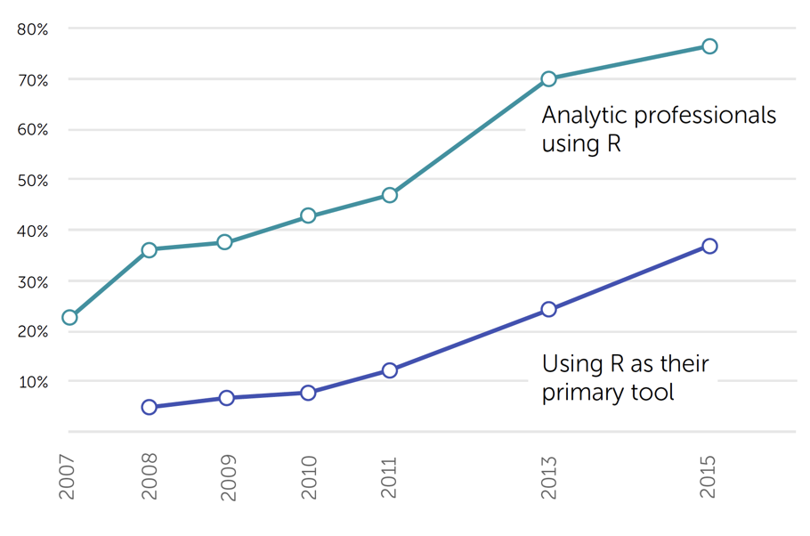

## Slide 6

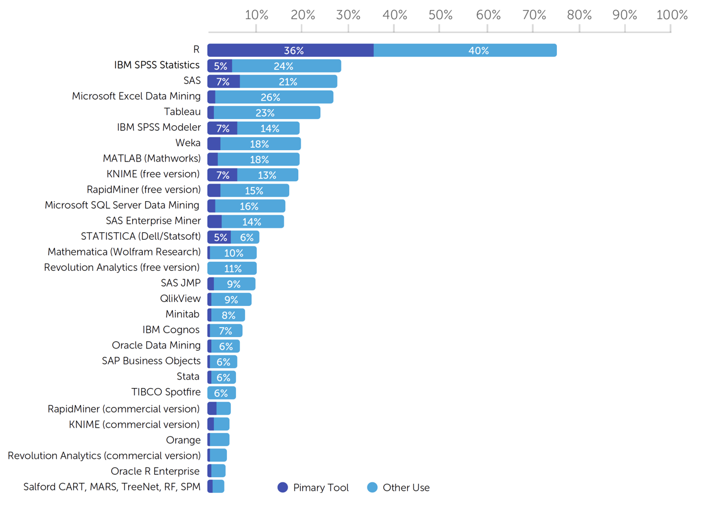

## Slide 7: A Car Analogy

### R The engine

- Free software environment for statistical analysis and graphics

### RStudio The dashboard

- A free integrated development environment (IDE) for R
- You use RStudio as a way to interact with R

### Quarto The paint job

- A document creation system used within RStudio
- A quarto document is like a word processing document in which you can embed (and execute) code
- ‘Render’ the quarto document into a beautiful report containing text, code and output from the code.

## Slide 8

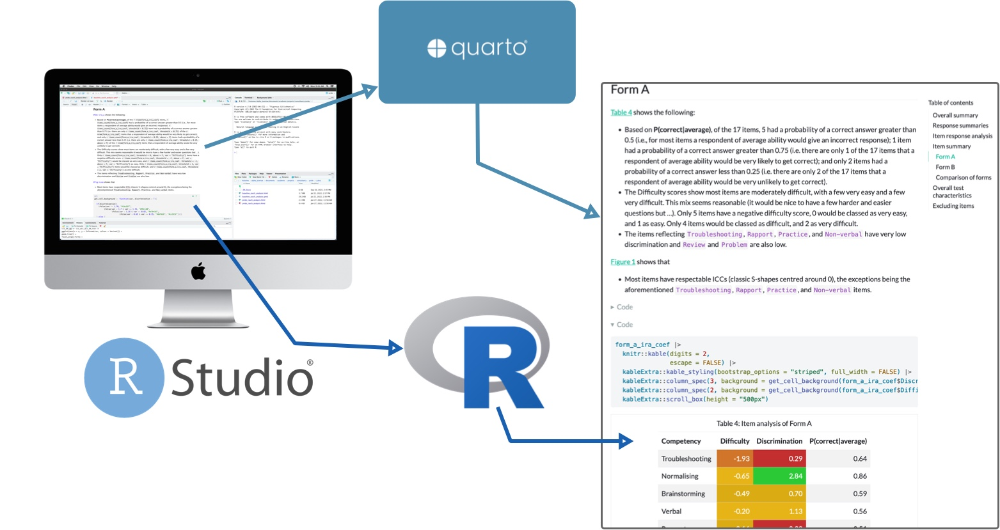

## Slide 9 (new section): Part 2: Workflow in RStudio

## Slide 10: RStudio project files


A file created by RStudio with the extension **.Rproj**

- Stores information about the containing folder
- Restores the previous state of the project (i.e. what documents/tabs were open)
- Opening a project file sets the working directory to the folder containing the project file
  - You can use relative file paths
  - Outside of Posit cloud you can share the project folder and it will work on any machine/operating system you care to use

> **Tip: Have a go!**
>
> - Use project files!
> - Posit cloud automatically uses them!
> - Create an RStudio project called `my_adventr` on **RStudio cloud**

## Slide 11: Creating a project


## Slide 12


## Slide 13

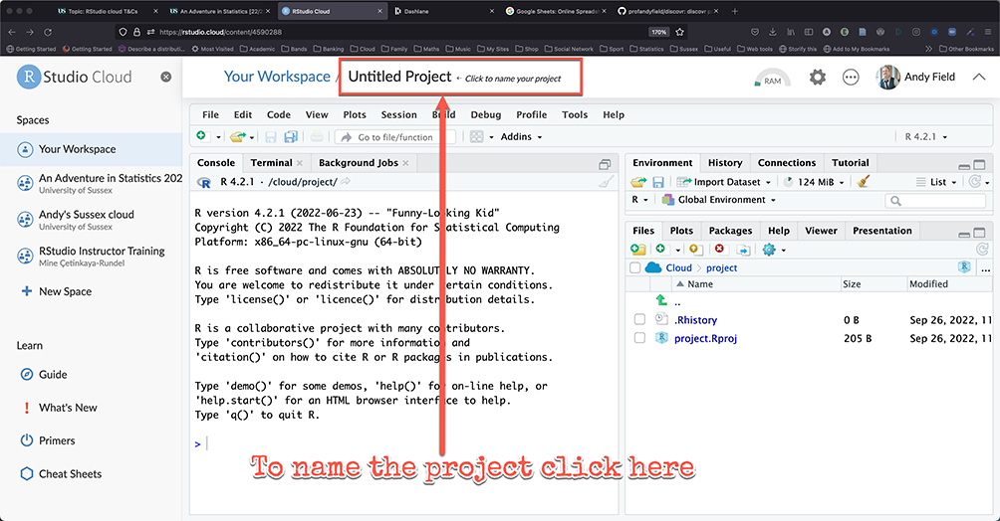

## Slide 14: Get organized!

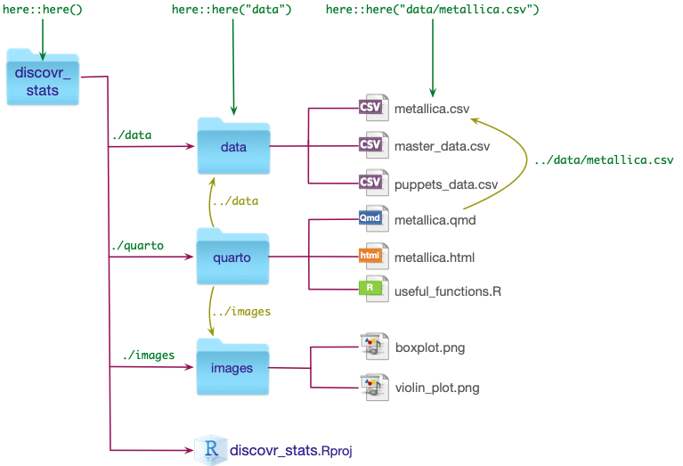

## Slide 15: Try it!

Within your RStudio project called `my_adventr` create folders called

- `data`
- `quarto`

Copy the following files from canvas

- `eddiefy.csv` to the `data` folder


## Slide 16: Customizing RStudio

### Use the native pipe (`|>`)

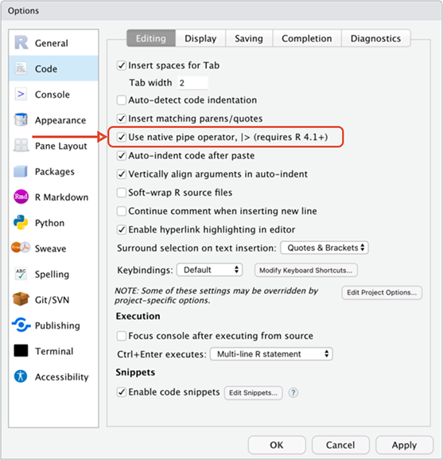

## Slide 17: Colour scheme

> **Tip: Have a go!**
>
> - Windows
>   - `Tools > Options`
> - MacOS
>   - `Tools > Global Options`
>   - `Tools > Project options`


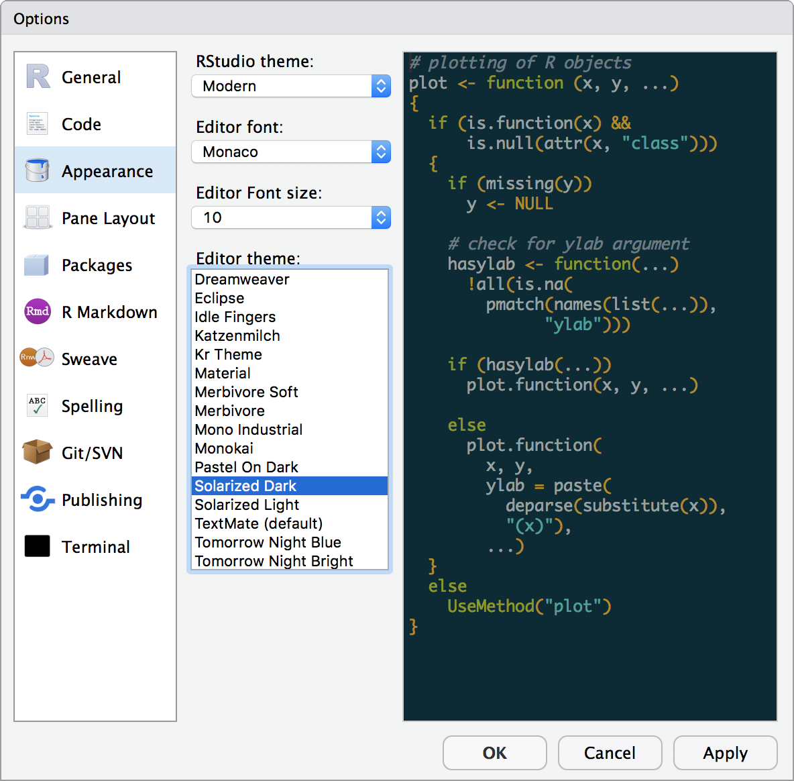

## Slide 18: Pane locations

### Have a go!


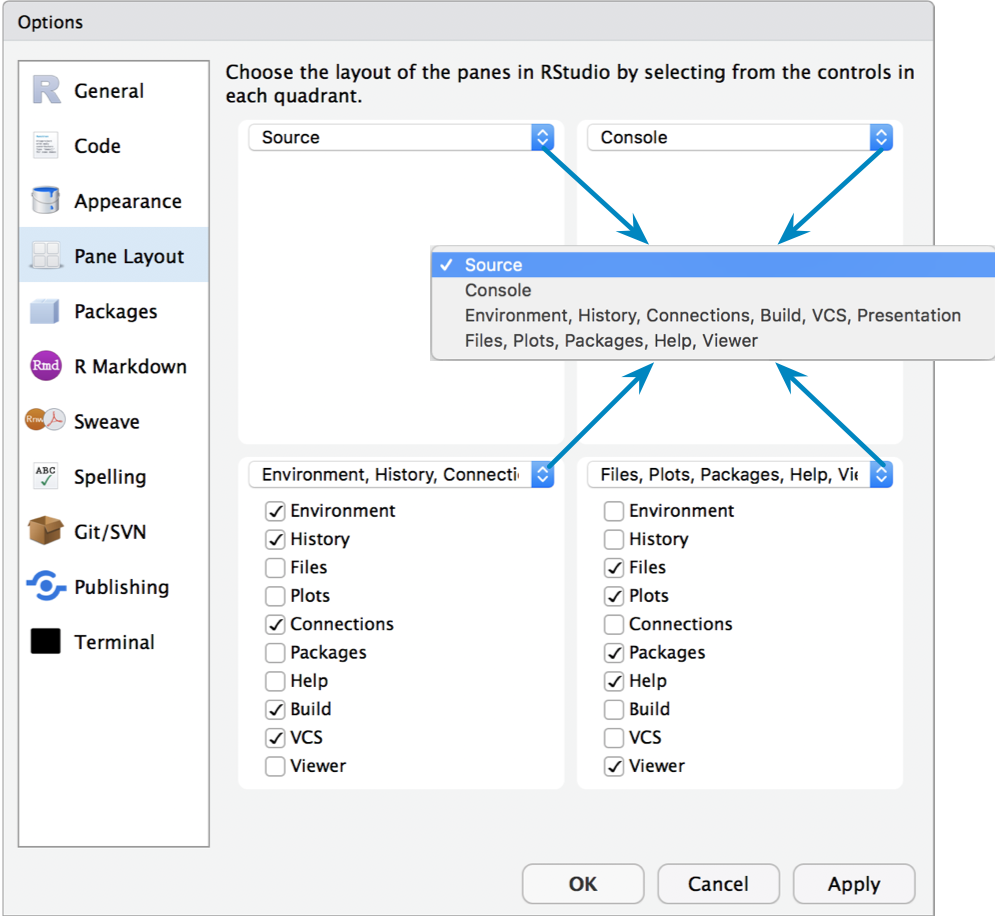

## Slide 19

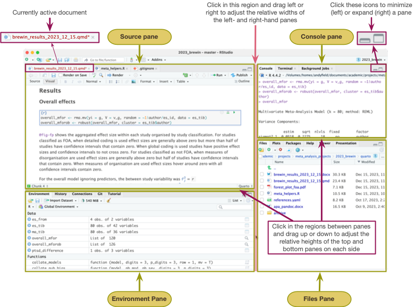

## Slide 20: Have a go: create a report


- Test the hypothesis that Iron Maiden songs have got longer over the years.

Interactive content: [A report about Iron Maiden](https://profandyfield.github.io/statistics_lectures/ais_00_r/iron_maiden.html)

## Slide 21: The process of E.V.I.L.


## Slide 22: The process of E.V.I.L.

Interactive content: [A report about Iron Maiden](https://profandyfield.github.io/statistics_lectures/ais_00_r/iron_maiden.html)

## Slide 23 (new section): Part 3: Introducing Quarto

## Slide 24: Interacting with R

- The console (🤮)
  - Type commands at the console prompt
  - Bad for reproducibility/your sanity
  - Great for getting help, installing packages, trying things out
- Quarto document (🎂)
  - A document that combines text and code
  - **renders** to a nicely-formatted `.html`, `.docx` or `.pdf` (LaTeX required) file.
  - Code is executed (in sequence) when rendering
  - Great for reproducible documents
  - **All coursework submitted as html file**

> **Tip: Have a go!**
>
> - Create a new Quarto document
> - Save it as `iron_maiden.qmd` in `quarto`
> - Click  to **render** the document.

## Slide 25: YAML

``` r
---
title: "Iron Maiden"
author: "Andy Field"
format: html
editor: visual
---
```

> **Warning: The danger zone!**
>
> This is **IMPORTANT** … always add `embed-resources: true`
>
> ``` r
> ---
> title: "Iron Maiden"
> author: "Andy Field"
> format:
>   html:
>     embed-resources: true
> editor: visual
> ---
> ```

## Slide 26

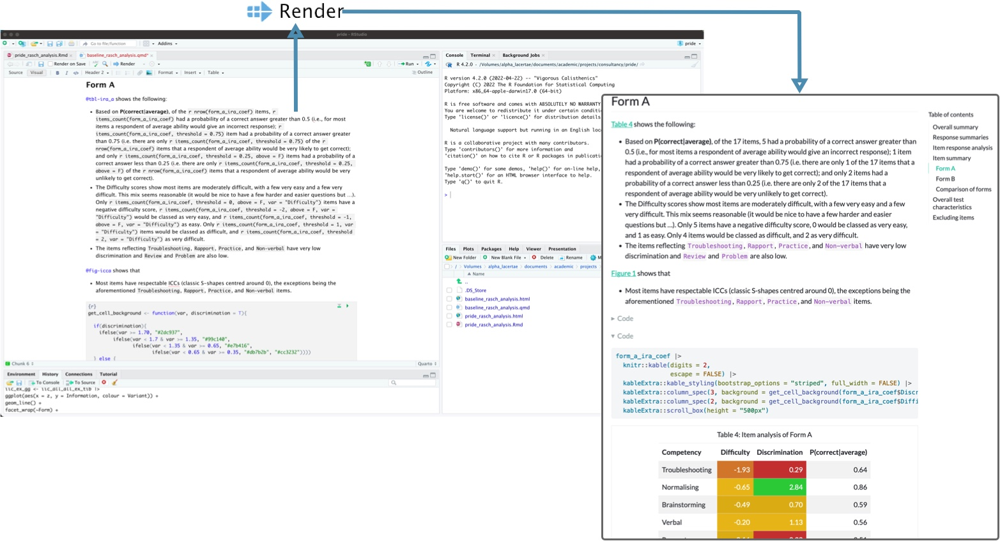

## Slide 27: Writing text

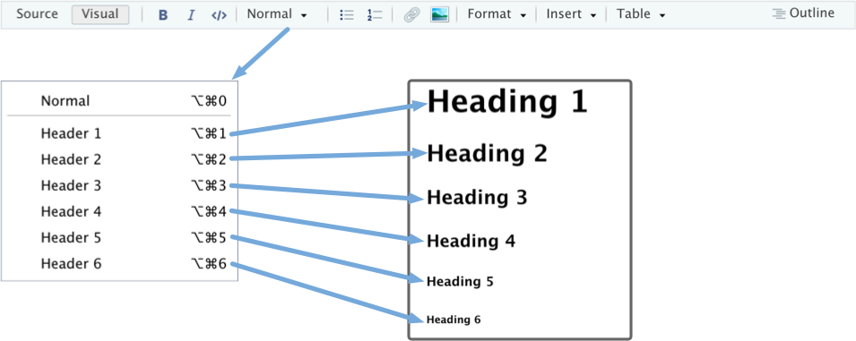

## Slide 28: Our report

> **Important: ReportR**
>
> Iron Maiden are a British heavy metal band. Their best albums are
>
> - Piece of Mind
> - Powerslave

> **Tip: Have a go!**
>
> - In your Quarto document `iron_maiden.qmd`
> - Create a level 2 header `Introduction`
> - Reproduce the text and bullet list above


## Slide 29: Our report

Interactive content: [A report about Iron Maiden](https://profandyfield.github.io/statistics_lectures/ais_00_r/iron_maiden.html#introduction)

## Slide 30: Callouts

`Insert > callout`

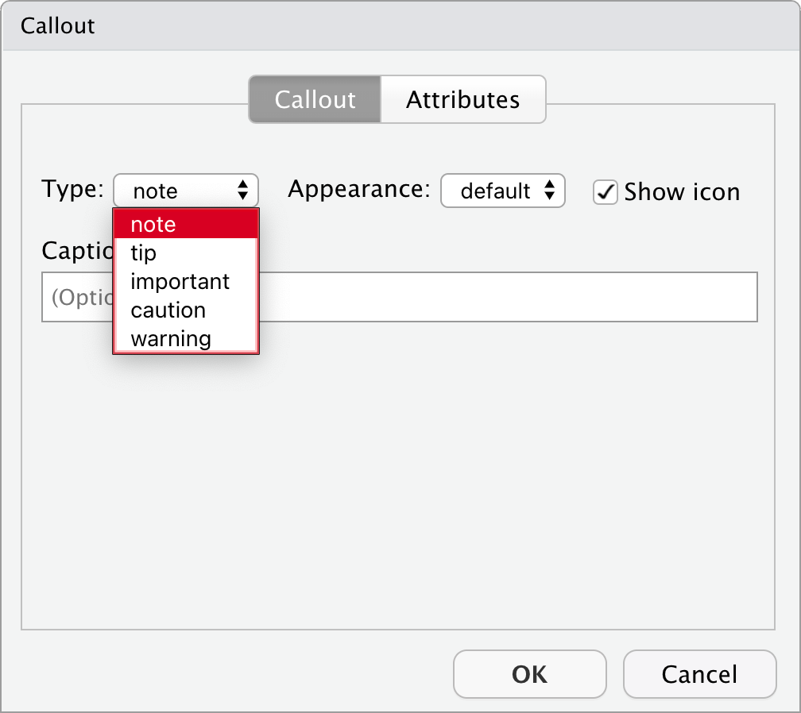

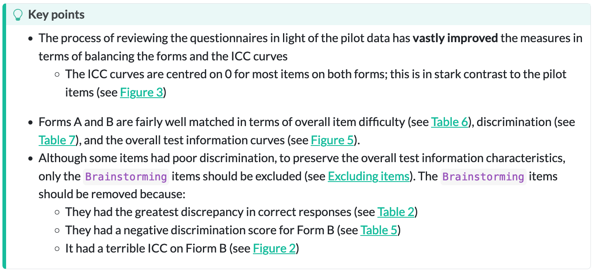

## Slide 31: Have a go!

- Insert a callout
- Recreate the text below using bullets and other text styles.

> **Caution: Hypothesis**
>
> - H<sub>1</sub>: Iron Maiden songs have got longer over time
> - H<sub>0</sub>: The length of Iron Maiden songs has not changed over time
>
> **The model**
>
> - Outcome: Song duration in seconds (`song_duration`)
> - Predictor: Number of years since the first album (`band_age`)


## Slide 32

Interactive content: [A report about Iron Maiden](https://profandyfield.github.io/statistics_lectures/ais_00_r/iron_maiden.html#iron-datum)

> **Tip: Have a go!**
>
> - In your Quarto document `iron_maiden.qmd`
> - Create a level 2 header (at the bottom) called `Iron Datum`
> - Create a level 3 header called `Load and Look`


## Slide 33 (new section): Part 4: Packages and Functions

## Slide 34: Inserting code chunks

### Menu

- In Quarto
  - `Insert > Code Chunk > R`
- In RStudio
  - `Code > Insert Chunk`

### Keyboard shortcuts

- `ctrl alt i` (Windows)
- `⌘ ⌥ i` (MacOS)

### Insert anything

- Windows (I assume): Press `ctrl /`
- MacOS: Press `⌘ /`

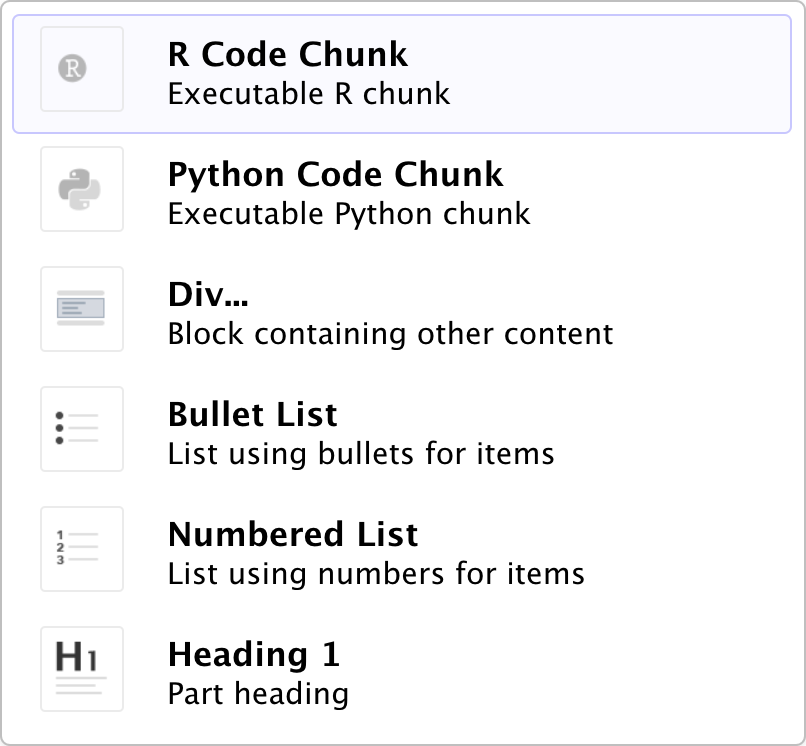

## Slide 35

> **Tip: Have a go!**
>
> - In your Quarto document `iron_maiden.qmd`
> - Insert a code chunk under the level 3 header `Load and Look`


## Slide 36: Functions

- We use functions to do things in R
  - **Inputs**: What we put into the function
  - **Outputs**: what we get out of the function
- Functions look like this (prints the output)

``` r
name_of_function(inputs/arguments/options)
```

> **Tip: Have a go!**
>
> - In your code chunk execute
>
> ``` r
> randomNames(n = 5)
> ```


## Slide 37: Packages

- We can’t use `randomNames()` because we haven’t installed the package from which it comes!
- Installing a package gives you access to functions within it


## Slide 38: The process of E.V.I.L.


## Slide 39: The process of E.V.I.L.: packages


## Slide 40: The process of E.V.I.L.: functions

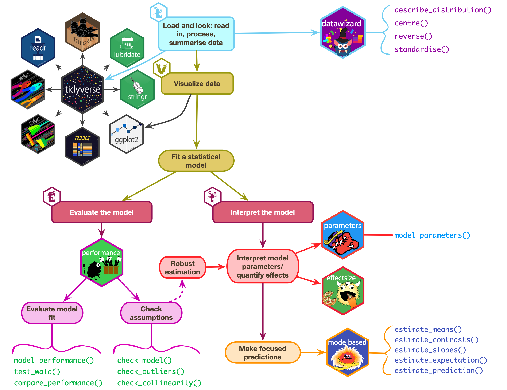

## Slide 41: Installing and loading packages

- You need to install the package into R’s repository of packages on your computer.
- Every time you update or re-install R you need to re-install packages to use them.

``` r
install.packages("package_name")
```

> **Tip**
>
> - **Do NOT include `install.packages()` in Quarto files** or the package will be installed every time you render the document!
>   - Use the console and command line to execute `install.packages()` commands

> **Tip: Have a go!**
>
> - Install the package `randomNames` from which the function `randomNames()` comes.
>
> ``` r
> install.packages("randomNames")
> ```
>
> In your code chunk execute:
>
> ``` r
> randomNames(n = 5)
> ```


## Slide 42: Loading packages

- That also didn’t work 🤔
- To use a particular package in a current session you need to load it from the repository on your machine

### Concise code

- Load packages in a code chunk at the start of your document using `library()`.

``` r
library(randomNames)
randomNames()
```

- Problematic for function name clashes
- Easy to load packages you don’t actually use

### Explicit code

- Refer to functions using the `package::function()` format.

``` r
randomNames::randomNames()
```

- Problematic for some packages (e.g. `dplyr`, `ggplot2`)
- Less readable
- Longer to type!

## Slide 43: Which to use

I use a mix:

- Concise code for umbrella packages that we (nearly) always use
  - `easystats`, which includes `datawizard`, `effectsize`, `modelbased`, `parameters`, `performance` …
  - `tidyverse`, which includes `dplyr`, `ggplot2`, `readr`, `stringr`, `tibble`, `tidyr` …
- Explicit code style for other packages
  - Helps to remember from where functions come

## Slide 44: Referencing packages

### Concise code style

> **Tip: Have a go!**
>
> - In your setup code chunk
>
> ``` r
> library(easystats)
> library(tidyverse)
> library(randomNames)
> ```
>
> - When you use the function:
>
> ``` r
> randomNames(n = 5)
> ```


### Explicit code style

> **Tip: Have a go!**
>
> - In your setup code chunk
>
> ``` r
> library(easystats)
> library(tidyverse)
> ```
>
> - When you use the function
>
> ``` r
> randomNames::randomNames(n = 5)
> ```

## Slide 45: Creating objects in R

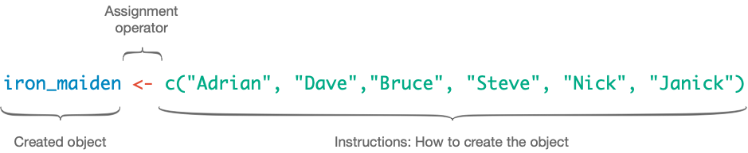

## Slide 46: The eddiefy data 🧟

``` r
eddie_tib <- discovr::eddiefy
```

- Data are stored in **tibbles** (aka **data frames**)

| ID | artist_name | album_name | track_name | year | danceability | energy | key | loudness | mode | speechiness | acousticness | instrumentalness | liveness | valence | tempo | time_signature | song_ms |
|----|----|----|----|----|----|----|----|----|----|----|----|----|----|----|----|----|----|
| 1 | Iron Maiden | Senjutsu | Senjutsu | 2021 | 0.347 | 0.885 | 9 | -6.121 | 0 | 0.0615 | 0.000171 | 0.0892 | 0.217 | 0.466 | 180.172 | 3 | 500170 |
| 2 | Iron Maiden | Senjutsu | Stratego | 2021 | 0.473 | 0.968 | 4 | -7.297 | 0 | 0.0642 | 0.000144 | 0.0347 | 0.612 | 0.465 | 138.054 | 4 | 299946 |
| 3 | Iron Maiden | Senjutsu | The Writing On The Wall | 2021 | 0.402 | 0.912 | 2 | -5.447 | 0 | 0.0442 | 0.00158 | 0.000179 | 0.0923 | 0.566 | 90.045 | 4 | 373898 |
| 4 | Iron Maiden | Senjutsu | Lost In A Lost World | 2021 | 0.251 | 0.871 | 4 | -6.414 | 0 | 0.0871 | 0.00407 | 0.00751 | 0.108 | 0.206 | 92.975 | 4 | 571584 |
| 5 | Iron Maiden | Senjutsu | Days Of Future Past | 2021 | 0.433 | 0.92 | 4 | -4.738 | 0 | 0.0409 | 0.000576 | 5.5e-05 | 0.123 | 0.476 | 92.466 | 4 | 243754 |
| 6 | Iron Maiden | Senjutsu | The Time Machine | 2021 | 0.297 | 0.889 | 9 | -5.287 | 0 | 0.0607 | 0.00654 | 0.000211 | 0.118 | 0.316 | 116.65 | 4 | 429443 |
| 7 | Iron Maiden | Senjutsu | Darkest Hour | 2021 | 0.222 | 0.925 | 4 | -5.939 | 0 | 0.24 | 0.0542 | 0.0863 | 0.395 | 0.162 | 133.772 | 4 | 440464 |
| 8 | Iron Maiden | Senjutsu | Death Of The Celts | 2021 | 0.291 | 0.804 | 2 | -5.807 | 1 | 0.0414 | 0.00711 | 0.21 | 0.12 | 0.26 | 134.561 | 4 | 620403 |
| 9 | Iron Maiden | Senjutsu | The Parchment | 2021 | 0.149 | 0.924 | 4 | -5.345 | 0 | 0.0933 | 0.0141 | 0.219 | 0.107 | 0.212 | 80.234 | 4 | 758990 |
| 10 | Iron Maiden | Senjutsu | Hell On Earth | 2021 | 0.298 | 0.842 | 4 | -6.692 | 0 | 0.0563 | 0.00952 | 0.0299 | 0.0846 | 0.0628 | 132.65 | 4 | 679134 |
| 11 | Iron Maiden | The Book of Souls | If Eternity Should Fail | 2015 | 0.291 | 0.868 | 7 | -6.499 | 1 | 0.0611 | 0.00679 | 0.000413 | 0.118 | 0.149 | 117.931 | 4 | 508207 |
| 12 | Iron Maiden | The Book of Souls | Speed Of Light | 2015 | 0.176 | 0.974 | 7 | -5.778 | 0 | 0.132 | 0.000419 | 2.62e-05 | 0.107 | 0.334 | 185.491 | 4 | 301745 |
| 13 | Iron Maiden | The Book of Souls | The Great Unknown | 2015 | 0.211 | 0.897 | 2 | -6.629 | 1 | 0.201 | 0.0195 | 0.000189 | 0.108 | 0.0702 | 92.082 | 4 | 397655 |
| 14 | Iron Maiden | The Book of Souls | The Red And The Black | 2015 | 0.275 | 0.932 | 4 | -5.54 | 0 | 0.0865 | 0.00176 | 0.109 | 0.116 | 0.377 | 114.008 | 4 | 813713 |
| 15 | Iron Maiden | The Book of Souls | When The River Runs Deep | 2015 | 0.271 | 0.947 | 9 | -5.424 | 1 | 0.0749 | 0.00252 | 3.21e-05 | 0.119 | 0.393 | 128.747 | 4 | 352882 |
| 16 | Iron Maiden | The Book of Souls | The Book Of Souls | 2015 | 0.198 | 0.935 | 4 | -5.505 | 0 | 0.0968 | 0.00383 | 8.16e-05 | 0.102 | 0.359 | 80.875 | 4 | 627626 |
| 17 | Iron Maiden | The Book of Souls | Death Or Glory | 2015 | 0.181 | 0.974 | 9 | -5.493 | 1 | 0.162 | 0.000365 | 3.47e-05 | 0.364 | 0.316 | 176.088 | 4 | 312867 |
| 18 | Iron Maiden | The Book of Souls | Shadows Of The Valley | 2015 | 0.231 | 0.977 | 4 | -4.918 | 0 | 0.11 | 0.00174 | 3.84e-05 | 0.111 | 0.284 | 149.675 | 4 | 452478 |
| 19 | Iron Maiden | The Book of Souls | Tears Of A Clown | 2015 | 0.311 | 0.874 | 9 | -5.327 | 0 | 0.0449 | 0.00696 | 1.17e-05 | 0.0861 | 0.503 | 95.194 | 4 | 298886 |
| 20 | Iron Maiden | The Book of Souls | The Man Of Sorrows | 2015 | 0.441 | 0.78 | 2 | -5.488 | 0 | 0.0418 | 0.0242 | 6.34e-05 | 0.23 | 0.291 | 110.18 | 4 | 387542 |
| 21 | Iron Maiden | The Book of Souls | Empire Of The Clouds | 2015 | 0.249 | 0.789 | 4 | -6.15 | 0 | 0.0496 | 0.0165 | 0.00239 | 0.104 | 0.19 | 76.293 | 4 | 1081316 |
| 22 | Iron Maiden | The Final Frontier | Satellite 15 | 2010 | 0.265 | 0.873 | 9 | -6.411 | 1 | 0.0682 | 0.000584 | 0.00148 | 0.113 | 0.435 | 133.376 | 4 | 520946 |
| 23 | Iron Maiden | The Final Frontier | El Dorado | 2010 | 0.265 | 0.92 | 11 | -7.012 | 1 | 0.0965 | 4.59e-05 | 0.00305 | 0.117 | 0.436 | 155.14 | 4 | 408786 |
| 24 | Iron Maiden | The Final Frontier | Mother Of Mercy | 2010 | 0.309 | 0.9 | 2 | -6.839 | 1 | 0.0625 | 0.00296 | 0.00012 | 0.0486 | 0.364 | 106.055 | 4 | 320133 |
| 25 | Iron Maiden | The Final Frontier | Coming Home | 2010 | 0.332 | 0.887 | 4 | -6.655 | 0 | 0.0537 | 0.00018 | 5.79e-05 | 0.278 | 0.467 | 79.761 | 4 | 352440 |
| 26 | Iron Maiden | The Final Frontier | The Alchemist | 2010 | 0.341 | 0.955 | 2 | -6.104 | 1 | 0.0654 | 0.000166 | 1.92e-05 | 0.345 | 0.64 | 124.023 | 4 | 268986 |
| 27 | Iron Maiden | The Final Frontier | Isle Of Avalon | 2010 | 0.291 | 0.902 | 9 | -7.217 | 1 | 0.0499 | 0.0103 | 0.00471 | 0.145 | 0.0739 | 151.904 | 3 | 546026 |
| 28 | Iron Maiden | The Final Frontier | Starblind | 2010 | 0.197 | 0.871 | 0 | -6.788 | 1 | 0.0548 | 0.00476 | 0.00283 | 0.0875 | 0.217 | 81.904 | 4 | 468360 |
| 29 | Iron Maiden | The Final Frontier | The Talisman | 2010 | 0.216 | 0.834 | 2 | -7.307 | 0 | 0.0763 | 0.00189 | 6.49e-06 | 0.0738 | 0.16 | 81.197 | 4 | 543106 |
| 30 | Iron Maiden | The Final Frontier | The Man Who Would Be King | 2010 | 0.212 | 0.828 | 11 | -7.453 | 0 | 0.0559 | 0.00288 | 0.0228 | 0.12 | 0.273 | 86.628 | 4 | 508173 |
| 31 | Iron Maiden | The Final Frontier | When The Wild Wind Blows | 2010 | 0.305 | 0.759 | 4 | -8.52 | 0 | 0.0462 | 0.00392 | 0.398 | 0.31 | 0.228 | 96.889 | 4 | 661760 |
| 32 | Iron Maiden | The Final Frontier | Satellite 15.....The Final Frontier | 2010 | 0.263 | 0.882 | 9 | -5.871 | 1 | 0.0681 | 0.000654 | 0.00111 | 0.113 | 0.411 | 133.801 | 4 | 520293 |
| 33 | Iron Maiden | A Matter of Life and Death | Different World | 2006 | 0.406 | 0.975 | 4 | -4.285 | 0 | 0.0937 | 0.000325 | 0.00018 | 0.613 | 0.602 | 91.826 | 4 | 258186 |
| 34 | Iron Maiden | A Matter of Life and Death | These Colours Don't Run | 2006 | 0.317 | 0.94 | 4 | -5.33 | 0 | 0.114 | 0.00573 | 0.0033 | 0.112 | 0.228 | 103.396 | 4 | 412213 |
| 35 | Iron Maiden | A Matter of Life and Death | Brighter Than A Thousand Suns | 2006 | 0.294 | 0.949 | 0 | -5.655 | 1 | 0.0851 | 0.00161 | 2.79e-05 | 0.101 | 0.266 | 125.892 | 4 | 526106 |
| 36 | Iron Maiden | A Matter of Life and Death | The Pilgrim | 2006 | 0.308 | 0.934 | 9 | -4.145 | 0 | 0.0606 | 0.000306 | 0.0313 | 0.0863 | 0.541 | 97.848 | 4 | 307866 |
| 37 | Iron Maiden | A Matter of Life and Death | The Longest Day | 2006 | 0.259 | 0.925 | 4 | -5.706 | 0 | 0.0713 | 0.00133 | 0.00289 | 0.128 | 0.337 | 101.244 | 4 | 468093 |
| 38 | Iron Maiden | A Matter of Life and Death | Out Of The Shadows | 2006 | 0.213 | 0.839 | 4 | -5.109 | 0 | 0.0406 | 0.00285 | 0.00195 | 0.279 | 0.288 | 81.402 | 4 | 336640 |
| 39 | Iron Maiden | A Matter of Life and Death | The Reincarnation Of Benjamin Breeg | 2006 | 0.353 | 0.837 | 4 | -5.551 | 0 | 0.0356 | 0.00268 | 0.000533 | 0.11 | 0.144 | 110.999 | 4 | 442053 |
| 40 | Iron Maiden | A Matter of Life and Death | For The Greater Good Of God | 2006 | 0.316 | 0.908 | 4 | -5.455 | 0 | 0.0779 | 0.00194 | 0.0578 | 0.111 | 0.3 | 107.743 | 4 | 565026 |
| 41 | Iron Maiden | A Matter of Life and Death | Lord Of Light | 2006 | 0.281 | 0.901 | 4 | -6.083 | 0 | 0.0739 | 0.00445 | 0.0044 | 0.166 | 0.0485 | 93.542 | 4 | 444653 |
| 42 | Iron Maiden | A Matter of Life and Death | The Legacy | 2006 | 0.328 | 0.928 | 2 | -5.839 | 0 | 0.131 | 0.0471 | 0.000681 | 0.179 | 0.15 | 148.276 | 4 | 562946 |
| 43 | Iron Maiden | Dance of Death | Wildest Dreams | 2003 | 0.302 | 0.923 | 9 | -4.621 | 1 | 0.0829 | 0.000616 | 8.28e-06 | 0.078 | 0.57 | 103.8 | 4 | 232106 |
| 44 | Iron Maiden | Dance of Death | Rainmaker | 2003 | 0.35 | 0.952 | 5 | -4.485 | 1 | 0.14 | 0.00122 | 0 | 0.262 | 0.539 | 86.146 | 4 | 228493 |
| 45 | Iron Maiden | Dance of Death | No More Lies | 2003 | 0.176 | 0.845 | 5 | -5.732 | 1 | 0.092 | 0.00546 | 0.00311 | 0.123 | 0.214 | 190.867 | 4 | 441786 |
| 46 | Iron Maiden | Dance of Death | Montségur | 2003 | 0.285 | 0.99 | 9 | -3.512 | 1 | 0.201 | 7.09e-05 | 0.00021 | 0.118 | 0.215 | 78.537 | 4 | 350373 |
| 47 | Iron Maiden | Dance of Death | Dance Of Death | 2003 | 0.311 | 0.876 | 4 | -5.115 | 0 | 0.0936 | 0.0466 | 0.00442 | 0.134 | 0.296 | 124.584 | 4 | 516426 |
| 48 | Iron Maiden | Dance of Death | Gates Of Tomorrow | 2003 | 0.245 | 0.963 | 7 | -4.532 | 0 | 0.209 | 0.000443 | 6.2e-05 | 0.367 | 0.336 | 95.677 | 4 | 312120 |
| 49 | Iron Maiden | Dance of Death | New Frontier | 2003 | 0.316 | 0.967 | 2 | -3.9 | 0 | 0.0884 | 0.000177 | 0 | 0.0685 | 0.521 | 104.3 | 4 | 304280 |
| 50 | Iron Maiden | Dance of Death | Paschendale | 2003 | 0.168 | 0.941 | 6 | -5.303 | 0 | 0.0938 | 0.0119 | 2.04e-05 | 0.069 | 0.188 | 89.221 | 4 | 508200 |

Table 1: Spotify data for Iron Maiden (first 50 of 163 rows)

## Slide 47

## Slide 48: What are functions?

- We use functions to do things
- **Inputs**: what we put into the function
- **Outputs**: what we get out of the function
  - A dataframe or tibble
  - One or more values
  - A statistical model
  - A plot
  - A table
  - Multiple things
- Functions look like this (prints the output)

``` r
name_of_function(inputs/arguments/options)
```

- We can use `<-` to store the outputs

``` r
stuff_I_want_to_store <- name_of_function(inputs/arguments/options)
```

## Slide 49: Functions as dialog boxes

``` r
the_mean <- mean(x = name_of_variable, na.rm = FALSE, trim = 0)
```

Arguments are like inputs in a dialog box


## Slide 50: The mean() function if it were a dialog box


## Slide 51: The mean() function if it were a dialog box

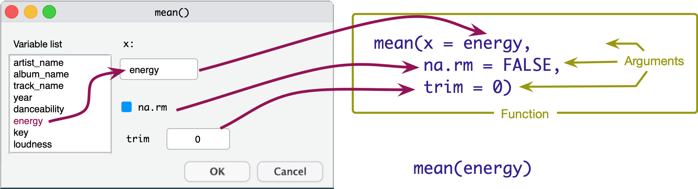

## Slide 52: The mean() function if it were a dialog box

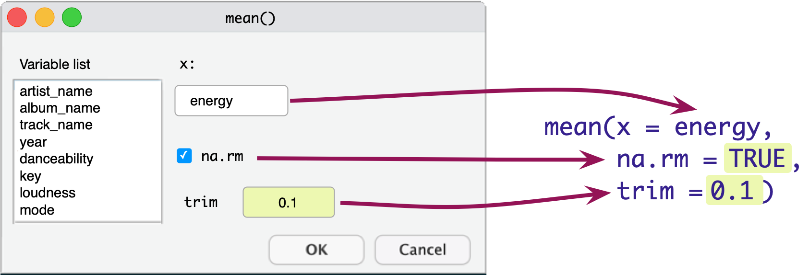

## Slide 53: Our report

- How do we use a function to create some output?

Interactive content: [A report about Iron Maiden](https://profandyfield.github.io/statistics_lectures/ais_00_r/iron_maiden.html#tbl-spotify)

## Slide 54: A function to describe variables

``` r
describe_distribution(x = your_tibble,
                      select = "a_variable",
                      by = "another_variable")
```

> **Tip: Have a go!**
>
> - In a code chunk execute
>
> ``` r
> describe_distribution(x = eddie_tib,
>                       select = "song_ms",
>                       by = "year")
> ```

    year |     Mean |       SD |      IQR |                Range | Skewness
    -----------------------------------------------------------------------
    1980 | 2.83e+05 | 82796.99 | 1.23e+05 | [1.98e+05, 4.41e+05] |     1.08
    1981 | 2.33e+05 | 75902.68 | 1.08e+05 | [1.05e+05, 3.73e+05] |     0.28
    1982 | 3.03e+05 | 84408.98 | 1.58e+05 | [2.03e+05, 4.31e+05] |     0.45
    1983 | 3.08e+05 | 87482.27 | 1.64e+05 | [2.08e+05, 4.49e+05] |     0.46
    1984 | 3.82e+05 | 1.88e+05 | 1.56e+05 | [2.46e+05, 8.19e+05] |     2.21
    1986 | 3.88e+05 | 76617.90 | 1.28e+05 | [2.99e+05, 5.17e+05] |     0.52
    1988 | 3.31e+05 | 1.17e+05 | 93150.00 | [2.11e+05, 5.94e+05] |     1.93
    1990 | 2.65e+05 | 28016.26 | 27410.50 | [2.29e+05, 3.32e+05] |     1.63
    1992 | 2.93e+05 | 83837.05 | 1.31e+05 | [1.89e+05, 4.38e+05] |     0.44
    1995 | 3.88e+05 | 1.17e+05 | 1.34e+05 | [2.54e+05, 6.77e+05] |     1.62
    1998 | 3.99e+05 | 1.37e+05 | 2.26e+05 | [1.75e+05, 5.93e+05] |    -0.17
    2000 | 4.02e+05 | 1.13e+05 | 2.36e+05 | [2.41e+05, 5.61e+05] |     0.02
    2003 | 3.71e+05 | 98175.49 | 1.38e+05 | [2.28e+05, 5.16e+05] |     0.01
    2006 | 4.32e+05 | 1.06e+05 | 2.06e+05 | [2.58e+05, 5.65e+05] |    -0.31
    2010 | 4.65e+05 | 1.16e+05 | 1.91e+05 | [2.69e+05, 6.62e+05] |    -0.26
    2015 | 5.03e+05 | 2.48e+05 | 3.15e+05 | [2.99e+05, 1.08e+06] |     1.57
    2021 | 4.92e+05 | 1.66e+05 | 2.80e+05 | [2.44e+05, 7.59e+05] |     0.12

    year | Kurtosis |  n | n_Missing
    --------------------------------
    1980 |     0.48 |  8 |         0
    1981 |     0.29 | 10 |         0
    1982 |    -1.44 |  8 |         0
    1983 |    -1.28 |  9 |         0
    1984 |     5.34 |  8 |         0
    1986 |    -0.82 |  8 |         0
    1988 |     4.43 |  8 |         0
    1990 |     3.65 | 10 |         0
    1992 |    -1.00 | 12 |         0
    1995 |     3.15 | 11 |         0
    1998 |    -0.52 |  8 |         0
    2000 |    -1.24 | 10 |         0
    2003 |    -0.90 | 11 |         0
    2006 |    -0.96 | 10 |         0
    2010 |    -0.43 | 11 |         0
    2015 |     1.99 | 11 |         0
    2021 |    -0.90 | 10 |         0


## Slide 55: Storing results

- Sometimes we want to store the results to use later
- We can do this using the assignment operator (`<-`)

> **Tip: Have a go!**
>
> 
>
> - In a code chunk type the code below
> - Click  to execute the code in the code chunk.
>
> ``` r
> summary_tbl <- describe_distribution(x = eddie_tib,
>                       select = "song_ms",
>                       by = "year")
> ```

## Slide 56: Using display() for nice tables

- Having stored the table, we can place it in `display()` to get nice rendering

> **Tip: Have a go!**
>
> ``` r
> summary_tbl <- describe_distribution(x = eddie_tib,
>                       select = "song_ms",
>                       by = "year")
> display(summary_tbl)
> ```

| year | Variable | Mean | SD | IQR | Range | Skewness | Kurtosis | n | n_Missing |
|----|----|----|----|----|----|----|----|----|----|
| 1980 | song_ms | 2.83e+05 | 82796.99 | 1.23e+05 | (1.98e+05, 4.41e+05) | 1.08 | 0.48 | 8 | 0 |
| 1981 | song_ms | 2.33e+05 | 75902.68 | 1.08e+05 | (1.05e+05, 3.73e+05) | 0.28 | 0.29 | 10 | 0 |
| 1982 | song_ms | 3.03e+05 | 84408.98 | 1.58e+05 | (2.03e+05, 4.31e+05) | 0.45 | -1.44 | 8 | 0 |
| 1983 | song_ms | 3.08e+05 | 87482.27 | 1.64e+05 | (2.08e+05, 4.49e+05) | 0.46 | -1.28 | 9 | 0 |
| 1984 | song_ms | 3.82e+05 | 1.88e+05 | 1.56e+05 | (2.46e+05, 8.19e+05) | 2.21 | 5.34 | 8 | 0 |
| 1986 | song_ms | 3.88e+05 | 76617.90 | 1.28e+05 | (2.99e+05, 5.17e+05) | 0.52 | -0.82 | 8 | 0 |


## Slide 57: Cross referencing and citations

Interactive content: [A report about Iron Maiden](https://profandyfield.github.io/statistics_lectures/ais_00_r/iron_maiden.html#load-and-look)


## Slide 58: Cross-referencing tables

- We can use code-chunk options to label and caption tables by using the prefix `tbl-`
- For example, we could label our table `tbl-spotify`
- Referring to `@tbl-spotify` in our document creates an automatic cross-reference

``` r
#| label: tbl-spotify
#| tbl-cap: Descriptive statistics for Iron Maiden song durations (s)

display(summary_tbl)
```

- [Table 1](#/tbl-spotify) shows the summary statistics
- The [Table 1](#/tbl-spotify) x-ref was created using `@tbl-spotify` in the quarto document

| year | Variable | Mean | SD | IQR | Range | Skewness | Kurtosis | n | n_Missing |
|----|----|----|----|----|----|----|----|----|----|
| 1980 | song_ms | 2.83e+05 | 82796.99 | 1.23e+05 | (1.98e+05, 4.41e+05) | 1.08 | 0.48 | 8 | 0 |
| 1981 | song_ms | 2.33e+05 | 75902.68 | 1.08e+05 | (1.05e+05, 3.73e+05) | 0.28 | 0.29 | 10 | 0 |
| 1982 | song_ms | 3.03e+05 | 84408.98 | 1.58e+05 | (2.03e+05, 4.31e+05) | 0.45 | -1.44 | 8 | 0 |
| 1983 | song_ms | 3.08e+05 | 87482.27 | 1.64e+05 | (2.08e+05, 4.49e+05) | 0.46 | -1.28 | 9 | 0 |
| 1984 | song_ms | 3.82e+05 | 1.88e+05 | 1.56e+05 | (2.46e+05, 8.19e+05) | 2.21 | 5.34 | 8 | 0 |
| 1986 | song_ms | 3.88e+05 | 76617.90 | 1.28e+05 | (2.99e+05, 5.17e+05) | 0.52 | -0.82 | 8 | 0 |

Table 1: Descriptive statistics for Iron Maiden song durations (s)

## Slide 59: CompRtition!


- Create a new Quarto file.
  - Save in `quarto` as `about_me.qmd`
  - Edit the yaml to include

``` r
format:
  html:
    embed-resources: true
```

- Write a document about you or something you feel passionate about. Include some of things we have learnt:
  - Different level headers/text formats (bold, italic, etc.)
  - Hyperlinks
  - Blockquote
  - Callout
  - Citations
  - Themes

## Slide 60 (new section): Part 5: Using functions and the pipe operator

## Slide 61: The eddiefy data 🧟

``` r
eddie_tib <- discovr::eddiefy
```

| ID | artist_name | album_name | track_name | year | danceability | energy | key | loudness | mode | speechiness | acousticness | instrumentalness | liveness | valence | tempo | time_signature | song_ms |
|----|----|----|----|----|----|----|----|----|----|----|----|----|----|----|----|----|----|
| 1 | Iron Maiden | Senjutsu | Senjutsu | 2021 | 0.347 | 0.885 | 9 | -6.121 | 0 | 0.0615 | 0.000171 | 0.0892 | 0.217 | 0.466 | 180.172 | 3 | 500170 |
| 2 | Iron Maiden | Senjutsu | Stratego | 2021 | 0.473 | 0.968 | 4 | -7.297 | 0 | 0.0642 | 0.000144 | 0.0347 | 0.612 | 0.465 | 138.054 | 4 | 299946 |
| 3 | Iron Maiden | Senjutsu | The Writing On The Wall | 2021 | 0.402 | 0.912 | 2 | -5.447 | 0 | 0.0442 | 0.00158 | 0.000179 | 0.0923 | 0.566 | 90.045 | 4 | 373898 |
| 4 | Iron Maiden | Senjutsu | Lost In A Lost World | 2021 | 0.251 | 0.871 | 4 | -6.414 | 0 | 0.0871 | 0.00407 | 0.00751 | 0.108 | 0.206 | 92.975 | 4 | 571584 |
| 5 | Iron Maiden | Senjutsu | Days Of Future Past | 2021 | 0.433 | 0.92 | 4 | -4.738 | 0 | 0.0409 | 0.000576 | 5.5e-05 | 0.123 | 0.476 | 92.466 | 4 | 243754 |
| 6 | Iron Maiden | Senjutsu | The Time Machine | 2021 | 0.297 | 0.889 | 9 | -5.287 | 0 | 0.0607 | 0.00654 | 0.000211 | 0.118 | 0.316 | 116.65 | 4 | 429443 |
| 7 | Iron Maiden | Senjutsu | Darkest Hour | 2021 | 0.222 | 0.925 | 4 | -5.939 | 0 | 0.24 | 0.0542 | 0.0863 | 0.395 | 0.162 | 133.772 | 4 | 440464 |
| 8 | Iron Maiden | Senjutsu | Death Of The Celts | 2021 | 0.291 | 0.804 | 2 | -5.807 | 1 | 0.0414 | 0.00711 | 0.21 | 0.12 | 0.26 | 134.561 | 4 | 620403 |
| 9 | Iron Maiden | Senjutsu | The Parchment | 2021 | 0.149 | 0.924 | 4 | -5.345 | 0 | 0.0933 | 0.0141 | 0.219 | 0.107 | 0.212 | 80.234 | 4 | 758990 |
| 10 | Iron Maiden | Senjutsu | Hell On Earth | 2021 | 0.298 | 0.842 | 4 | -6.692 | 0 | 0.0563 | 0.00952 | 0.0299 | 0.0846 | 0.0628 | 132.65 | 4 | 679134 |
| 11 | Iron Maiden | The Book of Souls | If Eternity Should Fail | 2015 | 0.291 | 0.868 | 7 | -6.499 | 1 | 0.0611 | 0.00679 | 0.000413 | 0.118 | 0.149 | 117.931 | 4 | 508207 |
| 12 | Iron Maiden | The Book of Souls | Speed Of Light | 2015 | 0.176 | 0.974 | 7 | -5.778 | 0 | 0.132 | 0.000419 | 2.62e-05 | 0.107 | 0.334 | 185.491 | 4 | 301745 |
| 13 | Iron Maiden | The Book of Souls | The Great Unknown | 2015 | 0.211 | 0.897 | 2 | -6.629 | 1 | 0.201 | 0.0195 | 0.000189 | 0.108 | 0.0702 | 92.082 | 4 | 397655 |
| 14 | Iron Maiden | The Book of Souls | The Red And The Black | 2015 | 0.275 | 0.932 | 4 | -5.54 | 0 | 0.0865 | 0.00176 | 0.109 | 0.116 | 0.377 | 114.008 | 4 | 813713 |
| 15 | Iron Maiden | The Book of Souls | When The River Runs Deep | 2015 | 0.271 | 0.947 | 9 | -5.424 | 1 | 0.0749 | 0.00252 | 3.21e-05 | 0.119 | 0.393 | 128.747 | 4 | 352882 |
| 16 | Iron Maiden | The Book of Souls | The Book Of Souls | 2015 | 0.198 | 0.935 | 4 | -5.505 | 0 | 0.0968 | 0.00383 | 8.16e-05 | 0.102 | 0.359 | 80.875 | 4 | 627626 |
| 17 | Iron Maiden | The Book of Souls | Death Or Glory | 2015 | 0.181 | 0.974 | 9 | -5.493 | 1 | 0.162 | 0.000365 | 3.47e-05 | 0.364 | 0.316 | 176.088 | 4 | 312867 |
| 18 | Iron Maiden | The Book of Souls | Shadows Of The Valley | 2015 | 0.231 | 0.977 | 4 | -4.918 | 0 | 0.11 | 0.00174 | 3.84e-05 | 0.111 | 0.284 | 149.675 | 4 | 452478 |
| 19 | Iron Maiden | The Book of Souls | Tears Of A Clown | 2015 | 0.311 | 0.874 | 9 | -5.327 | 0 | 0.0449 | 0.00696 | 1.17e-05 | 0.0861 | 0.503 | 95.194 | 4 | 298886 |
| 20 | Iron Maiden | The Book of Souls | The Man Of Sorrows | 2015 | 0.441 | 0.78 | 2 | -5.488 | 0 | 0.0418 | 0.0242 | 6.34e-05 | 0.23 | 0.291 | 110.18 | 4 | 387542 |
| 21 | Iron Maiden | The Book of Souls | Empire Of The Clouds | 2015 | 0.249 | 0.789 | 4 | -6.15 | 0 | 0.0496 | 0.0165 | 0.00239 | 0.104 | 0.19 | 76.293 | 4 | 1081316 |
| 22 | Iron Maiden | The Final Frontier | Satellite 15 | 2010 | 0.265 | 0.873 | 9 | -6.411 | 1 | 0.0682 | 0.000584 | 0.00148 | 0.113 | 0.435 | 133.376 | 4 | 520946 |
| 23 | Iron Maiden | The Final Frontier | El Dorado | 2010 | 0.265 | 0.92 | 11 | -7.012 | 1 | 0.0965 | 4.59e-05 | 0.00305 | 0.117 | 0.436 | 155.14 | 4 | 408786 |
| 24 | Iron Maiden | The Final Frontier | Mother Of Mercy | 2010 | 0.309 | 0.9 | 2 | -6.839 | 1 | 0.0625 | 0.00296 | 0.00012 | 0.0486 | 0.364 | 106.055 | 4 | 320133 |
| 25 | Iron Maiden | The Final Frontier | Coming Home | 2010 | 0.332 | 0.887 | 4 | -6.655 | 0 | 0.0537 | 0.00018 | 5.79e-05 | 0.278 | 0.467 | 79.761 | 4 | 352440 |
| 26 | Iron Maiden | The Final Frontier | The Alchemist | 2010 | 0.341 | 0.955 | 2 | -6.104 | 1 | 0.0654 | 0.000166 | 1.92e-05 | 0.345 | 0.64 | 124.023 | 4 | 268986 |
| 27 | Iron Maiden | The Final Frontier | Isle Of Avalon | 2010 | 0.291 | 0.902 | 9 | -7.217 | 1 | 0.0499 | 0.0103 | 0.00471 | 0.145 | 0.0739 | 151.904 | 3 | 546026 |
| 28 | Iron Maiden | The Final Frontier | Starblind | 2010 | 0.197 | 0.871 | 0 | -6.788 | 1 | 0.0548 | 0.00476 | 0.00283 | 0.0875 | 0.217 | 81.904 | 4 | 468360 |
| 29 | Iron Maiden | The Final Frontier | The Talisman | 2010 | 0.216 | 0.834 | 2 | -7.307 | 0 | 0.0763 | 0.00189 | 6.49e-06 | 0.0738 | 0.16 | 81.197 | 4 | 543106 |
| 30 | Iron Maiden | The Final Frontier | The Man Who Would Be King | 2010 | 0.212 | 0.828 | 11 | -7.453 | 0 | 0.0559 | 0.00288 | 0.0228 | 0.12 | 0.273 | 86.628 | 4 | 508173 |
| 31 | Iron Maiden | The Final Frontier | When The Wild Wind Blows | 2010 | 0.305 | 0.759 | 4 | -8.52 | 0 | 0.0462 | 0.00392 | 0.398 | 0.31 | 0.228 | 96.889 | 4 | 661760 |
| 32 | Iron Maiden | The Final Frontier | Satellite 15.....The Final Frontier | 2010 | 0.263 | 0.882 | 9 | -5.871 | 1 | 0.0681 | 0.000654 | 0.00111 | 0.113 | 0.411 | 133.801 | 4 | 520293 |
| 33 | Iron Maiden | A Matter of Life and Death | Different World | 2006 | 0.406 | 0.975 | 4 | -4.285 | 0 | 0.0937 | 0.000325 | 0.00018 | 0.613 | 0.602 | 91.826 | 4 | 258186 |
| 34 | Iron Maiden | A Matter of Life and Death | These Colours Don't Run | 2006 | 0.317 | 0.94 | 4 | -5.33 | 0 | 0.114 | 0.00573 | 0.0033 | 0.112 | 0.228 | 103.396 | 4 | 412213 |
| 35 | Iron Maiden | A Matter of Life and Death | Brighter Than A Thousand Suns | 2006 | 0.294 | 0.949 | 0 | -5.655 | 1 | 0.0851 | 0.00161 | 2.79e-05 | 0.101 | 0.266 | 125.892 | 4 | 526106 |
| 36 | Iron Maiden | A Matter of Life and Death | The Pilgrim | 2006 | 0.308 | 0.934 | 9 | -4.145 | 0 | 0.0606 | 0.000306 | 0.0313 | 0.0863 | 0.541 | 97.848 | 4 | 307866 |
| 37 | Iron Maiden | A Matter of Life and Death | The Longest Day | 2006 | 0.259 | 0.925 | 4 | -5.706 | 0 | 0.0713 | 0.00133 | 0.00289 | 0.128 | 0.337 | 101.244 | 4 | 468093 |
| 38 | Iron Maiden | A Matter of Life and Death | Out Of The Shadows | 2006 | 0.213 | 0.839 | 4 | -5.109 | 0 | 0.0406 | 0.00285 | 0.00195 | 0.279 | 0.288 | 81.402 | 4 | 336640 |
| 39 | Iron Maiden | A Matter of Life and Death | The Reincarnation Of Benjamin Breeg | 2006 | 0.353 | 0.837 | 4 | -5.551 | 0 | 0.0356 | 0.00268 | 0.000533 | 0.11 | 0.144 | 110.999 | 4 | 442053 |
| 40 | Iron Maiden | A Matter of Life and Death | For The Greater Good Of God | 2006 | 0.316 | 0.908 | 4 | -5.455 | 0 | 0.0779 | 0.00194 | 0.0578 | 0.111 | 0.3 | 107.743 | 4 | 565026 |
| 41 | Iron Maiden | A Matter of Life and Death | Lord Of Light | 2006 | 0.281 | 0.901 | 4 | -6.083 | 0 | 0.0739 | 0.00445 | 0.0044 | 0.166 | 0.0485 | 93.542 | 4 | 444653 |
| 42 | Iron Maiden | A Matter of Life and Death | The Legacy | 2006 | 0.328 | 0.928 | 2 | -5.839 | 0 | 0.131 | 0.0471 | 0.000681 | 0.179 | 0.15 | 148.276 | 4 | 562946 |
| 43 | Iron Maiden | Dance of Death | Wildest Dreams | 2003 | 0.302 | 0.923 | 9 | -4.621 | 1 | 0.0829 | 0.000616 | 8.28e-06 | 0.078 | 0.57 | 103.8 | 4 | 232106 |
| 44 | Iron Maiden | Dance of Death | Rainmaker | 2003 | 0.35 | 0.952 | 5 | -4.485 | 1 | 0.14 | 0.00122 | 0 | 0.262 | 0.539 | 86.146 | 4 | 228493 |
| 45 | Iron Maiden | Dance of Death | No More Lies | 2003 | 0.176 | 0.845 | 5 | -5.732 | 1 | 0.092 | 0.00546 | 0.00311 | 0.123 | 0.214 | 190.867 | 4 | 441786 |
| 46 | Iron Maiden | Dance of Death | Montségur | 2003 | 0.285 | 0.99 | 9 | -3.512 | 1 | 0.201 | 7.09e-05 | 0.00021 | 0.118 | 0.215 | 78.537 | 4 | 350373 |
| 47 | Iron Maiden | Dance of Death | Dance Of Death | 2003 | 0.311 | 0.876 | 4 | -5.115 | 0 | 0.0936 | 0.0466 | 0.00442 | 0.134 | 0.296 | 124.584 | 4 | 516426 |
| 48 | Iron Maiden | Dance of Death | Gates Of Tomorrow | 2003 | 0.245 | 0.963 | 7 | -4.532 | 0 | 0.209 | 0.000443 | 6.2e-05 | 0.367 | 0.336 | 95.677 | 4 | 312120 |
| 49 | Iron Maiden | Dance of Death | New Frontier | 2003 | 0.316 | 0.967 | 2 | -3.9 | 0 | 0.0884 | 0.000177 | 0 | 0.0685 | 0.521 | 104.3 | 4 | 304280 |
| 50 | Iron Maiden | Dance of Death | Paschendale | 2003 | 0.168 | 0.941 | 6 | -5.303 | 0 | 0.0938 | 0.0119 | 2.04e-05 | 0.069 | 0.188 | 89.221 | 4 | 508200 |

Table 1: Spotify data for Iron Maiden (first 50 of 163 rows)

## Slide 62: Using functions

Let’s say we want to

- Retain only the variables `album_name`, `track_name`, `year` and `energy`
- Retain only albums before the year 1990

We can use the `dplyr` functions

- `select()` to choose variables
- `filter()` to retain rows that match a condition

``` r
energy_tib <-  select(.data = eddie_tib, album_name, track_name, year, energy)
classic_tib <- filter(.data = energy_tib, year < 1990)
```

| ID | album_name | track_name | year | energy |
|----|----|----|----|----|
| 1 | Seventh Son of a Seventh Son | Moonchild | 1988 | 0.96 |
| 2 | Seventh Son of a Seventh Son | Infinite Dreams | 1988 | 0.962 |
| 3 | Seventh Son of a Seventh Son | Can I Play With Madness | 1988 | 0.981 |
| 4 | Seventh Son of a Seventh Son | The Evil That Men Do | 1988 | 0.977 |
| 5 | Seventh Son of a Seventh Son | Seventh Son Of A Seventh Son | 1988 | 0.872 |
| 6 | Seventh Son of a Seventh Son | The Prophecy | 1988 | 0.828 |
| 7 | Seventh Son of a Seventh Son | The Clairvoyant | 1988 | 0.944 |
| 8 | Seventh Son of a Seventh Son | Only The Good Die Young | 1988 | 0.975 |
| 9 | Somewhere in Time | Caught Somewhere In Time | 1986 | 0.987 |
| 10 | Somewhere in Time | Wasted Years | 1986 | 0.959 |
| 11 | Somewhere in Time | Sea Of Madness | 1986 | 0.985 |
| 12 | Somewhere in Time | Heaven Can Wait | 1986 | 0.982 |
| 13 | Somewhere in Time | The Loneliness Of The Long Distance Runner | 1986 | 0.991 |
| 14 | Somewhere in Time | Stranger In A Strange Land | 1986 | 0.913 |
| 15 | Somewhere in Time | Deja Vu | 1986 | 0.981 |
| 16 | Somewhere in Time | Alexander The Great (356-323 B.c.) | 1986 | 0.944 |
| 17 | Powerslave | Aces High | 1984 | 0.936 |
| 18 | Powerslave | 2 Minutes To Midnight | 1984 | 0.97 |
| 19 | Powerslave | Losfer Words (Big 'Orra) | 1984 | 0.98 |
| 20 | Powerslave | Flash Of The Blade | 1984 | 0.963 |
| 21 | Powerslave | The Duellists | 1984 | 0.971 |
| 22 | Powerslave | Back In The Village | 1984 | 0.98 |
| 23 | Powerslave | Powerslave | 1984 | 0.974 |
| 24 | Powerslave | Rime Of The Ancient Mariner | 1984 | 0.932 |
| 25 | Piece of Mind | Where Eagles Dare | 1983 | 0.965 |
| 26 | Piece of Mind | Revelations | 1983 | 0.845 |
| 27 | Piece of Mind | Flight Of Icarus | 1983 | 0.917 |
| 28 | Piece of Mind | Die With Your Boots On | 1983 | 0.947 |
| 29 | Piece of Mind | The Trooper | 1983 | 0.908 |
| 30 | Piece of Mind | Still Life | 1983 | 0.827 |
| 31 | Piece of Mind | Quest For Fire | 1983 | 0.894 |
| 32 | Piece of Mind | Sun And Steel | 1983 | 0.921 |
| 33 | Piece of Mind | To Tame A Land | 1983 | 0.864 |
| 34 | The Number of the Beast | Invaders | 1982 | 0.937 |
| 35 | The Number of the Beast | Children Of The Damned | 1982 | 0.775 |
| 36 | The Number of the Beast | The Prisoner | 1982 | 0.88 |
| 37 | The Number of the Beast | 22 Acacia Avenue | 1982 | 0.907 |
| 38 | The Number of the Beast | The Number Of The Beast | 1982 | 0.89 |
| 39 | The Number of the Beast | Run To The Hills | 1982 | 0.943 |
| 40 | The Number of the Beast | Gangland | 1982 | 0.939 |
| 41 | The Number of the Beast | Hallowed Be Thy Name | 1982 | 0.882 |
| 42 | Killers | The Ides Of March | 1981 | 0.744 |
| 43 | Killers | Wrathchild | 1981 | 0.93 |
| 44 | Killers | Murders In The Rue Morgue | 1981 | 0.925 |
| 45 | Killers | Another Life | 1981 | 0.959 |
| 46 | Killers | Genghis Khan | 1981 | 0.894 |
| 47 | Killers | Innocent Exile | 1981 | 0.937 |
| 48 | Killers | Killers | 1981 | 0.939 |
| 49 | Killers | Prodigal Son | 1981 | 0.685 |
| 50 | Killers | Purgatory | 1981 | 0.965 |

(first 50 of 59 rows)

## Slide 63: The pipe operator (\|\>)1

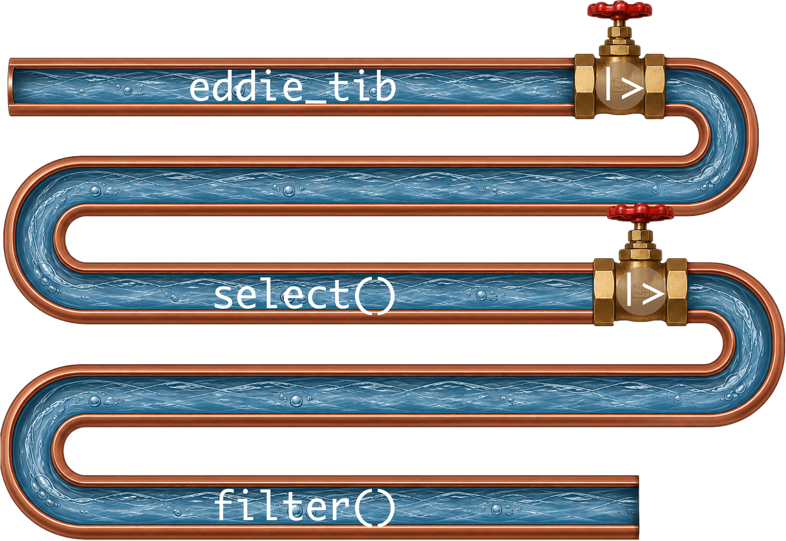

``` r
eddie_tib |> 
  select(album_name, track_name, year, energy) |> 
  filter(year < 1990)
```

*Footnotes*

1.  Older code uses `%>%`, treat the two pipe symbols as interchangeable

## Slide 64: Try your first pipe

> **Tip: Have a go!**
>
> 
>
> - The pipe operator allows you to combine functions
> - Makes code more readable
> - Create a new code chunk
>
> ``` r
> energy_tib <- eddie_tib |> 
>   select(album_name, track_name, year, energy) |> 
>   filter(year < 1990)
> ```

## Slide 65: Creating new variables

> **Caution: Hypothesis**
>
> - H<sub>1</sub>: Iron Maiden songs have got longer over time
> - H<sub>0</sub>: The length of Iron Maiden songs has not changed over time
>
> **The model**
>
> - Outcome: Song duration in seconds (`song_duration`)
> - Predictor: Number of years since the first album (`band_age`)

- These variables don’t exist in the data

> **Tip: We need to**
>
> Create two new variables in `eddie_tib`
>
> - `song_duration` takes the existing variable `song_ms`, which is the song duration in milliseconds and converts to seconds by diving by 1000
> - `band_age` converts the year the song was recorded into the number of years since their first album in 1980

## Slide 66: The mutate() function

- We use `mutate()` to create new variables in a tibble/dataframe
- `mutate()` is from the `dplyr` package, which is part of `tidyverse`
- It takes the general form

``` r
my_tib <- my_tib |> 
  mutate(new_variable = some_instructions,
         another_new_variable = some_instructions)
```

## Slide 67

> **Tip: Have a go!**
>
> Create two new variables in `eddie_tib`
>
> - `song_duration` takes the existing variable `song_ms`, which is the song duration in milliseconds and converts to seconds by diving by 1000
> - `band_age` converts the year the song was recorded into the number of years since their first album in 1980


``` r
eddie_tib <- eddie_tib |> 
  mutate(song_duration = song_ms/1000,
         band_age = year - 1980)
```

## Slide 68: Revising descriptive statistics

> **Important: ReportR**
>
> [Table 2](#/tbl-spotify2) shows some data from spotify, which is stored in the `discovr` package (<a href="#/references" role="doc-biblioref" onclick="">Field 2026</a>).

``` r
summary_tbl <- describe_distribution(x = eddie_tib, select = "song_duration", by = "year") |>
  data_remove(c("Variable", "n_Missing"))
  
display(summary_tbl)
```

| year | Mean   | SD     | IQR    | Range             | Skewness | Kurtosis | n   |
|------|--------|--------|--------|-------------------|----------|----------|-----|
| 1980 | 282.87 | 82.80  | 123.12 | (197.57, 441.47)  | 1.08     | 0.48     | 8   |
| 1981 | 232.78 | 75.90  | 107.70 | (105.27, 373.27)  | 0.28     | 0.29     | 10  |
| 1982 | 302.78 | 84.41  | 157.98 | (203.39, 431.09)  | 0.45     | -1.44    | 8   |
| 1983 | 307.67 | 87.48  | 164.49 | (207.51, 448.75)  | 0.46     | -1.28    | 9   |
| 1984 | 382.19 | 187.74 | 156.14 | (245.57, 818.69)  | 2.21     | 5.34     | 8   |
| 1986 | 387.52 | 76.62  | 128.16 | (298.52, 517.09)  | 0.52     | -0.82    | 8   |
| 1988 | 330.66 | 116.72 | 93.15  | (211.25, 594.08)  | 1.93     | 4.43     | 8   |
| 1990 | 264.59 | 28.02  | 27.41  | (229.03, 332.00)  | 1.63     | 3.65     | 10  |
| 1992 | 293.13 | 83.84  | 130.63 | (188.80, 438.12)  | 0.44     | -1.00    | 12  |
| 1995 | 387.84 | 117.33 | 133.52 | (253.80, 676.99)  | 1.62     | 3.15     | 11  |
| 1998 | 399.19 | 137.18 | 225.58 | (175.12, 592.72)  | -0.17    | -0.52    | 8   |
| 2000 | 402.24 | 113.21 | 235.97 | (240.67, 561.21)  | 0.02     | -1.24    | 10  |
| 2003 | 371.05 | 98.18  | 137.51 | (228.49, 516.43)  | 0.01     | -0.90    | 11  |
| 2006 | 432.38 | 105.60 | 205.87 | (258.19, 565.03)  | -0.31    | -0.96    | 10  |
| 2010 | 465.36 | 116.05 | 190.67 | (268.99, 661.76)  | -0.26    | -0.43    | 11  |
| 2015 | 503.17 | 247.87 | 314.76 | (298.89, 1081.32) | 1.57     | 1.99     | 11  |
| 2021 | 491.78 | 166.07 | 279.68 | (243.75, 758.99)  | 0.12     | -0.90    | 10  |

Table 2: Descriptive statistics for Iron Maiden song durations (s)

## Slide 69: Citations

- `Insert > @citation ...`
- Use Zotero reference manager!
  - Guide: [guides.lib.sussex.ac.uk/zotero](https://guides.lib.sussex.ac.uk/zotero)


## Slide 70: Citations from pubmed

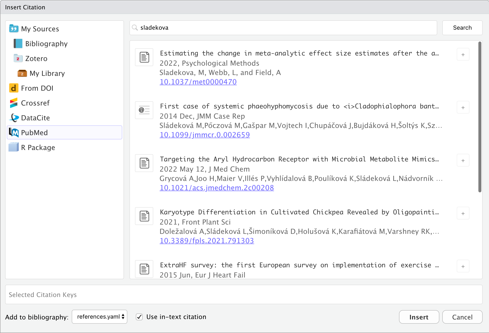

## Slide 71: Cite R packages

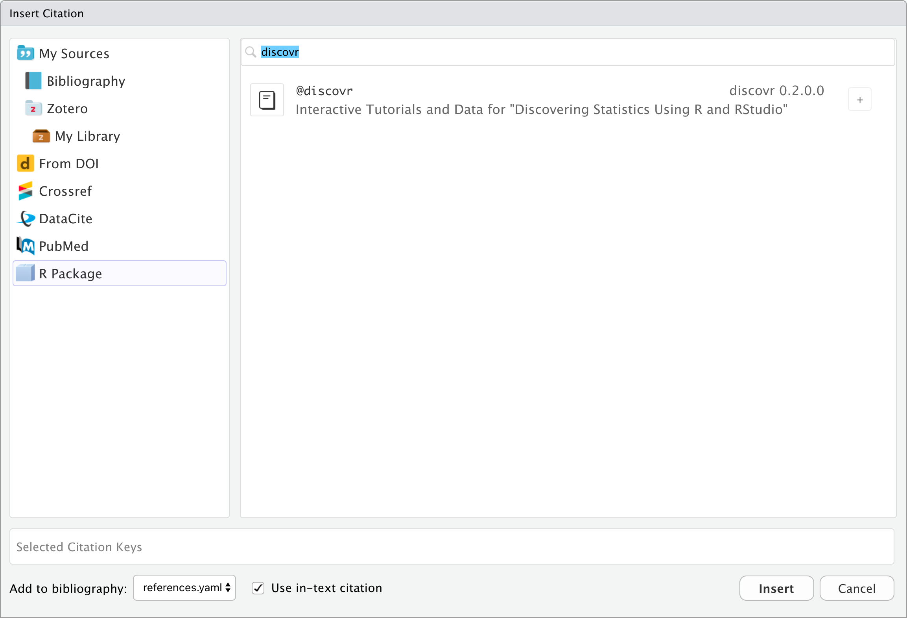

## Slide 72: Visualise

Interactive content: [A report about Iron Maiden](https://profandyfield.github.io/statistics_lectures/ais_00_r/iron_maiden.html#visualise)


## Slide 73

> **Tip: Have a go!**
>
> - Add a level 3 header `Visualise`
> - Insert a code chunk


`@fig-scatmat` shows a plot of the distributions of song duration and years since the first album as well as a scatterplot.

``` r
#| label: fig-scatmat
#| fig-cap: Plots of song duration against time since the first album
#| fig-width: 7
#| fig-height: 7

eddie_tib |> 
  select(band_age, song_duration) |> 
  GGally::ggscatmat()
```

## Slide 74: Evaluate

Interactive content: [A report about Iron Maiden](https://profandyfield.github.io/statistics_lectures/ais_00_r/iron_maiden.html#evaluate)


## Slide 75: LaTeX equations

- `Insert > LaTeX Math > Display Math`
- A syntax for writing mathematical notation
- See <https://oeis.org/wiki/List_of_LaTeX_mathematical_symbols>

We can include the linear model in its own paragraph like this:

``` r
$$
\text{duration} = \hat{b}_{0} + \hat{b}_1\text{years}
$$
```

### Rendered text

We can include the linear model in its own paragraph like this:

``` math
 \text{duration} = \hat{b}_{0} + \hat{b}_1\text{years} 
```

## Slide 76 (new section): Part 6: Code tips

## Slide 77: Use a ‘setup’ code chunk

- Use a setup code chunk at the start of your document (directly below the YAML) that
  - Loads all of the umbrella packages you plan to use (in alphabetic order)
  - Loads any data that you plan to use

``` r
library(easystats)
library(tidyverse)

tap_tib <- here::here("data/tap_parenting.csv") |>
  read_csv()
```

## Slide 78: Getting data into R

### The `here()` function

``` r
here::here(text_to_add)
```


### The `readr` package

- The `read_csv(file = "filepath")` function reads CSV files.

## Slide 79: Getting data into R

> **Tip: Have a go!**
>
> - In your code chunk execute
>
> ``` r
> eddie_tib <- here::here("data/eddiefy.csv") |> 
>   read_csv()
>
> eddie_tib
> ```


## Slide 80: R Style (Wickham, 2014)

- R is case sensitive. In code chunks use lower case wherever possible
- Variable and function names should be lowercase with an underscore (\_) to separate words
  - Names should be concise and meaningful
  - A variable representing children’s’ anxiety levels might be named `child_anxiety`
  - `scores_on_the_child_manifest_anxiety_scale` is meaningful but too long, and `ca` is concise but not meaningful
- Place spaces around all operators (`=`, `+`, `-`, `<-`) to make code easier on the eye!
- Use suffixes that identify types of objects. Some personal examples
  - `_tib` to denote a tibble (more them later), e.g. `anx_tib` for a tibble of data relating to anxiety)
  - `_lm`, `_glm` to denote models built using `lm()` and `glm()`
  - `_mlm` to denote multilevel models
  - `_out` to denote output (e.g., `anx_out` contains the summary output from the above model

## Slide 81: Getting help

To get help, use the `help()` function or `?`

- `help(thing_you_want_help_with)`
- `?thing_you_want_help_with`

The R help files are frequently incomprehensible to mere mortals, but they are getting better!

> **Tip**
>
> Execute help commands at the command line
>
> - **Do NOT include `help()` or `?` in Quarto files**

> **Tip: Have a go!**
>
> Access the help files for the `mean()` function, by executing (in the console):
>
> - `?mean`

## Slide 82 (new section): Part 7: Quarto tips

## Slide 83: Rendering

> **Tip: Have a go!**
>
> 
>
> - Move the code chunk containing the plot to the start of your document.
> - Click  to render the document.

> **Tip: Rendering tips**
>
> - Code chunks are rendered **in the order they appear in the markdown document**.
>   - Make sure you create objects BEFORE you try to use them.
> - **Do NOT include `install.packages()` in Quarto files** or the package will be installed every time you render the document!
>   - Execute `install.packages()` commands at the command line

## Slide 84: YAML: Other useful options

``` r
---
title: "Iron Maiden"
author: "Andy Field"
format:
  html:
    theme: materia  
    embed-resources: true
    toc: true
    code-fold: true
execute: 
  warning: false
editor: visual
---
```

- HTML options: [quarto.org/docs/reference/formats/html.html](https://quarto.org/docs/reference/formats/html.html)
- Theme list: [quarto.org/docs/output-formats/html-themes.html](https://quarto.org/docs/output-formats/html-themes.html)

## Slide 85 (new section): Part 8: Getting the most from practical classes

## Slide 86: Practical classes

The practical classes are based on a package of interactive tutorials called `discovr` that I wrote

- You work at your own pace
- You can work with friends/peers to support each other
- Tutors will wander around giving you one-to-one help when you need it


## Slide 87: Running a tutorial

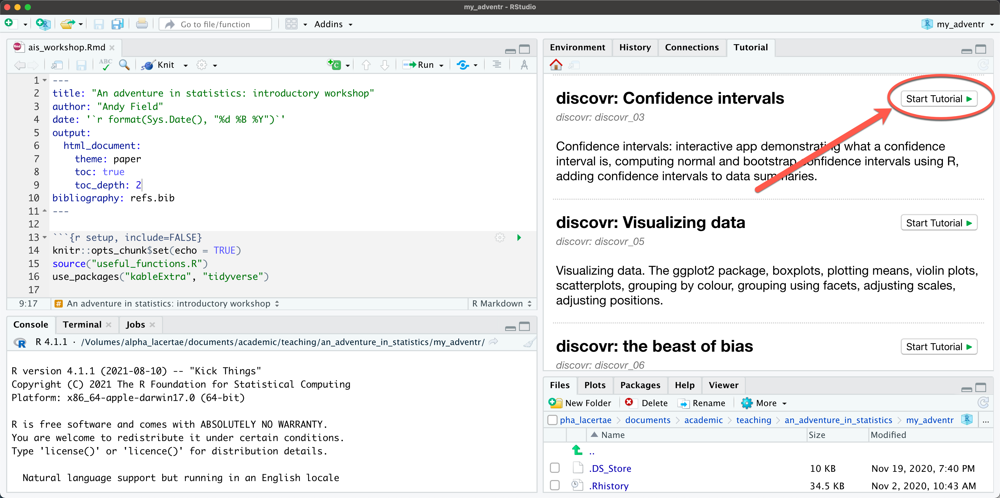

## Slide 88: Suggested workflow

- Create an RStudio project called `my_adventr`
  - Within it create folders called `data` and `quarto`
  - Save all of the data files for the tutorials (on Canvas) into the `data` folder
- Run a tutorial and open it in a separate window
- Create a learning journal for the tutorial
  - Each time you start a tutorial create a new Quarto file and save it with a name related to the tutorial
  - As you work through the tutorial, copy some code you’ve written in the tutorial into code chunks in the Quarto file
  - Make notes (for example, anything you didn’t understand at first, or things to help you remember what you did and why you did it).
  - Save the Quarto file for future reference, and render it into an html document
- Watch the video at <https://youtu.be/mqT7c17tofE>

## Slide 89: CompRtition!

> **Caution: CompRtition!**
>
> Write a document about you or something you feel passionate about. Include some of things we have learnt:
>
> - Different level headers/text formats (bold, italic, etc.)
> - Hyperlinks
> - Callout
> - Citations
> - Themes
> - Tables
> - Figures
> - Code/Data

`Submit by the deadline for a chance to win a prize!`


## Slide 90: References

Field, Andy. 2026. “Discovr: Interactive Tutorials and Data for ‘Discovering Statistics Using R and RStudio’ .” <https://doi.org/10.32614/CRAN.package.discovr> .
