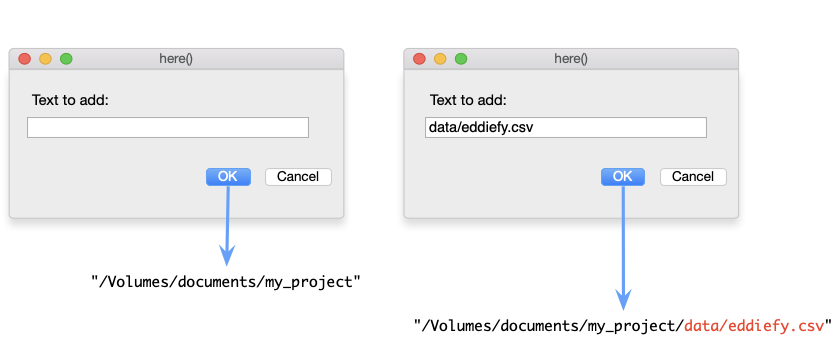

##  Use a 'setup' code chunk 

- Use a setup code chunk at the start of your document (directly below the YAML) that
  - Loads all of the umbrella packages you plan to use (in alphabetic order)
  - Loads any data that you plan to use


::: txt_xl
```{r}
#| eval: false

library(easystats)
library(tidyverse)

tap_tib <- here::here("data/tap_parenting.csv") |>
  read_csv()
```

:::

## Getting data into `r rproj()`
### The `here()` function

::: txt_xl 
```{r}
#| echo: true
#| eval: false

here::here(text_to_add)
```
:::

\

{fig-align="center" height=288}

:::: fragment

### The `readr` package

- The `read_csv(file = "filepath")` function reads CSV files.

::::

## Getting data into `r rproj()`


::: {.callout-tip icon = false}
## `r robot()` Have a go!

- In your code chunk execute 

::: txt_xl
```{r}
#| echo: true
#| eval: false
eddie_tib <- here::here("data/eddiefy.csv") |> 
  read_csv()

eddie_tib
```
:::
:::

{.absolute top=0 right=0 height="200"}


##  `r rproj()` Style (Wickham, 2014)

- `r rproj()` is case sensitive. In code chunks use lower case wherever possible

::: fragment

- Variable and function names should be lowercase with an underscore (_) to separate words
  - Names should be concise and meaningful
  - A variable representing children’s’ anxiety levels might be named `child_anxiety`
  - `scores_on_the_child_manifest_anxiety_scale` is meaningful but too long, and `ca` is concise but not meaningful

:::
::: fragment

- Place spaces around all operators (`=`, `+`, `-`, `<-`) to make code easier on the eye!

:::
::: fragment

- Use suffixes that identify types of objects. Some personal examples
  - `_tib` to denote a tibble (more them later), e.g. `anx_tib` for a tibble of data relating to anxiety)
  - `_lm`, `_glm` to denote models built using `lm()` and `glm()`
  - `_mlm` to denote multilevel models
  - `_out` to denote output (e.g., `anx_out` contains the summary output from the above model

:::


##  Getting help 

To get help, use the `help()` function or `?`

- `help(thing_you_want_help_with)`
- `?thing_you_want_help_with`

The `r rproj()` help files are frequently incomprehensible to mere mortals, but they are getting better!

::: {.callout-tip icon = false}
## `r cat_space()` Tip

Execute help commands at the command line

- **Do NOT include `help()` or `?` in `r quarto(0.2)` files**

:::


::: fragment
::: {.callout-tip icon = false}
## `r robot()` Have a go!

Access the help files for the `mean()` function, by executing (in the console):

- `?mean`

:::
:::


