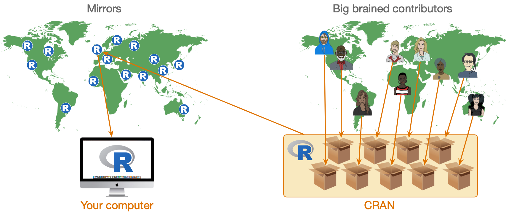
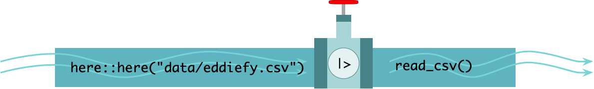
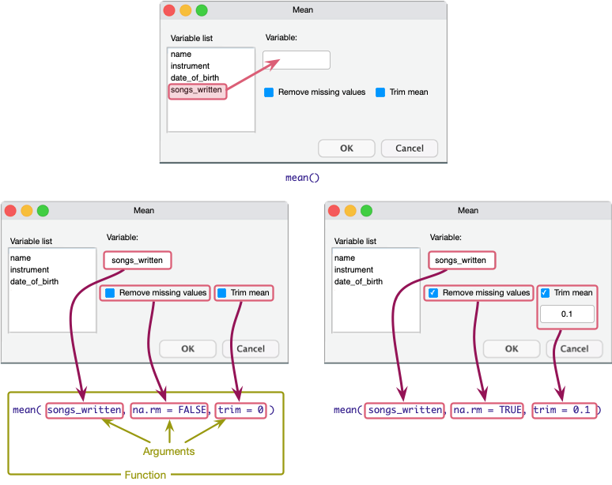

##  Inserting code chunks

- In `r quarto(0.2)`
  - `Insert > Code Chunk > R`
- In `r rstudio(0.2)`
  + -`Code > Insert Chunk`
- Keyboard shortcuts
  - `ctrl alt i` (Windows)
  - `⌘ ⌥ i` (MacOS)
  

::: txt_xl 
```{r}
#| eval: false

eddie_tib <- discovr::eddiefy

dplyr::slice_sample(eddie_tib, n = 10) |> 
  insight::display()
```
:::

##

::: txt_xl 
::: {.callout-tip icon = false}
## `r robot()` : Have a go!

- In your `r quarto(0.2)` document `my_first_quarto.qmd`
- Create a level 2 header at the bottom called `Iron Datum`
- Insert a code chunk

:::
:::

{.absolute top=0 right=0 height="200"}


##  Creating objects 

\


## Functions

:::: columns 
::: {.column width="50%"}

- Functions look like this

::: txt_xl 
```{r}
#| echo: true
#| eval: false

name_of_function(arguments/options)
```
:::
:::

::: {.column width="50%"}

- An example, the `here()` function

::: txt_xl 
```{r}
#| echo: true
#| eval: false

here(text_to_add)
```
:::
:::
::::

::: center-h
::: txt_mulberry
Arguments are like inputs in a dialog box
:::
:::

{fig-align="center" height=288}

##

::: txt_xl 
::: {.callout-tip icon = false}
## `r robot()` : Have a go!

{.absolute bottom=150 right=0 height="200"}

There's a function `randomNames()` that generates proportionally correct, gender and ethnicity specific names. In it's simplest form you specify `n`, the number of names you want to generate.

- In your code chunk execute 

```{r}
#| echo: true
#| eval: false

randomNames(n = 5)
```

:::
:::

##  Packages

- We can't use `randomNames()` because we haven't installed the package from which it comes!
- Installing a package gives you access to functions within it

{fig-align="center"}

##  Installing and loading packages 

- You need to install the package into `r rproj()`'s repository of packages on your computer.
- Every time you update or re-install `r rproj()` you need to re-install packages to use them.

::: txt_xl
```{r}
#| eval: false
install.packages("package_name")
```
:::


::: {.callout-tip icon = false}
## `r cat_space()`: Tip

- Most packages you need have been pre-installed on `r rstudio(0.3)` cloud.
- Never use `install.packages()` within a `r quarto(0.2)` document.

:::


::: fragment
::: {.callout-tip icon = false}
## `r robot()` : Have a go!

- Install the package `randomNames` from which the function `randomNames()` comes.

:::txt_xl
```{r}
#| eval: false
#| echo: true

install.packages("randomNames")
```
:::

In your code chunk execute: 

:::txt_xl
```{r}
#| eval: false
#| echo: true

randomNames(n = 5)
```
:::
:::

{.absolute bottom=100 right=0 height="200"}
:::


## Loading packages

- That also didn't work `r emo::ji("thinking")`
- To use a particular package in a current session you need to load it from the repository on your machine

:::: columns 
::: {.column width="50%"}
::: fragment
### Concise code

- Load packages at the start of your document using `library()`.

::: txt_xl

```{r}
#| echo: true
#| eval: false

library(randomNames)
randomNames()
```
:::

- Problematic for function name clashes
- Easy to load packages you don't actually use

:::
:::

::: {.column width="50%"}
::: fragment
### Explicit code

- Refer to functions using the `package::function()` format.

:::txt_xl
```{r}
#| echo: true
#| eval: false
randomNames::randomNames()
```
:::

- Problematic for some packages (e.g. `dplyr`, `ggplot2`)
- Less readable
- Longer to type!

:::
:::
::::

## Which to use

The tutorials use a mix:

- Concise code for umbrella packages that we always use
  - [**easystats**]{.txt_mulberry}, which includes `dplyr`, `ggplot2`, `readr`, `stringr`, `tibble`, `tidyr` ...
  - [**tidyverse**]{.txt_mulberry}, which includes `datawizard`, `effectsize`, `modelbased`, `parameters`, `performance` ...

- Explicit code style for other packages
  - Helps to remember from where functions come

::: fragment

::: {.callout-tip icon = false}
## `r robot()` : Have a go!

- Insert a code chunk at the start of your document (after the `YAML`)

:::txt_xl
```{r}
#| echo: true
#| eval: false

library(easystats)
library(tidyverse)
```
:::

- In the code chunk that already existed type 

:::txt_xl
```{r}
#| echo: true
#| eval: false

randomNames::randomNames(n = 5)
```
:::
:::

{.absolute bottom=100 right=0 height="200"}

:::


## Getting data into `r rproj()`
### The `here` package


:::txt_xl
```{r}
#| echo: true
#| eval: false
path_to_data <- here::here("data/eddiefy.csv")
```
:::

\

### The `readr` package

The `read_csv(file = "filepath")` function reads CSV files.^[This is from the `readr` function which is part of tidyverse so we don't need to use `readr::read_csv()` because we have loaded all tidyverse packages. We have not loaded `here` so we **do** need to use `here::here()`.] 

:::txt_xl
```{r}
#| echo: true
#| eval: false

path_to_data <- here::here("data/eddiefy.csv") #earlier code
eddiefy <- read_csv(path_to_data)
```
:::

## Have a go!

::: {.callout-tip icon = false}
## `r robot()` : Have a go!

- In your code chunk execute 

:::txt_xl
```{r}
#| echo: true
#| eval: false
here::here()
```
:::

- Now, execute:

:::txt_xl
```{r}
#| echo: true
#| eval: false
here::here("data/eddiefy.csv")
```
:::

- Now, execute:

:::txt_xl
```{r}
#| echo: true
#| eval: false
path_to_data <- here::here("data/eddiefy.csv")
path_to_data
```
:::

- Finally

:::txt_xl
```{r}
#| echo: true
#| eval: false

path_to_data <- here::here("data/eddiefy.csv")
eddiefy <- read_csv(path_to_data)
```
:::
:::

{.absolute top=0 right=0 height="200"}


##  The pipe operator (`|>`)^[Older code uses `%>%`, for our purposes treat the two pipe symbols as interchangeable]

- We just imported data using two lines of code that created two objects (`path_to_data` and `eddiefy`):

:::txt_xl
```{r}
#| echo: true
#| eval: false

path_to_data <- here::here("data/eddiefy.csv")
eddiefy <- read_csv(path_to_data)
```
:::

::: fragment
### Nested commands (`r emo::ji("vomit")`)

- We can create only 1 object by nesting the commands
  - Horrible to read (parenthesis overload)

:::txt_xl
```{r}
#| echo: true
#| eval: false
eddiefy <- read_csv(here::here("data/eddiefy.csv"))
```
:::
:::

:::fragment
### Piped commands (`r emo::ji("happy")`)

:::txt_xl
```{r}
#| echo: true
#| eval: false

eddiefy <- here::here("data/eddiefy.csv") |>
  read_csv()
```
:::
:::


## Piped commands

:::txt_xl
```{r}
#| echo: true
#| eval: false
eddiefy <- here::here("data/eddiefy.csv") |>
  read_csv()
```
:::

<br/>

{fig-align="center"}


## Try your first pipe 


::: {.callout-tip icon = false}
## `r robot()` : Have a go!

{.absolute top=0 right=0 height="200"}


- In `my_first_quarto.qmd` create a new code chunk

:::txt_xl
```{r}
#| echo: true
#| eval: false

eddiefy <- here::here("data/eddiefy.csv") |>
  read_csv()
```
:::

- Create a second code chunk containing this code


:::txt_xl
```{r}
#| echo: true
#| eval: false

energy_tib <- eddiefy |> 
  select(track_name, energy, valence)
```
:::

- Click {height=18} to execute the code in the second code chunk. What happens?


::: fragment

- Click {height=18} to execute all previous code chunks. What happens?

:::
::: fragment

- Add this line to the second code chunk and click {height=18}

:::
::: fragment
:::txt_xl
```{r}
#| echo: true
#| eval: false
energy_tib
```
:::
:::
:::

{.absolute top=0 right=0 height="200"}


## Tibbles (aka data frames)

:::txt_xl
```{r}
#| echo: true
#| eval: false

energy_tib
```
:::

:::txt_xl
```{r}
#| echo: false
#| eval: true

eddiefy <- discovr::eddiefy
energy_tib <- eddiefy |> 
  select(track_name, energy, valence)
head(energy_tib)
```
:::

::: fragment
:::txt_xl
```{r}
#| echo: true
#| eval: true

tail(energy_tib)
```
:::
:::

## Accessing variables (`$`)

:::txt_xl
```{r}
#| echo: true
#| eval: false

tibble$variable
```
:::

\

```{r}

energy_tib$energy
```


## Functions revisited

:::txt_xl
```{r}
#| echo: true
#| eval: false

mean(variable_name, ... arguments/options ...)
mean(variable_name, na.rm = FALSE, trim = 0)
```
:::

{fig-align="center"}

## Functions revisited

- Functions have default values, for `mean()` they are

:::txt_xl
```{r}
#| echo: true
#| eval: false

mean(variable_name, na.rm = FALSE, trim = 0)
```
:::

- Executing

:::txt_xl
```{r}
#| echo: true
#| eval: false

mean(eddie_tib$energy)
```
:::

- Is the same as executing

:::txt_xl
```{r}
#| echo: true
#| eval: false
mean(eddie_tib$energy, na.rm = FALSE, trim = 0)
```
:::

## Have a go!

::: {.callout-tip icon = false}
## `r robot()` : Have a go!

{.absolute top=0 right=0 height="200"}

In your `my_first_quarto.qmd` file

- Insert a new code chunk, type the first command into it and execute.

:::txt_xl
```{r}
#| echo: true
#| eval: false
mean_energy <- mean(eddie_tib$energy)
mean_energy
```
:::


- Click {height=18} to execute the code in the code chunk

:::fragment

- Insert a second code chunk, type the second command into it and execute.

:::txt_xl
```{r}
#| echo: true
#| eval: false

plot(energy_tib)
```
:::

- Click {height=18} to execute the code in the code chunk

:::
:::


::: {.callout-tip icon = false}
## `r cat_space()`: Tip

- Click  to render the document.

:::


##  Have a go!


::: {.callout-tip icon = false}
## `r robot()` : Have a go!

{.absolute top=0 right=0 height="200"}

- Move the code chunk containing `plot(energy_tib)` to the start of your document.
- Click  to render the document.

:::

::: fragment
::: {.callout-tip icon = false}
## `r cat_space()`: Rending tips

- Code chunks are rendered **in the order they appear in the markdown document**.
    - Make sure you create objects BEFORE you try to use them.

- **Do NOT include ``install.packages()`` in `r quarto(0.2)` files** or the package will be installed every time you render the document!
    - Execute ``install.packages()`` commands at the command line

:::
:::
