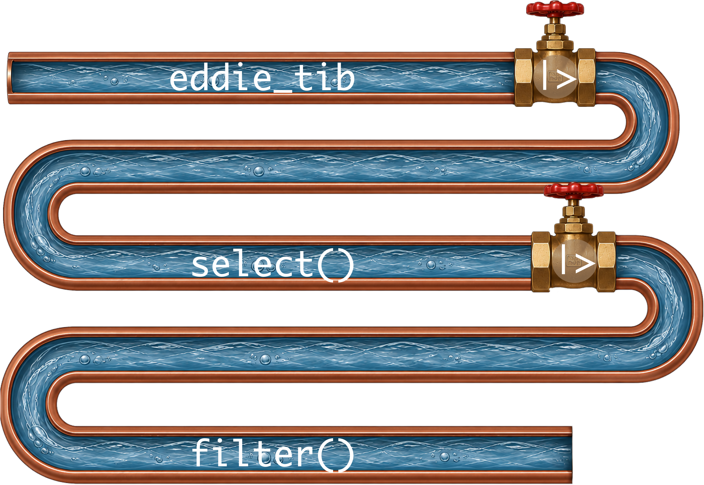
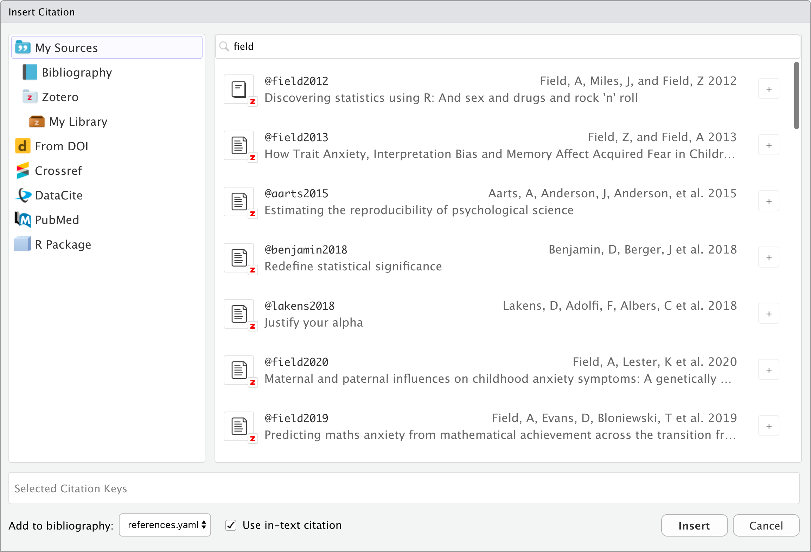
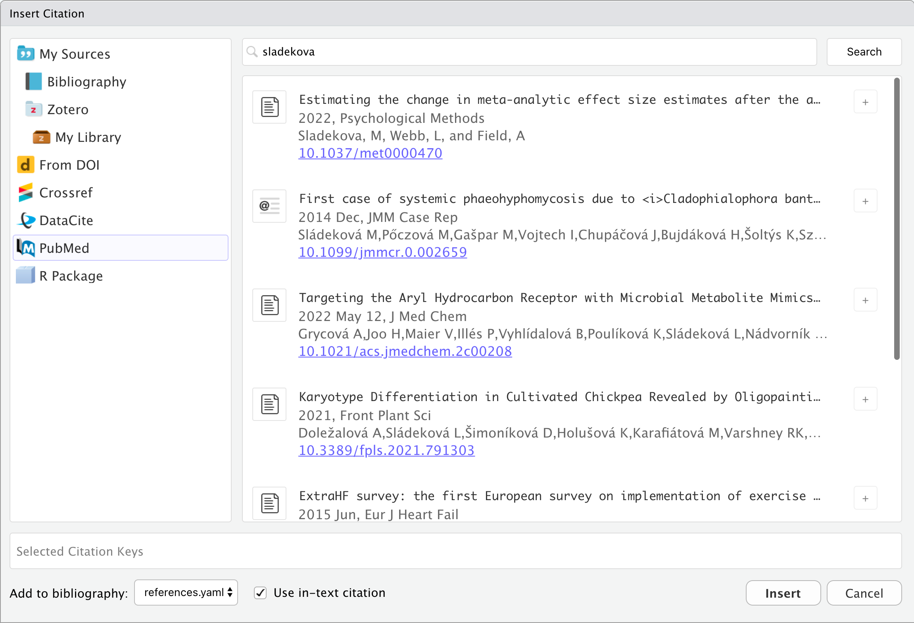
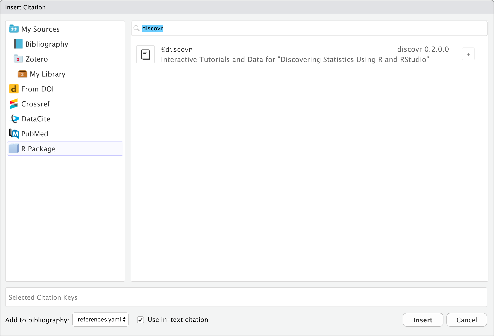

## The eddiefy data `r emo::ji("zombie")`

::: txt_xl 
```{r}
#| echo: true

eddie_tib <- discovr::eddiefy
```
:::

::: txt_s
```{r}
#| echo: false
datatable(data = eddie_tib ,
          colnames = c('ID' = 1),
          caption = 'Table 1: Spotify data for Iron Maiden',
          extensions = 'Scroller', # to enable scrolling
          options = list(
            dom = 't', # table only displayed
            scrollY = 400,
            scroller = TRUE,
            columnDefs = list(
              list(className = 'dt-center', targets = 1:3)
              ),
            pageLength = 7)
          )
```
:::

## Using functions

Let's say we want to

- Retain only the variables `album_name`, `track_name`, `year` and `energy`
- Retain only albums before the year 1990

We can use the [dplyr]{.pkg} functions

- `select()` to choose variables
- `filter()` to retain rows that match a condition

::: txt_xl
```{r}
energy_tib <-  select(.data = eddie_tib, album_name, track_name, year, energy)
classic_tib <- filter(.data = energy_tib, year < 1990)
```
:::

:::: fragment
::: txt_s
```{r}
#| echo: false
datatable(data = classic_tib ,
          colnames = c('ID' = 1),
          extensions = 'Scroller', # to enable scrolling
          options = list(
            dom = 't', # table only displayed
            scrollY = 200,
            scroller = TRUE,
            columnDefs = list(
              list(className = 'dt-center', targets = 1:3)
              ),
            pageLength = 3)
)
```
:::
::::

##  The pipe operator (`|>`)^[Older code uses `%>%`, treat the two pipe symbols as interchangeable]

{fig-align="center" height="450px"}

::: txt_l
```{r}
#| eval: false

eddie_tib |> 
  select(album_name, track_name, year, energy) |> 
  filter(year < 1990)
```

:::


## Try your first pipe 


::: {.callout-tip icon = false}
## `r robot()` Have a go!

{.absolute top=0 right=0 height="200"}

- The pipe operator allows you to combine functions
- Makes code more readable
- Create a new code chunk

::: txt_xl
```{r}
#| echo: true
#| eval: false

energy_tib <- eddie_tib |> 
  select(album_name, track_name, year, energy) |> 
  filter(year < 1990)
```
:::
:::


## Creating new variables

::: {.callout-caution}
## Hypothesis

- H~1~: Iron Maiden songs have got longer over time
- H~0~: The length of Iron Maiden songs has not changed over time

**The model**

- Outcome: Song duration in seconds (`song_duration`)
- Predictor: Number of years since the first album (`band_age`)

:::

- These variables don't exist in the data

::: fragment
::: {.callout-tip icon = false}
## We need to

Create two new variables in `eddie_tib`

  - `song_duration` takes the existing variable `song_ms`, which is the song duration in milliseconds and converts to seconds by diving by 1000
  - `band_age` converts the year the song was recorded into the number of years since their first album in 1980

:::
:::


## The `mutate()` function

- We use `mutate()` to create new variables in a tibble/dataframe
- `mutate()` is from the [dplyr]{.pkg} package, which is part of [tidyverse]{.pkg}
- It takes the general form

::: txt_xl
```{r}
#| eval: false

my_tib <- my_tib |> 
  mutate(new_variable = some_instructions,
         another_new_variable = some_instructions)
```

:::

##

::: {.callout-tip icon = false}
## `r robot()` Have a go!

Create two new variables in `eddie_tib`

  - `song_duration` takes the existing variable `song_ms`, which is the song duration in milliseconds and converts to seconds by diving by 1000
  - `band_age` converts the year the song was recorded into the number of years since their first album in 1980

:::

{.absolute top=0 right=0 height="200"}


:::: fragment
::: txt_xl
```{r}
#| echo: true

eddie_tib <- eddie_tib |> 
  mutate(song_duration = song_ms/1000,
         band_age = year - 1980)
```
:::
::::


## Revising descriptive statistics

:::{.callout-important icon=false}
##  Report`r rproj()`

@tbl-spotify2 shows some data from spotify, which is stored in the `discovr` package [@discovr].

:::


::: tbl_s
```{r}
#| label: tbl-spotify2
#| tbl-cap: Descriptive statistics for Iron Maiden song durations (s)
#| echo: true

summary_tbl <- describe_distribution(x = eddie_tib, select = "song_duration", by = "year") |>
  data_remove(c("Variable", "n_Missing"))
  
display(summary_tbl)
```
:::

## Citations

- `Insert > @citation ...`
- Use Zotero reference manager!
  - Guide: [guides.lib.sussex.ac.uk/c.php?g=665332&p=4858999](https://guides.lib.sussex.ac.uk/c.php?g=665332&p=4858999)

{fig-align="center" height=450}

## Citations from pubmed

{fig-align="center" height=600}

## Cite `r rproj()` packages

{fig-align="center" height=600}


## Visualise

```{=html}
<iframe width="780" height="600" src="./iron_maiden.html#visualise" title="A report about Iron Maiden"></iframe>
```


{.absolute top=0 right=0 height="80"}

##

::: {.callout-tip icon = false}
## `r robot()` Have a go!

- Add a level 3 header `Visualise`
- Insert a code chunk

:::

{.absolute bottom=0 right=0 height="200"}

:::: fragment

`@fig-scatmat` shows a plot of the distributions of song duration and years since the first album as well as a scatterplot.


::: txt_xl

```{r}
#| eval: false

#| label: fig-scatmat
#| fig-cap: Plots of song duration against time since the first album
#| fig-width: 7
#| fig-height: 7

eddie_tib |> 
  select(band_age, song_duration) |> 
  GGally::ggscatmat()
```
:::

::::

## Evaluate

```{=html}
<iframe width="780" height="600" src="./iron_maiden.html#evaluate" title="A report about Iron Maiden"></iframe>
```


{.absolute top=0 right=0 height="80"}

##  LaTeX equations 

- `Insert > LaTeX Math > Display Math`
- A syntax for writing mathematical notation
- See [https://oeis.org/wiki/List_of_LaTeX_mathematical_symbols](https://oeis.org/wiki/List_of_LaTeX_mathematical_symbols)

\

We can include the linear model in its own paragraph like this: 

::: txt_xl
```{r}
#| eval: false

$$
\text{duration} = \hat{b}_{0} + \hat{b}_1\text{years}
$$
```
:::

### Rendered text

We can include the linear model in its own paragraph like this:

$$
\text{duration} = \hat{b}_{0} + \hat{b}_1\text{years}
$$


