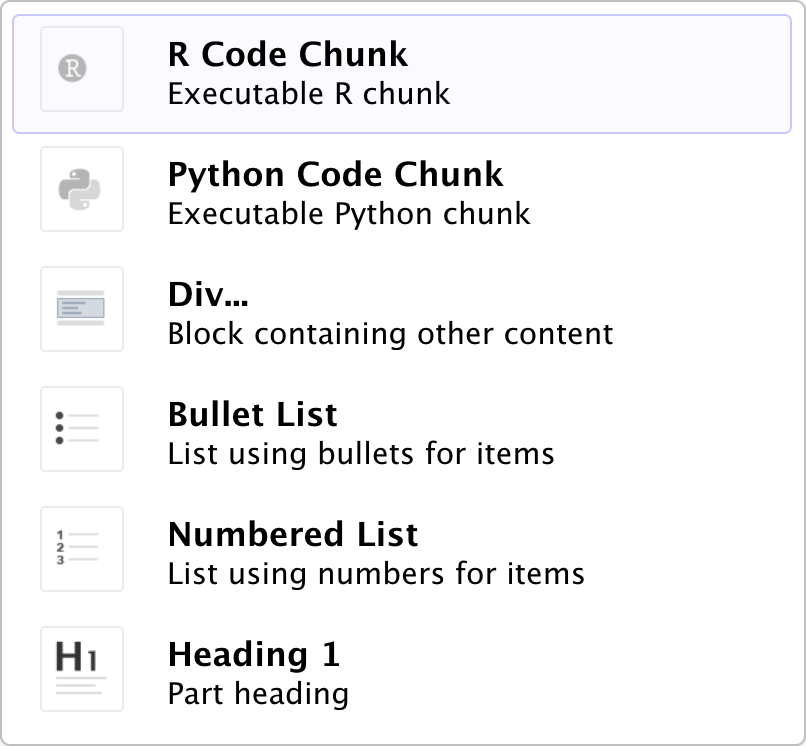
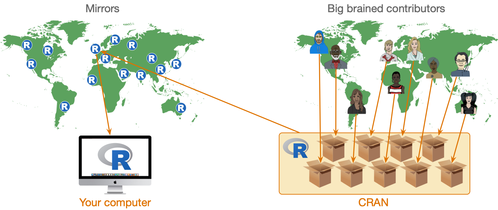
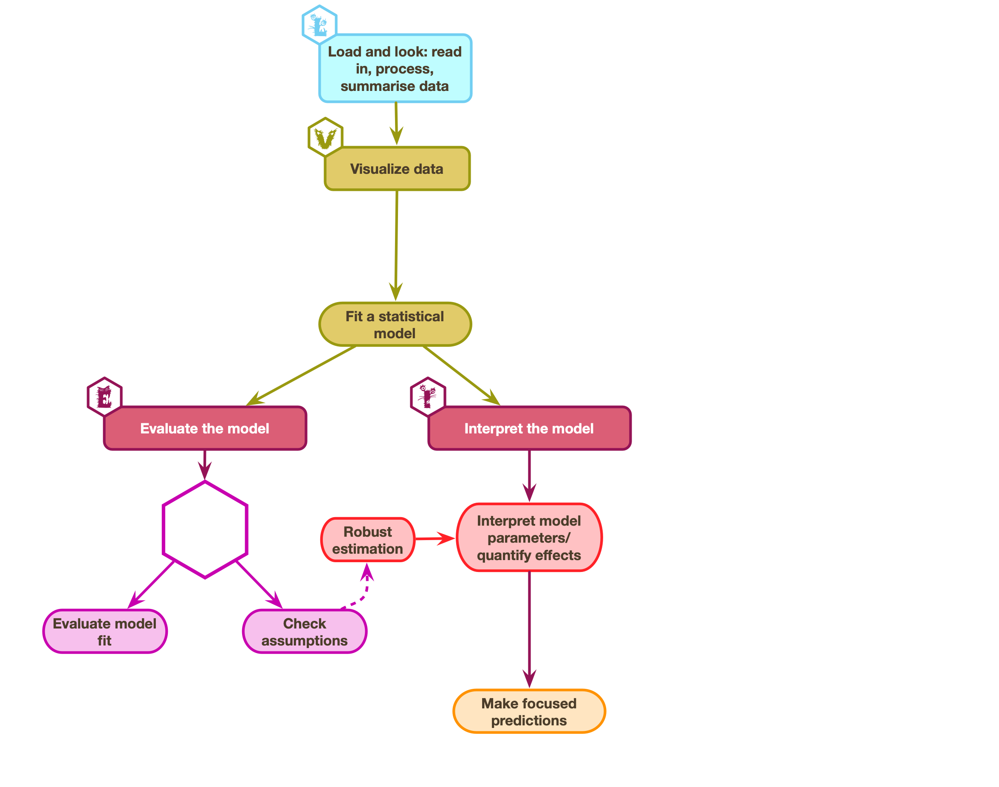
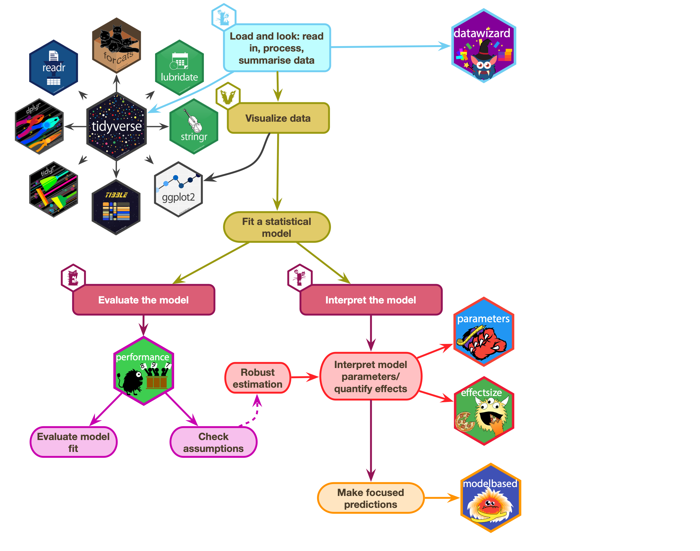
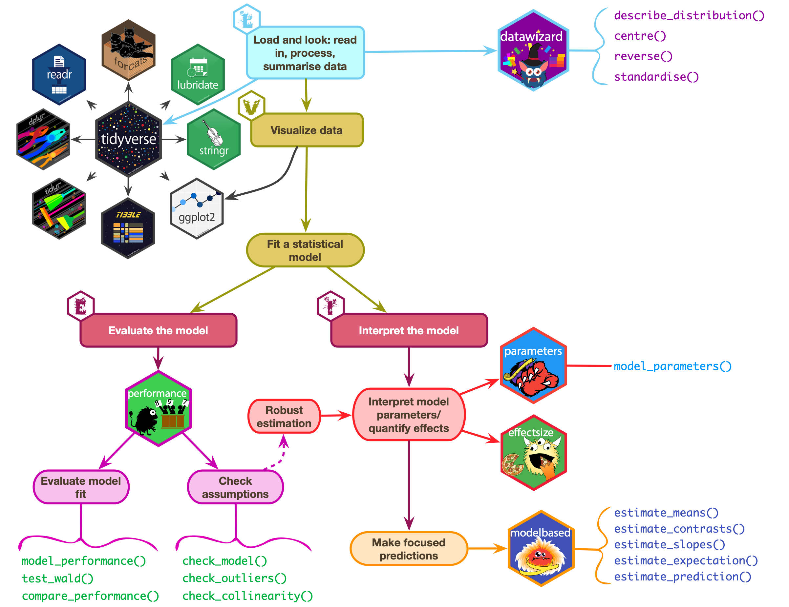
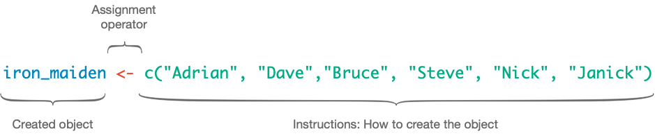
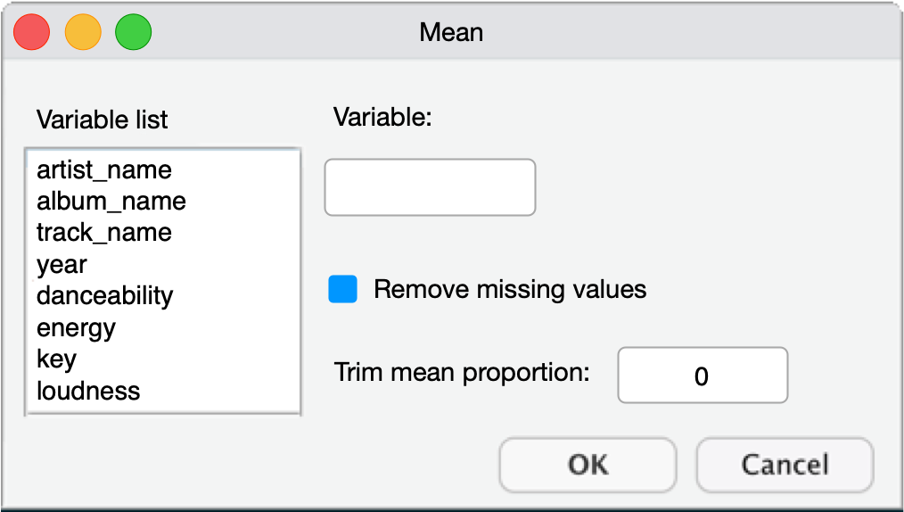
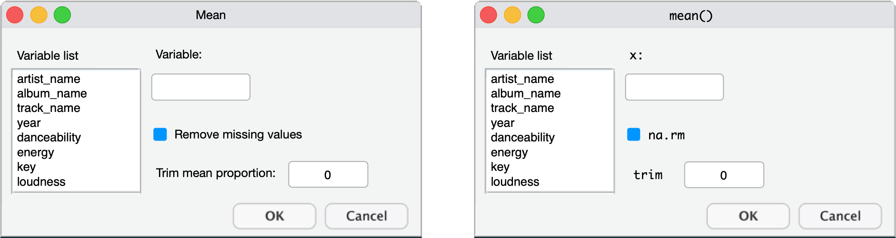
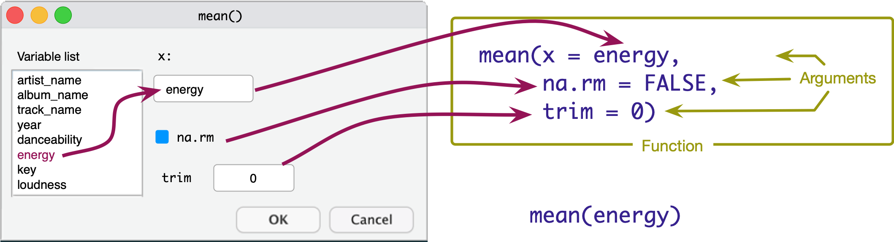
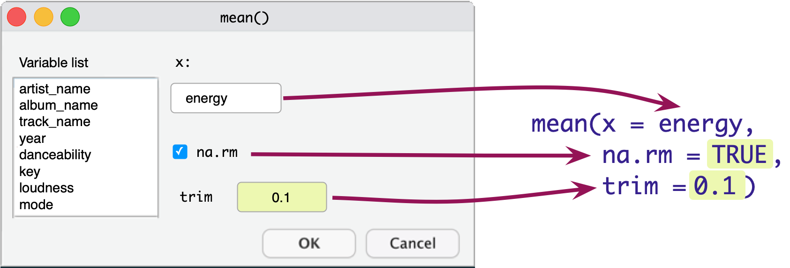

##  Inserting code chunks


:::: columns
::: {.column width="50%"}

### Menu

- In `r quarto(0.2)`
  - `Insert > Code Chunk > R`
- In `r rstudio(0.2)`
  - `Code > Insert Chunk`

### Keyboard shortcuts

  - `ctrl alt i` (Windows)
  - `⌘ ⌥ i` (MacOS)

:::

::: {.column width="50%"}
### Insert anything

- Windows (I assume): Press `ctrl /`
- MacOS: Press `⌘ /`


:::
::::
  
##

::: txt_xl 
::: {.callout-tip icon = false}
## `r robot()` Have a go!

- In your `r quarto(0.2)` document `iron_maiden.qmd`
- Insert a code chunk under the level 3 header `Load and Look`


:::
:::

{.absolute top=0 right=0 height="200"}

## Functions

- We use functions to do things in `r rproj()`
  - **Inputs**: What we put into the function
  - **Outputs**: what we get out of the function
- Functions look like this (prints the output)

::: txt_xl 
```{r}
#| eval: false

name_of_function(inputs/arguments/options)
```
:::


::: txt_xl 
::: {.callout-tip icon = false}
## `r robot()` Have a go!

- In your code chunk execute 

```{r}
#| eval: false

randomNames(n = 5)
```

:::
:::

{.absolute bottom=150 right=0 height="200"}


##  Packages

- We can't use `randomNames()` because we haven't installed the package from which it comes!
- Installing a package gives you access to functions within it

{fig-align="center"}


## The process of [E.V.I.L.]{.ong_bold}

{fig-align="center"}

## The process of [E.V.I.L.]{.ong_bold}: packages

{fig-align="center"}

## The process of [E.V.I.L.]{.ong_bold}: functions

{fig-align="center"}


##  Installing and loading packages 

- You need to install the package into `r rproj()`'s repository of packages on your computer.
- Every time you update or re-install `r rproj()` you need to re-install packages to use them.

::: txt_xl
```{r}
#| eval: false
install.packages("package_name")
```
:::


::: {.callout-tip icon = false}
## `r cat_space()` Tip

- **Do NOT include ``install.packages()`` in `r quarto(0.2)` files** or the package will be installed every time you render the document!
    - Use the console and command line to execute `install.packages()` commands

:::


::: fragment
::: {.callout-tip icon = false}
## `r robot()` Have a go!

- Install the package `randomNames` from which the function `randomNames()` comes.

::: txt_xl
```{r}
#| eval: false

install.packages("randomNames")
```
:::

In your code chunk execute: 

::: txt_xl
```{r}
#| eval: false

randomNames(n = 5)
```
:::
:::

{.absolute bottom=100 right=0 height="200"}
:::


## Loading packages

- That also didn't work `r emo::ji("thinking")`
- To use a particular package in a current session you need to load it from the repository on your machine

:::: columns 
::: {.column width="50%"}
::: fragment
### Concise code

- Load packages in a code chunk at the start of your document using `library()`.

::: txt_xl

```{r}
#| eval: false

library(randomNames)
randomNames()
```
:::

- Problematic for function name clashes
- Easy to load packages you don't actually use

:::
:::

::: {.column width="50%"}
::: fragment
### Explicit code

- Refer to functions using the `package::function()` format.

::: txt_xl
```{r}
#| eval: false
randomNames::randomNames()
```
:::

- Problematic for some packages (e.g. `dplyr`, `ggplot2`)
- Less readable
- Longer to type!

:::
:::
::::

## Which to use

I use a mix:

- Concise code for umbrella packages that we (nearly) always use
  - [easystats]{.pkg}, which includes `datawizard`, `effectsize`, `modelbased`, `parameters`, `performance` ...
  - [tidyverse]{.pkg}, which includes `dplyr`, `ggplot2`, `readr`, `stringr`, `tibble`, `tidyr` ... 

- Explicit code style for other packages
  - Helps to remember from where functions come

## Referencing packages
### Concise code style

:::: {.callout-tip icon = false}
## `r robot()` Have a go!

- In your setup code chunk

::: txt_xl
```{r}
#| eval: false

library(easystats)
library(tidyverse)
library(randomNames)
```
:::

- When you use the function:

::: txt_xl
```{r}
#| eval: false

randomNames(n = 5)
```
:::
::::

{.absolute bottom=100 right=0 height="200"}

::::: fragment

### Explicit code style

:::: {.callout-tip icon = false}
## `r robot()` Have a go!

- In your setup code chunk

::: txt_xl
```{r}
#| eval: false

library(easystats)
library(tidyverse)
```
:::

- When you use the function 

::: txt_xl
```{r}
#| eval: false

randomNames::randomNames(n = 5)
```
:::
::::
:::::

## Creating objects in `r rproj()`

\




## The eddiefy data `r emo::ji("zombie")`

::: txt_xl 
```{r}
#| echo: true

eddie_tib <- discovr::eddiefy
```
:::

- Data are stored in **tibbles** (aka **data frames**)

::: txt_s
```{r}
#| echo: false
datatable(data = eddie_tib ,
          colnames = c('ID' = 1),
          caption = 'Table 1: Spotify data for Iron Maiden',
          extensions = 'Scroller', # to enable scrolling
          options = list(
            dom = 't', # table only displayed
            scrollY = 400,
            scroller = TRUE,
            columnDefs = list(
              list(className = 'dt-center', targets = 1:3)
              ),
            pageLength = 7)
          )
```
:::

## {background-image="media/function_as_bakery.png" background-size="cover"}


## What are functions?

- We use functions to do things
- [Inputs]{.alt}: what we put into the function
- [Outputs]{.alt}: what we get out of the function
  - A dataframe or tibble
  - One or more values
  - A statistical model
  - A plot
  - A table
  - Multiple things
- Functions look like this (prints the output)

::: txt_xl 
```{r}
#| echo: true
#| eval: false

name_of_function(inputs/arguments/options)
```
:::

- We can use `<-` to store the outputs

::: txt_xl 
```{r}
#| echo: true
#| eval: false

stuff_I_want_to_store <- name_of_function(inputs/arguments/options)
```
:::

## Functions as dialog boxes

::: txt_xl 
```{r}
#| echo: true
#| eval: false

the_mean <- mean(x = name_of_variable, na.rm = FALSE, trim = 0)
```
:::

::: center-h
::: txt_mulberry
Arguments are like inputs in a dialog box
:::
:::

{fig-align="center" height=288}

## The `mean()` function if it were a dialog box

{fig-align="center"}

## The `mean()` function if it were a dialog box

{fig-align="center"}


## The `mean()` function if it were a dialog box

{fig-align="center"}


## Our report

- How do we use a function to create some output?

```{=html}
<iframe width="780" height="500" src="./iron_maiden.html#tbl-spotify" title="A report about Iron Maiden"></iframe>
```

## A function to describe variables

::: txt_xl
```{r}
#| echo: true
#| eval: false

describe_distribution(x = your_tibble,
                      select = "a_variable",
                      by = "another_variable")
```
:::


::::: fragment

:::: {.callout-tip icon = false}
## `r robot()` Have a go!

- In a code chunk execute 

::: txt_xl
```{r}
#| echo: true
#| eval: false

describe_distribution(x = eddie_tib,
                      select = "song_ms",
                      by = "year")
```
:::
::::

```{r}
#| echo: false

describe_distribution(x = eddie_tib,
                      select = "song_ms",
                      by = "year") |>
  data_remove(c("Variable", "n_missing"))
```


:::::

{.absolute top=0 right=0 height="200"}

## Storing results

- Sometimes we want to store the results to use later
- We can do this using the assignment operator (`<-`)

::: {.callout-tip icon = false}
## `r robot()` Have a go!

{.absolute top=0 right=0 height="200"}

- In a code chunk type the code below
- Click {height=18} to execute the code in the code chunk.

::: txt_xl
```{r}
#| echo: true
#| eval: false

summary_tbl <- describe_distribution(x = eddie_tib,
                      select = "song_ms",
                      by = "year")
```
:::
:::

## Using `display()` for nice tables

- Having stored the table, we can place it in `display()` to get nice rendering

::: {.callout-tip icon = false}
## `r robot()` Have a go!


::: txt_xl
```{r}
#| echo: true
#| eval: false

summary_tbl <- describe_distribution(x = eddie_tib,
                      select = "song_ms",
                      by = "year")
display(summary_tbl)
```
:::
:::

::: tbl_s
```{r}
#| echo: false

summary_tbl <- describe_distribution(x = eddie_tib,
                      select = "song_ms",
                      by = "year")
head(summary_tbl) |> display()
```
:::

{.absolute top=0 right=0 height="200"}


## Cross referencing and citations

```{=html}
<iframe width="780" height="600" src="./iron_maiden.html#load-and-look" title="A report about Iron Maiden"></iframe>
```

{.absolute top=0 right=0 height="80"}

## Cross-referencing tables

- We can use code-chunk options to label and caption tables by using the prefix `tbl-`
- For example, we could label our table `tbl-spotify`
- Referring to `@tbl-spotify` in our document creates an automatic cross-reference

::: txt_xl

```{r}
#| eval: false
#| echo: true

#| label: tbl-spotify
#| tbl-cap: Descriptive statistics for Iron Maiden song durations (s)

display(summary_tbl)
```

:::

:::: fragment

- @tbl-spotify shows the summary statistics
- The @tbl-spotify x-ref was created using `@tbl-spotify` in the quarto document


::: tbl_s

```{r}
#| label: tbl-spotify
#| tbl-cap: Descriptive statistics for Iron Maiden song durations (s)
#| echo: false

head(summary_tbl) |> 
  display()
```

:::
::::

## Comp`r rproj()`tition!

{.absolute top=0 right=0 height="200"}


- Create a new `r quarto(0.2)` file.
  - Save in `quarto` as `about_me.qmd`
  - Edit the yaml to include

::: txt_xl
```{r}
#| eval: false

format:
  html:
    embed-resources: true
```
:::

::: fragment

- Write a document about you or something you feel passionate about. Include some of things we have learnt:
  - Different level headers/text formats (bold, italic, etc.)
  - Hyperlinks
  - Blockquote
  - Callout
  - Citations
  - Themes

:::

