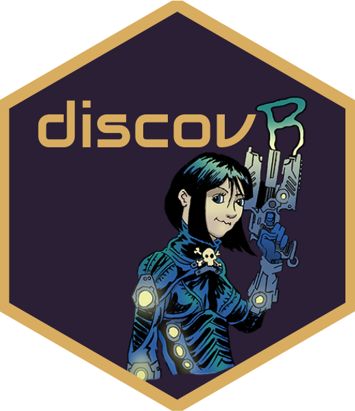
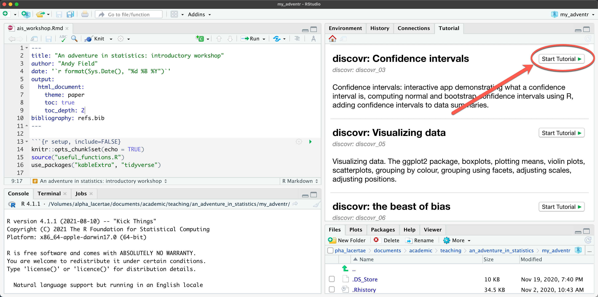

##  Practical classes 

The practical classes are based on a package of interactive tutorials called `discovr` that I wrote

- You work at your own pace
- You can work with friends/peers to support each other
- Tutors will wander around giving you one-to-one help when you need it

{fig-align="center"}

## Running a tutorial

{fig-align="center"}

##  Suggested workflow 

- Create an `r rstudio(scale = 0.4)` project called `my_adventr`
  - Within it create folders called `data` and `quarto`
  - Save all of the data files for the tutorials (on Canvas) into the `data` folder

::: fragment

- Run a tutorial and open it in a separate window 

:::
::: fragment

- Create a learning journal for the tutorial 
  - Each time you start a tutorial create a new `r quarto(0.2)` file and save it with a name related to the tutorial
  - As you work through the tutorial, copy some code you've written in the tutorial into code chunks in the `r quarto(0.2)` file
  - Make notes (for example, anything you didn't understand at first, or things to help you remember what you did and why you did it).
  - Save the `r quarto(0.2)` file for future reference, and render it into an html document

- Watch the video at [https://youtu.be/mqT7c17tofE](https://youtu.be/mqT7c17tofE)
:::

##  Comp`r rproj()`tition!

- Extend the quarto file you started after the lest session to include:
  - Some `r rproj()` code (anything will do)
- Submit by the deadline for a chance to win a prize.

{fig-align="center"}
