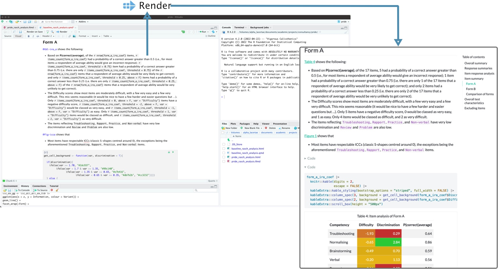
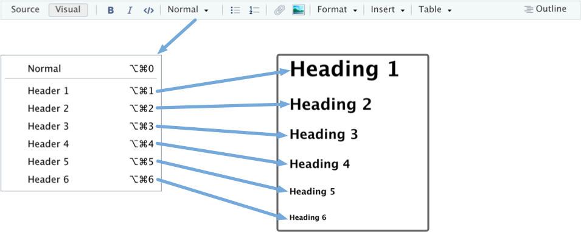
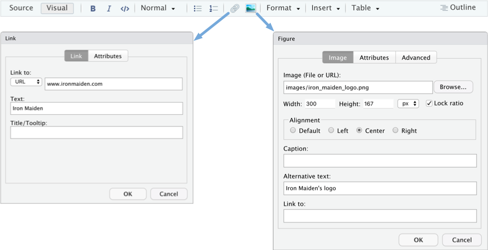
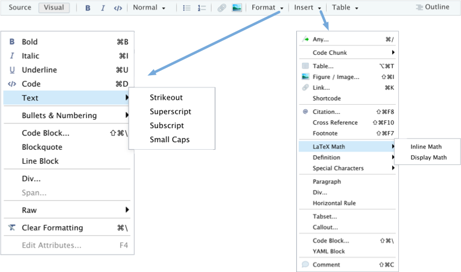
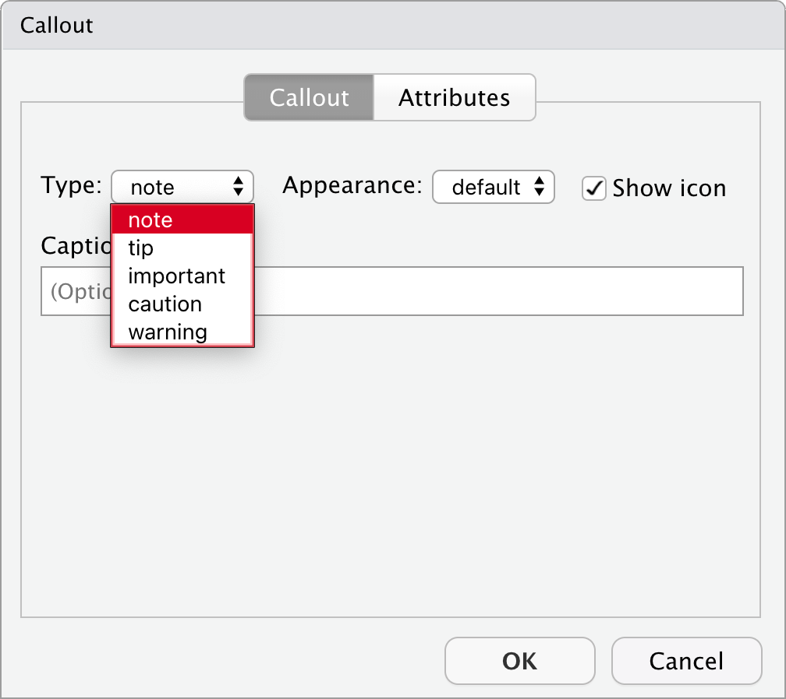
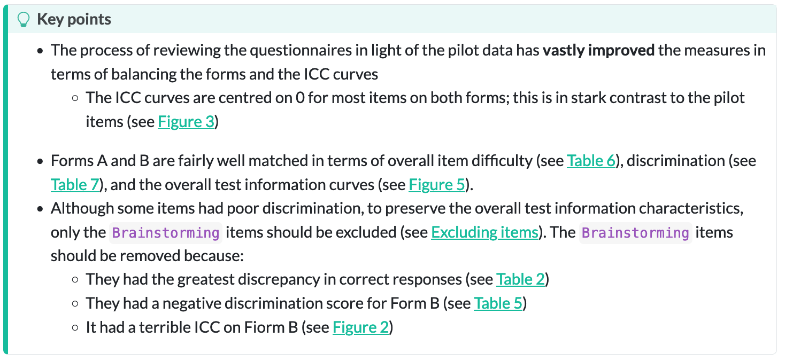
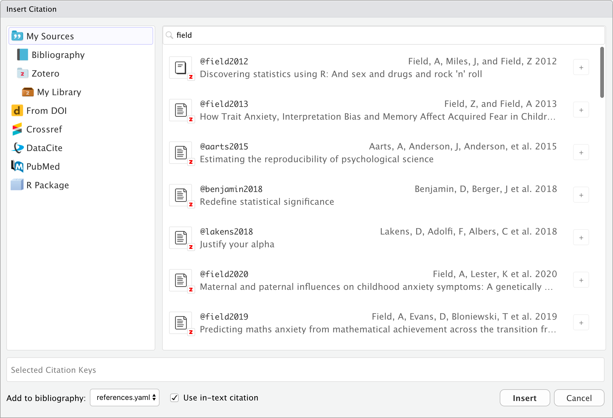
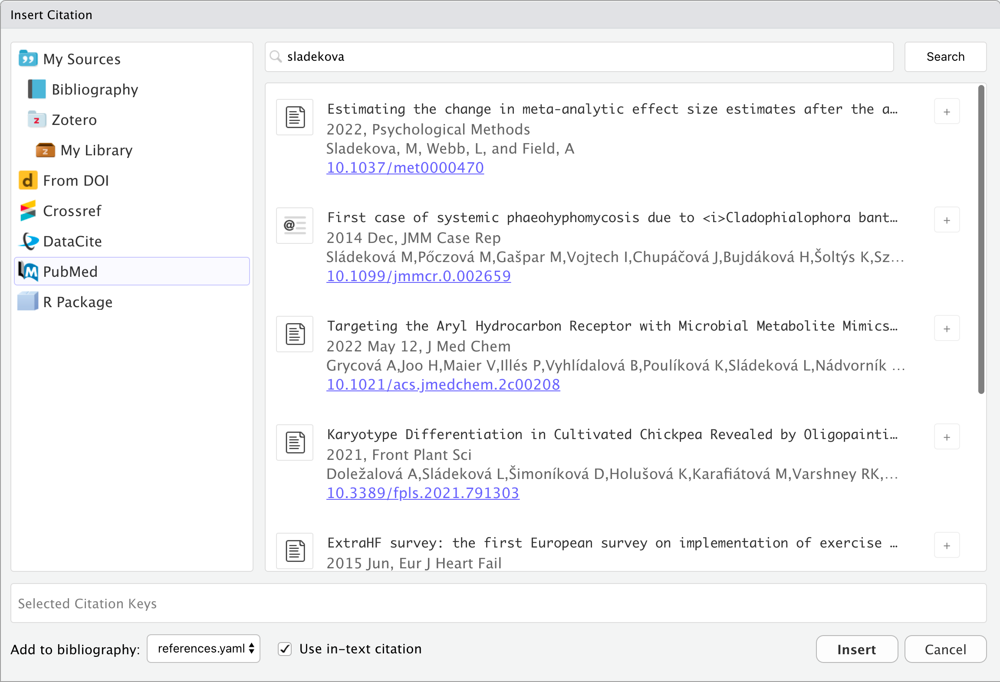
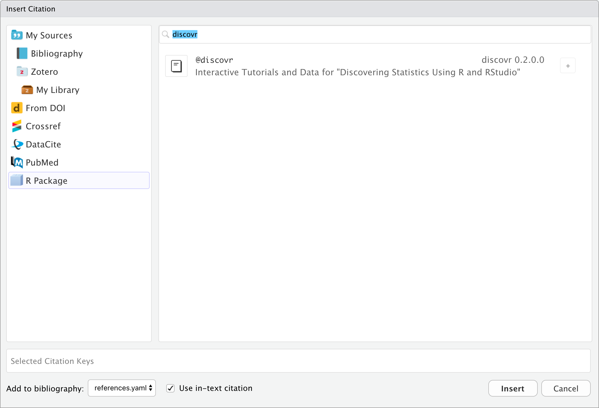
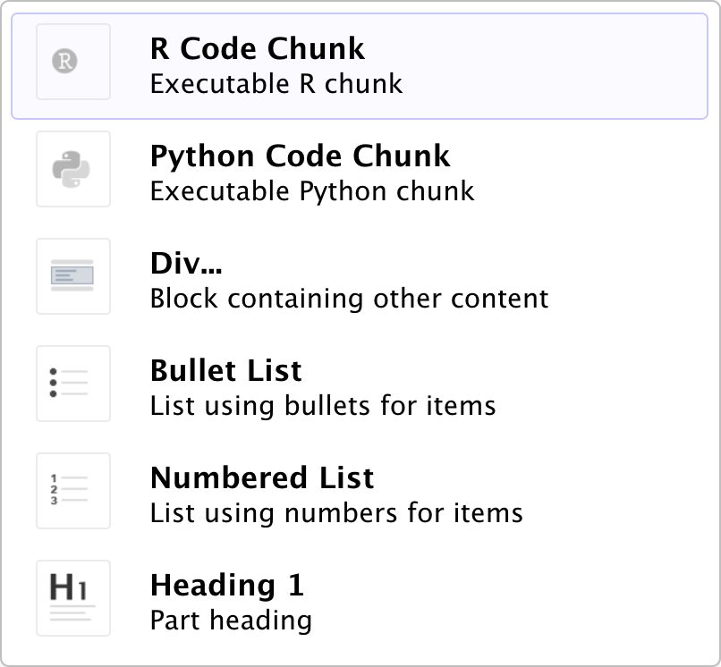

##  Interacting with `r rproj()` 

:::: columns
::: {.column width="60%"}

- The console (`r emo::ji("vomit")`)
    - Type commands at the console prompt
    - Bad for reproducibility/your sanity
    - Great for getting help, installing packages, trying things out

::: fragment

- `r quarto(0.3)` document (`r emo::ji("party")`)
    - A document that combines text and code
    - [**renders**]{.alt} to a nicely-formatted `.html`, `.docx` or `.pdf` (LaTeX required) file.
    - Code is executed (in sequence) when rendering
    - Great for reproducible documents
    - [**All coursework submitted as html file**]{.alt}

:::
:::

::: {.column width="40%"}
::: fragment
::: {.callout-tip icon = false}
## `r robot()` : Have a go!

- Create a new `r quarto(0.2)` document
- Save it as `my_first_quarto.qmd` in `quarto`
- Click {height=12} to [render]{.alt} the document.

:::
:::
:::
::::

## YAML

::: txt_xl
```{r}
#| eval: false

---
title: "Notes for discovr 1"
author: "Andy Field"
format: html
editor: visual
---
```

:::

::: fragment
::: txt_xl
::: {.callout-warning icon = false}
##  The danger zone!

This is [IMPORTANT]{.alt} ... always add `embed-resources: true`

```{r}
#| eval: false

---
title: "Notes for discovr 1"
author: "Andy Field"
format:
  html:
    embed-resources: true
editor: visual
---
```

:::
:::
:::

##

{fig-align="center" width=600}

## Headings

{fig-align="center"}

## Links and Images


{fig-align="center"}


## Format and insert

{fig-align="center"}

## Code chunks

- These are how we communicate with `r rproj()`
- More on these in Part 3
- In `r quarto(0.3)`
  - `Insert > Code Chunk > R`
- In `r rstudio(0.3)`
  - `Code > Insert Chunk`
- Keyboard shortcuts
  - `ctrl alt i` (Windows)
  - `⌘ ⌥ i` (MacOS)

\

::: txt_xl
```{r}
#| eval: false

eddie_tib <- discovr::eddiefy

dplyr::slice_sample(eddie_tib, n = 10) |> 
  insight::display()
```
:::

## Have a go!

{.absolute top=0 right=0 height="200"}

- Insert a code chunk at the bottom of your document
- Type the following into it

\

::: txt_xl
```{r}
#| eval: false

eddie_tib <- discovr::eddiefy

dplyr::slice_sample(eddie_tib, n = 10) |> 
  insight::display()
```
:::

\

-  the document.

##  LaTeX equations 

- `Insert > LaTeX Math > Display Math`
- A syntax for writing mathematical notation
- See [https://oeis.org/wiki/List_of_LaTeX_mathematical_symbols](https://oeis.org/wiki/List_of_LaTeX_mathematical_symbols)

\

We can include the linear model in its own paragraph like this: 

::: txt_xl
```{r}
#| eval: false

$$
\text{Happy} = \hat{b}_0 + \hat{b}_1\text{iron maiden} + e_i
$$
```
:::

### Rendered text

We can include the linear model in its own paragraph like this:

$$
\text{Happy} = \hat{b}_0 + \hat{b}_1\text{iron maiden} + e_i
$$

## Callouts

`Insert > callout`

\

:::: columns
::: {.column width="50%"}

:::

::: {.column width="50%"}

:::
::::


## Citations

- `Insert > @citation ...`
- Use Zotero reference manager!
  - Guide: [guides.lib.sussex.ac.uk/c.php?g=665332&p=4858999](https://guides.lib.sussex.ac.uk/c.php?g=665332&p=4858999)

{fig-align="center" height=450}

## Citations from pubmed

{fig-align="center" height=600}

## Cite `r rproj()` packages

{fig-align="center" height=600}

## Insert anything

:::: columns
::: {.column width="50%"}

- Windows (I assume): Press `ctrl /`
- MacOS: Press `⌘ /`

:::

::: {.column width="50%"}

:::
::::

## YAML: Other useful options

::: txt_xl
```{r}
#| eval: false

---
title: "Notes for discovr 1"
author: "Andy Field"
format:
  html:
    embed-resources: true
    toc: true
    code-fold: true
knitr:
  opts_chunk: 
    warning: false
    message: false
editor: visual
---
```
:::

\

- HTML options: [quarto.org/docs/reference/formats/html.html](https://quarto.org/docs/reference/formats/html.html)
- Theme list: [quarto.org/docs/output-formats/html-themes.html](https://quarto.org/docs/output-formats/html-themes.html)

## Comp`r rproj()`tition!

{.absolute top=0 right=0 height="200"}


- Create a new `r quarto(0.2)` file.
  - Save in `quarto` as `about_me.qmd`
  - Edit the yaml to include

::: txt_xl
```{r}
#| eval: false

format:
  html:
    embed-resources: true
```
:::

::: fragment

- Write a document about you or something you feel passionate about. Include some of things we have learnt:
  - Different level headers/text formats (bold, italic, etc.)
  - Hyperlinks
  - Blockquote
  - Callout
  - Citations
  - Themes

:::

