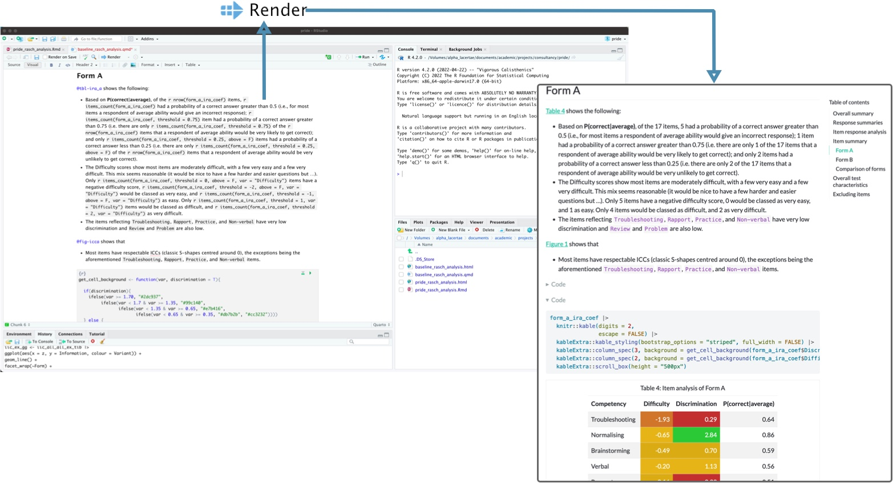
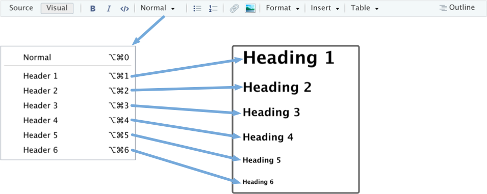
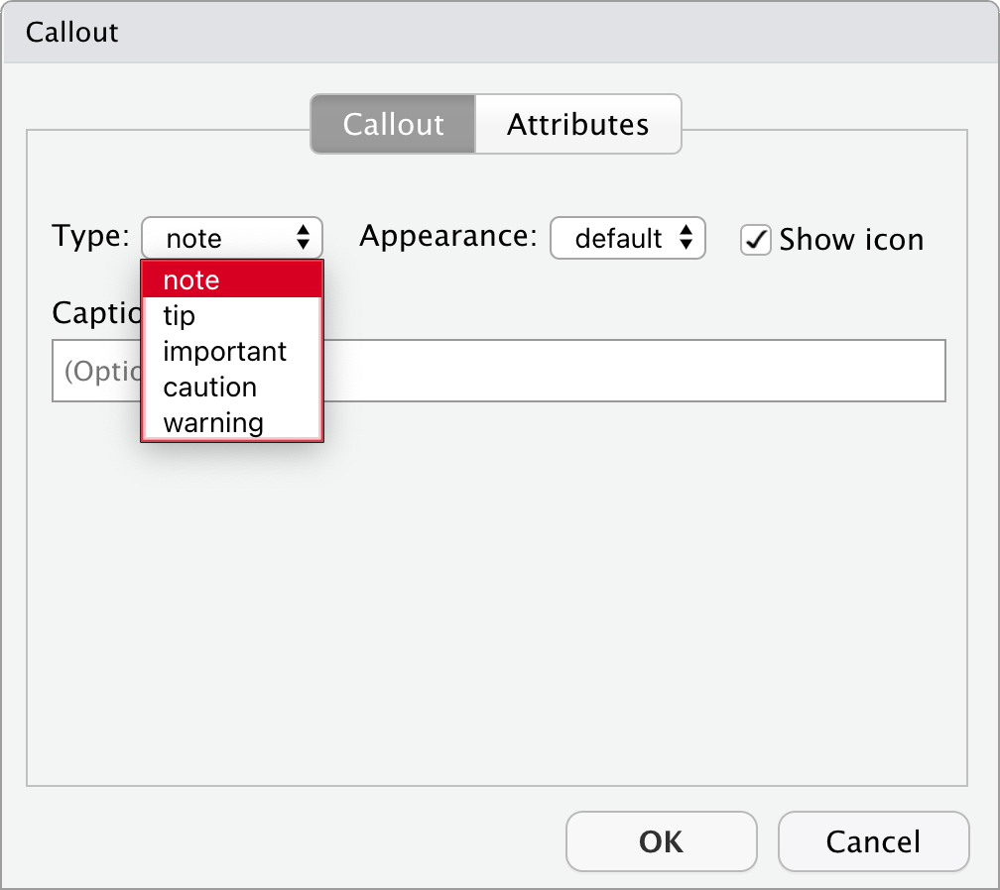
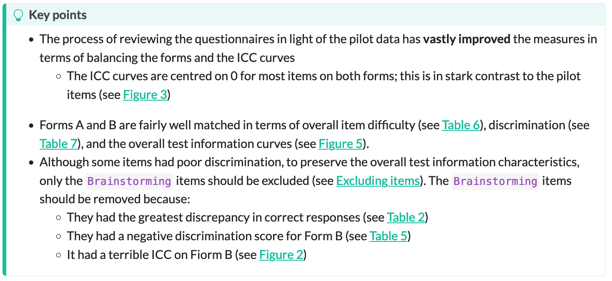

##  Interacting with `r rproj()` 

:::: columns
::: {.column width="60%"}

- The console (`r emo::ji("vomit")`)
    - Type commands at the console prompt
    - Bad for reproducibility/your sanity
    - Great for getting help, installing packages, trying things out

::: fragment

- `r quarto(0.3)` document (`r emo::ji("party")`)
    - A document that combines text and code
    - [**renders**]{.alt} to a nicely-formatted `.html`, `.docx` or `.pdf` (LaTeX required) file.
    - Code is executed (in sequence) when rendering
    - Great for reproducible documents
    - [**All coursework submitted as html file**]{.alt}

:::
:::

::: {.column width="40%"}
::: fragment
::: {.callout-tip icon = false}
## `r robot()` : Have a go!

- Create a new `r quarto(0.2)` document
- Save it as `iron_maiden.qmd` in `quarto`
- Click {height=12} to [render]{.alt} the document.

:::
:::
:::
::::

## YAML

::: txt_xl
```{r}
#| eval: false

---
title: "Iron Maiden"
author: "Andy Field"
format: html
editor: visual
---
```

:::

::: fragment
::: txt_xl
::: {.callout-warning icon = false}
##  The danger zone!

This is [IMPORTANT]{.alt} ... always add `embed-resources: true`

```{r}
#| eval: false

---
title: "Iron Maiden"
author: "Andy Field"
format:
  html:
    embed-resources: true
editor: visual
---
```

:::
:::
:::

##

{fig-align="center" width=600}

## Writing text

{fig-align="center"}

## Our report

::: txt_xl
:::{.callout-important icon=false}
##  Report`r rproj()`

Iron Maiden are a British heavy metal band. Their best albums are

- Piece of Mind
- Powerslave

:::


::: {.callout-tip icon = false}
## `r robot()` Have a go!

- In your `r quarto(0.2)` document `iron_maiden.qmd`
- Create a level 2 header `Introduction`
- Reproduce the text and bullet list above

:::
:::

{.absolute top=0 right=0 height="200"}


## Our report

```{=html}
<iframe width="780" height="600" src="./iron_maiden.html#introduction" title="A report about Iron Maiden"></iframe>
```


## Callouts

`Insert > callout`

\

:::: columns
::: {.column width="50%"}

:::

::: {.column width="50%"}

:::
::::

## Have a go!

- Insert a callout
- Recreate the text below using bullets and other text styles.

::: txt_xl
::: {.callout-caution}
## Hypothesis

- H~1~: Iron Maiden songs have got longer over time
- H~0~: The length of Iron Maiden songs has not changed over time

**The model**

- Outcome: Song duration in seconds (`song_duration`)
- Predictor: Number of years since the first album (`band_age`)

:::
:::

{.absolute top=0 right=0 height="200"}


##

```{=html}
<iframe width="780" height="350" src="./iron_maiden.html#iron-datum" title="A report about Iron Maiden"></iframe>
```

::: txt_xl 
::: {.callout-tip icon = false}
## `r robot()` Have a go!

- In your `r quarto(0.2)` document `iron_maiden.qmd`
- Create a level 2 header (at the bottom) called `Iron Datum`
- Create a level 3 header called `Load and Look`

:::
:::

{.absolute top=0 right=0 height="200"}


