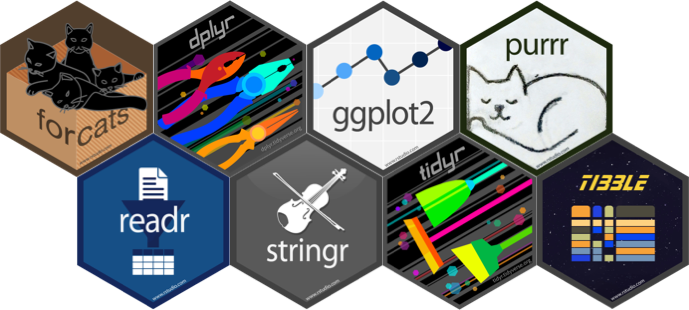
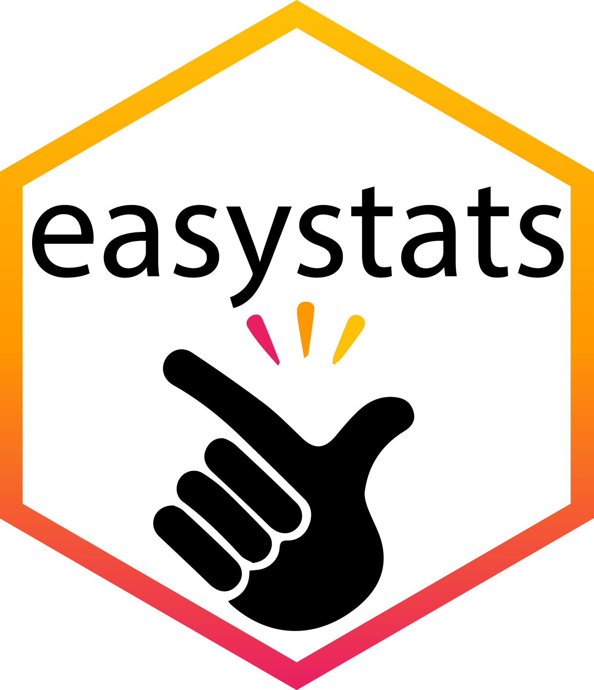

##  The tidyverse 

{.absolute top=0 right=0 width=150 height=150}


- A set of packages built upon a common philosophy of data science
- We teach `tidyverse` style 


{fig-align="center"}

::: notes
Image: montage of tidyverse package logos
:::

##  Messy vs. Tidy data 

### Messy data (aka 'wide' data)

What IBM SPSS Statistics uses

- Each row represents a unique case/entity

::: fragment

###  Tidy data (aka 'long' data)

What many (but not all) `r rproj()` functions require

- Each row represents an instance of the outcome measure
- Rows code information about that 'instance'

:::

##  Tidy data example

:::: columns 
::: {.column width="50%"}
Are invisible people mischievous?

- Placed participants in an enclosed community riddled with hidden cameras
- Measured how many mischievous acts participants performed in a week
- Manipulated whether or not there was access to an invisibility cloak

:::

::: {.column width="50%"}
{fig-align="center"}
:::
::::

## Independent design

:::: columns 
::: {.column width="50%"}

- 12 participants given an invisibility cloak
- 12 participants not given an invisibility cloak
- A random sample of *N* = 3 from each group is shown

:::

::: {.column width="50%"}
::: fragment
```{r}
#| echo: false
#| message: false

cloak_tib |>
  knitr::kable(format = "html") |> 
  kableExtra::kable_styling(bootstrap_options = "striped")
```
:::
:::
::::

## Repeated measures design

:::: columns 
::: {.column width="50%"}

- 12 participants given an invisibility cloak for one week
- During a different week they did not have an invisibility cloak
- A random subsample of *N* = 5 participants is displayed

:::
::: {.column width="50%"}
::: fragment
```{r}
#| echo: false
#| message: false

cloak_tib_rm |>
  knitr::kable(format = "html") |> 
  kableExtra::kable_styling(bootstrap_options = "striped")
```
:::
:::
::::

## Easystats


- A set of packages built upon a common workflow for fitting and evaluating models
- We lean heavily into the `easystats` eco-system because it flattens the learning curve.

{fig-align="center"}

## Easystats

{fig-align="center"}
