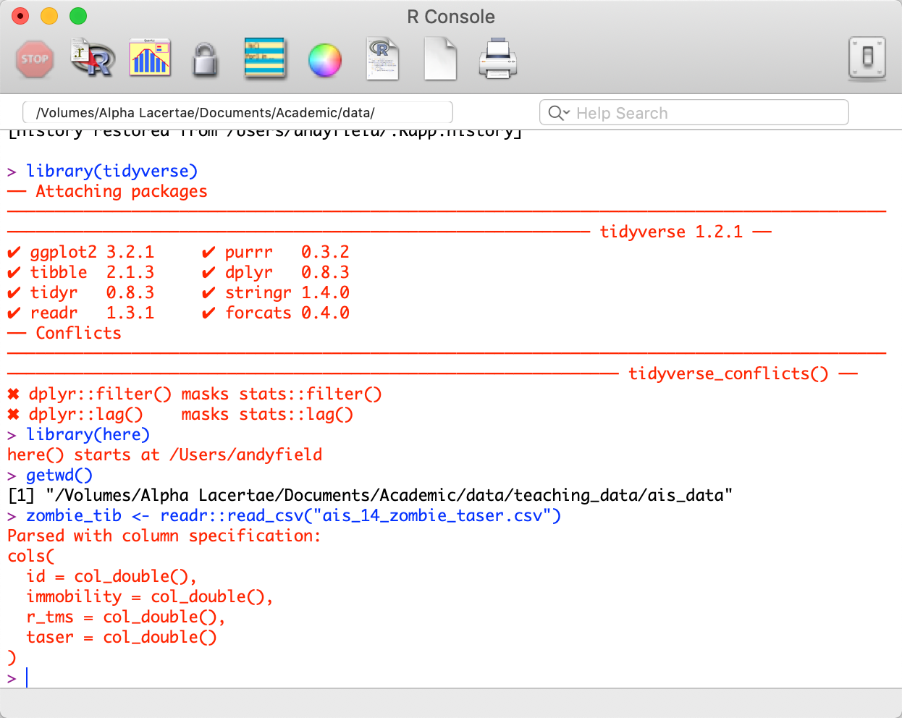
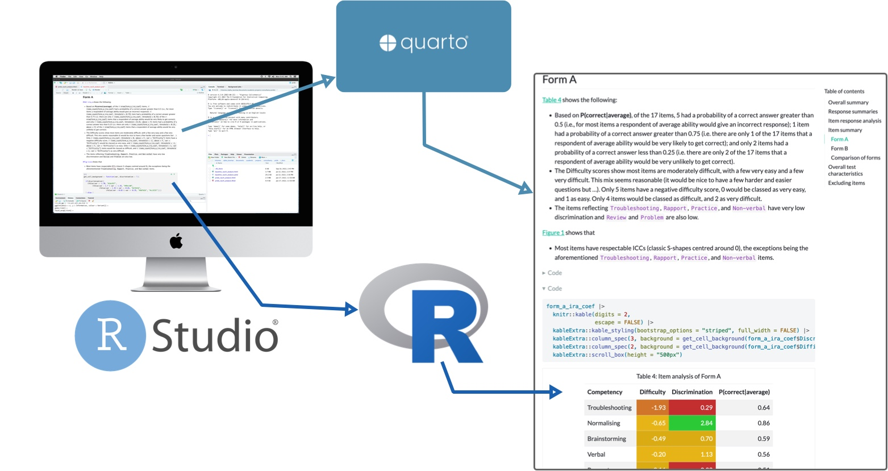
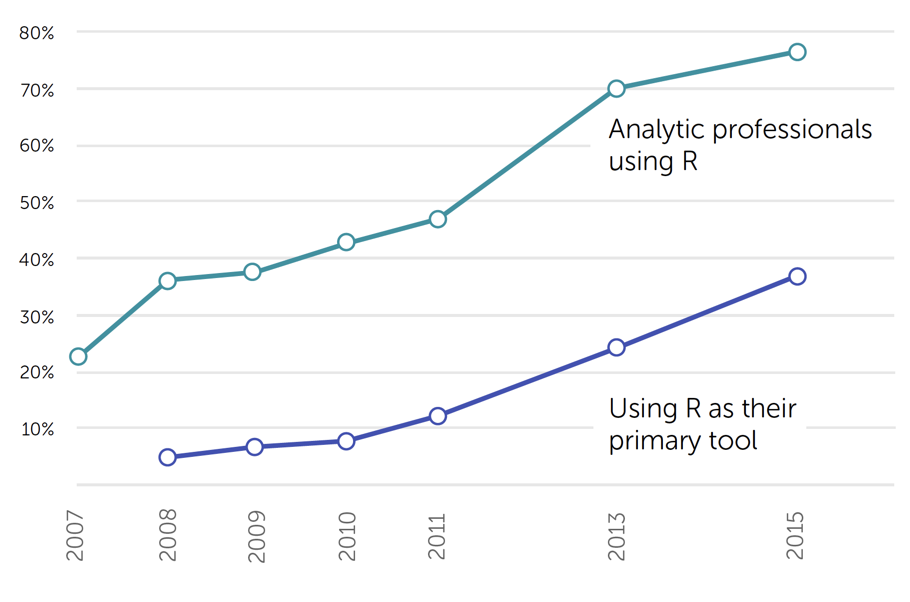
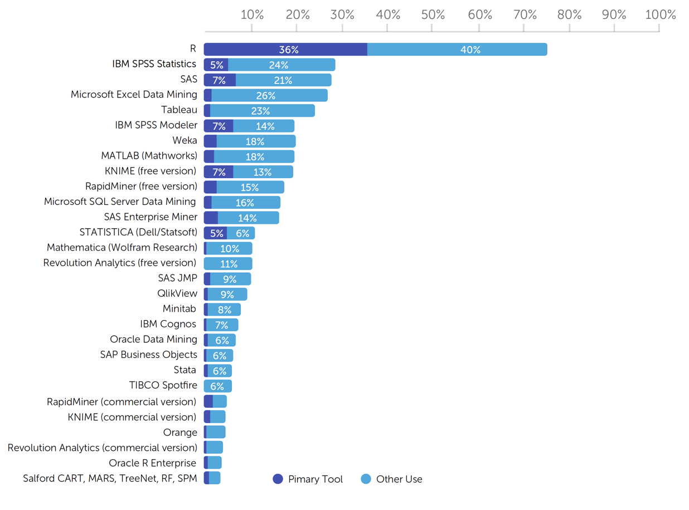

## `r rproj()` is horrible

:::: columns 
::: {.column width="50%"}

:::
::: {.column width="50%"}

:::
::::

::: notes
Left image of R logo, right image of Base R window, showing that it looks ugly and difficult to use.
:::

## {background-image="media/morty_scream.jpg" background-size="cover"}

::: notes
Image of Morty from Rick and Morty screaming in pardoy of Edvard Munch's 'The Scream'.
:::

##

{.absolute width=323px height=277px left=340px top=3px}

::: fragment
{.absolute width=500px height=155px left=240px top=415px}
:::

::: notes
Top image of `r rstudio(scale = 0.4)` logo, bottom image of R logo.
:::

## {background-image="media/rick_smiling.jpg" background-size="cover"}

::: notes
Image of Rick from Rick and Morty smiling maniacally.
:::

## A Car Analogy

::: fragment
### `r rproj()` The engine

- Free software environment for statistical analysis and graphics

:::
::: fragment
### `r rstudio(scale = 0.4)` The dashboard

- A free integrated development environment (IDE) for `r rproj()`
- You use `r rstudio(scale = 0.4)` as a way to interact with `r rproj()`

:::
::: fragment
### `r quarto(scale = 0.4)` The paint job

- A document creation system used within `r rstudio(scale = 0.4)`
- A quarto document is like a word processing document in which you can embed (and execute) code
- 'Render' the quarto document into a beautiful report containing text, code and output from the code.

:::

##

{fig-align="center" height=600}

## Why `r rproj()`?

::: {.incremental}

- Transferable skills
- `r rproj()` is the most widely used data analysis software
- Reproducible science
- Cutting edge
- One stop shop
- `r rstudio(scale = 0.4)` is amazeballs

:::

##

{fig-align="center" height=600}

##

{fig-align="center" height=600}

