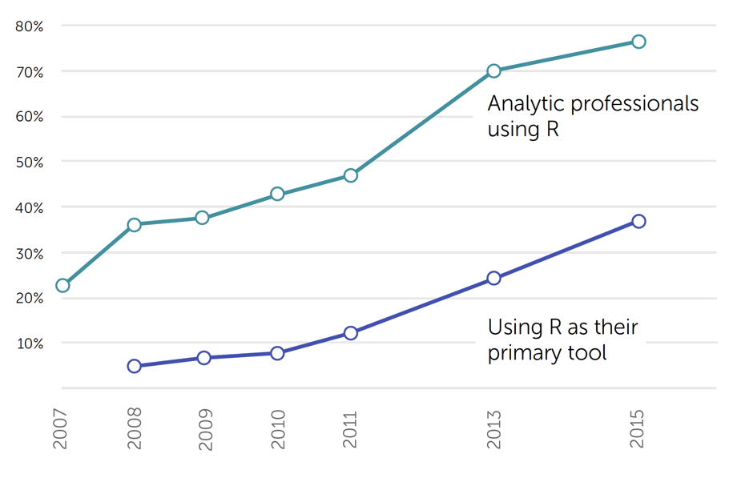
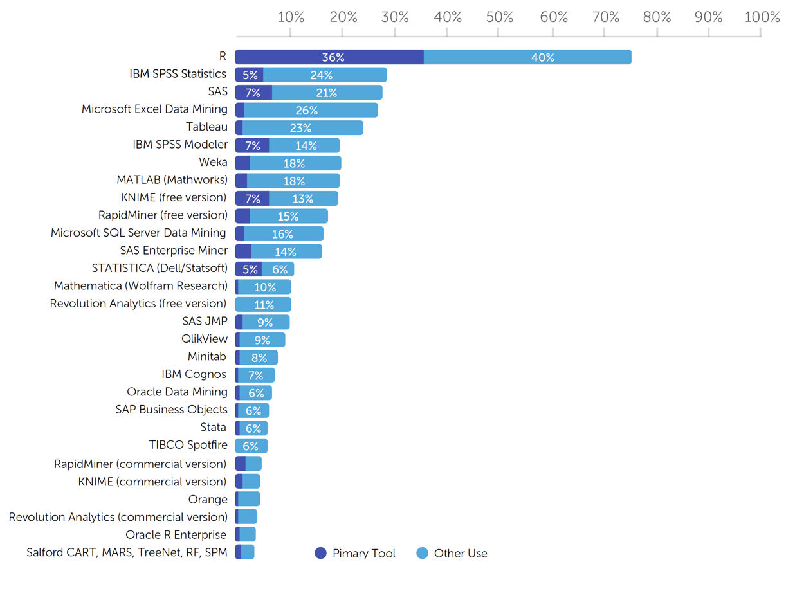
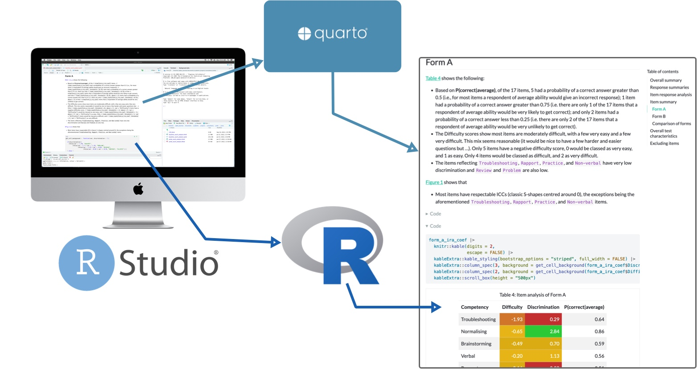

## Why `r rproj()`?

::: {.incremental}

- Transferable skills
- `r rproj()` is the most widely used data analysis software
- Reproducible science
- Cutting edge
- One stop shop
- `r rstudio(scale = 0.4)` is amazeballs

:::

##

{fig-align="center" height=600}

##

{fig-align="center" height=600}

## A Car Analogy

::: fragment
### `r rproj()` The engine

- Free software environment for statistical analysis and graphics

:::
::: fragment
### `r rstudio(scale = 0.4)` The dashboard

- A free integrated development environment (IDE) for `r rproj()`
- You use `r rstudio(scale = 0.4)` as a way to interact with `r rproj()`

:::
::: fragment
### `r quarto(scale = 0.4)` The paint job

- A document creation system used within `r rstudio(scale = 0.4)`
- A quarto document is like a word processing document in which you can embed (and execute) code
- 'Render' the quarto document into a beautiful report containing text, code and output from the code.

:::

##

{fig-align="center" height=600}

