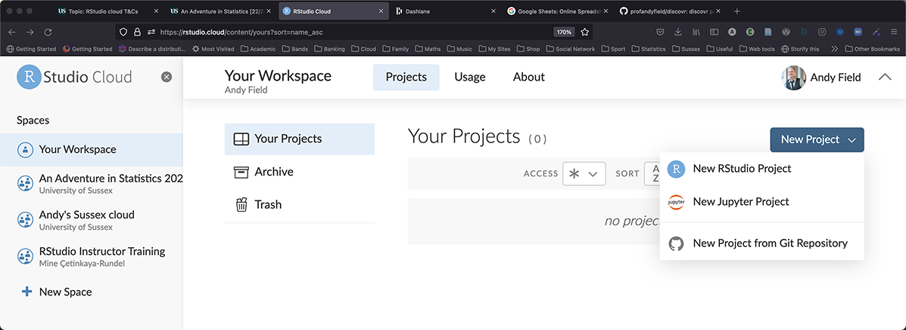
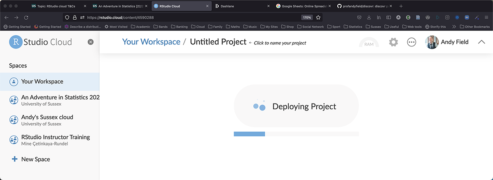
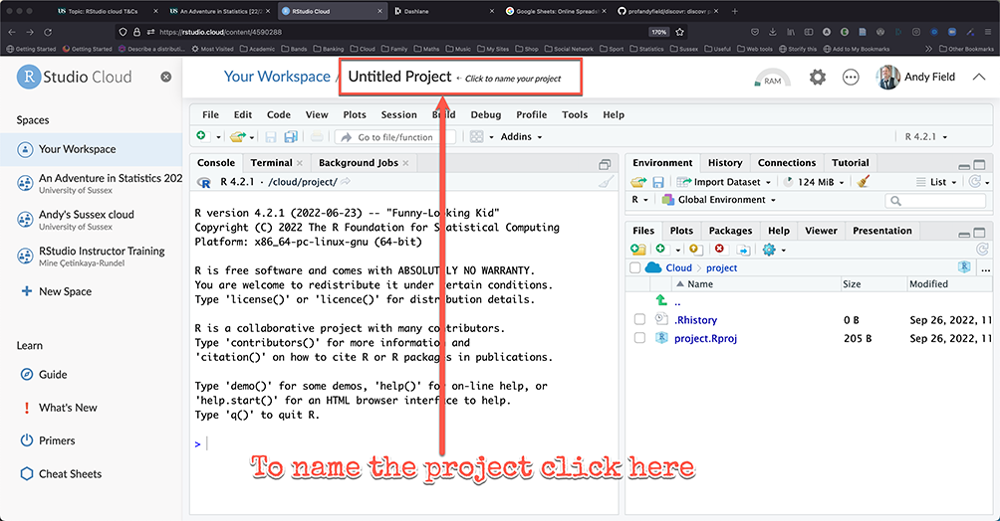
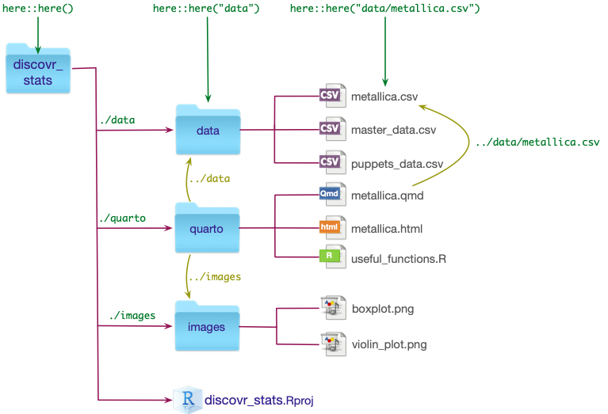
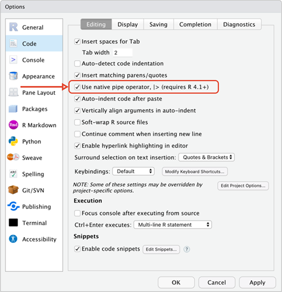
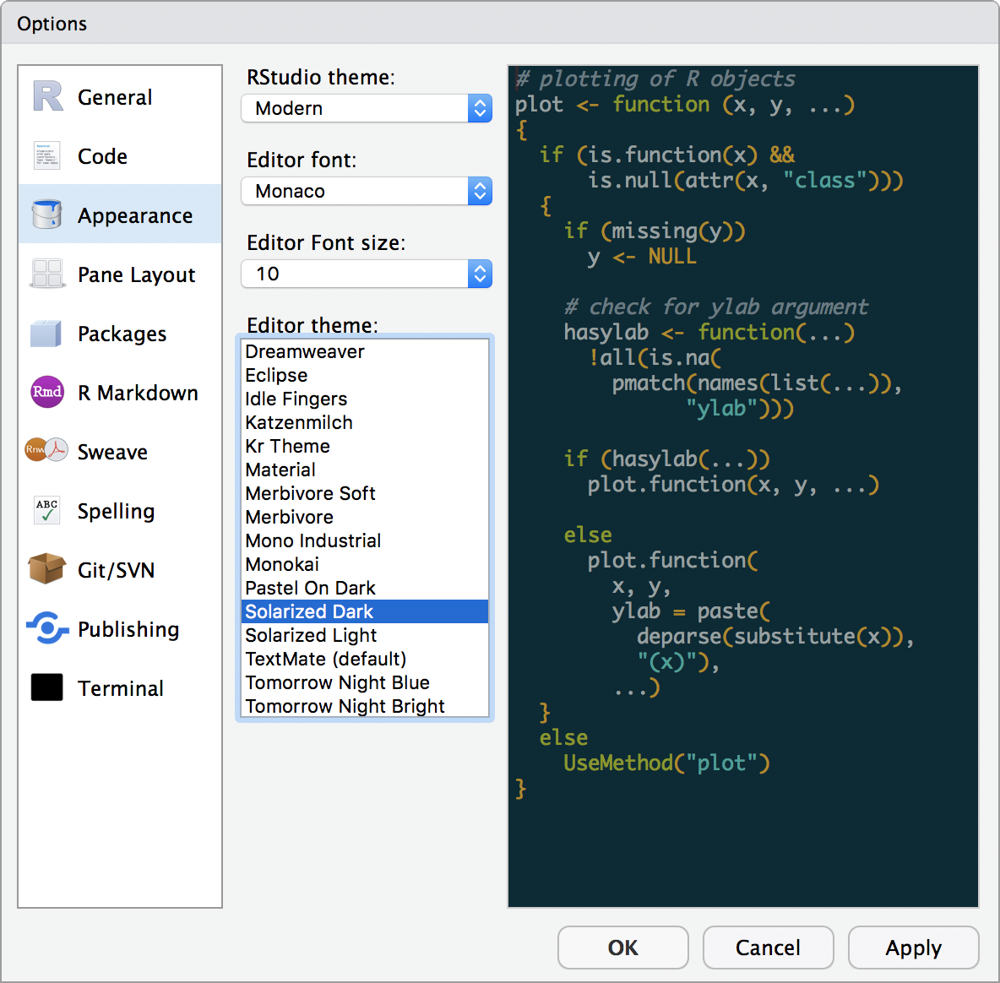
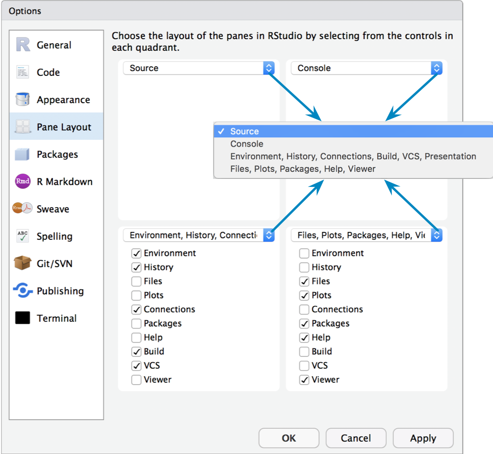
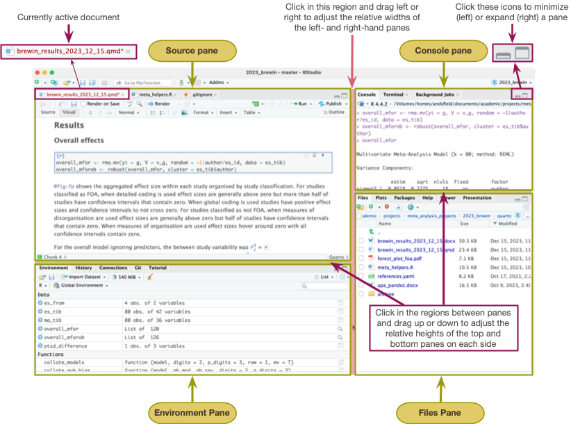

##  `r rstudio(scale = 0.6)` project files 

{.absolute top=0 right=0 height="200"}

A file created by `r rstudio(scale = 0.4)` with the extension [.Rproj]{.alt}

- Stores information about the containing folder
- Restores the previous state of the project (i.e. what documents/tabs were open)

::: fragment

- Opening a project file sets the working directory to the folder containing the project file
  - You can use relative file paths
  - Outside of Posit cloud you can share the project folder and it will work on any machine/operating system you care to use
 
:::

::: fragment
::: {.callout-tip icon = false}
## `r robot()` : Have a go!

- Use project files!
- Posit cloud automatically uses them!
- Create an `r rstudio(scale = 0.4)` project called `my_adventr` on [RStudio cloud]{.alt}

:::
:::

## Creating a project

{.absolute top=0 right=0 width="150"}

{.absolute top=150}

##

{fig-align="center"}

##

{fig-align="center"}

## Get organized!

{fig-align="center" height=600}

## Try it!

Within your `r rstudio(scale = 0.4)` project called `my_adventr` create folders called

- `data`
- `quarto`
- `images`
  
::: fragment

Copy the following files from canvas

- `eddiefy.csv` to the `data` folder
- `iron_maiden_logo.png` to the `images` folder

:::

{.absolute top=0 right=0 height="200"}

## Customizing `r rstudio(scale = 0.6)` 

### Use the native pipe (`|>`)

{fig-align="center" height=500}

## Colour scheme 

:::: columns
::: {.column width="50%"}

::: {.callout-tip icon = false}
## `r robot()` : Have a go!

- Windows
  - `Tools > Options`
- MacOS
  - `Tools > Global Options`
  - `Tools > Project options`

:::

{fig-align="center" height=300}

:::

::: {.column width="50%"}

:::
::::

::: notes
Image of the dialog box for editing the colour scheme of `r rstudio(scale = 0.4)`
:::

## Pane locations

:::: columns
::: {.column width="50%"}
###  Have a go!

{height="500"}
:::

::: {.column width="50%"}
{height="500"}
:::
::::

::: notes
Image of the dialog box for editing the location of panes in RStudio
:::

##

::: notes
Image of the RStudio interface
:::
