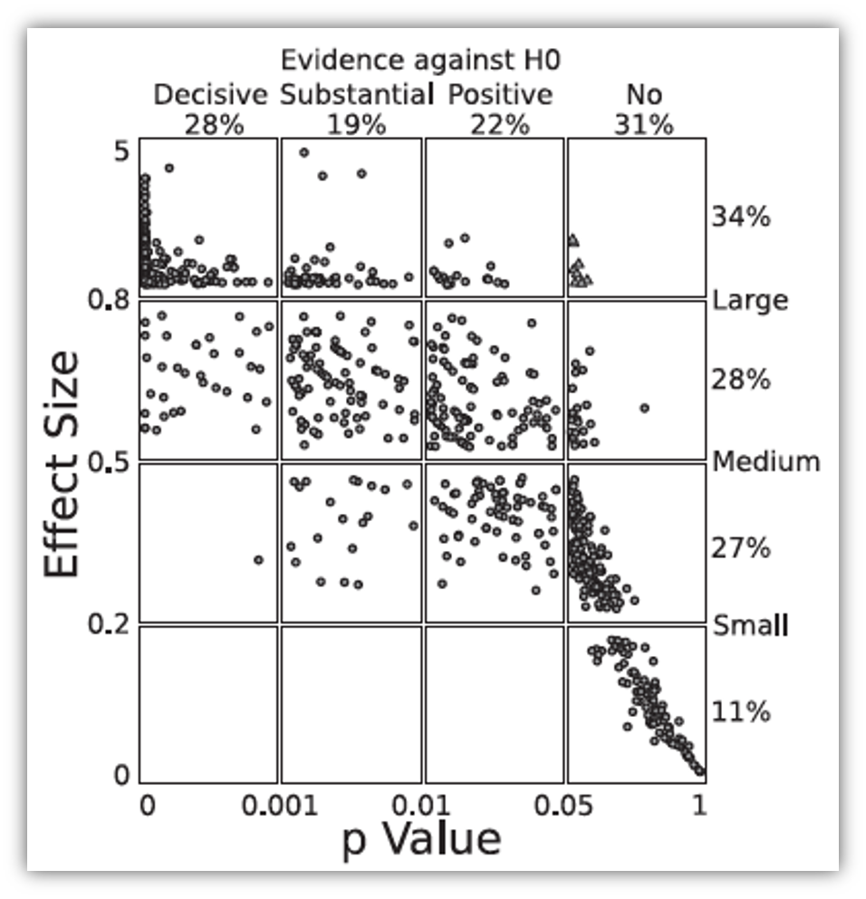
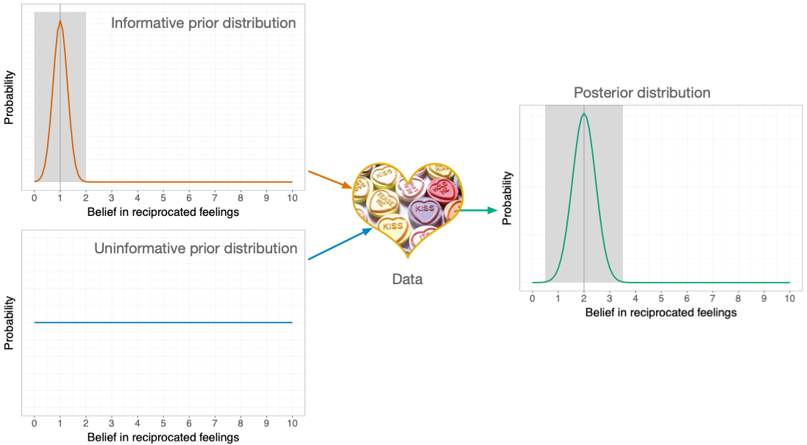
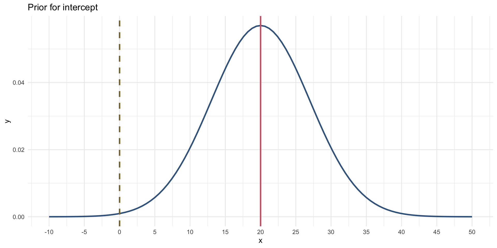
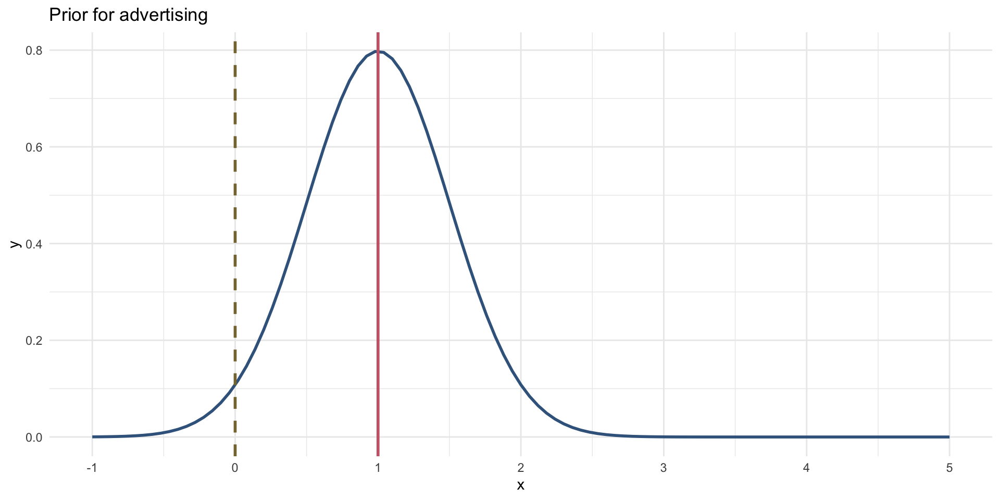
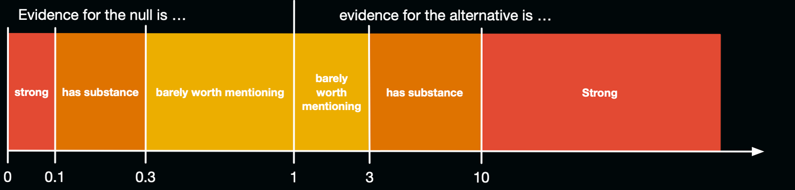
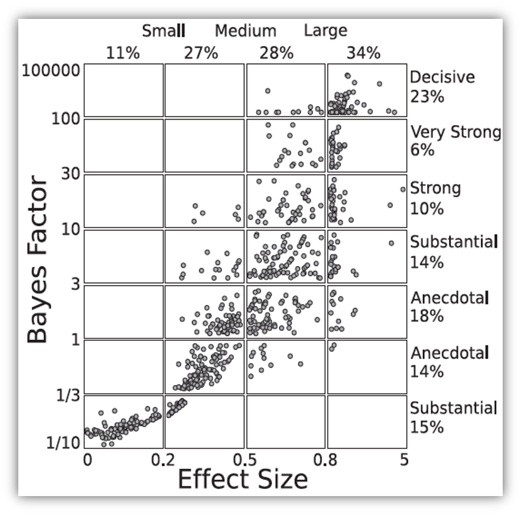
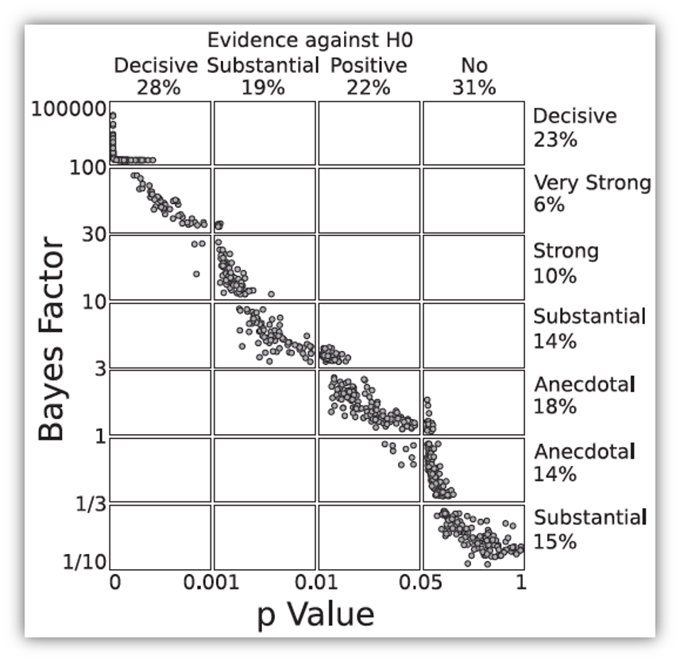

# Bayesian Approaches

**What are they and why do we need them?**

Professor Andy Field, University of Sussex

Links: [winterfylleth a careworn heart](https://profandyfield.github.io/statistics_lectures/ais_05_bayes/media/winterfylleth_a_careworn_heart.mp3) \| [bsky.app](https://bsky.app/profile/profandyfield.bsky.social) \| [youtube.com](https://www.youtube.com/user/ProfAndyField) \| [discoveringstatistics.com](https://www.discoveringstatistics.com) \| [discovr.rocks](https://www.discovr.rocks) \| [statisticsadventure.com](https://www.statisticsadventure.com)

## About this version

This is a plain-text version of the lecture slides. Each slide starts with a heading such as “Slide 5”, and the numbers match the slide numbers shown in the lecture. Content that appeared one piece at a time, in columns or in tabs is shown in reading order. Videos and interactive apps are given as links.

## Slide 2: Learning outcomes

Bayes factors

- Articulate the principles of Bayesian approaches
- Define what a Bayes factor represents

Bayesian estimation

- Uninformative priors
- Informatibe priors
- Interpretation

## Slide 3


## Slide 4: Problems with p – A recap

- Tells us nothing about importance because *p* depends upon sample size.
- Provides little evidence about the null (or alternative) hypothesis
- Encourages all-or-nothing thinking
- Based on long-run probabilities
  - *p* is the frequency of the observed test statistic relative to all test statistics from an infinite number of identical experiments with the exact same a priori sample size.
  - The type I error rate is in a given study is either 0 or 1, but we don’t know which.

## Slide 5: Effect sizes and p

- Wetzels et al. (2011). Statistical Evidence in Experimental Psychology: An Empirical Comparison Using 855 *t*-tests. *Perspectives on Psychological Science*, 6, 291–298. <https://doi.org/10.1177/1745691611406923>



## Slide 6 (new section): Bayesian estimation

## Slide 7



## Slide 8

Video clip: [miltons walks 01](https://profandyfield.github.io/statistics_lectures/ais_05_bayes/media/miltons_walks_01.mp4)

## Slide 9

Video clip: [miltons walks 02](https://profandyfield.github.io/statistics_lectures/ais_05_bayes/media/miltons_walks_02.mp4)

## Slide 10


## Slide 11: A musical example1

### Outcome

- `sales`: Revenue from physical, download and streamed album sales in first week (£ thousands)

### Predictors

- `adverts`: amount spent promoting the album before release (£ thousands)
- `airplay`: how many times songs from the album were played on a prominent national radio station in the week before release
- `image`: ratings of the ‘look’ of the band out of 10

### The model

``` math
 \begin{aligned} \text{Sales}_i & = b_0 + b_1\text{Advertising}_i + \varepsilon_i \\ \varepsilon_i &\sim N(0, \sigma^2) \end{aligned} 
```

*Footnotes*

1.  Chapter 8 from Field (2026). *Discovering Statistics using R and RStudio*. London: Sage.

## Slide 12: Priors

- You need a prior for each parameter in the model
  - $`b_0`$
  - $`b_1`$
  - $`\sigma^2`$
- Uninformative priors
  - A.K.A ‘flat priors’
  - Uniform distribution or very wide distribution
  - Estimates heavily data-driven

## Slide 13

### OLS

| Parameter   | Coefficient | SE       | 95% CI           | t(198) | p       |
|-------------|-------------|----------|------------------|--------|---------|
| (Intercept) | 134.14      | 7.54     | (119.28, 149.00) | 17.80  | \< .001 |
| adverts     | 0.10        | 9.63e-03 | (0.08, 0.12)     | 9.98   | \< .001 |

### Bayesian

| Parameter   | Median | 95% CI           | pd   | Rhat  | ESS  | Prior                     |
|-------------|--------|------------------|------|-------|------|---------------------------|
| (Intercept) | 134.21 | (119.22, 149.23) | 100% | 1.000 | 3630 | Normal (193.20 +- 201.75) |
| adverts     | 0.10   | (0.08, 0.11)     | 100% | 0.999 | 3845 | Normal (0.00 +- 0.42)     |

## Slide 14: Confidence vs. Credible intervals

> **Warning: The danger zone!**
>
> What **confidence** intervals are NOT:
>
> - There is NOT a 95% probability that a given interval contains the population value.
>   - It is *p* = 0 or *p* = 1, but you can’t know which!
> - They do NOT reflect confidence in the value of the population parameter.

> **Note: Statis-tip**
>
> What **credible** intervals ARE:
>
> - Intervals that contain the ‘true’ population value of the parameter in 95% of samples

## Slide 15: Informative priors

- Reflect prior knowledge
- The prior exerts more influence on estimates than an uninformative prior
- Can be strong
  - A narrow distribution
  - The prior has more influence than for a weak prior
- Can be weak
  - A wider distribution
  - The prior has less influence than for a strong prior
- ‘Congugate’ distributions
  - Normal, Gamma, Beta

## Slide 16: Prior for the intercept (\\b_0\\)

> **Caution: Think about it!**
>
> - What do we already know about album sales when advertising = £0
> - Historic data:
>   - Expect 20,000 sales on average
>   - It varies for different artists (*SD* = 7,000)

``` math
 b_0 \sim N(20, 7) 
```



## Slide 17: Prior for the effect of advertising (\\b_1\\)

> **Caution: Think about it!**
>
> - Historic data:
>   - For every £1000 pounds they spend on advertising they can expect 1000 album sales. This equates to a $`b`$ = 1.
>   - Although spending money on advertising typically increases sales, they have been known to go down.

 

``` math
 b_1 \sim N(1, 0.5) 
```



## Slide 18

### OLS

| Parameter   | Coefficient | SE       | 95% CI           | t(198) | p       |
|-------------|-------------|----------|------------------|--------|---------|
| (Intercept) | 134.14      | 7.54     | (119.28, 149.00) | 17.80  | \< .001 |
| adverts     | 0.10        | 9.63e-03 | (0.08, 0.12)     | 9.98   | \< .001 |

### Bayesian

| Parameter   | Median | 95% CI         | pd     | Rhat  | ESS  | Prior               |
|-------------|--------|----------------|--------|-------|------|---------------------|
| (Intercept) | 26.25  | (-0.97, 53.35) | 97.10% | 1.000 | 2115 | Normal (20 +- 7.00) |
| adverts     | 0.10   | (0.06, 0.13)   | 100%   | 1.000 | 2440 | Normal (1 +- 0.50)  |

## Slide 19

Video clip: [miltons walks 03](https://profandyfield.github.io/statistics_lectures/ais_05_bayes/media/miltons_walks_03.mp4)

## Slide 20

Video clip: [miltons walks 04](https://profandyfield.github.io/statistics_lectures/ais_05_bayes/media/miltons_walks_04.mp4)

## Slide 21

Video clip: [miltons walks 05](https://profandyfield.github.io/statistics_lectures/ais_05_bayes/media/miltons_walks_05.mp4)

## Slide 22 (new section): Bayes Factors

## Slide 23: Bayes theorem

``` math
 \begin{aligned} p(\text{A}|\text{B}) &= \frac{p(\text{B}|\text{A})\times p(\text{A})}{p(\text{B})} \end{aligned} 
```

``` math
 \begin{aligned} p(\text{model}|\text{data}) &= \frac{p(\text{data}|\text{model})\times p(\text{model})}{p(\text{data})} \end{aligned} 
```

``` math
 \begin{aligned} \text{posterior probability} &= \frac{\text{liklihood}\times \text{prior probability}}{\text{marginal liklihood}} \end{aligned} 
```

## Slide 24


### Null hypothesis: You’re human

## Slide 25


### Null hypothesis: You’re human

### Alt hypothesis: You’re alien!

## Slide 26


``` math
 \begin{aligned} p(\text{hypothesis}|\text{match}) &= \frac{p(\text{match}|\text{hypothesis})\times p(\text{hypothesis})}{p(\text{match})} \end{aligned} 
```

``` math
 \begin{aligned} \text{posterior probability} &= \frac{\text{liklihood}\times \text{prior probability}}{\text{marginal liklihood}} \end{aligned} 
```

## Slide 27


``` math
 \begin{aligned} \text{prior probability} = p(\text{alien}) = \frac{1}{2000} = 0.0005 \end{aligned} 
```

``` math
 \begin{aligned} \text{marginal liklihood} = p(\text{match}) = \frac{100}{2000} = 0.05 \end{aligned} 
```

``` math
 \begin{aligned} \text{liklihood} = p(\text{match}|\text{alien}) = \frac{p(\text{alien} \cap \text{match})}{p(\text{alien})} = \frac{\frac{1}{2000}}{\frac{1}{2000}} = 1 \end{aligned} 
```

## Slide 28: Alternative hypothesis (you’re alien)

``` math
 \begin{aligned} p(\text{alien}|\text{match}) &= \frac{p(\text{match}|\text{alien})\times p(\text{alien})}{p(\text{match})} \\ &= \frac{1\times 0.0005}{0.05} \\ &= 0.01 \end{aligned} 
```

## Slide 29


``` math
 \begin{aligned} \text{prior probability} = p(\text{human}) = \frac{1999}{2000} = 0.9995 \end{aligned} 
```

``` math
 \begin{aligned} \text{marginal liklihood} = p(\text{match}) = \frac{100}{2000} = 0.05 \end{aligned} 
```

``` math
 \begin{aligned} \text{liklihood} = p(\text{match}|\text{human}) = \frac{p(\text{human} \cap \text{match})}{p(\text{human})} = \frac{\frac{99}{2000}}{\frac{1999}{2000}} = 0.0495 \end{aligned} 
```

## Slide 30: Null hypothesis (you’re human)

``` math
 \begin{aligned} p(\text{human}|\text{match}) &= \frac{p(\text{match}|\text{human})\times p(\text{human})}{p(\text{match})} \\ &= \frac{0.0495\times 0.9995}{0.05} \\ &= 0.99 \end{aligned} 
```

## Slide 31

``` math
 \begin{aligned} \text{posterior odds} = \frac{p(\text{hypothesis 1}|\text{data})}{p(\text{hypothesis 2}|\text{data})} = \frac{p(\text{alien}|\text{match})}{p(\text{human}|\text{match})} = \frac{0.01}{0.99} = 0.01 \end{aligned} 
```

``` math
 \begin{aligned} \frac{p(\text{alternative}|\text{data})}{p(\text{null}|\text{data})} = \frac{\frac{p(\text{data}|\text{alternative})\times p(\text{alternative})}{p({\text{data})}}}{\frac{p(\text{data}|\text{null})\times p(\text{null})}{p({\text{data})}}} = \frac{p(\text{alien}|\text{match})}{p(\text{human}|\text{match})} = \frac{0.01}{0.99} = 0.01 \end{aligned} 
```

``` math
 \begin{aligned} \frac{p(\text{alternative}|\text{data})}{p(\text{null}|\text{data})} = \frac{p(\text{data}|\text{alternative})}{p(\text{data}|\text{null})} \times \frac{p(\text{alternative})}{p(\text{null})} \end{aligned} 
```


## Slide 32

``` math
 \begin{aligned} \frac{p(\text{alien}|\text{match})}{p(\text{human}|\text{match})} = \frac{p(\text{match}|\text{alien})}{p(\text{match}|\text{human})} \times \frac{p(\text{alien})}{p(\text{human})} \end{aligned} 
```


``` math
 \begin{aligned} \frac{0.01}{0.99} &= \frac{1}{0.0495} \times \frac{0.0005}{0.9995} \\ 0.01 &= 20.20 \times 0.0005 \end{aligned} 
```

> **Note: Statis-tip**
>
> - Given a DNA match, we should shift our belief towards that person being an alien by a factor of about 20

## Slide 33: Bayes factor (BF10)

- The probability of the data given the alternative hypothesis relative to the probability of the data given the null.

- The extent to which you should change your beliefs about the alternative hypothesis relative to the null

- You sometimes see Bayes factors expressed the opposite way around (BF<sub>01</sub>)



## Slide 34: Bayes factors, p and effect sizes1





*Footnotes*

1.  Wetzels et al. (2011). *Perspectives on Psychological Science*, 6, 291–298. <https://doi.org/10.1177/1745691611406923>

## Slide 35: Back to album sales

| Parameter   | Median | 95% CI         | BF     | Rhat  | ESS  | Prior               |
|-------------|--------|----------------|--------|-------|------|---------------------|
| (Intercept) | 26.25  | (-0.97, 53.35) | 0.041  | 1.000 | 2115 | Normal (20 +- 7.00) |
| adverts     | 0.10   | (0.06, 0.13)   | 601.16 | 1.000 | 2440 | Normal (1 +- 0.50)  |

- We should shift our beliefs in advertising having a non-zero relationship to sales by a factor of about 601.

## Slide 36: Summary

- We can go beyond *p* to evaluate the plausibility of a hypothesis
- Other methods address more useful questions, are less dependent on sample sizes, and avoid all-or-nothing thinking
- Bayesian estimation allows us to factor in prior knowledge
- Credible intervals tell us the plausible population values
- Bayes factors quantify the relative probability of the data given the null and alternative hypothesis
