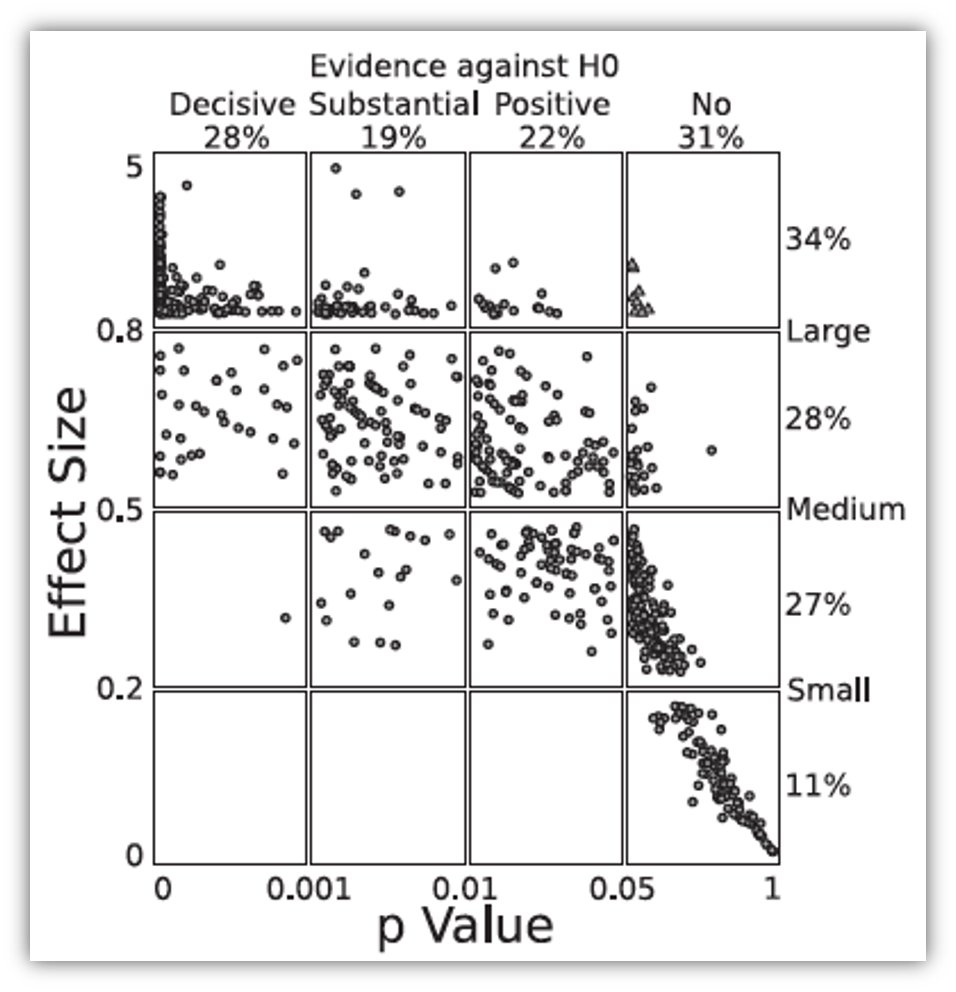
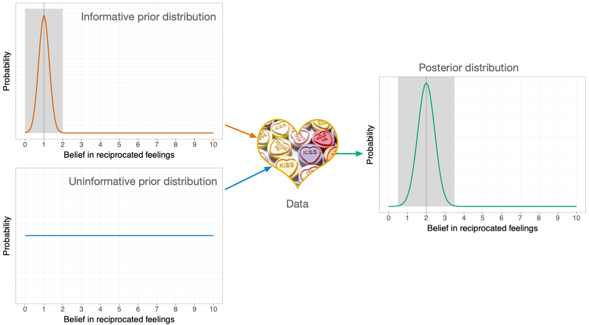
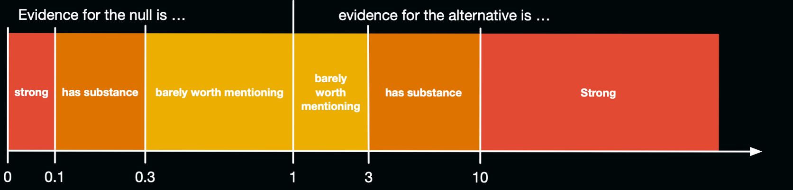
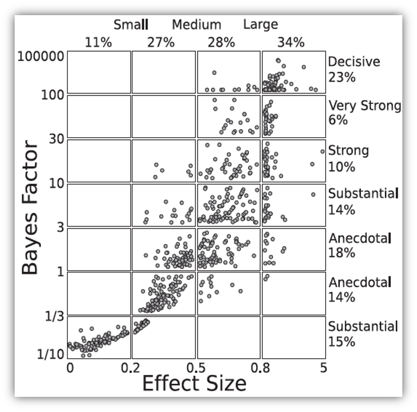
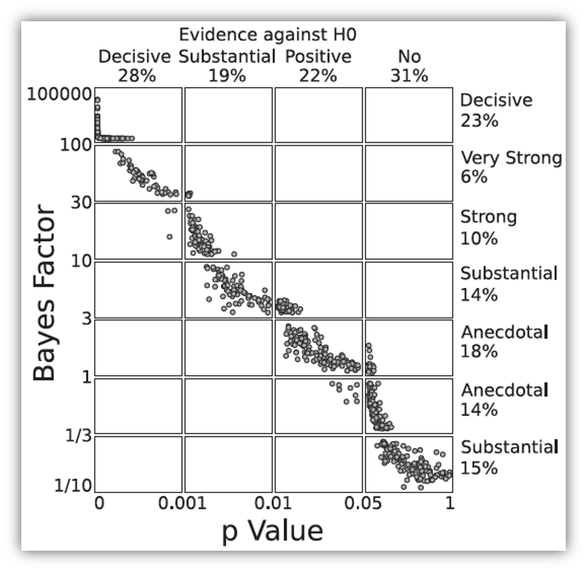

```{r}
#| results: hide

# general
library(easystats)
library(tidyverse)
# specific
library(rstanarm)
library(logspline)

source("../helpers/discovr_helpers.R")
source("../helpers/easystats_helpers.R")

album_tib <- discovr::album_sales

album_lm <- lm(sales ~ adverts, data = album_tib)
album_dp <- stan_glm(sales ~ adverts, data = album_tib)
album_rstn <- stan_glm(sales ~ adverts,
                      data = album_tib,
                      prior = normal(location = c(1), scale = c(0.5)),
                      prior_intercept = normal(location = 20, scale = 7))

album_bf <- model_parameters(album_rstn, test = c("bf"), null = 0)

# get plot aesthetics
line_width <- 1
tol_palette <- discovr::tol_muted_pal()(8)
tol_blue <- tol_palette[5]
tol_bile <- tol_palette[7]
tol_rose <- tol_palette[1]
```


##  Learning outcomes 

Bayes factors

- Articulate the principles of Bayesian approaches
- Define what a Bayes factor represents

::: fragment

Bayesian estimation 

- Uninformative priors
- Informatibe priors
- Interpretation

:::

::: notes
Use C to toggle pen/markup
Use backspace to delete markup
Use f to toggle fullscreen
:::


## 

::: r-stack
{.fragment fig-align="center" width="1050" height="594"}

{.fragment fig-align="center" width="1050" height="594"}
:::

## Problems with *p* – A recap

::: {.incremental}


- Tells us nothing about importance because *p* depends upon sample size.
- Provides little evidence about the null (or alternative) hypothesis
- Encourages all-or-nothing thinking
- Based on long-run probabilities
  -  *p* is the frequency of the observed test statistic relative to all test statistics from an infinite number of identical experiments with the exact same a priori sample size.
  - The type I error rate is in a given study is either 0 or 1, but we don't know which.

:::

## Effect sizes and *p*


:::: columns
::: {.column width="45%"}

- Wetzels et al. (2011). Statistical Evidence in Experimental Psychology: An Empirical Comparison Using 855 *t*-tests. *Perspectives on Psychological Science*, 6, 291–298. [https://doi.org/10.1177/1745691611406923](https://doi.org/10.1177/1745691611406923)

:::

::: {.column width="45%"}

:::
:::


::: notes

Based on 885 t-tests from the psychology literature, Wetzels et al looked at the relationship between p, ES and Bayes Factors
Ps and ES don't seem to correspond. For p > .05 (far right column) Ess range from very small to pretty large! Even p < .05, the Ess range from small to large.
:::


# Bayesian estimation


## 

{fig-align="center"}

## {background-video="media/miltons_walks_01.mp4" background-size="cover"}

## {background-video="media/miltons_walks_02.mp4" background-size="cover"}


##

{fig-align="center"}


## A musical example^[Chapter 8 from Field (2026). *Discovering Statistics using R and RStudio*. London: Sage.]

### Outcome

- `sales`: Revenue from physical, download and streamed album sales in first week (£ thousands)

::: fragment
### Predictors

- `adverts`: amount spent promoting the album before release (£ thousands)
- `airplay`: how many times songs from the album were played on a prominent national radio station in the week before release
- `image`: ratings of the 'look' of the band out of 10

:::
::: fragment
### The model

::: center-h
::: txt_mulberry
::: txt_l
$$
\begin{aligned}
\text{Sales}_i & = b_0 + b_1\text{Advertising}_i + \varepsilon_i \\
\varepsilon_i &\sim N(0, \sigma^2)
\end{aligned}
$$
:::
:::
:::
:::

## Priors

::: fragment

- You need a prior for each parameter in the model
  - $b_0$
  - $b_1$
  - $\sigma^2$

:::
::: fragment

- Uninformative priors
  - A.K.A 'flat priors'
  - Uniform distribution or very wide distribution
  - Estimates heavily data-driven

:::

## 

### OLS

```{r}
#| eval: false
album_lm <- lm(sales ~ adverts, data = album_tib)
model_parameters(album_lm) |> 
  display()
```

```{r}
#| echo: false
model_parameters(album_lm) |> 
  display()
```


\

::: fragment
### Bayesian


```{r}
#| eval: false
album_dp <- stan_glm(sales ~ adverts, data = album_tib)
model_parameters(album_dp) |> 
  display()
```

```{r}
#| echo: false

model_parameters(album_dp) |> 
  display()
```
:::

## Confidence vs. Credible intervals

::: {.callout-warning icon = false}
##  The danger zone!

What [**confidence**]{.txt_mulberry} intervals are NOT:

- There is NOT a 95% probability that a given interval contains the population value.
    - It is *p* = 0 or *p* = 1, but you can’t know which!
- They do NOT reflect confidence in the value of the population parameter.

:::

\

::: fragment
::: {.callout-note icon = false}
##  Statis-tip 

What [**credible**]{.txt_mulberry} intervals ARE:

- Intervals that contain the 'true' population value of the parameter in 95% of samples

:::
:::


## Informative priors

- Reflect prior knowledge
- The prior exerts more influence on estimates than an uninformative prior
- Can be strong
  - A narrow distribution
  - The prior has more influence than for a weak prior
- Can be weak
  - A wider distribution
  - The prior has less influence than for a strong prior
- 'Congugate' distributions
  - Normal, Gamma, Beta


## Prior for the intercept ($b_0$)

::: {.callout-caution icon = false}
##  Think about it!

- What do we already know about album sales when advertising = £0
- Historic data:
  - Expect 20,000 sales on average
  - It varies for different artists (*SD* = 7,000)

:::

\

::::: fragment
:::: columns
::: {.column width="30%"}
::: center-h
::: txt_mulberry
::: txt_l
$$
b_0 \sim  N(20, 7)
$$
:::
:::
:::
:::

::: {.column width="70%"}
```{r}
ggplot(tibble(x = c(-10, 50)), aes(x = x)) +
  geom_function(fun = dnorm, args = list(mean = 20, sd = 7), colour = blue, linewidth = line_width) +
  scale_x_continuous(breaks = seq(-10, 50, 5)) +
  geom_vline(xintercept = 0, colour = brown, linetype = 2, linewidth = line_width) +
  geom_vline(xintercept = 20, colour = tol_rose, linewidth = line_width) +
  ggtitle('Prior for intercept') +
  theme_minimal()
```
:::
::::
:::::


## Prior for the effect of advertising ($b_1$)

::: {.callout-caution icon = false}
##  Think about it!

- Historic data:
  - For every £1000 pounds they spend on advertising they can expect 1000 album sales. This equates to a $b$ = 1. 
  - Although spending money on advertising typically increases sales, they have been known to go down.

:::

\ 

::::: fragment
:::: columns
::: {.column width="30%"}
::: center-h
::: txt_mulberry
::: txt_l
$$
b_1 \sim  N(1, 0.5)
$$
:::
:::
:::
:::

::: {.column width="70%"}
```{r}
ggplot(tibble(x = c(-1, 5)), aes(x=x)) +
  geom_function(fun = dnorm, args = list(mean = 1, sd = 0.5), colour = blue, linewidth = line_width) +
  scale_x_continuous(breaks = seq(-1, 5, 1)) +
  geom_vline(xintercept = 0, colour = brown, linetype = 2, linewidth = line_width) +
  geom_vline(xintercept = 1, colour = tol_rose, linewidth = line_width) +
  ggtitle('Prior for advertising') +
  theme_minimal()
```
:::
::::
:::::

## 

### OLS

```{r}
#| eval: false
album_lm <- lm(sales ~ adverts, data = album_tib)
model_parameters(album_lm) |> 
  display()
```

```{r}
#| echo: false
model_parameters(album_lm) |> 
  display()
```

\

::: fragment
### Bayesian


```{r}
#| eval: false
album_rstn <- stan_glm(sales ~ adverts + airplay + image,
                      data = album_tib,
                      prior = normal(location = c(1), scale = c(0.5)),
                      prior_intercept = normal(location = 20, scale = 7))

model_parameters(album_rstn) |> 
  display()
```

```{r}
#| echo: false

model_parameters(album_rstn) |> 
  display()
```
:::


## {background-video="media/miltons_walks_03.mp4" background-size="cover"}

## {background-video="media/miltons_walks_04.mp4" background-size="cover"}

## {background-video="media/miltons_walks_05.mp4" background-size="cover"}


# Bayes Factors


## Bayes theorem

::: center-h
::: txt_mulberry
::: txt_l
$$
\begin{aligned}
p(\text{A}|\text{B}) &= \frac{p(\text{B}|\text{A})\times p(\text{A})}{p(\text{B})}
\end{aligned}
$$
:::
:::
:::

<br>

::: fragment

::: center-h
::: txt_mulberry
::: txt_l
$$
\begin{aligned}
p(\text{model}|\text{data}) &= \frac{p(\text{data}|\text{model})\times p(\text{model})}{p(\text{data})}
\end{aligned}
$$
:::
:::
:::

:::

<br>

::: fragment

::: center-h
::: txt_mulberry
::: txt_l
$$
\begin{aligned}
\text{posterior probability} &= \frac{\text{liklihood}\times \text{prior probability}}{\text{marginal liklihood}}
\end{aligned}
$$
:::
:::
:::
:::

##

:::: columns
::: {.column width="45%"}


:::

::: {.column width="45%"}

<br>
<br>

### Null hypothesis: You're human

:::
::::

::: notes

As you're probably aware, a significant proportion of people are scaly green lizard aliens disguised as humans. They live happily and peacefully among us causing no harm to anyone, and contributing lots to society by educating humans through things like statistics textbooks. I've said too much. The way the world is going right now, it's only a matter of time before people start becoming intolerant of the helpful alien lizards and try to eject them from their countries. Imagine you have been accused of being a green lizard alien. The government has a hypothesis that you are an alien. They sample your DNA and compare it to an alien DNA sample that they have. It turns out that your DNA matches the alien DNA.
:::

##

:::: columns
::: {.column width="45%"}

:::

::: {.column width="45%"}
<br>
<br>

### Null hypothesis: You're human

<br>
<br>

### Alt hypothesis: You're alien!
:::
::::

##

{fig-align="center"}

::: fragment
::: txt_mulberry
::: txt_l
$$
\begin{aligned}
p(\text{hypothesis}|\text{match}) &= \frac{p(\text{match}|\text{hypothesis})\times p(\text{hypothesis})}{p(\text{match})}
\end{aligned}
$$
:::
:::
:::

<br>

::: fragment
::: txt_mulberry
::: txt_l
$$
\begin{aligned}
\text{posterior probability} &= \frac{\text{liklihood}\times \text{prior probability}}{\text{marginal liklihood}}
\end{aligned}
$$
:::
:::
:::

::: notes

Table 1.2 illustrates your predicament. To keep things simple, imagine that you live on a small island of 2000 inhabitants. One of those people (but not you) is an alien, and his or her DNA will match that of an alien. It is not possible to be an alien and for your DNA not to match, so that cell of the table contains a zero. Now, the remaining 1999 people are not aliens and the majority (1900) have DNA that does not match that of the alien sample that the government has; however, a small number do (99), including you. 

The posterior probability is our belief in a hypothesis (or parameter, but more on that later) after we have considered the data (hence it is posterior to considering the data). In the alien example, it is our belief that a person is alien (H1) or human (H0) given that their DNA matches alien DNA, p(hypothesis|match). This is the value that we are interested in finding out: the probability of our hypothesis given the data. 

To calculate this, we need to know the likelihood, the prior probability, and the marginal liklihood. Let's look at the alternative hypothesis first – that you're an alien.
:::

##

{fig-align="center"}

::: fragment
::: txt_mulberry
::: txt_l
$$
\begin{aligned}
\text{prior probability} = p(\text{alien}) = \frac{1}{2000} = 0.0005
\end{aligned}
$$
:::
:::
:::

::: fragment
::: txt_mulberry
::: txt_l
$$
\begin{aligned}
\text{marginal liklihood} = p(\text{match}) = \frac{100}{2000} = 0.05
\end{aligned}
$$
:::
:::
:::

::: fragment
::: txt_mulberry
::: txt_l
$$
\begin{aligned}
\text{liklihood} = p(\text{match}|\text{alien}) = \frac{p(\text{alien} \cap \text{match})}{p(\text{alien})} = \frac{\frac{1}{2000}}{\frac{1}{2000}} = 1
\end{aligned}
$$
:::
:::
:::

::: notes

Let

The prior probability is our belief in a hypothesis (or parameter) before considering the data. In our alien example, it is the government's belief in your guilt before they consider whether your DNA matches or not. This would be the base rate for aliens, p(aliens), which in our example is 1 in 2000, or 0.0005.

The marginal likelihood, or evidence, is the probability of the observed data, which in this example is the probability of matching DNA, p(match). The data show that there were 100 matches in 2000 cases, so this value is 100/2000, or 0.05.

The likelihood is the probability that the observed data could be produced given the hypothesis or model being considered. In the alien example, it is, therefore, the probability that you would find that the DNA matched given that someone was in fact an alien, p(match|alien), which we saw before is 1.
:::

## Alternative hypothesis (you're alien)

\

::: center-h
::: txt_mulberry
::: txt_l
$$
\begin{aligned}
p(\text{alien}|\text{match}) &= \frac{p(\text{match}|\text{alien})\times p(\text{alien})}{p(\text{match})} \\
&= \frac{1\times 0.0005}{0.05} \\
&= 0.01
\end{aligned}
$$
:::
:::
:::

::: notes

There's a 1% chance that you're an alien.

Now let's look at the null.
:::

##

{fig-align="center"}

::: fragment
::: txt_mulberry
::: txt_l
$$
\begin{aligned}
\text{prior probability} = p(\text{human}) = \frac{1999}{2000} = 0.9995
\end{aligned}
$$
:::
:::
:::

::: fragment
::: txt_mulberry
::: txt_l
$$
\begin{aligned}
\text{marginal liklihood} = p(\text{match}) = \frac{100}{2000} = 0.05
\end{aligned}
$$
:::
:::
:::

::: fragment
::: txt_mulberry
::: txt_l
$$
\begin{aligned}
\text{liklihood} = p(\text{match}|\text{human}) = \frac{p(\text{human} \cap \text{match})}{p(\text{human})} = \frac{\frac{99}{2000}}{\frac{1999}{2000}} = 0.0495
\end{aligned}
$$
:::
:::
:::

::: notes

Let

The prior probability is our belief in a hypothesis (or parameter) before considering the data. For the null, this would be the base rate for humans, p(humans), which in our example is 1999 in 2000, or 0.9995.

The marginal likelihood, or evidence, is the probability of the observed data, which in this example is the probability of matching DNA, p(match). The data show that there were 100 matches in 2000 cases, so this value is 100/2000, or 0.05.

The likelihood is the probability that the observed data could be produced given the hypothesis or model being considered. In the alien example, it is, therefore, the probability that you would find that the DNA matched given that someone was in fact an human, p(match|human), which is 0.0495.
:::

## Null hypothesis (you're human)

<br>

::: center-h
::: txt_mulberry
::: txt_l
$$
\begin{aligned}
p(\text{human}|\text{match}) &= \frac{p(\text{match}|\text{human})\times p(\text{human})}{p(\text{match})} \\
&= \frac{0.0495\times 0.9995}{0.05} \\
&= 0.99
\end{aligned}
$$
:::
:::
:::

::: notes
There's a 99% chance that you're human.
:::

##

::: txt_mulberry
$$
\begin{aligned}
\text{posterior odds} = \frac{p(\text{hypothesis 1}|\text{data})}{p(\text{hypothesis 2}|\text{data})} = \frac{p(\text{alien}|\text{match})}{p(\text{human}|\text{match})} = \frac{0.01}{0.99} = 0.01
\end{aligned}
$$
:::

<br>

::: fragment
::: txt_mulberry
$$
\begin{aligned}
\frac{p(\text{alternative}|\text{data})}{p(\text{null}|\text{data})} = \frac{\frac{p(\text{data}|\text{alternative})\times p(\text{alternative})}{p({\text{data})}}}{\frac{p(\text{data}|\text{null})\times p(\text{null})}{p({\text{data})}}} = \frac{p(\text{alien}|\text{match})}{p(\text{human}|\text{match})} = \frac{0.01}{0.99} = 0.01
\end{aligned}
$$

:::
:::

<br>

::: fragment
::: txt_mulberry
::: txt_l
$$
\begin{aligned}
\frac{p(\text{alternative}|\text{data})}{p(\text{null}|\text{data})} = \frac{p(\text{data}|\text{alternative})}{p(\text{data}|\text{null})} \times \frac{p(\text{alternative})}{p(\text{null})}
\end{aligned}
$$
:::
:::
:::

::: fragment
{.absolute top=500 left=25 width="350"}
:::
::: fragment
{.absolute top=500 left=425 width="300"}
:::
::: fragment
{.absolute top=500 left=760 width="250"}
:::

::: notes
The probability of being an alien (given the data) is 0.01 times more likely than the probability that you are to be human (given the data). You can flip this on it's head by swapping the fraction (or taking the reciprocal), and say that you are 99 times more likely to be human given a DNA match than you are to be alien. This ratio of the probability of one hypothesis given the data, against another is called the posterior odds. 

We can write this out in full using Bayes theorm for the two hypotheses ….
:::

##

::: txt_mulberry
::: txt_l
$$
\begin{aligned}
\frac{p(\text{alien}|\text{match})}{p(\text{human}|\text{match})} = \frac{p(\text{match}|\text{alien})}{p(\text{match}|\text{human})} \times \frac{p(\text{alien})}{p(\text{human})}
\end{aligned}
$$
:::
:::


::: fragment
{.absolute top=150 left=75 width="350"}
:::
::: fragment
{.absolute top=150 left=425 width="300"}
:::
::: fragment
{.absolute top=150 left=750 width="250"}
:::

<br>
<br>
<br>
<br>
<br>

::: fragment
::: txt_mulberry
::: txt_l
$$
\begin{aligned}
\frac{0.01}{0.99} &= \frac{1}{0.0495} \times \frac{0.0005}{0.9995} \\
0.01 &= 20.20 \times 0.0005
\end{aligned}
$$
:::
:::
:::

::: fragment
::: {.callout-note icon = false}
##  Statis-tip

- Given a DNA match, we should shift our belief towards that person being an alien by a factor of about 20

:::
:::

::: notes
Our prior belief in you being an alien is 0.0005 (it's very unlikley). Given your DNA matches, we update our belief – we should shift our belief towards you being an alien by a factor of about 20.
:::

## Bayes factor (BF~10~)

- The probability of the data given the alternative hypothesis relative to the probability of the data given the null.

- The extent to which you should change your beliefs about the alternative hypothesis relative to the null

- You sometimes see Bayes factors expressed the opposite way around (BF<sub>01</sub>)

<br>

::: fragment

{fig-align="center" background="black"}

:::
## Bayes factors, *p* and effect sizes^[Wetzels et al. (2011). *Perspectives on Psychological Science*, 6, 291–298. [https://doi.org/10.1177/1745691611406923](https://doi.org/10.1177/1745691611406923)]

:::: columns 
::: {.column width="45%"}



:::

::: {.column width="45%"}
::: fragment

:::
:::
::::

::: notes
Based on 885 t-tests from the psychology literature, Wetzels et al looked at the relationship between p, ES and Bayes Factors
Ps and ES don't seem to correspond. For p > .05 (far right column) Ess range from very small to pretty large! Even p < .05, the ESs range from small to large.
:::


## Back to album sales

```{r}
#| eval: false

model_parameters(album_rstn, test = c("bf"), null = 0) |> 
  display()
```

```{r}
#| echo: false
display(album_bf)
```


\

- We should shift our beliefs in advertising having a non-zero relationship to sales by a factor of about `r value_from_ez(album_bf, row = 2, value = "log_BF", as_is = T) |>  exp() |> report_value(digits = 0)`.


## Summary

- We can go beyond *p* to evaluate the plausibility of a hypothesis
- Other methods address more useful questions, are less dependent on sample sizes, and avoid all-or-nothing thinking
- Bayesian estimation allows us to factor in prior knowledge
- Credible intervals tell us the plausible population values
- Bayes factors quantify the relative probability of the data given the null and alternative hypothesis

