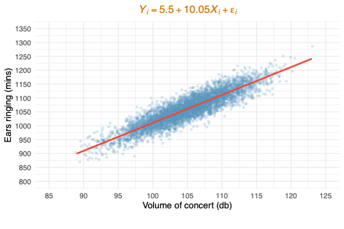
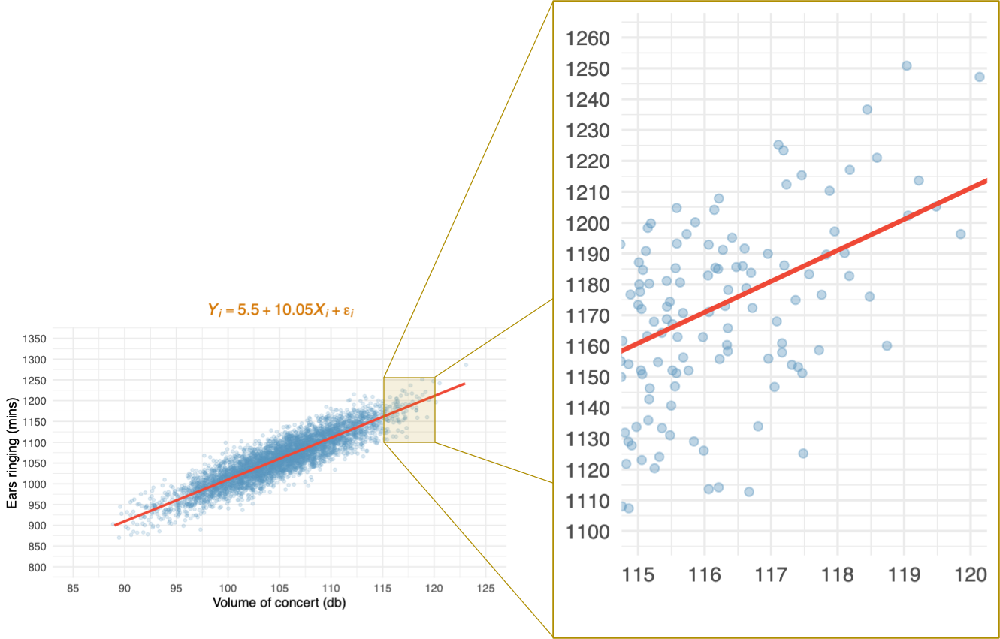
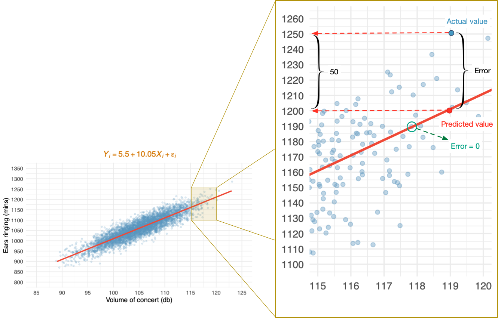
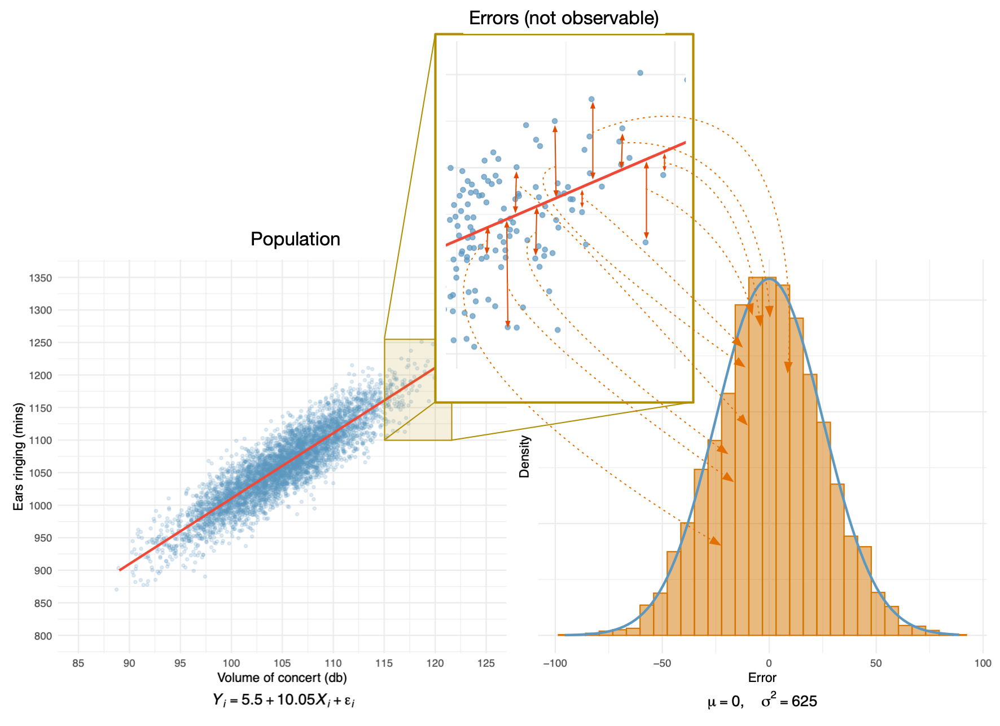
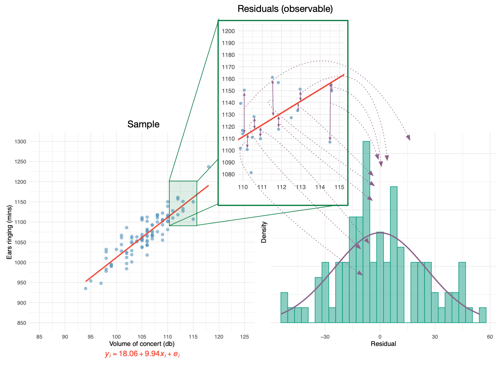

{}

::: notes
The assumptions relate to the population, which of course we cannot observe.
:::

## Errors vs residuals

{}

::: notes
The population model will not be perfect. There will be error in prediction. These errors are known as disturbances or errors. Assumptions relate to these. 
:::

## Errors (Population model)

{}

## Errors (not observable)

{}

::: notes
Assumptions relate to population errors. For example, we assume they have a normal distribution when we use OLS estimation. We cannot test this assumption directly because we cannot observe errors.
:::

##  Residuals (are observable)

{}

::: notes
Instead we look at the errors in prediction in the sample (known as residuals). If residuals are normally distributed then the population errors are likely to be as well.
:::

