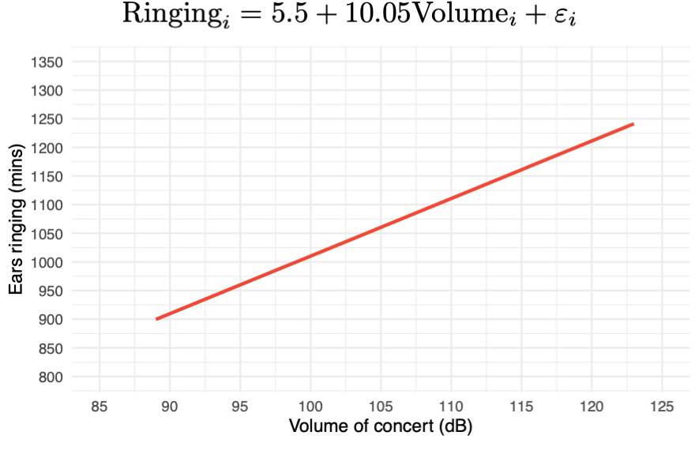
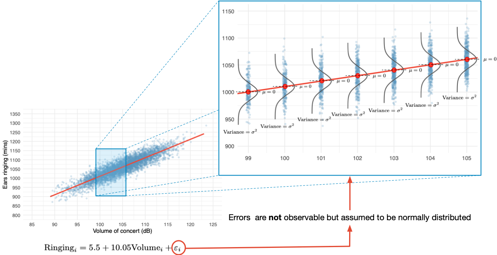
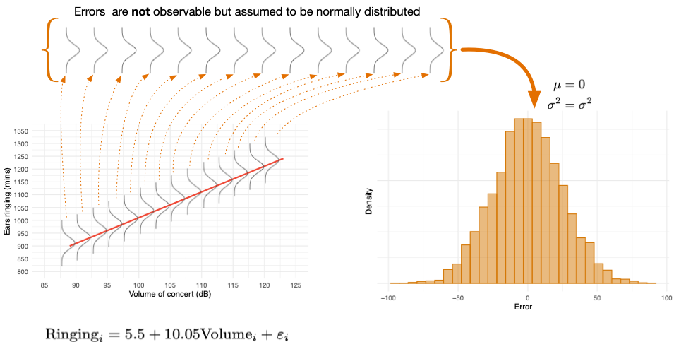
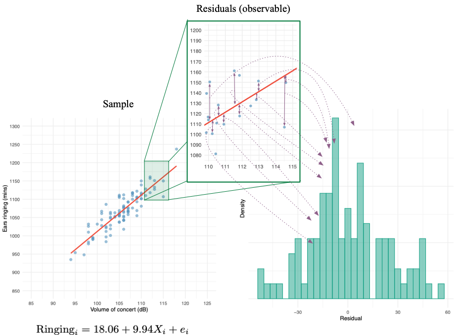

{}

::: notes
The assumptions relate to the population, which of course we cannot observe.
:::

## Normally distributed errors

{}

::: notes
The population model will not be perfect. There will be error in prediction. These errors are known as disturbances or errors. Assumptions relate to these. At each level of the predictor, errors are assumed to be normal with fixed variance.
:::

## Normally distributed errors

\

::: txt_xl

$$
\begin{aligned}
\text{Ringing}_i &= \hat{b}_0 + \hat{b}_1\text{Volume}_i + \varepsilon_i \\
\varepsilon_i &\sim N(0, \sigma^2)
\end{aligned}
$$
:::

## Errors (Population model)

{}

::: notes
Normal random variables (in this case errors) will sum to a normal distribution.
:::

##  Residuals (are observable)

{}

::: notes
Assumptions relate to population errors. For example, we assume they have a normal distribution when we use OLS estimation. We cannot test this assumption directly because we cannot observe errors. Instead we look at the errors in prediction in the sample (known as residuals). If residuals are normally distributed then the population errors are likely to be as well.
:::

