# Factorial designs

**Testing moderation using interactions**

Professor Andy Field, University of Sussex

Links: [acdc that the way](https://profandyfield.github.io/statistics_lectures/shared_media/audio/acdc_that_the_way.mp3) \| [bsky.app](https://bsky.app/profile/profandyfield.bsky.social) \| [youtube.com](https://www.youtube.com/user/ProfAndyField) \| [discoveringstatistics.com](https://www.discoveringstatistics.com) \| [discovr.rocks](https://www.discovr.rocks) \| [statisticsadventure.com](https://www.statisticsadventure.com)

## About this version

This is a plain-text version of the lecture slides. Each slide starts with a heading such as “Slide 5”, and the numbers match the slide numbers shown in the lecture. Content that appeared one piece at a time, in columns or in tabs is shown in reading order. Videos and interactive apps are given as links.

## Slide 2: Learning outcomes

- What is a factorial design?
- Moderation and interaction effects
- Factorial designs and the GLM
  - The process of E.V.I.L.
- Breaking down interactions
  - Plots
  - Simple effects analysis

## Slide 3


## Slide 4


## Slide 5: Terminology

- Variables in experimental designs
  - Predictor variables referred to as **independent variables (IV)** because their value is independent of (is not being predicted from) other variables.
  - Outcome variable referred to as the **dependent variables (DV)**, because their value ‘depends’ upon (is being predicted from) other variables.
- **Factorial design**: Two or more predictor variables/IV have been manipulated
- ***n*-way design**: The number of predictor variables/IVs manipulated
  - Two-way = 2 predictor variables/IVs manipulated
  - Three-way = 3 predictor variables/IVs manipulated
- The allocation of participants
  - **Independent design** = different entities in all conditions
  - **Repeated measures design** = the same entities in all conditions
  - **Mixed design** = different entities in all conditions of at least one predictor/IV, the same entities in all conditions of at least one other predictor variable/IV

## Slide 6 (new section): Moderation: Do video games lead to aggression?

## Slide 7

Video clip: [warcraft final](https://profandyfield.github.io/statistics_lectures/shared_media/video/warcraft_final.mp4)

## Slide 8: Moderation

- Is there a link between video games and aggression?
  - Outcome = aggressive behaviour (`aggress`)
  - Callus Unemotional Traits (`caunts`)
  - Video game Use (`vid_game`)

## Slide 9: Moderation: The theoretical model

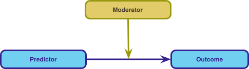

## Slide 10: Categorical moderator variable

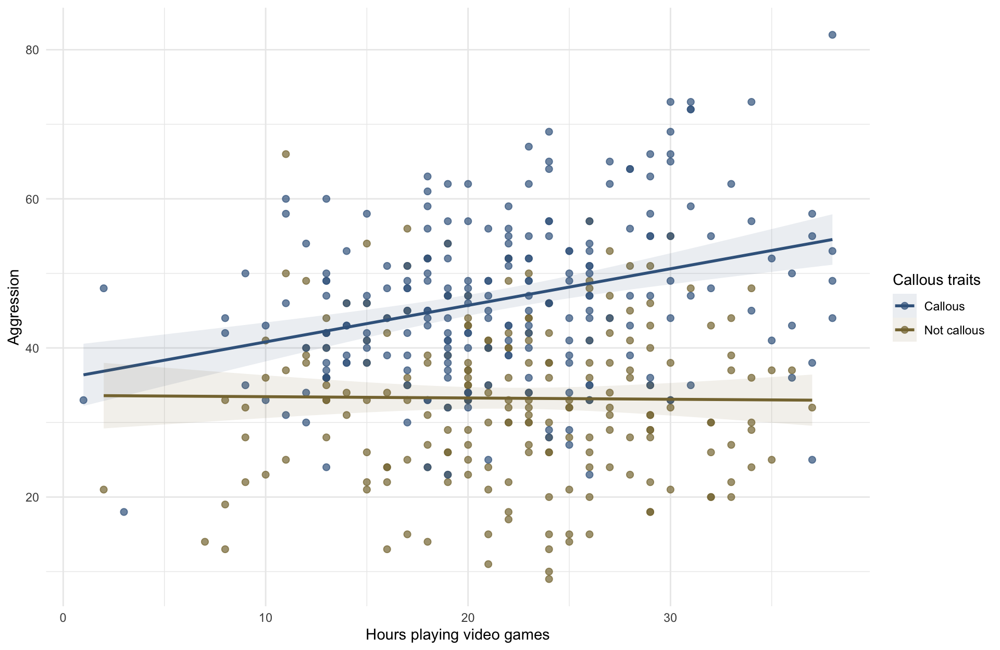

## Slide 11: Continuous moderator variable

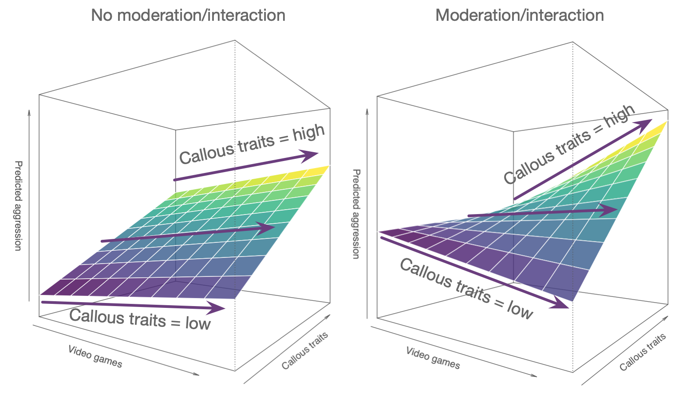

## Slide 12: Moderation: The statistical model

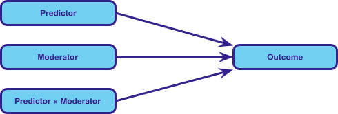

``` math
 \begin{aligned} \text{aggression}_i = \hat{b}_0 + \hat{b}_1\text{video games}_i + \hat{b}_2\text{caunts}_i + \hat{b}_3\text{video games}\times\text{caunts}_i + e_i \end{aligned} 
```

## Slide 13: Interactions in the linear model

- An interaction term is the product of the two variables:

``` math
 \text{interaction} = \text{video_games} × \text{caunts} 
```

### Interpretation

- If the interaction term is significant, we have a significant moderation effect
- The parameter estimate (*b*) for the interaction quantifies the size of the interaction effect
- The effect of one predictor is stronger at some levels of another predictor
- In factorial designs, the effect of one predictor is stronger in certain categories of the other predictor
- Simple effects analysis

## Slide 14

Video clip: [wii injuries](https://profandyfield.github.io/statistics_lectures/shared_media/video/wii_injuries.mp4)

## Slide 15: A dangerous example

- Injury severity (0-20) measured during video games
- 40 Participants
  - 10 = Xbox One kinect (Static game)
  - 10 = Xbox One kinect (Active game)
  - 10 = Nintendo Switch (Static game)
  - 10 = Nintendo Switch (Active game)
- Variables:
  - Predictor = Type of `console` (Xbox or Switch)
  - Predictor = Type of `game` (static or active)
  - Outcome = `injury` severity (0 = no injury, 20 = severe injury)

> **Note: Statis-tip**
>
> This is a **two-way independent factorial design**.

## Slide 16: The model

``` math
 \begin{aligned} \text{injuries}_i = \hat{b}_0 + \hat{b}_1\text{game}_i + \hat{b}_2\text{console}_i + \hat{b}_3\text{game}\times\text{console}_i + e_i \end{aligned} 
```

## Slide 17: Partitioning variance

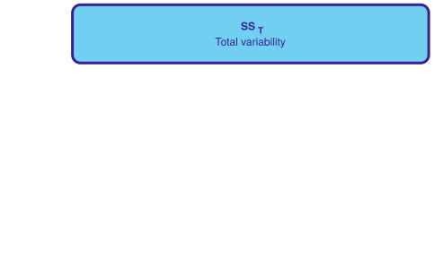

## Slide 18: Partitioning variance

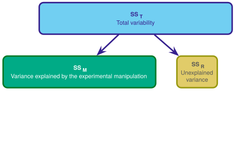

## Slide 19: Partitioning variance

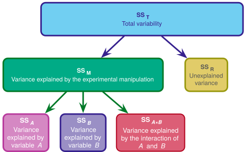

## Slide 20: Load and Look

``` r
xbox_tib |> 
  group_by(game, console) |> 
  describe_distribution(select = injury, ci = 0.95) |> 
  data_remove(c(Variable, Skewness, Kurtosis, n_Missing)) |> 
  display()
```

| game   | console  | Mean  | 95% CI (Mean)  | SD   | IQR  | Range          | n   |
|--------|----------|-------|----------------|------|------|----------------|-----|
| Static | Xbox One | 7.00  | (5.65, 8.90)   | 2.67 | 4.50 | (3.00, 11.00)  | 10  |
| Active | Xbox One | 9.40  | (7.15, 11.10)  | 3.37 | 5.75 | (4.00, 14.00)  | 10  |
| Static | Switch   | 6.70  | (5.50, 7.96)   | 1.95 | 2.25 | (3.00, 10.00)  | 10  |
| Active | Switch   | 12.90 | (11.50, 14.75) | 2.51 | 4.00 | (10.00, 18.00) | 10  |


## Slide 21: Visualize

``` r
ggplot(xbox_tib, aes(x = console, y = injury, colour = game, shape = game)) +
  stat_summary(fun.data = "mean_cl_normal", geom = "pointrange", position = position_dodge(width = 0.2)) +
  coord_cartesian(ylim = c(0,15)) +
  scale_y_continuous(breaks = 0:15) +
  scale_colour_viridis_d(begin = 0.3, end = 0.85) +
  labs(x = "Type of console", y = "Injury severity (0-20)", colour = "Type of game", shape = "Type of game") +
  theme_minimal()
```

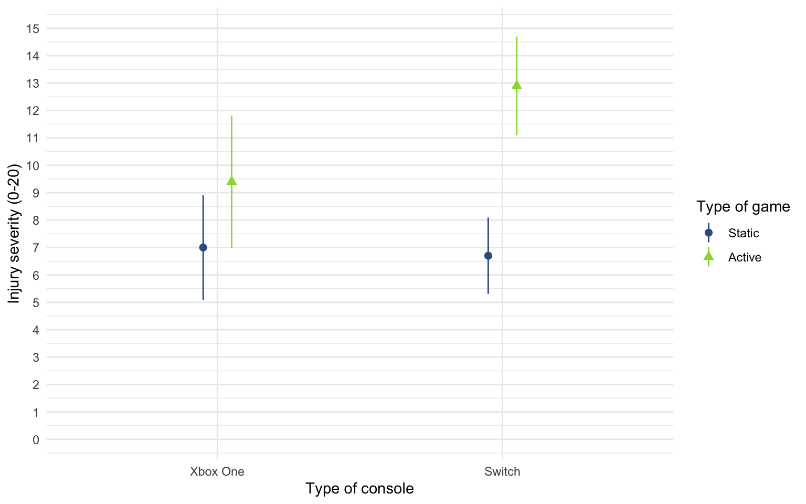


## Slide 22: Fit the model

- Remember that for *F*-statistics we typically want Type III sums of squares
- We can fit the model in the usual way using `lm()`

### Set contrasts

``` r
active_vs_static <- c(-1/2, 1/2)
switch_vs_xbox <- c(-1/2, 1/2)
contrasts(xbox_tib$game) <- active_vs_static
contrasts(xbox_tib$console) <- switch_vs_xbox
```

### Fit the models

``` r
incpt_lm <- lm(injury ~ 1, data = xbox_tib)
game_lm <- lm(injury ~ game, data = xbox_tib)
console_lm <- lm(injury ~ game + console, data = xbox_tib) 
xbox_lm <- lm(injury ~ game*console, data = xbox_tib)
```

## Slide 23: Evaluate model fit

``` r
test_wald(incpt_lm, game_lm, console_lm, xbox_lm) |> 
  display()
```

| Name       | Model | df  | df_diff | F     | p       |
|------------|-------|-----|---------|-------|---------|
| incpt_lm   | lm    | 39  |         |       |         |
| game_lm    | lm    | 38  | 1       | 25.86 | \< .001 |
| console_lm | lm    | 37  | 1       | 3.58  | 0.067   |
| xbox_lm    | lm    | 36  | 1       | 5.05  | 0.031   |

> **Important: ReportR**
>
> The type of game significantly moderated the effect of the games console on injury severity, *F*(1, 36) = 5.05, *p* = 0.031.


## Slide 24: Evaluate assumptions

\[Missing image: media/milton_20180720_100533_crop.jpg\]

``` r
check_model(xbox_lm)
```

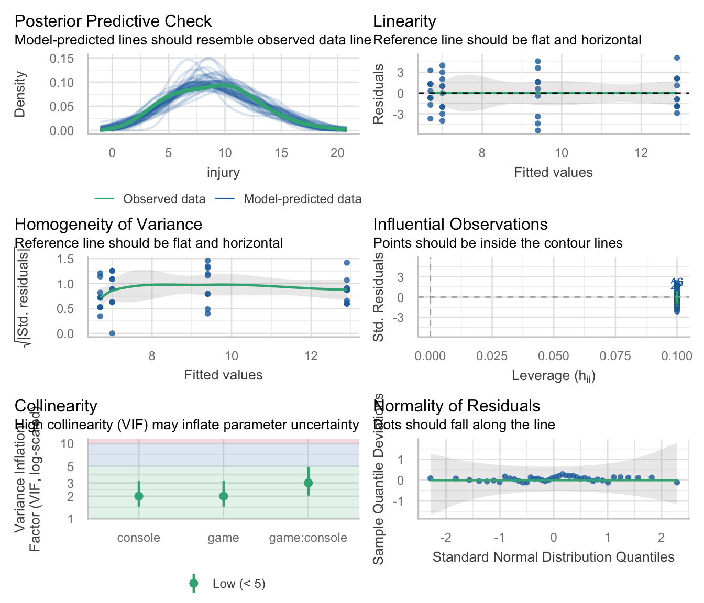


## Slide 25: Interpret parameter estimates, CIs and tests


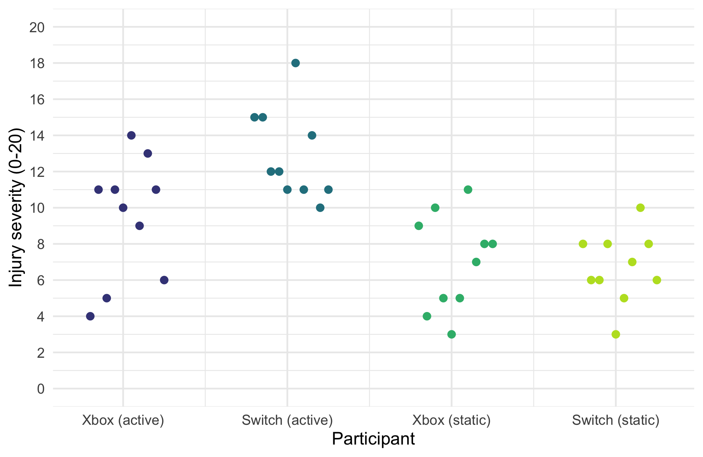


## Slide 26: Interpret

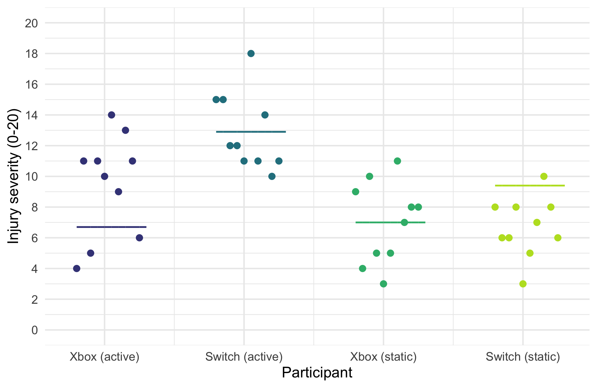


## Slide 27: Interpret the main effect of console


## Slide 28: Interpret the main effect of console

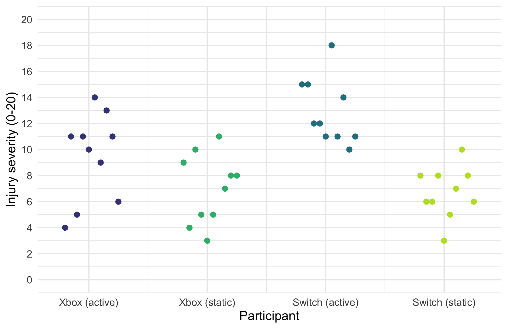


## Slide 29: Interpret the main effect of console

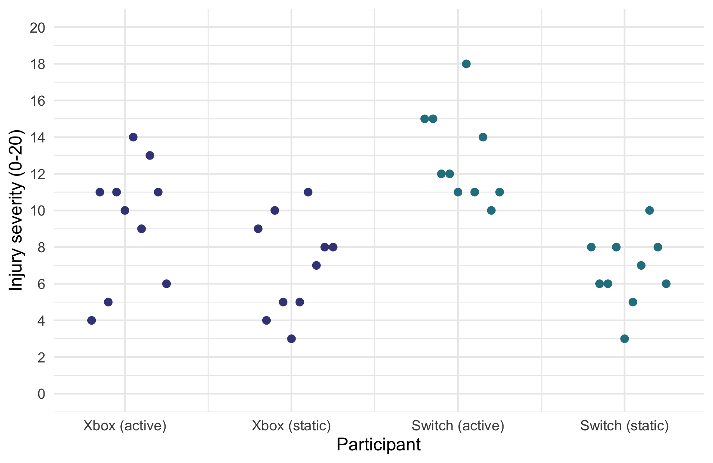


## Slide 30: Interpret the main effect of console

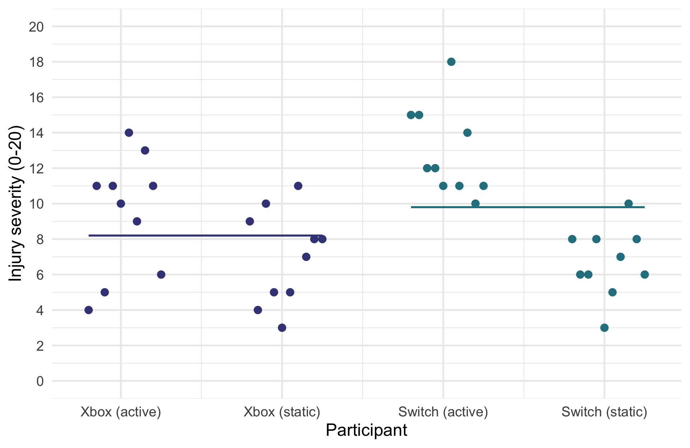


## Slide 31: Interpret the main effect of game


## Slide 32: Interpret the main effect of game

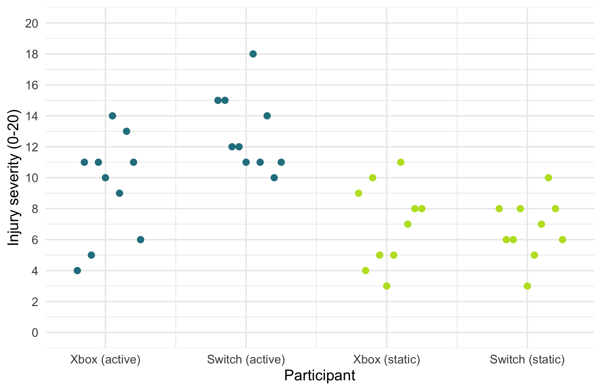


## Slide 33: Interpret the main effect of game

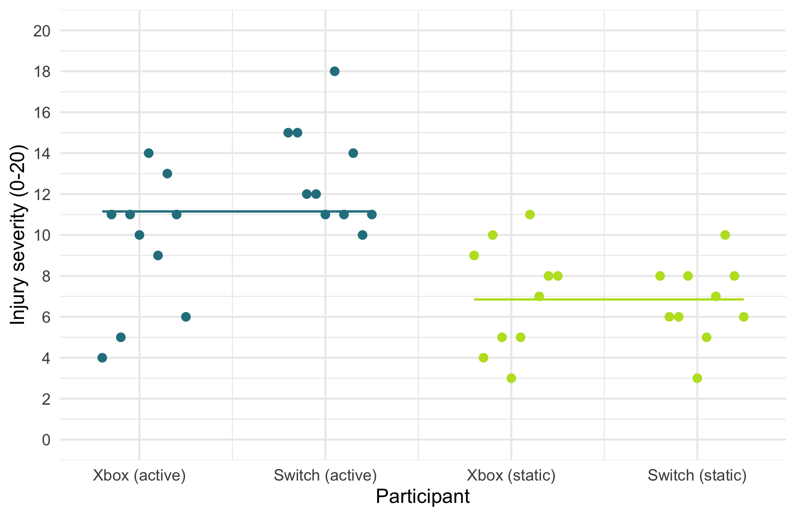


## Slide 34: Interpret the interaction (moderation effect)

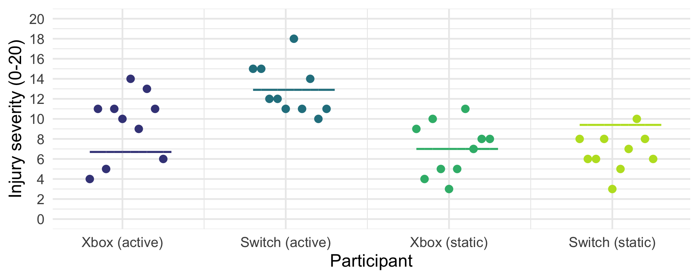

| Parameter                        | Coefficient | SE   | 95% CI        | t(36) | p       |
|----------------------------------|-------------|------|---------------|-------|---------|
| (Intercept)                      | 7.00        | 0.85 | (5.29, 8.71)  | 8.28  | \< .001 |
| game (Active)                    | 2.40        | 1.20 | (-0.03, 4.83) | 2.01  | 0.052   |
| console (Switch)                 | -0.30       | 1.20 | (-2.73, 2.13) | -0.25 | 0.803   |
| game (Active) × console (Switch) | 3.80        | 1.69 | (0.37, 7.23)  | 2.25  | 0.031   |


## Slide 35: Interpreting interactions

### Console moderating the effect of game

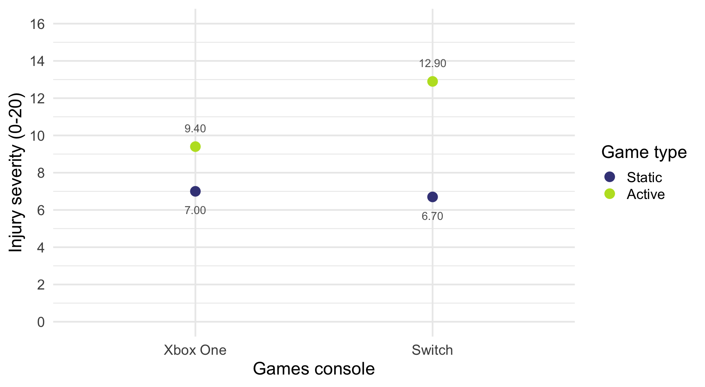


## Slide 36: Interpreting interactions

### Console moderating the effect of game

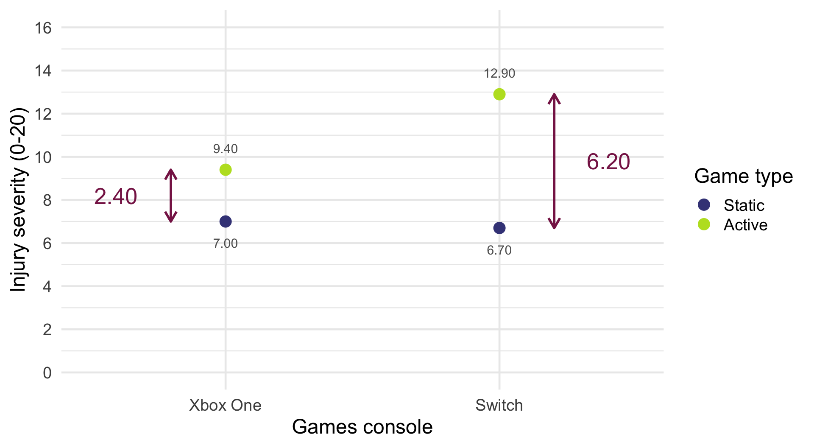

``` math
 \begin{aligned} \text{game}_\text{Switch} &= \bar{X}_\text{active, Switch}-\bar{X}_\text{static, Switch} \\ &= 12.90 - 6.70 \\ &= 6.20 \end{aligned} 
```

``` math
 \begin{aligned} \text{game}_\text{Xbox} &= \bar{X}_\text{active, Xbox}-\bar{X}_\text{static, Xbox} \\ &= 9.40 - 7.00 \\ &= 2.40 \end{aligned} 
```

``` math
 \begin{aligned} \text{Interaction} &= \text{game}_\text{Switch} - \text{game}_\text{Xbox} \\ &= 6.2 - 2.40 \\ &= 3.8 \end{aligned} 
```


## Slide 37: Interpret simple effects

### The effect of type of game within consoles

``` r
estimate_contrasts(model = xbox_lm,
                   contrast = "game",
                   by = "console",
                   comparison = "joint",
                   p_adjust = "bonferroni") |> 
  display()
```

| Contrast | console  | df1 | df2 | F     | p       |
|----------|----------|-----|-----|-------|---------|
| game     | Xbox One | 1   | 36  | 4.03  | 0.105   |
| game     | Switch   | 1   | 36  | 26.88 | \< .001 |

Marginal Joint Test

*p-value adjustment method: Bonferroni*

> **Important: ReportR**
>
> The effect of playing active vs. static games is less significant for the Xbox than the switch. The difference in mean injuries between active and static games was not significantly different for the Xbox, *F*(1, 36) = 4.03, *p* = 0.105, but was for the Switch, *F*(1, 36) = 26.88, *p* \< 0.001.

## Slide 38: Interpreting interactions

### Game moderating the effect of console

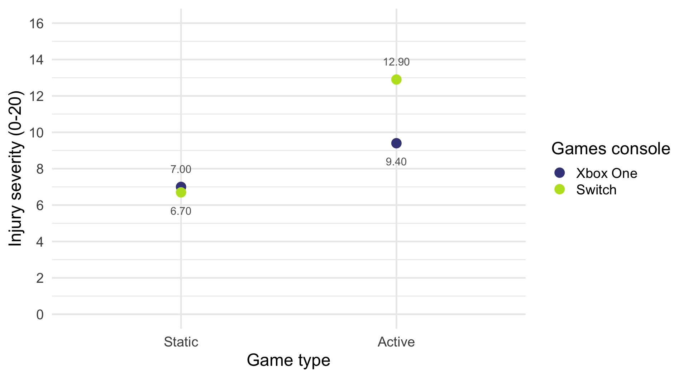

## Slide 39: Interpreting interactions

### Game moderating the effect of console

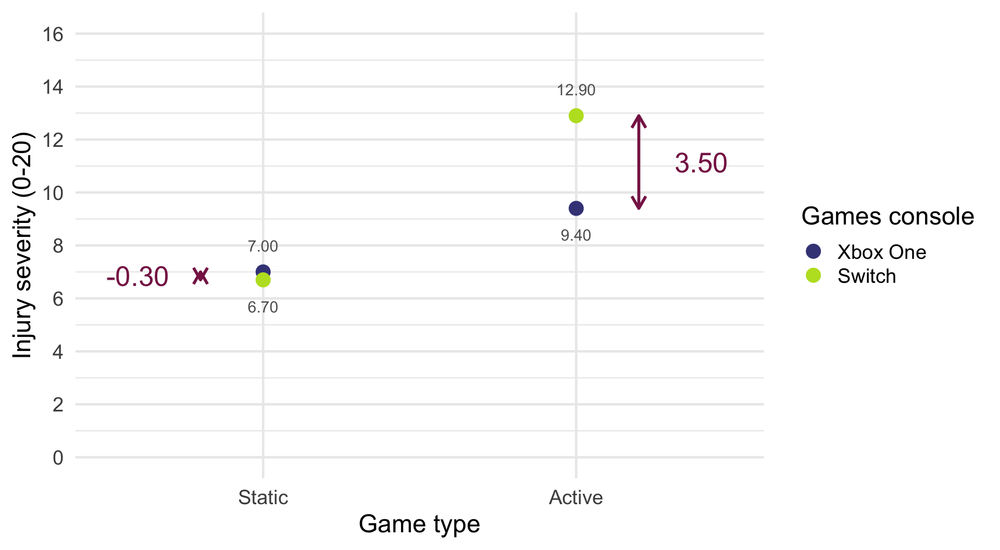

``` math
 \begin{aligned} \text{console}_\text{active} &= \bar{X}_\text{active, Switch}-\bar{X}_\text{active, Xbox} \\ &= 12.90 - 9.4 \\ &= 3.5 \end{aligned} 
```

``` math
 \begin{aligned} \text{console}_\text{static} &= \bar{X}_\text{static, Switch}-\bar{X}_\text{static, Xbox} \\ &= 6.7 - 7.00 \\ &= -0.3 \end{aligned} 
```

``` math
 \begin{aligned} \text{Interaction} &= \text{console}_\text{active} - \text{console}_\text{static} \\ &= 3.5 - (-0.3) \\ &= 3.8 \end{aligned} 
```


## Slide 40: Interpret: simple effects analysis

### The effect of console within the type of game

``` r
estimate_contrasts(model = xbox_lm,
                   contrast = "console",
                   by = "game",
                   comparison = "joint",
                   p_adjust = "bonferroni") |> 
  display()
```

| Contrast | game   | df1 | df2 | F    | p       |
|----------|--------|-----|-----|------|---------|
| console  | Static | 1   | 36  | 0.06 | \> .999 |
| console  | Active | 1   | 36  | 8.57 | 0.012   |

Marginal Joint Test

*p-value adjustment method: Bonferroni*

> **Important: ReportR**
>
> The effect of playing Xbox vs. Switch games is less significant for static games than active ones. The difference in mean injuries between Xbox and Switch games was not significantly different for static games, *F*(1, 36) = 0.06, *p* = 1.000, but was for the active games, *F*(1, 36) = 8.57, *p* = 0.012.

## Slide 41

> **Warning: The danger zone!**
>
> Repeat the following mantra:
>
> **“It is never sensible to interpret main effects in the presence of a significant interaction effect.”**

## Slide 42

Video clip: [lazinc durt the time is here](https://profandyfield.github.io/statistics_lectures/shared_media/video/lazinc_durt_the_time_is_here.mp4)

## Slide 43 (new section): The beer goggles effect

## Slide 44: A science reflecting art example

- The beer goggles effect: subjective perceptions of physical attractiveness become inaccurate after drinking alcohol
- Chen et al., (2014)<sup>1</sup>
  - Alcohol consumption reduces accuracy in symmetry judgements
  - Symmetric faces have been shown to be rated as more attractive.
  - If the beer-goggles effect is driven by alcohol impairing symmetry judgements then you’d expect a stronger effect for unattractive (asymmetric) faces than attractive (symmetric) ones
- Fictional data but matches Chen et al. findings

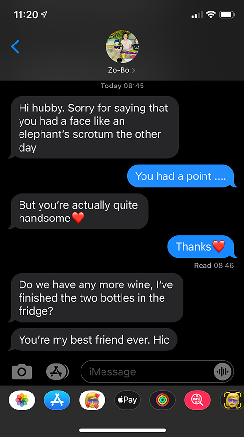

*Footnotes*

1.  Chen, et al., (2014). The moderating effect of stimulus attractiveness on the effect of alcohol consumption on attractiveness ratings. Alcohol and Alcoholism, 49, 515–519. <https://doi.org/10.1093/alcalc/agu026>

## Slide 45: Study design

- 48 Participants (8 per group)
- Predictor: `alcohol`
  - **Placebo** group: 500 ml of alcohol-free beer
  - **Low-dose** group: 500 ml of beer (4% ABV);
  - **High-dose** group: 500 ml of beer (7% ABV).
- Predictor: `facetype`
- Rated 50 **unattractive** (asymmetric) faces
- Rated 50 **attractive** (symmetric) faces
- Outcome:
  - Median rating of the 50 photos on a scale from 0 (pass me a paper bag) to 10 (pass me their phone number)

> **Note: Statis-tip**
>
> This is a **two-way independent factorial design**.


## Slide 46: Hypotheses

- H<sub>1</sub>: Ratings will be higher for attractive compared to unattractive faces
- H<sub>2</sub>: Ratings will be higher after alcohol compared to no alcohol
- H<sub>3</sub>: Ratings will be higher after a high dose of alcohol compared to a low dose
- H<sub>4</sub>: The effect of alcohol on ratings will depend on the type of face being rated (i.e. moderation)

### Contrasts

| Alcohol group | Contrast 1 (Alcohol vs. placebo) | Contrast 2 (High vs. Low dose) |
|----|----|----|
| Placebo | -2/3 | 0 |
| Low dose | 1/3 | -1/2 |
| High dose | 1/3 | 1/2 |

| Facetype     | Contrast |
|--------------|----------|
| Unattractive | -0.5     |
| Attractive   | 0.5      |

## Slide 47: The model

``` math
 \begin{aligned} Y_i & = \hat{b}_0 + \hat{b}_1X_i+ e_i\\ \text{attractiveness}_i & = \hat{b}_0 + \hat{b}_1\text{facetype}_i + \hat{b}_2(\text{alcohol vs. none})_i +\hat{b}_3(\text{high vs. low})_i + \\ &\quad \hat{b}_4[\text{facetype} \times (\text{alcohol vs. none})]_i + \\ &\quad \hat{b}_5[\text{facetype} \times (\text{high vs. low})]_i + e_i \end{aligned} 
```

## Slide 48: Load and Look

``` r
goggles_tib |> 
  group_by(facetype, alcohol) |> 
  describe_distribution(select = attractiveness, ci = 0.95) |> 
  data_remove(c(Variable, Skewness, Kurtosis, n_Missing)) |> 
  display()
```

| facetype     | alcohol   | Mean | 95% CI (Mean) | SD   | IQR  | Range        | n   |
|--------------|-----------|------|---------------|------|------|--------------|-----|
| Unattractive | Placebo   | 3.50 | (2.43, 4.38)  | 1.60 | 2.50 | (1.00, 6.00) | 8   |
| Attractive   | Placebo   | 6.38 | (5.75, 7.00)  | 0.92 | 1.00 | (5.00, 8.00) | 8   |
| Unattractive | Low dose  | 4.88 | (4.25, 5.50)  | 1.25 | 1.75 | (3.00, 7.00) | 8   |
| Attractive   | Low dose  | 6.50 | (5.88, 7.12)  | 0.93 | 1.00 | (5.00, 8.00) | 8   |
| Unattractive | High dose | 6.62 | (6.12, 7.25)  | 1.06 | 1.75 | (5.00, 8.00) | 8   |
| Attractive   | High dose | 6.12 | (5.50, 6.82)  | 1.13 | 2.00 | (5.00, 8.00) | 8   |


## Slide 49: Visualize

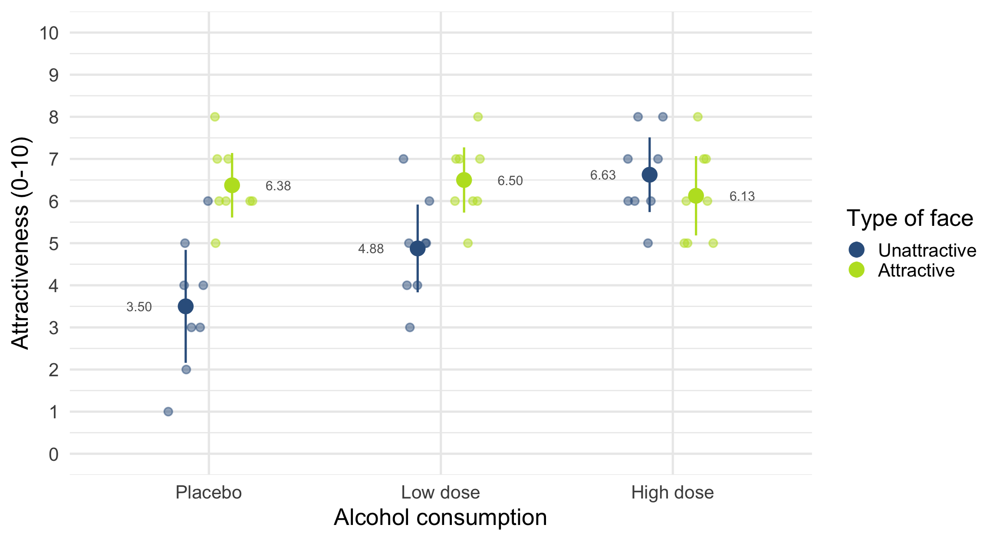


## Slide 50: Fit the model

### Set contrasts

``` r
# contrasts for alcohol
alcohol_vs_none <- c(-2/3, 1/3, 1/3)
high_vs_low <- c(0, -1/2, 1/2)
contrasts(goggles_tib$alcohol) <- cbind(alcohol_vs_none, high_vs_low)

# contrasts for facetype
att_vs_unatt <- c(-1/2, 1/2)
contrasts(goggles_tib$facetype) <- att_vs_unatt
```

### Fit models

``` r
incpt_lm <- lm(attractiveness ~ 1, data = goggles_tib)
face_lm <- lm(attractiveness ~ facetype, data = goggles_tib)
alcohol_lm <- lm(attractiveness ~ facetype + alcohol, data = goggles_tib) 
goggles_lm <- lm(attractiveness ~ facetype*alcohol, data = goggles_tib)
```

## Slide 51: Evaluate fit

``` r
test_wald(incpt_lm, face_lm, alcohol_lm, goggles_lm) |>
  display()
```

| Name       | Model | df  | df_diff | F     | p       |
|------------|-------|-----|---------|-------|---------|
| incpt_lm   | lm    | 47  |         |       |         |
| face_lm    | lm    | 46  | 1       | 15.58 | \< .001 |
| alcohol_lm | lm    | 44  | 2       | 6.04  | 0.005   |
| goggles_lm | lm    | 42  | 2       | 8.51  | \< .001 |

> **Important: ReportR**
>
> The dose of alcohol significantly moderated the effect of the type of face on attractiveness ratings, *F*(2, 42) = 8.51, *p* \< 0.001.

## Slide 52: Evaluate assumptions

\[Missing image: media/milton_20180720_100533_crop.jpg\]

``` r
check_model(goggles_lm)
```

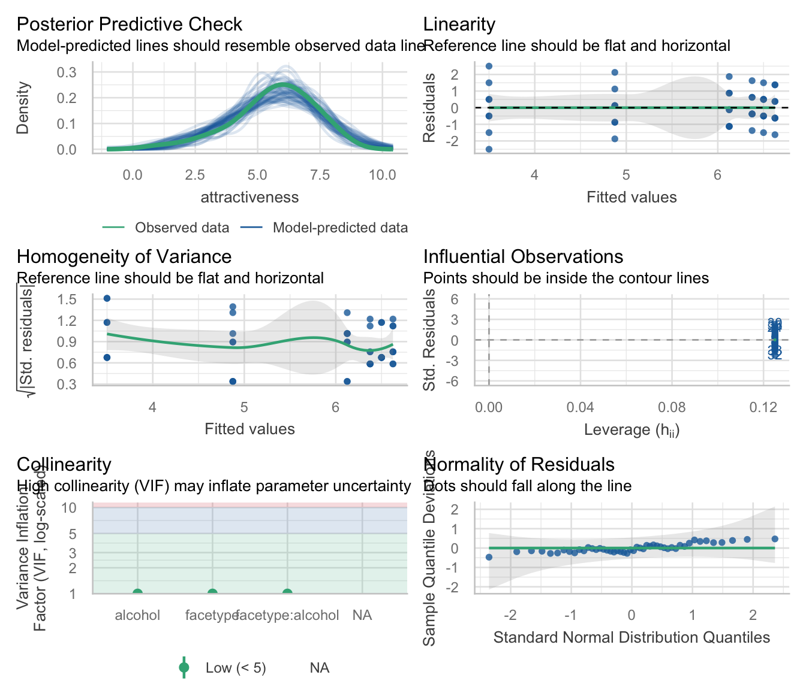


## Slide 53: Interpret simple effects

### Simple effects: facetype within alcohol group

| Contrast | alcohol   | df1 | df2 | F     | p       |
|----------|-----------|-----|-----|-------|---------|
| facetype | Placebo   | 1   | 42  | 24.15 | \< .001 |
| facetype | Low dose  | 1   | 42  | 7.72  | 0.024   |
| facetype | High dose | 1   | 42  | 0.73  | \> .999 |

Marginal Joint Test

*p-value adjustment method: Bonferroni*

## Slide 54: Interpret simple effects

### Simple effects: facetype within alcohol group


## Slide 55: Interpret simple effects

### Simple effects: facetype within alcohol group

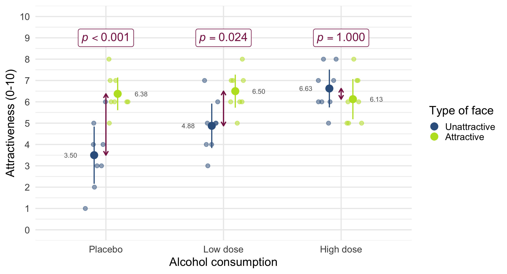


## Slide 56: Interpret simple effects

### Simple effects: alcohol within facetype

| Contrast | facetype     | df1 | df2 | F     | p       |
|----------|--------------|-----|-----|-------|---------|
| alcohol  | Unattractive | 2   | 42  | 14.33 | \< .001 |
| alcohol  | Attractive   | 2   | 42  | 0.21  | \> .999 |

Marginal Joint Test

*p-value adjustment method: Bonferroni*


## Slide 57: Interpret simple effects

### Simple effects: alcohol within facetype


## Slide 58: Interpret simple effects

### Simple effects: alcohol within facetype

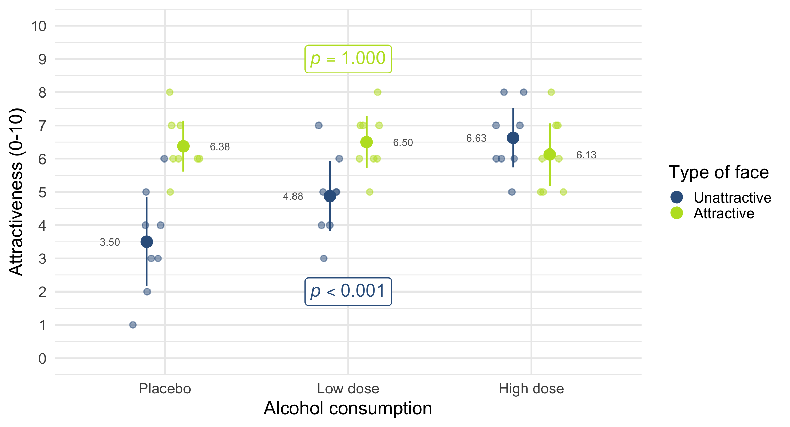


## Slide 59: Summary

- Factorial designs: two or more predictor variables are manipulated
- Moderation: Where the effect of one predictor differs at levels of another-
- Testing moderation (interaction effects)
  - The model: a linear model in which predictors are entered as well as their interaction
  - Interpret interactions using plots or simple effects analysis, which quantifies the effect of one predictor at each level of another
  - The process of E.V.I.L.
- Main effects
  - The effect of one predictor variable collapsed across levels of other predictors
  - Uninteresting in the presence of a significant interaction
