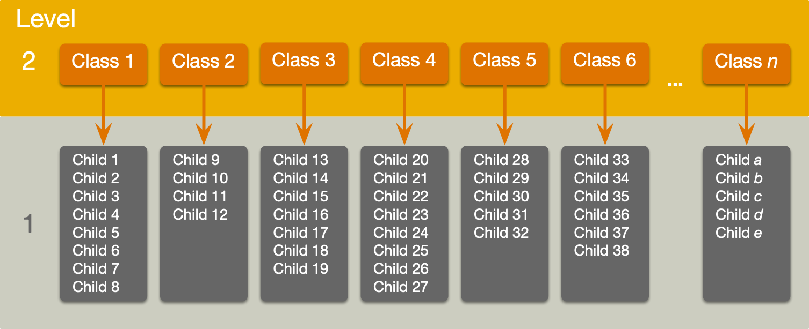
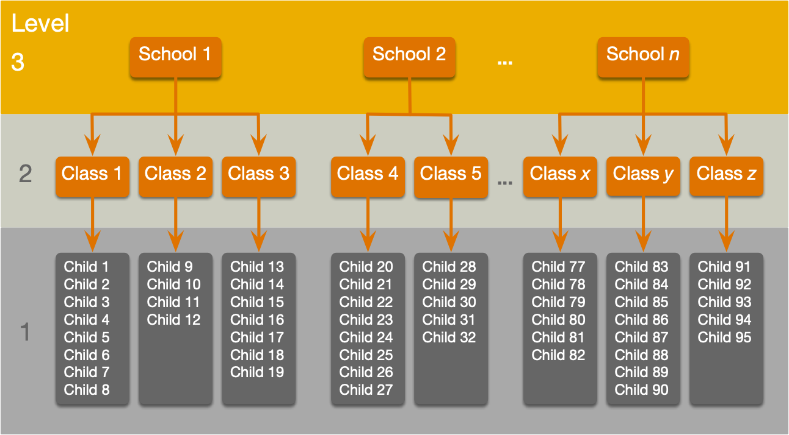
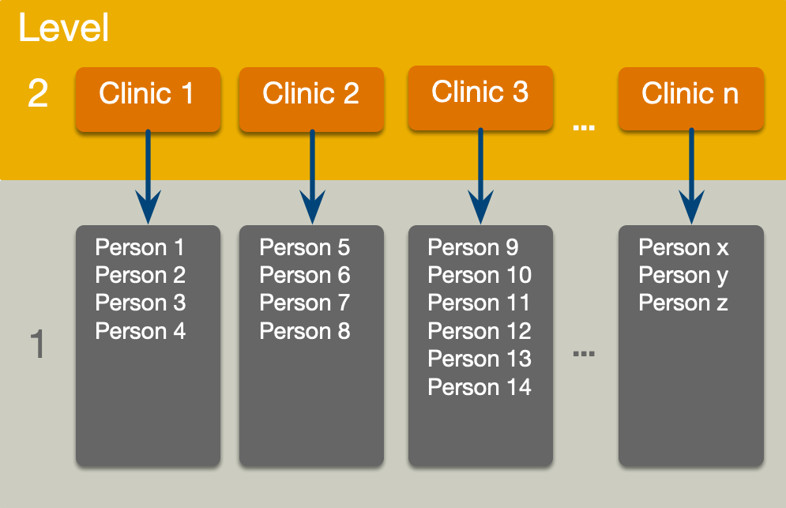
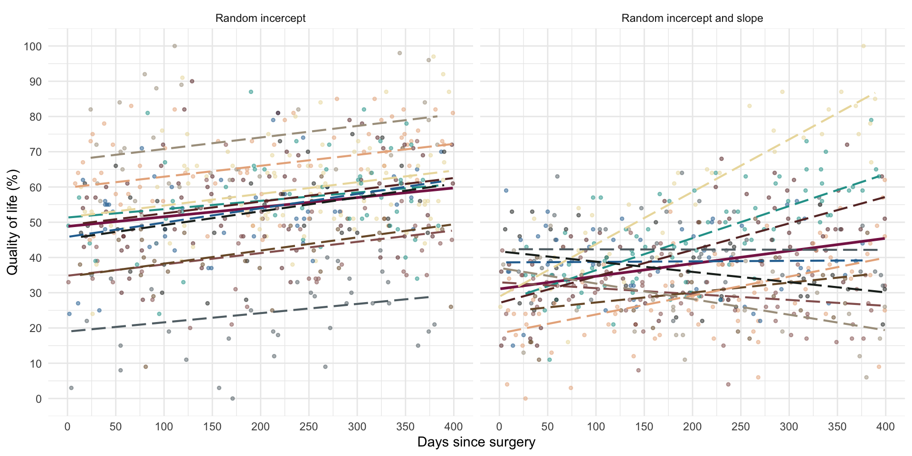
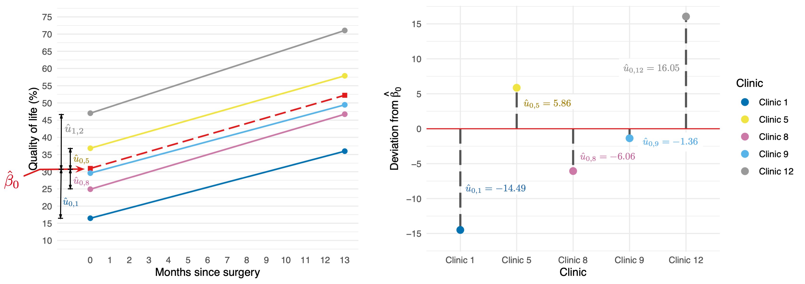
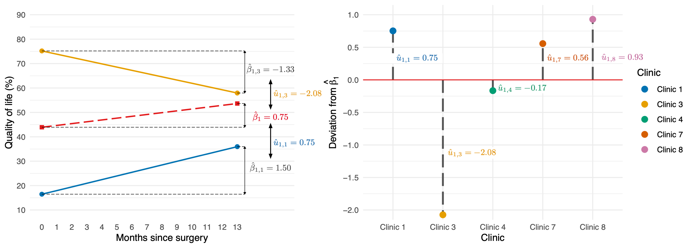
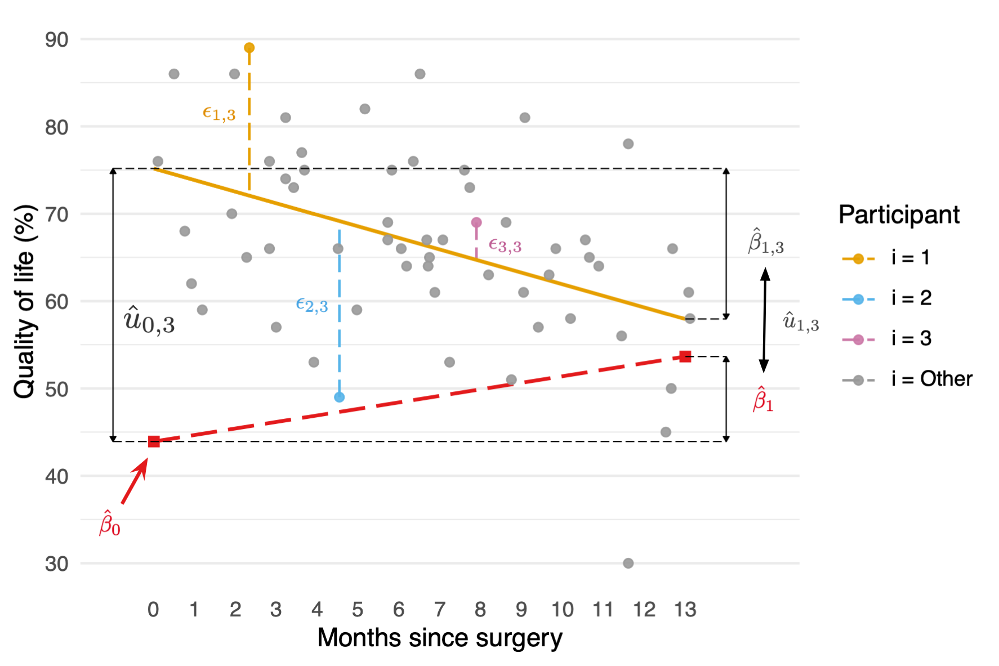

# Multilevel models

**Theory and concepts**

Professor Andy Field, University of Sussex

Links: [wittr prayer of transformation](https://profandyfield.github.io/statistics_lectures/ais_10_mlm/media/wittr_prayer_of_transformation.mp3) \| [bsky.app](https://bsky.app/profile/profandyfield.bsky.social) \| [youtube.com](https://www.youtube.com/user/ProfAndyField) \| [discoveringstatistics.com](https://www.discoveringstatistics.com) \| [discovr.rocks](https://www.discovr.rocks) \| [statisticsadventure.com](https://www.statisticsadventure.com)

## About this version

This is a plain-text version of the lecture slides. Each slide starts with a heading such as “Slide 5”, and the numbers match the slide numbers shown in the lecture. Content that appeared one piece at a time, in columns or in tabs is shown in reading order. Videos and interactive apps are given as links.

## Slide 2: Learning outcomes

- Understand what hierarchical data are
  - Why we can’t use the OLS GLM
- Understand fixed and random coefficients
- Understand how to build models

### Part 2

- Be able to conduct and interpret models of hierarchical data

## Slide 3


## Slide 4: Hierarchical data

- Data structures are often hierarchical
  - Children nested within classrooms
  - Observations nested within people
  - Employees nested within organisations
  - Patients nested within hospitals
  - Patients nested within teams nested within hospitals
  - Service users nested within clinicians nested within hospitals nested within NHS trusts!
  - Zombies nested within rehabilitation clinics 😉

## Slide 5: A two-level hierarchy



## Slide 6: A three-level hierarchy



## Slide 7: Why hierarchies matter

- Data from the same context will be more similar than data from different contexts
  - Children in the same class will perform more similarly than children from different classes
    - People treated in the same clinics should be more similar in response than those treated at different clinics
- Lack of independence
  - Violates the assumption of spherical errors (specifically, independence)
  - Biases SEs, CIs and *p*-values

## Slide 8


## Slide 9


## Slide 10: A surgical example

> **Tip: Research Questions**
>
> - Is quality of life after cosmetic surgery predicted by the length of time since surgery?
> - Does this relationship depend on the reason for the surgery?

- `id`: the participant’s participant code
- `post_qol`: This is the outcome variable and it measures quality of life after cosmetic surgery.
- `base_qol`: We need to adjust our outcome for quality of life before the surgery.
- `days`: The number of days after surgery that post-surgery quality of life was measured.
- `clinic`: This variable specifies which of 21 clinics the person attended to have their surgery.
- `reason`: This variable specifies whether the person had surgery purely to change their appearance or because of a physical reason.

## Slide 11: An initial model

> **Important: Let’s start with ….**
>
> ``` math
>  \begin{aligned} \text{QoL}_i &= \beta_0 + \beta_1\text{Days}_i + \varepsilon_i \\ \varepsilon_i &\sim N(0,\sigma^2) \end{aligned} 
> ```

## Slide 12: The surgery data hierarchy



## Slide 13: Fixed and random coefficients

- Intercepts and slopes can be fixed or random
  - In OLS regression they are fixed
- Fixed coefficients
  - Intercepts/slopes are assumed to be the same across different contexts (in this case clinics)
- Random coefficients
  - Intercepts/slopes are allowed to vary across different contexts (in this case clinics)

## Slide 14



## Slide 15: Random intercept

> **Important: OLS model**
>
> ``` math
>  \begin{aligned} \text{QoL}_i &= \beta_0 + \beta_1\text{Days}_i + \varepsilon_i \\ \end{aligned} 
> ```

> **Important: Random intercept model (composite)**
>
> ``` math
>  \begin{aligned} \text{QoL}_{ij} &= (\beta_0 + u_{0j}) + \beta_1\text{Days}_{ij} + \varepsilon_{ij} \\ \text{QoL}_{ij} &= [\beta_0 + \beta_1\text{Days}_{ij}] + [u_{0j} + \varepsilon_{ij}] \\ \end{aligned} 
> ```

> **Important: Random intercept model (alternative)**
>
> ``` math
>  \begin{aligned} \text{QoL}_{ij} &= \beta_{0j} + \beta_1\text{Days}_{ij} + \varepsilon_{ij} \\ \beta_{0j} &= \beta_0 + u_{0j} \\ \end{aligned} 
> ```

## Slide 16: Random intercept

``` math
 \begin{aligned} \text{QoL}_{ij} &= [\beta_0 + \beta_1\text{Days}_{ij}] + [u_{0j} + \varepsilon_{ij}] \\ \end{aligned} 
```



``` math
 \begin{aligned} u_0 \sim N(0, \sigma^2_{u_0}) \end{aligned} 
```

## Slide 17: Random slope

> **Important: Random intercept model (composite)**
>
> ``` math
>  \begin{aligned} \text{QoL}_{ij} &= (\beta_0 + u_{0j}) + \beta_1\text{Days}_{ij} + \varepsilon_{ij} \\ \text{QoL}_{ij} &= [\beta_0 + \beta_1\text{Days}_{ij}] + [u_{0j} + \varepsilon_{ij}] \\ \end{aligned} 
> ```

> **Important: Random slope model (composite)**
>
> ``` math
>  \begin{aligned} \text{QoL}_{ij} &= (\beta_0 + u_{0j}) + (\beta_1 + u_{1j})\text{Days}_{ij} + \varepsilon_{ij} \\ \text{QoL}_{ij} &= [\beta_0 + \beta_1\text{Days}_{ij}] + [u_{0j} + u_{1j}\text{Days}_{ij} + \varepsilon_{ij}] \\ \end{aligned} 
> ```

> **Important: Random slope model (alternative)**
>
> ``` math
>  \begin{aligned} \text{QoL}_{ij} &= \beta_{0j} + u_{0j} + \beta_1\text{Days}_{ij} + \varepsilon_{ij} \\ \beta_{0j} &= \beta_0 + u_{0j} \\ \beta_{1j} &= \beta_1 + u_{1j} \\ \end{aligned} 
> ```

## Slide 18: Random slope

``` math
 \begin{aligned} \text{QoL}_{ij} &= [\beta_0 + \beta_1\text{Days}_{ij}] + [u_{0j} + u_{1j}\text{Days}_{ij} + \varepsilon_{ij}] \\ \end{aligned} 
```



``` math
 \begin{aligned} u_1 \sim N(0, \sigma^2_{u_1}) \end{aligned} 
```

## Slide 19

Video clip: [milton meditation distraction](https://profandyfield.github.io/statistics_lectures/shared_media/video/milton_meditation_distraction.mp4)

## Slide 20: The covariance structure of random effects

> **Important: Random intercept and slope for 1 predictor**
>
> ``` math
>  \begin{aligned} \begin{bmatrix} u_0 \\ u_1 \end{bmatrix} \sim N\Bigg( \begin{bmatrix} 0 \\ 0 \end{bmatrix}, \begin{bmatrix} \sigma^2_{u_0} & \sigma_{u_0, u_1}\\ \sigma_{u_0, u_1} & \sigma^2_{u_1} \end{bmatrix} \Bigg) \end{aligned} 
> ```

> **Important: Random intercept and slope for several predictor**
>
> ``` math
>  \begin{aligned} \begin{bmatrix} u_0 \\ u_1 \\ \vdots \\ u_n \end{bmatrix} \sim N\begin{pmatrix}\begin{bmatrix} 0 \\ 0 \\ \vdots \\ 0 \end{bmatrix}, \begin{bmatrix} \sigma^2_{u_0} & \sigma_{u_0, u_1} &\dots & \sigma_{u_0, u_n}\\ \sigma_{u_0, u_1} & \sigma^2_{u_1} & \dots & \sigma_{u_1, u_n}\\ \vdots & \vdots & \ddots & \vdots\\ \sigma_{u_0, u_n} & \sigma^2_{u_1} & \dots & \sigma^2_{u_n}\\ \end{bmatrix} \end{pmatrix} \end{aligned} 
> ```

> **Warning: The danger zone!**
>
> Convergence
>
> - As you include more random effects the number of parameters that need to be estimated from the data rapidly increases
> - This increases the likelihood that the model won’t converge.

## Slide 21: Level 1 errors



> **Important: Normally distrubuted errors**
>
> ``` math
>  \begin{aligned} \varepsilon_{ij} &\sim N(0,\sigma^2) \end{aligned} 
> ```

## Slide 22: The covariance structure of level 1 errors

> **Important: Spherical errors**
>
> ``` math
>  \begin{aligned} \Phi = \begin{bmatrix} \sigma^2_1 & 0 & 0 &\dots & 0\\ 0 & \sigma^2_2 & 0 & \dots & 0\\ 0 & 0 & \sigma^2_3 & \dots & 0\\ \vdots & \vdots & \ddots & \vdots\\ 0 & 0 & 0 & \dots & \sigma^2_n\\ \end{bmatrix} \end{aligned} 
> ```

## Slide 23: (Potential) Benefits of MLMs

- Modelling variability in effects across contexts
  - Model the variability in intercepts
  - Model the variability in slopes
- Model violations of the assumption of spherical errors
  - Model differences in the variability of errors
  - Model relationships between errors
    - (Linear model for repeated observations – next two weeks!)
- Missing data
  - MLMs (in general) cope with missing data

## Slide 24: Model assumptions

- MLMs use maximum likelihood estimation not OLS
- Familiar assumptions
  - Linearity and additivity
  - Level 1 errors are normally distributed with mean of zero and constant variance (i.e. homoscedasticity)
  - Independent errors (but we can model dependency)
- New assumptions
  - Random effects (slopes and intercepts) are assumed to be normally distributed with mean of zero and constant variance (i.e. homoscedasticity)

## Slide 25: Practical issues

### Computing *p*-values

- There is no unifying method to compute *p*-values in multilevel models because the degrees of freedom of the test statistic are rarely known.
- df can be approximated (e.g., Satterthwaite and Kenward-Roger methods) but it’s unclear how good these approximations are for complex models/complex covariance structures.

## Slide 26: Practical issues

### Should effects be fixed or random?

- Three approaches
  - Theory-driven
  - Maximal model (Barr et al., 2013)
  - Data-driven (include random effects that improve fit)
- Treat a predictor as a random effect if … (Bolker, 2015)
  - You’re **not** interested in differences between the levels.
  - You’re interested in quantifying the variability across levels of the variable.
  - You’re interested in generalizing beyond the observed levels of the contextual variable.
  - You have an unbalanced design.
  - You have a categorical predictor that is not direct relevant to the hypothesis but for which you need to adjust (a nuisance variable).

## Slide 27: Summary

- Data can be hierarchical and this hierarchical structure can be important.
  - The OLS linear model simply ignores the hierarchy.
- Hierarchical models are just a fancy linear model in which you estimate the variability in the slopes and intercepts within contexts
- i.e. slopes and intercepts can be random variables (allowed to vary) rather than fixed (assumed to be equal in different situations).
- MLMs are a world of pain
