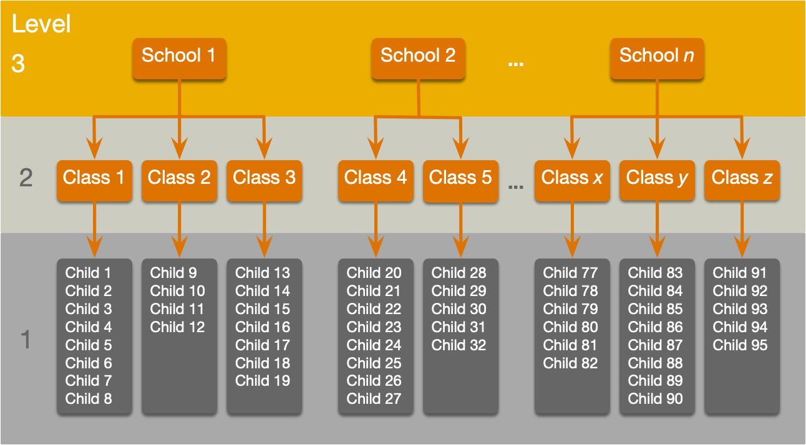
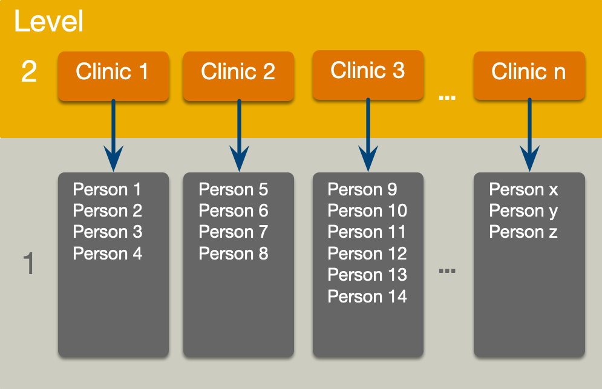
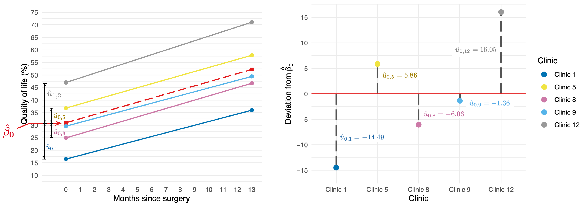
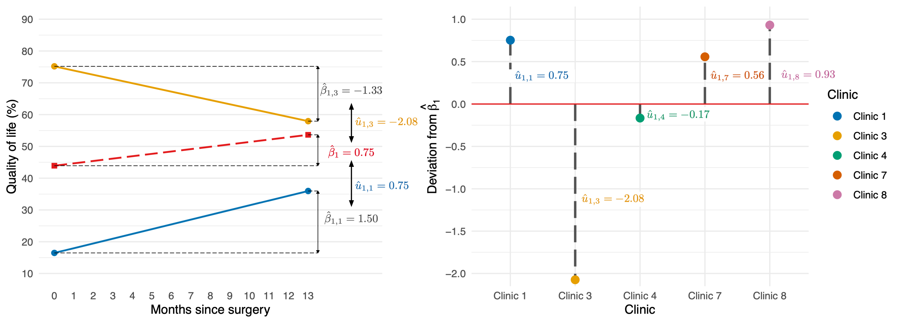
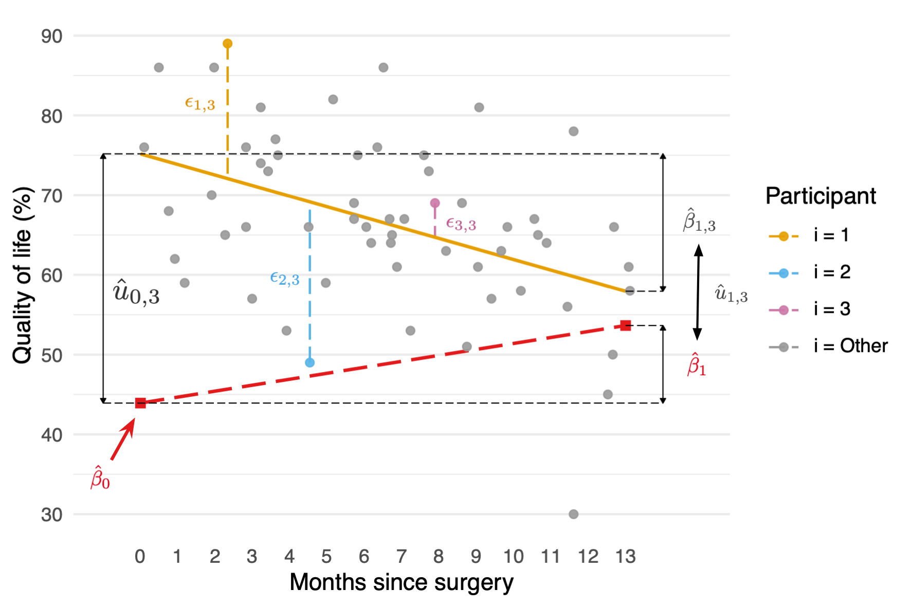

```{r, include=FALSE}


library(easystats)
library(tidyverse)
#non tidyverse
library(DT)
library(glmmTMB)

here::here("helpers/discovr_helpers.R") |> source()
here::here("helpers/easystats_helpers.R") |> source()

cosmetic_tib <- discovr::cosmetic
rirs_tib <- readr::read_csv("data/random_int_slope_2022.csv")
cosmetic_tib <- discovr::cosmetic |> 
  mutate(months = days*12/365)
```

## Learning outcomes

::: incremental

-   Understand what hierarchical data are
    -   Why we can't use the OLS GLM
-   Understand fixed and random coefficients
-   Understand how to build models

:::

::: fragment

### Part 2

- Be able to conduct and interpret models of hierarchical data

:::

::: notes
Use C to toggle pen/markup
Use backspace to delete markup
Use f to toggle fullscreen
:::


## 

::: r-stack
{.fragment fig-align="center" width="1050" height="594"}

{.fragment fig-align="center" width="1050" height="594"}
:::


## Hierarchical data

-   Data structures are often hierarchical
    -   Children nested within classrooms
    -   Observations nested within people
    -   Employees nested within organisations
    -   Patients nested within hospitals
    -   Patients nested within teams nested within hospitals
    -   Service users nested within clinicians nested within hospitals nested within NHS trusts!
    -   Zombies nested within rehabilitation clinics :wink:

## A two-level hierarchy

{.absolute width="1000"}

## A three-level hierarchy

{.absolute width="1000"}

## Why hierarchies matter

::: fragment
-   Data from the same context will be more similar than data from different contexts
    -   Children in the same class will perform more similarly than children from different classes
        -   People treated in the same clinics should be more similar in response than those treated at different clinics
:::

::: fragment
-   Lack of independence
    -   Violates the assumption of spherical errors (specifically, independence)
    -   Biases SEs, CIs and *p*-values
:::

## 

{.r-stretch fig-align="center"}

## 

{.r-stretch fig-align="center"}

## A surgical example

:::: {.callout-tip icon="false"}
## Research Questions

::: nonincremental
-   Is quality of life after cosmetic surgery predicted by the length of time since surgery?
-   Does this relationship depend on the reason for the surgery?
:::
::::

::: fragment
-   `id`: the participant's participant code
-   `post_qol`: This is the outcome variable and it measures quality of life after cosmetic surgery.
-   `base_qol`: We need to adjust our outcome for quality of life before the surgery.
-   `days`: The number of days after surgery that post-surgery quality of life was measured.
-   `clinic`: This variable specifies which of 21 clinics the person attended to have their surgery.
-   `reason`: This variable specifies whether the person had surgery purely to change their appearance or because of a physical reason.
:::

## An initial model

::::: fragment
:::: {.callout-important icon="false"}
## Let's start with ....

::: txt_xl
$$
\begin{aligned}
\text{QoL}_i &= \beta_0  + \beta_1\text{Days}_i + \varepsilon_i \\
\varepsilon_i  &\sim N(0,\sigma^2)
\end{aligned}
$$
:::
::::
:::::

## The surgery data hierarchy

{.absoliute height="550" fig-align="center"}

## Fixed and random coefficients

::: fragment
-   Intercepts and slopes can be fixed or random
    -   In OLS regression they are fixed
:::

::: fragment
-   Fixed coefficients
    -   Intercepts/slopes are assumed to be the same across different contexts (in this case clinics)
:::

::: fragment
-   Random coefficients
    -   Intercepts/slopes are allowed to vary across different contexts (in this case clinics)
:::

## 

```{r}
ggplot2::ggplot(rirs_tib, aes(days, post_qol, colour = clinic, fill = clinic)) +
  discovr::scale_color_senjutsu() +
  discovr::scale_fill_senjutsu() +
  scale_x_continuous(breaks = seq(0, 400, 50)) +
  scale_y_continuous(breaks = seq(0, 100, 10)) +
  coord_cartesian(xlim = c(0, 400), ylim = c(0, 100)) + 
  facet_wrap(~model) +
  labs(x = "Days since surgery", y = "Quality of life (%)", colour = "Clinic", fill = "Clinic") +
  geom_point(alpha = 0.5, size = 1) +
  geom_smooth(method = "lm", se = F, fullrange = T, aes(group = "identity"), colour = mulberry, size = 1) +
  geom_smooth(method = "lm", alpha = 0.3, size = 0.75, se = FALSE, linetype = 5) +
  theme_minimal() +
  theme(legend.position = "none")
```

## Random intercept

::::: fragment
:::: {.callout-important icon="false"}
## OLS model

::: text_xl
$$
\begin{aligned}
\text{QoL}_i &= \beta_0  + \beta_1\text{Days}_i + \varepsilon_i \\
\end{aligned}
$$
:::
::::
:::::

::::: fragment
:::: {.callout-important icon="false"}
## Random intercept model (composite)

::: text_xl
$$
\begin{aligned}
\text{QoL}_{ij} &= (\beta_0 + u_{0j}) + \beta_1\text{Days}_{ij} + \varepsilon_{ij} \\
\text{QoL}_{ij} &= [\beta_0 + \beta_1\text{Days}_{ij}] + [u_{0j} + \varepsilon_{ij}] \\
\end{aligned}
$$
:::
::::
:::::

::::: fragment
:::: {.callout-important icon="false"}
## Random intercept model (alternative)

::: text_xl
$$
\begin{aligned}
\text{QoL}_{ij} &= \beta_{0j} + \beta_1\text{Days}_{ij} + \varepsilon_{ij} \\
\beta_{0j} &= \beta_0 + u_{0j}  \\
\end{aligned}
$$
:::
::::
:::::

## Random intercept

::: text_xl
$$
\begin{aligned}
\text{QoL}_{ij} &= [\beta_0 + \beta_1\text{Days}_{ij}] + [u_{0j} + \varepsilon_{ij}] \\
\end{aligned}
$$
:::



::: text_xl
$$
\begin{aligned}
u_0 \sim N(0, \sigma^2_{u_0})
\end{aligned}
$$
:::

## Random slope

::::: fragment
:::: {.callout-important icon="false"}
## Random intercept model (composite)

::: text_xl
$$
\begin{aligned}
\text{QoL}_{ij} &= (\beta_0 + u_{0j}) + \beta_1\text{Days}_{ij} + \varepsilon_{ij} \\
\text{QoL}_{ij} &= [\beta_0 + \beta_1\text{Days}_{ij}] + [u_{0j} + \varepsilon_{ij}] \\
\end{aligned}
$$
:::
::::
:::::

::::: fragment
:::: {.callout-important icon="false"}
## Random slope model (composite)

::: text_xl
$$
\begin{aligned}
\text{QoL}_{ij} &= (\beta_0 + u_{0j}) + (\beta_1 + u_{1j})\text{Days}_{ij} + \varepsilon_{ij} \\
\text{QoL}_{ij} &= [\beta_0 + \beta_1\text{Days}_{ij}] + [u_{0j} + u_{1j}\text{Days}_{ij} + \varepsilon_{ij}] \\
\end{aligned}
$$
:::
::::
:::::

::::: fragment
:::: {.callout-important icon="false"}
## Random slope model (alternative)

::: text_xl
$$
\begin{aligned}
\text{QoL}_{ij} &= \beta_{0j} + u_{0j} + \beta_1\text{Days}_{ij} + \varepsilon_{ij} \\
\beta_{0j} &= \beta_0 + u_{0j}  \\
\beta_{1j} &= \beta_1 + u_{1j}  \\
\end{aligned}
$$
:::
::::
:::::

## Random slope

::: text_xl
$$
\begin{aligned}
\text{QoL}_{ij} &= [\beta_0 + \beta_1\text{Days}_{ij}] + [u_{0j} + u_{1j}\text{Days}_{ij} + \varepsilon_{ij}] \\
\end{aligned}
$$
:::



::: text_xl
$$
\begin{aligned}
u_1 \sim N(0, \sigma^2_{u_1})
\end{aligned}
$$
:::

## {background-video="../shared_media/video/milton_meditation_distraction.mp4" background-size="cover"}


## The covariance structure of random effects

::::: fragment
:::: {.callout-important icon="false"}
## Random intercept and slope for 1 predictor

::: txt_l
$$
\begin{aligned}
\begin{bmatrix}
u_0 \\
u_1
\end{bmatrix}
\sim N\Bigg(
\begin{bmatrix}
0 \\
0
\end{bmatrix},
\begin{bmatrix}
\sigma^2_{u_0} &  \sigma_{u_0, u_1}\\
\sigma_{u_0, u_1} & \sigma^2_{u_1}
\end{bmatrix}
\Bigg)
\end{aligned}
$$
:::
::::
:::::

::::: fragment
:::: {.callout-important icon="false"}
## Random intercept and slope for several predictor

::: txt_l
$$
\begin{aligned}
\begin{bmatrix}
u_0 \\
u_1 \\
\vdots \\
u_n
\end{bmatrix}
\sim N\begin{pmatrix}\begin{bmatrix}
0 \\
0 \\
\vdots \\
0
\end{bmatrix},
\begin{bmatrix}
\sigma^2_{u_0} &  \sigma_{u_0, u_1} &\dots & \sigma_{u_0, u_n}\\
\sigma_{u_0, u_1} & \sigma^2_{u_1} & \dots & \sigma_{u_1, u_n}\\
\vdots & \vdots & \ddots & \vdots\\
\sigma_{u_0, u_n} & \sigma^2_{u_1} & \dots & \sigma^2_{u_n}\\
\end{bmatrix}
\end{pmatrix}
\end{aligned}
$$
:::
::::
:::::

:::: fragment
::: {.callout-warning icon = false}
##  The danger zone!

Convergence

-   As you include more random effects the number of parameters that need to be estimated from the data rapidly increases
-   This increases the likelihood that the model won't converge.

:::
::::

## Level 1 errors

::::::: columns
::: {.column width="70%"}
{height="425"}
:::

::::: {.column width="30%"}
:::: {.callout-important icon="false"}
## Normally distrubuted errors

::: text_xl
$$
\begin{aligned}
\varepsilon_{ij}  &\sim N(0,\sigma^2)
\end{aligned}
$$
:::
::::
:::::
:::::::

## The covariance structure of level 1 errors

::::: fragment
:::: {.callout-important icon="false"}
## Spherical errors

::: txt_xl
$$
\begin{aligned}
\Phi = 
\begin{bmatrix}
\sigma^2_1 & 0 &   0 &\dots & 0\\
0 & \sigma^2_2 & 0 & \dots & 0\\
0 & 0 & \sigma^2_3 & \dots & 0\\
\vdots & \vdots & \ddots & \vdots\\
0 & 0 & 0 & \dots & \sigma^2_n\\
\end{bmatrix}
\end{aligned}
$$
:::
::::
:::::

## (Potential) Benefits of MLMs

::: fragment
-   Modelling variability in effects across contexts
    -   Model the variability in intercepts
    -   Model the variability in slopes
:::

::: fragment
-   Model violations of the assumption of spherical errors
    -   Model differences in the variability of errors
    -   Model relationships between errors
        -   (Linear model for repeated observations -- next two weeks!)
:::

::: fragment
-   Missing data
    -   MLMs (in general) cope with missing data
:::

## Model assumptions

::: fragment
-   MLMs use maximum likelihood estimation not OLS
:::

::: fragment
-   Familiar assumptions
    -   Linearity and additivity
    -   Level 1 errors are normally distributed with mean of zero and constant variance (i.e. homoscedasticity)
    -   Independent errors (but we can model dependency)
:::

::: fragment
-   New assumptions
    -   Random effects (slopes and intercepts) are assumed to be normally distributed with mean of zero and constant variance (i.e. homoscedasticity)
:::

## Practical issues

### Computing *p*-values

-   There is no unifying method to compute *p*-values in multilevel models because the degrees of freedom of the test statistic are rarely known.
-   df can be approximated (e.g., Satterthwaite and Kenward-Roger methods) but it's unclear how good these approximations are for complex models/complex covariance structures.

## Practical issues

### Should effects be fixed or random?

::: fragment
-   Three approaches
    -   Theory-driven
    -   Maximal model (Barr et al., 2013)
    -   Data-driven (include random effects that improve fit)
:::

::: fragment
-   Treat a predictor as a random effect if ... (Bolker, 2015)
    -   You're **not** interested in differences between the levels.
    -   You're interested in quantifying the variability across levels of the variable.
    -   You're interested in generalizing beyond the observed levels of the contextual variable.
    -   You have an unbalanced design.
    -   You have a categorical predictor that is not direct relevant to the hypothesis but for which you need to adjust (a nuisance variable).
:::


## Summary

-   Data can be hierarchical and this hierarchical structure can be important.
    -   The OLS linear model simply ignores the hierarchy.
-   Hierarchical models are just a fancy linear model in which you estimate the variability in the slopes and intercepts within contexts
  -   i.e. slopes and intercepts can be random variables (allowed to vary) rather than fixed (assumed to be equal in different situations).
-   MLMs are a world of pain
