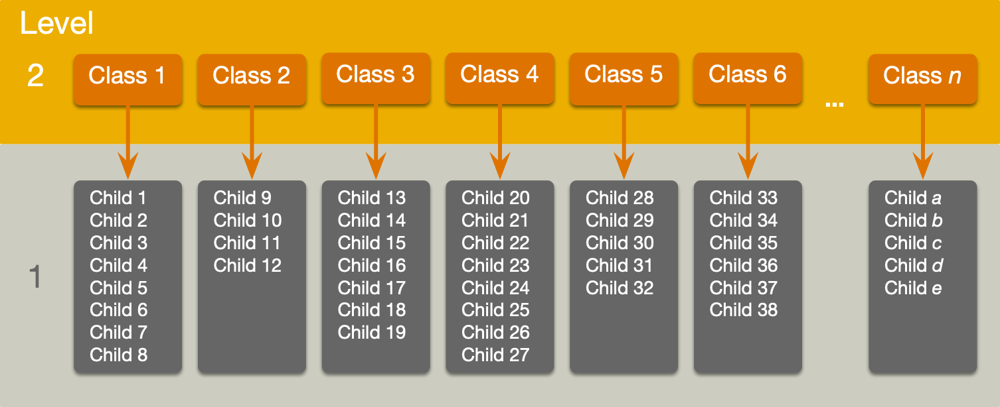

```{r, include=FALSE}


library(easystats)
library(tidyverse)
#non tidyverse
library(DT)
library(glmmTMB)


#library(broom.mixed)
#library(broom)

#library(interactions)
#library(lme4)
#library(lmerTest)


here::here("helpers/discovr_helpers.R") |> source()

cosmetic_tib <- discovr::cosmetic
rirs_tib <- readr::read_csv("data/random_int_slope_2022.csv")
cosmetic_tib <- discovr::cosmetic |> 
  mutate(weeks = days/7,
         months = days/30.42)
```

# Part 1: Theory

## Learning outcomes

-   Understand what hierarchical data are
    -   Why we can't use the OLS GLM
-   Understand fixed and random coefficients
-   Understand how to build models
-   Be able to conduct and interpret models of hierarchical data

::: notes
Use C to toggle pen/markup
Use backspace to delete markup
Use f to toggle fullscreen
:::


## 

::: r-stack
{.fragment fig-align="center" width="1050" height="594"}

{.fragment fig-align="center" width="1050" height="594"}
:::


##

{fig-align="center" height=600}


## Hierarchical data

-   Data structures are often hierarchical
    -   Children nested within classrooms
    -   Observations nested within people
    -   Employees nested within organisations
    -   Patients nested within hospitals
    -   Patients nested within teams nested within hospitals
    -   Service users nested within clinicians nested within hospitals nested within NHS trusts!
    -   Zombies nested within rehabilitation clinics :wink:

## A two-level hierarchy

{.absolute width="1000"}

## A three-level hierarchy

{.absolute width="1000"}

## Why hierarchies matter

::: fragment
-   Data from the same context will be more similar than data from different contexts
    -   Children in the same class will perform more similarly than children from different classes
        -   People treated in the same clinics should be more similar in response than those treated at different clinics
:::

::: fragment
-   Lack of independence
    -   Violates the assumption of spherical errors (specifically, independence)
    -   Biases SEs, CIs and *p*-values
:::

## 

{.r-stretch fig-align="center"}

## 

{.r-stretch fig-align="center"}

## A surgical example

:::: {.callout-tip icon="false"}
## Research Questions

::: nonincremental
-   Is quality of life after cosmetic surgery predicted by the length of time since surgery?
-   Does this relationship depend on the reason for the surgery?
:::
::::

::: fragment
-   `id`: the participant's participant code
-   `post_qol`: This is the outcome variable and it measures quality of life after cosmetic surgery.
-   `base_qol`: We need to adjust our outcome for quality of life before the surgery.
-   `days`: The number of days after surgery that post-surgery quality of life was measured.
-   `clinic`: This variable specifies which of 21 clinics the person attended to have their surgery.
-   `reason`: This variable specifies whether the person had surgery purely to change their appearance or because of a physical reason.
:::

## An initial model

::::: fragment
:::: {.callout-important icon="false"}
## Let's start with ....

::: txt_xl
$$
\begin{aligned}
\text{QoL}_i &= \beta_0  + \beta_1\text{Days}_i + \varepsilon_i \\
\varepsilon_i  &\sim N(0,\sigma^2)
\end{aligned}
$$
:::
::::
:::::

## The surgery data hierarchy

{.absoliute height="550" fig-align="center"}

## Fixed and random coefficients

::: fragment
-   Intercepts and slopes can be fixed or random
    -   In OLS regression they are fixed
:::

::: fragment
-   Fixed coefficients
    -   Intercepts/slopes are assumed to be the same across different contexts (in this case clinics)
:::

::: fragment
-   Random coefficients
    -   Intercepts/slopes are allowed to vary across different contexts (in this case clinics)
:::

## 

```{r}
ggplot2::ggplot(rirs_tib, aes(days, post_qol, colour = clinic, fill = clinic)) +
  discovr::scale_color_senjutsu() +
  discovr::scale_fill_senjutsu() +
  scale_x_continuous(breaks = seq(0, 400, 50)) +
  scale_y_continuous(breaks = seq(0, 100, 10)) +
  coord_cartesian(xlim = c(0, 400), ylim = c(0, 100)) + 
  facet_wrap(~model) +
  labs(x = "Days since surgery", y = "Quality of life (%)", colour = "Clinic", fill = "Clinic") +
  geom_point(alpha = 0.5, size = 1) +
  geom_smooth(method = "lm", se = F, fullrange = T, aes(group = "identity"), colour = red_dk, size = 1) +
  geom_smooth(method = "lm", alpha = 0.3, size = 0.75, se = FALSE, linetype = 5) +
  theme_minimal() +
  theme(legend.position = "none")
```

## Random intercept

::::: fragment
:::: {.callout-important icon="false"}
## OLS model

::: text_xl
$$
\begin{aligned}
\text{QoL}_i &= \beta_0  + \beta_1\text{Days}_i + \varepsilon_i \\
\end{aligned}
$$
:::
::::
:::::

::::: fragment
:::: {.callout-important icon="false"}
## Random intercept model (composite)

::: text_xl
$$
\begin{aligned}
\text{QoL}_{ij} &= (\beta_0 + u_{0j}) + \beta_1\text{Days}_{ij} + \varepsilon_{ij} \\
\text{QoL}_{ij} &= [\beta_0 + \beta_1\text{Days}_{ij}] + [u_{0j} + \varepsilon_{ij}] \\
\end{aligned}
$$
:::
::::
:::::

::::: fragment
:::: {.callout-important icon="false"}
## Random intercept model (alternative)

::: text_xl
$$
\begin{aligned}
\text{QoL}_{ij} &= \beta_{0j} + \beta_1\text{Days}_{ij} + \varepsilon_{ij} \\
\beta_{0j} &= \beta_0 + u_{0j}  \\
\end{aligned}
$$
:::
::::
:::::

## Random intercept

::: text_xl
$$
\begin{aligned}
\text{QoL}_{ij} &= [\beta_0 + \beta_1\text{Days}_{ij}] + [u_{0j} + \varepsilon_{ij}] \\
\end{aligned}
$$
:::


::: text_xl
$$
\begin{aligned}
u_0 \sim N(0, \sigma^2_{u_0})
\end{aligned}
$$
:::

## Random slope

::::: fragment
:::: {.callout-important icon="false"}
## Random intercept model (composite)

::: text_xl
$$
\begin{aligned}
\text{QoL}_{ij} &= (\beta_0 + u_{0j}) + \beta_1\text{Days}_{ij} + \varepsilon_{ij} \\
\text{QoL}_{ij} &= [\beta_0 + \beta_1\text{Days}_{ij}] + [u_{0j} + \varepsilon_{ij}] \\
\end{aligned}
$$
:::
::::
:::::

::::: fragment
:::: {.callout-important icon="false"}
## Random slope model (composite)

::: text_xl
$$
\begin{aligned}
\text{QoL}_{ij} &= (\beta_0 + u_{0j}) + (\beta_1 + u_{1j})\text{Days}_{ij} + \varepsilon_{ij} \\
\text{QoL}_{ij} &= [\beta_0 + \beta_1\text{Days}_{ij}] + [u_{0j} + u_{1j}\text{Days}_{ij} + \varepsilon_{ij}] \\
\end{aligned}
$$
:::
::::
:::::

::::: fragment
:::: {.callout-important icon="false"}
## Random slope model (alternative)

::: text_xl
$$
\begin{aligned}
\text{QoL}_{ij} &= \beta_{0j} + u_{0j} + \beta_1\text{Days}_{ij} + \varepsilon_{ij} \\
\beta_{0j} &= \beta_0 + u_{0j}  \\
\beta_{1j} &= \beta_1 + u_{1j}  \\
\end{aligned}
$$
:::
::::
:::::

## Random slope

::: text_xl
$$
\begin{aligned}
\text{QoL}_{ij} &= [\beta_0 + \beta_1\text{Days}_{ij}] + [u_{0j} + u_{1j}\text{Days}_{ij} + \varepsilon_{ij}] \\
\end{aligned}
$$
:::


::: text_xl
$$
\begin{aligned}
u_1 \sim N(0, \sigma^2_{u_1})
\end{aligned}
$$
:::

## The covariance structure of random effects

::::: fragment
:::: {.callout-important icon="false"}
## Random intercept and slope for 1 predictor

::: txt_l
$$
\begin{aligned}
\begin{bmatrix}
u_0 \\
u_1
\end{bmatrix}
\sim N\Bigg(
\begin{bmatrix}
0 \\
0
\end{bmatrix},
\begin{bmatrix}
\sigma^2_{u_0} &  \sigma_{u_0, u_1}\\
\sigma_{u_0, u_1} & \sigma^2_{u_1}
\end{bmatrix}
\Bigg)
\end{aligned}
$$
:::
::::
:::::

::::: fragment
:::: {.callout-important icon="false"}
## Random intercept and slope for several predictor

::: txt_l
$$
\begin{aligned}
\begin{bmatrix}
u_0 \\
u_1 \\
\vdots \\
u_n
\end{bmatrix}
\sim N\begin{pmatrix}\begin{bmatrix}
0 \\
0 \\
\vdots \\
0
\end{bmatrix},
\begin{bmatrix}
\sigma^2_{u_0} &  \sigma_{u_0, u_1} &\dots & \sigma_{u_0, u_n}\\
\sigma_{u_0, u_1} & \sigma^2_{u_1} & \dots & \sigma_{u_1, u_n}\\
\vdots & \vdots & \ddots & \vdots\\
\sigma_{u_0, u_n} & \sigma^2_{u_1} & \dots & \sigma^2_{u_n}\\
\end{bmatrix}
\end{pmatrix}
\end{aligned}
$$
:::
::::
:::::

:::: fragment
::: {.callout-warning appearance="simple"}
## Convergence

-   As you include more random effects the number of parameters that need to be estimated from the data rapidly increases
-   This increases the likelihood that the model won't converge.
:::
::::

## Level 1 errors

::::::: columns
::: {.column width="70%"}
{height="425"}
:::

::::: {.column width="30%"}
:::: {.callout-important icon="false"}
## Normally distrubuted errors

::: text_xl
$$
\begin{aligned}
\varepsilon_{ij}  &\sim N(0,\sigma^2)
\end{aligned}
$$
:::
::::
:::::
:::::::

## The covariance structure of level 1 errors

::::: fragment
:::: {.callout-important icon="false"}
## Spherical errors

::: txt_xl
$$
\begin{aligned}
\Phi = 
\begin{bmatrix}
\sigma^2_1 & 0 &   0 &\dots & 0\\
0 & \sigma^2_2 & 0 & \dots & 0\\
0 & 0 & \sigma^2_3 & \dots & 0\\
\vdots & \vdots & \ddots & \vdots\\
0 & 0 & 0 & \dots & \sigma^2_n\\
\end{bmatrix}
\end{aligned}
$$
:::
::::
:::::

## (Potential) Benefits of MLMs

::: fragment
-   Modelling variability in effects across contexts
    -   Model the variability in intercepts
    -   Model the variability in slopes
:::

::: fragment
-   Model violations of the assumption of spherical errors
    -   Model differences in the variability of errors
    -   Model relationships between errors
        -   (Linear model for repeated observations -- next two weeks!)
:::

::: fragment
-   Missing data
    -   MLMs (in general) cope with missing data
:::

## Model assumptions

::: fragment
-   MLMs use maximum likelihood estimation not OLS
:::

::: fragment
-   Familiar assumptions
    -   Linearity and additivity
    -   Level 1 errors are normally distributed with mean of zero and constant variance (i.e. homoscedasticity)
    -   Independent errors (but we can model dependency)
:::

::: fragment
-   New assumptions
    -   Random effects (slopes and intercepts) are assumed to be normally distributed with mean of zero and constant variance (i.e. homoscedasticity)
:::

## Practical issues

### Computing *p*-values

-   There is no unifying method to compute *p*-values in multilevel models because the degrees of freedom of the test statistic are rarely known.
-   df can be approximated (e.g., Satterthwaite and Kenward-Roger methods) but it's unclear how good these approximations are for complex models/complex covariance structures.

## Practical issues

### Should effects be fixed or random?

::: fragment
-   Three approaches
    -   Theory-driven
    -   Maximal model (Barr et al., 2013)
    -   Data-driven (include random effects that improve fit)
:::

::: fragment
-   Treat a predictor as a random effect if ... (Bolker, 2015)
    -   You're **not** interested in differences between the levels.
    -   You're interested in quantifying the variability across levels of the variable.
    -   You're interested in generalizing beyond the observed levels of the contextual variable.
    -   You have an unbalanced design.
    -   You have a categorical predictor that is not direct relevant to the hypothesis but for which you need to adjust (a nuisance variable).
:::

## The model we will fit

::::: fragment
:::: {.callout-important icon="false"}
## Composite form

::: txt_l
$$
\begin{aligned}
\text{QoL}_{ij} &= [\beta_0  + \beta_1\text{Days}_{ij} + \beta_2\text{Pre QoL}_{ij} + \beta_3\text{Reason}_{ij} +  \beta_4\text{Days} \times \text{Reason}_{ij}] \\
&\quad + [u_{0j} + u_{1j}\text{Days}_{ij}+ \varepsilon_{ij}]
\end{aligned}
$$
:::
::::
:::::

::::: fragment
:::: {.callout-important icon="false"}
## Separate equations

::: txt_l
$$
\begin{aligned}
\text{QoL}_{ij} &= \beta_{0j}  + \beta_{1j}\text{Days}_{ij} + \beta_2\text{Pre QoL}_{ij} + \beta_3\text{Reason}_{ij} +  \beta_4\text{Days} \times \text{Reason}_{ij} + \varepsilon_{ij}\\
\beta_{0j} &= \beta_{0} + u_{0j} \\
\beta_{1j} &= \beta_{1} + u_{1j}
\end{aligned}
$$
:::
::::
:::::

## 

{fig-align="center" height="600"}


## [L]{.txt_ong}oad and [L]{.txt_ong}ook

```{r}
cosmetic_tib |> 
  dplyr::select(-c(bdi, weeks, months)) |> 
  DT::datatable()
```

{.absolute top=0 left=800 height="80"}


## [L]{.txt_ong}oad and [L]{.txt_ong}ook

```{r}
#| echo: true
#| eval: false

cosmetic_tib |> 
  describe_distribution(select = -c(bdi, weeks, months)) |> 
  display()
```


```{r}
cosmetic_tib |> 
  describe_distribution(select = -c(bdi, weeks, months)) |> 
  DT::datatable()
```

{.absolute top=0 left=800 height="80"}

## [L]{.txt_ong}oad and [L]{.txt_ong}ook

::: panel-tabset
### `post_qol`


```{r}
#| eval: false
#| echo: true

cosmetic_tib |> 
  dplyr::group_by(clinic) |> 
  describe_distribution(select = "post_qol") |> 
  display()
```

```{r}
cosmetic_tib |> 
  dplyr::group_by(clinic) |> 
  describe_distribution(select = "post_qol") |> 
  DT::datatable() |> 
  formatRound(c('Mean', 'SD', 'Skewness', 'Kurtosis'))
```

### `pre_qol`


```{r}
#| eval: false
#| echo: true

cosmetic_tib |> 
  dplyr::group_by(clinic) |> 
  describe_distribution(select = "pre_qol") |> 
  display()
```

```{r}
cosmetic_tib |> 
  dplyr::group_by(clinic) |> 
  describe_distribution(select = "pre_qol") |> 
  DT::datatable() |> 
  formatRound(c('Mean', 'SD', 'Skewness', 'Kurtosis'))
```

### `days`


```{r}
#| eval: false
#| echo: true

cosmetic_tib |> 
  dplyr::group_by(clinic) |> 
  describe_distribution(select = "days") |> 
  display()
```

```{r}
cosmetic_tib |> 
  dplyr::group_by(clinic) |> 
  describe_distribution(select = "days") |> 
  DT::datatable() |> 
  formatRound(c('Mean', 'SD', 'Skewness', 'Kurtosis'))
```

:::


## [V]{.txt_ong}isualize


```{r}
#| echo: false
#| fig-width: 10
#| fig-height: 6

ggplot(cosmetic_tib, aes(days, post_qol)) +
  geom_point(position = position_jitter(width = 0.1, height = NULL), alpha = 0.5, size = 1, colour = "#999933") +
  geom_smooth(method = "lm", se = FALSE, linewidth = 0.75, colour = "#CC6677") +
  coord_cartesian(xlim = c(0, 400), ylim = c(0, 100)) +
  scale_y_continuous(breaks = seq(0, 100, 10)) +
  labs(x = "Days post surgery", y = "Quality of life after surgery (%)", colour = "Clinic") +
  facet_wrap(~ clinic, ncol = 7) +
  theme_minimal()

```

{.absolute top=0 left=800 height="80"}

## Rescaling predictors


::: {.callout-note icon = false}
##  Statis-tip

Within our model we have three predictors measured on very different scales:

-	`days`: the days since surgery ranges from 0 to around 400
-	`reason`: the reason for surgery ranges from 0 (change appearance) to 1 (physical reason)
-	`base_qol`: baseline quality of life is measured on a scale ranging from 0 to 100.

The associated variances will be really different, which can create problems with model convergence.

:::

::: fragment

### Convert days

- 1 year = 365 days (range 0 to 1.1)
- 1 month ≈ 30 days (range 0 to 13)

:::

::: fragment
::: center-h
::: txt_mulberry
::: txt_l
$$
\text{months} \approx \frac{12}{365}\times \text{days}
$$
:::
:::
:::
:::


::: notes
The range of days is about 10 times that of base_qol and about 400 times that of reason, and this will mean that the associated variances will also be really different, which can create problems with model convergence. For example, if you try to fit the model in this chapter using lme4, it will fail to converge using days as a predictor. It’s better to pre-empt these potential issues, so let’s think about how we can make our predictor’s variances better balanced. The variables at the two extremes are days and reason. We can’t change the response scale for reason because it is categorical, but because days is a unit of time we can express it in different units. 
:::


## Fitting a fixed-effect model on the pooled data

::: r-fit-text
```{r}
#| echo: true
#| eval: false

pooled_lm <- lm(post_qol ~ days*reason + base_qol, data = cosmetic_tib)
broom::tidy(pooled_lm, conf.int = TRUE)
```
:::

```{r}
pooled_lm <- lm(post_qol ~ days*reason + base_qol, data = cosmetic_tib) |> 
  broom::tidy(conf.int = TRUE)

  knitr::kable(pooled_lm,
               caption = "Parameter estimates for the pooled data model",
               digits = 2) |> 
  kableExtra::column_spec(c(2, 5), background = "yellow") |> 
  style_my_kable(nrows = nrow(pooled_lm))
```

## Fitting fixed-effect models within clinics

:::: panel-tabset
### Code

::: r-fit-text
```{r}
#| echo: true
#| 
clinic_lms <- cosmetic_tib  |>
  dplyr::arrange(clinic) |> 
  dplyr::group_by(clinic)  |>  
  tidyr::nest()  |> 
  dplyr::mutate(
    model = purrr::map(.x = data, .f = \(clinic_tib) lm(post_qol ~ days*reason + base_qol, data = clinic_tib)),
    coefs = purrr::map(model, tidy, conf.int = TRUE)
    )
```
:::

### Parameter estimates

```{r}
#| echo: true
#| eval: false
clinic_lms  |>
  dplyr::select(-c(data, model)) |> 
  tidyr::unnest(coefs)
```

```{r}
models_tib <- clinic_lms  |>
  dplyr::select(-c(data, model)) |> 
  tidyr::unnest(coefs) |> 
  dplyr::mutate(
    across(.cols = is.numeric, \(col) round(col, 2))
  )
models_tib |> 
  dplyr::select(-std.error) |> 
  DT::datatable(rownames = F, options = list(pageLength = 8))
```

### Plot

```{r}
#| echo: true
#| eval: false
ggplot(models_tib, aes(estimate)) +
  geom_density() +
  facet_wrap(~term , scales = "free") +
  theme_minimal()
```

```{r}
#| fig-width: 10
#| fig-height: 4
ggplot(models_tib, aes(estimate)) +
  geom_density() +
  facet_wrap(~term , scales = "free") +
  theme_minimal()
```
::::

## (Attempt to) fit the model

::::::: panel-tabset
### Attempt #1

::: txt_xl
```{r}
#| echo: true

cosmetic_mod <- lmerTest::lmer(post_qol ~ days*reason + base_qol
                               + (days|clinic),
                               data = cosmetic_tib)
```
:::

::::: fragment
:::: {.callout-warning appearance="simple"}
::: txt_xl
**Convergence failure**

-   Warning: Model failed to converge with max\|grad\| = 6.14912 (tol = 0.002, component 1)
-   Warning: Model is nearly unidentifiable: very large eigenvalue - Rescale variables?
:::
::::
:::::

### Output

```{r}
#| echo: true
#| eval: false

cosmetic_mod |> 
  broom.mixed::tidy(conf.int = T) |> 
  dplyr::select(-c(effect, group)) |> 
  knitr::kable(digits = 3) |> 
  kableExtra::column_spec(4, background = "yellow")
```

```{r}
cosmetic_mod_tbl <- cosmetic_mod |> 
  broom.mixed::tidy(conf.int = T) 

cosmetic_mod_tbl |> 
  dplyr::select(-c(effect, group)) |> 
  knitr::kable(digits = 3) |> 
  kableExtra::column_spec(4, background = "yellow") |> 
  style_my_kable(nrows = nrow(cosmetic_mod_tbl))
```
:::::::

## Fit the model again

:::::: panel-tabset
### Fit the model

::: txt_xl
```{r}
#| echo: true
#| code-line-numbers: "|2|4"


cosmetic_bob <- lmerTest::lmer(
  post_qol ~ months*reason + base_qol + (months|clinic),
  data = cosmetic_tib,
  control = lmerControl(optimizer="bobyqa")
  )

```
:::

### *F*-statistics

::: txt_xl
```{r}
#| echo: true
#| eval: false
anova(cosmetic_bob)  |> 
  knitr::kable(digits = 2, caption = "F-tests of fixed effects")
```
:::

```{r}
#| echo: false
anova(cosmetic_bob)  |> 
  knitr::kable(digits = 2, caption = "F-tests of fixed effects") |> 
  style_my_kable(nrows = nrow(anova(cosmetic_bob)))
```

### Fixed effects

```{r}
#| echo: true
#| eval: false
cosmetic_bob |> 
  broom.mixed::tidy(conf.int = T, effects = "fixed") |> 
  knitr::kable(digits = 3)
```

```{r}
#| echo: false
#| 
cosmetic_mod_tbl <- cosmetic_bob |> 
  broom.mixed::tidy(conf.int = T, effects = "fixed") 

cos_mod_fixed <- cosmetic_mod_tbl |> 
  dplyr::select(-effect)


cosmetic_bob_fixed_pars <- knitr::kable(cos_mod_fixed, digits = 3, caption = "Fixed effect parameter estimates") |>
  kableExtra::column_spec(c(2, 6), background = "yellow") |> 
  style_my_kable(nrows = nrow(cos_mod_fixed))

cosmetic_bob_fixed_pars
```

### Random effects

::: txt_xl
```{r}
#| echo: true
#| eval: false
cosmetic_bob |> 
  broom.mixed::tidy(effects = "ran_pars") |> 
  knitr::kable(digits = 3)
```
:::

```{r}
#| echo: false

cos_mod_random <- cosmetic_bob |> 
  broom.mixed::tidy(effects = "ran_pars") |> 
  dplyr::select(-effect)

knitr::kable(cos_mod_random, digits = 3, caption = "Random effect parameter estimates") |> 
  kableExtra::column_spec(2, background = "yellow") |> 
  style_my_kable(nrows = nrow(cos_mod_random))

```
::::::

## Interpretation

::::::: panel-tabset
### Months

```{r}
#| echo: false

cosmetic_bob_fixed_pars
```

::: tip
`r pencil()` **Write-up**

-   The overall effect of time on quality of life was small and non-significant, $\beta$ = 0.48 \[−0.35, 1.31\], *t*(19.62) = 1.225, *p* = 0.239.
:::

### Reason

```{r}
#| echo: false
cosmetic_bob_fixed_pars
```

::: tip
`r pencil()` **Write-up**

-   The effect of the reason for surgery was also small and non-significant, $\beta$ = −1.79 \[−3.71, 0.12\], *t*(1535.47) = −1.83, *p* = 0.067.
-   With other variables held constant the difference in quality of life in those seeking surgery for physical reasons was 1.79 lower (on the 100-point scale) than those seeking it for cosmetic reasons.
:::

### Baseline QoL

```{r}
#| echo: false
cosmetic_bob_fixed_pars
```

::: tip
`r pencil()` **Write-up**

-   The effect of baseline quality of life on post-surgery quality of life was substantial and significant, $\beta$ = 0.47 \[0.42, 0.52\], *t*(1534.92) = 19.56, *p* \< 0.001.
-   With other variables held constant, for every unit increase in baseline quality of life there is a half unit increase in post-surgery quality of life, which is a fairly strong relationship.
:::

### Months $\times$ Reason

```{r}
#| echo: false
cosmetic_bob_fixed_pars
```

::: tip
`r pencil()` **Write-up**

-   The combined effect of months and reason on post-surgery quality of life was significant, $\beta$ = 0.45 \[0.19, 0.70\], *t*(1535.12) = 3.44, *p* = 0.001.
-   The change over time of quality of life is 0.45 bigger in those having surgery for physical reasons than in those having it for cosmetic reasons.
:::
:::::::

## Simple slopes

::::::: panel-tabset
### Code

```{r}
#| echo: true
#| eval: false
cosmetic_slopes <- modelbased::estimate_slopes(cosmetic_bob,
                                               trend = "months",
                                               at = "reason",
                                               ci = 0.95)
cosmetic_slopes |> 
  knitr::kable(caption = "Change over time for different reasons for surgery",
        digits = 3)
```

```{r}
#| echo: false
#| eval: true

cosmetic_slopes <- modelbased::estimate_slopes(cosmetic_bob,
                                               trend = "months",
                                               at = "reason",
                                               ci = 0.95)
cosmetic_slopes |> 
  knitr::kable(caption = "Change over time for different reasons for surgery",
        digits = 3) |> 
  style_my_kable(nrows = nrow(cosmetic_slopes))

```

### Interpretation

::: tip
`r pencil()` **Write-up**

-   For those who had surgery to change their appearance, their quality of life increased over time but not significantly so, $\beta$ = 0.48 \[−0.35, 1.31\], *t*(19.62) = 1.22, *p* = 0.239. Quality of life increased by 5.76 units (on the 100-point scale) per year.
-   For those who had surgery to help with a physical problem, their quality of life significantly increased over time, $\beta$ = 0.93 \[0.09, 1.77\], *t*(20.56) = 2.32, *p* = 0.031. Quality of life increased by 11.16 units (on the 100-point scale) per year.
:::

### Plot

::::: columns
::: {.column width="40%"}
```{r}
#| echo: true
#| eval: false
interactions::interact_plot(
  model = cosmetic_bob,
  pred = months,
  modx = reason,
  interval = TRUE,
  x.label = "Months since surgery",
  y.label = "Quality of life post-surgery (0-100)",
  legend.main = "Reason for surgery"
  )
```
:::

::: {.column width="60%"}
```{r}
#| fig-height: 5
#| fig-width: 7
interactions::interact_plot(
  model = cosmetic_bob,
  pred = months,
  modx = reason,
  interval = TRUE,
  x.label = "Months since surgery",
  y.label = "Quality of life post-surgery (0-100)",
  legend.main = "Reason for surgery"
  )
```
:::
:::::
:::::::

## Summary

-   Data can be hierarchical and this hierarchical structure can be important.
    -   The OLS linear model simply ignores the hierarchy.
-   Hierarchical models are just a fancy linear model in which you estimate the variability in the slopes and intercepts within contexts
-   i.e. slopes and intercepts can be random variables (allowed to vary) rather than fixed (assumed to be equal in different situations).
-   MLMs are a world of pain
