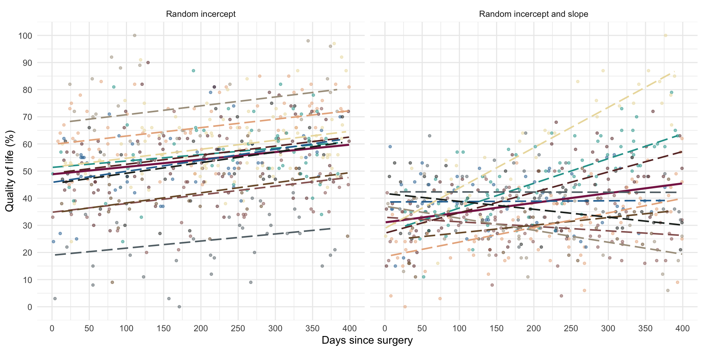
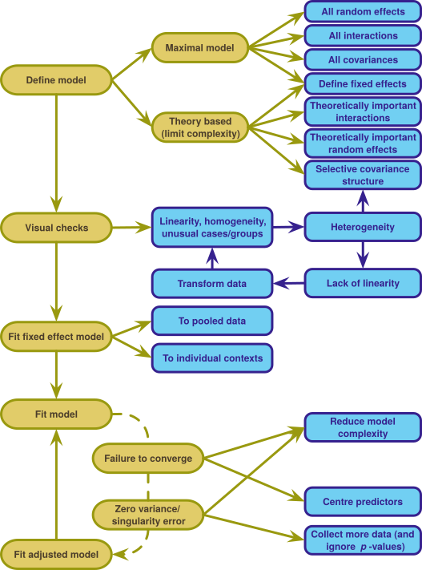
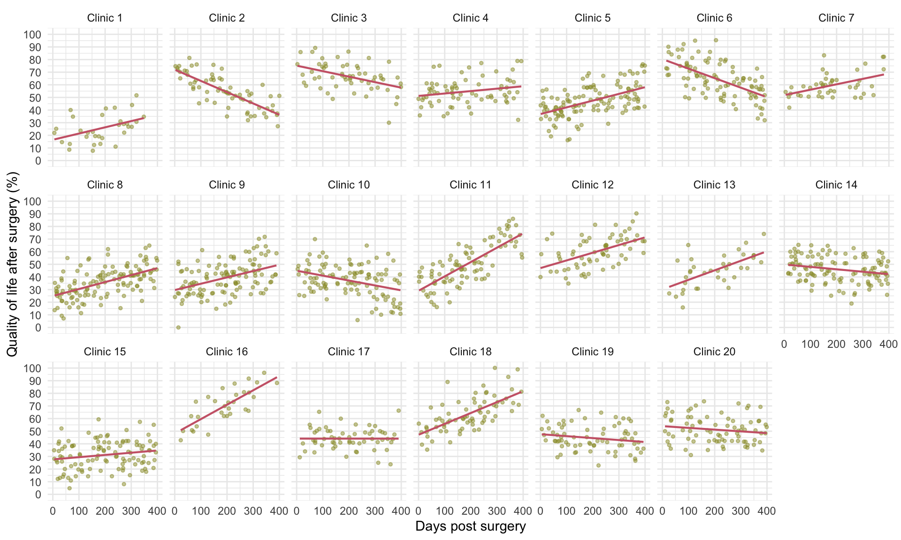
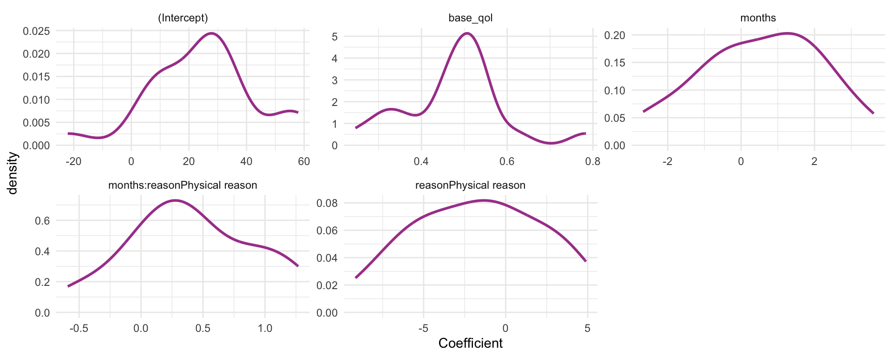
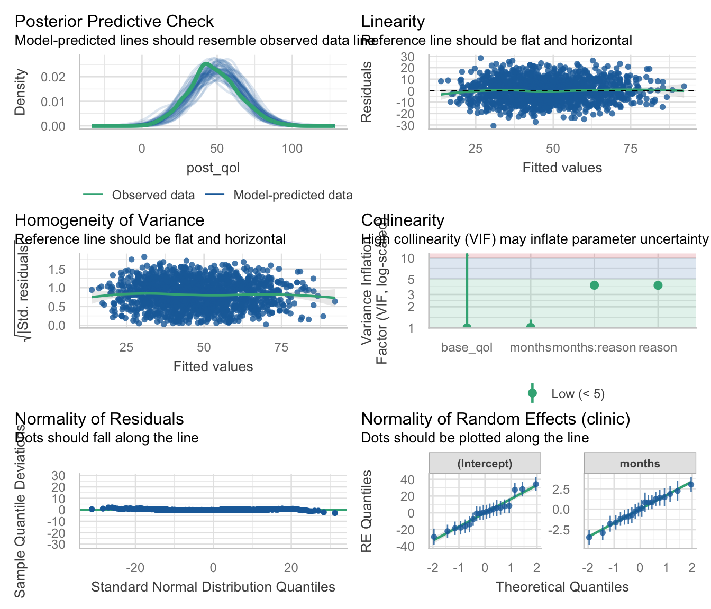
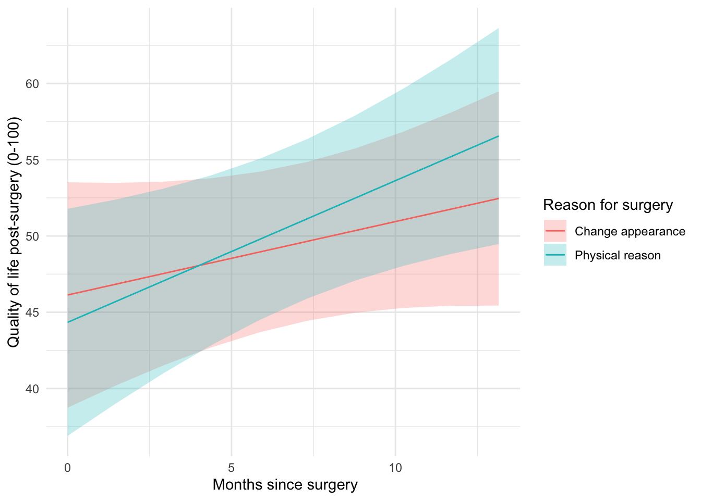

# Multilevel models

**Fitting models in R**

Professor Andy Field, University of Sussex

Links: [deafheaven come back](https://profandyfield.github.io/statistics_lectures/ais_11_mlmr/media/deafheaven_come_back.mp3) \| [bsky.app](https://bsky.app/profile/profandyfield.bsky.social) \| [youtube.com](https://www.youtube.com/user/ProfAndyField) \| [discoveringstatistics.com](https://www.discoveringstatistics.com) \| [discovr.rocks](https://www.discovr.rocks) \| [statisticsadventure.com](https://www.statisticsadventure.com)

## About this version

This is a plain-text version of the lecture slides. Each slide starts with a heading such as “Slide 5”, and the numbers match the slide numbers shown in the lecture. Content that appeared one piece at a time, in columns or in tabs is shown in reading order. Videos and interactive apps are given as links.

## Slide 2: Learning outcomes

- Understand what hierarchical data are
  - Why we can’t use the OLS GLM
- Understand fixed and random coefficients
- Understand how to build models
- Be able to conduct and interpret models of hierarchical data

## Slide 3


## Slide 4: A surgical example

> **Tip: Research Questions**
>
> - Is quality of life after cosmetic surgery predicted by the length of time since surgery?
> - Does this relationship depend on the reason for the surgery?

- `id`: the participant’s participant code
- `post_qol`: This is the outcome variable and it measures quality of life after cosmetic surgery.
- `base_qol`: We need to adjust our outcome for quality of life before the surgery.
- `days`: The number of days after surgery that post-surgery quality of life was measured.
- `clinic`: This variable specifies which of 21 clinics the person attended to have their surgery.
- `reason`: This variable specifies whether the person had surgery purely to change their appearance or because of a physical reason.

## Slide 5: The surgery data hierarchy


## Slide 6: Fixed and random coefficients

- Intercepts and slopes can be fixed or random
  - In OLS regression they are fixed
- Fixed coefficients
  - Intercepts/slopes are assumed to be the same across different contexts (in this case clinics)
- Random coefficients
  - Intercepts/slopes are allowed to vary across different contexts (in this case clinics)

## Slide 7



## Slide 8: (Potential) Benefits of MLMs

- Modelling variability in effects across contexts
  - Model the variability in intercepts
  - Model the variability in slopes
- Model violations of the assumption of spherical errors
  - Model differences in the variability of errors
  - Model relationships between errors
    - (Linear model for repeated observations – next two weeks!)
- Missing data
  - MLMs (in general) cope with missing data

## Slide 9: Model assumptions

- MLMs use maximum likelihood estimation not OLS
- Familiar assumptions
  - Linearity and additivity
  - Level 1 errors are normally distributed with mean of zero and constant variance (i.e. homoscedasticity)
  - Independent errors (but we can model dependency)
- New assumptions
  - Random effects (slopes and intercepts) are assumed to be normally distributed with mean of zero and constant variance (i.e. homoscedasticity)

## Slide 10: Practical issues

### Computing *p*-values

- There is no unifying method to compute *p*-values in multilevel models because the degrees of freedom of the test statistic are rarely known.
- df can be approximated (e.g., Satterthwaite and Kenward-Roger methods) but it’s unclear how good these approximations are for complex models/complex covariance structures.

## Slide 11: Practical issues

### Should effects be fixed or random?

- Three approaches
  - Theory-driven
  - Maximal model (Barr et al., 2013)
  - Data-driven (include random effects that improve fit)
- Treat a predictor as a random effect if … (Bolker, 2015)
  - You’re **not** interested in differences between the levels.
  - You’re interested in quantifying the variability across levels of the variable.
  - You’re interested in generalizing beyond the observed levels of the contextual variable.
  - You have an unbalanced design.
  - You have a categorical predictor that is not direct relevant to the hypothesis but for which you need to adjust (a nuisance variable).

## Slide 12



## Slide 13: The model we will fit

> **Important: Composite form**
>
> ``` math
>  \begin{aligned} \text{QoL}_{ij} &= [\beta_0 + \beta_1\text{Days}_{ij} + \beta_2\text{Pre QoL}_{ij} + \beta_3\text{Reason}_{ij} + \beta_4\text{Days} \times \text{Reason}_{ij}] \\ &\quad + [u_{0j} + u_{1j}\text{Days}_{ij}+ \varepsilon_{ij}] \end{aligned} 
> ```

> **Important: Separate equations**
>
> ``` math
>  \begin{aligned} \text{QoL}_{ij} &= \beta_{0j} + \beta_{1j}\text{Days}_{ij} + \beta_2\text{Pre QoL}_{ij} + \beta_3\text{Reason}_{ij} + \beta_4\text{Days} \times \text{Reason}_{ij} + \varepsilon_{ij}\\ \beta_{0j} &= \beta_{0} + u_{0j} \\ \beta_{1j} &= \beta_{1} + u_{1j} \end{aligned} 
> ```

## Slide 14


## Slide 15: Load and Look

|     | id    | post_qol | base_qol | days | clinic    | reason            |
|-----|-------|----------|----------|------|-----------|-------------------|
| 1   | qx069 | 71       | 56       | 342  | Clinic 5  | Physical reason   |
| 2   | v3rjc | 30       | 39       | 349  | Clinic 9  | Physical reason   |
| 3   | 33ju1 | 42       | 33       | 208  | Clinic 20 | Change appearance |
| 4   | 5ydxd | 38       | 34       | 242  | Clinic 11 | Change appearance |
| 5   | i6p75 | 69       | 52       | 361  | Clinic 12 | Change appearance |
| 6   | svsuy | 53       | 47       | 41   | Clinic 10 | Physical reason   |
| 7   | 27xby | 49       | 40       | 131  | Clinic 9  | Change appearance |
| 8   | dcv37 | 50       | 28       | 358  | Clinic 6  | Change appearance |
| 9   | 4g46d | 28       | 48       | 56   | Clinic 10 | Physical reason   |
| 10  | j060r | 41       | 39       | 71   | Clinic 17 | Physical reason   |
| 11  | tiwdm | 32       | 36       | 174  | Clinic 8  | Change appearance |
| 12  | c1xta | 59       | 41       | 151  | Clinic 3  | Change appearance |
| 13  | ihh09 | 40       | 45       | 173  | Clinic 8  | Physical reason   |
| 14  | 1wc65 | 57       | 45       | 124  | Clinic 11 | Physical reason   |
| 15  | 3w3l4 | 51       | 50       | 301  | Clinic 20 | Change appearance |
| 16  | x3k15 | 46       | 25       | 44   | Clinic 4  | Change appearance |
| 17  | o2ob6 | 35       | 55       | 87   | Clinic 13 | Physical reason   |
| 18  | 0dr38 | 35       | 40       | 165  | Clinic 11 | Change appearance |
| 19  | g1c4i | 24       | 37       | 205  | Clinic 8  | Physical reason   |
| 20  | t74a9 | 70       | 42       | 128  | Clinic 20 | Change appearance |
| 21  | 001k6 | 52       | 34       | 104  | Clinic 5  | Physical reason   |
| 22  | 86w1t | 30       | 40       | 87   | Clinic 8  | Change appearance |
| 23  | 4778j | 89       | 57       | 111  | Clinic 18 | Physical reason   |
| 24  | xiiql | 59       | 52       | 317  | Clinic 4  | Change appearance |
| 25  | 1664w | 38       | 56       | 386  | Clinic 15 | Physical reason   |
| 26  | 1p563 | 64       | 44       | 183  | Clinic 7  | Change appearance |
| 27  | 94f54 | 23       | 35       | 71   | Clinic 8  | Change appearance |
| 28  | 4dond | 27       | 55       | 91   | Clinic 8  | Change appearance |
| 29  | jb9s1 | 69       | 50       | 240  | Clinic 3  | Change appearance |
| 30  | k213e | 60       | 50       | 317  | Clinic 19 | Physical reason   |
| 31  | je44c | 70       | 57       | 70   | Clinic 10 | Change appearance |
| 32  | xmn2u | 40       | 57       | 52   | Clinic 5  | Physical reason   |
| 33  | yt9gk | 34       | 50       | 177  | Clinic 9  | Change appearance |
| 34  | 7q5kx | 42       | 55       | 237  | Clinic 1  | Change appearance |
| 35  | np071 | 58       | 50       | 119  | Clinic 19 | Change appearance |
| 36  | g4q81 | 81       | 48       | 98   | Clinic 3  | Physical reason   |
| 37  | uld52 | 49       | 45       | 139  | Clinic 14 | Change appearance |
| 38  | n3hma | 39       | 24       | 205  | Clinic 19 | Change appearance |
| 39  | 350f0 | 68       | 43       | 207  | Clinic 16 | Physical reason   |
| 40  | bw6x8 | 49       | 46       | 138  | Clinic 3  | Change appearance |
| 41  | 22h3q | 44       | 64       | 24   | Clinic 9  | Physical reason   |
| 42  | xq17q | 50       | 52       | 319  | Clinic 17 | Change appearance |
| 43  | dt187 | 50       | 50       | 385  | Clinic 3  | Physical reason   |
| 44  | gt9vy | 47       | 60       | 366  | Clinic 15 | Change appearance |
| 45  | f6920 | 42       | 48       | 60   | Clinic 5  | Change appearance |
| 46  | 5og24 | 58       | 52       | 273  | Clinic 7  | Physical reason   |
| 47  | a9yf8 | 30       | 43       | 111  | Clinic 9  | Physical reason   |
| 48  | k01jg | 36       | 38       | 68   | Clinic 5  | Physical reason   |
| 49  | ea3cq | 36       | 21       | 32   | Clinic 20 | Physical reason   |
| 50  | 17327 | 19       | 36       | 257  | Clinic 14 | Change appearance |

(first 50 of 1576 rows)


## Slide 16: Load and Look

``` r
cosmetic_tib |> 
  describe_distribution(select = c(post_qol, base_qol, days)) |> 
  display()
```

| Variable | Mean   | SD     | IQR    | Range          | Skewness | Kurtosis | n    | n_Missing |
|----------|--------|--------|--------|----------------|----------|----------|------|-----------|
| post_qol | 47.83  | 16.35  | 21.00  | (0.00, 100.00) | 0.17     | -0.10    | 1576 | 0         |
| base_qol | 44.80  | 9.84   | 13.00  | (10.00, 78.00) | 0.05     | 0.02     | 1576 | 0         |
| days     | 197.30 | 114.60 | 199.75 | (0.00, 400.00) | 0.05     | -1.20    | 1576 | 0         |


## Slide 17: Load and Look

**Tab 1 of 3: post_qol**

``` r
cosmetic_tib |> 
  dplyr::group_by(clinic) |> 
  describe_distribution(select = "post_qol") |> 
  display()
```

|  | clinic | Mean | SD | IQR | Min | Max | Skewness | Kurtosis | n |
|----|----|----|----|----|----|----|----|----|----|
| 1 | Clinic 1 | 25.65625 | 11.0354542271716 | 15.75 | 8 | 52 | 0.407899240550743 | -0.352180985859134 | 32 |
| 2 | Clinic 2 | 54.8507462686567 | 13.2702146900302 | 20 | 27 | 81 | -0.0513380390916212 | -0.879678832993917 | 67 |
| 3 | Clinic 3 | 66.4655172413793 | 11.0027357319631 | 14.5 | 30 | 89 | -0.414861554415016 | 1.14208809296449 | 58 |
| 4 | Clinic 4 | 54.7 | 10.6340306890498 | 12.25 | 32 | 79 | 0.365658242876181 | 0.0249644301388012 | 70 |
| 5 | Clinic 5 | 47.0483870967742 | 12.2606216361915 | 16 | 16 | 76 | 0.111765209288602 | 0.12069144273428 | 124 |
| 6 | Clinic 6 | 64.2631578947368 | 14.1370273789472 | 21 | 32 | 95 | 0.0734784811303642 | -0.432645568113955 | 95 |
| 7 | Clinic 7 | 59.6818181818182 | 9.45189221186837 | 11.5 | 42 | 83 | 0.940706527257254 | 0.577909292334511 | 44 |
| 8 | Clinic 8 | 35.6124031007752 | 11.9060843672989 | 16 | 7 | 65 | 0.0498016022683787 | -0.271695249863533 | 129 |
| 9 | Clinic 9 | 39.3162393162393 | 12.6733834394886 | 16.5 | 0 | 72 | 0.130854680207494 | 0.098409207689199 | 117 |
| 10 | Clinic 10 | 36.9363636363636 | 12.6028082444498 | 15.5 | 6 | 70 | -0.199205923607256 | -0.0520299797264735 | 110 |
| 11 | Clinic 11 | 50.0112359550562 | 16.6252097608247 | 26 | 16 | 86 | 0.205923737309751 | -0.582846691565757 | 89 |
| 12 | Clinic 12 | 60 | 12.3958158263182 | 19 | 35 | 90 | 0.0478376284563383 | -0.568943307343641 | 65 |
| 13 | Clinic 13 | 45.3055555555556 | 13.0533398997989 | 19.25 | 16 | 74 | -0.0825440893641467 | -0.240240206931453 | 36 |
| 14 | Clinic 14 | 45.9237288135593 | 10.031707662541 | 15.25 | 19 | 65 | -0.160262718758886 | -0.492907944351094 | 118 |
| 15 | Clinic 15 | 31.1651376146789 | 11.1849053055379 | 15 | 5 | 59 | 0.0300645160122348 | -0.384253469842993 | 109 |
| 16 | Clinic 16 | 69.9032258064516 | 13.9841692369376 | 19 | 43 | 96 | -0.0793991572315049 | -0.709176081519512 | 31 |
| 17 | Clinic 17 | 44.1186440677966 | 8.53811887899306 | 10 | 24 | 66 | 0.0826324227454964 | 0.516041242629179 | 59 |
| 18 | Clinic 18 | 63.4647887323944 | 13.5865805494303 | 20 | 35 | 100 | 0.546680518734629 | 0.256740981481399 | 71 |
| 19 | Clinic 19 | 44.5833333333333 | 9.91335704427738 | 13 | 23 | 67 | 0.204093349416519 | -0.526413118946393 | 72 |
| 20 | Clinic 20 | 51.15 | 10.6854923534409 | 16 | 31 | 74 | 0.33260361883913 | -0.769952791544882 | 80 |

**Tab 2 of 3: base_qol**

``` r
cosmetic_tib |> 
  dplyr::group_by(clinic) |> 
  describe_distribution(select = "base_qol") |> 
  display()
```

|  | clinic | Mean | SD | IQR | Min | Max | Skewness | Kurtosis | n |
|----|----|----|----|----|----|----|----|----|----|
| 1 | Clinic 1 | 45.65625 | 8.15419692056519 | 13.5 | 33 | 60 | 0.262226496034327 | -0.952347571589516 | 32 |
| 2 | Clinic 2 | 43.7761194029851 | 8.84002758723652 | 12 | 25 | 69 | 0.223405803167828 | 0.102033201635106 | 67 |
| 3 | Clinic 3 | 44.6379310344828 | 9.53423798160593 | 10.5 | 22 | 66 | 0.221392920680534 | 0.00247936530592918 | 58 |
| 4 | Clinic 4 | 47.0714285714286 | 10.502341255294 | 13.5 | 21 | 73 | -0.280889099878553 | 0.216810940230575 | 70 |
| 5 | Clinic 5 | 44.3870967741936 | 8.88198109943504 | 14.75 | 25 | 62 | -0.0940578186892638 | -0.86693487459083 | 124 |
| 6 | Clinic 6 | 44.8736842105263 | 9.73723070560156 | 12 | 23 | 69 | 0.175638805778946 | 0.21304038994894 | 95 |
| 7 | Clinic 7 | 46.7954545454545 | 10.2198610682191 | 16.25 | 28 | 71 | -0.0472622044902972 | -0.637515222519566 | 44 |
| 8 | Clinic 8 | 45.4418604651163 | 10.4492127220967 | 14 | 21 | 78 | 0.470159235072594 | 0.335091049324262 | 129 |
| 9 | Clinic 9 | 45.5384615384615 | 9.54529895265155 | 11 | 18 | 68 | 0.191019764837737 | 0.0168576630634502 | 117 |
| 10 | Clinic 10 | 42.3545454545455 | 10.7963520543469 | 14 | 10 | 70 | -0.233298409482419 | 0.336640438695448 | 110 |
| 11 | Clinic 11 | 45.1797752808989 | 9.95964790103364 | 14.5 | 17 | 73 | -0.150665552909201 | 0.3055486948039 | 89 |
| 12 | Clinic 12 | 44.5230769230769 | 10.1659783289468 | 15 | 20 | 67 | -0.0955413975865042 | -0.365704108226413 | 65 |
| 13 | Clinic 13 | 44.1944444444444 | 10.5527774121845 | 15.25 | 21 | 64 | -0.105156298385625 | -0.421873671664887 | 36 |
| 14 | Clinic 14 | 44.5423728813559 | 9.95600928168692 | 14 | 18 | 65 | -0.0484468170088613 | -0.208693698435043 | 118 |
| 15 | Clinic 15 | 45.4128440366973 | 10.2480449889635 | 13 | 23 | 72 | 0.220844041889771 | -0.130284631591479 | 109 |
| 16 | Clinic 16 | 45.2903225806452 | 10.3929256336128 | 17 | 27 | 65 | 0.120934551781148 | -0.759843390759381 | 31 |
| 17 | Clinic 17 | 44.3220338983051 | 7.85085252995539 | 9 | 29 | 71 | 1.02547899084666 | 1.82661454205691 | 59 |
| 18 | Clinic 18 | 44.3661971830986 | 9.2446732718588 | 12 | 14 | 66 | -0.176895170865772 | 0.822187067446205 | 71 |
| 19 | Clinic 19 | 43.9027777777778 | 10.3177130917117 | 15 | 15 | 68 | -0.223698190653288 | 0.000946815727430292 | 72 |
| 20 | Clinic 20 | 45.075 | 10.089190857145 | 14.5 | 21 | 67 | 0.0399297248226333 | -0.45849107688155 | 80 |

**Tab 3 of 3: days**

``` r
cosmetic_tib |> 
  dplyr::group_by(clinic) |> 
  describe_distribution(select = "days") |> 
  display()
```

|  | clinic | Mean | SD | IQR | Min | Max | Skewness | Kurtosis | n |
|----|----|----|----|----|----|----|----|----|----|
| 1 | Clinic 1 | 186.25 | 97.8247280566363 | 160.75 | 6 | 348 | -0.208568979161236 | -1.00860377601465 | 32 |
| 2 | Clinic 2 | 192.283582089552 | 116.28319740657 | 201 | 3 | 400 | 0.131221397559158 | -1.07046899433616 | 67 |
| 3 | Clinic 3 | 199.931034482759 | 110.824004947463 | 185.5 | 3 | 399 | 0.0970055413449738 | -0.972517421638743 | 58 |
| 4 | Clinic 4 | 182.642857142857 | 120.874594939811 | 228.75 | 0 | 393 | 0.238883869717846 | -1.29686740145698 | 70 |
| 5 | Clinic 5 | 191.983870967742 | 122.022854308165 | 232 | 1 | 399 | 0.163020163615255 | -1.30281772210968 | 124 |
| 6 | Clinic 6 | 213.336842105263 | 113.940691041559 | 219 | 15 | 391 | 0.0149756307559816 | -1.21222500569023 | 95 |
| 7 | Clinic 7 | 182.840909090909 | 104.557971720558 | 153.25 | 5 | 381 | 0.221336720859143 | -0.716207965796351 | 44 |
| 8 | Clinic 8 | 194.015503875969 | 120.095794088519 | 220 | 7 | 399 | 0.0479005910883406 | -1.3190030355203 | 129 |
| 9 | Clinic 9 | 193.564102564103 | 109.754772468333 | 197.5 | 1 | 389 | -0.0646860317253141 | -1.14067456348704 | 117 |
| 10 | Clinic 10 | 205.581818181818 | 117.266369864727 | 206.25 | 4 | 397 | -0.0192424239559016 | -1.24827473720292 | 110 |
| 11 | Clinic 11 | 184.179775280899 | 113.053643923999 | 189 | 2 | 396 | 0.211010633195738 | -1.05126162872898 | 89 |
| 12 | Clinic 12 | 213.538461538461 | 105.383981960477 | 164.5 | 0 | 398 | -0.153824398906625 | -0.849193529865692 | 65 |
| 13 | Clinic 13 | 200.638888888889 | 107.752667259736 | 198 | 26 | 388 | 0.123812965529887 | -1.33204519326218 | 36 |
| 14 | Clinic 14 | 206.720338983051 | 122.999679354264 | 224.25 | 15 | 397 | 0.0506443469447437 | -1.41277578928762 | 118 |
| 15 | Clinic 15 | 198.550458715596 | 119.504725324096 | 213 | 5 | 394 | -0.0289640556293293 | -1.27885641564716 | 109 |
| 16 | Clinic 16 | 190.58064516129 | 96.0318607524081 | 182 | 23 | 391 | -0.0078277481260349 | -0.75111017321511 | 31 |
| 17 | Clinic 17 | 198.949152542373 | 107.383204191218 | 192 | 12 | 390 | 0.0753916378806244 | -1.21425803188722 | 59 |
| 18 | Clinic 18 | 188.901408450704 | 105.131095702947 | 162 | 1 | 393 | 0.0292639275183619 | -0.905151421207472 | 71 |
| 19 | Clinic 19 | 196.833333333333 | 118.493834153488 | 229.5 | 5 | 394 | 0.0493635129053638 | -1.39400586332727 | 72 |
| 20 | Clinic 20 | 206.9375 | 119.47992191371 | 207.5 | 10 | 399 | -0.134526405357611 | -1.22107059257236 | 80 |

## Slide 18: Visualize




## Slide 19: Rescaling predictors

> **Note: Statis-tip**
>
> Within our model we have three predictors measured on very different scales:
>
> - `days`: the days since surgery ranges from 0 to around 400
> - `reason`: the reason for surgery ranges from 0 (change appearance) to 1 (physical reason)
> - `base_qol`: baseline quality of life is measured on a scale ranging from 0 to 100.
>
> The associated variances will be really different, which can create problems with model convergence.

### Convert `days`

- 1 year = 365 days (range 0 to 1.1)
- 1 month ≈ 30 days (range 0 to 13)

``` math
 \text{months} \approx \frac{12}{365}\times \text{days} 
```

``` math
 \begin{aligned} \text{QoL}_{ij} &= [\beta_0 + \beta_1\text{Months}_{ij} + \beta_2\text{Pre QoL}_{ij} + \beta_3\text{Reason}_{ij} + \beta_4\text{Months} \times \text{Reason}_{ij}] \\ &\quad + [u_{0j} + u_{1j}\text{Months}_{ij}+ \varepsilon_{ij}] \end{aligned} 
```

## Slide 20: Fitting a fixed-effect model on the pooled data

``` r
pooled_lm <- lm(post_qol ~ months*reason + base_qol, data = cosmetic_tib)
model_parameters(pooled_lm) |> 
  display()
```

| Parameter | Coefficient | SE | 95% CI | t(1571) | p |
|----|----|----|----|----|----|
| (Intercept) | 24.75 | 2.06 | (20.72, 28.79) | 12.03 | \< .001 |
| months | 0.27 | 0.13 | (0.01, 0.53) | 2.07 | 0.039 |
| reason (Physical reason) | -2.48 | 1.62 | (-5.65, 0.69) | -1.53 | 0.125 |
| base qol | 0.46 | 0.04 | (0.38, 0.54) | 11.52 | \< .001 |
| months × reason (Physical reason) | 0.69 | 0.22 | (0.27, 1.11) | 3.20 | 0.001 |

Parameter estimates for the pooled data model

## Slide 21: Fitting fixed-effect models within clinics

**Tab 1 of 3: Code**

``` r
clinic_lms <- cosmetic_tib |>
  arrange(clinic) |>
  group_by(clinic) |>
  nest() |>
  mutate(
    model = purrr::map(.x = data,
                       .f = \(clinic_tib) lm(post_qol ~ months*reason + base_qol, data = clinic_tib)),
    coefs = purrr::map(model, model_parameters)
    )
```

**Tab 2 of 3: Parameter estimates**

``` r
models <- clinic_lms  |>
  select(-c(data, model)) |> 
  unnest(coefs)
display(models)
```

| clinic | Parameter | Coefficient | SE | CI_low | CI_high | t | df_error | p |
|----|----|----|----|----|----|----|----|----|
| Clinic 1 | (Intercept) | -22.0932872835989 | 9.5357422831294 | -41.6590142974152 | -2.5275602697826 | -2.31689223844548 | 27 | 0.028 |
| Clinic 1 | months | 1.66993261148276 | 0.697083572597632 | 0.239635264689834 | 3.10022995827568 | 2.39559885948807 | 27 | 0.024 |
| Clinic 1 | reasonPhysical reason | 2.70067747370121 | 6.54349086384776 | -10.7254567650516 | 16.126811712454 | 0.412727323976599 | 27 | 0.683 |
| Clinic 1 | base_qol | 0.783773702815478 | 0.176391704404364 | 0.421847820864633 | 1.14569958476632 | 4.44337053980008 | 27 | &lt; .001 |
| Clinic 1 | months:reasonPhysical reason | 0.264198248933701 | 0.959113611048417 | -1.70374032698704 | 2.23213682485445 | 0.275460848319005 | 27 | 0.785 |
| Clinic 2 | (Intercept) | 57.9618709680969 | 5.13546864129509 | 47.6962154275299 | 68.2275265086639 | 11.2865786974175 | 62 | &lt; .001 |
| Clinic 2 | months | -2.66944251689194 | 0.330945244399623 | -3.33099263414443 | -2.00789239963944 | -8.06611535311422 | 62 | &lt; .001 |
| Clinic 2 | reasonPhysical reason | 2.83597647990327 | 3.95082312331594 | -5.06160641244213 | 10.7335593722487 | 0.717819145880423 | 62 | 0.476 |
| Clinic 2 | base_qol | 0.313582808814861 | 0.113988538433225 | 0.0857229672185799 | 0.541442650411143 | 2.75100297911583 | 62 | 0.008 |
| Clinic 2 | months:reasonPhysical reason | -0.422086066587037 | 0.530676286247564 | -1.48289284756097 | 0.638720714386896 | -0.795373898411076 | 62 | 0.429 |
| Clinic 3 | (Intercept) | 56.6730378256463 | 6.93408021569367 | 42.7650342018059 | 70.5810414494867 | 8.17311540431565 | 53 | &lt; .001 |
| Clinic 3 | months | -1.19625389537981 | 0.439931711959842 | -2.0786451648566 | -0.313862625903025 | -2.71918087025518 | 53 | 0.009 |
| Clinic 3 | reasonPhysical reason | 4.89544200053138 | 5.26433033774609 | -5.6634674924332 | 15.454351493496 | 0.929926825721836 | 53 | 0.357 |
| Clinic 3 | base_qol | 0.351185017403976 | 0.13312329931391 | 0.0841734929215996 | 0.618196541886352 | 2.63804322168931 | 53 | 0.011 |
| Clinic 3 | months:reasonPhysical reason | -0.0724577920258932 | 0.706637322394992 | -1.48979277156179 | 1.34487718751 | -0.102538869274996 | 53 | 0.919 |
| Clinic 4 | (Intercept) | 30.3991801899304 | 5.25690545952941 | 19.9004150158713 | 40.8979453639894 | 5.78271388442501 | 65 | &lt; .001 |
| Clinic 4 | months | 0.0580891653158898 | 0.338058474028085 | -0.617060228418752 | 0.733238559050531 | 0.171831708945902 | 65 | 0.864 |
| Clinic 4 | reasonPhysical reason | -6.30660572183331 | 4.40496753686795 | -15.1039333749484 | 2.49072193128182 | -1.43170310996605 | 65 | 0.157 |
| Clinic 4 | base_qol | 0.511195434906761 | 0.106031078990187 | 0.299436747587752 | 0.722954122225769 | 4.82118488065252 | 65 | &lt; .001 |
| Clinic 4 | months:reasonPhysical reason | 0.869063495644442 | 0.589403961827027 | -0.308057499876748 | 2.04618449116563 | 1.47447854430861 | 65 | 0.145 |
| Clinic 5 | (Intercept) | 16.3801263193464 | 4.68939437613245 | 7.09465709450873 | 25.665595544184 | 3.49301530336542 | 119 | &lt; .001 |
| Clinic 5 | months | 1.30337764475216 | 0.276308681624509 | 0.7562588584035 | 1.85049643110083 | 4.71710710314704 | 119 | &lt; .001 |
| Clinic 5 | reasonPhysical reason | -0.676186867254955 | 3.2869357561428 | -7.18464795191515 | 5.83227421740524 | -0.205719526459031 | 119 | 0.837 |
| Clinic 5 | base_qol | 0.48186175814581 | 0.0973518140346931 | 0.289095443202857 | 0.674628073088762 | 4.94969470187879 | 119 | &lt; .001 |
| Clinic 5 | months:reasonPhysical reason | 0.521462379851596 | 0.438217498710667 | -0.346252035206655 | 1.38917679490985 | 1.18996247613538 | 119 | 0.236 |
| Clinic 6 | (Intercept) | 52.533033123267 | 5.59244728057348 | 41.4226604907237 | 63.6434057558104 | 9.39356787604442 | 90 | &lt; .001 |
| Clinic 6 | months | -2.35883977888253 | 0.344315610921339 | -3.04288283706682 | -1.67479672069824 | -6.85080694590237 | 90 | &lt; .001 |
| Clinic 6 | reasonPhysical reason | -0.471553808815887 | 4.31575909954845 | -9.04556253569942 | 8.10245491806764 | -0.109263236881137 | 90 | 0.913 |
| Clinic 6 | base_qol | 0.620512196100902 | 0.103717244603025 | 0.414459786816128 | 0.826564605385676 | 5.98272927974416 | 90 | &lt; .001 |
| Clinic 6 | months:reasonPhysical reason | 0.210750517452934 | 0.546021443685857 | -0.874016383396074 | 1.29551741830194 | 0.385974799872851 | 90 | 0.700 |
| Clinic 7 | (Intercept) | 33.6698934499701 | 5.37858978759322 | 22.7906687240029 | 44.5491181759374 | 6.25998538271804 | 39 | &lt; .001 |
| Clinic 7 | months | 0.965867606747708 | 0.477026599086284 | 0.00099023615986582 | 1.93074497733555 | 2.02476677107266 | 39 | 0.050 |
| Clinic 7 | reasonPhysical reason | -4.03315550068498 | 4.39454637522565 | -12.9219645515344 | 4.8556535501644 | -0.917763781814201 | 39 | 0.364 |
| Clinic 7 | base_qol | 0.481214160753366 | 0.113197546902328 | 0.252250510463591 | 0.710177811043141 | 4.25110061058635 | 39 | &lt; .001 |
| Clinic 7 | months:reasonPhysical reason | -0.0610508483060936 | 0.636798283260272 | -1.34909695375164 | 1.22699525713946 | -0.0958715654720773 | 39 | 0.924 |
| Clinic 8 | (Intercept) | 10.6583946428869 | 4.4690199886186 | 1.81295223870454 | 19.5038370470693 | 2.38495121302456 | 124 | 0.019 |
| Clinic 8 | months | 1.71130983747872 | 0.260900514633776 | 1.19491463645211 | 2.22770503850532 | 6.55924285883785 | 124 | &lt; .001 |
| Clinic 8 | reasonPhysical reason | -1.65916616015075 | 3.32829297432242 | -8.24679026646269 | 4.9284579461612 | -0.498503639238226 | 124 | 0.619 |
| Clinic 8 | base_qol | 0.307564879744777 | 0.0823042085360617 | 0.144661796276452 | 0.470467963213102 | 3.73692773693361 | 124 | &lt; .001 |
| Clinic 8 | months:reasonPhysical reason | 0.318830607981714 | 0.460327131895167 | -0.592285731312123 | 1.22994694727555 | 0.692617458087009 | 124 | 0.490 |
| Clinic 9 | (Intercept) | 7.50210802952576 | 5.22611205696832 | -2.8527631015365 | 17.856979160588 | 1.43550462518742 | 112 | 0.154 |
| Clinic 9 | months | 1.1422002907839 | 0.345928138988846 | 0.456788026218783 | 1.82761255534901 | 3.3018426720722 | 112 | 0.001 |
| Clinic 9 | reasonPhysical reason | -4.49564827532059 | 3.92804628822342 | -12.278568478336 | 3.28727192769478 | -1.14449982139948 | 112 | 0.255 |
| Clinic 9 | base_qol | 0.527346665259084 | 0.0996921401194236 | 0.329819468661759 | 0.72487386185641 | 5.2897516757827 | 112 | &lt; .001 |
| Clinic 9 | months:reasonPhysical reason | 0.886427814732581 | 0.534560647401013 | -0.172735585369817 | 1.94559121483498 | 1.65823619647708 | 112 | 0.100 |
| Clinic 10 | (Intercept) | 26.1455839454722 | 5.18933606923016 | 15.8560891265471 | 36.4350787643973 | 5.03832929620819 | 105 | &lt; .001 |
| Clinic 10 | months | -1.3107093349009 | 0.334941754075428 | -1.97483696071337 | -0.646581709088441 | -3.913245568678 | 105 | &lt; .001 |
| Clinic 10 | reasonPhysical reason | -3.3904742197047 | 4.27083253116545 | -11.8587461943203 | 5.07779775491093 | -0.793867283477745 | 105 | 0.429 |
| Clinic 10 | base_qol | 0.443821771259109 | 0.0965877712080553 | 0.252306063245956 | 0.635337479272263 | 4.59500996563109 | 105 | &lt; .001 |
| Clinic 10 | months:reasonPhysical reason | 0.904676759287028 | 0.56683706122898 | -0.219256423470893 | 2.02860994204495 | 1.59600848491728 | 105 | 0.113 |

(first 50 of 100 rows)

**Tab 3 of 3: Plot**

``` r
ggplot(data = models, aes(Coefficient)) +
  geom_density(colour = "#AA4499", linewidth = 1) +
  facet_wrap(~Parameter , scales = "free") +
  theme_minimal()
```



## Slide 22: Adding random effects to the model

### The model

``` math
 \begin{aligned} \text{QoL}_{ij} &= [\beta_0 + \beta_1\text{Months}_{ij} + \beta_2\text{Pre QoL}_{ij} + \beta_3\text{Reason}_{ij} + \beta_4\text{Months} \times \text{Reason}_{ij}] \\ &\quad + [u_{0j} + u_{1j}\text{Months}_{ij}+ \varepsilon_{ij}] \end{aligned} 
```

**Tab 1 of 2: The long way**

``` r
# random intercept only
intcpt_mlm <- glmmTMB(post_qol ~ 1 + (1|clinic), data = cosmetic_tib)
# add fixed effect of months
months_mlm <- glmmTMB(post_qol ~ months + (1|clinic), data = cosmetic_tib)
# add random effect of months
monthsre_mlm <- glmmTMB(post_qol ~ months + (months|clinic), data = cosmetic_tib)
# add fixed effect of reason 
reason_mlm <- glmmTMB(post_qol ~ months + reason + (months|clinic), data = cosmetic_tib)
# add baseline QoL
qol_mlm <- glmmTMB(post_qol ~ months + reason + base_qol + (months|clinic), data = cosmetic_tib)
# add the interaction
cosmetic_mlm <- glmmTMB(post_qol ~ months + reason + base_qol + months:reason + (months|clinic), data = cosmetic_tib)
```

**Tab 2 of 2: using update()**

``` r
# random intercept only
intcpt_mlm <- glmmTMB::glmmTMB(post_qol ~ 1 + (1|clinic), data = cosmetic_tib)
# add fixed effect of months
months_mlm <- update(intcpt_mlm, .~. + months)
# add random effect of months
monthsre_mlm <- update(months_mlm, .~  months + (months|clinic))
# add fixed effect of reason 
reason_mlm <- update(monthsre_mlm, .~.  + reason)
# add baseline QoL
qol_mlm <- update(reason_mlm, .~.  + base_qol)
# add the interaction
cosmetic_mlm <- update(qol_mlm, .~.  + months:reason)
```

## Slide 23

Video clip: [milton meditation butthole](https://profandyfield.github.io/statistics_lectures/shared_media/video/milton_meditation_butthole.mp4)

## Slide 24: Evaluate fit

``` r
test_lrt(intcpt_mlm, months_mlm, monthsre_mlm, reason_mlm, qol_mlm, cosmetic_mlm) |> 
  display()
```

| Name         | Model   | df  | df_diff | Chi2   | p       |
|--------------|---------|-----|---------|--------|---------|
| intcpt_mlm   | glmmTMB | 3   |         |        |         |
| months_mlm   | glmmTMB | 4   | 1       | 35.32  | \< .001 |
| monthsre_mlm | glmmTMB | 6   | 2       | 390.20 | \< .001 |
| reason_mlm   | glmmTMB | 7   | 1       | 2.83   | 0.092   |
| qol_mlm      | glmmTMB | 8   | 1       | 339.69 | \< .001 |
| cosmetic_mlm | glmmTMB | 9   | 1       | 11.83  | \< .001 |

Likelihood-Ratio-Test (LRT) for Model Comparison (ML-estimator)

> **Important: ReportR**
>
> Adding months to the intercept only model significantly improved the fit, $`\chi^2`$(1) = 35.32, *p* \< 0.001, adding the variability in slopes (and its covariance with intercepts) significantly improved the fit, $`\chi^2`$(2) = 390.20, *p* \< 0.001, adding reason did not significantly improve the fit, $`\chi^2`$(1) = 2.83, *p* = 0.092, but adding baseline quality of life, $`\chi^2`$(1) = 339.69, *p* \< 0.001, and the interaction of months and reason did, $`\chi^2`$(1) = 11.83, *p* \< 0.001.


## Slide 25: Evaluate fit

``` r
model_performance(cosmetic_mlm) |> 
  display()
```

| AIC     | AICc    | BIC     | R2 (cond.) | R2 (marg.) | ICC  | RMSE | Sigma |
|---------|---------|---------|------------|------------|------|------|-------|
| 11667.1 | 11667.2 | 11715.4 | 0.71       | 0.09       | 0.68 | 9.13 | 9.25  |

> **Important: ReportR**
>
> Around 68% of the variance in post treatment quality of life was attributable to the clinic at which surgery was conducted. The model explained 71% of the variance in post treatment quality of life, and around 9% was attributable to only the fixed effects.


## Slide 26: Evaluate assumptions

``` r
check_model(cosmetic_mlm)
```



## Slide 27: Interpret random effects

``` r
model_parameters(cosmetic_mlm, effects = "random") |> 
  display()
```

| Parameter                      | Coefficient | 95% CI |
|--------------------------------|-------------|--------|
| SD (Intercept: clinic)         | 16.61       |        |
| SD (months: clinic)            | 1.68        |        |
| Cor (Intercept~months: clinic) | -0.70       |        |
| SD (Residual)                  | 9.25        |        |

Random Effects

> **Important: ReportR**
>
> There was non-zero variability in intercepts and slopes. The estimate of standard deviation of intercepts across clinics was $`\hat{\sigma}_{u_0}`$ = 16.61, the standard deviation of slopes across clinics was $`\hat{\sigma}_{u_\text{months}}`$ = 1.68, and the residual standard deviation was $`\sigma`$ = 9.25. The estimated correlation between slopes and intercepts was $`r_{u_0, u_\text{months}}`$ = -0.70 suggesting that clinics with large intercepts tended to have smaller slopes.


## Slide 28: Interpret fixed effects

``` r
model_parameters(cosmetic_mlm, effects = "fixed") |> 
  display()
```

| Parameter | Coefficient | SE | 95% CI | z | p |
|----|----|----|----|----|----|
| (Intercept) | 25.07 | 3.92 | (17.39, 32.76) | 6.39 | \< .001 |
| months | 0.48 | 0.39 | (-0.28, 1.24) | 1.24 | 0.213 |
| reason (Physical reason) | -1.79 | 0.98 | (-3.71, 0.12) | -1.84 | 0.066 |
| base qol | 0.47 | 0.02 | (0.42, 0.52) | 19.58 | \< .001 |
| months × reason (Physical reason) | 0.45 | 0.13 | (0.19, 0.70) | 3.45 | \< .001 |

Fixed Effects

> **Important: ReportR**
>
> The overall effect of time on quality of life was small and non-significant,$`\hat{\beta}`$ = 0.48 (-0.28, 1.24), *z* = 1.24, *p* = 0.213. The effect of the reason for surgery was also small and non-significant, $`\hat{\beta}`$ = -1.79 (-3.71, 0.12), *z* = -1.84, *p* = 0.066. The effect of baseline quality of life on post-surgery quality of life was more substantial and significant, $`\hat{\beta}`$ = 0.47 (0.42, 0.52), *z* = 19.58, *p* \< 0.001. The combined effect of months and reason on post-surgery quality of life was significant, $`\hat{\beta}`$ = 0.45 (0.19, 0.70), *z* = 3.45, *p* \< 0.001. The parameter estimate suggests that the rate of change over time of quality of life is 0.45 bigger in those having surgery for physical reasons than in those having it for cosmetic reasons.


## Slide 29: Interpret simple slopes

``` r
cosmetic_slopes <- estimate_slopes(cosmetic_mlm,
                                   trend = "months",
                                   by = "reason",
                                   ci = 0.95)
display(cosmetic_slopes)
```

| reason            | Slope | SE   | 95% CI        | z    | p     |
|-------------------|-------|------|---------------|------|-------|
| Change appearance | 0.48  | 0.39 | (-0.28, 1.24) | 1.25 | 0.213 |
| Physical reason   | 0.93  | 0.39 | ( 0.16, 1.70) | 2.37 | 0.018 |

Estimated Marginal Effects

> **Important: ReportR**
>
> Simple slopes analysis revealed that for those who had surgery to change their appearance, quality of life increased over time but not significantly so, $`\hat{\beta}`$ = 0.48 (-0.28, 1.24), *z* = 1.25, *p* = 0.213. In contrast, for those who had surgery to help with a physical problem, their quality of life significantly increased over time, $`\hat{\beta}`$ = 0.93 (0.16, 1.70), *z* = 2.37, *p* = 0.018. The change in quality of life for people who had surgery for a physical reason is about double that of people who had it for a cosmetic reason (over the same time period).


## Slide 30: Interpret simple slopes

``` r
estimate_means(model = cosmetic_mlm, by = c("months", "reason")) |> 
  plot() +
  labs(x = " Months since surgery", y = "Quality of life post-surgery (0-100)", colour = "Reason for surgery", fill = "Reason for surgery") +
  theme_minimal()
```




## Slide 31: Summary

- Data can be hierarchical and this hierarchical structure can be important.
  - The OLS linear model simply ignores the hierarchy.
- Hierarchical models are just a fancy linear model in which you estimate the variability in the slopes and intercepts within contexts
- i.e. slopes and intercepts can be random variables (allowed to vary) rather than fixed (assumed to be equal in different situations).
- MLMs are a world of pain
