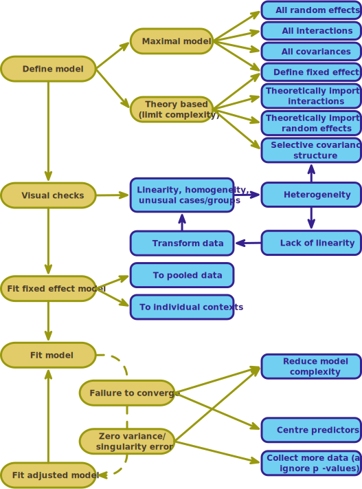

```{r, include=FALSE}


library(easystats)
library(tidyverse)
#non tidyverse
library(DT)
library(glmmTMB)

here::here("helpers/discovr_helpers.R") |> source()
here::here("helpers/easystats_helpers.R") |> source()

cosmetic_tib <- discovr::cosmetic
rirs_tib <- readr::read_csv("data/random_int_slope_2022.csv")
cosmetic_tib <- discovr::cosmetic |> 
  mutate(months = days*12/365)
```


## Learning outcomes

::: incremental

-   Understand what hierarchical data are
    -   Why we can't use the OLS GLM
-   Understand fixed and random coefficients
-   Understand how to build models
-   Be able to conduct and interpret models of hierarchical data

:::

::: notes
Use C to toggle pen/markup
Use backspace to delete markup
Use f to toggle fullscreen
:::


## 

::: r-stack
{.fragment fig-align="center" width="1050" height="594"}

{.fragment fig-align="center" width="1050" height="594"}
:::


## A surgical example

:::: {.callout-tip icon="false"}
## Research Questions

::: nonincremental
-   Is quality of life after cosmetic surgery predicted by the length of time since surgery?
-   Does this relationship depend on the reason for the surgery?
:::
::::

::: fragment
-   `id`: the participant's participant code
-   `post_qol`: This is the outcome variable and it measures quality of life after cosmetic surgery.
-   `base_qol`: We need to adjust our outcome for quality of life before the surgery.
-   `days`: The number of days after surgery that post-surgery quality of life was measured.
-   `clinic`: This variable specifies which of 21 clinics the person attended to have their surgery.
-   `reason`: This variable specifies whether the person had surgery purely to change their appearance or because of a physical reason.
:::

## The surgery data hierarchy

{.absoliute height="550" fig-align="center"}

## Fixed and random coefficients

::: fragment
-   Intercepts and slopes can be fixed or random
    -   In OLS regression they are fixed
:::

::: fragment
-   Fixed coefficients
    -   Intercepts/slopes are assumed to be the same across different contexts (in this case clinics)
:::

::: fragment
-   Random coefficients
    -   Intercepts/slopes are allowed to vary across different contexts (in this case clinics)
:::

## 

```{r}
ggplot2::ggplot(rirs_tib, aes(days, post_qol, colour = clinic, fill = clinic)) +
  discovr::scale_color_senjutsu() +
  discovr::scale_fill_senjutsu() +
  scale_x_continuous(breaks = seq(0, 400, 50)) +
  scale_y_continuous(breaks = seq(0, 100, 10)) +
  coord_cartesian(xlim = c(0, 400), ylim = c(0, 100)) + 
  facet_wrap(~model) +
  labs(x = "Days since surgery", y = "Quality of life (%)", colour = "Clinic", fill = "Clinic") +
  geom_point(alpha = 0.5, size = 1) +
  geom_smooth(method = "lm", se = F, fullrange = T, aes(group = "identity"), colour = mulberry, size = 1) +
  geom_smooth(method = "lm", alpha = 0.3, size = 0.75, se = FALSE, linetype = 5) +
  theme_minimal() +
  theme(legend.position = "none")
```


## (Potential) Benefits of MLMs

::: fragment
-   Modelling variability in effects across contexts
    -   Model the variability in intercepts
    -   Model the variability in slopes
:::

::: fragment
-   Model violations of the assumption of spherical errors
    -   Model differences in the variability of errors
    -   Model relationships between errors
        -   (Linear model for repeated observations -- next two weeks!)
:::

::: fragment
-   Missing data
    -   MLMs (in general) cope with missing data
:::

## Model assumptions

::: fragment
-   MLMs use maximum likelihood estimation not OLS
:::

::: fragment
-   Familiar assumptions
    -   Linearity and additivity
    -   Level 1 errors are normally distributed with mean of zero and constant variance (i.e. homoscedasticity)
    -   Independent errors (but we can model dependency)
:::

::: fragment
-   New assumptions
    -   Random effects (slopes and intercepts) are assumed to be normally distributed with mean of zero and constant variance (i.e. homoscedasticity)
:::


## Practical issues

### Computing *p*-values

-   There is no unifying method to compute *p*-values in multilevel models because the degrees of freedom of the test statistic are rarely known.
-   df can be approximated (e.g., Satterthwaite and Kenward-Roger methods) but it's unclear how good these approximations are for complex models/complex covariance structures.

## Practical issues

### Should effects be fixed or random?

::: fragment
-   Three approaches
    -   Theory-driven
    -   Maximal model (Barr et al., 2013)
    -   Data-driven (include random effects that improve fit)
:::

::: fragment
-   Treat a predictor as a random effect if ... (Bolker, 2015)
    -   You're **not** interested in differences between the levels.
    -   You're interested in quantifying the variability across levels of the variable.
    -   You're interested in generalizing beyond the observed levels of the contextual variable.
    -   You have an unbalanced design.
    -   You have a categorical predictor that is not direct relevant to the hypothesis but for which you need to adjust (a nuisance variable).
:::


## 

{fig-align="center" height="600"}

## The model we will fit

::::: fragment
:::: {.callout-important icon="false"}
## Composite form

::: txt_l
$$
\begin{aligned}
\text{QoL}_{ij} &= [\beta_0  + \beta_1\text{Days}_{ij} + \beta_2\text{Pre QoL}_{ij} + \beta_3\text{Reason}_{ij} +  \beta_4\text{Days} \times \text{Reason}_{ij}] \\
&\quad + [u_{0j} + u_{1j}\text{Days}_{ij}+ \varepsilon_{ij}]
\end{aligned}
$$
:::
::::
:::::

::::: fragment
:::: {.callout-important icon="false"}
## Separate equations

::: txt_l
$$
\begin{aligned}
\text{QoL}_{ij} &= \beta_{0j}  + \beta_{1j}\text{Days}_{ij} + \beta_2\text{Pre QoL}_{ij} + \beta_3\text{Reason}_{ij} +  \beta_4\text{Days} \times \text{Reason}_{ij} + \varepsilon_{ij}\\
\beta_{0j} &= \beta_{0} + u_{0j} \\
\beta_{1j} &= \beta_{1} + u_{1j}
\end{aligned}
$$
:::
::::
:::::


##

{fig-align="center" height=600}

## [L]{.txt_ong}oad and [L]{.txt_ong}ook

```{r}
cosmetic_tib |> 
  dplyr::select(-c(bdi, months)) |> 
  DT::datatable()
```

{.absolute top=0 left=600 height="80"}


## [L]{.txt_ong}oad and [L]{.txt_ong}ook

```{r}
#| echo: true

cosmetic_tib |> 
  describe_distribution(select = c(post_qol, base_qol, days)) |> 
  display()
```


{.absolute top=0 left=800 height="80"}

## [L]{.txt_ong}oad and [L]{.txt_ong}ook

::: panel-tabset
### `post_qol`


```{r}
#| eval: false
#| echo: true

cosmetic_tib |> 
  dplyr::group_by(clinic) |> 
  describe_distribution(select = "post_qol") |> 
  display()
```

```{r}
cosmetic_tib |> 
  dplyr::group_by(clinic) |> 
  describe_distribution(select = "post_qol") |> 
  data_remove(c("Variable", "n_Missing")) |> 
  DT::datatable(options = list(pageLength = 5)) |> 
  formatRound(c('Mean', 'SD', 'Skewness', 'Kurtosis'), digits = 2)
```

### `base_qol`


```{r}
#| eval: false
#| echo: true

cosmetic_tib |> 
  dplyr::group_by(clinic) |> 
  describe_distribution(select = "base_qol") |> 
  display()
```

```{r}
cosmetic_tib |> 
  dplyr::group_by(clinic) |> 
  describe_distribution(select = "base_qol") |> 
  data_remove(c("Variable", "n_Missing")) |> 
  DT::datatable(options = list(pageLength = 5)) |> 
  formatRound(c('Mean', 'SD', 'Skewness', 'Kurtosis'), digits = 2)
```

### `days`


```{r}
#| eval: false
#| echo: true

cosmetic_tib |> 
  dplyr::group_by(clinic) |> 
  describe_distribution(select = "days") |> 
  display()
```

```{r}
cosmetic_tib |> 
  dplyr::group_by(clinic) |> 
  describe_distribution(select = "days") |> 
  data_remove(c("Variable", "n_Missing")) |> 
  DT::datatable(options = list(pageLength = 5)) |> 
  formatRound(c('Mean', 'SD', 'Skewness', 'Kurtosis'))
```

:::


## [V]{.txt_ong}isualize


```{r}
#| echo: false
#| fig-width: 10
#| fig-height: 6

ggplot(cosmetic_tib, aes(days, post_qol)) +
  geom_point(position = position_jitter(width = 0.1, height = NULL), alpha = 0.5, size = 1, colour = "#999933") +
  geom_smooth(method = "lm", se = FALSE, linewidth = 0.75, colour = "#CC6677") +
  coord_cartesian(xlim = c(0, 400), ylim = c(0, 100)) +
  scale_y_continuous(breaks = seq(0, 100, 10)) +
  labs(x = "Days post surgery", y = "Quality of life after surgery (%)", colour = "Clinic") +
  facet_wrap(~ clinic, ncol = 7) +
  theme_minimal()

```

{.absolute top=0 left=800 height="80"}

## Rescaling predictors


::: {.callout-note icon = false}
##  Statis-tip

Within our model we have three predictors measured on very different scales:

-	`days`: the days since surgery ranges from 0 to around 400
-	`reason`: the reason for surgery ranges from 0 (change appearance) to 1 (physical reason)
-	`base_qol`: baseline quality of life is measured on a scale ranging from 0 to 100.

The associated variances will be really different, which can create problems with model convergence.

:::

::: fragment

### Convert `days`

- 1 year = 365 days (range 0 to 1.1)
- 1 month ≈ 30 days (range 0 to 13)

:::

::: fragment
::: center-h
::: txt_mulberry
$$
\text{months} \approx \frac{12}{365}\times \text{days}
$$
:::
:::
:::

::: fragment
::: center-h
::: txt_mulberry
$$
\begin{aligned}
\text{QoL}_{ij} &= [\beta_0  + \beta_1\text{Months}_{ij} + \beta_2\text{Pre QoL}_{ij} + \beta_3\text{Reason}_{ij} +  \beta_4\text{Months} \times \text{Reason}_{ij}] \\
&\quad + [u_{0j} + u_{1j}\text{Months}_{ij}+ \varepsilon_{ij}]
\end{aligned}
$$
:::
:::
:::


::: notes
The range of days is about 10 times that of base_qol and about 400 times that of reason, and this will mean that the associated variances will also be really different, which can create problems with model convergence. For example, if you try to fit the model in this chapter using lme4, it will fail to converge using days as a predictor. It’s better to pre-empt these potential issues, so let’s think about how we can make our predictor’s variances better balanced. The variables at the two extremes are days and reason. We can’t change the response scale for reason because it is categorical, but because days is a unit of time we can express it in different units. 
:::


## Fitting a fixed-effect model on the pooled data

::: r-fit-text
```{r}
#| echo: true
#| eval: false

pooled_lm <- lm(post_qol ~ months*reason + base_qol, data = cosmetic_tib)
model_parameters(pooled_lm) |> 
  display()
```
:::

```{r}
#| tbl-cap: Parameter estimates for the pooled data model

pooled_lm <- lm(post_qol ~ months*reason + base_qol, data = cosmetic_tib)
model_parameters(pooled_lm) |> 
  display()
```

## Fitting fixed-effect models within clinics

:::: panel-tabset
### Code

::: r-fit-text
```{r}
#| echo: true
#| code-line-numbers: 1-2|3|4|5-7|8-9

clinic_lms <- cosmetic_tib |>
  arrange(clinic) |>
  group_by(clinic) |>
  nest() |>
  mutate(
    model = purrr::map(.x = data,
                       .f = \(clinic_tib) lm(post_qol ~ months*reason + base_qol, data = clinic_tib)),
    coefs = purrr::map(model, model_parameters)
    )

```
:::

### Parameter estimates

```{r}
#| echo: true
#| eval: false
models <- clinic_lms  |>
  select(-c(data, model)) |> 
  unnest(coefs)
display(models)
```

```{r}
models <- clinic_lms  |>
  dplyr::select(-c(data, model)) |> 
  tidyr::unnest(coefs) 

models |> 
  dplyr::select(-CI) |>
  mutate(p = format_p(p, name = NULL)) |> 
  DT::datatable(rownames = F, options = list(pageLength = 5)) |> 
  formatRound(3:8, digits = 2)
```

### Plot

```{r}
#| echo: true
#| fig-width: 10
#| fig-height: 4

ggplot(data = models, aes(Coefficient)) +
  geom_density(colour = "#AA4499", linewidth = 1) +
  facet_wrap(~Parameter , scales = "free") +
  theme_minimal()
```

::::


## Adding random effects to the model

### The model

::: center-h
::: txt_mulberry
$$
\begin{aligned}
\text{QoL}_{ij} &= [\beta_0  + \beta_1\text{Months}_{ij} + \beta_2\text{Pre QoL}_{ij} + \beta_3\text{Reason}_{ij} +  \beta_4\text{Months} \times \text{Reason}_{ij}] \\
&\quad + [u_{0j} + u_{1j}\text{Months}_{ij}+ \varepsilon_{ij}]
\end{aligned}
$$
:::
:::

:::: panel-tabset
### The long way

::: txt_xl
```{r}
#| echo: true
#| code-line-numbers: 1-2|3-4|5-6|7-8|9-10|11-12

# random intercept only
intcpt_mlm <- glmmTMB(post_qol ~ 1 + (1|clinic), data = cosmetic_tib)
# add fixed effect of months
months_mlm <- glmmTMB(post_qol ~ months + (1|clinic), data = cosmetic_tib)
# add random effect of months
monthsre_mlm <- glmmTMB(post_qol ~ months + (months|clinic), data = cosmetic_tib)
# add fixed effect of reason 
reason_mlm <- glmmTMB(post_qol ~ months + reason + (months|clinic), data = cosmetic_tib)
# add baseline QoL
qol_mlm <- glmmTMB(post_qol ~ months + reason + base_qol + (months|clinic), data = cosmetic_tib)
# add the interaction
cosmetic_mlm <- glmmTMB(post_qol ~ months + reason + base_qol + months:reason + (months|clinic), data = cosmetic_tib)
```
:::

### using `update()`

::: txt_xl
```{r}
#| echo: true
#| eval: false
#| code-line-numbers: 1-2|3-4|5-6|7-8|9-10|11-12

# random intercept only
intcpt_mlm <- glmmTMB::glmmTMB(post_qol ~ 1 + (1|clinic), data = cosmetic_tib)
# add fixed effect of months
months_mlm <- update(intcpt_mlm, .~. + months)
# add random effect of months
monthsre_mlm <- update(months_mlm, .~  months + (months|clinic))
# add fixed effect of reason 
reason_mlm <- update(monthsre_mlm, .~.  + reason)
# add baseline QoL
qol_mlm <- update(reason_mlm, .~.  + base_qol)
# add the interaction
cosmetic_mlm <- update(qol_mlm, .~.  + months:reason)
```
:::

::::

## {background-video="../shared_media/video/milton_meditation_butthole.mp4" background-size="cover"}


## [E]{.txt_ong}valuate fit

```{r}
#| echo: true

test_lrt(intcpt_mlm, months_mlm, monthsre_mlm, reason_mlm, qol_mlm, cosmetic_mlm) |> 
  display()
```


```{r}
cosmetic_wald <- test_lrt(intcpt_mlm, months_mlm, monthsre_mlm, reason_mlm, qol_mlm, cosmetic_mlm)
```


:::{.callout-important icon=false}
##  Report`r rproj()`

Adding months to the intercept only model significantly improved the fit, `r report_lrt(cosmetic_wald, row = 2)`, adding the variability in slopes (and its covariance with intercepts) significantly improved the fit, `r report_lrt(cosmetic_wald, row = 3)`, adding reason did not significantly improve the fit, `r report_lrt(cosmetic_wald, row = 4)`, but adding baseline quality of life, `r report_lrt(cosmetic_wald, row = 5)`, and the interaction of months and reason did, `r report_lrt(cosmetic_wald, row = 6)`.

:::


{.absolute top=0 left=800 height="80"}


## [E]{.txt_ong}valuate fit

```{r}
#| echo: true

model_performance(cosmetic_mlm) |> 
  display()
```

```{r}
cosmetic_fit <- model_performance(cosmetic_mlm)
```


:::{.callout-important icon=false}
##  Report`r rproj()`

Around `r percent_from_ez(cosmetic_fit, value = "ICC")` of the variance in post treatment quality of life was attributable to the clinic at which surgery was conducted. The model explained `r percent_from_ez(cosmetic_fit, value = "R2_conditional")` of the variance in post treatment quality of life, and around `r percent_from_ez(cosmetic_fit, value = "R2_marginal")` was attributable to only the fixed effects.
:::


{.absolute top=0 left=800 height="80"}

::: notes
The intraclass correlation, ICC, is very large indicating that 0.68 (or 68%) of the variance in post treatment quality of life is attributable to the clinic at which surgery was conducted. In short, the clinic had a massive effect on post-surgery quality of life. The conditional 𝑅2
 tells us the proportion of variance attributable to both the fixed and random effects (0.71or 71%) whereas the marginal 𝑅2
 tells us the proportion of variance attributable to only the fixed effects (0.09 or 9%). The ICC strongly indicates that including clinic as a contextual variable was worthwhile.
:::


## [E]{.txt_mulberry}valuate assumptions

::: center-h
```{r}
#| echo: true
#| fig-width: 7
#| fig-height: 6

check_model(cosmetic_mlm)
```
:::

## [I]{.txt_ong}nterpret random effects

```{r}
#| echo: true

model_parameters(cosmetic_mlm, effects = "random") |> 
  display()
```


```{r}
mlm_par <- model_parameters(cosmetic_mlm)
```


:::{.callout-important icon=false}
##  Report`r rproj()`

There was non-zero variability in intercepts and slopes. The estimate of standard deviation of intercepts across clinics was  $\hat{\sigma}_{u_0}$ = `r value_from_ez(mlm_par, row = 6)`, the standard deviation of slopes across clinics was $\hat{\sigma}_{u_\text{months}}$ = `r value_from_ez(mlm_par, row = 7)`, and the residual standard deviation was $\sigma$ = `r value_from_ez(mlm_par, row = 9)`. The estimated correlation between slopes and intercepts was $r_{u_0, u_\text{months}}$ = `r value_from_ez(mlm_par, row = 8)` suggesting that clinics with large intercepts tended to have smaller slopes.
:::

{.absolute top=0 left=900 height="80"}

## [I]{.txt_ong}nterpret fixed effects

```{r}
#| echo: true

model_parameters(cosmetic_mlm, effects = "fixed") |> 
  display()
```


:::{.callout-important icon=false}
##  Report`r rproj()`

The overall effect of time on quality of life was small and non-significant,`r report_pe(mlm_par, row = 2, symbol = "$\\hat{\\beta}$")`.  The effect of the reason for surgery was also small and non-significant, `r report_pe(mlm_par, row = 3, symbol = "$\\hat{\\beta}$")`. The effect of baseline quality of life on post-surgery quality of life was more substantial and significant, `r report_pe(mlm_par, row = 4, symbol = "$\\hat{\\beta}$")`. The combined effect of months and reason on post-surgery quality of life was significant,  `r report_pe(mlm_par, row = 5, symbol = "$\\hat{\\beta}$")`. The parameter estimate suggests that the rate of change over time of quality of life is `r value_from_ez(mlm_par, row = 5)` bigger in those having surgery for physical reasons than in those having it for cosmetic reasons.

:::

{.absolute top=0 left=900 height="80"}

::: notes
reason: To put this effect in context, with other variables held constant the difference in quality of life in those seeking treatment for cosmetic reasons rather than physical treasons was 1.79 lower (on the 100-point scale) i.e. very small.
base_qol: This effect suggests that with other variables held constant, for every unit increase in baseline quality of life there is a half unit increase in post-surgery quality of life, which is a fairly strong relationship (because both are measured on the same scale)
:::


## [I]{.txt_ong}nterpret simple slopes

```{r}
#| echo: true
#| eval: false

cosmetic_slopes <- estimate_slopes(cosmetic_mlm,
                                   trend = "months",
                                   by = "reason",
                                   ci = 0.95)
display(cosmetic_slopes)
```


```{r}
mlm_slopes <- estimate_slopes(cosmetic_mlm,
                                   trend = "months",
                                   by = "reason",
                                   ci = 0.95)

display(mlm_slopes, footer = "")
```


:::{.callout-important icon=false}
##  Report`r rproj()`

Simple slopes analysis revealed that for those who had surgery to change their appearance, quality of life increased over time but not significantly so, `r  report_ss(mlm_slopes, row = 1, symbol = "$\\hat{\\beta}$")`. In contrast, for those who had surgery to help with a physical problem, their quality of life significantly increased over time, `r  report_ss(mlm_slopes, row = 2, symbol = "$\\hat{\\beta}$")`. The change in quality of life for people who had surgery for a physical reason is about double that of people who had it for a cosmetic reason (over the same time period).

:::

{.absolute top=0 left=900 height="80"}


## [I]{.txt_ong}nterpret simple slopes

```{r}
#| echo: true
#| fig-height: 5
#| fig-width: 7

estimate_means(model = cosmetic_mlm, by = c("months", "reason")) |> 
  plot() +
  labs(x = " Months since surgery", y = "Quality of life post-surgery (0-100)", colour = "Reason for surgery", fill = "Reason for surgery") +
  theme_minimal()
```


{.absolute top=0 left=900 height="80"}


## Summary

-   Data can be hierarchical and this hierarchical structure can be important.
    -   The OLS linear model simply ignores the hierarchy.
-   Hierarchical models are just a fancy linear model in which you estimate the variability in the slopes and intercepts within contexts
-   i.e. slopes and intercepts can be random variables (allowed to vary) rather than fixed (assumed to be equal in different situations).
-   MLMs are a world of pain
