# Repeated measures designs

Andy Field, University of Sussex

Links: [bsky.app](https://bsky.app/profile/profandyfield.bsky.social) \| [youtube.com](https://www.youtube.com/user/ProfAndyField) \| [discoveringstatistics.com](https://www.discoveringstatistics.com) \| [discovr.rocks](https://www.discovr.rocks) \| [statisticsadventure.com](https://www.statisticsadventure.com)

## About this version

This is a plain-text version of the lecture slides. Each slide starts with a heading such as “Slide 5”, and the numbers match the slide numbers shown in the lecture. Content that appeared one piece at a time, in columns or in tabs is shown in reading order. Videos and interactive apps are given as links.

## Slide 2

Video clip: [space opening scene](https://profandyfield.github.io/statistics_lectures/shared_media/video/space_opening_scene.mp4)

## Slide 3

Video clip: [daze intro 01](https://profandyfield.github.io/statistics_lectures/shared_media/video/daze_intro_01.mp4)

## Slide 4

Video clip: [daze intro 02](https://profandyfield.github.io/statistics_lectures/shared_media/video/daze_intro_02.mp4)

## Slide 5

Video clip: [transmission 01](https://profandyfield.github.io/statistics_lectures/shared_media/video/transmission_01.mp4)

## Slide 6

Video clip: [daze intro 03](https://profandyfield.github.io/statistics_lectures/shared_media/video/daze_intro_03.mp4)

## Slide 7

Video clip: [daze intro 04](https://profandyfield.github.io/statistics_lectures/shared_media/video/daze_intro_04.mp4)

## Slide 8

Video clip: [space hippo](https://profandyfield.github.io/statistics_lectures/shared_media/video/space_hippo.mp4)

## Slide 9

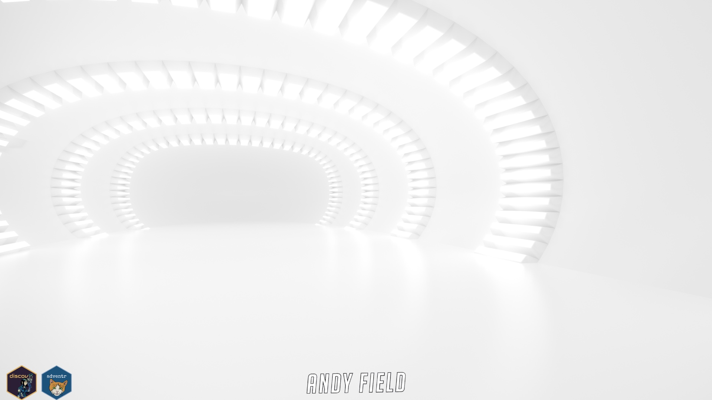

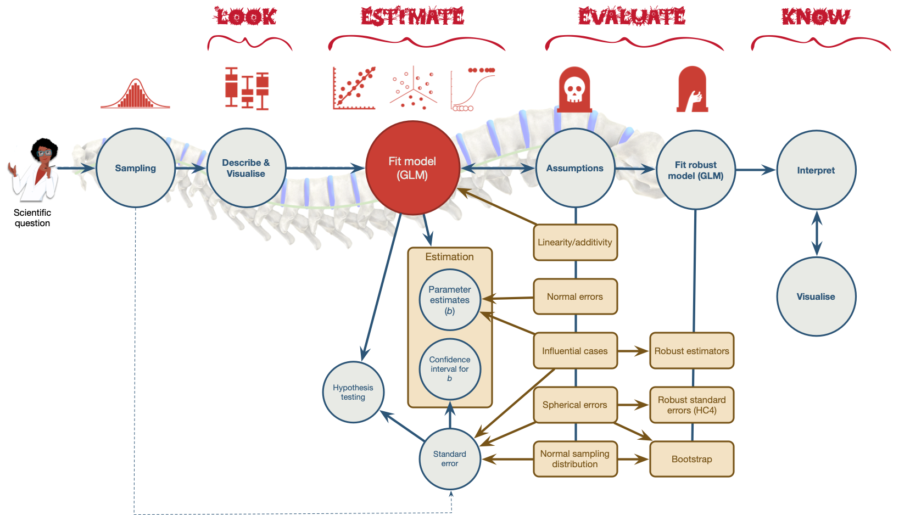


## Slide 10


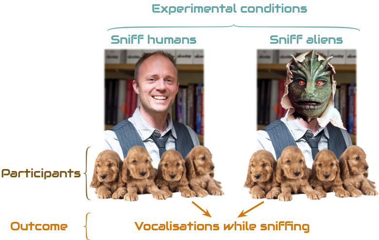

- **Systematic variance**: created by our manipulation
- **Unsystematic variance**: variance created by unknown factors

## Slide 11: Benefits of repeated measures designs


- Sensitivity
  - Unsystematic variance is reduced
  - More sensitive to experimental effects
- Economy
  - Less participants are needed
  - But, be careful of fatigue

## Slide 12: Can puppies sniff out aliens?


- Outcome = vocalizations during 1 min sniffing (`vocalizations`)
- Predictor: type of entity being sniffed (`entity`)
  - Alien (not in humanoid form)
  - Human (control for alien vs human)
  - Mannequin (control for humanoid form)
  - Shapeshifter (alien in humanoid form)
- `dog_name` indicates the name of the dog (*N* = 8)

> **Note: Statis-tip**
>
> This is a **one-way repeated measures design**.

## Slide 13: The data


|  | dog_name | Alien | Human | Mannequin | Shapeshifter | Mean | Variance |
|----|----|----|----|----|----|----|----|
|  | Milton | 8 | 7 | 1 | 6 | 5.50 | 7.25 |
|  | Woofy | 9 | 5 | 2 | 5 | 5.25 | 6.19 |
|  | Ramsey | 6 | 2 | 3 | 8 | 4.75 | 5.69 |
|  | Mr. Snifficus III | 5 | 3 | 1 | 9 | 4.50 | 8.75 |
|  | Willock | 8 | 4 | 5 | 8 | 6.25 | 3.19 |
|  | The Venerable Dr. Waggy | 7 | 5 | 6 | 7 | 6.25 | 0.69 |
|  | Lord Scenticle | 10 | 2 | 7 | 2 | 5.25 | 11.69 |
|  | Professor Nose | 12 | 6 | 8 | 1 | 6.75 | 15.69 |
| **Mean** | — | 8.12 | 4.25 | 4.12 | 5.75 | — | — |

## Slide 14: The data in R


|     | dog_name                | entity       | vocalizations |
|-----|-------------------------|--------------|---------------|
| 1   | Milton                  | Alien        | 8             |
| 2   | Milton                  | Human        | 7             |
| 3   | Milton                  | Mannequin    | 1             |
| 4   | Milton                  | Shapeshifter | 6             |
| 5   | Woofy                   | Alien        | 9             |
| 6   | Woofy                   | Human        | 5             |
| 7   | Woofy                   | Mannequin    | 2             |
| 8   | Woofy                   | Shapeshifter | 5             |
| 9   | Ramsey                  | Alien        | 6             |
| 10  | Ramsey                  | Human        | 2             |
| 11  | Ramsey                  | Mannequin    | 3             |
| 12  | Ramsey                  | Shapeshifter | 8             |
| 13  | Mr. Snifficus III       | Alien        | 5             |
| 14  | Mr. Snifficus III       | Human        | 3             |
| 15  | Mr. Snifficus III       | Mannequin    | 1             |
| 16  | Mr. Snifficus III       | Shapeshifter | 9             |
| 17  | Willock                 | Alien        | 8             |
| 18  | Willock                 | Human        | 4             |
| 19  | Willock                 | Mannequin    | 5             |
| 20  | Willock                 | Shapeshifter | 8             |
| 21  | The Venerable Dr. Waggy | Alien        | 7             |
| 22  | The Venerable Dr. Waggy | Human        | 5             |
| 23  | The Venerable Dr. Waggy | Mannequin    | 6             |
| 24  | The Venerable Dr. Waggy | Shapeshifter | 7             |
| 25  | Lord Scenticle          | Alien        | 10            |
| 26  | Lord Scenticle          | Human        | 2             |
| 27  | Lord Scenticle          | Mannequin    | 7             |
| 28  | Lord Scenticle          | Shapeshifter | 2             |
| 29  | Professor Nose          | Alien        | 12            |
| 30  | Professor Nose          | Human        | 6             |
| 31  | Professor Nose          | Mannequin    | 8             |
| 32  | Professor Nose          | Shapeshifter | 1             |

Table 2: Data for the sniffer dog example

## Slide 15: Repeated measures and the linear model


To keep things simple, imagine a design where dogs sniff only aliens or humans (e.g., two conditions)

``` math
 \begin{aligned} \text{vocalizations}_{i} & = b_{0} + b_{1}\text{entity}_{i} + \varepsilon_{i} \end{aligned} 
```

| Entity sniffed | Dummy variable (entity) |
|----------------|-------------------------|
| Alien          | 1                       |
| Human          | 0                       |

> **Warning: The danger zone!**
>
> Same participants in all conditions
>
> - Scores across conditions correlate
> - Violates the assumption of independent residuals (think back to the lecture on bias)

## Slide 16: Repeated measures: hierrachical data structure


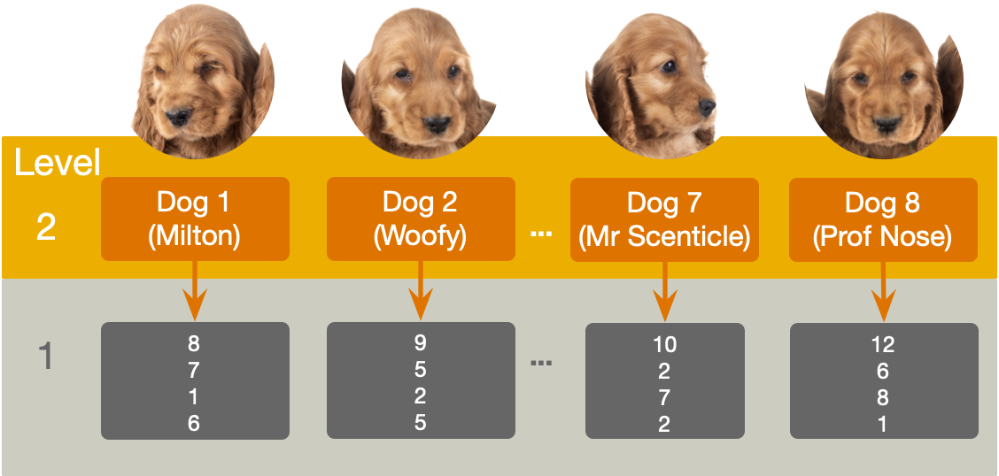

## Slide 17: Repeated measures and the linear model


Need to adjust the model to estimate this dependency

``` math
 \begin{aligned} \text{vocalizations}_{ij} & = (\beta_{0} + u_{0j}) + (\beta_{1} + u_{1j})\text{entity}_{ij}+ \varepsilon_{ij} \\ & = \left[\beta_{0} + \beta_{1}\text{entity}_{ij}\right]+ \left[u_{0j} + u_{1j}\text{entity}_{ij} + \varepsilon_{ij}\right]\\ \end{aligned} 
```

## Slide 18

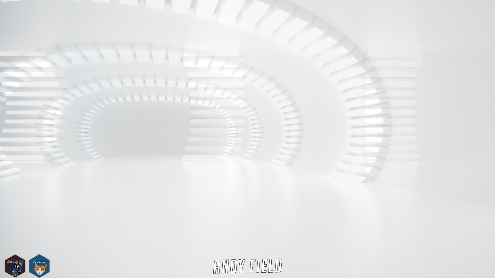

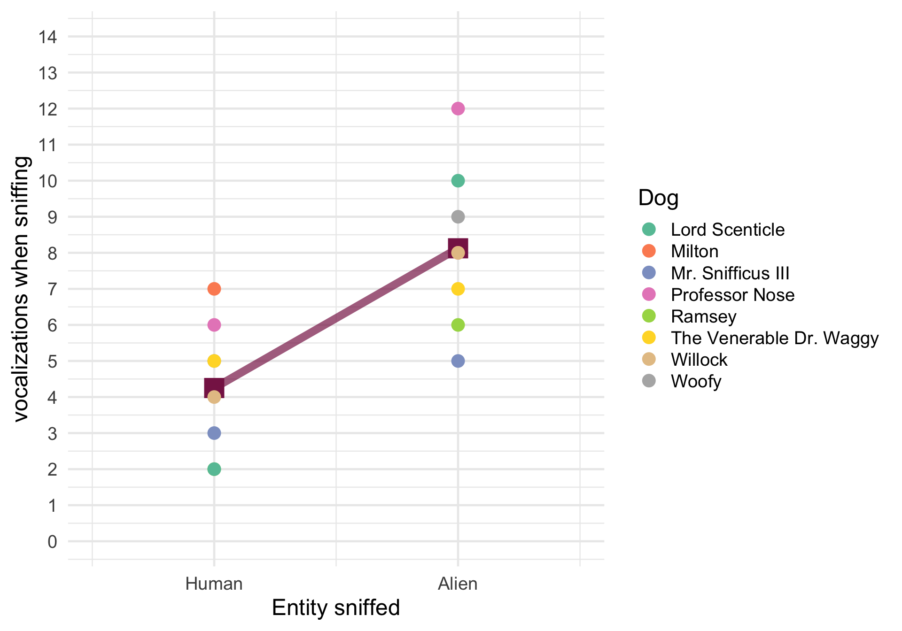

``` math
 \begin{aligned} \text{vocalizations}_{ij} & = (\beta_{0} + u_{0j})+ \beta_{1}\text{entity}_{ij}+ \varepsilon_{ij} \end{aligned} 
```

## Slide 19


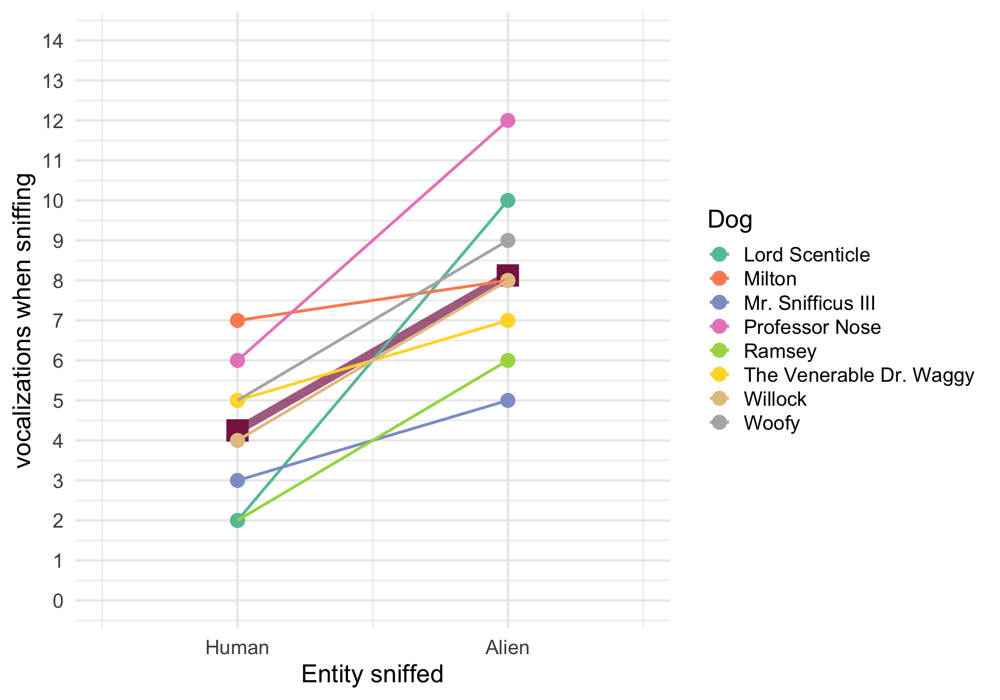

``` math
 \begin{aligned} \text{vocalizations}_{ij} & = (\beta_{0} + u_{0j}) + (\beta_{1} + u_{1j})\text{entity}_{ij}+ \varepsilon_{ij} \end{aligned} 
```

## Slide 20: Repeated measures and the linear model


Back to our actual design (with 4 conditions: Alien, Human, Mannequin, Shapeshifter)

- `entity` would be split into 3 dummy/contrast variables
- Let’s just use default dummy coding

| Entity sniffed | Dummy 1 (Alien vs. mannequin) | Dummy 2 (Shapeshifter vs. mannequin) | Dummy 3 (Human vs. mannequin) |
|----|----|----|----|
| Alien | 1 | 0 | 0 |
| Shapeshifter | 0 | 1 | 0 |
| Human | 0 | 0 | 1 |
| Mannequin | 0 | 0 | 0 |

## Slide 21


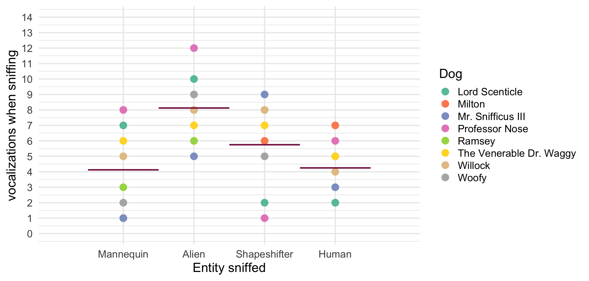

## Slide 22


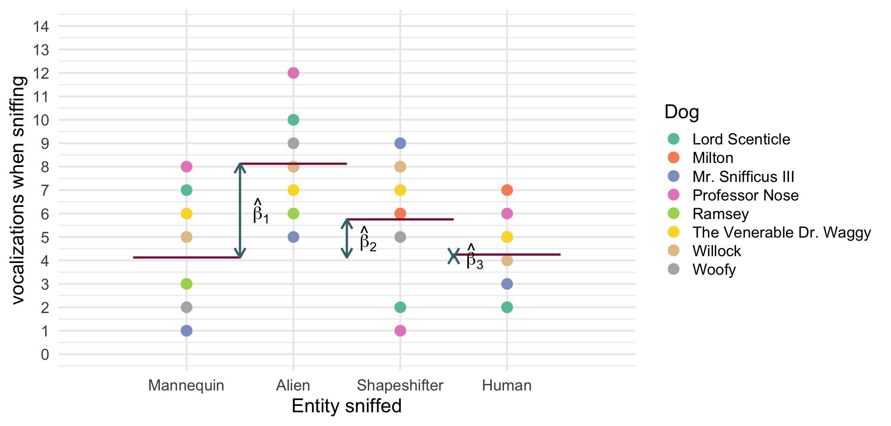

``` math
 \begin{aligned} \text{vocalizations}_{ij} & = \left[\beta_{0} + \beta_{1}\text{alien vs. manq}_{ij} + \beta_{2}\text{shape vs. manq}_{ij} + \beta_{3}\text{human vs. manq}_{ij}\right] \\ &\quad + \left[u_{0j} + \varepsilon_{ij}\right] \\ \end{aligned} 
```

## Slide 23


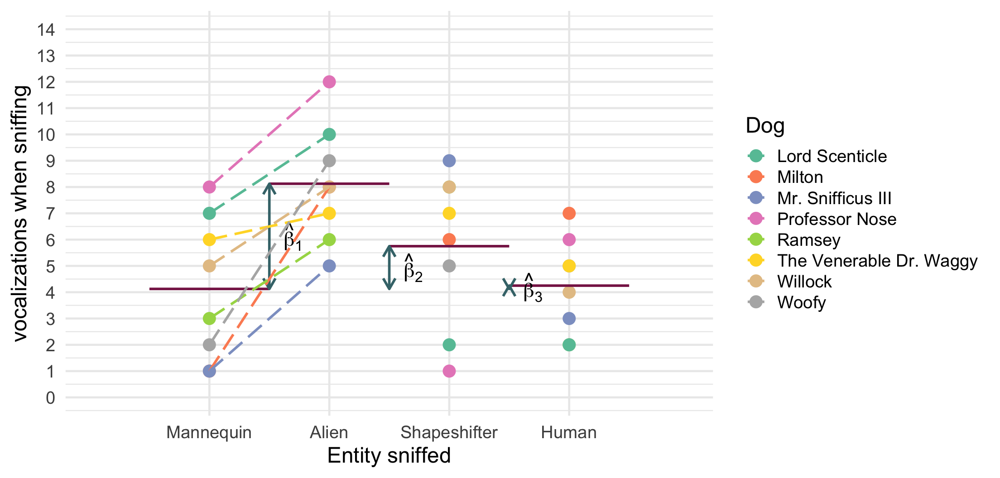

``` math
 \begin{aligned} \text{vocalizations}_{ij} & = \left[\beta_{0} + \beta_{1}\text{alien vs. manq}_{ij} + \beta_{2}\text{shape vs. manq}_{ij} + \beta_{3}\text{human vs. manq}_{ij}\right] \\ &\quad + \left[u_{0j} + u_{1j}\text{alien vs. manq}_{ij} + \varepsilon_{ij}\right] \\ \end{aligned} 
```

## Slide 24


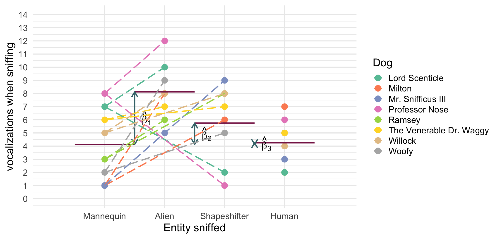

``` math
 \begin{aligned} \text{vocalizations}_{ij} & = \left[\beta_{0} + \beta_{1}\text{alien vs. manq}_{ij} + \beta_{2}\text{shape vs. manq}_{ij} + \beta_{3}\text{human vs. manq}_{ij}\right] \\ &\quad + \left[u_{0j} + u_{1j}\text{alien vs. manq}_{ij} + u_{2j}\text{shape vs. manq}_{ij} + \varepsilon_{ij}\right] \\ \end{aligned} 
```

## Slide 25


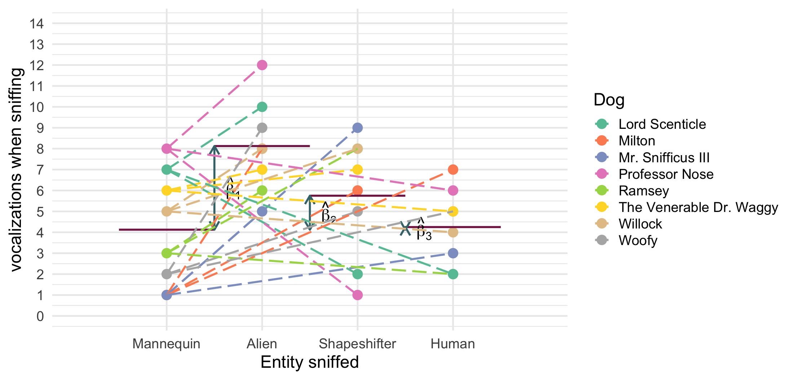

``` math
 \begin{aligned} \text{vocalizations}_{ij} & = \left[\beta_{0} + \beta_{1}\text{alien vs. manq}_{ij} + \beta_{2}\text{shape vs. manq}_{ij} + \beta_{3}\text{human vs. manq}_{ij}\right] \\ &\quad + \left[u_{0j} + u_{1j}\text{alien vs. manq}_{ij} + u_{2j}\text{shape vs. manq}_{ij} + u_{3j}\text{human vs. manq}_{ij} + \varepsilon_{ij}\right] \\ \end{aligned} 
```

## Slide 26: Approaches to repeated measures designs


### Historic: Repeated measures ANOVA (RM-ANOVA)

- Restricts the model in two (unrealistic) ways
  1.  Assumes effects are equivalent across participants (the effect in participant 1 is the same as in participant 2)
  2.  Errors have compound symmetry/sphericity

  - CS: The correlation between scores across conditions is the same
  - Sphericity: differences between scores in pairs of conditions have equal variances

### Multilevel modelling (MLM) approach

- Fewer restrictions: doesn’t require CS or sphericity
- Can include multiple hierarchical structures (e.g., observations within people, within clinics)
- In general, copes with missing values (RM-ANOVA doesn’t)
- Can be extended to categorical outcomes (RM-ANOVA cannot)
- Contrast coding is possible

## Slide 27: Fitting the model


- Use `glmmTMB::glmmTMB()`

  - A trickier but more flexible option
  - Manually set contrasts
  - Can get parameter estimates, diagnostic plots, and robust methods

- The `afex::aov_4()` function
  - Specify the repeated measures with `(rm_predictors|id_var)`
  - Automatically sets contrasts
  - Built in interaction plot with `afex_plot()`
  - But … no parameter estimates, limited diagnostic plots, or robust methods
  - See alternative tutorial

## Slide 28


## Slide 29: Load and Look


``` r
sniff_tib |> 
  group_by(entity) |> 
  describe_distribution(select = "vocalizations") |> 
  data_remove(c("Variable", "n_Missing")) |> # optional to remove redundant column
  display()
```

| entity       | Mean | SD   | IQR  | Range         | Skewness | Kurtosis | n   |
|--------------|------|------|------|---------------|----------|----------|-----|
| Alien        | 8.12 | 2.23 | 3.50 | (5.00, 12.00) | 0.41     | 0.01     | 8   |
| Human        | 4.25 | 1.83 | 3.50 | (2.00, 7.00)  | 0.07     | -1.22    | 8   |
| Mannequin    | 4.12 | 2.75 | 5.50 | (1.00, 8.00)  | 0.16     | -1.78    | 8   |
| Shapeshifter | 5.75 | 2.92 | 5.25 | (1.00, 9.00)  | -0.78    | -0.76    | 8   |


## Slide 30: Visualize


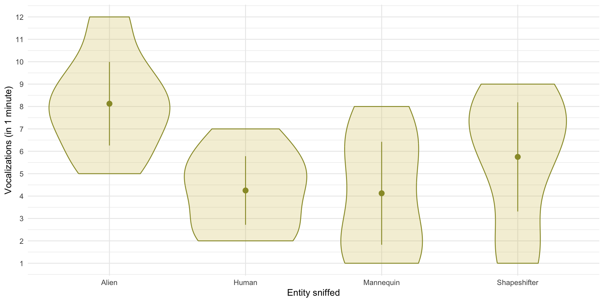


## Slide 31: Fit the model: Contrasts


If the dog training has been successful then we’d expect sniffer dogs to make more vocalizations when sniffing alien entities than non alien-entities.

- **Contrast 1**: {alien, shapeshifter} vs. {human, mannequin}

We have two ‘chunks’ in contrast 1 that would then need to be decomposed:

- **Contrast 2**: {alien} vs. {shapeshifter}
- **Contrast 3**: {human} vs. {mannequin}

Using the rules for contrast coding we’d get the codes in Table 4:

| Group        | Contrast 1 | Contrast 2 | Contrast 3 |
|--------------|------------|------------|------------|
| Alien        | 1/2        | 1/2        | 0          |
| Human        | -1/2       | 0          | 1/2        |
| Mannequin    | -1/2       | 0          | -1/2       |
| Shapeshifter | 1/2        | -1/2       | 0          |

Table 4: Contrast coding for the entity variable

## Slide 32: Fitting the model


``` r
aliens_vs_non = c(1/2, -1/2, -1/2, 1/2)
alien_vs_shape = c(1/2, 0, 0, -1/2)
human_vs_manquin = c(0, 1/2, -1/2, 0)

contrasts(sniff_tib$entity) <- cbind(aliens_vs_non,
                                     alien_vs_shape,
                                     human_vs_manquin)

sniff_mlm <- glmmTMB::glmmTMB(vocalizations ~ entity + (1|dog_name),
                              data = sniff_tib)
```

## Slide 33: Evaluate the model


``` r
test_lrt(sniff_mlm) |> 
  display()
```

| Name       | df  | df_diff | Chi2  | p     |
|------------|-----|---------|-------|-------|
| Null model | 3   |         |       |       |
| Full model | 6   | 3       | 12.69 | 0.005 |

Likelihood-Ratio-Test (LRT) for Model Comparison

> **Important: ReportR**
>
> The entity sniffed had a significant effect on the number of vocalizations by sniffer dogs, $`\chi^2`$(3) = 12.69, *p* = 0.005.


## Slide 34: Evaluate the model


``` r
model_performance(sniff_mlm) |> 
  display()
```

    Random effect variances not available. Returned R2 does not account for random effects.

| AIC   | AICc  | BIC   | R2 (cond.) | R2 (marg.) | RMSE | Sigma |
|-------|-------|-------|------------|------------|------|-------|
| 156.4 | 159.8 | 165.2 |            | 0.33       | 2.31 | 2.31  |


## Slide 35: Evaluate assumptions


``` r
check_model(sniff_mlm)
```

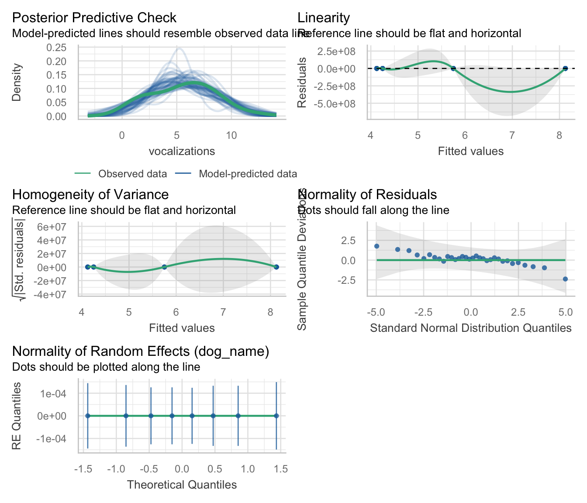

## Slide 36: Interpret parameter estimates, CIs and tests


``` r
model_parameters(sniff_mlm, effects = "fixed") |> 
  display()
```

| Parameter              | Coefficient | SE   | 95% CI        | z     | p       |
|------------------------|-------------|------|---------------|-------|---------|
| (Intercept)            | 5.56        | 0.41 | (4.76, 6.36)  | 13.62 | \< .001 |
| entityaliens vs non    | 2.75        | 0.82 | (1.15, 4.35)  | 3.37  | \< .001 |
| entityalien vs shape   | 2.38        | 1.15 | (0.11, 4.64)  | 2.06  | 0.040   |
| entityhuman vs manquin | 0.12        | 1.15 | (-2.14, 2.39) | 0.11  | 0.914   |

Fixed Effects

> **Important: ReportR**
>
> Contrasts revealed that vocalizations were significantly higher when sniffing aliens compared to non-aliens, $`\hat{b}`$ = 2.75 (1.15, 4.35), *z* = 3.37, *p* \< 0.001), and when sniffing an alien compared to a shapeshifter, $`\hat{b}`$ = 2.38 (0.11, 4.64), *z* = 2.06, *p* = 0.040 but not when sniffing a human compared to a mannequin, $`\hat{b}`$ = 0.12 (-2.14, 2.39), *z* = 0.11, *p* = 0.914).


## Slide 37

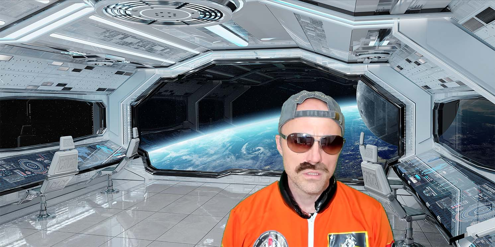

Audio clip: [spaceship interior](https://profandyfield.github.io/statistics_lectures/shared_media/audio/spaceship_interior.mp3)

## Slide 38

Video clip: [daze middle 01](https://profandyfield.github.io/statistics_lectures/shared_media/video/daze_middle_01.mp4)

## Slide 39

Video clip: [transmission 02 lme](https://profandyfield.github.io/statistics_lectures/shared_media/video/transmission_02_lme.mp4)

## Slide 40

Video clip: [daze middle 02](https://profandyfield.github.io/statistics_lectures/shared_media/video/daze_middle_02.mp4)

## Slide 41 (new section): Scenting a victory … factorial repeated measures designs


## Slide 42: Can scents distract the sniffer dogs?


- 50 sniffer dogs
  - Participated in all conditions
  - Sniffed 9 different ‘things’
- Predictor: `entity`
  - **Human**: the dog sniffs a human
  - **Shapeshifter** the dog sniffs an alien in humanoid form
  - **Alien** the dog sniffs an alien in lizard form
- Predictor: `scent_mask`
  - The entity had no masking scent (**none**)
  - The entity was smeared with **human** pheromones
  - The entity was smeared with **fox** pheromones
- Outcome: The number of `vocalizations` during each 1 minute sniff


> **Note: Statis-tip**
>
> This is a **two-way repeated measures design**.

## Slide 43: The model


- Let’s simplify things by ignoring the fact that `entity` and `scent_mask` will be represented by two dummy variables each (and the interaction by 4!)
- We can model individual differences in all parameters

``` math
 \begin{aligned} \text{vocalizations}_{ij} &= \left[\beta_{0} + \beta_{1}\text{entity}_{ij} + \beta_{2}\text{scent}_{ij} + \beta_{3}(\text{entity}_{ij}\times\text{scent}_{ij})\right] + \\ &\quad \left[u_{0j} + u_{1j}\text{entity}_{ij} + u_{2j}\text{scent}_{ij} + u_{3j}(\text{entity}_{ij}\times\text{scent}_{ij}) + \varepsilon_{ij}\right]\\ \end{aligned} 
```

- This model will be too complex to fit
- The simplest version of the repeated measures model instead treats the effects of predictor variables as fixed, but acknowledges that dogs, overall, will vary in their vocalizations:

``` math
 \begin{aligned} \text{vocalizations}_{ij} & = \left[\beta_{0} + \beta_{1}\text{entity}_{ij} + \beta_{2}\text{scent}_{ij} + \beta_{3}(\text{entity}_{ij}\times\text{scent}_{ij})\right] +\\ &\quad \left[u_{0j} + \varepsilon_{ij}\right]\\ u_{0j} &\sim N(0, \sigma^{2}_{\mu_0}) \end{aligned} 
```

## Slide 44: Load and Look


|     | dog_id | entity       | scent_mask | vocalizations |
|-----|--------|--------------|------------|---------------|
| 1   | 56f9p  | Alien        | Fox        | 7             |
| 2   | 56f9p  | Alien        | Human      | 9             |
| 3   | 56f9p  | Alien        | None       | 8             |
| 4   | 56f9p  | Shapeshifter | Fox        | 11            |
| 5   | 56f9p  | Shapeshifter | Human      | 6             |
| 6   | 56f9p  | Shapeshifter | None       | 8             |
| 7   | 56f9p  | Human        | Fox        | 3             |
| 8   | 56f9p  | Human        | Human      | 3             |
| 9   | 56f9p  | Human        | None       | 3             |
| 10  | 2m89y  | Alien        | Fox        | 8             |
| 11  | 2m89y  | Alien        | Human      | 8             |
| 12  | 2m89y  | Alien        | None       | 10            |
| 13  | 2m89y  | Shapeshifter | Fox        | 10            |
| 14  | 2m89y  | Shapeshifter | Human      | 7             |
| 15  | 2m89y  | Shapeshifter | None       | 10            |
| 16  | 2m89y  | Human        | Fox        | 6             |
| 17  | 2m89y  | Human        | Human      | 4             |
| 18  | 2m89y  | Human        | None       | 3             |
| 19  | 682h3  | Alien        | Fox        | 13            |
| 20  | 682h3  | Alien        | Human      | 5             |
| 21  | 682h3  | Alien        | None       | 5             |
| 22  | 682h3  | Shapeshifter | Fox        | 4             |
| 23  | 682h3  | Shapeshifter | Human      | 4             |
| 24  | 682h3  | Shapeshifter | None       | 7             |
| 25  | 682h3  | Human        | Fox        | 8             |
| 26  | 682h3  | Human        | Human      | 2             |
| 27  | 682h3  | Human        | None       | 2             |
| 28  | 7o1d2  | Alien        | Fox        | 7             |
| 29  | 7o1d2  | Alien        | Human      | 10            |
| 30  | 7o1d2  | Alien        | None       | 12            |
| 31  | 7o1d2  | Shapeshifter | Fox        | 9             |
| 32  | 7o1d2  | Shapeshifter | Human      | 6             |
| 33  | 7o1d2  | Shapeshifter | None       | 12            |
| 34  | 7o1d2  | Human        | Fox        | 8             |
| 35  | 7o1d2  | Human        | Human      | 2             |
| 36  | 7o1d2  | Human        | None       | 2             |
| 37  | 2k3vo  | Alien        | Fox        | 11            |
| 38  | 2k3vo  | Alien        | Human      | 9             |
| 39  | 2k3vo  | Alien        | None       | 11            |
| 40  | 2k3vo  | Shapeshifter | Fox        | 10            |
| 41  | 2k3vo  | Shapeshifter | Human      | 9             |
| 42  | 2k3vo  | Shapeshifter | None       | 7             |
| 43  | 2k3vo  | Human        | Fox        | 7             |
| 44  | 2k3vo  | Human        | Human      | 5             |
| 45  | 2k3vo  | Human        | None       | 2             |
| 46  | ik011  | Alien        | Fox        | 6             |
| 47  | ik011  | Alien        | Human      | 9             |
| 48  | ik011  | Alien        | None       | 11            |
| 49  | ik011  | Shapeshifter | Fox        | 8             |
| 50  | ik011  | Shapeshifter | Human      | 9             |

Table 7: Data for the scent masking example (first 50 of 450 rows)

## Slide 45: Load and Look


``` r
scent_tib |> 
  group_by(entity, scent_mask) |> 
  describe_distribution(select = "vocalizations")  |> 
  data_remove(c("Variable", "n_Missing")) |> # optional to remove redundant column
  display()
```

| entity       | scent_mask | Mean  | SD   | IQR  | Range         | Skewness | Kurtosis | n   |
|--------------|------------|-------|------|------|---------------|----------|----------|-----|
| Human        | None       | 2.98  | 1.08 | 2.00 | (1.00, 6.00)  | 0.45     | 0.27     | 50  |
| Shapeshifter | None       | 10.42 | 2.79 | 4.25 | (5.00, 16.00) | 0.04     | -0.73    | 50  |
| Alien        | None       | 12.06 | 3.03 | 4.00 | (5.00, 19.00) | 0.18     | -0.21    | 50  |
| Human        | Human      | 4.16  | 1.42 | 2.00 | (1.00, 8.00)  | 0.33     | 0.26     | 50  |
| Shapeshifter | Human      | 8.78  | 2.47 | 2.50 | (4.00, 16.00) | 0.44     | 0.94     | 50  |
| Alien        | Human      | 9.98  | 2.75 | 2.50 | (3.00, 19.00) | 0.61     | 1.82     | 50  |
| Human        | Fox        | 7.32  | 1.98 | 3.00 | (3.00, 11.00) | -0.25    | -0.45    | 50  |
| Shapeshifter | Fox        | 8.84  | 2.43 | 4.00 | (4.00, 16.00) | 0.46     | 0.53     | 50  |
| Alien        | Fox        | 9.18  | 2.41 | 4.00 | (5.00, 14.00) | 0.14     | -0.68    | 50  |


## Slide 46: Visualize


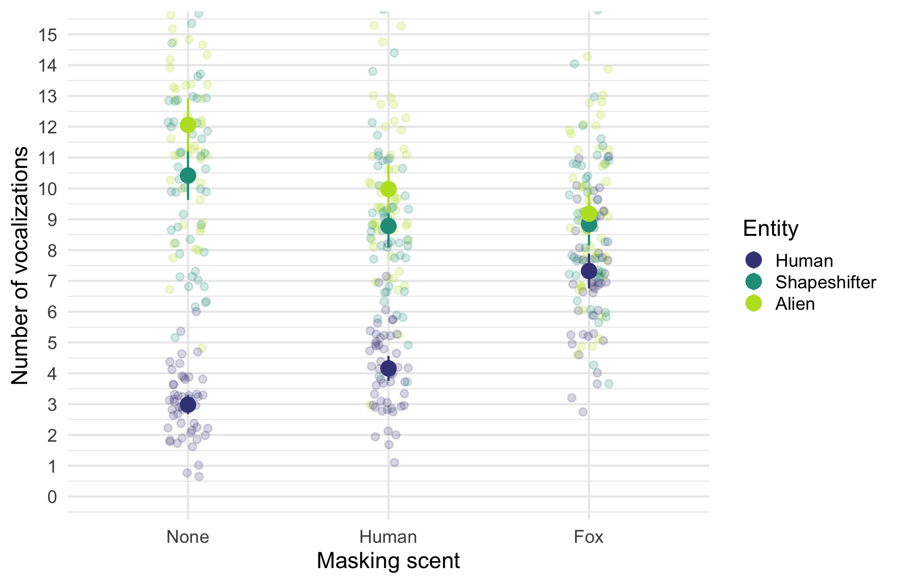


## Slide 47: Fit the model: contrasts


We have a natural control group for the entity (human) so a natural contrast is to use dummy coding.

- **Contrast 1**: {alien} vs. {human}
- **Contrast 2**: {shapeshifter} vs. {human}

We have a natural control group for the scent masks (no scent) so a natural contrast is to use dummy coding.

- **Contrast 1**: {human} vs. {none}
- **Contrast 2**: {fox} vs. {none}

## Slide 48: Specifying contrasts


The level order of the variables is:

``` r
levels(scent_tib$entity)
```

    [1] "Human"        "Shapeshifter" "Alien"       

``` r
levels(scent_tib$scent_mask)
```

    [1] "None"  "Human" "Fox"  

We can do nothing (default dummy coding will do the above) or set up contrasts explicitly with:

``` r
contrasts(scent_tib$entity) <- contr.treatment(3, base = 1)
contrasts(scent_tib$scent_mask) <- contr.treatment(3, base = 1)
```

## Slide 49: Building models


``` r
scent_base <- glmmTMB::glmmTMB(
  vocalizations ~ 1 + (1|dog_id),
  data = scent_tib)

scent_ent <- glmmTMB::glmmTMB(
  vocalizations ~ entity + (1|dog_id),
  data = scent_tib)

scent_scent <- glmmTMB::glmmTMB(
  vocalizations ~ entity + scent_mask + (1|dog_id),
  data = scent_tib)

scent_int <- glmmTMB::glmmTMB(
  vocalizations ~ entity + scent_mask + entity:scent_mask + (1|dog_id), 
  data = scent_tib)
```

## Slide 50: Evaluate


``` r
test_lrt(scent_base, scent_ent, scent_scent, scent_int) |> 
  display()
```

| Name        | df  | df_diff | Chi2   | p       |
|-------------|-----|---------|--------|---------|
| scent_base  | 3   |         |        |         |
| scent_ent   | 5   | 2       | 327.42 | \< .001 |
| scent_scent | 7   | 2       | 13.36  | 0.001   |
| scent_int   | 11  | 4       | 183.79 | \< .001 |

Likelihood-Ratio-Test (LRT) for Model Comparison (ML-estimator)

> **Warning: The danger zone!**
>
> **“It is never sensible to interpret main effects in the presence of a significant interaction effect.”**


## Slide 51: Evaluate


``` r
model_performance(scent_int) |> 
  display()
```

| AIC    | AICc   | BIC    | R2 (cond.) | R2 (marg.) | ICC  | RMSE | Sigma |
|--------|--------|--------|------------|------------|------|------|-------|
| 1918.9 | 1919.5 | 1964.1 | 0.76       | 0.59       | 0.41 | 1.70 | 1.78  |


## Slide 52: Evaluate assumptions


``` r
check_model(scent_int)
```

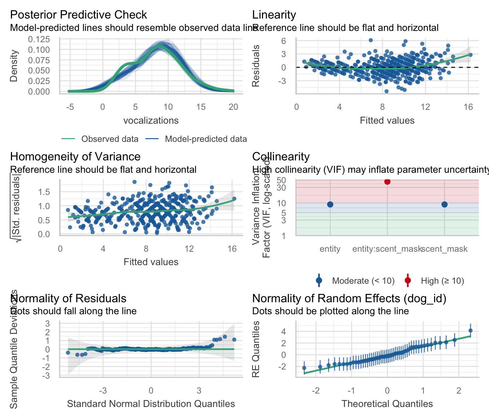


## Slide 53: Interpret: Entity × scent_mask interaction

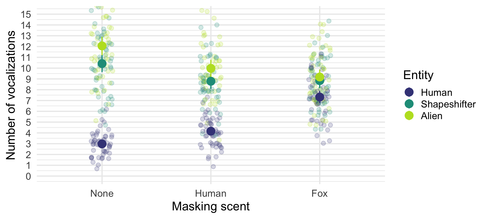

> **Important: ReportR**
>
> The interaction effect suggests that the effect of entity on vocalizations was significantly moderated by what scent the entity was wearing, $`\chi^2`$(4) = 183.79, *p* \< 0.001.


## Slide 54: Interpret


``` r
model_parameters(scent_int, effects = "fixed") |> 
  display()
```

| Parameter | Coefficient | SE | 95% CI | z | p |
|----|----|----|----|----|----|
| (Intercept) | 2.98 | 0.33 | (2.34, 3.62) | 9.08 | \< .001 |
| entity (Shapeshifter) | 7.44 | 0.36 | (6.74, 8.14) | 20.85 | \< .001 |
| entity (Alien) | 9.08 | 0.36 | (8.38, 9.78) | 25.45 | \< .001 |
| scent mask (Human) | 1.18 | 0.36 | (0.48, 1.88) | 3.31 | \< .001 |
| scent mask (Fox) | 4.34 | 0.36 | (3.64, 5.04) | 12.16 | \< .001 |
| entity (Shapeshifter) × scent mask (Human) | -2.82 | 0.50 | (-3.81, -1.83) | -5.59 | \< .001 |
| entity (Alien) × scent mask (Human) | -3.26 | 0.50 | (-4.25, -2.27) | -6.46 | \< .001 |
| entity (Shapeshifter) × scent mask (Fox) | -5.92 | 0.50 | (-6.91, -4.93) | -11.73 | \< .001 |
| entity (Alien) × scent mask (Fox) | -7.22 | 0.50 | (-8.21, -6.23) | -14.31 | \< .001 |

Fixed Effects


## Slide 55: Entity × scent_mask interaction: parameter 1


| Parameter | Coefficient | SE | 95% CI | z | p |
|----|----|----|----|----|----|
| entity (Shapeshifter) × scent mask (Human) | -2.82 | 0.50 | (-3.81, -1.83) | -5.59 | \< .001 |

Fixed Effects

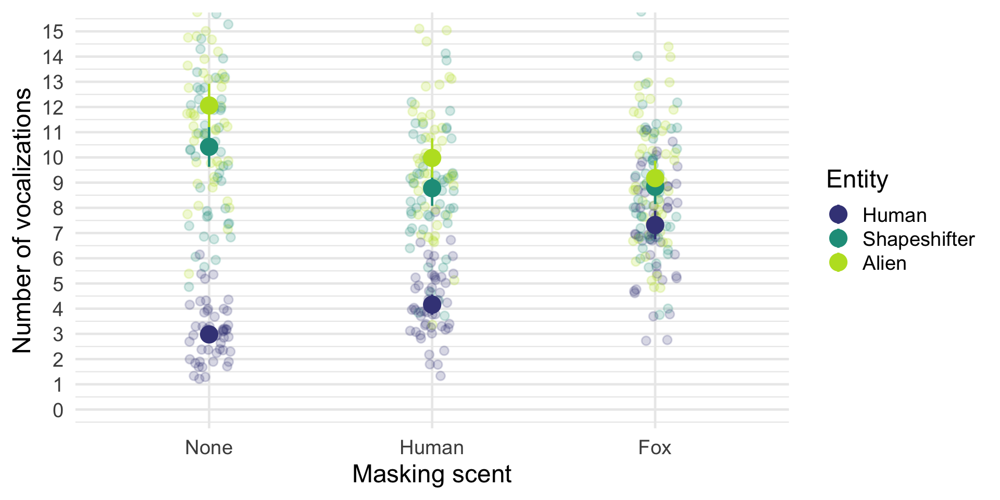


## Slide 56: Entity × scent_mask interaction: parameter 1


| Parameter | Coefficient | SE | 95% CI | z | p |
|----|----|----|----|----|----|
| entity (Shapeshifter) × scent mask (Human) | -2.82 | 0.50 | (-3.81, -1.83) | -5.59 | \< .001 |

Fixed Effects

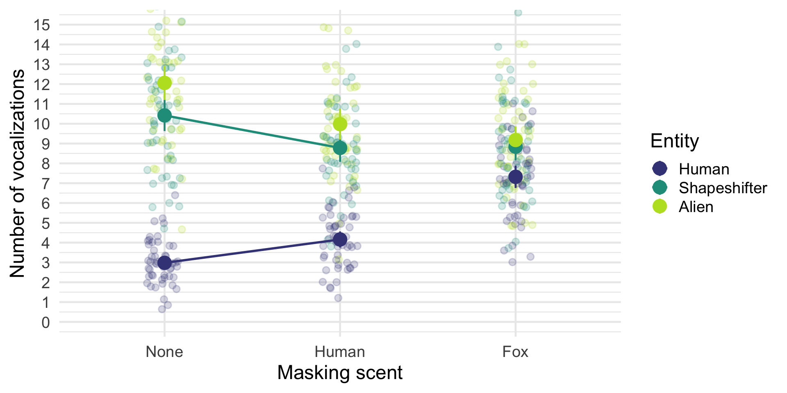


## Slide 57: Entity × scent_mask interaction: parameter 2


| Parameter | Coefficient | SE | 95% CI | z | p |
|----|----|----|----|----|----|
| entity (Alien) × scent mask (Human) | -3.26 | 0.50 | (-4.25, -2.27) | -6.46 | \< .001 |

Fixed Effects

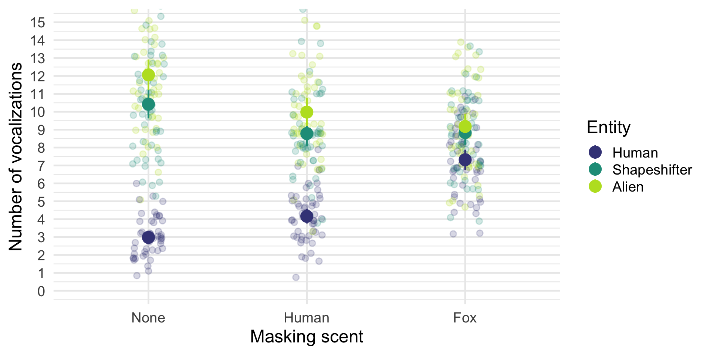


## Slide 58: Entity × scent_mask interaction: parameter 2


| Parameter | Coefficient | SE | 95% CI | z | p |
|----|----|----|----|----|----|
| entity (Alien) × scent mask (Human) | -3.26 | 0.50 | (-4.25, -2.27) | -6.46 | \< .001 |

Fixed Effects

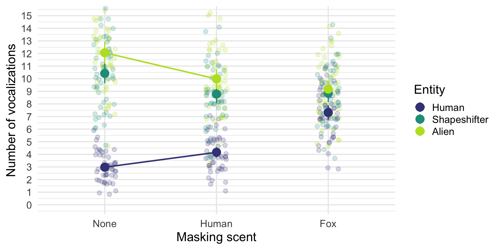


## Slide 59: Entity × scent_mask interaction: parameter 3


| Parameter | Coefficient | SE | 95% CI | z | p |
|----|----|----|----|----|----|
| entity (Shapeshifter) × scent mask (Fox) | -5.92 | 0.50 | (-6.91, -4.93) | -11.73 | \< .001 |

Fixed Effects

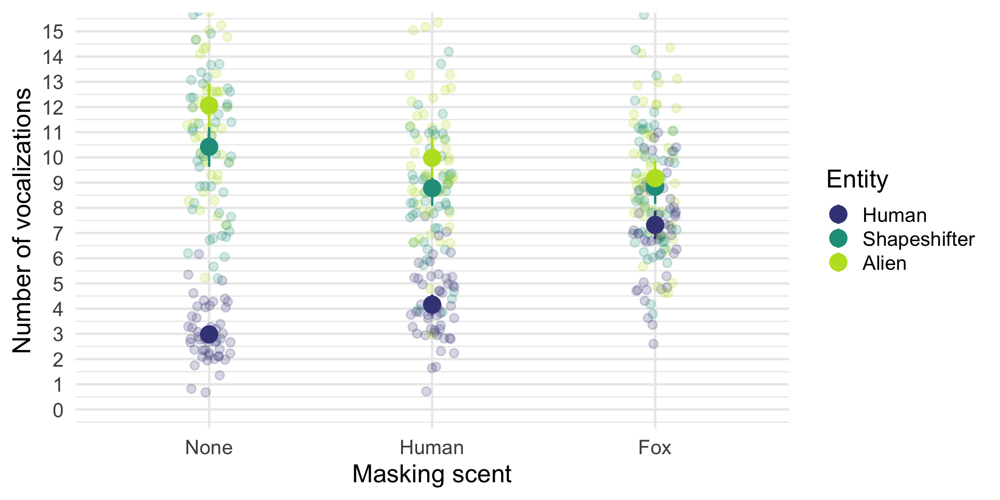


## Slide 60: Entity × scent_mask interaction: parameter 3


| Parameter | Coefficient | SE | 95% CI | z | p |
|----|----|----|----|----|----|
| entity (Shapeshifter) × scent mask (Fox) | -5.92 | 0.50 | (-6.91, -4.93) | -11.73 | \< .001 |

Fixed Effects

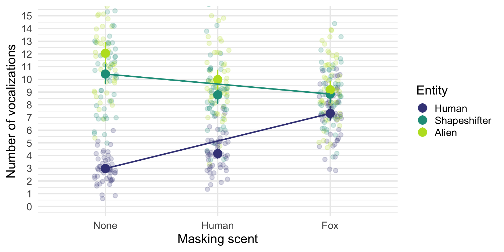


## Slide 61: Entity × scent_mask interaction: parameter 4


| Parameter | Coefficient | SE | 95% CI | z | p |
|----|----|----|----|----|----|
| entity (Alien) × scent mask (Fox) | -7.22 | 0.50 | (-8.21, -6.23) | -14.31 | \< .001 |

Fixed Effects


## Slide 62: Entity × scent_mask interaction: parameter 4


| Parameter | Coefficient | SE | 95% CI | z | p |
|----|----|----|----|----|----|
| entity (Alien) × scent mask (Fox) | -7.22 | 0.50 | (-8.21, -6.23) | -14.31 | \< .001 |

Fixed Effects

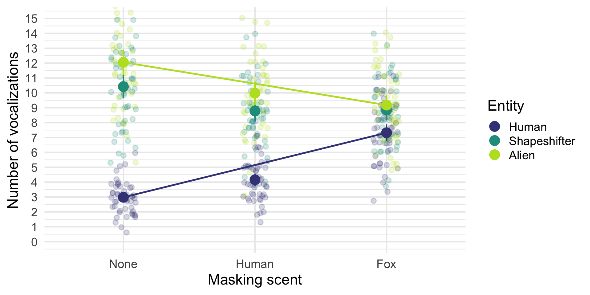


## Slide 63

Video clip: [space closing scene](https://profandyfield.github.io/statistics_lectures/shared_media/video/space_closing_scene.mp4)
