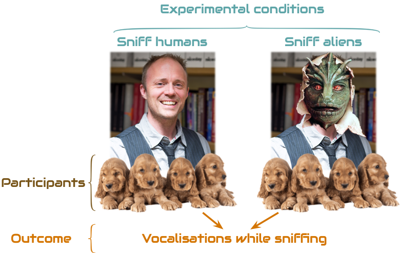
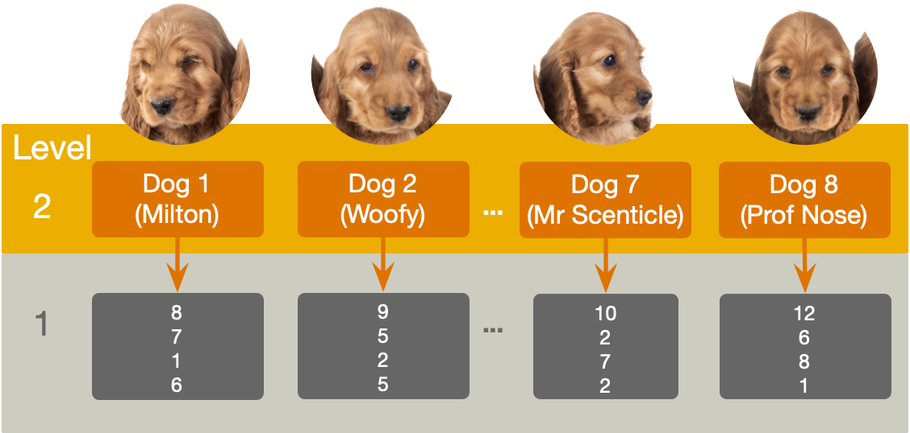
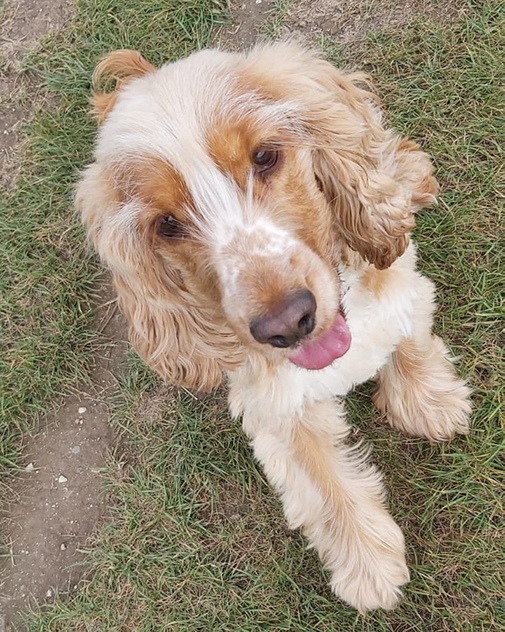

```{r}
library(dplyr)
library(ggplot2)
library(tibble)

#non tidyverse
library(gt)
library(kableExtra)
library(lme4)
library(lmerTest)
library(modelbased)
library(performance)
library(parameters)
library(DT)


here::here("helpers/discovr_helpers.R") |> source()

sniff_tib <- discovr::sniffer_dogs
scent_tib <- discovr::alien_scents

sniff_cons <- cbind(
  aliens_vs_non = c(1/2, -1/2, -1/2, 1/2),
  alien_vs_shape = c(1/2, 0, 0, -1/2),
  human_vs_manquin = c(0, 1/2, -1/2, 0)
  )

contrasts(sniff_tib$entity) <-  sniff_cons
sniff_mod <- lmerTest::lmer(vocalizations ~ entity + (1|dog_name), data = sniff_tib)
sniff_lrt <- performance::test_lrt(sniff_mod)
sniff_pars <- parameters::parameters(sniff_mod)
```


```{r, child = "space_intro.qmd"}

```

##

```{r, child = "spine_map_models.qmd"}

```


##

{width=1000}

- **Systematic variance**: created by our manipulation
- **Unsystematic variance**: variance created by unknown factors
  
::: notes
If we test the same puppies while sniffing humans at two points in time, we’d expect them to get similar scores (other things being equal their vocalizations shouldn't change much). A lot of unsystematic variance is removed (e.g. how much they naturally vocalise, how sensitive their nose is etc.).

Like an independent design, in a repeated measures design, differences between the two conditions can be caused by one of two things: (1) the manipulation that was carried out on the participants (whether the puppies sniffed aliens or humans), or (2) other factors that we couldn’t account for (time of day, mood, excitability). The latter factor in is likely to create much less random variation in a RM design because many sources of possible variation are controlled.

As such, there are always two sources of variation:

Systematic variation: This variation is due to the experimenter doing something to all of the participants in one condition but not in the other condition.

Unsystematic variation: This variation results from random factors that could not be controlled.

Like independent designs, repeated measures designs still compare the amount of systematic variance to the amount of unsystematic variance. In other words it compares the amount of variation caused by the experiment to the amount of natural variation (created by uncontrolled variables). However, the source of the systematic variance is different (I.e. it comes from within participants rather than between).

:::

## Benefits of repeated measures designs

- Sensitivity
    - Unsystematic variance is reduced
    - More sensitive to experimental effects

- Economy
    - Less participants are needed
    + But, be careful of fatigue

::: notes
Sensitivity
The effect of our experimental manipulation is likely to be more apparent in a repeated measures design than in a between-group design because in the former unsystematic variation can be caused only by differences in the way in which someone behaves at different times. In between-group designs we have differences in innate ability contributing to the unsystematic variation. Therefore, this error variation will almost always be much larger than if the same participants had been used. When we look at the effect of our experimental manipulation, it is always against a background of ‘noise’ caused by random, uncontrollable differences between our conditions. In a repeated measures design this ‘noise’ is kept to a minimum and so the effect of the experiment is more likely to show up. This means that repeated measures designs have more power to detect effects that genuinely exist than independent designs.
Economy
Repeated measures designs make more efficient use of participants and so save time and money. However, although in theory you could have a participant take part in many different conditions, they do tend to get very bored and frustrated in long experiments. Therefore, it’s always worth trying to bear in mind what your participants will have to endure before designing an experiment with 250 different experimental conditions
:::


## Can puppies sniff out aliens?

- Outcome = vocalizations during 1 min sniffing (`vocalizations`)
- Predictor: type of entity being sniffed (`entity`)
  - Alien (not in humanoid form)
  - Human (control for alien vs human)
  - Mannequin (control for humanoid form)
  - Shapeshifter (alien in humanoid form)
- `dog_name` indicates the name of the dog (*N* = 8)

::: notes

Imagine a scientist wanted to look at 
:::

## The data

```{r}

rowVar <- function(x, ...) {
  rowSums((x - rowMeans(x, ...))^2, ...)/(dim(x)[2] - 1)
}


sniff_dt <- sniff_tib |>
  tidyr::pivot_wider(
    id_cols = dog_name,
    names_from = entity,
    values_from = vocalizations
  ) |>
  dplyr::mutate(
    Mean = rowMeans(pick(where(is.numeric))),
    Variance = rowVar(pick(where(is.numeric))) |> round(2)
  ) |> 
  gt::gt()|> 
  gt::cols_align(
    align = "center"
    ) 

sniff_dt|>
  gt::grand_summary_rows(
    columns = c(Alien, Human, Mannequin, Shapeshifter),
    fns = list(label = md("**Mean**"), fn = "mean"),
    fmt = ~fmt_number(., decimals = 2)
  ) |>
  gt::tab_style(
    style = list(
      gt::cell_fill(color = red, alpha = 0.8),
      gt::cell_text(weight = "bold", color = gry)
      ),
    locations = gt::cells_grand_summary(
      columns = c(Alien, Human, Mannequin, Shapeshifter),
      rows = 1
    )
    )
```


## The data in `r rproj()`

```{r}
sniff_tib|> 
  DT::datatable(caption = 'Table 2: Data for the sniffer dog example',
                options = list(
                dom = 'tp',
                columnDefs = list(
                  list(className = 'dt-center', targets = 1:3)
                  ),
                pageLength = 10
  )
  )
```


## Repeated measures and the linear model

To keep things simple, imagine a design where dogs sniff only aliens or humans (e.g., two conditions)


::: columns
:::{.column width="50%"}

:::{.txt_red}
$$
\begin{aligned}
\text{vocalizations}_{i} & = \hat{b}_{0} + \hat{b}_{1}\text{entity}_{i} + e_{i}
\end{aligned}
$$
:::
:::

:::{.column width="50%"}
```{r, echo = F, results = 'asis'}
dum_tbl <- tibble::tibble(
  `Entity sniffed` = c("Alien", "Human"),
  `Dummy variable (entity)` = c(1, 0)
)

dum_tbl|> 
  knitr::kable(align = "lcc") |> 
  style_my_kable()
```
:::
:::


</br>

:::{.warning}

`r bug()` Same participants in all conditions

- Scores across conditions correlate
  
- Violates the assumption of independent residuals (think back to the lecture on bias)
:::


## Repeated measures: hierrachical data structure

:::{.center-h}
{width=1000}
:::


## Repeated measures and the linear model

Need to adjust the model to estimate this dependency

:::{.center-h}
:::{.txt_red}
$$
\begin{aligned}
\text{vocalizations}_{ij} & = (\hat{\beta}_{0} + \hat{u}_{0j}) + (\hat{\beta}_{1} + \hat{u}_{1j})\text{entity}_{ij}+ e_{ij} \\
& = \left[\hat{\beta}_{0} + \hat{\beta}_{1}\text{entity}_{ij}\right]+ \left[\hat{u}_{0j} + \hat{u}_{1j}\text{entity}_{ij} + e_{ij}\right]\\
\end{aligned}
$$
:::
:::

## {background-image="../shared_media/images/spaceship_light_2_ppt_hex.jpg" background-size="cover"}

```{r, fig.width = 10, fig.height = 7}
sniff_simp_tib <- sniff_tib|> 
  dplyr::filter(entity == "Human" | entity == "Alien")|> 
  dplyr::mutate(
    entity_dum = ifelse(entity == "Human", 0, 1)
  )

sniff_lm <- lm(vocalizations~entity_dum, data = sniff_simp_tib)
sniff_pred_tib <- tibble::tibble(
  entity_dum = c(0, 1),
  vocalizations = predict(sniff_lm, newdata = data.frame(entity_dum = entity_dum))
)


sniff_simp_plot <- ggplot(sniff_simp_tib, aes(entity_dum, vocalizations, colour = dog_name)) +
  annotate("segment", x = 0, xend = 1,  y = sniff_pred_tib$vocalizations[1], yend = sniff_pred_tib$vocalizations[2], colour = gry_dk, size = 3, alpha = 0.7) +
  annotate("point", x = 0,  y = sniff_pred_tib$vocalizations[1], colour = gry_dk, size = 7, shape = 15) +
  annotate("point", x = 1,  y = sniff_pred_tib$vocalizations[2], colour = gry_dk, size = 7, shape = 15) +
  geom_point(size = 4) +
  coord_cartesian(xlim = c(-0.5, 1.5), ylim = c(0, 14)) +
  scale_y_continuous(breaks = seq(0, 14, 1)) +
  scale_x_continuous(breaks = c(0, 1), labels = c("Human", "Alien")) +
  scale_colour_brewer(palette = "Set2") +
  labs(x = "Entity sniffed", y = "vocalizations when sniffing", colour = "Dog") +
  theme_minimal(base_size = 18)

sniff_simp_plot
```

:::{.center-h}
:::{.txt_red}
$$
\begin{aligned}
\text{vocalizations}_{ij} & = (\hat{\beta}_{0} + \hat{u}_{0j})+ \hat{\beta}_{1}\text{entity}_{ij}+ e_{ij}
\end{aligned}
$$
:::
:::

## {background-image="../shared_media/images/spaceship_light_2_ppt_hex.jpg" background-size="cover"}


```{r, fig.width = 10, fig.height = 7}
sniff_simp_plot +
  stat_summary(fun = mean, geom="line", aes(group = dog_name), size = 1)
```

:::{.center-h}
:::{.txt_red}
$$
\begin{aligned}
\text{vocalizations}_{ij} & = (\hat{\beta}_{0} + \hat{u}_{0j}) + (\hat{\beta}_{1} + \hat{u}_{1j})\text{entity}_{ij}+ e_{ij}
\end{aligned}
$$
:::
:::


## Repeated measures and the linear model

Back to our actual design (with 4 conditions: Alien, Human, Mannequin, Shapeshifter)

- `entity` would be split into 3 dummy/contrast variables
- Let's just use default dummy coding


```{r, echo = F, results = 'asis'}
dum_tbl <- tibble::tibble(
  `Entity sniffed` = c("Alien", "Shapeshifter", "Human", "Mannequin"),
  `Dummy 1 (Alien vs. mannequin)` = c(1, 0, 0, 0),
  `Dummy 2 (Shapeshifter vs. mannequin)` = c(0, 1, 0, 0),
  `Dummy 3 (Human vs. mannequin)` = c(0, 0, 1, 0),
)

dum_tbl|> 
  knitr::kable(align = "lcc") |> 
  style_my_kable(nrows = 4)
```


## {background-image="../shared_media/images/spaceship_light_2_ppt_hex.jpg" background-size="cover"}


```{r, fig.width = 11.5, fig.height = 5.5}
pal <- RColorBrewer::brewer.pal(5, "Set2")[c(1, 2, 3,4)]
sniff_tib <- sniff_tib|> 
  dplyr::mutate(entity2 = forcats::fct_relevel(entity, "Mannequin", "Alien", "Shapeshifter", "Human"))

alien_mquin <- c(1, 0, 0, 0)
shape_mquin <- c(0, 0, 0, 1)
human_mquin <- c(0, 1, 0, 0)

contrasts(sniff_tib$entity) <- cbind(alien_mquin, shape_mquin, human_mquin)

sniff_lm <- lm(vocalizations~entity, data = sniff_tib)

sniff_means <- emmeans::emmeans(sniff_lm, "entity")|> tibble::as_tibble()

sniff_plot <- ggplot(sniff_tib, aes(entity2, vocalizations, colour = dog_name)) +
  geom_point(size = 4) + 
  coord_cartesian(xlim = c(0.4, 4.6), ylim = c(0, 14)) +
  scale_y_continuous(breaks = seq(0, 14, 1)) +
  scale_colour_brewer(palette = "Set2") +
  labs(x = "Entity sniffed", y = "vocalizations when sniffing", colour = "Dog") +
  theme_minimal(base_size = 18)

sniff_plot_pred <- sniff_plot +
    annotate("segment", x = 0.5, y = sniff_means$emmean[3], xend = 1.5, yend = sniff_means$emmean[3], size = 1, colour = gry_dk) +
  annotate("segment", x = 1.5, y = sniff_means$emmean[1], xend = 2.5, yend = sniff_means$emmean[1], size = 1, colour = gry_dk) +
  annotate("segment", x = 2.5, y = sniff_means$emmean[4], xend = 3.5, yend = sniff_means$emmean[4], size = 1, colour = gry_dk) +
  annotate("segment", x = 3.5, y = sniff_means$emmean[2], xend = 4.5, yend = sniff_means$emmean[2], size = 1, colour = gry_dk)
sniff_plot_pred
```

## {background-image="../shared_media/images/spaceship_light_2_ppt_hex.jpg" background-size="cover"}


```{r, fig.width = 11.5, fig.height = 5.5}
b_y <- (sniff_means$emmean + sniff_means$emmean[3])/2

sniff_plot_beta <- sniff_plot_pred +
  annotate("text", x = 1.7, y = b_y[1], label = bquote(hat(italic(beta))[1]), size = 6) +
  annotate("segment", x = 1.5, y = sniff_means$emmean[3], xend = 1.5, yend = sniff_means$emmean[1], colour = gry_dk, size = 1, arrow = arrow(length = unit(0.03, "npc"), ends = "both")) +
  annotate("text", x = 2.7, y = b_y[4], label = bquote(hat(italic(beta))[2]), size = 6) +
  annotate("segment", x = 2.5, y = sniff_means$emmean[3], xend = 2.5, yend = sniff_means$emmean[4], colour = gry_dk, size = 1, arrow = arrow(length = unit(0.03, "npc"), ends = "both")) + 
annotate("text", x = 3.7, y = b_y[2], label = bquote(hat(italic(beta))[3]), size = 6) +
  annotate("segment", x = 3.5, y = sniff_means$emmean[3], xend = 3.5, yend = sniff_means$emmean[2], colour = gry_dk, size = 1, arrow = arrow(length = unit(0.03, "npc"), ends = "both"))

sniff_plot_beta
```


:::{.center-h}
:::{.txt_red}
$$
\begin{aligned}
\text{vocalizations}_{ij} & = \left[\hat{\beta}_{0} + \hat{\beta}_{1}\text{alien vs. manq}_{ij} + \hat{\beta}_{2}\text{shape vs. manq}_{ij} + \hat{\beta}_{3}\text{human vs. manq}_{ij}\right] \\
&\quad + \left[\hat{u}_{0j} + e_{ij}\right] \\
\end{aligned}
$$
:::
:::

## {background-image="../shared_media/images/spaceship_light_2_ppt_hex.jpg" background-size="cover"}


```{r, fig.width = 11.5, fig.height = 5.5}

b1_tib <- sniff_tib|>  dplyr::filter(entity == "Mannequin" | entity == "Alien")
b2_tib <- sniff_tib|>  dplyr::filter(entity == "Mannequin" | entity == "Shapeshifter")
b3_tib <- sniff_tib|>  dplyr::filter(entity == "Mannequin" | entity == "Human")

sniff_plot_beta +
  stat_summary(data = b1_tib, fun = mean, geom="line", aes(group = dog_name), size = 1, linetype = "longdash") 
```


:::{.center-h}
:::{.txt_red}
$$
\begin{aligned}
\text{vocalizations}_{ij} & = \left[\hat{\beta}_{0} + \hat{\beta}_{1}\text{alien vs. manq}_{ij} + \hat{\beta}_{2}\text{shape vs. manq}_{ij} + \hat{\beta}_{3}\text{human vs. manq}_{ij}\right] \\
&\quad + \left[\hat{u}_{0j} +  \hat{u}_{1j}\text{alien vs. manq}_{ij} +  e_{ij}\right] \\
\end{aligned}
$$
:::
:::

## {background-image="../shared_media/images/spaceship_light_2_ppt_hex.jpg" background-size="cover"}


```{r, fig.width = 11.5, fig.height = 5.5}
sniff_plot_beta +
  stat_summary(data = b1_tib, fun = mean, geom="line", aes(group = dog_name), size = 1, linetype = "longdash") +
  stat_summary(data = b2_tib, fun = mean, geom="line", aes(group = dog_name), size = 1, linetype = "longdash")
  
```


:::{.center-h}
:::{.txt_red}
$$
\begin{aligned}
\text{vocalizations}_{ij} & = \left[\hat{\beta}_{0} + \hat{\beta}_{1}\text{alien vs. manq}_{ij} + \hat{\beta}_{2}\text{shape vs. manq}_{ij} + \hat{\beta}_{3}\text{human vs. manq}_{ij}\right] \\
&\quad + \left[\hat{u}_{0j} +  \hat{u}_{1j}\text{alien vs. manq}_{ij} + \hat{u}_{2j}\text{shape vs. manq}_{ij} + e_{ij}\right] \\
\end{aligned}
$$
:::
:::

## {background-image="../shared_media/images/spaceship_light_2_ppt_hex.jpg" background-size="cover"}


```{r, fig.width = 11.5, fig.height = 5.5}
sniff_plot_beta +
  stat_summary(data = b1_tib, fun = mean, geom="line", aes(group = dog_name), size = 1, linetype = "longdash") +
  stat_summary(data = b2_tib, fun = mean, geom="line", aes(group = dog_name), size = 1, linetype = "longdash") +
  stat_summary(data = b3_tib, fun = mean, geom="line", aes(group = dog_name), size = 1, linetype = "longdash")
  
```


:::{.center-h}
:::{.txt_red}
$$
\begin{aligned}
\text{vocalizations}_{ij} & = \left[\hat{\beta}_{0} + \hat{\beta}_{1}\text{alien vs. manq}_{ij} + \hat{\beta}_{2}\text{shape vs. manq}_{ij} + \hat{\beta}_{3}\text{human vs. manq}_{ij}\right] \\
&\quad + \left[\hat{u}_{0j} +  \hat{u}_{1j}\text{alien vs. manq}_{ij} + \hat{u}_{2j}\text{shape vs. manq}_{ij} + \hat{u}_{3j}\text{human vs. manq}_{ij} + e_{ij}\right] \\
\end{aligned}
$$

:::
:::

## Approaches to repeated measures designs

Historic: Repeated measures ANOVA (RM-ANOVA)

- Restricts the model in two ways
- Assumes effects are equivalent across participants (the effect in participant 1 is the same as in participant 2)
- Errors have compound symmetry/sphericity
    - CS: The correlation between scores across conditions is the same
    - Sphericity: differences between scores in pairs of conditions have the same variance
    - These restrictions may be unrealistic
    
Multilevel modelling (MLM) approach

- Fewer restrictions: doesn't require CS or sphericity
- MLM can include multiple hierarchical structures (e.g., observations within people, within clinics)
- MLMs can (in general) cope with missing values RM-ANOVA cannot.
- MLMs can be extended to categorical outcomes, RM-ANOVA cannot.
- Contrast coding is possible


## Fitting the model

::: columns
:::{.column width="50%}

- Use `lme4::lme()` or `nlme::lme()`

  - A trickier but more flexible option
  - Manually set contrasts
  - Can get parameter estimates, diagnostic plots, and robust methods

:::

:::{.column width="50%}

- The `afex::aov_4()` function

  - Specify the repeated measures with `(rm_predictors|id_var)`
  
  - Automatically sets contrasts
  
  - Built in interaction plot with `afex_plot()`
  
  - But ... no parameter estimates, diagnostic plots, or robust methods
  
  - See other lecture

:::
:::

## Contrasts {background-image="../shared_media/images/spaceship_light_2_ppt_hex.jpg" background-size="cover"}

If the dog training has been successful then we'd expect sniffer dogs to make more vocalizations when sniffing alien entities than non alien-entities. 

- **Contrast 1**: {alien, shapeshifter} vs. {human, mannequin}

We have two 'chunks' in contrast 1 that would then need to be decomposed:

- **Contrast 2**: {alien} vs. {shapeshifter}
- **Contrast 3**: {human} vs. {mannequin}

Using the rules for contrast coding we'd get the codes in Table 4:

:::{.center-h}
```{r con_tbl, echo = FALSE, results = 'asis'}
con_tbl <- tibble(
  `Group` = c("Alien", "Human", "Mannequin", "Shapeshifter"),
  `Contrast 1` = c("1/2", "-1/2", "-1/2", "1/2"),
  `Contrast 2` = c("1/2", 0, 0, "-1/2"),
  `Contrast 3` = c(0, "1/2", "-1/2", 0),
  )

knitr::kable(con_tbl,
             caption = "Table 4: Contrast coding for the entity variable",
             align = "lccc") |> 
  style_my_kable(nrows = 4, padding = 10)
```
:::


## Fitting the model {background-image="../shared_media/images/spaceship_light_2_ppt_hex.jpg" background-size="cover"}

```{r, echo = TRUE, eval = T}
 
aliens_vs_non = c(1/2, -1/2, -1/2, 1/2)
alien_vs_shape = c(1/2, 0, 0, -1/2)
human_vs_manquin = c(0, 1/2, -1/2, 0)

contrasts(sniff_tib$entity) <- cbind(aliens_vs_non, alien_vs_shape, human_vs_manquin)

sniff_mod <- lmerTest::lmer(vocalizations ~ entity 
                            + (1|dog_name), 
                            data = sniff_tib)

```


## The model {background-image="../shared_media/images/spaceship_light_2_ppt_hex.jpg" background-size="cover"}

```{r, echo = T, eval = F}
performance::test_lrt(sniff_ent)
```

</br> 

```{r, results = 'asis'}
performance::test_lrt(sniff_mod) |> 
  select(-Model) |> 
  knitr::kable(digits = 2, row.names = F) |> 
  style_my_kable()
```

</br>


::: {.infobox}

`r pencil()` The entity sniffed had a significant effect on the number of vocalizations by sniffer dogs, $\chi^2$(3) = 12.69, *p* = 0.01.

:::


## Contrasts {background-image="../shared_media/images/spaceship_light_2_ppt_hex.jpg" background-size="cover"}

```{r, results = F, echo = T}
parameters::model_parameters(sniff_mod, effects = "fixed")
```


</br>

::: {.whitebox}
```{r, echo = F}
parameters::model_parameters(sniff_mod, effects = "fixed") |> 
  format() |> 
  knitr::kable(digits = 3) |> 
  style_my_kable(nrows = 4)
```
:::

</br>

:::{.infobox}

`r pencil()` Contrasts revealed that vocalizations were significantly higher when sniffing aliens compared to non-aliens, `r report_pars(sniff_pars, row = 2)`), but vocalizations were not significantly different when sniffing different types of aliens, `r report_pars(sniff_pars, row = 3)` or when sniffing a human compared to a mannequin, `r report_pars(sniff_pars, row = 4)`)..
:::

## Interpretation {background-image="../shared_media/images/spaceship_light_2_ppt_hex.jpg" background-size="cover"}

```{r, fig.width=10, fig.height=6.5}
ggplot2::ggplot(sniff_tib, aes(x = entity, y = vocalizations)) +
  geom_point(colour = blu, alpha = 0.7, position = position_jitter(width = 0.1), size = 3) +
  stat_summary(fun.data = "mean_cl_normal", geom = "pointrange", colour = ong, size = 1) +
  coord_cartesian(ylim = c(0,10)) +
  scale_y_continuous(breaks = 0:10) +
  labs(x = "Entity sniffed", y = "Number of vocalizations") +
  theme_minimal(base_size = 18)
```


```{r, child = "space_middle.qmd"}

```


#  Scenting a victory ... factorial repeated measures designs

## Can scents distract the sniffer dogs?

::: columns
:::{.column width="70%"}

- 50 sniffer dogs
  - Participated in all conditions
  - Sniffed 9 different 'things'
- Predictor: `entity`
  - **Human**: the dog sniffs a human
  - **Shapeshifter** the dog sniffs an alien in humanoid form
  - **Alien** the dog sniffs an alien in lizard form
- Predictor: `scent_mask`
  - The entity had no masking scent (**none**)
  - The entity was smeared with **human** pheromones
  - The entity was smeared with **fox** pheromones
- Outcome: The number of `vocalizations` during each 1 minute sniff
:::


:::{.column width="30%"}

:::
:::

## The model {background-image="../shared_media/images/spaceship_light_2_ppt_hex.jpg" background-size="cover"}

- Let's simplify things by ignoring the fact that `entity` and `scent_mask` will be represented by two dummy variables each (and the interaction by 4!)
- We can model individual differences in all parameters

:::{.center-h}
:::{.txt_red}
$$
\begin{aligned}
\text{vocalizations}_{ij} &= \left[\hat{b}_{0} + \hat{b}_{1}\text{entity}_{ij} + \hat{b}_{2}\text{scent}_{ij} + \hat{b}_{3}(\text{entity}_{ij}\times\text{scent}_{ij})\right] + \\
&\quad \left[\hat{u}_{0j} + \hat{u}_{1j}\text{entity}_{ij} + \hat{u}_{2j}\text{scent}_{ij} + \hat{u}_{3j}(\text{entity}_{ij}\times\text{scent}_{ij}) + e_{ij}\right]\\
\end{aligned}
$$

:::
:::

- This model will be too complex to fit
- The simplest version of the repeated measures model instead treats the effects of predictor variables as fixed, but acknowledges that dogs, overall, will vary in their vocalizations:

:::{.center-h}
:::{.txt_red}
$$
\begin{aligned}
\text{vocalizations}_{ij} & = \left[\hat{b}_{0} + \hat{b}_{1}\text{entity}_{ij} + \hat{b}_{2}\text{scent}_{ij} + \hat{b}_{3}(\text{entity}_{ij}\times\text{scent}_{ij})\right] +\\
&\quad \left[\hat{u}_{0j} + e_{ij}\right]\\
\end{aligned}
$$

:::
:::

## The data {background-image="../shared_media/images/spaceship_light_2_ppt_hex.jpg" background-size="cover"}

```{r}
scent_tib|> 
  DT::datatable(caption = 'Table 7: Data for the scent masking example',
                options = list(
                dom = 'tp',
                columnDefs = list(
                  list(className = 'dt-center', targets = 1:3)
                  ),
                pageLength = 10
  )
  )
```

## The data

```{r, fig.width=10, fig.height=6.5}
scent_int_plot <- ggplot2::ggplot(scent_tib, aes(x = scent_mask, y = vocalizations, colour = entity)) +
  geom_point(alpha = 0.2, position = position_jitter(width = 0.1)) +
  stat_summary(fun.data = "mean_cl_normal", geom = "pointrange", size = 1) +
  scale_colour_manual(values = c(blu, red, grn)) +
  coord_cartesian(ylim = c(0,15)) +
  scale_y_continuous(breaks = 0:15) +
  labs(x = "Masking scent", y = "Number of vocalizations", colour  = "Entity") +
  theme_minimal(base_size = 18)
scent_int_plot
```

## Contrasts

We have a natural control group for the entity (human) so a natural contrast is to use dummy coding. 

- **Contrast 1**: {alien} vs. {human}
- **Contrast 2**: {shapeshifter} vs. {human}

We have a natural control group for the scent masks (no scent) so a natural contrast is to use dummy coding. 

- **Contrast 1**: {human} vs. {none}
- **Contrast 2**: {fox} vs. {none}

## Specifying contrasts

The level order of the variables is:

```{r echo = T}
levels(scent_tib$entity)
levels(scent_tib$scent_mask)
```


We can do nothing (default dummy coding will do the above) or set up contrasts explicitly with:


```{r echo = T, eval = F}
contrasts(scent_tib$entity) <- contr.treatment(3, base = 1)
contrasts(scent_tib$scent_mask) <- contr.treatment(3, base = 1)
```

## Building models {background-image="../shared_media/images/spaceship_light_2_ppt_hex.jpg" background-size="cover"}

```{r, echo = T}
scent_base <- lmerTest::lmer(
  vocalizations ~ 1 + (1|dog_id),
  data = scent_tib
  )

scent_ent <- lmerTest::lmer(
  vocalizations ~ entity + (1|dog_id),
  data = scent_tib
  )

scent_scent <- lmerTest::lmer(
  vocalizations ~ entity + scent_mask + (1|dog_id),
  data = scent_tib
  )

scent_int <- lmerTest::lmer(
  vocalizations ~ entity + scent_mask + entity:scent_mask + (1|dog_id),
  data = scent_tib
  )
```

##

```{r, eval = F, echo = T}
performance::test_lrt(scent_base, scent_ent, scent_scent, scent_int)
```

</br>

:::{.whitebox}
```{r}
performance::test_lrt(scent_base, scent_ent, scent_scent, scent_int)|> 
  tibble::as_tibble()|>
  dplyr::mutate(
    p = afex::round_ps_apa(p)
  ) |> 
  select(-Model) |> 
  knitr::kable(digits = 2, row.names = F) |> 
  style_my_kable(nrows = 4)
```

:::

</br>

:::{.warning}

`r bug()` Repeat the following mantra:

**"It is never sensible to interpret main effects in the presence of a significant interaction effect."**

:::

## Entity × scent_mask interaction {background-image="../shared_media/images/spaceship_light_2_ppt_hex.jpg" background-size="cover"}

:::{.infobox}
`r pencil()` The interaction effect suggests that the effect of entity on vocalizations was significantly moderated by what scent the entity was wearing, $\chi^2$(4) = 183.79, *p* < .001.
:::


:::{.center-h}

```{r, fig.height = 5, fig.width = 10}
scent_int_plot
```

:::

##


```{r, echo = T, eval = F}
parameters::model_parameters(scent_int, effects = "fixed")
```

</br>

:::{.whitebox}

```{r, results = 'asis'}
scent_int_brm <- broom.mixed::tidy(scent_int, effects = "fixed") 

scent_int_brm|>
  knitr::kable(digits = 3) |> 
  kableExtra::row_spec(6:9, background = "yellow") |> 
  style_my_kable(nrows = 9)
```

:::

## Entity × scent_mask interaction: parameter 1

:::{.center-h}
:::{.whitebox}

```{r}
scent_int_brm|>
  dplyr::filter(term == "entityShapeshifter:scent_maskHuman")|> 
  knitr::kable(digits = 2) |> 
  style_my_kable()
```

:::
:::

:::{.center-h}
```{r, fig.width = 10, fig.height = 5.5}
scent_int_plot
```
:::


## Entity × scent_mask interaction: parameter 1

:::{.center-h}
:::{.whitebox}

```{r}
scent_int_brm|>
  dplyr::filter(term == "entityShapeshifter:scent_maskHuman")|> 
  knitr::kable(digits = 2) |> 
  style_my_kable()
```

:::
:::

:::{.center-h}
```{r, fig.width = 10, fig.height = 5.5}
c1_tib <- scent_tib|>
  dplyr::filter(entity != "Alien" & scent_mask != "Fox")


scent_int_plot +
    stat_summary(data = c1_tib, fun = mean, geom="line", aes(group = entity), size = 1)
```
:::

## Entity × scent_mask interaction: parameter 2

:::{.center-h}
:::{.whitebox}
```{r}
scent_int_brm|>
  dplyr::filter(term == "entityAlien:scent_maskHuman")|> 
  knitr::kable(digits = 2) |> 
  style_my_kable()
```
:::
:::

:::{.center-h}
```{r, fig.width = 10, fig.height = 5.5}
scent_int_plot
```
:::

::: notes
The human scent increases vocalizations to humans and although it reduces vocalizations to aliens dogs are still able to discriminate between aliens smeared with human scent and humans smeared with human scent. And aliens smeared with human scent still have a lot more vocalizations than humans with no scent.
:::

## Entity × scent_mask interaction: parameter 2

:::{.center-h}
:::{.whitebox}
```{r}
scent_int_brm|>
  dplyr::filter(term == "entityAlien:scent_maskHuman")|> 
  knitr::kable(digits = 2) |> 
  style_my_kable()
```

:::
:::

:::{.center-h}
```{r, fig.width = 10, fig.height = 5.5}
c2_tib <- scent_tib|>
  dplyr::filter(entity != "Shapeshifter" & scent_mask != "Fox")


scent_int_plot +
    stat_summary(data = c2_tib, fun = mean, geom="line", aes(group = entity), size = 1)
```
:::

::: notes
The human scent increases vocalizations to humans and although it reduces vocalizations to shapeshifters, dogs are still able to discriminate between shapeshifters smeared with human scent and humans smeared with human scent. And shapeshifters smeared with human scent still have a lot more vocalizations than humans with no scent.
:::


## Entity × scent_mask interaction: parameter 3

:::{.center-h}
:::{.whitebox}
```{r}
scent_int_brm|>
  dplyr::filter(term == "entityShapeshifter:scent_maskFox")|> 
  knitr::kable(digits = 2) |> 
  style_my_kable()
```

:::
:::

:::{.center-h}

```{r, fig.width = 10, fig.height = 5.5}
scent_int_plot
```

:::

## Entity × scent_mask interaction: parameter 3

:::{.center-h}
:::{.whitebox}
```{r}
scent_int_brm|>
  dplyr::filter(term == "entityShapeshifter:scent_maskFox")|> 
  knitr::kable(digits = 2) |> 
  style_my_kable()
```

:::
:::

:::{.center-h}
```{r, fig.width = 10, fig.height = 5.5}
c3_tib <- scent_tib|>
  dplyr::filter(entity != "Alien" & scent_mask != "Human")


scent_int_plot +
    stat_summary(data = c3_tib, fun = mean, geom="line", aes(group = entity), size = 1)
```

:::

::: notes
The fox scent increases vocalizations to humans and although it reduces vocalizations to shapeshifters dogs are still able to discriminate between shapeshifters smeared with fox scent and humans smeared with fox scent. And shapeshifters smeared with fox scent still have a lot more vocalizations than humans with no scent.
:::

## Entity × scent_mask interaction: parameter 4

:::{.center-h}
:::{.whitebox}
```{r}
scent_int_brm|>
  dplyr::filter(term == "entityAlien:scent_maskFox")|> 
  knitr::kable(digits = 2) |> 
  style_my_kable()
```

:::
:::

:::{.center-h}
```{r, fig.width = 10, fig.height = 5.5}
scent_int_plot
```

:::

## Entity × scent_mask interaction: parameter 4

:::{.center-h}
:::{.whitebox}
```{r}
scent_int_brm|>
  dplyr::filter(term == "entityAlien:scent_maskFox")|> 
  knitr::kable(digits = 2) |> 
  style_my_kable()
```

:::
:::

:::{.center-h}
```{r, fig.width = 10, fig.height = 5.5}
c4_tib <- scent_tib|>
  dplyr::filter(entity != "Shapeshifter" & scent_mask != "Human")

scent_int_plot +
    stat_summary(data = c4_tib, fun = mean, geom="line", aes(group = entity), size = 1)
```

:::

::: notes
The fox scent increases vocalizations to humans and although it reduces vocalizations to aliens dogs are still able to discriminate between aliens smeared with fox scent and humans smeared with fox scent. And aliens smeared with fox scent still have a lot more vocalizations than humans with no scent.
:::


##  {background-video="../shared_media/video/space_closing_scene.mp4" background-size="cover"}


