# Growth models

**More multilevel adventures**

Professor Andy Field, University of Sussex

Links: [si monumentum requires circumspice](https://profandyfield.github.io/statistics_lectures/ais_13_growth/media/si_monumentum_requires_circumspice.mp3) \| [bsky.app](https://bsky.app/profile/profandyfield.bsky.social) \| [youtube.com](https://www.youtube.com/user/ProfAndyField) \| [discoveringstatistics.com](https://www.discoveringstatistics.com) \| [discovr.rocks](https://www.discovr.rocks) \| [statisticsadventure.com](https://www.statisticsadventure.com)

## About this version

This is a plain-text version of the lecture slides. Each slide starts with a heading such as “Slide 5”, and the numbers match the slide numbers shown in the lecture. Content that appeared one piece at a time, in columns or in tabs is shown in reading order. Videos and interactive apps are given as links.

## Slide 2: Learning outcomes

- Describe what a growth model is
- Describe what an autoregressive covariance structure is
- Distinguish fixed from random effects
- Be able to interpret a growth model

## Slide 3


## Slide 4: Examples of growth models

Growth models look at the rate of change of a variable over time

- Depression over 8 weeks of treatment
- Back pain over 10 weeks of physiotherapy
- Profits over months of the year
- Radioactive decay

## Slide 5: Types of growth curve

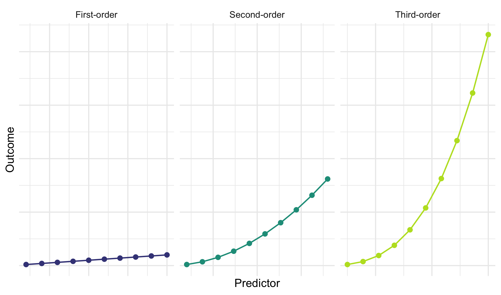

## Slide 6: Training sniffer dogs

Dogs intermittently rewarded with food for vocalizing when sniffing a target stimulus over 500 trials

- `id` indicates the name of the dog (*N* = 167)
- Outcome = vocalizations during 100 trials (`vocalizations`)
- Predictor: type `block` of 100 trials
  - 1 (first block of 100 trials)
  - 2 (second block of 100 trials)
  - 3 (third block of 100 trials)
  - 5 (fifth block of 100 trials)


## Slide 7: The data in R

|     | id                   | block | vocalizations |
|-----|----------------------|-------|---------------|
| 1   | Abbey road heberlein | 1     | 42            |
| 2   | Abbey road heberlein | 2     | 50            |
| 3   | Abbey road heberlein | 3     | 56            |
| 4   | Abbey road heberlein | 5     | 52            |
| 5   | Aldwyn               | 1     | 34            |
| 6   | Aldwyn               | 2     | 44            |
| 7   | Aldwyn               | 3     | 51            |
| 8   | Aldwyn               | 5     | 58            |
| 9   | Alejandro            | 1     | 39            |
| 10  | Alejandro            | 2     | 51            |
| 11  | Alejandro            | 3     | 59            |
| 12  | Alejandro            | 5     | 69            |
| 13  | Allie                | 1     | 38            |
| 14  | Allie                | 2     | 48            |
| 15  | Allie                | 3     | 56            |
| 16  | Allie                | 5     | 61            |
| 17  | Ammie                | 1     | 37            |
| 18  | Ammie                | 2     | 48            |
| 19  | Ammie                | 3     | 54            |
| 20  | Ammie                | 5     | 57            |
| 21  | Arya                 | 1     | 47            |
| 22  | Arya                 | 2     | 58            |
| 23  | Arya                 | 3     | 65            |
| 24  | Arya                 | 5     | 75            |
| 25  | Auntie               | 1     | 38            |
| 26  | Auntie               | 2     | 49            |
| 27  | Auntie               | 3     | 57            |
| 28  | Auntie               | 5     | 67            |
| 29  | Aute                 | 1     | 31            |
| 30  | Aute                 | 2     | 42            |
| 31  | Aute                 | 3     | 51            |
| 32  | Aute                 | 5     | 61            |
| 33  | Aza                  | 1     | 23            |
| 34  | Aza                  | 2     | 34            |
| 35  | Aza                  | 3     | 38            |
| 36  | Aza                  | 5     | 37            |
| 37  | Bacci                | 1     | 37            |
| 38  | Bacci                | 2     | 48            |
| 39  | Bacci                | 3     | 60            |
| 40  | Bacci                | 5     | 73            |
| 41  | Bartlet              | 1     | 45            |
| 42  | Bartlet              | 2     | 56            |
| 43  | Bartlet              | 3     | 67            |
| 44  | Bartlet              | 5     | 85            |
| 45  | Beacon               | 1     | 36            |
| 46  | Beacon               | 2     | 46            |
| 47  | Beacon               | 3     | 53            |
| 48  | Beacon               | 5     | 53            |
| 49  | Belle                | 1     | 42            |
| 50  | Belle                | 2     | 54            |

Table 1: Data for the sniffer dog training (first 50 of 668 rows)

## Slide 8: The data structure

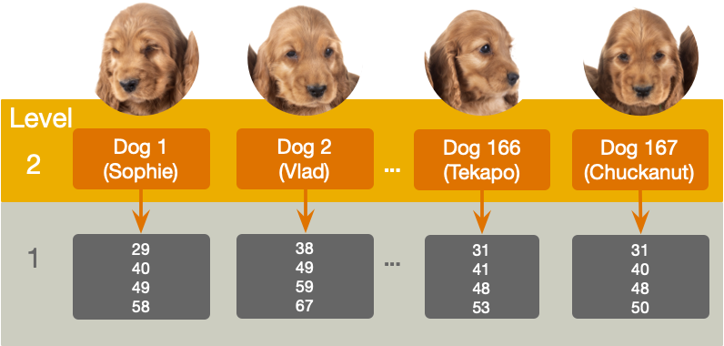

## Slide 9: Random effects

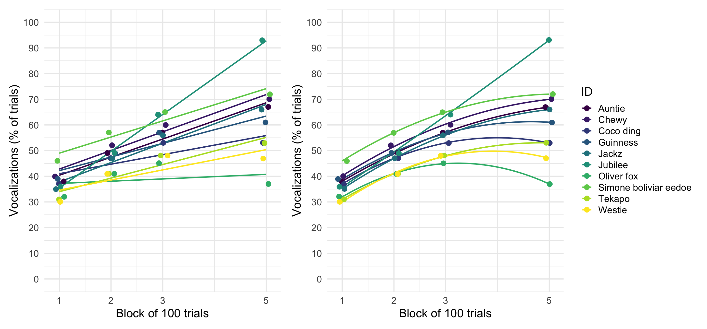

## Slide 10: The multilevel linear growth model

**Tab 1 of 2: Composite model**

``` math
 \begin{aligned} \text{vocalizations}_{ij} =& \left[\gamma_{0} + \gamma_{1}\text{block}_{ij} \right] + \left[\zeta_{0i} +\zeta_{1i}\text{block}_{ij} + \varepsilon_{ij}\right] \end{aligned} 
```

**Tab 2 of 2: The ‘other’ equation**

``` math
 \begin{aligned} \text{vocalizations}_{ij} &= \pi_{0i} + \pi_{1i}\text{block}_{ij} + \varepsilon_{ij} \\ \pi_{0i} &= \gamma_{0} + \zeta_{0i} \\ \pi_{1i} &= \gamma_{1} + \zeta_{1i} \\ \end{aligned} 
```

- $`\gamma_{0}`$ = the average vocalizations when block = 0
- $`\gamma_{1}`$ = the average rate of change of vocalizations (i.e. the amount that vocalizations change as the blocks of trials increase)
- $`\zeta_{0i}`$ = the deviation of a given dog’s vocalisations from the group average when block = 0 (think of the *i* subscript as representing ‘a particular dog’)
- $`\zeta_{1i}`$ = the deviation of a given dog’s rate of change of vocalisations from the average rate of change (again, think of the *i* subscript as representing ‘a particular dog’)
- $`\varepsilon_{ij}`$ = the portion of a given dog’s vocalisations that is unpredicted during trial block *j*.

## Slide 11

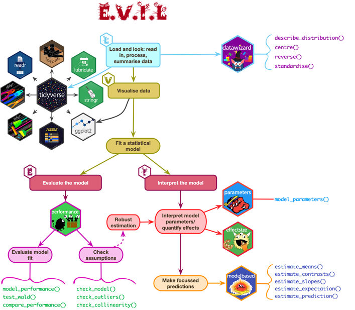

## Slide 12: Load and Look

``` r
train_tib |> 
  group_by(block) |> 
  describe_distribution(select = "vocalizations") |> 
  data_remove("Variable", "n_Missing") |>
  display()
```

| block | Mean  | SD    | IQR | Range          | Skewness | Kurtosis | n   | n_Missing |
|-------|-------|-------|-----|----------------|----------|----------|-----|-----------|
| 1     | 38.47 | 7.05  | 11  | (23.00, 55.00) | 0.03     | -0.50    | 167 | 0         |
| 2     | 48.80 | 6.99  | 10  | (33.00, 66.00) | -0.02    | -0.49    | 167 | 0         |
| 3     | 56.25 | 7.80  | 11  | (38.00, 76.00) | -0.08    | -0.32    | 167 | 0         |
| 5     | 61.79 | 12.95 | 18  | (32.00, 94.00) | -0.06    | -0.18    | 167 | 0         |


## Slide 13: Visualize

``` r
ggplot(train_tib, aes(x = block, y = vocalizations)) +
  geom_point(size = 1, alpha = 0.6, position = position_jitter(width = 0.1, height = 0.1), colour = "#CC6677") +
  geom_smooth(method = "lm", formula = y ~ x, alpha = 0.3, colour  = "#88CCEE", fill  = "#88CCEE") +
  coord_cartesian(ylim = c(0, 100)) + 
  scale_y_continuous(breaks = seq(0, 100, 10)) +
  scale_x_continuous(breaks = c(1, 2, 3, 5)) +
  labs(x = "Blocks of 100 trials", y = "Vocalizations (% of trials)") +
  theme_minimal() 
```

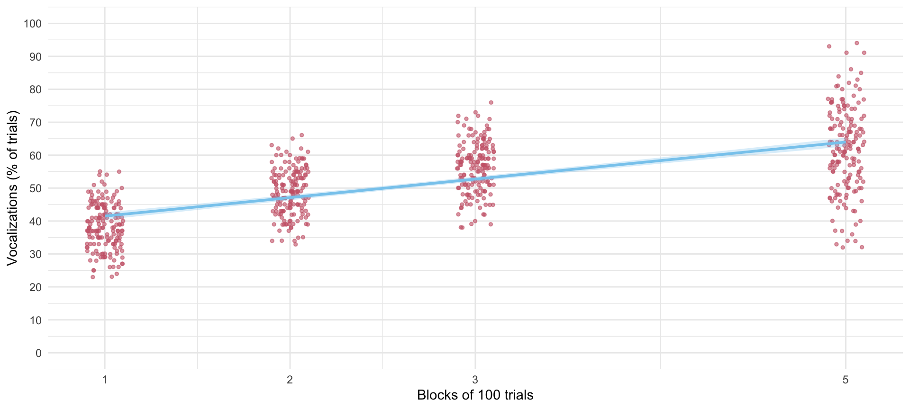


## Slide 14: Fit the model

**Tab 1 of 2: The long way**

``` r
# random intercept only
intcpt_mlm <-glmmTMB(vocalizations ~ 1 + (1|id), data = train_tib)
# add fixed effect of block
block_mlm <- glmmTMB(vocalizations ~ block + (1|id), data = train_tib)
# add random effect of block
blockrs_mlm <- glmmTMB(vocalizations ~ block + (block|id), data = train_tib)
```

**Tab 2 of 2: using update()**

``` r
# random intercept only
intcpt_mlm <- glmmTMB(vocalizations ~ 1 + (1|id), data = train_tib)
# add fixed effect of months
block_mlm <- update(intcpt_mlm, .~. + block)
# add random effect of months
blockrs_mlm <- update(block_mlm, .~  block + (block|id))
```

## Slide 15: Evaluate fit

``` r
test_lrt(intcpt_mlm, block_mlm, blockrs_mlm) |> 
  display()
```

| Name        | Model   | df  | df_diff | Chi2   | p       |
|-------------|---------|-----|---------|--------|---------|
| intcpt_mlm  | glmmTMB | 3   |         |        |         |
| block_mlm   | glmmTMB | 4   | 1       | 709.91 | \< .001 |
| blockrs_mlm | glmmTMB | 6   | 2       | 151.77 | \< .001 |

Likelihood-Ratio-Test (LRT) for Model Comparison (ML-estimator)

> **Important: ReportR**
>
> Adding block to the intercept only model significantly improved the fit, $`\chi^2`$(1) = 709.91, *p* \< 0.001, adding the variability in slopes (and its covariance with intercepts) also significantly improved the fit, $`\chi^2`$(2) = 151.77, *p* \< 0.001.


## Slide 16: Evaluate fit

``` r
model_performance(blockrs_mlm) |> 
  display()
```

| AIC    | AICc   | BIC    | R2 (cond.) | R2 (marg.) | ICC  | RMSE | Sigma |
|--------|--------|--------|------------|------------|------|------|-------|
| 4383.4 | 4383.5 | 4410.4 | 0.90       | 0.44       | 0.81 | 3.23 | 4.06  |

> **Important: ReportR**
>
> Around 81% of the variance in vocalizations was attributable to the dog. The model explained 90% of the variance in vocalizations, and around 44% was attributable to only the fixed effects.


## Slide 17: Evaluate assumptions

``` r
check_model(blockrs_mlm)
```

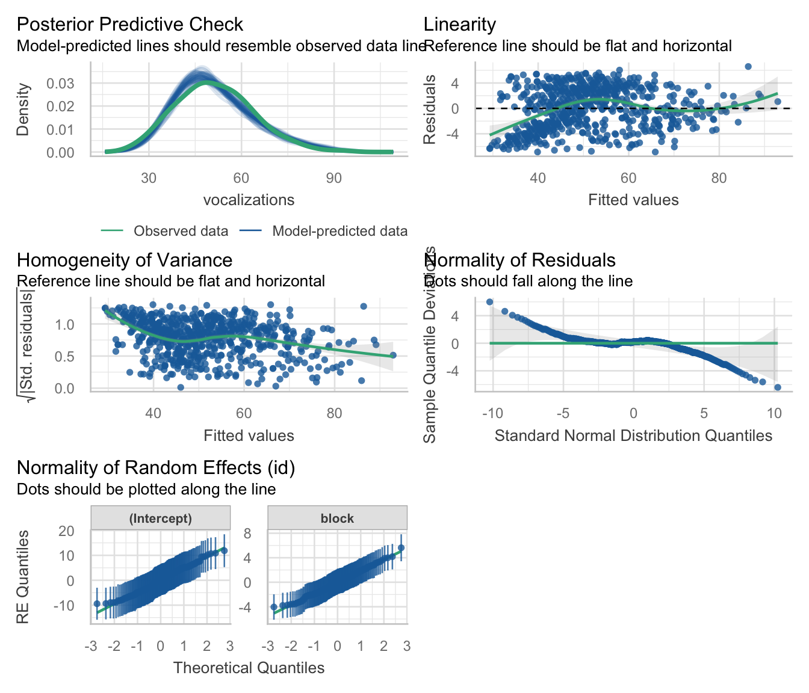

## Slide 18: The multilevel non-linear growth model

``` math
 \begin{aligned} \text{vocalizations}_{ij} =& \left[\gamma_{0} + \gamma_{1}\text{block}_{ij} + \gamma_{2}\text{block}^2_{ij} \right] + \left[\zeta_{0i} +\zeta_{1i}\text{block}_{ij} + \varepsilon_{ij}\right] \end{aligned} 
```

- $`\gamma_{0}`$ = the average vocalizations when block of trials = 0
- $`\gamma_{1}`$ = the average linear rate of change of vocalizations (i.e. the amount that vocalizations change as the blocks of trials increase)
- $`\gamma_{2}`$ = the average non-linear rate of change of vocalizations (i.e. the amount that the slope of vocalizations changes as the blocks of trials increase)
- $`\zeta_{0i}`$ = the deviation of a given dog’s vocalisations from the group average when block = 0 (think of the *i* subscript as representing ‘a particular dog’)
- $`\zeta_{1i}`$ = the deviation of a given dog’s rate of change of vocalisations from the average linear rate of change (again, think of the *i* subscript as representing ‘a particular dog’)
- $`\varepsilon_{ij}`$ = the portion of a given dog’s vocalisations that is unpredicted during trial block *j*.

## Slide 19: Approach 1: Fit as is

- Advantage
  - Parameter estimates represent the change in the rate of change over time. That is, does the change in the outcome over time speed up (positive value) or slow down (negative value)?
- Disadvantage
  - We can’t separate the linear and quadratic trends, they are **highly** collinear

> **Note: Statis-tip**
>
> The collinearity of linear and quadratic trends means that you can’t (usually) have random slopes for both

## Slide 20: Approach 2: Use the poly() function

Transform **block** and **block<sup>2</sup>** so that they are independent, that is, remove the correlation between the predictors before fitting the model

- Advantage
  - You can interpret the linear and quadratic trends separately
- Disadvantage:
  - Parameter estimates have no direct link to the effects they represent

> **Warning: The danger zone!**
>
> For pedagogic reasons we’ll look at both approaches, but choose the **ONE** method that best meets your needs.

## Slide 21: Visualize

``` r
ggplot(train_tib, aes(x = block, y = vocalizations)) +
  geom_point(size = 1, alpha = 0.6, position = position_jitter(width = 0.1, height = 0.1), colour = "#CC6677") +
  geom_smooth(method = "lm", formula = y ~ x, alpha = 0.3, colour  = "#88CCEE", fill  = "#88CCEE") +
  coord_cartesian(ylim = c(0, 100)) + 
  scale_y_continuous(breaks = seq(0, 100, 10)) +
  scale_x_continuous(breaks = c(1, 2, 3, 5)) +
  labs(x = "Blocks of 100 trials", y = "Vocalizations (% of trials)") +
  theme_minimal() 
```


## Slide 22: Visualize

``` r
ggplot(train_tib, aes(x = block, y = vocalizations)) +
  geom_point(size = 1, alpha = 0.6, position = position_jitter(width = 0.1, height = 0.1), colour = "#CC6677") +
  geom_smooth(method = "lm", formula = y ~ x, alpha = 0.3, colour  = "#88CCEE", fill  = "#88CCEE") +
  geom_smooth(method = "lm", formula = y ~ poly(x, 2), alpha = 0.3, colour  = "#DDCC77", fill = "#DDCC77") +
  coord_cartesian(ylim = c(0, 100)) + 
  scale_y_continuous(breaks = seq(0, 100, 10)) +
  scale_x_continuous(breaks = c(1, 2, 3, 5)) +
  labs(x = "Blocks of 100 trials", y = "Vocalizations (% of trials)") +
  theme_minimal() 
```

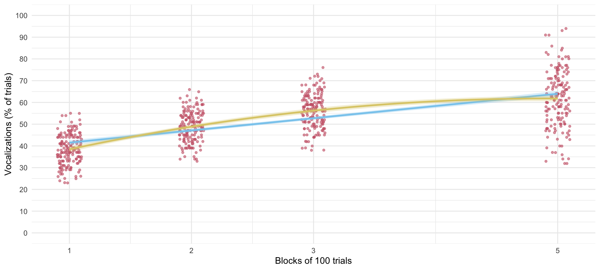


## Slide 23: Approach 1: Fit as is

**Tab 1 of 2: The long way**

``` r
# random intercept only
intcpt_mlm <- glmmTMB(vocalizations ~ 1 + (1|id), data = train_tib)
# add fixed effect of block
block_mlm <- glmmTMB(vocalizations ~ block + (1|id), data = train_tib)
# add random effect of block
blockrs_mlm <- glmmTMB(vocalizations ~ block + (block|id), data = train_tib)
# add the non-linear trend
quad_mlm <- glmmTMB(vocalizations ~ block + I(block^2) + (block|id), data = train_tib)
```

**Tab 2 of 2: using update()**

``` r
# random intercept only
intcpt_mlm <- glmmTMB(vocalizations ~ 1 + (1|id), data = train_tib)
# add fixed effect of months
block_mlm <- update(intcpt_mlm, .~. + block)
# add random effect of months
blockrs_mlm <- update(block_mlm, .~  block + (block|id))
# add the non-linear trend
quad_mlm <- update(blockrs_mlm, .~. + I(block^2) + (block|id))
```

## Slide 24: Evaluate fit

``` r
test_lrt(intcpt_mlm, block_mlm, blockrs_mlm, quad_mlm) |> 
  display()
```

| Name        | Model   | df  | df_diff | Chi2   | p       |
|-------------|---------|-----|---------|--------|---------|
| intcpt_mlm  | glmmTMB | 3   |         |        |         |
| block_mlm   | glmmTMB | 4   | 1       | 709.91 | \< .001 |
| blockrs_mlm | glmmTMB | 6   | 2       | 151.77 | \< .001 |
| quad_mlm    | glmmTMB | 7   | 1       | 714.75 | \< .001 |

Likelihood-Ratio-Test (LRT) for Model Comparison (ML-estimator)

> **Important: ReportR**
>
> Adding block to the intercept only model significantly improved the fit, $`\chi^2`$(1) = 709.91, *p* \< 0.001, adding the variability in slopes (and its covariance with intercepts) also significantly improved the fit, $`\chi^2`$(2) = 151.77, *p* \< 0.001. Finally, adding the quadratic effect of block significantly improved the fit, $`\chi^2`$(1) = 714.75, *p* \< 0.001,


## Slide 25: Evaluate fit

``` r
model_performance(quad_mlm) |> 
  display()
```

| AIC    | AICc   | BIC    | R2 (cond.) | R2 (marg.) | ICC  | RMSE | Sigma |
|--------|--------|--------|------------|------------|------|------|-------|
| 3670.6 | 3670.8 | 3702.2 | 0.99       | 0.48       | 0.98 | 1.00 | 1.39  |

> **Important: ReportR**
>
> Around 98% of the variance in vocalizations was attributable to the dog. The model explained 99% of the variance in vocalizations, and around 48% was attributable to only the fixed effects.


## Slide 26: Evaluate assumptions

``` r
check_model(quad_mlm)
```

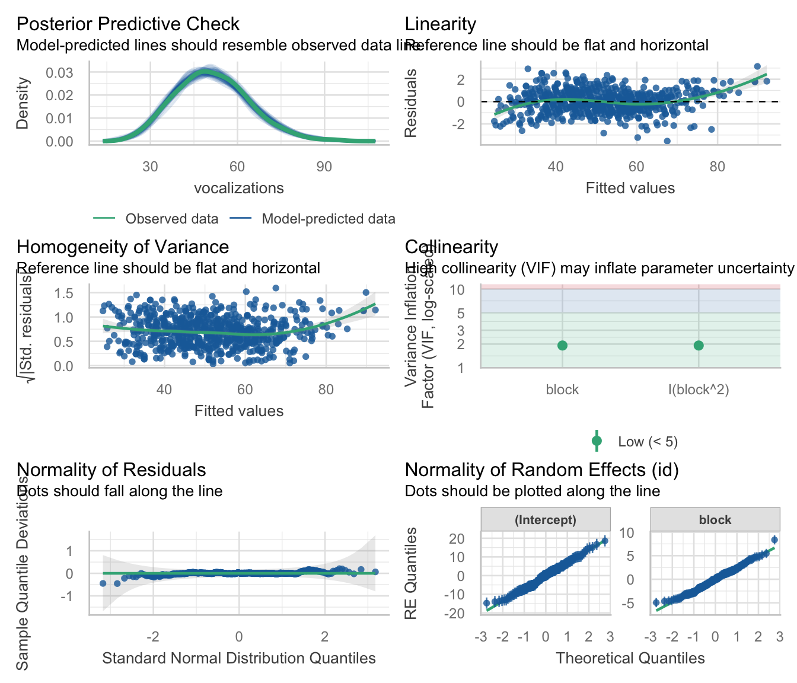

## Slide 27: Interpret random effects

``` r
model_parameters(quad_mlm, effects = "random") |> 
  display()
```

| Parameter                 | Coefficient | 95% CI |
|---------------------------|-------------|--------|
| SD (Intercept: id)        | 6.99        |        |
| SD (block: id)            | 2.47        |        |
| Cor (Intercept~block: id) | -0.31       |        |
| SD (Residual)             | 1.39        |        |

Random Effects

> **Important: ReportR**
>
> There was non-zero variability in intercepts and slopes. The estimate of standard deviation of intercepts across dogs was $`\hat{\sigma}_{u_0}`$ = 6.99, the standard deviation of slopes across dogs was $`\hat{\sigma}_{u_\text{block}}`$ = 2.47, and the residual standard deviation was $`\sigma`$ = 1.39. The estimated correlation between slopes and intercepts was $`r_{u_0, u_\text{block}}`$ = -0.31 suggesting that dogs with large intercepts tended to have smaller slopes.


## Slide 28: Interpret fixed effects

``` r
model_parameters(quad_mlm, effects = "fixed") |> 
  display()
```

| Parameter   | Coefficient | SE   | 95% CI         | z      | p       |
|-------------|-------------|------|----------------|--------|---------|
| (Intercept) | 25.01       | 0.59 | (23.85, 26.17) | 42.12  | \< .001 |
| block       | 14.96       | 0.27 | (14.43, 15.49) | 55.46  | \< .001 |
| block^2     | -1.52       | 0.03 | (-1.58, -1.46) | -50.05 | \< .001 |

Fixed Effects

> **Important: ReportR**
>
> The overall linear effect of training block on vocalizations was significant, $`\hat{\gamma}`$ = 14.96 (14.43, 15.49), *z* = 55.46, *p* \< 0.001, but so was the quadratic trend, $`\hat{\gamma}`$ = -1.52 (-1.58, -1.46), *z* = -50.05, *p* \< 0.001. The fact that the parameter estimate for the quadratic trend is negative shows that the rate of change is slowing down. That is, as the number of training blocks goes up, the rate at which vocalizations increase goes down


## Slide 29: Interpret the non-linear effect

``` r
estimate_slopes(quad_mlm, by = list(block = c(1, 2, 3, 5))) |> 
  data_remove("SE") |> 
  display()
```

| block | Slope | 95% CI         | z     | p       |
|-------|-------|----------------|-------|---------|
| 1     | 11.92 | (11.47, 12.38) | 51.40 | \< .001 |
| 2     | 8.88  | ( 8.48, 9.28)  | 43.23 | \< .001 |
| 3     | 5.84  | ( 5.45, 6.22)  | 29.96 | \< .001 |
| 5     | -0.25 | (-0.69, 0.20)  | -1.09 | 0.274   |

Estimated Marginal Effects

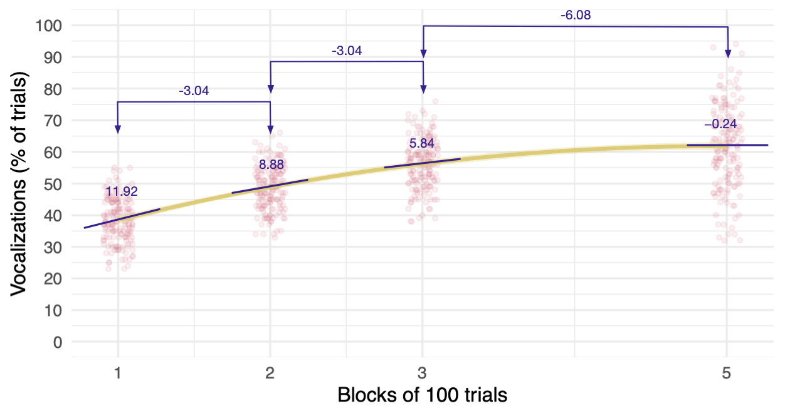

## Slide 30: Approach 2: Use poly()

> **Note: Statis-tip**
>
> `poly()` takes this form:
>
> ``` r
> poly(variable, order)
> ```
>
> - To specify a linear (first-order) polynomial we’d use `poly(block, 1)`
> - To specify linear and quadratic (second-order) polynomial we’d use `poly(block, 2)`

``` r
# random intercept only
incpt_mlm <-glmmTMB(vocalizations ~ 1 + (1|id), data = train_tib)
# add fixed effects of the linear and quadratic trends
poly_mlm <- glmmTMB(vocalizations ~ poly(block, 2) + (1|id), data = train_tib)
# add random effect of the linear trend
polyrs_mlm <- glmmTMB(vocalizations ~ poly(block, 2) + (poly(block, 1)|id), data = train_tib)
# add random effect of the non-linear trend
polyrs2_mlm <- glmmTMB(vocalizations ~ poly(block, 2) + (poly(block, 2)|id), data = train_tib)
```

> **Note: Statis-tip**
>
> There isn’t much value to using update because of the changing random effects

## Slide 31: Evaluate fit

``` r
test_lrt(intcpt_mlm, poly_mlm, polyrs_mlm, polyrs2_mlm) |> 
  display()
```

| Name        | Model   | df  | df_diff | Chi2   | p       |
|-------------|---------|-----|---------|--------|---------|
| intcpt_mlm  | glmmTMB | 3   |         |        |         |
| poly_mlm    | glmmTMB | 5   | 2       | 909.83 | \< .001 |
| polyrs_mlm  | glmmTMB | 7   | 2       | 666.59 | \< .001 |
| polyrs2_mlm | glmmTMB | 10  | 3       | 511.04 | \< .001 |

Likelihood-Ratio-Test (LRT) for Model Comparison (ML-estimator)

> **Important: ReportR**
>
> Adding block to the intercept only model significantly improved the fit, $`\chi^2`$(2) = 909.83, *p* \< 0.001, adding the variability in slopes (and its covariance with intercepts) also significantly improved the fit, $`\chi^2`$(2) = 666.59, *p* \< 0.001. Finally, adding the quadratic effect of block significantly improved the fit, $`\chi^2`$(3) = 511.04, *p* \< 0.001,


## Slide 32: Evaluate fit

``` r
model_performance(polyrs2_mlm) |> 
  display()
```

| AIC    | AICc   | BIC    | R2 (cond.) | R2 (marg.) | ICC  | RMSE | Sigma |
|--------|--------|--------|------------|------------|------|------|-------|
| 3165.6 | 3165.9 | 3210.6 | 1.00       | 0.53       | 0.99 | 0.42 | 0.62  |

> **Important: ReportR**
>
> Around 99% of the variance in vocalizations was attributable to the dog. The model explained 100% of the variance in vocalizations, and around 53% was attributable to only the fixed effects.


## Slide 33: Evaluate assumptions

``` r
check_model(polyrs2_mlm)
```

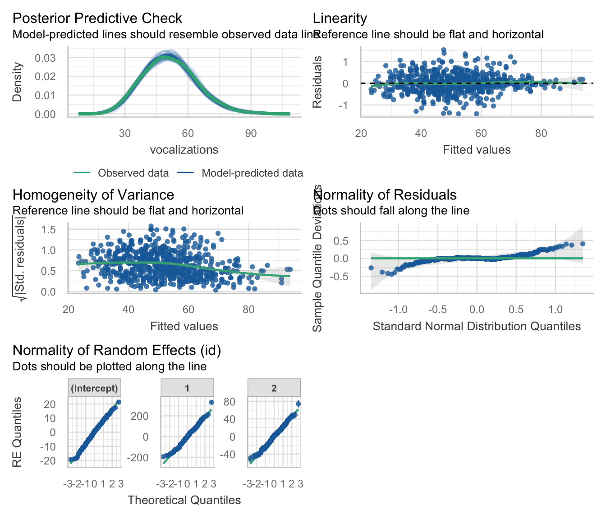

## Slide 34: Interpret random effects

``` r
model_parameters(polyrs2_mlm, effects = "random") |> 
  display()
```

| Parameter             | Coefficient | 95% CI |
|-----------------------|-------------|--------|
| SD (Intercept: id)    | 8.15        |        |
| SD (1: id)            | 95.89       |        |
| SD (2: id)            | 22.80       |        |
| Cor (Intercept~1: id) | 0.56        |        |
| Cor (Intercept~2: id) | 0.68        |        |
| Cor (1~2: id)         | 0.98        |        |
| SD (Residual)         | 0.62        |        |

Random Effects

> **Important: ReportR**
>
> There was non-zero variability in intercepts and slopes. The estimate of standard deviation of intercepts across dogs was $`\hat{\sigma}_{u_0}`$ = 8.15, the standard deviation of linear slopes across dogs was $`\hat{\sigma}_{u_\text{linear}}`$ = 95.89, the standard deviation of non-linear slopes across dogs was $`\hat{\sigma}_{u_\text{quadratic}}`$ = 22.80, and the residual standard deviation was $`\sigma`$ = 0.62. The estimated correlation between linear slopes and intercepts was $`r_{u_0, u_\text{linear}}`$ = 0.56, and between non-linear slopes and intercepts was $`r_{u_0, u_\text{quadratic}}`$ = 0.68 suggesting that dogs with large intercepts tended to have larger slopes. Linear and quadratic slopes were almost perfectly correlated, $`r_{u_\text{linear}, u_\text{quadratic}}`$ = 0.98.


## Slide 35: Interpret fixed effects

``` r
model_parameters(polyrs2_mlm, effects = "fixed") |> 
  display()
```

| Parameter          | Coefficient | SE   | 95% CI           | z      | p       |
|--------------------|-------------|------|------------------|--------|---------|
| (Intercept)        | 51.33       | 0.63 | (50.09, 52.56)   | 81.36  | \< .001 |
| block (1st degree) | 214.78      | 7.45 | (200.19, 229.38) | 28.85  | \< .001 |
| block (2nd degree) | -69.70      | 1.87 | (-73.37, -66.04) | -37.28 | \< .001 |

Fixed Effects

> **Important: ReportR**
>
> The overall linear effect of training block on vocalizations was significant, $`\hat{\gamma}`$ = 214.78 (200.19, 229.38), *z* = 28.85, *p* \< 0.001, but so was the quadratic trend, $`\hat{\gamma}`$ = -69.70 (-73.37, -66.04), *z* = -37.28, *p* \< 0.001. The fact that the parameter estimate for the quadratic trend is negative shows that the rate of change is slowing down. That is, as the number of training blocks goes up, the rate at which vocalizations increase goes down


## Slide 36: Predictors of growth: exercise and well being

- Exercise can benefit mental health<sup>1</sup>.
- Participants randomly allocated to three exercise classes per week that combine walking, yoga, strength and conditioning (*N* = 74) or a wait list (*N* = 67)
- `id`: the participant identifier
- Outcome:
  - `wemwbs`: the Warwick-Edinburgh Mental Wellbeing Scale (Tennant et al., 2007). Scores can range from 14 to 70.
- Predictors
  - `intervention`: wait list or exercise
  - `time_num`: months since the intervention

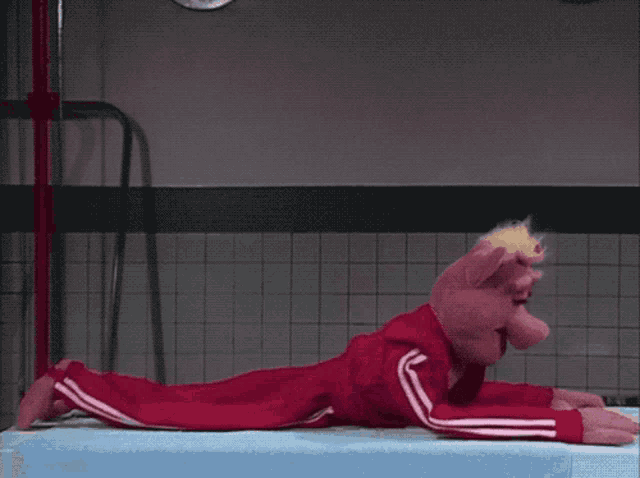

*Footnotes*

1.  Noetel et al. (2024). Effect of exercise for depression: systematic review and network meta-analysis of randomised controlled trials. BMJ. doi: [10.1136/bmj-2023-075847](https://www.bmj.com/content/384/bmj-2023-075847)

## Slide 37: The data in R

|     | id    | intervention | time     | time_num | wemwbs |
|-----|-------|--------------|----------|----------|--------|
| 1   | tp52h | Exercise     | Baseline | 0        | 51     |
| 2   | bm95v | Exercise     | Baseline | 0        | 27     |
| 3   | lj12s | Exercise     | Baseline | 0        | 30     |
| 4   | jb38i | Wait list    | Baseline | 0        | 46     |
| 5   | xt29u | Wait list    | Baseline | 0        | 42     |
| 6   | ep42w | Exercise     | Baseline | 0        | 42     |
| 7   | po11r | Wait list    | Baseline | 0        | 31     |
| 8   | nz76p | Exercise     | Baseline | 0        | 41     |
| 9   | xk33a | Exercise     | Baseline | 0        | 43     |
| 10  | mp79j | Exercise     | Baseline | 0        | 41     |
| 11  | bn80s | Exercise     | Baseline | 0        | 28     |
| 12  | ew74n | Wait list    | Baseline | 0        | 46     |
| 13  | sj98c | Exercise     | Baseline | 0        | 42     |
| 14  | rd08x | Wait list    | Baseline | 0        | 45     |
| 15  | kl35b | Wait list    | Baseline | 0        | 50     |
| 16  | my53c | Exercise     | Baseline | 0        | 29     |
| 17  | pz28t | Exercise     | Baseline | 0        | 40     |
| 18  | sh45y | Exercise     | Baseline | 0        | 33     |
| 19  | qq12p | Exercise     | Baseline | 0        | 50     |
| 20  | vp35h | Exercise     | Baseline | 0        | 29     |
| 21  | wn12n | Exercise     | Baseline | 0        | 36     |
| 22  | ke94r | Exercise     | Baseline | 0        | 40     |
| 23  | uk77y | Wait list    | Baseline | 0        | 34     |
| 24  | xk81s | Exercise     | Baseline | 0        | 37     |
| 25  | da01h | Wait list    | Baseline | 0        | 45     |
| 26  | vu13w | Wait list    | Baseline | 0        | 45     |
| 27  | bf46r | Exercise     | Baseline | 0        | 42     |
| 28  | ym45g | Wait list    | Baseline | 0        | 45     |
| 29  | xo48d | Exercise     | Baseline | 0        | 51     |
| 30  | ab28b | Wait list    | Baseline | 0        | 49     |
| 31  | gs39n | Wait list    | Baseline | 0        | 46     |
| 32  | lu56h | Exercise     | Baseline | 0        | 50     |
| 33  | hr72a | Exercise     | Baseline | 0        | 45     |
| 34  | gr17c | Wait list    | Baseline | 0        | 51     |
| 35  | hw76g | Wait list    | Baseline | 0        | 29     |
| 36  | gk28l | Wait list    | Baseline | 0        | 34     |
| 37  | qc49p | Wait list    | Baseline | 0        | 31     |
| 38  | eg52f | Wait list    | Baseline | 0        | 48     |
| 39  | uj03v | Exercise     | Baseline | 0        | 34     |
| 40  | jr96f | Exercise     | Baseline | 0        | 40     |
| 41  | ts56w | Wait list    | Baseline | 0        | 47     |
| 42  | me06w | Exercise     | Baseline | 0        | 41     |
| 43  | ck82i | Wait list    | Baseline | 0        | 42     |
| 44  | jq67e | Wait list    | Baseline | 0        | 28     |
| 45  | go74d | Wait list    | Baseline | 0        | 46     |
| 46  | iy84p | Wait list    | Baseline | 0        | 28     |
| 47  | jg54i | Wait list    | Baseline | 0        | 31     |
| 48  | mc92z | Wait list    | Baseline | 0        | 48     |
| 49  | mg65i | Exercise     | Baseline | 0        | 38     |
| 50  | hg91v | Wait list    | Baseline | 0        | 51     |

Table 2: Data for the exercise intervention (first 50 of 564 rows)

## Slide 38: The data structure

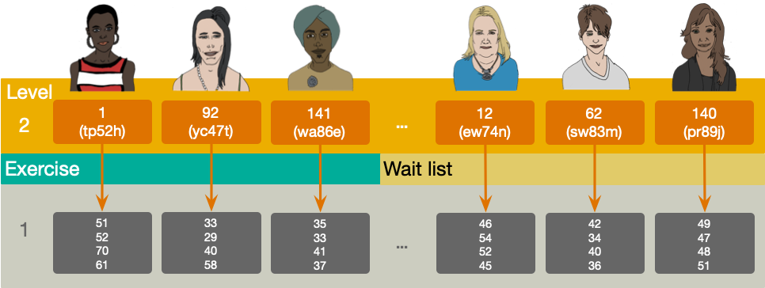

## Slide 39: Random effects

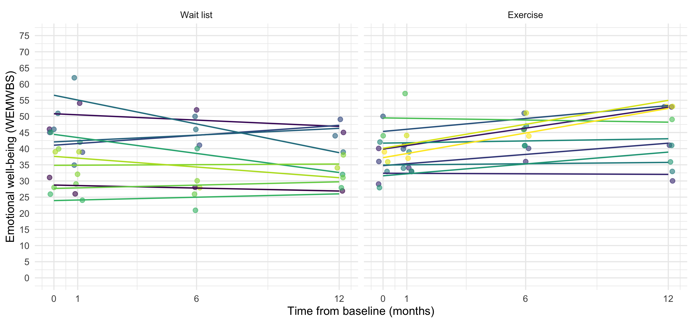

## Slide 40: The multilevel linear growth model

**Tab 1 of 2: Composite model**

``` math
 \begin{aligned} \text{WEMWBS}_{ij} =& \left[\gamma_{0} + \gamma_{1}\text{time}_{ij} + \gamma_{2}\text{intervention}_{i} + \gamma_{3}\left(\text{intervention}_{i} \times \text{time}_{ij}\right) \right] + \\ \quad &\left[\zeta_{0i} +\zeta_{1i}\text{time}_{ij} + \varepsilon_{ij}\right] \end{aligned} 
```

**Tab 2 of 2: The ‘other’ equation**

``` math
 \begin{aligned} \text{WEMWBS}_{ij} &= \pi_{0i} + \pi_{1i}\text{time}_{ij} + \varepsilon_{ij} \\ \pi_{0i} &= \gamma_{0} + \gamma_{2}\text{intervention}_{i} + \zeta_{0i} \\ \pi_{1i} &= \gamma_{1} + \gamma_{3}\text{intervention}_{i} + \zeta_{1i} \\ \end{aligned} 
```

- $`\gamma_{0}`$ = the average well-being score (WEMWBS) at baseline (time = 0) in the wait-list group (i.e. when intervention = 0)
- $`\gamma_{1}`$ = the average rate of change of well-being scores (i.e. the amount that WEMWBS changes as the time increases by a unit) in the wait-list group
- $`\hat{\gamma}_{2}`$ = the average baseline difference in WEMWBS scores between wait-list and exercise groups
- $`\hat{\gamma}_{3}`$ = the average difference in the rate of change of WEMWBS scores in the exercise group compared to the wait list
- $`\zeta_{0i}`$ = the deviation of a given person’s WEMWBS from the group average at baseline
- $`\zeta_{1i}`$ = the deviation of a given person’s rate of change of WEMWBS from the average rate of change
- $`\varepsilon_{ij}`$ = the portion individual’s wellbeing score that is unpredicted at time *j*.

## Slide 41: Load and Look

``` r
exercise_tib |> 
  group_by(time, intervention) |> 
  describe_distribution(select = "wemwbs") |> 
  data_remove(c("Variable", "n_Missing")) |>
  display()
```

| time      | intervention | Mean  | SD    | IQR   | Range          | Skewness | Kurtosis | n   |
|-----------|--------------|-------|-------|-------|----------------|----------|----------|-----|
| Baseline  | Wait list    | 39.97 | 7.91  | 15.00 | (26.00, 52.00) | -0.25    | -1.27    | 67  |
| 1 month   | Wait list    | 40.60 | 9.67  | 15.00 | (21.00, 62.00) | -0.06    | -0.66    | 67  |
| 6 months  | Wait list    | 38.69 | 10.19 | 14.00 | (15.00, 58.00) | -0.31    | -0.38    | 67  |
| 12 months | Wait list    | 37.03 | 9.95  | 15.00 | (15.00, 58.00) | -0.04    | -0.55    | 67  |
| Baseline  | Exercise     | 37.86 | 7.60  | 11.50 | (26.00, 51.00) | 0.20     | -1.09    | 74  |
| 1 month   | Exercise     | 39.88 | 8.76  | 12.25 | (23.00, 59.00) | 0.31     | -0.78    | 74  |
| 6 months  | Exercise     | 43.74 | 10.30 | 15.00 | (28.00, 70.00) | 0.66     | -0.08    | 74  |
| 12 months | Exercise     | 44.26 | 10.80 | 17.00 | (21.00, 68.00) | -0.17    | -0.60    | 74  |


## Slide 42: Visualize

``` r
ggplot(exercise_tib, aes(time_num, wemwbs, colour = intervention, fill = intervention)) +
  geom_point(size = 1, alpha = 0.6, position = position_jitter(width = 0.2, height = 0.1)) +
  geom_smooth(method = "lm", alpha = 0.3) +
  coord_cartesian(ylim = c(0, 75)) +
  scale_y_continuous(breaks = seq(0, 75, 5)) +
  scale_x_continuous(breaks = c(0, 1, 6, 12), labels = c("0", "1", "6", "12")) +
  scale_colour_viridis_d(begin = 0.3, end = 0.85) +
  scale_fill_viridis_d(begin = 0.3, end = 0.85) +
  labs(x = "Time from baseline (months)", y = "Emotional well-being (WEMWBS)", colour = "Intervention", fill = "Intervention") +
  theme_minimal(base_size = 16) 
```

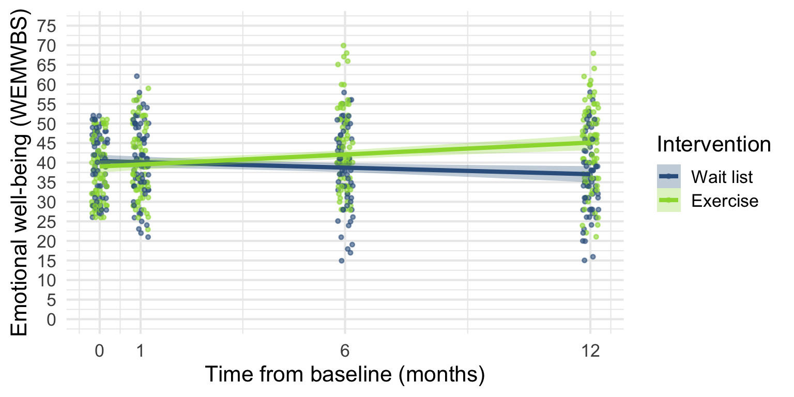


## Slide 43: Fit the model

**Tab 1 of 2: The long way**

``` r
# random intercept only
incpt_mlm <- glmmTMB(wemwbs ~ 1 + (1|id), data = exercise_tib)
# add fixed effect of time
time_mlm <- glmmTMB(wemwbs ~ time_num + (1|id), data = exercise_tib)
# add random slope for time
timers_mlm <- glmmTMB(wemwbs ~ time_num + (time_num|id), data = exercise_tib)
# add fixed effect of intervention
ex_mlm <- glmmTMB(wemwbs ~ time_num + intervention + (time_num|id), data = exercise_tib)
# add fixed effect of the time by intervention interaction
int_mlm <- glmmTMB(wemwbs ~ time_num + intervention + time_num:intervention + (time_num|id), data = exercise_tib)
```

**Tab 2 of 2: using update()**

``` r
# random intercept only
incpt_mlm <-glmmTMB(wemwbs ~ 1 + (1|id), data = exercise_tib)
# add fixed effect of time
time_mlm <- update(intcpt_mlm, .~. + block)
# add random effect of time
timers_mlm <- update(block_mlm, .~  block + (block|id))
# add fixed effect of intervention
ex_mlm <- update(timers_mlm, .~. + intervention)
# add fixed effect of the time by intervention interaction
int_mlm <- update(ex_mlm, .~. + time_num:intervention)
```

## Slide 44: Evaluate fit

``` r
test_lrt(incpt_mlm, time_mlm, timers_mlm, ex_mlm, int_mlm) |> 
  display()
```

| Name       | Model   | df  | df_diff | Chi2  | p       |
|------------|---------|-----|---------|-------|---------|
| incpt_mlm  | glmmTMB | 3   |         |       |         |
| time_mlm   | glmmTMB | 4   | 1       | 6.63  | 0.010   |
| timers_mlm | glmmTMB | 6   | 2       | 34.76 | \< .001 |
| ex_mlm     | glmmTMB | 7   | 1       | 0.16  | 0.693   |
| int_mlm    | glmmTMB | 8   | 1       | 43.14 | \< .001 |

Likelihood-Ratio-Test (LRT) for Model Comparison (ML-estimator)

> **Important: ReportR**
>
> Adding time to the intercept only model significantly improved the fit, $`\chi^2`$(1) = 6.63, *p* = 0.010, adding the variability in slopes (and its covariance with intercepts) also significantly improved the fit, $`\chi^2`$(2) = 34.76, *p* \< 0.001. Adding the main effect of intervention did not significantly improve the fit, $`\chi^2`$(1) = 0.16, *p* = 0.693, but adding the interaction of time and intervention did, $`\chi^2`$(1) = 43.14, *p* \< 0.001.


## Slide 45: Evaluate fit

``` r
model_performance(int_mlm) |> 
  display()
```

| AIC    | AICc   | BIC    | R2 (cond.) | R2 (marg.) | ICC  | RMSE | Sigma |
|--------|--------|--------|------------|------------|------|------|-------|
| 3828.0 | 3828.2 | 3862.6 | 0.73       | 0.06       | 0.71 | 4.19 | 5.03  |

> **Important: ReportR**
>
> Around 71% of the variance in well being was attributable to the individual. The model explained 73% of the variance in well being, and around 6% was attributable to only the fixed effects.


## Slide 46: Evaluate assumptions

``` r
check_model(int_mlm)
```

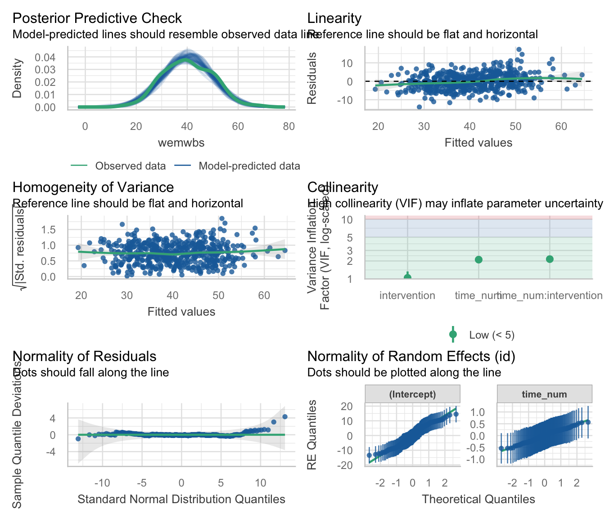

## Slide 47: Interpret random effects

``` r
model_parameters(int_mlm, effects = "random") |> 
  display()
```

| Parameter                    | Coefficient | 95% CI |
|------------------------------|-------------|--------|
| SD (Intercept: id)           | 7.38        |        |
| SD (time_num: id)            | 0.39        |        |
| Cor (Intercept~time_num: id) | 0.08        |        |
| SD (Residual)                | 5.03        |        |

Random Effects

> **Important: ReportR**
>
> There was non-zero variability in intercepts and slopes. The estimate of standard deviation of intercepts across participants was $`\hat{\sigma}_{u_0}`$ = 7.38, the standard deviation of slopes across participants was $`\hat{\sigma}_{u_\text{time}}`$ = 0.39, and the residual standard deviation was $`\sigma`$ = 5.03. The estimated correlation between slopes and intercepts was $`r_{u_0, u_\text{time}}`$ = 0.08 suggesting very little relationship between slopes and intercepts.


## Slide 48: Interpret fixed effects

``` r
model_parameters(int_mlm, effects = "fixed") |> 
  display()
```

| Parameter | Coefficient | SE | 95% CI | z | p |
|----|----|----|----|----|----|
| (Intercept) | 40.39 | 1.00 | (38.43, 42.36) | 40.35 | \< .001 |
| time num | -0.28 | 0.08 | (-0.44, -0.12) | -3.47 | \< .001 |
| intervention (Exercise) | -1.37 | 1.38 | (-4.08, 1.34) | -0.99 | 0.320 |
| time num × intervention (Exercise) | 0.79 | 0.11 | (0.57, 1.00) | 7.10 | \< .001 |

Fixed Effects

> **Important: ReportR**
>
> Wellbeing changed significantly over time, $`\hat{\gamma}`$ = -0.28 (-0.44, -0.12), *z* = -3.47, *p* \< 0.001, but this change over time was significantly different in the exercise and wait list groups, $`\hat{\gamma}`$ = 0.79 (0.57, 1.00), *z* = 7.10, *p* \< 0.001.


## Slide 49: Interpret simple slopes

``` r
estimate_slopes(model = int_mlm, trend = "time_num", by = "intervention") |> 
  display()
```

| intervention | Slope | SE   | 95% CI         | z     | p       |
|--------------|-------|------|----------------|-------|---------|
| Wait list    | -0.28 | 0.08 | (-0.44, -0.12) | -3.47 | \< .001 |
| Exercise     | 0.51  | 0.08 | ( 0.36, 0.66)  | 6.66  | \< .001 |

Estimated Marginal Effects

> **Important: ReportR**
>
> Wellbeing changed significantly over time,$`\hat{\gamma}`$ = -0.28 (-0.44, -0.12), *z* = -3.47, *p* \< 0.001, but this change over time was significantly different in the exercise and wait list groups, $`\hat{\gamma}`$ = 0.79 (0.57, 1.00), *z* = 7.10, *p* \< 0.001. Simple slopes analysis revealed that in the wait list wellbeing significantly decreased over time, $`\hat{\gamma}`$ = -0.28 (-0.44, -0.12), *z* = -3.47, *p* \< 0.001, whereas for the exercise group it significantly increased over time, $`\hat{\gamma}`$ = 0.51 (0.36, 0.66), *z* = 6.66, *p* \< 0.001.

``` math
 \begin{aligned} \gamma_\text{interaction} &= \gamma_\text{time (exercise)} - \gamma_\text{time (wait list)} \\ &= 0.51 - (-0.28) \\ &= 0.79 \end{aligned} 
```


## Slide 50: To sum up …

- A common form of repeated-measures data comes from longitudinal studies
- Growth models quantify change over time
- Can factor in between-participant measures
- Multilevel models
  - Treat observations as nested within entities
  - Allow you model individual differences in growth
  - Allow you to look at different covariance structures
  - Cope with missing data
  - Can model non-linear growth
