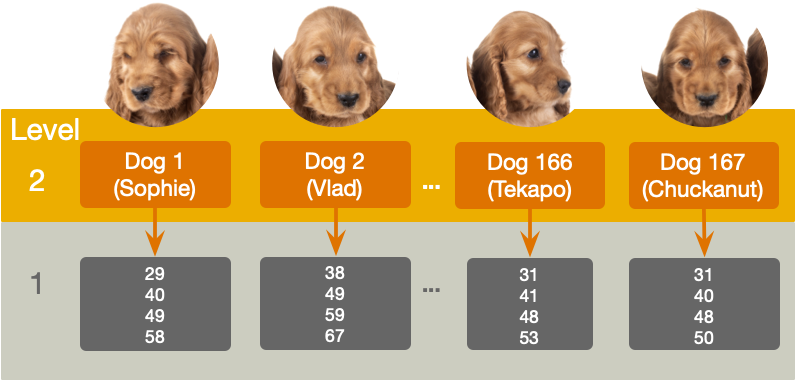
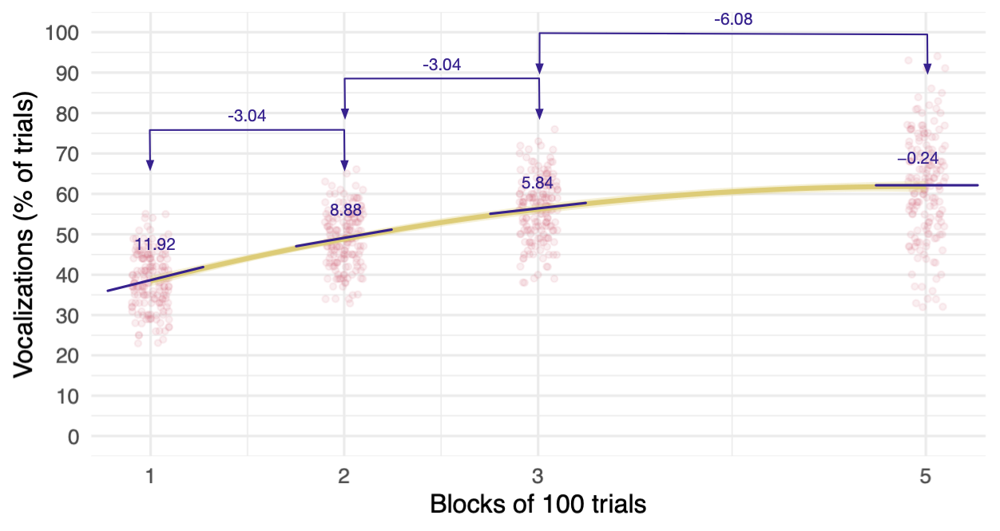
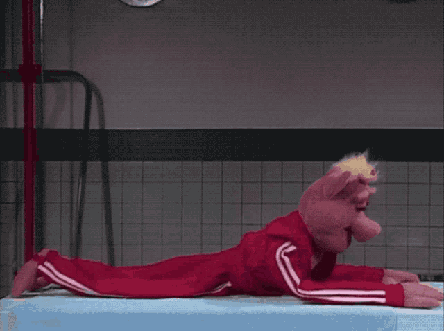
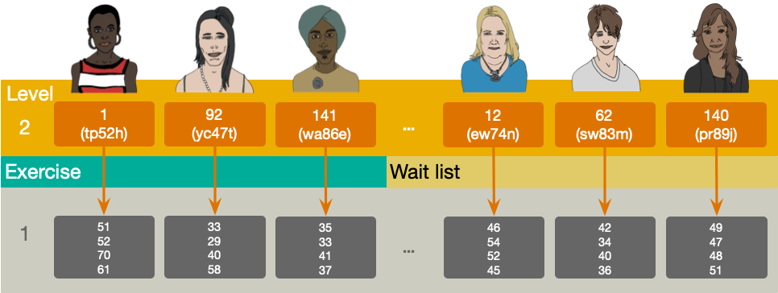

```{r}
# general
library(easystats)
library(tidyverse)
# specific
library(glmmTMB)
library(patchwork)

source("../helpers/discovr_helpers.R")
source("../helpers/easystats_helpers.R")


train_tib <- discovr::dog_training
exercise_tib <- discovr::exercise

```


##  Learning outcomes 

::: incremental

- Describe what a growth model is
- Describe what an autoregressive covariance structure is
- Distinguish fixed from random effects
- Be able to interpret a growth model

:::

::: notes
Use C to toggle pen/markup
Use backspace to delete markup
Use f to toggle fullscreen
:::


## 

::: r-stack
{.fragment fig-align="center" width="1050" height="594"}

{.fragment fig-align="center" width="1050" height="594"}
:::

## Examples of growth models 

Growth models look at the rate of change of a variable over time

::: incremental

- Depression over 8 weeks of treatment
- Back pain over 10 weeks of physiotherapy
- Profits over months of the year
- Radioactive decay

:::

## Types of growth curve 


```{r}
#| fig-width: 11
#| fig-height: 6.5

data_tib <- tibble::tibble(
  x = c(1:10, seq(1, 9, 8/9), seq(1, 6, 5/9)),
  power = c(rep(1, 10), rep(2, 10), rep(3, 10)),
  poly = gl(3, 10, labels= c("First-order", "Second-order", "Third-order")),
  outcome = x**power
)

ggplot(data_tib, aes(x, outcome, colour = poly)) +
  geom_point(size = 3) +
  geom_line(linewidth = 1) +
  labs(x = "Predictor", y = "Outcome", colour = "Polynomial") +
  facet_wrap(~poly, scale = "free_x") +
  scale_colour_manual(values = viridis_3) +
  theme_minimal(base_size = 18) +
  theme(axis.text.x = element_blank(), axis.text.y = element_blank(), legend.position = "none")
```

## Training sniffer dogs


Dogs intermittently rewarded with food for vocalizing when sniffing a target stimulus over 500 trials

- `id` indicates the name of the dog (*N* = 167)
- Outcome = vocalizations during 100 trials (`vocalizations`)
- Predictor: type `block` of 100 trials
  - 1 (first block of 100 trials)
  - 2 (second block of 100 trials)
  - 3 (third block of 100 trials)
  - 5 (fifth block of 100 trials)


{fig-align="center" height=250}

## The data in `r rproj()`

```{r}
train_tib|> 
  DT::datatable(caption = 'Table 1: Data for the sniffer dog training',
                options = list(
                dom = 'tp',
                columnDefs = list(
                  list(className = 'dt-center', targets = 1:3)
                  ),
                pageLength = 10
  )
  )
```

## The data structure 


{fig-align="center" width=1000}

## Random effects

```{r}
#| fig-width: 15
#| fig-height: 7

set.seed(616)
ids <- unique(train_tib$id) |>  sample(size = 10)

trainingrslin_gg <- train_tib |> 
  filter(id %in% ids) |> 
  ggplot2::ggplot(data = _, aes(x = block, y = vocalizations, colour = id)) +
    geom_smooth(method = "lm", formula = y ~ x, se = F, linewidth = 1) +
    geom_point(size = 3, position = position_jitter(width = 0.1, height = 0.1)) +
    coord_cartesian(ylim = c(0, 100)) + 
    scale_y_continuous(breaks = seq(0, 100, 10)) +
    scale_x_continuous(breaks = c(1, 2, 3, 5)) +
  scale_colour_viridis_d() +
    labs(x = "Block of 100 trials", y = "Vocalizations (% of trials)", colour = "ID") +
    theme_minimal(base_size = 18) +
  theme(legend.position = "none")


trainingrsquad_gg <- train_tib |> 
  filter(id %in% ids) |> 
  ggplot2::ggplot(data = _, aes(x = block, y = vocalizations, colour = id)) +
    geom_smooth(method = "lm", formula = y ~ poly(x, 2), se = F, linewidth = 1) +
    geom_point(size = 3, position = position_jitter(width = 0.1, height = 0.1)) +
    coord_cartesian(ylim = c(0, 100)) + 
    scale_y_continuous(breaks = seq(0, 100, 10)) +
    scale_x_continuous(breaks = c(1, 2, 3, 5)) +
  scale_colour_viridis_d() +
    labs(x = "Block of 100 trials", y = "Vocalizations (% of trials)", colour = "ID") +
    theme_minimal(base_size = 18)

trainingrslin_gg + trainingrsquad_gg
```


::: notes
The plot shows the data for 10 randomly selected dogs and plots the linear trend (left) and curvilinear trend (right) for each dog. We can see that (1) the lines are at different vertical heights, implying variation in the average amount of vocalizing that dogs make (i.e., a random intercept), and (2) the lines have different gradients or rates of curvature, implying variation in the rate of change of vocalizing across dogs (i.e., a random slope).
:::


## The multilevel linear growth model

:::: panel-tabset
### Composite model

::: center-h
::: txt_mulberry

$$
\begin{aligned}
\text{vocalizations}_{ij} =& \left[\gamma_{0} + \gamma_{1}\text{block}_{ij} \right] + \left[\zeta_{0i} +\zeta_{1i}\text{block}_{ij} + \varepsilon_{ij}\right]
\end{aligned}
$$
:::
:::


### The 'other' equation

::: center-h
::: txt_mulberry

$$
\begin{aligned}
\text{vocalizations}_{ij} &= \pi_{0i} + \pi_{1i}\text{block}_{ij}  + \varepsilon_{ij} \\
\pi_{0i} &= \gamma_{0} + \zeta_{0i} \\
\pi_{1i} &= \gamma_{1} + \zeta_{1i} \\
\end{aligned}
$$
:::
:::

::::

::: incremental
::: txt_s

- $\gamma_{0}$ = the average vocalizations when block = 0
- $\gamma_{1}$ = the average rate of change of vocalizations (i.e. the amount that vocalizations change as the blocks of trials increase)
- $\zeta_{0i}$ = the deviation of a given dog's vocalisations from the group average when block = 0 (think of the *i* subscript as representing 'a particular dog') 
- $\zeta_{1i}$ = the deviation of a given dog's rate of change of vocalisations from the average rate of change (again, think of the *i* subscript as representing 'a particular dog')
- $\varepsilon_{ij}$ = the portion of a given dog's vocalisations that is unpredicted during trial block *j*.

:::
:::


## 

{fig-align="center" height=600}

## [L]{.txt_ong}oad and [L]{.txt_ong}ook 

```{r}
#| echo: true

train_tib |> 
  group_by(block) |> 
  describe_distribution(select = "vocalizations") |> 
  data_remove("Variable", "n_Missing") |>
  display()
```


{.absolute top=0 left=800 height="80"}


## [V]{.txt_ong}isualize

```{r}
#| fig-width: 10
#| fig-height: 4.5
#| echo: true
#| code-line-numbers: 3|6

ggplot(train_tib, aes(x = block, y = vocalizations)) +
  geom_point(size = 1, alpha = 0.6, position = position_jitter(width = 0.1, height = 0.1), colour = "#CC6677") +
  geom_smooth(method = "lm", formula = y ~ x, alpha = 0.3, colour  = "#88CCEE", fill  = "#88CCEE") +
  coord_cartesian(ylim = c(0, 100)) + 
  scale_y_continuous(breaks = seq(0, 100, 10)) +
  scale_x_continuous(breaks = c(1, 2, 3, 5)) +
  labs(x = "Blocks of 100 trials", y = "Vocalizations (% of trials)") +
  theme_minimal() 
```

{.absolute top=0 left=800 height="80"}

::: notes
position = position_jitter(width = 0.1, height = 0.1) within geom_point() applies a small random adjustment to each data point so that for a given block they’re not stacked in a vertical line obscuring each other.
scale_x_continuous(breaks = c(1, 2, 3, 5)) sets labels on the x-axis only for the observed values of the variable blocks.
:::


## Fit the model


:::: panel-tabset
### The long way

::: txt_xl
```{r}
#| echo: true
#| code-line-numbers: 1-2|3-4|5-6

# random intercept only
intcpt_mlm <-glmmTMB(vocalizations ~ 1 + (1|id), data = train_tib)
# add fixed effect of block
block_mlm <- glmmTMB(vocalizations ~ block + (1|id), data = train_tib)
# add random effect of block
blockrs_mlm <- glmmTMB(vocalizations ~ block + (block|id), data = train_tib)
```
:::

### using `update()`

::: txt_xl
```{r}
#| echo: true
#| eval: false
#| code-line-numbers: 1-2|3-4|5-6

# random intercept only
intcpt_mlm <- glmmTMB(vocalizations ~ 1 + (1|id), data = train_tib)
# add fixed effect of months
block_mlm <- update(intcpt_mlm, .~. + block)
# add random effect of months
blockrs_mlm <- update(block_mlm, .~  block + (block|id))
```
:::

::::

## [E]{.txt_ong}valuate fit

::: txt_xl
```{r}
#| echo: true

test_lrt(intcpt_mlm, block_mlm, blockrs_mlm) |> 
  display()
```
:::

```{r}
train_wald <- test_lrt(intcpt_mlm, block_mlm, blockrs_mlm)
```


:::{.callout-important icon=false}
##  Report`r rproj()`

Adding block to the intercept only model significantly improved the fit, `r report_lrt(train_wald, row = 2)`, adding the variability in slopes (and its covariance with intercepts) also significantly improved the fit, `r report_lrt(train_wald, row = 3)`.

:::


{.absolute top=0 left=800 height="80"}


## [E]{.txt_ong}valuate fit

```{r}
#| echo: true

model_performance(blockrs_mlm) |> 
  display()
```

```{r}
train_fit <- model_performance(blockrs_mlm)
```

\

:::{.callout-important icon=false}
##  Report`r rproj()`

Around `r percent_from_ez(train_fit, value = "ICC")` of the variance in vocalizations was attributable to the dog. The model explained `r percent_from_ez(train_fit, value = "R2_conditional")` of the variance in vocalizations, and around `r percent_from_ez(train_fit, value = "R2_marginal")` was attributable to only the fixed effects.
:::


{.absolute top=0 left=800 height="80"}

::: notes
0.81 (or 81%) of the variance in vocalizations is attributable to the dog being trained. In short, vocalizations depend a lot on the dog being trained. The proportion of variance attributable to both the fixed and random effects is 0.90 (or 90%) whereas the proportion of variance attributable to only the fixed effects was 0.44 (or 44%)
:::


## [E]{.txt_ong}valuate assumptions

::: center-h
```{r}
#| echo: true
#| fig-width: 7
#| fig-height: 6

check_model(blockrs_mlm)
```
:::

::: notes
There is a clear problem with linearity
:::

## The multilevel non-linear growth model

::: center-h
::: txt_mulberry
::: txt_l

$$
\begin{aligned}
\text{vocalizations}_{ij} =& \left[\gamma_{0} + \gamma_{1}\text{block}_{ij} + \gamma_{2}\text{block}^2_{ij} \right] + \left[\zeta_{0i} +\zeta_{1i}\text{block}_{ij} + \varepsilon_{ij}\right]
\end{aligned}
$$
:::
:::
:::

::: incremental

- $\gamma_{0}$ = the average vocalizations when block of trials = 0
- $\gamma_{1}$ = the average linear rate of change of vocalizations (i.e. the amount that vocalizations change as the blocks of trials increase)
- $\gamma_{2}$ = the average non-linear rate of change of vocalizations (i.e. the amount that the slope of vocalizations changes as the blocks of trials increase)
- $\zeta_{0i}$ = the deviation of a given dog's vocalisations from the group average when block = 0 (think of the *i* subscript as representing 'a particular dog') 
- $\zeta_{1i}$ = the deviation of a given dog's rate of change of vocalisations from the average linear rate of change (again, think of the *i* subscript as representing 'a particular dog')
- $\varepsilon_{ij}$ = the portion of a given dog's vocalisations that is unpredicted during trial block *j*.

:::

## Approach 1: Fit as is

::: fragment

- Advantage
  - Parameter estimates represent the change in the rate of change over time. That is, does the change in the outcome over time speed up (positive value) or slow down (negative value)?

:::
::: fragment

- Disadvantage
  - We can't separate the linear and quadratic trends, they are **highly** collinear

:::

::: fragment
::: {.callout-note icon = false}
##  Statis-tip

The collinearity of linear and quadratic trends means that you can't (usually) have random slopes for both

:::

:::

## Approach 2: Use the `poly()` function

Transform **block** and **block^2^** so that they are independent, that is, remove the correlation between the predictors before fitting the model

::: fragment

- Advantage
  - You can interpret the linear and quadratic trends separately
  
:::
::: fragment

- Disadvantage:
  - Parameter estimates have no direct link to the effects they represent

:::

::: fragment

::: {.callout-warning icon = false}
##  The danger zone!

For pedagogic reasons we'll look at both approaches, but choose the **ONE** method that best meets your needs.

:::
:::

## [V]{.txt_ong}isualize {background-image="../shared_media/images/spaceship_light_ppt_hex.jpg" background-size="cover"}

```{r}
#| fig-width: 10
#| fig-height: 4.5
#| echo: true

ggplot(train_tib, aes(x = block, y = vocalizations)) +
  geom_point(size = 1, alpha = 0.6, position = position_jitter(width = 0.1, height = 0.1), colour = "#CC6677") +
  geom_smooth(method = "lm", formula = y ~ x, alpha = 0.3, colour  = "#88CCEE", fill  = "#88CCEE") +
  coord_cartesian(ylim = c(0, 100)) + 
  scale_y_continuous(breaks = seq(0, 100, 10)) +
  scale_x_continuous(breaks = c(1, 2, 3, 5)) +
  labs(x = "Blocks of 100 trials", y = "Vocalizations (% of trials)") +
  theme_minimal() 
```

{.absolute top=0 left=800 height="80"}


## [V]{.txt_ong}isualize {background-image="../shared_media/images/spaceship_light_ppt_hex.jpg" background-size="cover"}

```{r}
#| fig-width: 10
#| fig-height: 4.5
#| echo: true
#| code-line-numbers: "4"

ggplot(train_tib, aes(x = block, y = vocalizations)) +
  geom_point(size = 1, alpha = 0.6, position = position_jitter(width = 0.1, height = 0.1), colour = "#CC6677") +
  geom_smooth(method = "lm", formula = y ~ x, alpha = 0.3, colour  = "#88CCEE", fill  = "#88CCEE") +
  geom_smooth(method = "lm", formula = y ~ poly(x, 2), alpha = 0.3, colour  = "#DDCC77", fill = "#DDCC77") +
  coord_cartesian(ylim = c(0, 100)) + 
  scale_y_continuous(breaks = seq(0, 100, 10)) +
  scale_x_continuous(breaks = c(1, 2, 3, 5)) +
  labs(x = "Blocks of 100 trials", y = "Vocalizations (% of trials)") +
  theme_minimal() 
```

{.absolute top=0 left=800 height="80"}


::: notes
I've used geom_smooth() twice. The first instance plots the linear change in vocalizations over blocks of trials, the second plots the curvilinear change. To get the curvilinear change, we use the poly() function, which we will talk about in due course.
:::


## Approach 1: Fit as is


:::: panel-tabset
### The long way

::: txt_xl
```{r}
#| echo: true
#| code-line-numbers: 7-8

# random intercept only
intcpt_mlm <- glmmTMB(vocalizations ~ 1 + (1|id), data = train_tib)
# add fixed effect of block
block_mlm <- glmmTMB(vocalizations ~ block + (1|id), data = train_tib)
# add random effect of block
blockrs_mlm <- glmmTMB(vocalizations ~ block + (block|id), data = train_tib)
# add the non-linear trend
quad_mlm <- glmmTMB(vocalizations ~ block + I(block^2) + (block|id), data = train_tib)
```
:::

### using `update()`

::: txt_xl
```{r}
#| echo: true
#| eval: false
#| code-line-numbers: 7-8

# random intercept only
intcpt_mlm <- glmmTMB(vocalizations ~ 1 + (1|id), data = train_tib)
# add fixed effect of months
block_mlm <- update(intcpt_mlm, .~. + block)
# add random effect of months
blockrs_mlm <- update(block_mlm, .~  block + (block|id))
# add the non-linear trend
quad_mlm <- update(blockrs_mlm, .~. + I(block^2) + (block|id))
```
:::

::::

## [E]{.txt_ong}valuate fit

::: txt_xl
```{r}
#| echo: true

test_lrt(intcpt_mlm, block_mlm, blockrs_mlm, quad_mlm) |> 
  display()
```
:::

```{r}
quad_wald <- test_lrt(intcpt_mlm, block_mlm, blockrs_mlm, quad_mlm)
```


:::{.callout-important icon=false}
##  Report`r rproj()`

Adding block to the intercept only model significantly improved the fit, `r report_lrt(quad_wald, row = 2)`, adding the variability in slopes (and its covariance with intercepts) also significantly improved the fit, `r report_lrt(quad_wald, row = 3)`. Finally, adding the quadratic effect of block significantly improved the fit, `r report_lrt(quad_wald, row = 4)`,

:::


{.absolute top=0 left=800 height="80"}


## [E]{.txt_ong}valuate fit

```{r}
#| echo: true

model_performance(quad_mlm) |> 
  display()
```

```{r}
quad_fit <- model_performance(quad_mlm)
```

\

:::{.callout-important icon=false}
##  Report`r rproj()`

Around `r percent_from_ez(quad_fit, value = "ICC")` of the variance in vocalizations was attributable to the dog. The model explained `r percent_from_ez(quad_fit, value = "R2_conditional")` of the variance in vocalizations, and around `r percent_from_ez(quad_fit, value = "R2_marginal")` was attributable to only the fixed effects.
:::


{.absolute top=0 left=800 height="80"}

::: notes
0.81 (or 81%) of the variance in vocalizations is attributable to the dog being trained. In short, vocalizations depend a lot on the dog being trained. The proportion of variance attributable to both the fixed and random effects is 0.90 (or 90%) whereas the proportion of variance attributable to only the fixed effects was 0.44 (or 44%)
:::


## [E]{.txt_mulberry}valuate assumptions

::: center-h
```{r}
#| echo: true
#| fig-width: 7
#| fig-height: 6

check_model(quad_mlm)
```
:::

::: notes
The "linearity" plot has improved
:::


## [I]{.txt_ong}nterpret random effects

```{r}
#| echo: true

model_parameters(quad_mlm, effects = "random") |> 
  display()
```


```{r}
quad_par <- model_parameters(quad_mlm)
```


:::{.callout-important icon=false}
##  Report`r rproj()`

There was non-zero variability in intercepts and slopes. The estimate of standard deviation of intercepts across dogs was $\hat{\sigma}_{u_0}$ = `r value_from_ez(quad_par, row = 4)`, the standard deviation of slopes across dogs was $\hat{\sigma}_{u_\text{block}}$ = `r value_from_ez(quad_par, row = 5)`, and the residual standard deviation was $\sigma$ = `r value_from_ez(quad_par, row = 7)`. The estimated correlation between slopes and intercepts was $r_{u_0, u_\text{block}}$ = `r value_from_ez(quad_par, row = 6)` suggesting that dogs with large intercepts tended to have smaller slopes.
:::

{.absolute top=0 left=900 height="80"}

## [I]{.txt_ong}nterpret fixed effects

```{r}
#| echo: true

model_parameters(quad_mlm, effects = "fixed") |> 
  display()
```


:::{.callout-important icon=false}
##  Report`r rproj()`

The overall linear effect of training block on vocalizations was significant, `r report_pe(quad_par, row = 2, symbol = "$\\hat{\\gamma}$")`, but so was the quadratic trend, `r report_pe(quad_par, row = 3, symbol = "$\\hat{\\gamma}$")`. The fact that the parameter estimate for the quadratic trend is negative shows that the rate of change is slowing down. That is, as the number of training blocks goes up, the rate at which vocalizations increase goes down

:::

{.absolute top=0 left=900 height="80"}

::: notes
The fact that the parameter estimate for the quadratic trend is negative shows that the rate of change is slowing down. That is, as the number of training blocks goes up, the rate at which vocalizations increase goes down. Let's dig into this.
:::

## [I]{.txt_ong}nterpret the non-linear effect

```{r}
#| echo: true
#| eval: false

estimate_slopes(quad_mlm, by = list(block = c(1, 2, 3, 5))) |> 
  data_remove("SE") |> 
  display()
```

:::: columns
::: {.column width="35%"}

\

::: tbl_s
```{r}
estimate_slopes(quad_mlm, by = list(block = c(1, 2, 3, 5))) |> 
  data_remove("SE") |> 
  display(footer = "")
```

:::
:::

::: {.column width="65%"}

:::
::::


::: notes
Note that the parameter estimate for the quadratic trend in Output 15.5 is half this value (-3.04/2= -1.52), so the parameter estimate quantifies the rate at which the linear trend is changing over blocks. A parameter estimate of zero means the linear trend is not changing at all (in other words, there isn’t a non-linear trend in the data), a positive estimate means that the linear trend is increasing over time/blocks implying that the effect of the predictor is accelerating, and a negative estimate means that the linear trend is decreasing over time/blocks, implying that the effect of the predictor is slowing down over time/blocks
:::

## Approach 2: Use `poly()`

::: {.callout-note icon = false}
##  Statis-tip

`poly()` takes this form:

```{r}
#| echo: true
#| eval: false

poly(variable, order)
```

- To specify a linear (first-order) polynomial we'd use `poly(block, 1)`
- To specify linear and quadratic (second-order) polynomial we'd use `poly(block, 2)`

:::


\

::: txt_xl
```{r}
#| echo: true
#| code-line-numbers: 1-2|3-4|5-6|7-8

# random intercept only
incpt_mlm <-glmmTMB(vocalizations ~ 1 + (1|id), data = train_tib)
# add fixed effects of the linear and quadratic trends
poly_mlm <- glmmTMB(vocalizations ~ poly(block, 2) + (1|id), data = train_tib)
# add random effect of the linear trend
polyrs_mlm <- glmmTMB(vocalizations ~ poly(block, 2) + (poly(block, 1)|id), data = train_tib)
# add random effect of the non-linear trend
polyrs2_mlm <- glmmTMB(vocalizations ~ poly(block, 2) + (poly(block, 2)|id), data = train_tib)
```
:::

\

::: {.callout-note icon = false}
##  Statis-tip

There isn't much value to using update because of the changing random effects
:::


## [E]{.txt_ong}valuate fit

::: txt_xl
```{r}
#| echo: true

test_lrt(intcpt_mlm, poly_mlm, polyrs_mlm, polyrs2_mlm) |> 
  display()
```
:::

```{r}
poly_wald <- test_lrt(intcpt_mlm, poly_mlm, polyrs_mlm, polyrs2_mlm)
```


:::{.callout-important icon=false}
##  Report`r rproj()`

Adding block to the intercept only model significantly improved the fit, `r report_lrt(poly_wald, row = 2)`, adding the variability in slopes (and its covariance with intercepts) also significantly improved the fit, `r report_lrt(poly_wald, row = 3)`. Finally, adding the quadratic effect of block significantly improved the fit, `r report_lrt(poly_wald, row = 4)`,

:::


{.absolute top=0 left=800 height="80"}


## [E]{.txt_ong}valuate fit

```{r}
#| echo: true

model_performance(polyrs2_mlm) |> 
  display()
```

```{r}
poly_fit <- model_performance(polyrs2_mlm)
```

\

:::{.callout-important icon=false}
##  Report`r rproj()`

Around `r percent_from_ez(poly_fit, value = "ICC")` of the variance in vocalizations was attributable to the dog. The model explained `r percent_from_ez(poly_fit, value = "R2_conditional")` of the variance in vocalizations, and around `r percent_from_ez(poly_fit, value = "R2_marginal")` was attributable to only the fixed effects.
:::


{.absolute top=0 left=800 height="80"}

::: notes
Note these b values are the same as for approach 1 because we have simply transformed the predictors.
:::


## [E]{.txt_mulberry}valuate assumptions

::: center-h
```{r}
#| echo: true
#| fig-width: 7
#| fig-height: 6

check_model(polyrs2_mlm)
```
:::

::: notes
The "linearity" plot has improved
:::


## [I]{.txt_ong}nterpret random effects

::: tbl_s
```{r}
#| echo: true

model_parameters(polyrs2_mlm, effects = "random") |> 
  display()
```
:::


```{r}
poly_par <- model_parameters(polyrs2_mlm)
```


:::{.callout-important icon=false}
##  Report`r rproj()`

There was non-zero variability in intercepts and slopes. The estimate of standard deviation of intercepts across dogs was $\hat{\sigma}_{u_0}$ = `r value_from_ez(poly_par, row = 4)`, the standard deviation of linear slopes across dogs was $\hat{\sigma}_{u_\text{linear}}$ = `r value_from_ez(poly_par, row = 5)`, the standard deviation of non-linear slopes across dogs was $\hat{\sigma}_{u_\text{quadratic}}$ = `r value_from_ez(poly_par, row = 6)`, and the residual standard deviation was $\sigma$ = `r value_from_ez(poly_par, row = 10)`. The estimated correlation between linear slopes and intercepts was $r_{u_0, u_\text{linear}}$ = `r value_from_ez(poly_par, row = 7)`, and between non-linear slopes and intercepts was $r_{u_0, u_\text{quadratic}}$ = `r value_from_ez(poly_par, row = 8)` suggesting that dogs with large intercepts tended to have larger slopes. Linear and quadratic slopes were almost perfectly correlated, $r_{u_\text{linear}, u_\text{quadratic}}$ = `r value_from_ez(poly_par, row = 9)`.
:::

{.absolute top=0 left=900 height="80"}

## [I]{.txt_ong}nterpret fixed effects

```{r}
#| echo: true

model_parameters(polyrs2_mlm, effects = "fixed") |> 
  display()
```


:::{.callout-important icon=false}
##  Report`r rproj()`

The overall linear effect of training block on vocalizations was significant, `r report_pe(poly_par, row = 2, symbol = "$\\hat{\\gamma}$")`, but so was the quadratic trend, `r report_pe(poly_par, row = 3, symbol = "$\\hat{\\gamma}$")`. The fact that the parameter estimate for the quadratic trend is negative shows that the rate of change is slowing down. That is, as the number of training blocks goes up, the rate at which vocalizations increase goes down

:::

{.absolute top=0 left=900 height="80"}

::: notes
To understand why the γ ̂ is so different you need to remember that when we use polynomials we are transforming the original variables (Jane Superbrain Box 15.2) and, in this case, the values entered into the model are much smaller, so a 1-unit change represents a massive change in the predictor and consequently a much larger predicted change in the outcome. Unfortunately, the transformation makes direct interpretation γ ̂s fairly meaningless, because they are expressed in transformed units, not the original units of measurement; this is the price you pay for using polynomials.
:::

## Predictors of growth: exercise and well being

- Exercise can benefit mental health^[Noetel et al. (2024). Effect of exercise for depression: systematic review and network meta-analysis of randomised controlled trials. BMJ. doi: [10.1136/bmj-2023-075847](https://www.bmj.com/content/384/bmj-2023-075847)].
- Participants randomly allocated to three exercise classes per week that combine walking, yoga, strength and conditioning (*N* = 74) or a wait list (*N* = 67)
- `id`: the participant identifier
- Outcome:
  - `wemwbs`: the Warwick-Edinburgh Mental Wellbeing Scale (Tennant et al., 2007). Scores can range from 14 to 70.
- Predictors
  - `intervention`: wait list or exercise
  - `time_num`: months since the intervention


{.absolute width=400 left=550 top="300"}


## The data in `r rproj()`

```{r}
exercise_tib|> 
  DT::datatable(caption = 'Table 2: Data for the exercise intervention',
                options = list(
                dom = 'tp',
                columnDefs = list(
                  list(className = 'dt-center', targets = 1:3)
                  ),
                pageLength = 10
  )
  )
```

## The data structure 


{fig-align="center" width=1000}

## Random effects

```{r}
#| fig-width: 15
#| fig-height: 7

set.seed(616)
ids <- unique(exercise_tib$id) |>  sample(size = 20)

exercise_tib |> 
  filter(id %in% ids) |> 
  ggplot2::ggplot(aes(time_num, wemwbs, colour = id, fill = id)) +
  geom_point(size = 3, alpha = 0.6, position = position_jitter(width = 0.2, height = 0.1)) +
  geom_smooth(method = "lm", alpha = 0.3, se = F, linewidth = 1) +
  coord_cartesian(ylim = c(0, 75)) +
  scale_y_continuous(breaks = seq(0, 75, 5)) +
  scale_x_continuous(breaks = c(0, 1, 6, 12), labels = c("0", "1", "6", "12")) +
  scale_colour_viridis_d() +
  scale_fill_viridis_d() +
  facet_wrap(~ intervention) +
  labs(x = "Time from baseline (months)", y = "Emotional well-being (WEMWBS)", colour = "Intervention", fill = "Intervention") +
  theme_minimal(base_size = 18) +
  theme(legend.position = "none")
```


::: notes
The plot shows the data for 20 randomly selected participants and plots their linear trend. By looking at the trend lines we can see that (1) the lines are at different vertical heights, implying variation in the average emotional well-being across participants (i.e., a random intercept), and (2) the lines have different gradients, implying variation in the rate of change of emotional well-being across people (i.e., a random slope).
:::


## The multilevel linear growth model

:::: panel-tabset
### Composite model

::: center-h
::: txt_mulberry

$$
\begin{aligned}
\text{WEMWBS}_{ij} =& \left[\gamma_{0} + \gamma_{1}\text{time}_{ij} + \gamma_{2}\text{intervention}_{i} + \gamma_{3}\left(\text{intervention}_{i} \times \text{time}_{ij}\right) \right] + \\
\quad &\left[\zeta_{0i} +\zeta_{1i}\text{time}_{ij} + \varepsilon_{ij}\right]
\end{aligned}
$$
:::
:::


### The 'other' equation

::: center-h
::: txt_mulberry

$$
\begin{aligned}
\text{WEMWBS}_{ij} &= \pi_{0i} + \pi_{1i}\text{time}_{ij}  + \varepsilon_{ij} \\
\pi_{0i} &= \gamma_{0} + \gamma_{2}\text{intervention}_{i} + \zeta_{0i} \\
\pi_{1i} &= \gamma_{1} + \gamma_{3}\text{intervention}_{i} + \zeta_{1i} \\
\end{aligned}
$$
:::
:::

::::

::: incremental
::: txt_s

- $\gamma_{0}$ = the average well-being score (WEMWBS) at baseline (time = 0) in the wait-list group (i.e. when intervention  = 0)
- $\gamma_{1}$ = the average rate of change of well-being scores (i.e. the amount that WEMWBS changes as the time increases by a unit) in the wait-list group
- $\hat{\gamma}_{2}$ = the average baseline difference in WEMWBS scores between wait-list and exercise groups
- $\hat{\gamma}_{3}$ = the average difference in the rate of change of WEMWBS scores in the exercise group compared to the wait list
- $\zeta_{0i}$ = the deviation of a given person's WEMWBS from the group average at baseline 
- $\zeta_{1i}$ = the deviation of a given person's rate of change of WEMWBS from the average rate of change
- $\varepsilon_{ij}$ = the portion individual's wellbeing score that is unpredicted at time *j*.

:::
:::


## [L]{.txt_ong}oad and [L]{.txt_ong}ook 

::: tbl_s
```{r}
#| echo: true

exercise_tib |> 
  group_by(time, intervention) |> 
  describe_distribution(select = "wemwbs") |> 
  data_remove(c("Variable", "n_Missing")) |>
  display()
```
:::

{.absolute top=0 left=800 height="80"}


## [V]{.txt_ong}isualize

```{r}
#| fig-width: 8
#| fig-height: 4
#| echo: true

ggplot(exercise_tib, aes(time_num, wemwbs, colour = intervention, fill = intervention)) +
  geom_point(size = 1, alpha = 0.6, position = position_jitter(width = 0.2, height = 0.1)) +
  geom_smooth(method = "lm", alpha = 0.3) +
  coord_cartesian(ylim = c(0, 75)) +
  scale_y_continuous(breaks = seq(0, 75, 5)) +
  scale_x_continuous(breaks = c(0, 1, 6, 12), labels = c("0", "1", "6", "12")) +
  scale_colour_viridis_d(begin = 0.3, end = 0.85) +
  scale_fill_viridis_d(begin = 0.3, end = 0.85) +
  labs(x = "Time from baseline (months)", y = "Emotional well-being (WEMWBS)", colour = "Intervention", fill = "Intervention") +
  theme_minimal(base_size = 16) 
```

{.absolute top=0 left=800 height="80"}

::: notes
position = position_jitter(width = 0.1, height = 0.1) within geom_point() applies a small random adjustment to each data point so that for a given block they’re not stacked in a vertical line obscuring each other.
scale_x_continuous(breaks = c(1, 2, 3, 5)) sets labels on the x-axis only for the observed values of the variable blocks.
:::


## Fit the model


:::: panel-tabset
### The long way

::: txt_xl
```{r}
#| echo: true
#| code-line-numbers: 1-2|3-4|5-6|7-8|9-10

# random intercept only
incpt_mlm <- glmmTMB(wemwbs ~ 1 + (1|id), data = exercise_tib)
# add fixed effect of time
time_mlm <- glmmTMB(wemwbs ~ time_num + (1|id), data = exercise_tib)
# add random slope for time
timers_mlm <- glmmTMB(wemwbs ~ time_num + (time_num|id), data = exercise_tib)
# add fixed effect of intervention
ex_mlm <- glmmTMB(wemwbs ~ time_num + intervention + (time_num|id), data = exercise_tib)
# add fixed effect of the time by intervention interaction
int_mlm <- glmmTMB(wemwbs ~ time_num + intervention + time_num:intervention + (time_num|id), data = exercise_tib)
```
:::

### using `update()`

::: txt_xl
```{r}
#| echo: true
#| eval: false
#| code-line-numbers: 1-2|3-4|5-6|7-8|9-10

# random intercept only
incpt_mlm <-glmmTMB(wemwbs ~ 1 + (1|id), data = exercise_tib)
# add fixed effect of time
time_mlm <- update(intcpt_mlm, .~. + block)
# add random effect of time
timers_mlm <- update(block_mlm, .~  block + (block|id))
# add fixed effect of intervention
ex_mlm <- update(timers_mlm, .~. + intervention)
# add fixed effect of the time by intervention interaction
int_mlm <- update(ex_mlm, .~. + time_num:intervention)
```
:::

::::

## [E]{.txt_ong}valuate fit

::: txt_xl

```{r}
#| echo: true
#| eval: false

test_lrt(incpt_mlm, time_mlm, timers_mlm, ex_mlm, int_mlm) |> 
  display()
```
:::


```{r}
test_lrt(incpt_mlm, time_mlm, timers_mlm, ex_mlm, int_mlm) |> 
  display()
```


```{r}
exercise_wald <- test_lrt(incpt_mlm, time_mlm, timers_mlm, ex_mlm, int_mlm)
```


:::{.callout-important icon=false}
##  Report`r rproj()`

Adding time to the intercept only model significantly improved the fit, `r report_lrt(exercise_wald, row = 2)`, adding the variability in slopes (and its covariance with intercepts) also significantly improved the fit, `r report_lrt(exercise_wald, row = 3)`. Adding the main effect of intervention did not significantly improve the fit, `r report_lrt(exercise_wald, row = 4)`, but adding the interaction of time and intervention did, `r report_lrt(exercise_wald, row = 5)`.

:::


{.absolute top=0 left=800 height="80"}


## [E]{.txt_ong}valuate fit

```{r}
#| echo: true

model_performance(int_mlm) |> 
  display()
```

```{r}
exercise_fit <- model_performance(int_mlm)
```

\

:::{.callout-important icon=false}
##  Report`r rproj()`

Around `r percent_from_ez(exercise_fit, value = "ICC")` of the variance in well being was attributable to the individual. The model explained `r percent_from_ez(exercise_fit, value = "R2_conditional")` of the variance in well being, and around `r percent_from_ez(exercise_fit, value = "R2_marginal")` was attributable to only the fixed effects.
:::


{.absolute top=0 left=800 height="80"}

::: notes
intraclass correlation indicates that 0.71 (or 71%) of the variance in emotional well-being is attributable to the participant. The proportion of variance attributable to both the fixed and random effects is 0.73 (or 73%) whereas the proportion of variance attributable to only the fixed effects was 0.06 (or 6%).
:::


## [E]{.txt_ong}valuate assumptions

::: center-h
```{r}
#| echo: true
#| fig-width: 7
#| fig-height: 6

check_model(int_mlm)
```
:::

::: notes
These are broadly OK 
:::

## [I]{.txt_ong}nterpret random effects

::: tbl_s
```{r}
#| echo: true

model_parameters(int_mlm, effects = "random") |> 
  display()
```
:::


```{r}
exercise_par <- model_parameters(int_mlm)
```


:::{.callout-important icon=false}
##  Report`r rproj()`

There was non-zero variability in intercepts and slopes. The estimate of standard deviation of intercepts across participants was $\hat{\sigma}_{u_0}$ = `r value_from_ez(exercise_par, row = 5)`, the standard deviation of slopes across participants was $\hat{\sigma}_{u_\text{time}}$ = `r value_from_ez(exercise_par, row = 6)`, and the residual standard deviation was $\sigma$ = `r value_from_ez(exercise_par, row = 8)`. The estimated correlation between slopes and intercepts was $r_{u_0, u_\text{time}}$ = `r value_from_ez(exercise_par, row = 7)` suggesting very little relationship between slopes and intercepts.
:::

{.absolute top=0 left=900 height="80"}

## [I]{.txt_ong}nterpret fixed effects

```{r}
#| echo: true

model_parameters(int_mlm, effects = "fixed") |> 
  display()
```


:::{.callout-important icon=false}
##  Report`r rproj()`

Wellbeing changed significantly over time, `r report_pe(exercise_par, row = 2, symbol = "$\\hat{\\gamma}$")`, but this change over time was significantly different in the exercise and wait list groups, `r report_pe(exercise_par, row = 4, symbol = "$\\hat{\\gamma}$")`.

:::

{.absolute top=0 left=900 height="80"}


## [I]{.txt_ong}nterpret simple slopes

```{r}
#| echo: true
#| eval: false

estimate_slopes(model = int_mlm, trend = "time_num", by = "intervention") |> 
  display()
```

::: tbl_s
```{r}
estimate_slopes(model = int_mlm, trend = "time_num", by = "intervention") |> 
  display(footer = "")
```
:::

```{r}
exercise_ss <- estimate_slopes(model = int_mlm, trend = "time_num", by = "intervention")
```


:::{.callout-important icon=false}
##  Report`r rproj()`

Wellbeing changed significantly over time,`r report_pe(exercise_par, row = 2, symbol = "$\\hat{\\gamma}$")`, but this change over time was significantly different in the exercise and wait list groups, `r report_pe(exercise_par, row = 4, symbol = "$\\hat{\\gamma}$")`. Simple slopes analysis revealed that in the wait list wellbeing significantly decreased over time, `r report_ss(exercise_ss, row = 1, symbol = "$\\hat{\\gamma}$")`, whereas for the exercise group it significantly increased over time, `r report_ss(exercise_ss, row = 2, symbol = "$\\hat{\\gamma}$")`.

:::

::: center-h
::: txt_mulberry
$$
\begin{aligned}
\gamma_\text{interaction} &= \gamma_\text{time (exercise)} - \gamma_\text{time (wait list)} \\
&= 0.51 - (-0.28) \\
&= 0.79
\end{aligned}
$$
:::
:::

{.absolute top=0 left=900 height="80"}


## To sum up ...

- A common form of repeated-measures data comes from longitudinal studies
- Growth models quantify change over time
- Can factor in between-participant measures
- Multilevel models
  - Treat observations as nested within entities
  - Allow you model individual differences in growth
  - Allow you to look at different covariance structures
  - Cope with missing data
  - Can model non-linear growth
