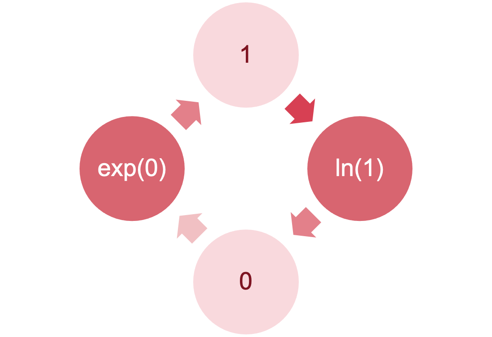
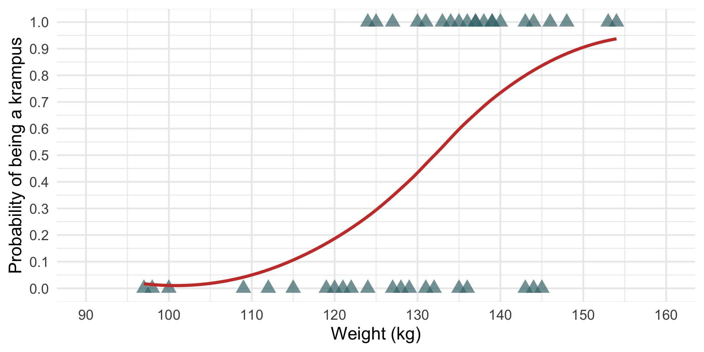
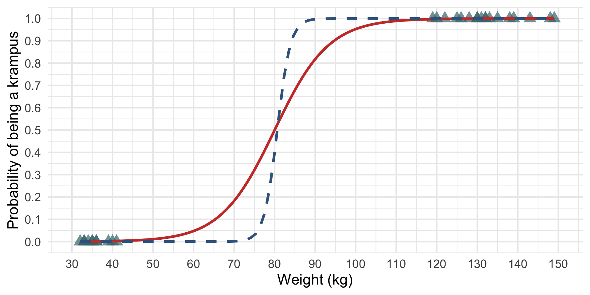
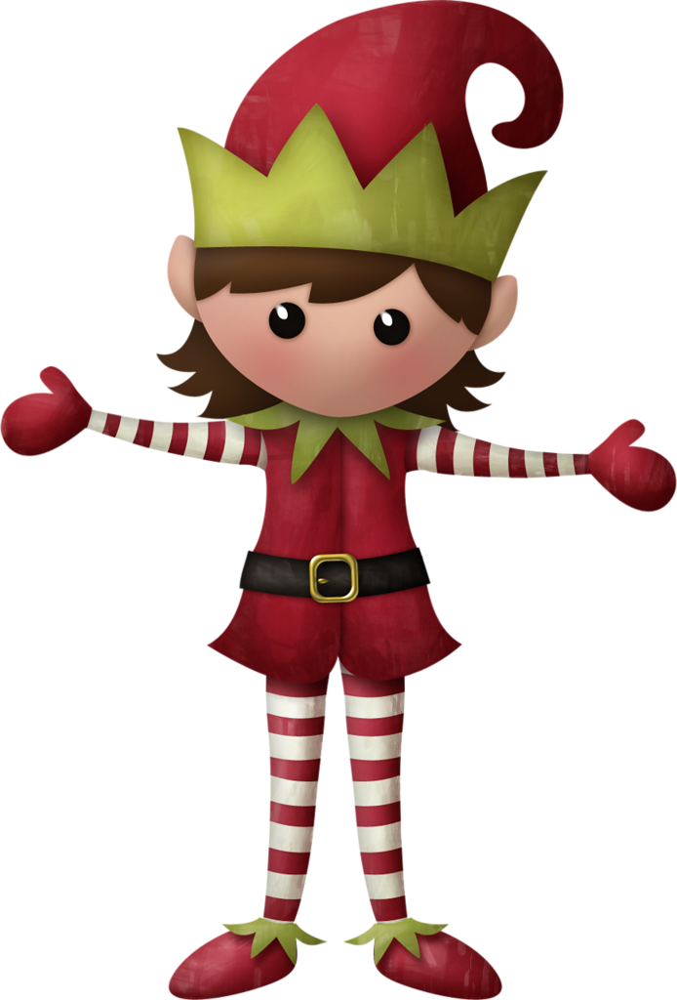
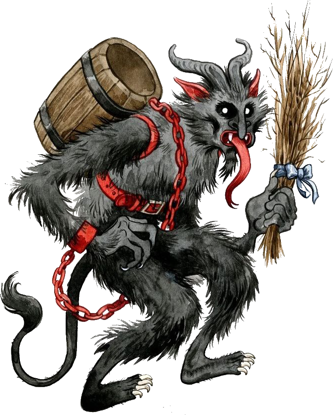
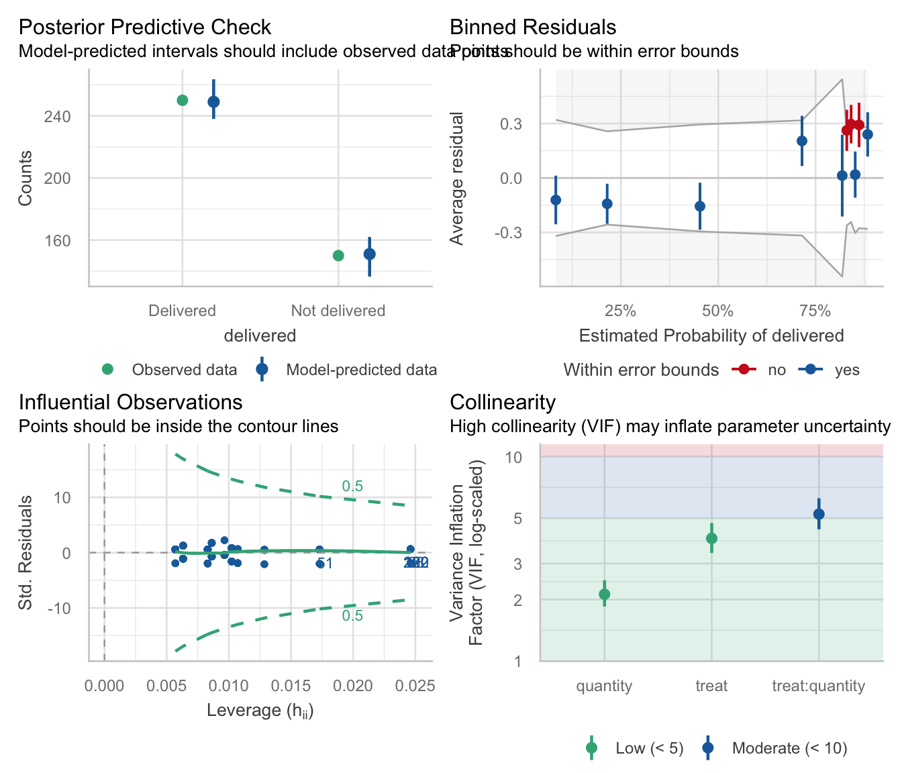
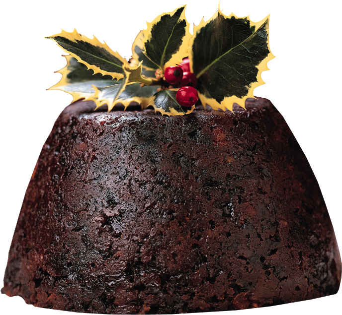
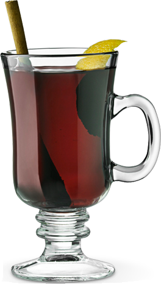
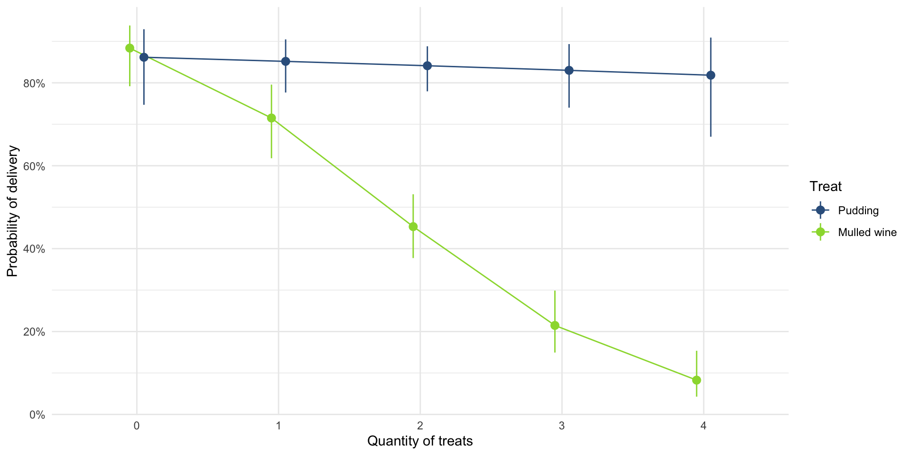

# Categorical outcomes

**Logistic regression**

Professor Andy Field, University of Sussex

Links: [bsky.app](https://bsky.app/profile/profandyfield.bsky.social) \| [youtube.com](https://www.youtube.com/user/ProfAndyField) \| [discoveringstatistics.com](https://www.discoveringstatistics.com) \| [discovr.rocks](https://www.discovr.rocks) \| [statisticsadventure.com](https://www.statisticsadventure.com)

## About this version

This is a plain-text version of the lecture slides. Each slide starts with a heading such as “Slide 5”, and the numbers match the slide numbers shown in the lecture. Content that appeared one piece at a time, in columns or in tabs is shown in reading order. Videos and interactive apps are given as links.

## Slide 2

Video clip: [xmas santa 01](https://profandyfield.github.io/statistics_lectures/shared_media/video/xmas_santa_01.mp4)

## Slide 3

Video clip: [xmas santa 02](https://profandyfield.github.io/statistics_lectures/shared_media/video/xmas_santa_02.mp4)

## Slide 4


## Slide 5


## Slide 6: A festive example


Santa Claus wanted to test the effects of different types of treats on whether presents got delivered:

- Predictors
  - **treat**: Christmas pudding, Mulled wine
- Outcome
  - **delivered**: Did the presents get delivered?

## Slide 7: Load and Look


|     | id                            | treat       | delivered     |
|-----|-------------------------------|-------------|---------------|
| 1   | Fankle the Determined         | Mulled wine | Not delivered |
| 2   | Amber the Cuddle              | Mulled wine | Not delivered |
| 3   | Snorklum the Content          | Pudding     | Delivered     |
| 4   | Henri the Biddible            | Pudding     | Delivered     |
| 5   | Ainsley the Eigen vector      | Mulled wine | Delivered     |
| 6   | Funnelcup the Iron maiden fan | Mulled wine | Delivered     |
| 7   | Ramsey the Surprised          | Pudding     | Delivered     |
| 8   | Bindlestiff the Surprised     | Mulled wine | Not delivered |
| 9   | Lardy the Strong              | Pudding     | Delivered     |
| 10  | Theo the Small                | Pudding     | Delivered     |
| 11  | Alexis the Cute               | Pudding     | Delivered     |
| 12  | Per the Egalitarian           | Pudding     | Delivered     |
| 13  | Nergal the Lollygag           | Mulled wine | Delivered     |
| 14  | Hughy the Content             | Mulled wine | Not delivered |
| 15  | Ramsey the Partial derivative | Mulled wine | Delivered     |
| 16  | Flo the Sangoma               | Mulled wine | Delivered     |
| 17  | Flumin the Nostril-checker    | Pudding     | Delivered     |
| 18  | Nicko the Forgetful           | Pudding     | Not delivered |
| 19  | Tulip the Hincklepump         | Mulled wine | Not delivered |
| 20  | Nicko the Nostril-checker     | Mulled wine | Not delivered |
| 21  | Cleo the Dextrous             | Pudding     | Delivered     |
| 22  | Quo the Dextrous              | Pudding     | Delivered     |
| 23  | Tinsel the Pointless dancer   | Pudding     | Delivered     |
| 24  | Petr the Puddle jumper        | Mulled wine | Not delivered |
| 25  | Juniper the Tall              | Mulled wine | Not delivered |
| 26  | Jezebel the Determined        | Mulled wine | Not delivered |
| 27  | Quo the Vagarious             | Pudding     | Delivered     |
| 28  | Alexis the Mudlark            | Mulled wine | Not delivered |
| 29  | Amulet the Hincklepump        | Pudding     | Delivered     |
| 30  | Geeling the Puddle jumper     | Mulled wine | Delivered     |
| 31  | Bumfissue the Dotish          | Mulled wine | Not delivered |
| 32  | Vanessa the Visible           | Mulled wine | Delivered     |
| 33  | Bumbo the Partial derivative  | Mulled wine | Not delivered |
| 34  | Vanessa the Hipster           | Pudding     | Delivered     |
| 35  | Charlie the Mischievous       | Mulled wine | Not delivered |
| 36  | Edwin the Kind                | Mulled wine | Not delivered |
| 37  | Evra the Jubulant             | Pudding     | Delivered     |
| 38  | Arlo the Nondescript          | Pudding     | Delivered     |
| 39  | Iwobi the Lollygag            | Pudding     | Delivered     |
| 40  | Nicko the Wrapper             | Pudding     | Not delivered |
| 41  | Juniper the Biddible          | Mulled wine | Not delivered |
| 42  | Wickham the Xylopolist        | Pudding     | Delivered     |
| 43  | Geeling the Mischievous       | Mulled wine | Not delivered |
| 44  | Ramsey the Neurotic           | Mulled wine | Delivered     |
| 45  | Juniper the Statistical       | Pudding     | Delivered     |
| 46  | Oxter the Knee-scratcher      | Mulled wine | Not delivered |
| 47  | Bardy the Agreeable           | Mulled wine | Delivered     |
| 48  | Amber the Nondescript         | Mulled wine | Not delivered |
| 49  | Jongle the Determined         | Pudding     | Delivered     |
| 50  | Liv the Carpenter             | Mulled wine | Not delivered |

Table 1: Santa's data (first 50 of 400 rows)


## Slide 8: If it were a standard linear model


``` math
 \begin{aligned} \text{delivered}_{i} &= \hat{b}_{0} + \hat{b}_{1}\text{treat}_{i} + e_{i} \end{aligned} 
```

Assumption of linearity

- Violated with categorical outcomes
- We can’t fit this model

| Group             | Treat |
|-------------------|-------|
| Christmas pudding | 0     |
| Mulled wine       | 1     |

## Slide 9: But it’s not a standard linear model


We predict the probability of the outcome occurring

``` math
 \begin{aligned} P(Y) &= \frac{1}{1+ e^{-(\hat{b}_0 + \hat{b}_1X_i+e_i)}} \\ P(\text{delivery}) &= \frac{1}{1+ e^{-(\hat{b}_0 + \hat{b}_1\text{treat}_i+e_i)}} \\ \end{aligned} 
```

> **Note: Statis-tip**
>
> Note the equation contains the linear model

## Slide 10: Alternatively …


``` math
 \begin{aligned} \ln\bigg(\frac{P(Y)}{1- P(Y)}\bigg) &= \hat{b}_0 + \hat{b}_1X_{i} + e_i \\ \ln\bigg(\frac{P(\text{delivery})}{1- P(\text{delivery})}\bigg) &= \hat{b}_0 + \hat{b}_1\text{treat}_{i} + e_i \\ \end{aligned} 
```

### Outcome

- We predict the log odds of the outcome occurring

### $`\hat{b}_0`$ and $`\hat{b}_1`$

- Note the the logistic regression equation is the same as the linear model, except we predict the log odds of the outcome
- $`\hat{b}_1`$ is the change in the log odds of the outcome associated with a unit change in the predictor

## Slide 11: Logs and exponents




## Slide 12: The odds ratio: exp(b)


``` math
 \begin{aligned} \exp(b) = \frac{\text{odds after a unit change in the predictor}}{\text{original odds}} \end{aligned} 
```

### *b*<sub>0</sub>

- Log odds of outcome when the predictors are 0
- Easier to interpret exp(*b*<sub>0</sub>), the odds of outcome when predictor is 0

### *b*<sub>1</sub>

- Change in the log odds of outcome associated with a unit change in the predictor
- Easier to interpret exp (*b*<sub>1</sub>), the odds ratio associated with a unit change in the predictor
- OR \> 1: Predictor $`\uparrow`$, probability of outcome occurring $`\uparrow`$
- OR \< 1: Predictor $`\uparrow`$, probability of outcome occurring $`\downarrow`$

## Slide 13: Classification table


|                   | Delivered | Not delivered | Total |
|-------------------|-----------|---------------|-------|
| Christmas pudding | 150       | 28            | 178   |
| Mulled wine       | 100       | 122           | 222   |
| Total             | 250       | 150           | 400   |

 

``` math
 \begin{aligned} \text{odds}_\text{delivery} &= \frac{\text{Number delivered}}{\text{Number not delivered}} \\ &= \frac{250}{150} \\ &= 1.67 \end{aligned} 
```

## Slide 14: The odds ratio


``` math
 \begin{aligned} \text{odds}_\text{delivered after pudding} &= \frac{\text{Number delivered after pudding}}{\text{Number not delivered after pudding}} \\ &= \frac{150}{28} \\ &= 5.36 \end{aligned} 
```

``` math
 \begin{aligned} \text{odds}_\text{delivered after wine} &= \frac{\text{Number delivered after wine}}{\text{Number not delivered after wine}} \\ &= \frac{100}{122} \\ &= 0.82 \end{aligned} 
```

## Slide 15: The odds ratio


``` math
 \begin{aligned} \text{odds ratio} &= \frac{\text{odds}_\text{delivered after wine}}{\text{odds}_\text{delivered after pudding}} \\ &= \frac{0.82}{5.36} \\ &= 0.15 \end{aligned} 
```

## Slide 16: The odds ratio


``` math
 \begin{aligned} \text{odds ratio} &= \frac{\text{odds}_\text{delivered after pudding}}{\text{odds}_\text{delivered after wine}} \\ &= \frac{5.36}{0.82} \\ &= 6.54 \end{aligned} 
```

## Slide 17: Interpret the parameters


``` r
santa_mod <- glm(delivered ~ treat, data = santa_tib, family = binomial())

model_parameters(santa_mod) |> 
  display()
```

| Parameter           | Log-Odds | SE   | 95% CI         | z     | p       |
|---------------------|----------|------|----------------|-------|---------|
| (Intercept)         | 1.68     | 0.21 | (1.29, 2.10)   | 8.15  | \< .001 |
| treat (Mulled wine) | -1.88    | 0.25 | (-2.37, -1.41) | -7.63 | \< .001 |


## Slide 18: Interpret the odds ratios


``` r
model_parameters(santa_mod, exponentiate = TRUE) |> 
  display()
```

| Parameter           | Odds Ratio | SE   | 95% CI       | z     | p       |
|---------------------|------------|------|--------------|-------|---------|
| (Intercept)         | 5.36       | 1.10 | (3.64, 8.18) | 8.15  | \< .001 |
| treat (Mulled wine) | 0.15       | 0.04 | (0.09, 0.24) | -7.63 | \< .001 |


## Slide 19

Video clip: [xmas scene 2](https://profandyfield.github.io/statistics_lectures/shared_media/video/xmas_scene_2.mp4)

## Slide 20: A festive example


Santa Claus wanted to test the effects of different types of treats and the quantity of them consumed on whether presents got delivered:

- Predictors
  - **treat**: Christmas pudding, Mulled wine
  - **quantity**: 0, 1, 2, 3, or 4
- Outcome
  - **delivered**: Did the presents get delivered?

## Slide 21: Load and Look


|     | id                            | quantity | treat       | delivered     |
|-----|-------------------------------|----------|-------------|---------------|
| 1   | Fankle the Determined         | 4        | Mulled wine | Not delivered |
| 2   | Amber the Cuddle              | 3        | Mulled wine | Not delivered |
| 3   | Snorklum the Content          | 3        | Pudding     | Delivered     |
| 4   | Henri the Biddible            | 0        | Pudding     | Delivered     |
| 5   | Ainsley the Eigen vector      | 0        | Mulled wine | Delivered     |
| 6   | Funnelcup the Iron maiden fan | 1        | Mulled wine | Delivered     |
| 7   | Ramsey the Surprised          | 2        | Pudding     | Delivered     |
| 8   | Bindlestiff the Surprised     | 3        | Mulled wine | Not delivered |
| 9   | Lardy the Strong              | 1        | Pudding     | Delivered     |
| 10  | Theo the Small                | 1        | Pudding     | Delivered     |
| 11  | Alexis the Cute               | 1        | Pudding     | Delivered     |
| 12  | Per the Egalitarian           | 3        | Pudding     | Delivered     |
| 13  | Nergal the Lollygag           | 3        | Mulled wine | Delivered     |
| 14  | Hughy the Content             | 1        | Mulled wine | Not delivered |
| 15  | Ramsey the Partial derivative | 3        | Mulled wine | Delivered     |
| 16  | Flo the Sangoma               | 2        | Mulled wine | Delivered     |
| 17  | Flumin the Nostril-checker    | 1        | Pudding     | Delivered     |
| 18  | Nicko the Forgetful           | 1        | Pudding     | Not delivered |
| 19  | Tulip the Hincklepump         | 2        | Mulled wine | Not delivered |
| 20  | Nicko the Nostril-checker     | 3        | Mulled wine | Not delivered |
| 21  | Cleo the Dextrous             | 1        | Pudding     | Delivered     |
| 22  | Quo the Dextrous              | 1        | Pudding     | Delivered     |
| 23  | Tinsel the Pointless dancer   | 0        | Pudding     | Delivered     |
| 24  | Petr the Puddle jumper        | 2        | Mulled wine | Not delivered |
| 25  | Juniper the Tall              | 3        | Mulled wine | Not delivered |
| 26  | Jezebel the Determined        | 2        | Mulled wine | Not delivered |
| 27  | Quo the Vagarious             | 2        | Pudding     | Delivered     |
| 28  | Alexis the Mudlark            | 4        | Mulled wine | Not delivered |
| 29  | Amulet the Hincklepump        | 3        | Pudding     | Delivered     |
| 30  | Geeling the Puddle jumper     | 1        | Mulled wine | Delivered     |
| 31  | Bumfissue the Dotish          | 2        | Mulled wine | Not delivered |
| 32  | Vanessa the Visible           | 1        | Mulled wine | Delivered     |
| 33  | Bumbo the Partial derivative  | 4        | Mulled wine | Not delivered |
| 34  | Vanessa the Hipster           | 1        | Pudding     | Delivered     |
| 35  | Charlie the Mischievous       | 3        | Mulled wine | Not delivered |
| 36  | Edwin the Kind                | 2        | Mulled wine | Not delivered |
| 37  | Evra the Jubulant             | 4        | Pudding     | Delivered     |
| 38  | Arlo the Nondescript          | 0        | Pudding     | Delivered     |
| 39  | Iwobi the Lollygag            | 1        | Pudding     | Delivered     |
| 40  | Nicko the Wrapper             | 2        | Pudding     | Not delivered |
| 41  | Juniper the Biddible          | 3        | Mulled wine | Not delivered |
| 42  | Wickham the Xylopolist        | 1        | Pudding     | Delivered     |
| 43  | Geeling the Mischievous       | 3        | Mulled wine | Not delivered |
| 44  | Ramsey the Neurotic           | 2        | Mulled wine | Delivered     |
| 45  | Juniper the Statistical       | 2        | Pudding     | Delivered     |
| 46  | Oxter the Knee-scratcher      | 3        | Mulled wine | Not delivered |
| 47  | Bardy the Agreeable           | 1        | Mulled wine | Delivered     |
| 48  | Amber the Nondescript         | 1        | Mulled wine | Not delivered |
| 49  | Jongle the Determined         | 2        | Pudding     | Delivered     |
| 50  | Liv the Carpenter             | 3        | Mulled wine | Not delivered |

Table 2: Santa's data (first 50 of 400 rows)


## Slide 22: Extending the model


``` math
 \begin{aligned} \text{delivered}_{i} &= \hat{b}_{0} + \hat{b}_{1}\text{treat}_{i} + \hat{b}_{2}\text{quantity}_{i} + \hat{b}_{3}\text{treat} \times \text{quantity}_{i} + e_{i} \end{aligned} 
```

| Group             | Treat |
|-------------------|-------|
| Christmas pudding | 0     |
| Mulled wine       | 1     |

``` math
 \begin{aligned} P(\text{delivery}) &= \frac{1}{1+e^{-(\hat{b}_0 + \hat{b}_1\text{treat}_{i} + \hat{b}_2\text{quantity}_{i} + \hat{b}_3\text{treat} \times \text{quantity}_{i} + e_i)}} \\ \end{aligned} 
```

``` math
 \begin{aligned} \ln\bigg(\frac{P(\text{delivery})}{1- P(\text{delivery})}\bigg) &= \hat{b}_0 + \hat{b}_1\text{treat}_{i} + \hat{b}_2\text{quantity}_{i} + \hat{b}_3\text{treat} \times \text{quantity}_{i} + e_i \\ \end{aligned} 
```

## Slide 23: Building the model


- Forced entry: all variables entered simultaneously.
- Hierarchical: variables entered in blocks.
  - Blocks should be based on past research, or theory being tested.
  - Good method.
- Stepwise: variables entered on the basis of statistical criteria (i.e., Relative contribution to predicting outcome).
  - Should be used only for exploratory analysis.

## Slide 24: Things that can go wrong


### Things we’ve met before

- Linearity (of the logit)
- Spherical residuals
  - Independent errors
- Multicollinearity

### Unique problems

- Incomplete information
- Complete separation

## Slide 25: Incomplete information


### Empty cells

- We don’t know how many presents are delivered after two puddings or not delivered after 5 wines
- Problem quickly escalates with continuous predictors
- Inflates standard errors

|             | Quantity | Delivered | Not delivered |
|-------------|----------|-----------|---------------|
| Pudding     | 0        | 27        | 3             |
| Pudding     | 1        | 36        | 10            |
| Pudding     | 2        | \-        | 5             |
| Pudding     | 3        | 37        | 6             |
| Pudding     | 4        | 12        | 4             |
| Mulled wine | 0        | 27        | 3             |
| Mulled wine | 1        | 32        | 11            |
| Mulled wine | 2        | 24        | 36            |
| Mulled wine | 3        | 14        | 48            |
| Mulled wine | 4        | 3         | \-            |

## Slide 26: Complete separation


When the outcome variable can be perfectly predicted

- Predicting whether someone is a krampus based on weight

### Santa vs. krampus



### Elves vs. krampus








## Slide 27

Video clip: [logistic regression song instrumental](https://profandyfield.github.io/statistics_lectures/ais_14_log_reg/media/logistic_regression_song_instrumental.mp4)

## Slide 28

Video clip: [logistic regression song](https://profandyfield.github.io/statistics_lectures/ais_14_log_reg/media/logistic_regression_song.mp4)

## Slide 29: Build the model


``` r
int_glm <- glm(delivered ~ 1, data = santa_tib, family = binomial())
treat_glm <- update(int_glm, .~. + treat)
quantity_glm <- update(treat_glm, .~. + quantity)
santa_glm <- update(quantity_glm, .~. + treat:quantity)
```

## Slide 30: Evaluate


``` r
test_lrt(int_glm, treat_glm, quantity_glm, santa_glm) |> 
  display()
```

| Name         | Model | df  | df_diff | Chi2  | p       |
|--------------|-------|-----|---------|-------|---------|
| int_glm      | glm   | 1   |         |       |         |
| treat_glm    | glm   | 2   | 1       | 68.76 | \< .001 |
| quantity_glm | glm   | 3   | 1       | 49.79 | \< .001 |
| santa_glm    | glm   | 4   | 1       | 20.52 | \< .001 |

Likelihood-Ratio-Test (LRT) for Model Comparison (ML-estimator)


## Slide 31: Evaluate assumptions


``` r
check_model(santa_glm)
```




## Slide 32: Interpret parameter estimates, CIs and tests


``` r
model_parameters(santa_glm) |> 
  display()
```

| Parameter                      | Log-Odds | SE   | 95% CI         | z     | p       |
|--------------------------------|----------|------|----------------|-------|---------|
| (Intercept)                    | 1.83     | 0.38 | (1.13, 2.63)   | 4.80  | \< .001 |
| treat (Mulled wine)            | 0.20     | 0.52 | (-0.83, 1.22)  | 0.38  | 0.701   |
| quantity                       | -0.08    | 0.17 | (-0.41, 0.25)  | -0.48 | 0.629   |
| treat (Mulled wine) × quantity | -1.03    | 0.23 | (-1.49, -0.58) | -4.45 | \< .001 |


## Slide 33: Interpret parameter estimates, CIs and tests


``` r
santa_tib |> 
  filter(treat == "Pudding") |> 
  glm(delivered ~ quantity, data = _, family = binomial()) |> 
  model_parameters() |>
  display()
```

| Parameter   | Log-Odds | SE   | 95% CI        | z     | p       |
|-------------|----------|------|---------------|-------|---------|
| (Intercept) | 1.83     | 0.38 | (1.13, 2.63)  | 4.80  | \< .001 |
| quantity    | -0.08    | 0.17 | (-0.41, 0.25) | -0.48 | 0.629   |

``` r
santa_tib |> 
  filter(treat == "Mulled wine") |> 
  glm(delivered ~ quantity, data = _, family = binomial()) |> 
  model_parameters() |>
  display()
```

| Parameter   | Log-Odds | SE   | 95% CI         | z     | p       |
|-------------|----------|------|----------------|-------|---------|
| (Intercept) | 2.03     | 0.35 | (1.37, 2.76)   | 5.73  | \< .001 |
| quantity    | -1.11    | 0.16 | (-1.44, -0.81) | -6.99 | \< .001 |



``` math
 \begin{aligned} b_\text{wine} − b_\text{pudding} &= −1.11−(−0.08) \\ &= −1.03 \end{aligned} 
```


## Slide 34: Interpret odds ratios


``` r
model_parameters(santa_glm, exponentiate = TRUE) |> 
  display()
```

| Parameter                      | Odds Ratio | SE   | 95% CI        | z     | p       |
|--------------------------------|------------|------|---------------|-------|---------|
| (Intercept)                    | 6.23       | 2.37 | (3.08, 13.86) | 4.80  | \< .001 |
| treat (Mulled wine)            | 1.22       | 0.63 | (0.43, 3.37)  | 0.38  | 0.701   |
| quantity                       | 0.92       | 0.15 | (0.66, 1.28)  | -0.48 | 0.629   |
| treat (Mulled wine) × quantity | 0.36       | 0.08 | (0.23, 0.56)  | -4.45 | \< .001 |


## Slide 35: Interpret parameter estimates, CIs and tests


``` r
santa_tib |> 
  filter(treat == "Pudding") |> 
  glm(delivered ~ quantity, data = _, family = binomial()) |> 
  model_parameters() |>
  display()
```

| Parameter   | Log-Odds | SE   | 95% CI        | z     | p       |
|-------------|----------|------|---------------|-------|---------|
| (Intercept) | 1.83     | 0.38 | (1.13, 2.63)  | 4.80  | \< .001 |
| quantity    | -0.08    | 0.17 | (-0.41, 0.25) | -0.48 | 0.629   |

``` r
santa_tib |> 
  filter(treat == "Mulled wine") |> 
  glm(delivered ~ quantity, data = _, family = binomial()) |> 
  model_parameters() |>
  display()
```

| Parameter   | Log-Odds | SE   | 95% CI         | z     | p       |
|-------------|----------|------|----------------|-------|---------|
| (Intercept) | 2.03     | 0.35 | (1.37, 2.76)   | 5.73  | \< .001 |
| quantity    | -1.11    | 0.16 | (-1.44, -0.81) | -6.99 | \< .001 |


``` math
 \begin{aligned} b_\text{wine} − b_\text{pudding} &= −1.11−(−0.08) \\ &= −1.03 \end{aligned} 
```

``` math
 \begin{aligned} \exp(b)_\text{difference} &= e^{−1.03} \\ &= 0.36 \end{aligned} 
```


## Slide 36: Visualize


``` r
santa_probs <- estimate_means(santa_glm, by = c("quantity", "treat"))
plot(santa_probs) +
  scale_colour_viridis_d(begin = 0.3, end = 0.85) +
  scale_fill_viridis_d(begin = 0.3, end = 0.85) +
  labs(x = "Quantity of treats", y = "Probability of delivery", colour = "Treat", fill = "Treat") +
  theme_minimal()
```




## Slide 37

Video clip: [xmas santa 03](https://profandyfield.github.io/statistics_lectures/shared_media/video/xmas_santa_03.mp4)

## Slide 38

Video clip: [i wish it could be christmas](https://profandyfield.github.io/statistics_lectures/shared_media/video/i_wish_it_could_be_christmas.mp4)
