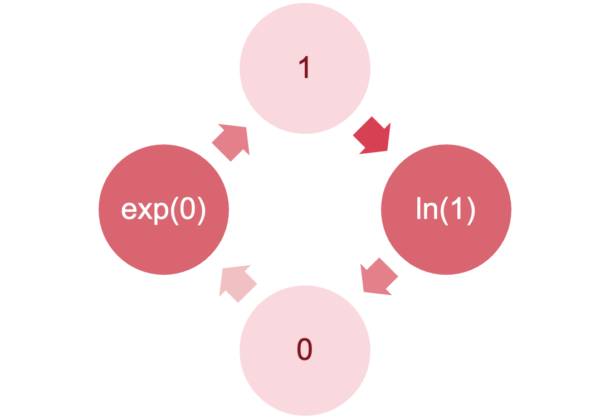
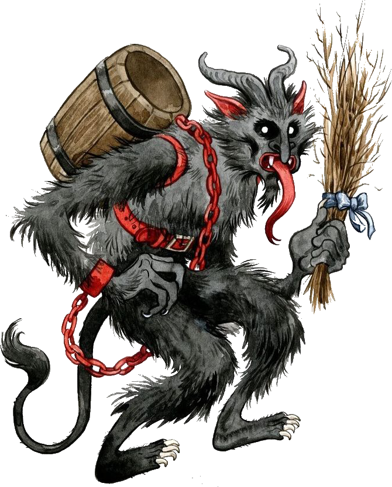
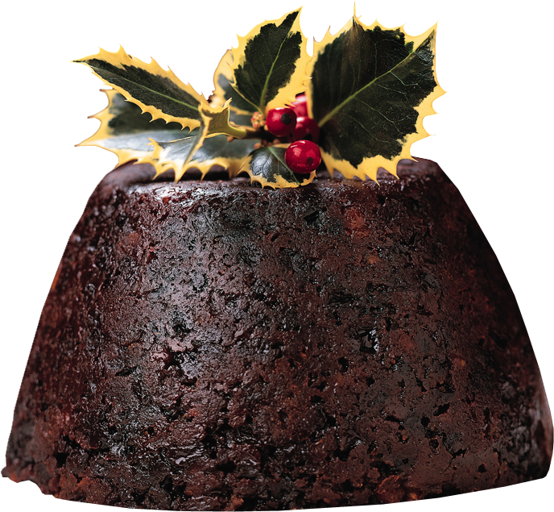
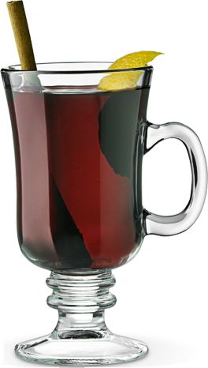

```{r}
# general
library(easystats)
library(tidyverse)
# specific
library(DT)

source("../helpers/discovr_helpers.R")
source("../helpers/easystats_helpers.R")
red <- "#CA3E34"
grn_dk <- "#427479"

santa_tib <- discovr::santas_log
krampus_tib <- readr::read_csv("data/santa_log_complete_separation.csv")

```


## {background-video="../shared_media/video/xmas_santa_01.mp4" background-size="cover"}

::: notes
Santa: long intro

[After Santa says about Krampus and head popping out of bucket ...]

Andy: Santa, I can help. Tell me about your operations.
:::


## {background-video="../shared_media/video/xmas_santa_02.mp4" background-size="cover"}


## 

::: r-stack
{.fragment fig-align="center" width="1050" height="594"}

{.fragment fig-align="center" width="1050" height="594"}
:::

##

{fig-align="center" height=600}

## [A festive example]{.txt_ong} {background-image="../shared_media/images/as_blu_house_93514381.jpg" background-size="cover"}

:::: columns
::: {.column width="50%"}
:::

::: {.column width="50%"}
::: txt_white
Santa Claus wanted to test the effects of different types of treats on whether presents got delivered:

- Predictors
  - [treat]{.txt_ong}: Christmas pudding, Mulled wine
- Outcome
  - [delivered]{.txt_ong}: Did the presents get delivered?

:::
:::
::::


## [L]{.txt_ong}[oad]{.txt_white} [and]{.txt_white} [L]{.txt_ong}[ook]{.txt_white} {background-image="../shared_media/images/as_santa_moon_36326866.jpg" background-size="cover"}

::: fragment
::: whitebox9
```{r}
santa_tib |>
  dplyr::select(-quantity) |> 
  DT::datatable(caption = 'Table 1: Santa\'s data',
                options = list(
                dom = 'tp',
                columnDefs = list(
                  list(className = 'dt-center', targets = 1:3)
                  ),
                pageLength = 10
  )
  )
```

:::
:::

{.absolute top=0 left=800 height="80"}

## [If it were a standard linear model]{.txt_ong} {background-image="../shared_media/images/as_snowy_trees_126530339.jpg" background-size="cover"}


::: center-h
::: txt_white
::: txt_l
$$
\begin{aligned}
\text{delivered}_{i} &= \hat{b}_{0} + \hat{b}_{1}\text{treat}_{i} + e_{i}
\end{aligned}
$$
:::
:::
:::

\

:::: columns
::: {.column width="50%"}
::: txt_white
Assumption of linearity

- Violated with categorical outcomes
- We can’t fit this model

:::
:::

::: {.column width="50%"}
::: whitebox9
```{r}
#| echo: false
#| label: tbl4

dummy_tbl <- tibble::tribble(
  ~`Group`, ~`Treat`,
  "Christmas pudding","0",
  "Mulled wine","1") 

dummy_tbl |> 
  knitr::kable(align = 'lc')
```
:::
:::
::::

## [But it’s not a standard linear model]{.txt_ong} {background-image="../shared_media/images/as_blu_globe_391811093.jpg" background-size="cover"}


:::: columns
::: {.column width="50%"}
:::

::: {.column width="50%"}
::: txt_white
We predict the probability of the outcome occurring

$$
\begin{aligned}
P(Y) &= \frac{1}{1+ e^{-(\hat{b}_0 + \hat{b}_1X_i+e_i)}} \\
P(\text{delivery}) &= \frac{1}{1+ e^{-(\hat{b}_0 + \hat{b}_1\text{treat}_i+e_i)}} \\
\end{aligned}
$$

\

::: {.callout-note icon = false}
##  Statis-tip

Note the equation contains the linear model

:::

:::
:::
::::

## [Alternatively ...]{.txt_ong} {background-image="../shared_media/images/as_snowy_trees_126530339.jpg" background-size="cover"}


::: center-h
::: txt_white
::: txt_l
$$
\begin{aligned}
\ln\bigg(\frac{P(Y)}{1- P(Y)}\bigg) &= \hat{b}_0 + \hat{b}_1X_{i} + e_i \\
\ln\bigg(\frac{P(\text{delivery})}{1- P(\text{delivery})}\bigg) &= \hat{b}_0 + \hat{b}_1\text{treat}_{i} + e_i \\
\end{aligned}
$$
:::
:::
:::


::::: columns
:::: {.column width="50%"}
::: txt_dk_bg
::: fragment
### [Outcome]{.txt_ong}

- We predict the log odds of the outcome occurring

:::
:::
::::

:::: {.column width="50%"}
::: txt_dk_bg
::: fragment
### [$\hat{b}_0$ and $\hat{b}_1$]{.txt_ong}

- Note the the logistic regression equation is the same as the linear model, except we predict the log odds of the outcome
- $\hat{b}_1$ is the change in the log odds of the outcome associated with a unit change in the predictor

:::
:::
::::
:::::

## [Logs and exponents]{.txt_ong} {background-image="../shared_media/images/as_red_santa_globe_45715114.jpg" background-size="cover"}

{.absolute top=75 left=450 height="500"}

## The odds ratio: exp(*b*) {background-image="../shared_media/images/as_snowman_wave_303329070.jpg" background-size="cover"}

::: center-h
::: txt_mulberry
::: txt_l
$$
\begin{aligned}
\exp(b) = \frac{\text{odds after a unit change in the predictor}}{\text{original odds}}
\end{aligned}
$$
:::
:::
:::

### *b*~0~

- Log odds of outcome when the predictors are 0
- Easier to interpret exp(*b*~0~), the odds of outcome when predictor is 0

### *b*~1~

- Change in the log odds of outcome associated with a unit change in the predictor
- Easier to interpret exp (*b*~1~), the odds ratio associated with a unit change in the predictor
- OR > 1: Predictor $\uparrow$, probability of outcome occurring $\uparrow$
- OR < 1: Predictor $\uparrow$, probability of outcome occurring $\downarrow$

## [Classification table]{.txt_ong} {background-image="../shared_media/images/as_santa_vortex_94489562.jpg" background-size="cover"}

:::: fragment
::: whitebox9
::: tbl_l
```{r}
#| echo: false
#| label: tbl8

tibble::tribble(
  ~` `, ~`Delivered`, ~`Not delivered`, ~`Total`,
  "Christmas pudding","150","28","178",
  "Mulled wine","100","122","222",
  "Total","250","150","400") |> 
  knitr::kable(align = 'lccc') |> 
  kableExtra::row_spec(row = 3, background = mulberry, color = "white") |> 
  kableExtra::column_spec(4, background = mulberry, color = "white")
```
:::
:::
::::

\ 

:::: fragment
::: whitebox9
$$
\begin{aligned}
\text{odds}_\text{delivery} &= \frac{\text{Number delivered}}{\text{Number not delivered}} \\
&= \frac{250}{150} \\
&= 1.67
\end{aligned}
$$
:::
::::

## [The odds ratio]{.txt_ong} {background-image="../shared_media/images/as_gingerbread_229820523.jpg" background-size="cover"}

:::: fragment
::: whitebox9
$$
\begin{aligned}
\text{odds}_\text{delivery} &= \frac{\text{Number delivered}}{\text{Number not delivered}} \\
&= \frac{250}{150} \\
&= 1.67
\end{aligned}
$$
:::
::::

\

:::: fragment
::: whitebox9
$$
\begin{aligned}
\text{odds}_\text{delivered after wine} &= \frac{\text{Number delivered after wine}}{\text{Number not delivered after wine}} \\
&= \frac{100}{122} \\
&= 0.82
\end{aligned}
$$
:::
::::

## [The odds ratio]{.txt_ong} {background-image="../shared_media/images/as_gingerbread_229820523.jpg" background-size="cover"}


::: whitebox9
$$
\begin{aligned}
\text{odds ratio} &= \frac{\text{odds}_\text{delivered after wine}}{\text{odds}_\text{delivered after pudding}} \\
&= \frac{0.82}{5.36} \\
&= 0.15
\end{aligned}
$$
:::

## [The odds ratio]{.txt_ong} {background-image="../shared_media/images/as_gingerbread_229820523.jpg" background-size="cover"}


::: whitebox9
$$
\begin{aligned}
\text{odds ratio} &= \frac{\text{odds}_\text{delivered after pudding}}{\text{odds}_\text{delivered after wine}} \\
&= \frac{5.36}{0.82} \\
&= 6.54
\end{aligned}
$$
:::

## [I]{.txt_ong}[nterpret the parameters]{.txt_white} {background-image="../shared_media/images/as_santa_over_village_71686107.jpg" background-size="cover"}


```{r}
#| echo: true
#| eval: false

santa_mod <- glm(delivered ~ treat, data = santa_tib, family = binomial())

model_parameters(santa_mod) |> 
  display()
```

\

::: whitebox9
```{r}
santa_mod <- glm(delivered ~ treat, data = santa_tib, family = binomial())

model_parameters(santa_mod) |> 
  display()
```
:::

{.absolute top=0 left=900 height="80"}

## [I]{.txt_ong}[nterpret the odds ratios]{.txt_white} {background-image="../shared_media/images/as_santa_over_village_71686107.jpg" background-size="cover"}

```{r}
#| echo: true
#| eval: false

model_parameters(santa_mod, exponentiate = TRUE) |> 
  display()
```

\

::: whitebox9
```{r}
model_parameters(santa_mod, exponentiate = TRUE) |> 
  display()
```
:::


{.absolute top=0 left=900 height="80"}

## {background-video="../shared_media/video/xmas_scene_2.mp4" background-size="cover"}

## [A festive example]{.txt_ong} {background-image="../shared_media/images/as_blu_house_93514381.jpg" background-size="cover"}

:::: columns
::: {.column width="50%"}
:::

::: {.column width="50%"}
::: txt_white
Santa Claus wanted to test the effects of different types of treats and the quantity of them consumed on whether presents got delivered:

- Predictors
  - [treat]{.txt_ong}: Christmas pudding, Mulled wine
  - [quantity]{.txt_ong}: 0, 1, 2, 3, or 4
- Outcome
  - [delivered]{.txt_ong}: Did the presents get delivered?

:::
:::
::::

## [L]{.txt_ong}[oad]{.txt_white} [and]{.txt_white} [L]{.txt_ong}[ook]{.txt_white} {background-image="../shared_media/images/as_santa_moon_36326866.jpg" background-size="cover"}

::: fragment
::: whitebox9
```{r}
santa_tib |>
  DT::datatable(caption = 'Table 2: Santa\'s data',
                options = list(
                dom = 'tp',
                columnDefs = list(
                  list(className = 'dt-center', targets = 1:3)
                  ),
                pageLength = 10
  )
  )
```

:::
:::

{.absolute top=0 left=800 height="80"}

## [Extending the model]{.txt_white} {background-image="../shared_media/images/as_red_snowflake_228468210.jpg" background-size="cover"}

:::: center-h
::: whitebox9
$$
\begin{aligned}
\text{delivered}_{i} &= \hat{b}_{0} + \hat{b}_{1}\text{treat}_{i} + \hat{b}_{2}\text{quantity}_{i} + \hat{b}_{3}\text{treat} \times \text{quantity}_{i} + e_{i}
\end{aligned}
$$
:::


\


:::: columns
::: {.column width="30%"}
:::

::: {.column width="40%"}
::: fragment
::: whitebox9
::: tbl_s
```{r}
#| echo: false
#| label: tbl3

dummy_tbl <- tibble::tribble(
  ~`Group`, ~`Treat`,
  "Christmas pudding","0",
  "Mulled wine","1") 

dummy_tbl |> 
  knitr::kable(align = 'lc')
```
:::
:::
:::
:::

::: {.column width="30%"}
:::
::::


\

::: fragment
::: txt_white
$$
\begin{aligned}
P(\text{delivery}) &= \frac{1}{1+e^{-(\hat{b}_0 + \hat{b}_1\text{treat}_{i} + \hat{b}_2\text{quantity}_{i} + \hat{b}_3\text{treat} \times \text{quantity}_{i} + e_i)}} \\
\end{aligned}
$$
:::
:::

\

::: fragment
::: txt_white
$$
\begin{aligned}
\ln\bigg(\frac{P(\text{delivery})}{1- P(\text{delivery})}\bigg) &= \hat{b}_0 + \hat{b}_1\text{treat}_{i} + \hat{b}_2\text{quantity}_{i} + \hat{b}_3\text{treat} \times \text{quantity}_{i} + e_i \\
\end{aligned}
$$
:::
:::

::::

## [Building the model]{.txt_ong} {background-image="../shared_media/images/as_tree_train_93514522.jpg" background-size="cover"}


:::: columns
::: {.column width="60%"}
::: txt_white

- Forced entry: all variables entered simultaneously.
- Hierarchical: variables entered in blocks.
  - Blocks should be based on past research, or theory being tested.
  - Good method.
- Stepwise: variables entered on the basis of statistical criteria (i.e., Relative contribution to predicting outcome).
  - Should be used only for exploratory analysis.
  
:::
:::

::: {.column width="40%"}
:::
::::

## [Things that can go wrong]{.txt_ong} {background-image="../shared_media/images/as_blu_house_93514381.jpg" background-size="cover"}


:::: columns
::: {.column width="50%"}
:::

::: {.column width="50%"}
::: txt_white

### [Things we’ve met before]{.txt_ong}

- Linearity (of the logit)
- Spherical residuals
  - Independent errors
- Multicollinearity

### [Unique problems]{.txt_ong}

- Incomplete information
- Complete separation

:::
:::
::::

## [Incomplete information]{.txt_ong} {background-image="../shared_media/images/as_santa_moon_37337682.jpg" background-size="cover"}

:::: columns
::: {.column width="50%"}
### [Empty cells]{.txt_ong}

::: txt_white

- We don’t know how many presents are delivered after two puddings or not delivered after 5 wines
- Problem quickly escalates with continuous predictors
- Inflates standard errors

:::
:::

::: {.column width="50%"}
::: whitebox9
```{r}
#| echo: false

cs_tble <- tibble::tribble(
  ~` `, ~`Quantity`, ~`Delivered`, ~`Not delivered`,
  "Pudding","0","27","3",
  "Pudding","1","36","10",
  "Pudding","2","-","5",
  "Pudding","3","37","6",
  "Pudding","4","12","4",
  "Mulled wine","0","27","3",
  "Mulled wine","1","32","11",
  "Mulled wine","2","24","36",
  "Mulled wine","3","14","48",
  "Mulled wine","4","3","-")

cs_tble |> 
  knitr::kable(align = 'lccc') |> 
  kableExtra::row_spec(1:10, background = "#2015224c", color = "white", font_size = 18) |> 
  kableExtra::row_spec(0, background = "#15224c", color = "#e9f5f8", font_size = 18)
```
:::
:::
::::

## Complete separation {background-image="../shared_media/images/as_krampus_374161953.jpg" background-size="cover"}

When the outcome variable can be perfectly predicted

- Predicting whether someone is a krampus based on weight

:::: columns
::: {.column width="50%"}
### Santa vs. krampus

```{r}
#| fig-height: 5

ggplot(krampus_tib, aes(X, Y_obs)) +
  scale_y_continuous(breaks = seq(0, 1, 0.1)) + 
  scale_x_continuous(breaks = seq(90, 160, 10)) + 
  coord_cartesian(ylim = c(0, 1), xlim = c(90, 160)) +
  labs(x = "Weight (kg)", y = "Probability of being a krampus") +
  geom_point(size = 5, shape = 17, colour = grn_dk, alpha = 0.7) +
  geom_smooth(aes(X, Y_pred), size = 1.5, colour = red, se = F) +
  theme_minimal(base_size = 18)
```
:::

::: {.column width="50%"}
::: fragment
### Elves vs. krampus

```{r}
#| fig-height: 5
log_fun <- function(x) {1/(1 + exp(-(-12 +(0.15*x))))}
log_fun2 <- function(x) {1/(1 + exp(-(-50 +(0.62*x))))}

ggplot(krampus_tib, aes(X2, Y_obs2)) +
  scale_y_continuous(breaks = seq(0, 1, 0.1)) + 
  scale_x_continuous(breaks = seq(30, 150, 10)) + 
  coord_cartesian(ylim = c(0, 1), xlim = c(30, 150)) +
  labs(x = "Weight (kg)", y = "Probability of being a krampus") +
  geom_point(size = 5, shape = 17, colour = grn_dk, alpha = 0.7) +
  stat_function(fun = log_fun, colour = red, size = 1.5) +
  stat_function(fun = log_fun2, colour = blue, size = 1.5, linetype = 2) +
  theme_minimal(base_size = 18)
```

{.absolute width=100 left=600 top="250"}

{.absolute width=125 left=850 top="250"}

:::
:::
::::

{.absolute width=125 left=350 top="250"}
{.absolute width=150 left=75 top="250"}


## {background-video="media/logistic_regression_song_instrumental.mp4" background-size="cover"}

## {background-video="media/logistic_regression_song.mp4" background-size="cover"}


## [Build the model]{.txt_ong} {background-image="../shared_media/images/as_snowy_trees_white_126530339.jpg" background-size="cover"}

::: txt_xl
```{r}
#| echo: true
#| code-line-numbers: 1|2|3|4

int_glm <- glm(delivered ~ 1, data = santa_tib, family = binomial())
treat_glm <- update(int_glm, .~. + treat)
quantity_glm <- update(treat_glm, .~. + quantity)
santa_glm <- update(quantity_glm, .~. + treat:quantity)

```
:::

## [E]{.txt_ong}[valuate]{.txt_white} {background-image="../shared_media/images/as_snowy_trees_white_126530339.jpg" background-size="cover"}

```{r}
#| echo: true
#| eval: false

test_lrt(int_glm, treat_glm, quantity_glm, santa_glm) |> 
  display()
```

\

::: whitebox9
```{r}
test_lrt(int_glm, treat_glm, quantity_glm, santa_glm) |> 
  display()
```
:::

{.absolute top=0 left=800 height="80"}

## [E]{.txt_ong}[valuate assumptions]{.txt_white} {background-image="../shared_media/images/as_snowy_trees_white_126530339.jpg" background-size="cover"}

::: center-h
```{r}
#| echo: true
#| message: false
#| warning: false
#| fig-width: 7
#| fig-height: 6

check_model(santa_glm)
```
:::

{.absolute top=0 left=800 height="80"}

## [I]{.txt_ong}[nterpret parameter estimates, CIs and tests]{.txt_white} {background-image="../shared_media/images/as_snowy_trees_white_126530339.jpg" background-size="cover"}

```{r}
#| echo: true
#| eval: false

model_parameters(santa_glm) |> 
  display()
```

\

::: whitebox9
```{r}
model_parameters(santa_glm) |> 
  display()
```
:::

{.absolute top=0 left=900 height="80"}


## [I]{.txt_ong}[nterpret parameter estimates, CIs and tests]{.txt_white} {background-image="../shared_media/images/as_snowy_trees_white_126530339.jpg" background-size="cover"}

\
\
\

:::: columns
::: {.column width="50%"}
::: txt_s
```{r}
#| echo: true
#| eval: false

santa_tib |> 
  filter(treat == "Pudding") |> 
  glm(delivered ~ quantity, data = _, family = binomial()) |> 
  model_parameters() |>
  display()
```
:::
\

::: whitebox9
::: tbl_s
```{r}
santa_tib |> 
  filter(treat == "Pudding") |> 
  glm(delivered ~ quantity, data = _, family = binomial()) |> 
  model_parameters() |>
  display()
```
:::
:::

:::

::: {.column width="50%"}
::: txt_s
```{r}
#| echo: true
#| eval: false

santa_tib |> 
  filter(treat == "Mulled wine") |> 
  glm(delivered ~ quantity, data = _, family = binomial()) |> 
  model_parameters() |>
  display()
```
:::

\

::: whitebox9
::: tbl_s
```{r}
santa_tib |> 
  filter(treat == "Mulled wine") |> 
  glm(delivered ~ quantity, data = _, family = binomial()) |> 
  model_parameters() |>
  display()
```
:::
:::
:::
::::

{.absolute height=100 left=250 top="50"}
{.absolute height=100 left=750 top="50"}

\

::: fragment
::: center-h
::: txt_blue
::: txt_l
$$
\begin{aligned}
b_\text{wine} − b_\text{pudding} &= −1.11−(−0.08) \\
&= −1.03
\end{aligned}
$$

:::
:::
:::
:::


{.absolute top=0 left=900 height="80"}

## [I]{.txt_ong}[nterpret odds ratios]{txt_white} {background-image="../shared_media/images/as_snowy_trees_white_126530339.jpg" background-size="cover"}

```{r}
#| echo: true
#| eval: false

model_parameters(santa_glm, exponentiate = TRUE) |> 
  display()
```

\

::: whitebox9
```{r}
model_parameters(santa_glm, exponentiate = TRUE) |> 
  display()
```
:::

{.absolute top=0 left=900 height="80"}

## [I]{.txt_ong}[nterpret parameter estimates, CIs and tests]{.txt_white} {background-image="../shared_media/images/as_snowy_trees_white_126530339.jpg" background-size="cover"}

\
\
\

:::: columns
::: {.column width="50%"}
::: txt_s
```{r}
#| echo: true
#| eval: false

santa_tib |> 
  filter(treat == "Pudding") |> 
  glm(delivered ~ quantity, data = _, family = binomial()) |> 
  model_parameters() |>
  display()
```
:::
\

::: whitebox9
::: tbl_s
```{r}
santa_tib |> 
  filter(treat == "Pudding") |> 
  glm(delivered ~ quantity, data = _, family = binomial()) |> 
  model_parameters() |>
  display()
```
:::
:::

:::

::: {.column width="50%"}
::: txt_s
```{r}
#| echo: true
#| eval: false

santa_tib |> 
  filter(treat == "Mulled wine") |> 
  glm(delivered ~ quantity, data = _, family = binomial()) |> 
  model_parameters() |>
  display()
```
:::

\

::: whitebox9
::: tbl_s
```{r}
santa_tib |> 
  filter(treat == "Mulled wine") |> 
  glm(delivered ~ quantity, data = _, family = binomial()) |> 
  model_parameters() |>
  display()
```
:::
:::
:::
::::

{.absolute height=100 left=250 top="50"}
{.absolute height=100 left=750 top="50"}

\

::: center-h
::: txt_blue
::: txt_l
$$
\begin{aligned}
b_\text{wine} − b_\text{pudding} &= −1.11−(−0.08) \\
&= −1.03
\end{aligned}
$$

:::
:::
:::

::: fragment
::: center-h
::: txt_blue
::: txt_l
$$
\begin{aligned}
\exp(b)_\text{difference} &= e^{−1.03} \\
&= 0.36
\end{aligned}
$$

:::
:::
:::
:::


{.absolute top=0 left=900 height="80"}


## [V]{.txt_ong}isualize {background-image="../shared_media/images/as_snowman_wave_303329070.jpg" background-size="cover"}

```{r}
#| echo: true
#| fig-width: 10
#| fig-height: 5
santa_probs <- estimate_means(santa_glm, by = c("quantity", "treat"))
plot(santa_probs) +
  scale_colour_viridis_d(begin = 0.3, end = 0.85) +
  scale_fill_viridis_d(begin = 0.3, end = 0.85) +
  labs(x = "Quantity of treats", y = "Probability of delivery", colour = "Treat", fill = "Treat") +
  theme_minimal()
```

{.absolute height=100 left=800 top="200"}
{.absolute height=100 left=800 top="525"}

{.absolute top=0 left=800 height="80"}


## {background-video="../shared_media/video/xmas_santa_03.mp4" background-size="cover"}


## {background-video="../shared_media/video/i_wish_it_could_be_christmas.mp4" background-size="cover"}

