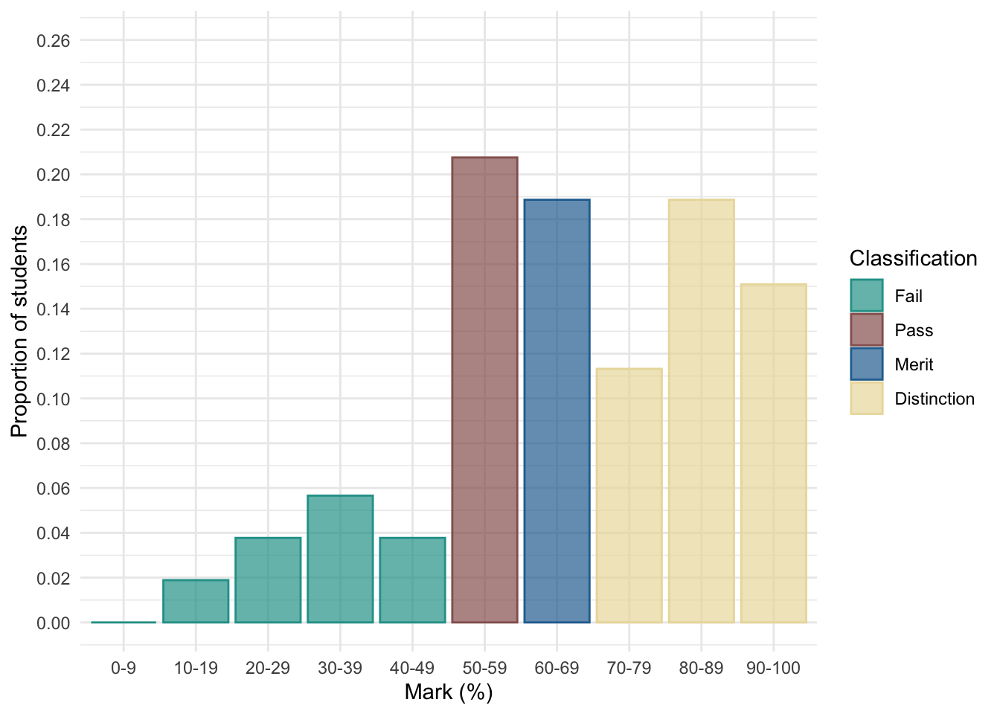

# Take-Away papers

**What are they and how to do them?**

Professor Andy Field, University of Sussex

Links: [bsky.app](https://bsky.app/profile/profandyfield.bsky.social) \| [youtube.com](https://www.youtube.com/user/ProfAndyField) \| [discoveringstatistics.com](https://www.discoveringstatistics.com) \| [discovr.rocks](https://www.discovr.rocks) \| [statisticsadventure.com](https://www.statisticsadventure.com)

## About this version

This is a plain-text version of the lecture slides. Each slide starts with a heading such as “Slide 5”, and the numbers match the slide numbers shown in the lecture. Content that appeared one piece at a time, in columns or in tabs is shown in reading order. Videos and interactive apps are given as links.

## Slide 2: Overview

- Paper is released as an announcement on CANVAS
- You must submit a rendered `.html` file to CANVAS within 48 hours
  - Reasonable adjustments automatically added within the submission point
- The task deliberately requires you to make some of your own decisions

> **Important: ReportR**
>
> You will be given:
>
> - A research scenario and data
> - A hypothesis
>
> Write a report containing two sections:
>
> - **Code**: Create all of the objects you need to write the report
> - **Report**: Write a succinct report that interprets the results of your model with reference to the hypothesis

## Slide 3: Code

> **Important: Code overview**
>
> Create all objects you need in this section (tables, plots, models etc)

### Tips

- Plan what you’re going to do **before** writing code - don’t just dive in
- Don’t print/view anything in this section
- Use the code that we teach
- **Use of AI is NOT permitted**
- **Do not directly copy/paraphrase ANYTHING from the model answer**
- Less is more
  - Find the relevant `discovr` tutorial - follow it
  - Don’t overthink it
  - You don’t have to include everything you do

## Slide 4: Report

> **Important: Report overview**
>
> - Explain the model you have fitted and why.
> - Include an equation that describes the main model you fit.
> - Explain and justify any decisions you have made
> - Interpret the main results

## Slide 5: Report

### Tips

- Follow the process of E.V.I.L.
  - **L**ook: summarize the data.
  - **V**isualise key parts of the data.
  - **E**valuate the fitted model
  - **I**nterpret the fitted model.
- Print and refer to relevant tables and plots (created in the *code* section)
  - Use quarto cross-referencing
  - Use `display()` to render tables
- Interpret the size of the parameter estimates (and CIs) that test the hypotheses, and their real world substance.
  - Focussing only on *p*-values will not garner high marks.

## Slide 6: Marking

> **Caution: Assessment criteria**
>
> - **Theoretical understanding (70% of marks)**: This criterion assesses technical accuracy in your statistical thinking.
> - **Coding (15% of marks)**: These marks relate to your R code. How elegant, succinct, and `discovr`-like is your Code?
> - **Organization (15% of marks)**: how concise and well organised is your report? How well have you used the features of quarto to format your document?

## Slide 7: General advice

- You don’t need 48 hours
  - Do it on day 1, sleep well, quick review on day 2, then submit
- Throwing the kitchen sink at it is a bad strategy
- Join discord - we will monitor during the TAP:
  - We can’t tell you what to do
  - We will try to help you top navigate errors
- Render regularly
- Remember RStudio has a spell check

> **Warning: The danger zone!**
>
> - Submit at the last minute at your own peril!
>   - We cannot grant extensions
>   - The submission portal shuts off automatically
> - **Use of AI is NOT permitted**
> - Do not directly copy/paraphrase ANYTHING from the model answer.
> - Collusion of any kind is NOT permitted on this module

## Slide 8: End on a positive note …

