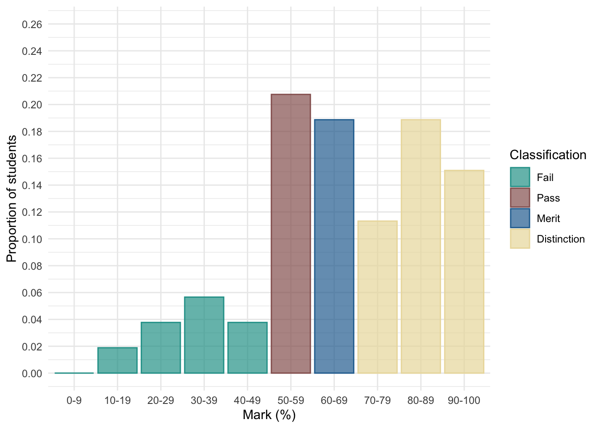

```{r}
# general
library(easystats)
library(tidyverse)
# specific

source("../helpers/discovr_helpers.R")
```


##  Overview

::: incremental

- Paper is released as an announcement on CANVAS
- You must submit a rendered `.html` file to CANVAS within 48 hours
  - Reasonable adjustments automatically added within the submission point
- The task deliberately requires you to make some of your own decisions

:::

\

::: fragment
:::{.callout-important icon=false}
##  Report`r rproj()`

You will be given:

- A research scenario and data
- A hypothesis

Write a report containing two sections:

- **Code**: Create all of the objects you need to write the report
- **Report**: Write a succinct report that interprets the results of your model with reference to the hypothesis

:::
:::

## Code

:::{.callout-important icon=false}
##  Code overview

Create all objects you need in this section (tables, plots, models etc)

:::


### Tips

::: incremental

- Plan what you're going to do **before** writing code - don't just dive in
- Don't print/view anything in this section
- Use the code that we teach 
- [**Use of AI is NOT permitted**]{.txt_mulberry}
- [Do not directly copy/paraphrase ANYTHING from the model answer]{.txt_mulberry}
- Less is more
  - Find the relevant `discovr` tutorial - follow it
  - Don't overthink it
  - You don't have to include everything you do

:::


## Report

:::{.callout-important icon=false}
##  Report overview

- Explain the model you have fitted and why.
- Include an equation that describes the main model you fit.
- Explain and justify any decisions you have made
- Interpret the main results

:::

{fig-align="center" height=400}

## Report
### Tips

::: incremental

- Follow the process of E.V.I.L.
  - [L]{.txt_mulberry}ook: summarize the data.
  - [V]{.txt_mulberry}isualise key parts of the data.
  - [E]{.txt_mulberry}valuate the fitted model
  - [I]{.txt_mulberry}nterpret the fitted model.
- Print and refer to relevant tables and plots (created in the *code* section)
  - Use quarto cross-referencing
  - Use `display()` to render tables
- Interpret the size of the parameter estimates (and CIs) that test the hypotheses, and their real world substance.
  - Focussing only on *p*-values will not garner high marks.

:::

## Marking

::: {.callout-caution icon = false}
##  Assessment criteria

- **Theoretical understanding (70% of marks)**: This criterion assesses technical accuracy in your statistical thinking.
- **Coding (15% of marks)**: These marks relate to your `r rproj()` code. How elegant, succinct, and `discovr`-like is your Code?
- **Organization (15% of marks)**: how concise and well organised is your report? How well have you used the features of quarto to format your document?

:::
        
::: notes
**Theoretical understanding (70% of marks)**: This criterion assesses technical accuracy in your statistical thinking.Therefore, these marks relate to the statistical procedures you choose and how you interpret them in the context of the stated hypothesis. For example, when describing a statistical procedure, or interpreting a statistical model, how technically accurate is your description/interpretation? How well do you understand the model you have fitted? How well have you related the models you have fitted to the original hypothesis and made a considered conclusion about the real world importance (or not) of the effects observed.
Coding (15% of marks): These marks relate to your R code. How elegant, succinct, and tidyverse-like is your R Code? Is there evidence of AI-generated code?
Organization (15% of marks): how concise and well organised is your report? Credit will be given to those who are selective in what analyses they include over those who include everything that they attempted. How well presented is your work?  How well presented are plots and tables? How well have you used the features of quarto to format your document?
:::

## General advice

::: incremental

- You don't need 48 hours
  - Do it on day 1, sleep well, quick review on day 2, then submit
- Throwing the kitchen sink at it is a bad strategy
- Join discord - we will monitor during the TAP:
  - We can't tell you what to do
  - We will try to help you top navigate errors
- Render regularly
- Remember RStudio has a spell check

:::

::: fragment
::: {.callout-warning icon = false}
##  The danger zone!

- Submit at the last minute at your own peril!
  - We cannot grant extensions
  - The submission portal shuts off automatically
- [**Use of AI is NOT permitted**]{.txt.mulberry}
- Do not directly copy/paraphrase ANYTHING from the model answer.
- Collusion of any kind is NOT permitted on this module

:::
:::

## End on a positive note ...


{fig-align="center" height=600}

::: notes
Distinction -  45.28%
Merit - 18.87%
Pass - 20.75%
Fail - 15.09%
::::

