# Statistical Models

**What are they and why do we need them?**

Professor Andy Field, University of Sussex

Links: [daft punk end of line](https://profandyfield.github.io/statistics_lectures/ds_01_statistical_models/media/daft_punk_end_of_line.mp3) \| [bsky.app](https://bsky.app/profile/profandyfield.bsky.social) \| [youtube.com](https://www.youtube.com/user/ProfAndyField) \| [discoveringstatistics.com](https://www.discoveringstatistics.com) \| [discovr.rocks](https://www.discovr.rocks) \| [statisticsadventure.com](https://www.statisticsadventure.com)

## About this version

This is a plain-text version of the lecture slides. Each slide starts with a heading such as “Slide 5”, and the numbers match the slide numbers shown in the lecture. Content that appeared one piece at a time, in columns or in tabs is shown in reading order. Videos and interactive apps are given as links.

## Slide 2: Learning outcomes

- Articulate why we fit statistical models
- Understand the function and form of the linear model
  - The mathematical model
  - Visualizing the model
  - Familiar models as variants of the linear model
- List the common properties of all statistical models
- Understand what the model parameters (*b*s) represent
- Understand why we use sampling

## Slide 3

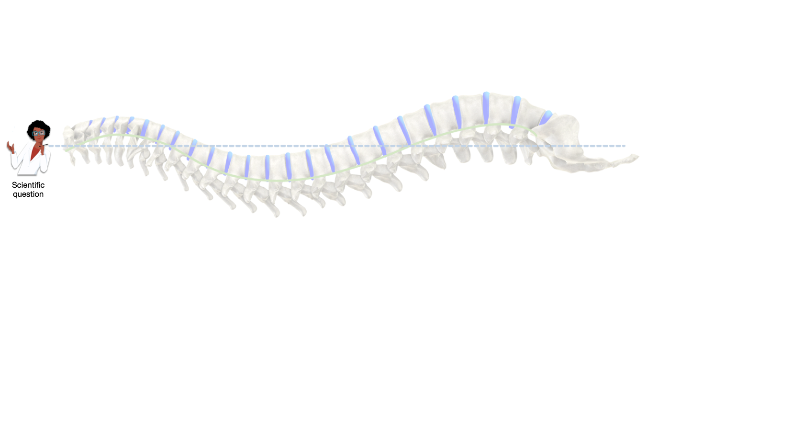

## Slide 4

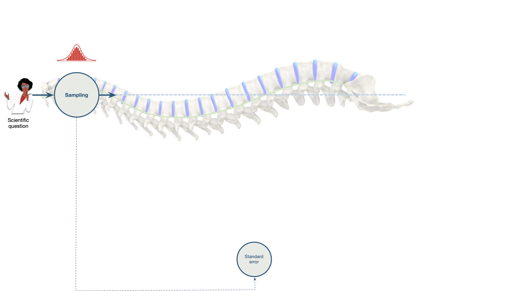

## Slide 5

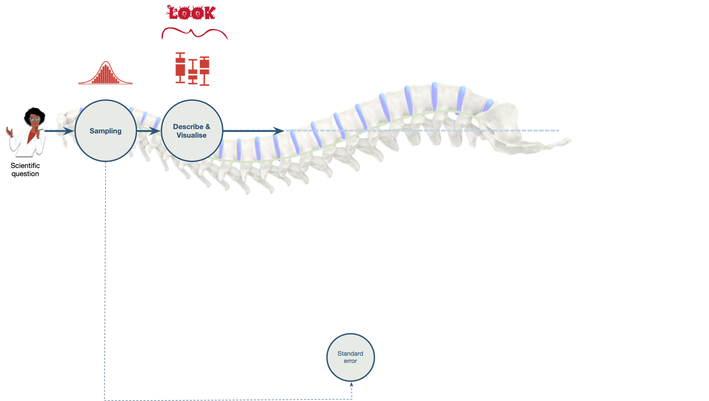

## Slide 6

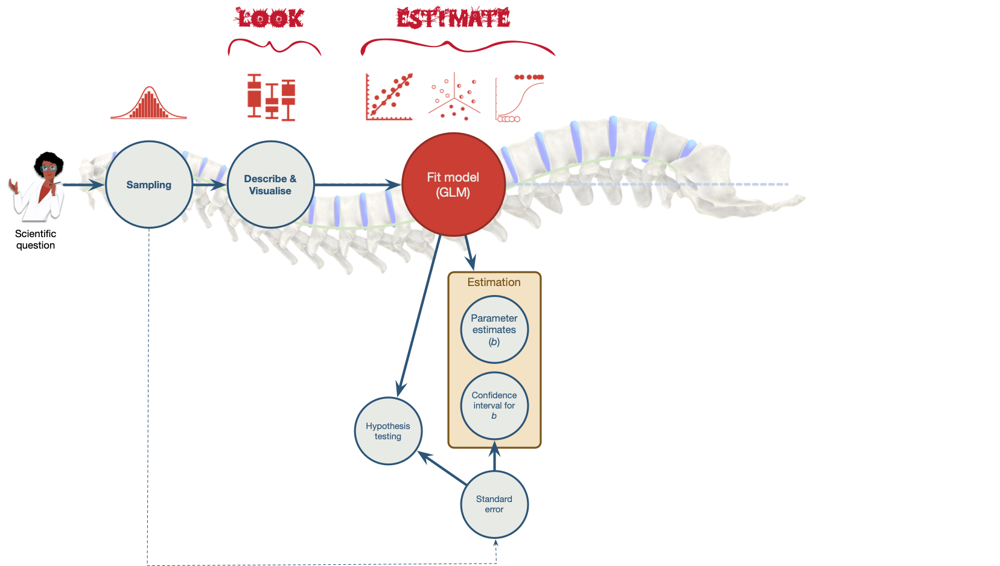

## Slide 7

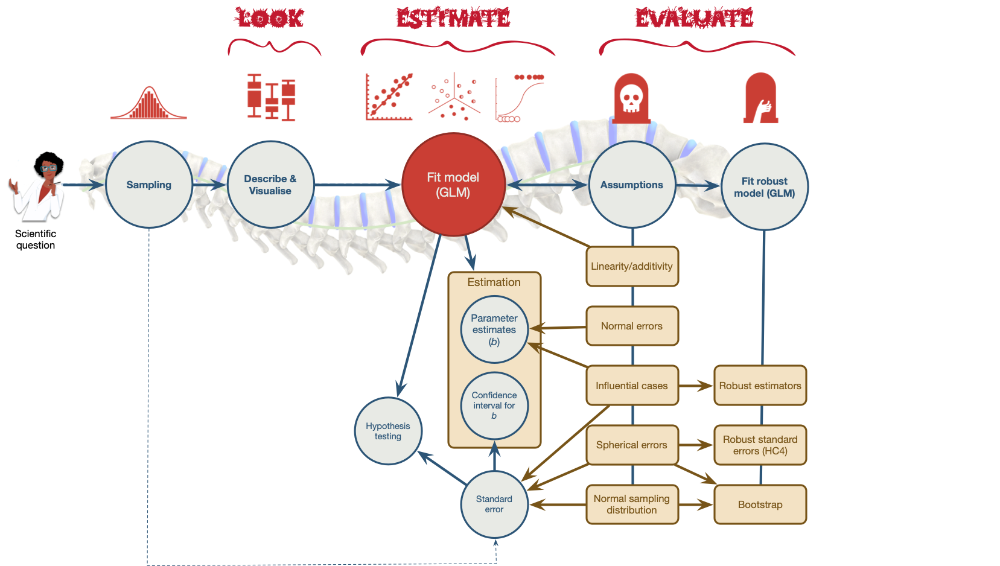

## Slide 8


## Slide 9

> **Caution: Think about it!**
>
> Hypothesis
>
> - Does attending concerts harm hearing?

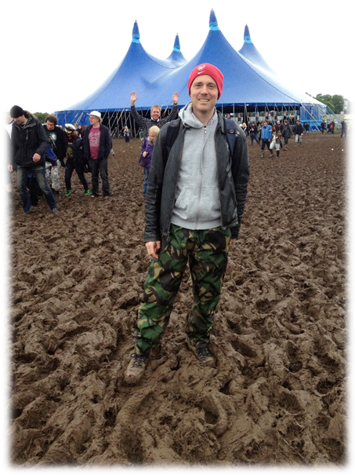

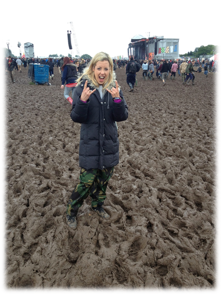

## Slide 10

Interactive content: [Shiny Gig Dashboard](https://milton-the-cat.rocks/gig_dashboard/)

## Slide 11: Why do we fit models?

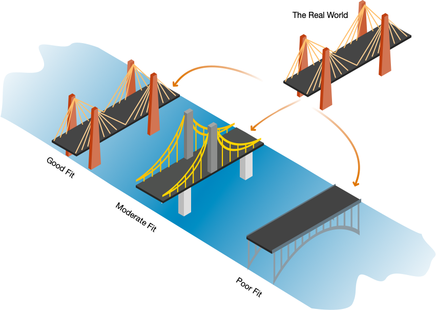

## Slide 12

Video clip: [bridge 01](https://profandyfield.github.io/statistics_lectures/ds_01_statistical_models/media/bridge_01.mp4)

## Slide 13

Video clip: [bridge water](https://profandyfield.github.io/statistics_lectures/ds_01_statistical_models/media/bridge_water.mp4)

## Slide 14

Video clip: [bridge wind](https://profandyfield.github.io/statistics_lectures/ds_01_statistical_models/media/bridge_wind.mp4)

## Slide 15

Video clip: [bridge hippo](https://profandyfield.github.io/statistics_lectures/ds_01_statistical_models/media/bridge_hippo.mp4)

## Slide 16

Interactive content: <https://milton-the-cat.rocks/lm_sampling/>

## Slide 17 (new section): Why do (some) students hate statistics?

## Slide 18

Video clip: [dw 42 clip](https://profandyfield.github.io/statistics_lectures/ds_01_statistical_models/media/dw_42_clip.mp4)

## Slide 19

``` math
 Y_i = \hat{b}_0 + \hat{b}_1\text{X}_{i} + \text{e}_i 
```

``` math
 r = \frac{\sum\limits_{i = 1}^n(x_i-\bar{X})(y_i-\bar{Y})}{(N-1)s_xs_y} 
```

``` math
 t = \frac{\bar{X}_1-\bar{X}_2}{\sqrt{\frac{s_1^2}{n_1} + \frac{s_2^2}{n_2}}} 
```

``` math
 \chi^2 = \sum\frac{(\text{observed}_{ij}-\text{model}_{ij})^2}{\text{model}_{ij}} 
```

## Slide 20 (new section): Can we make statistics (a bit) less like this?

## Slide 21

Video clip: [andy dungeon scream](https://profandyfield.github.io/statistics_lectures/ds_01_statistical_models/media/andy_dungeon_scream.mp4)

## Slide 22


A Zombie Quiz

## Slide 23: A zombie quiz

> A researcher counted how many humans and zombies choose brain chips or potato chips to accompany their dinner at the university canteen

- How do I analyze these data?

| Organism | Brain chips | Potato chips |
|----------|-------------|--------------|
| Human    | 28          | 42           |
| Zombie   | 61          | 57           |

## Slide 24

### A chi-square test

``` r
chisq.test(zom_fct_tib$organism, zom_fct_tib$chip, correct = FALSE)
```

 

| Chi2 | df  | p     | Method                     |
|------|-----|-------|----------------------------|
| 2.41 | 1   | 0.121 | Pearson's Chi-squared test |

## Slide 25

### A Spearman correlation?

``` r
correlation::correlation(method = "spearman", data = zom_tib) |>
  display()
```

 

| Parameter1 | Parameter2 | rho | CI | CI_low | CI_high | S | p | Method | n_Obs |
|----|----|----|----|----|----|----|----|----|----|
| organism | chip | -0.113 | 0.95 | -0.256 | 0.035 | 1232810 | 0.122 | Spearman correlation | 188 |

## Slide 26

### A Kendall’s $`\tau`$ correlation?

``` r
correlation::correlation(method = "kendall", data = zom_tib) |> 
  display()
```

 

| Parameter1 | Parameter2 | tau | CI | CI_low | CI_high | z | p | Method | n_Obs |
|----|----|----|----|----|----|----|----|----|----|
| organism | chip | -0.113 | 0.95 | -0.206 | -0.018 | -1.548 | 0.122 | Kendall correlation | 188 |

## Slide 27

### A Pearson correlation?

``` r
correlation::correlation(data = zom_tib) |> 
  display()
```

| Parameter1 | Parameter2 | r | CI | CI_low | CI_high | t | df_error | p | Method | n_Obs |
|----|----|----|----|----|----|----|----|----|----|----|
| organism | chip | -0.113 | 0.95 | -0.252 | 0.03 | -1.554 | 186 | 0.122 | Pearson correlation | 188 |

## Slide 28

### A *t*-test?

``` r
t.test(chip ~ organism, data = zom_tib) |> 
  model_parameters() |> 
  display()
```

| Parameter | Group | Mean_Group1 | Mean_Group2 | Difference | CI | CI_low | CI_high | t | df_error | p | Method | Alternative |
|----|----|----|----|----|----|----|----|----|----|----|----|----|
| chip | organism | 0.6 | 0.483 | 0.117 | 0.95 | -0.031 | 0.265 | 1.561 | 147.014 | 0.121 | Welch Two Sample t-test | two.sided |

## Slide 29

### One-way ANOVA?

``` r
aov(organism ~ factor(chip), data = zom_tib) |>
  test_wald() |> 
  display()
```

| Name       | Model | df  | df_diff | F     | p     |
|------------|-------|-----|---------|-------|-------|
| Null model | aov   | 187 | NA      | NA    | NA    |
| Full model | aov   | 186 | 1       | 2.416 | 0.122 |

## Slide 30

### Linear model (Regression)?

``` r
lm(organism ~ factor(chip), data = zom_tib) |> 
  model_parameters() |> 
  display()
```

| Parameter     | Coefficient | SE    | CI   | CI_low | CI_high | t      | df_error | p     |
|---------------|-------------|-------|------|--------|---------|--------|----------|-------|
| (Intercept)   | 0.685       | 0.051 | 0.95 | 0.584  | 0.786   | 13.390 | 186      | 0.000 |
| factor(chip)1 | -0.110      | 0.071 | 0.95 | -0.249 | 0.030   | -1.554 | 186      | 0.122 |

## Slide 31

### Loglinear model?

``` r
me_lm <- glm(n ~ organism + chip, family = "poisson", data = zom_freq)
full_lm <- glm(n ~ organism*chip, family = "poisson", data = zom_freq)

performance::test_lrt(me_lm, full_lm) |> 
  display()
```

|         | Name    | Model | df  | df_diff | Criterion | Chi2  | p    |
|---------|---------|-------|-----|---------|-----------|-------|------|
| me_lm   | me_lm   | glm   | 3   | NA      | 25.013    | NA    | NA   |
| full_lm | full_lm | glm   | 4   | 1       | 22.591    | 2.422 | 0.12 |

## Slide 32

### Multilevel model?

``` r
glmmTMB::glmmTMB(chip ~ organism + (1|canteen), data = zom_tib) |> 
  model_parameters() |> 
  display()
```

 

| Parameter   | Coefficient | SE   | CI_low | CI_high | z     | p    |
|-------------|-------------|------|--------|---------|-------|------|
| (Intercept) | 0.60        | 0.06 | 0.48   | 0.72    | 10.12 | 0.00 |
| organism    | -0.12       | 0.07 | -0.26  | 0.03    | -1.56 | 0.12 |

## Slide 33

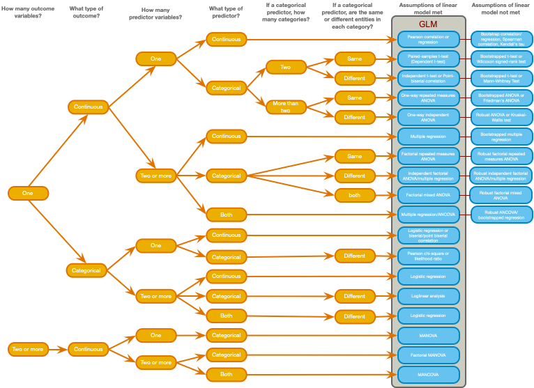

## Slide 34

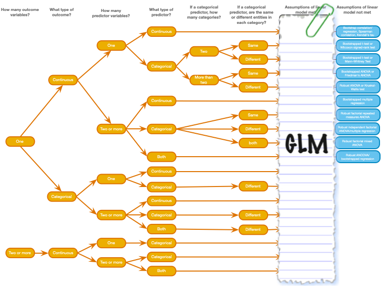

## Slide 35: Spoiler! We are always fitting this model

### The General Linear Model (GLM)

``` math
 \begin{aligned} \text{outcome}_i &= (\text{model}_i) + \text{error}_i \\ \text{outcome}_i &= b_0 + b_1\text{predictor}_{i} + \text{error}_i \\ \text{outcome}_i &= b_0 + b_1\text{predictor 1}_{i} + b_2\text{predictor 2}_{i} + \dots + \text{error}_i \end{aligned} 
```

> **Note: Statis-tip**
>
> All models have a S.P.I.N.E
>
> - **P**arameters. The $`b_0`$, $`b_1`$ … $`b_n`$ are the model parameters.
> - **E**stimation: model parameters are estimated from the data ($`\hat{b}_0`$, $`\hat{b}_1`$ … $`\hat{b}_n`$)
> - **S**tandard errors: there is uncertainty around these estimates because they vary from sample to sample. The standard error quantifies by how much they vary across samples.
> - **I**interval: the standard error can be used to quantify uncertainty using a confidence interval
> - **N**HST: we can test hypotheses using significance test of these parameter estimates (which also involved the standard error)

## Slide 36: Fitting models

> **Caution: Think about it**
>
> Questions to ask yourself
>
> - What variable is my outcome? What type is it?
> - What variable(s) are my predictors? What types are they?
> - What is the resulting form of the model?
> - Is it a good representation of the phenomenon?
> - Is this model a good fit of the data?

### Fitting models is E.V.I.L.

- **L**ook and **L**oad: get the data into R, process it, summarize it (look)
- **V**isualise: plot relevant information to understand the data/model
- **E**valuate: is the model any good? Are its assumptions met? Does it ‘fit’ the data?
- **I**nterpret: use the model to answer your question

## Slide 37


## Slide 38: Let’s return to our question

> **Caution: Hypothesis**
>
> - Does attending concerts harm hearing?


## Slide 39: The General Linear Model (GLM)

### What variable is my outcome? What type is it?

- Ringing in ears (minutes)
- Continuous

### What variable(s) are my predictors? What types are they?

- Volume (db)
- Continuous

### What is my model?

``` math
 \begin{aligned} \text{outcome}_i &= (\text{model}_i) + \text{error}_i \\ \text{outcome}_i &= b_0 + b_1\text{predictor}_{i} + \text{error}_i \\ \text{ringing}_i &= b_0 + b_1\text{volume}_{i} + e_i \end{aligned} 
```

## Slide 40 (new section): Collect data

## Slide 41

Interactive content: <https://milton-the-cat.rocks/lm_sampling/>

## Slide 42 (new section): Use the data to estimate the model parameters

## Slide 43: Parameters and parameter estimates

### The unobservable truth (population)

``` math
 \begin{aligned} \text{ringing}_i &= b_0 + b_1\text{volume}_{i} + \varepsilon_i \end{aligned} 
```

### The observable truth (sample)

``` math
 \begin{aligned} \text{ringing}_i &= \hat{b}_0 + \hat{b}_1\text{volume}_{i} + e_i \end{aligned} 
```

 

### What are the parameter estimates?

- $`\hat{b}_1`$: Estimate of the parameter for a predictor
  - Direction/strength of relationship/effect between the predictor and the outcome (when other variables are constant)
  - Difference in means when predictors are categorical
- $`\hat{b}_0`$: the intercept
  - Estimate of the value of the outcome when predictor(s) = 0

## Slide 44: How are parameters estimated?

### Ordinary Least Squares (OLS)

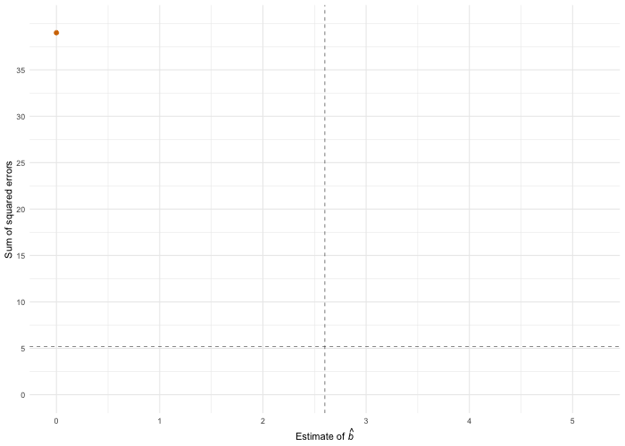

## Slide 45: Visualise: What does the model look like?


``` math
 \begin{aligned} \text{ringing}_i &= \hat{b}_0 + \hat{b}_1\text{volume}_{i} + e_i \end{aligned} 
```

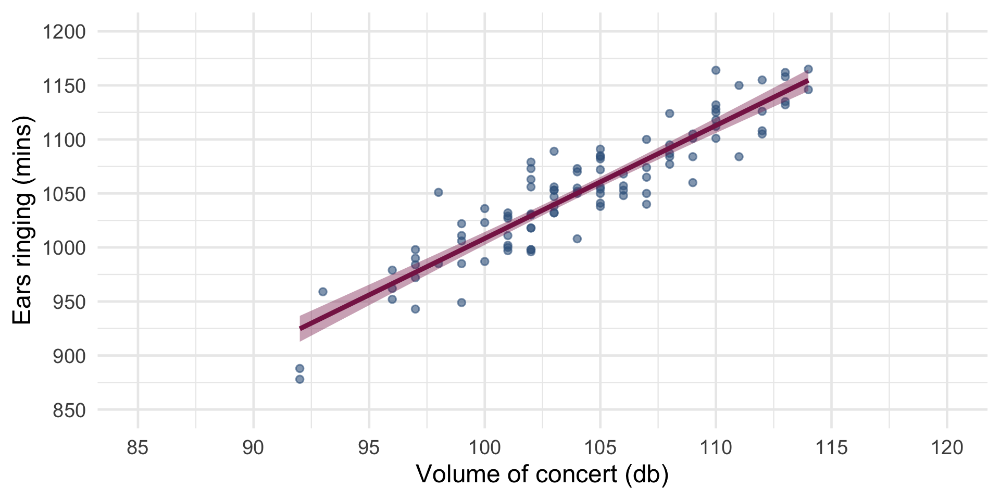

## Slide 46: Visualise


``` math
 \begin{aligned} \text{ringing}_i &= \hat{b}_0 + \hat{b}_1\text{volume}_{i} + e_i \end{aligned} 
```

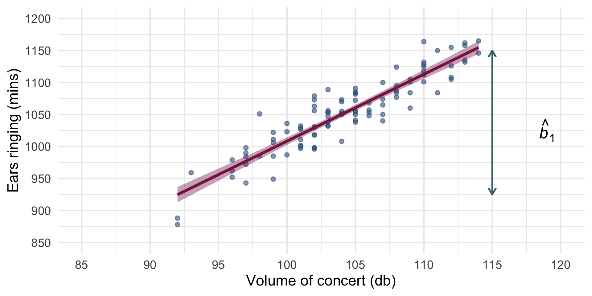

## Slide 47: Visualise


``` math
 \begin{aligned} \text{ringing}_i &= \hat{b}_0 + \hat{b}_1\text{volume}_{i} + e_i \end{aligned} 
```


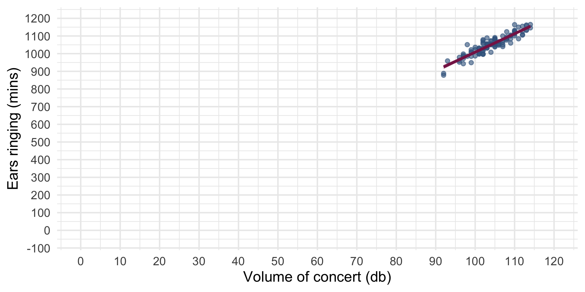

## Slide 48: Interpret: what does the model mean?


``` math
 \begin{aligned} \hat{\text{ringing}}_i &= -37.12 + 10.45\text{volume}_{i} \end{aligned} 
```


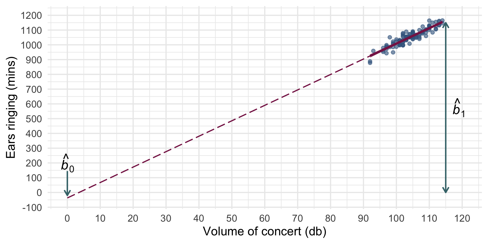

- $`\hat{b}_1 = 10.45`$:
  - Direction/strength of relationship/effect between volume and ringing
  - As volume goes up by 1db, we can expect 10.45 more minutes of ringing
- $`\hat{b}_0 = -37.12`$:
  - For how long we can expect ears to ring when volume is 0db (silence)
  - In silence, ears ring for -37.12 minutes 🤔

## Slide 49: Summary

- We fit statistical models to answer interesting questions
- All models are variations on the linear model
- Fitting models is E.V.I.L.
- Parameters tell us about the effects of interest
- We estimate these parameters from our data
- There will be uncertainty around those estimates
- Confidence intervals quantify that uncertainty
