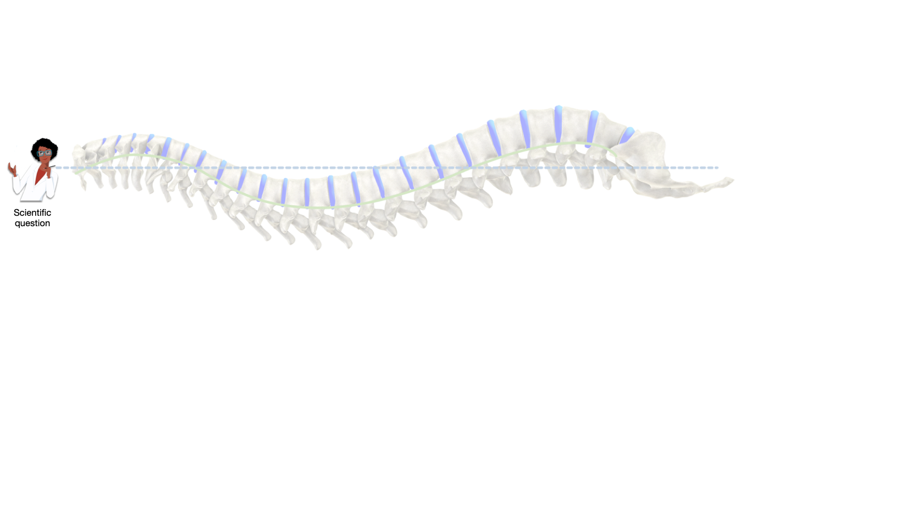
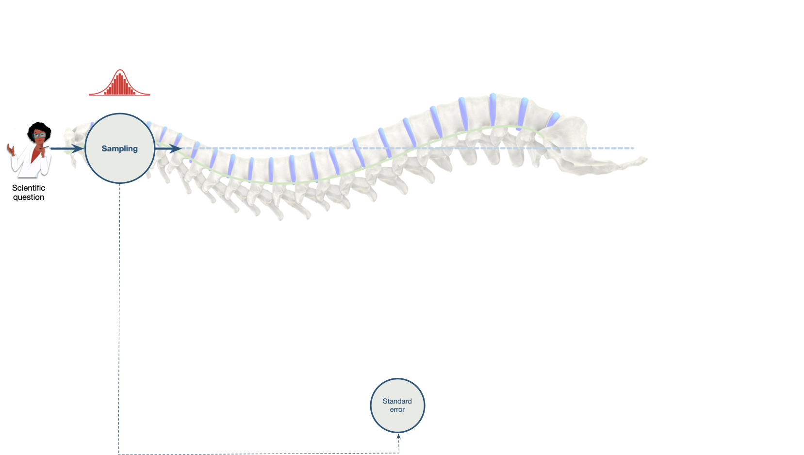
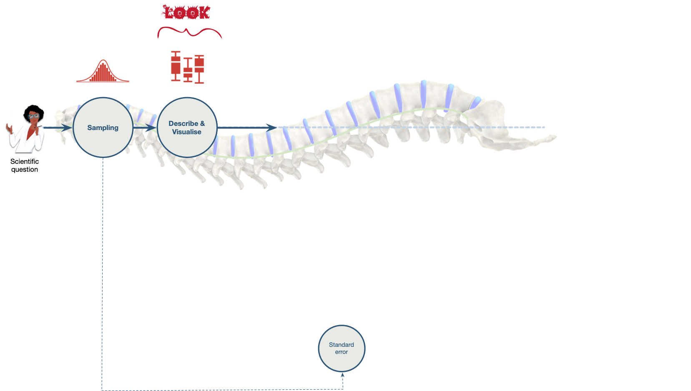
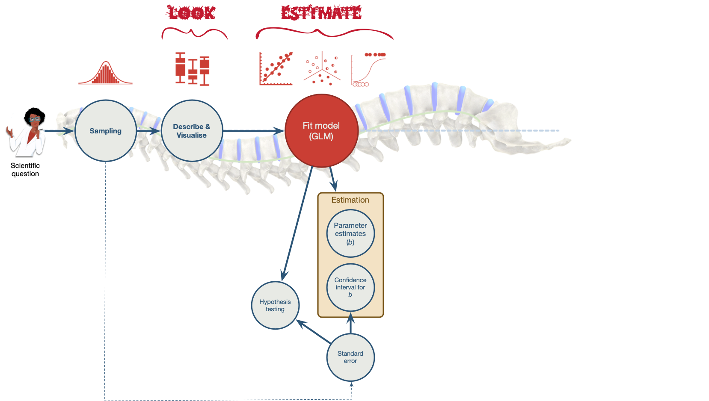
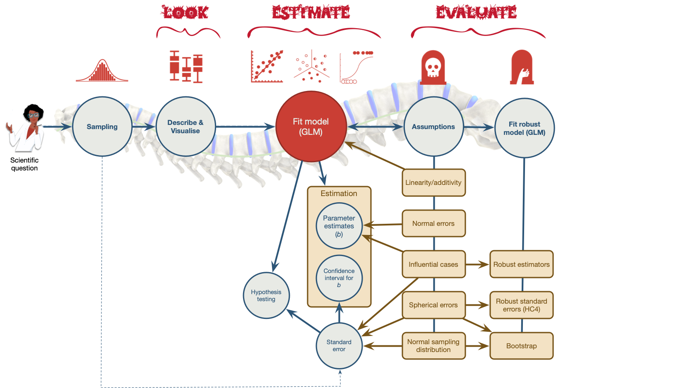

{fig-align="center" height=600 width=1050}

::: notes
All research starts with a question, hypothesis, or something that needs to be quantified or estimated.
:::

##

{fig-align="center" height=600 width=1050}

::: notes
To test that idea you need to sample data. A key concept here is something known as sampling variation, which is quantified by the standard error.
:::

##

{fig-align="center" height=600 width=1050}

::: notes
Having collected data you need to describe and visualise it (although we don't talk about this in lectures, the tutorials will give you practice)
:::

##

{fig-align="center" height=600 width=1050}

::: notes
You then fit a model to the data and estimate the parameters and standard error using the data. from these you can alsi construct significance tests and confidence intervals (for the parameters)
:::

##

{fig-align="center" height=600 width=1050}

::: notes
All models are wrong, but some are useful. We need to evaluate the model for fit and bias.
:::

##

{fig-align="center" height=600 width=1050}

::: notes
Fionally we need to interpret aspects of the model to 'know' answers to our questions.
:::
