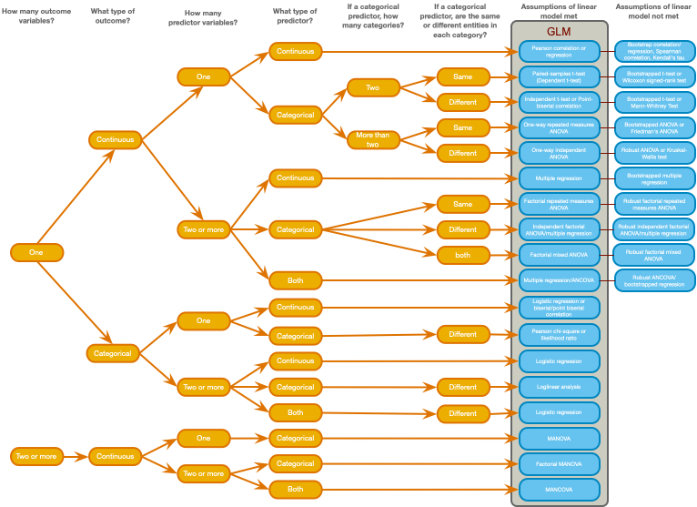
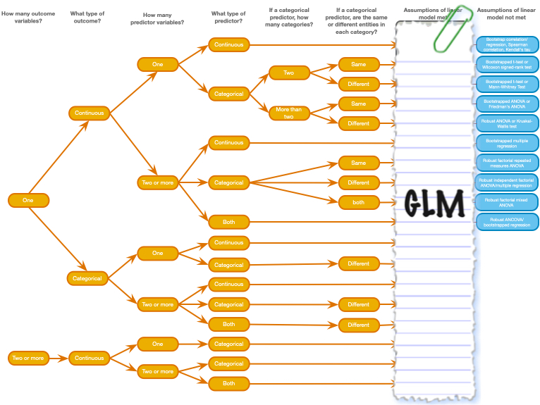

## A zombie quiz

> A researcher counted how many humans and zombies choose brain chips or potato chips to accompany their dinner at the university canteen

- How do I analyze these data?

```{r}
#| echo: false

zom_fct_tib <- tibble::tibble(
  organism = c(rep("Human", 70), rep("Zombie", 118)) |> forcats::as_factor(), 
  chip = c(rep("Brain chips", 28), rep("Potato chips", 42), rep("Brain chips", 61), rep("Potato chips", 57))  |> forcats::as_factor()
  )

zom_tib <- zom_fct_tib |>
  dplyr::mutate(
    dplyr::across(where(is.factor), \(x) as.numeric(x)),
    organism = organism - 1,
    chip = chip - 1,
  )

zom_freq <- tibble::tribble(
  ~organism, ~chip, ~n,
  "Human", "Brain", 28,
  "Human", "Potato", 42,
  "Zombie", "Brain", 61,
  "Zombie", "Potato", 57,
)

  
zom_tble <- tibble::tibble(
  `Organism` = c("Human", "Zombie"),
  `Brain chips` = c(28, 61),
  `Potato chips` = c(42, 57)
  )

```


```{r}
#| echo: false

zom_tble |> 
  insight::display()
```

##

### A chi-square test

```{r}
#| eval: false
#| echo: true

chisq.test(zom_fct_tib$organism, zom_fct_tib$chip, correct = FALSE)
```

\ 

```{r}
#| echo: false

zom_chi <- chisq.test(zom_fct_tib$organism, zom_fct_tib$chip, correct = FALSE)

parameters::model_parameters(zom_chi) |>
  knitr::kable(digits = 3) |>
  kableExtra::column_spec(3, background = "yellow")
```

##
### A Spearman correlation?


```{r}
#| eval: false
#| echo: true

zom_tib |>
  correlation::correlation(method = "spearman")
```

\ 

::: fragment
::: txt_tbl
```{r}
#| echo: false

zom_tib |>
  correlation::correlation(method = "spearman") |> 
  knitr::kable(digits = 3) |>
  kableExtra::kable_styling(bootstrap_options = "striped") |> 
  kableExtra::column_spec(8, background = "yellow")
```

:::
:::

##
### A Kendall's $\tau$ correlation?

```{r}
#| eval: false
#| echo: true

zom_tib |>
  correlation::correlation(method = "kendall")
```

\ 

::: fragment
::: txt_tbl

```{r}
#| echo: false
#| 
zom_tib |>
  correlation::correlation(method = "kendall") |> 
  knitr::kable(digits = 3) |> 
  kableExtra::kable_styling(bootstrap_options = "striped") |> 
  kableExtra::column_spec(8, background = "yellow")
```

:::
:::

##
### A Pearson correlation?


```{r}
#| eval: false
#| echo: true

zom_tib |>
  correlation::correlation()
```

\

::: fragment
::: txt_tbl

```{r}
#| echo: false

zom_tib |>
  correlation::correlation() |> 
  knitr::kable(digits = 3) |> 
  kableExtra::kable_styling(bootstrap_options = "striped") |> 
  kableExtra::column_spec(9, background = "yellow")
```

:::
:::

##
### A *t*-test?

```{r}
#| echo: false

brains <- zom_tib |> dplyr::filter(chip == 0)
potatoes <- zom_tib |> dplyr::filter(chip == 1)
```

\

::: fragment
::: txt_tbl

```{r}
#| eval: false
#| echo: true

t.test(brains$organism, potatoes$organism)
```

```{r}
#| echo: false

t.test(brains$organism, potatoes$organism) |>
  broom::tidy() |> 
  knitr::kable(digits = 3) |> 
  kableExtra::kable_styling(bootstrap_options = "striped") |> 
  kableExtra::column_spec(5, background = "yellow")
```

:::
:::

##
### One-way ANOVA?


```{r}
#| eval: false
#| echo: true

zom_tib |>
  aov(organism ~ factor(chip), data = _)
```

\

::: fragment

```{r}
#| echo: false
#| 
zom_tib |>
  aov(organism ~ factor(chip), data = _) |>
  broom::tidy() |> 
  knitr::kable(digits = 3) |> 
  kableExtra::column_spec(6, background = "yellow") |> 
  kableExtra::row_spec(2, background = "white")
```

:::

##
### Linear model (Regression)?

```{r}
#| eval: false
#| echo: true

zom_tib |>
  lm(organism ~ factor(chip), data = _)
```

\

::: fragment

```{r}
#| echo: false
 
zom_tib |>
  lm(organism ~ factor(chip), data = _) |>
  parameters::model_parameters() |> 
  knitr::kable(digits = 3) |> 
  kableExtra::column_spec(9, background = "yellow") |> 
  kableExtra::row_spec(1, background = "white")
```

:::

##
### Loglinear model?

```{r}
#| eval: false
#| echo: true

me_lm <- glm(n ~ organism + chip, family = "poisson", data = zom_freq)
full_lm <- glm(n ~ organism*chip, family = "poisson", data = zom_freq)

performance::test_lrt(me_lm, full_lm)
```

\

::: fragment

```{r}
#| echo: false

me_lm <- glm(n ~ organism + chip, family = "poisson", data = zom_freq)
full_lm <- glm(n ~ organism*chip, family = "poisson", data = zom_freq)

performance::test_lrt(me_lm, full_lm) |> 
  knitr::kable(digits = 3) |> 
  kableExtra::column_spec(7, background = "yellow") |> 
  kableExtra::row_spec(1, background = "white")
```

:::


##
### Multilevel model?

```{r, echo = F}
zom_tib <- zom_tib |> 
  dplyr::mutate(
    canteen = c(0, 0, 1, 0, 0, 0, 0, 1, 0, 0, 1, 1, 1, 1, 1, 0, 0, 0, 1, 1, 0, 0, 0, 0, 1, 0, 0, 1, 0, 0, 0, 0, 1, 0, 1, 0, 1, 0, 0, 0, 1, 1, 1, 1, 0, 1, 1, 1, 0, 0, 0, 1, 0, 1, 1, 1, 1, 1, 1, 1, 0, 0, 1, 1, 1, 1, 1, 0, 1, 1, 1, 0, 1, 1, 1, 0, 1, 0, 1, 0, 1, 0, 0, 0, 0, 1, 1, 0, 1, 1, 1, 1, 1, 0, 1, 1, 0, 0, 1, 0, 0, 1, 0, 0, 1, 0, 1, 0, 0, 1, 1, 1, 0, 0, 1, 0, 0, 1, 1, 0, 0, 1, 0, 1, 1, 0, 1, 1, 1, 1, 1, 0, 1, 1, 1, 1, 0, 0, 1, 1, 1, 0, 1, 0, 1, 1, 1, 1, 1, 1, 0, 1, 1, 0, 1, 0, 0, 0, 0, 0, 0, 0, 0, 1, 0, 1, 0, 1, 0, 1, 1, 0, 1, 1, 1, 0, 1, 0, 1, 1, 0, 0, 1, 0, 0, 0, 1, 0) |> factor()
  )
```


```{r}
#| echo: true
#| eval: false

glmmTMB::glmmTMB(chip ~ organism + (1|canteen), data = zom_tib)
```

\ 

::: fragment
::: txt_tbl

```{r}
#| echo: false
#| message: false

ml_tbl <- glmmTMB::glmmTMB(chip ~ organism + (1|canteen), data = zom_tib) |> 
  parameters::model_parameters(effects = "fixed") |> 
  tibble::as_tibble() |> 
  dplyr::select(-c(CI, Effects, df_error))

knitr::kable(ml_tbl, digits = 2) |> 
  kableExtra::column_spec(7, background = "yellow") |> 
  kableExtra::row_spec(1, background = "white")
```

:::
:::

##

{fig-align="center" height=600}

##

{fig-align="center" height=600}
