# Interpreting Models

**Parameter estimates, confidence intervals and p-values**

Professor Andy Field, University of Sussex

Links: [black crown initiate great mistake](https://profandyfield.github.io/statistics_lectures/ds_02_interpretation/media/black_crown_initiate_great_mistake.mp3) \| [bsky.app](https://bsky.app/profile/profandyfield.bsky.social) \| [youtube.com](https://www.youtube.com/user/ProfAndyField) \| [discoveringstatistics.com](https://www.discoveringstatistics.com) \| [discovr.rocks](https://www.discovr.rocks) \| [statisticsadventure.com](https://www.statisticsadventure.com)

## About this version

This is a plain-text version of the lecture slides. Each slide starts with a heading such as “Slide 5”, and the numbers match the slide numbers shown in the lecture. Content that appeared one piece at a time, in columns or in tabs is shown in reading order. Videos and interactive apps are given as links.

## Slide 2: Learning outcomes

Be able to interpret

- Parameter estimates
- Standardized parameter estimates
- Their confidence intervals
- *p*-values

## Slide 3


## Slide 4


## Slide 5 (new section): Interpreting parameter estimates

## Slide 6: Raw effect size (b)


- Does playing hard to get work?<sup>1</sup>
- Heterosexual participants conversed with an opposite-sex confederate over Instant Messenger for 8 mins
- **Interest**: Final message coded for the number of expressions of romantic interest (range 0 to 4)
- **Hard to get**: 3 items rated 1 (not at all) and 5 (very much so)
  - *The other participant is hard to get*
- **Mate value**: 4 items rated 1 (not at all) and 5 (very much so)
  - *I perceive the other participant as a valued mate*

*Footnotes*

1.  [Birnbaum et al. (2020). *Journal of Social and Personal Relationships*. Study 3.](https://doi.org/10.1177/0265407520927469)

## Slide 7: The model

``` math
 \text{interest}_i = \hat{b}_0 + \hat{b}_1\text{hard to get}_i +e_i 
```


| Parameter   | Coefficient | SE   | 95% CI        | t(126) | p     |
|-------------|-------------|------|---------------|--------|-------|
| (Intercept) | 0.31        | 0.52 | (-0.73, 1.35) | 0.59   | 0.556 |
| hard to get | 0.29        | 0.17 | (-0.04, 0.62) | 1.76   | 0.080 |

- As the perception that the other person was hard to get increased by 1 (on a scale from 1-5), **0.29** more expressions of interest were made.
- You’d need perceptions of ‘hard to get’ to increase by $`\frac{1}{0.29}`$ = 3.40 on a 5-point scale to get 1 additional expression of interest.

## Slide 8 (new section): Standardized parameter estimates

## Slide 9: Standardized beta (\\\beta\\)

> **Note: Statis-tip**
>
> - Standardized parameter estimates express effects in standard deviation units
> - With one predictor it *is* the Pearson correlation coefficient.
> - Can be compared across studies that used different measures of the same variables
> - It is like estimating parameters from the data when they have been converted to *z*-scores (i.e., Mean = 0, SD = 1)

### The model

``` math
 z(\text{interest})_i = \hat{b}_0 + \hat{b}_1z(\text{hard to get})_i +e_i 
```

| Parameter   | Coefficient | SE   | 95% CI        | t(126)    | p       |
|-------------|-------------|------|---------------|-----------|---------|
| (Intercept) | -1.64e-16   | 0.09 | (-0.17, 0.17) | -1.87e-15 | \> .999 |
| hard to get | 0.16        | 0.09 | (-0.02, 0.33) | 1.76      | 0.080   |

- As the perception that the other person was hard to get increased by 1 **standard deviation**, expressions of interest changed by 0.16 **standard deviations**.

## Slide 10 (new section): Sampling variation

## Slide 11

Interactive content: <https://milton-the-cat.rocks/lm_sampling/>

## Slide 12 (new section): Confidence intervals

## Slide 13

Interactive content: <https://milton-the-cat.rocks/lm_sampling/>

## Slide 14

Interactive content: <https://milton-the-cat.rocks/ci_explorer/>

## Slide 15: Confidence intervals

> **Note: Statis-tip**
>
> What confidence intervals are:
>
> - Intervals that contain the ‘true’ population value of the parameter in 95% of samples
> - They are related to the uncertainty in our parameter estimate
>   - Wide intervals (small sample) = lots of uncertainty
>   - Narrow intervals (large sample) = less uncertainty

> **Warning: The danger zone!**
>
> What confidence intervals are NOT:
>
> - There is NOT a 95% probability that a given interval contains the population value.
>   - It is *p* = 0 or *p* = 1, but you can’t know which!
> - They do NOT reflect confidence in the value of the population parameter.

## Slide 16: A practical solution

> **Note: Statis-tip**
>
> We make an assumption (that could be wrong)
>
> - We assume that our sample **is** one of the 95% that yields a confidence interval containing the true value of the parameter.<sup>1</sup>
> - We acknowledge that this assumption will be incorrect 5% of the time.<sup>2</sup>

### Under this assumption …

- The confidence interval can be interpreted as containing the true (population) value of the parameter.

> **Important: ReportR**
>
> Assuming that this sample is one of the 95% that yields a confidence interval containing the true value of the parameter the effect could be as small as \[`value of lower boundary`\] or as large as \[`value of upper boundary`\]

*Footnotes*

1.  For an *x*% interval we assume our sample is one of the *x*%

2.  For an *x*% interval we will be wrong (1-*x*)% of the time.

## Slide 17: Back to Birnbaum

``` math
 \text{interest}_i = \hat{b}_0 + \hat{b}_1\text{hard to get}_i +e_i 
```

| Parameter   | Coefficient | SE   | 95% CI        | t(126) | p     |
|-------------|-------------|------|---------------|--------|-------|
| (Intercept) | 0.31        | 0.52 | (-0.73, 1.35) | 0.59   | 0.556 |
| hard to get | 0.29        | 0.17 | (-0.04, 0.62) | 1.76   | 0.080 |

- **Assuming that this sample is one of the 95% that yields a confidence interval containing the true value of the parameter …**
- As the perception that the other person was hard to get increases by 1, the corresponding change in the number of expressions made could be as small as **-0.04**. In other words, there are *fewer* expressions of interest.
- As the perception that the other person was hard to get increases by 1, the corresponding change in the number of expressions made could be as large as **0.62**. In other words, there are *more* expressions of interest.
- It’s plausible that as the perception that the other person was hard to get increases by 1, there is *no change* in expressions of interest (*b* = 0).
- **The assumption at the start might be false**

## Slide 18

Video clip: [hippo burp](https://profandyfield.github.io/statistics_lectures/shared_media/video/hippo_burp.mp4)

## Slide 19 (new section): Testing hypotheses

## Slide 20: Using parameters to test hypotheses

- Parameters represent effects:
  - Relationships between variables
  - Differences between means
- Parameters reflect hypotheses:
  - $`H_0`$: $`b = 0`$ or $`b_1 = b_2`$
  - $`H_1`$: $`b \ne 0`$ or $`b_1 \ne b_2`$
- All parameters have an associated sampling distribution
  - For any parameter, we can work out the probability of getting at least the value we have if the null hypothesis is true (e.g., if $`b = 0`$, or $`b_1 \ne b_2`$)
  - *p* \< 0.05 is typically used as a threshold for ‘significance’

``` math
 t = \frac{b}{SE_b} 
```

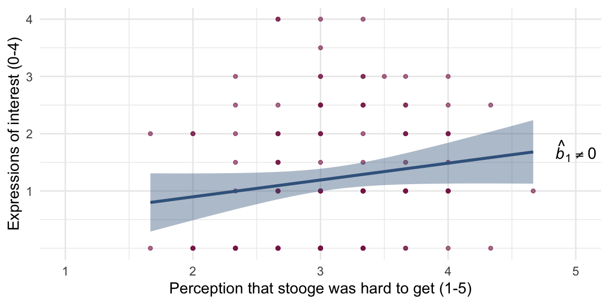

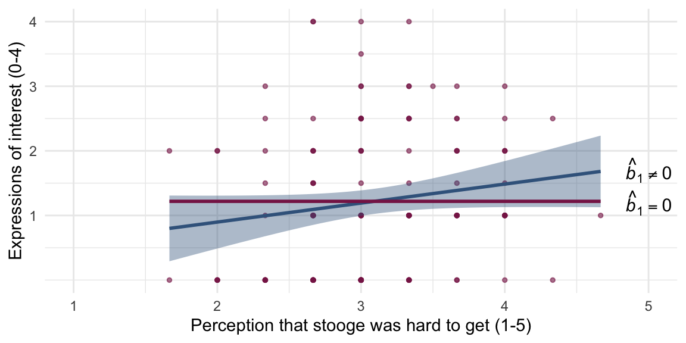

## Slide 21: What is a p-value?

### Hypothesis


- H<sub>0</sub>: Alice does not want to date Zach
- H<sub>1</sub>: Alice wants to date Zach

### Test statistic


Humour rating = 5

## Slide 22: What is a p-value?

Humour rating = 5

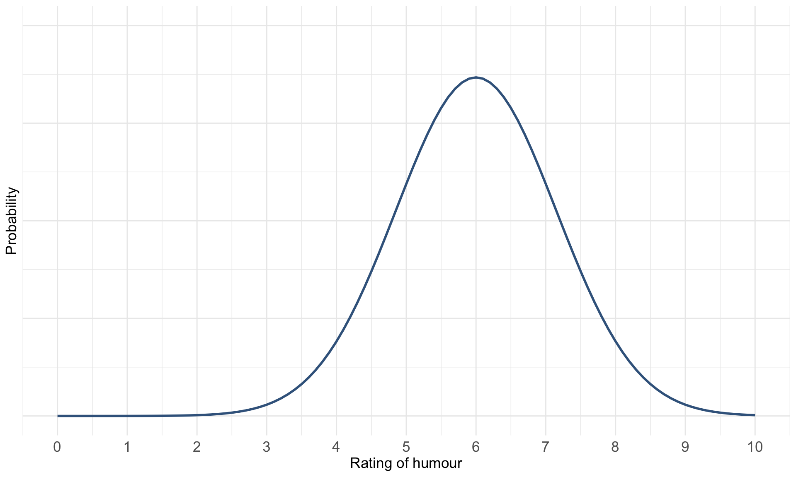


## Slide 23: What is a p-value?

Humour rating = 5


## Slide 24: What is a p-value?

Humour rating = 5

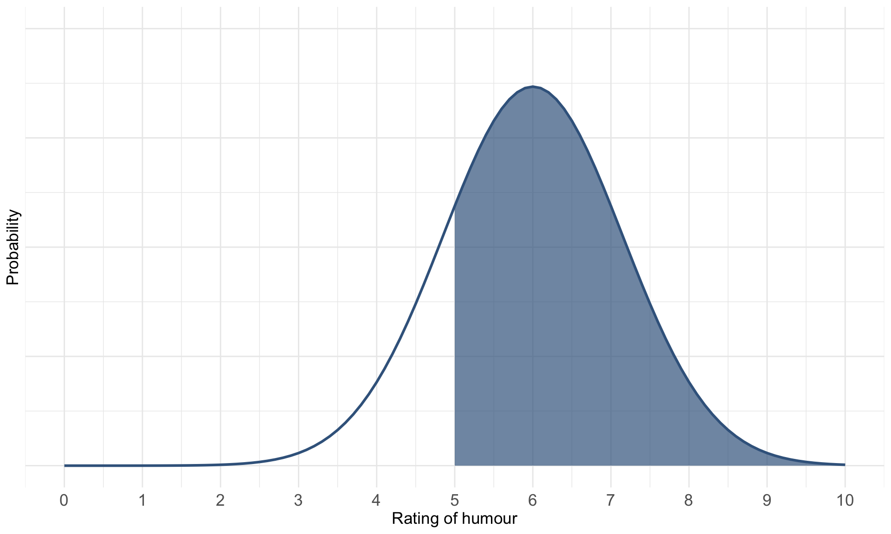

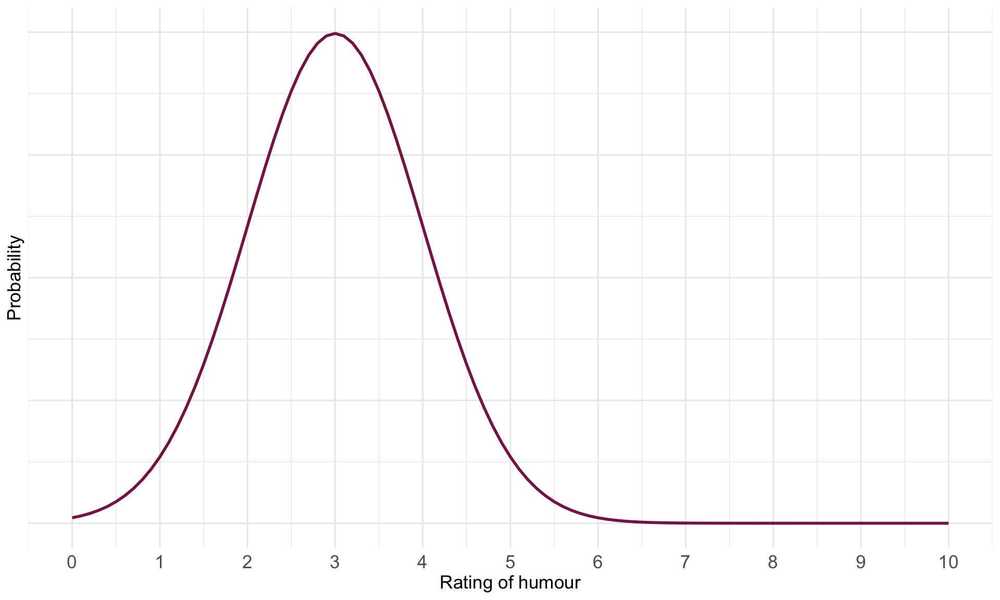


## Slide 25: What is a p-value?

Humour rating = 5


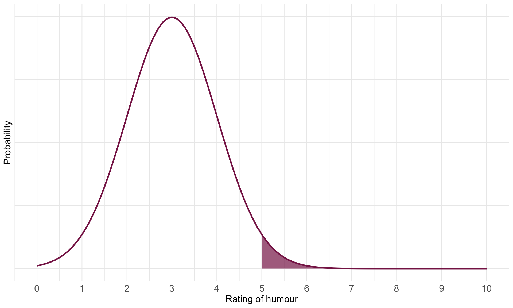


## Slide 26: The p-value

> **Note: Statis-tip**
>
> The *p*-value IS:
>
> - The probability of getting a test statistic at least as big as the one you have observed given that the null hypothesis is true.

> **Warning: The danger zone!**
>
> The *p*-value is NOT:
>
> - The probability of a chance result
> - The probability that H<sub>1</sub> is true
> - The probability that H<sub>0</sub> is true

## Slide 27: Problems with p

### Teddy bear therapy


### Control group


## Slide 28: p depends upon sample size

### Same effects, different *p*s

#### Study 1:

| term        | estimate | std.error | statistic | p.value |
|-------------|----------|-----------|-----------|---------|
| (Intercept) | 12.89    | 0.525     | 24.565    | 0       |
| groupBook   | -5.00    | 0.742     | -6.738    | 0       |

#### Study 2:

| term        | estimate | std.error | statistic | p.value |
|-------------|----------|-----------|-----------|---------|
| (Intercept) | 12.8     | 2.054     | 6.233     | 0.000   |
| groupBook   | -5.0     | 2.904     | -1.722    | 0.102   |

### Zero effect (approx), significant *p*

#### Study 3:

| term        | estimate | std.error | statistic | p.value |
|-------------|----------|-----------|-----------|---------|
| (Intercept) | 12.113   | 0.018     | 660.082   | 0.000   |
| groupBook   | 0.052    | 0.026     | 1.997     | 0.046   |

> **Caution: Think about it!**
>
> - Why?

## Slide 29: p depends upon sample size

### Same effects, different *p*s

#### Study 1: *n* = 200

| term        | estimate | std.error | statistic | p.value |
|-------------|----------|-----------|-----------|---------|
| (Intercept) | 12.89    | 0.525     | 24.565    | 0       |
| groupBook   | -5.00    | 0.742     | -6.738    | 0       |

#### Study 2: *n* = 20

| term        | estimate | std.error | statistic | p.value |
|-------------|----------|-----------|-----------|---------|
| (Intercept) | 12.8     | 2.054     | 6.233     | 0.000   |
| groupBook   | -5.0     | 2.904     | -1.722    | 0.102   |

### Zero effect (approx), significant *p*

#### Study 3: *n* = 200,000

| term        | estimate | std.error | statistic | p.value |
|-------------|----------|-----------|-----------|---------|
| (Intercept) | 12.113   | 0.018     | 660.082   | 0.000   |
| groupBook   | 0.052    | 0.026     | 1.997     | 0.046   |

## Slide 30: Problems with NHST

- Tells us nothing about importance because *p* depends upon sample size
- Provides little evidence about the null (or alternative) hypothesis
  - Assumes the null is true
  - *p* \> .05 simply means the effect is not big enough to be found, not that it is 0
  - *p* \< .05 means that the observed test statistic is unlikely given the null is true
- All or nothing thinking

## Slide 31 (new section): When p \> .05 (not significant)

## Slide 32

Video clip: [animal screams](https://profandyfield.github.io/statistics_lectures/ds_02_interpretation/media/animal_screams.mp4)

## Slide 33 (new section): When p \< .05 (significant)

## Slide 34

Video clip: [dancing cat](https://profandyfield.github.io/statistics_lectures/ds_02_interpretation/media/dancing_cat.mp4)

## Slide 35: All or nothing thinking

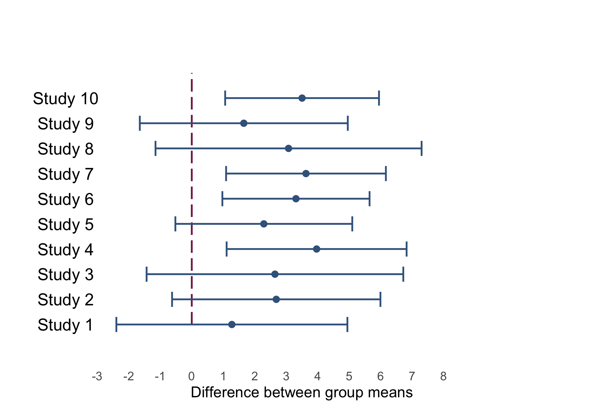

## Slide 36: All or nothing thinking

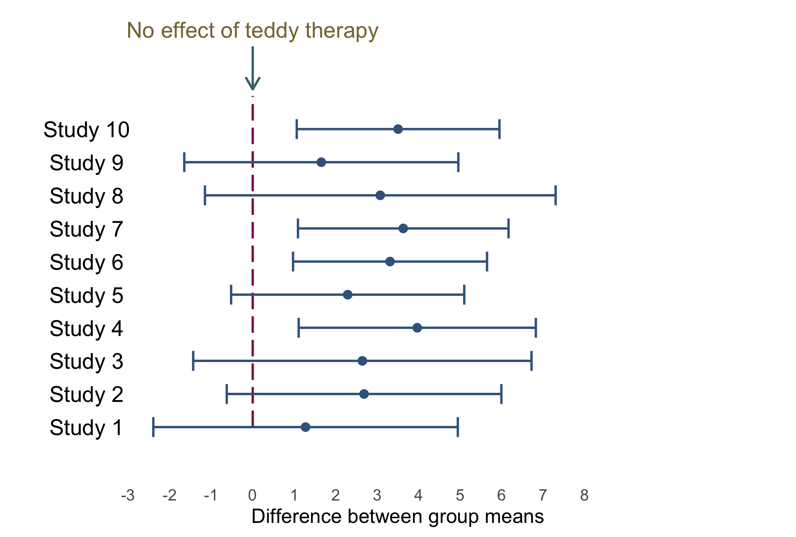

## Slide 37: All or nothing thinking

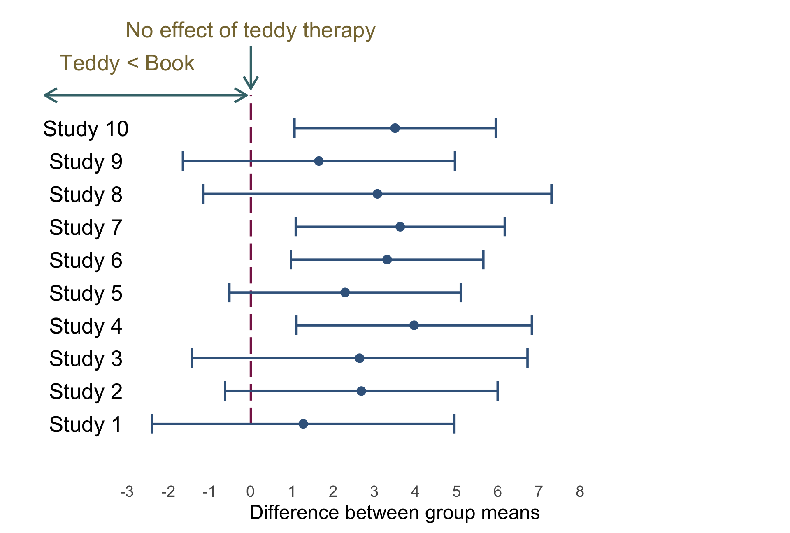

## Slide 38: All or nothing thinking

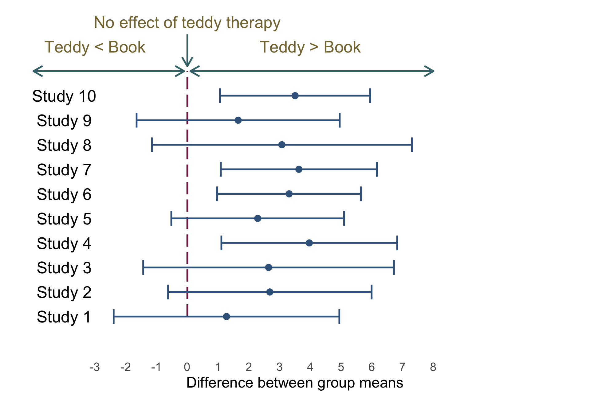

## Slide 39: All or nothing thinking

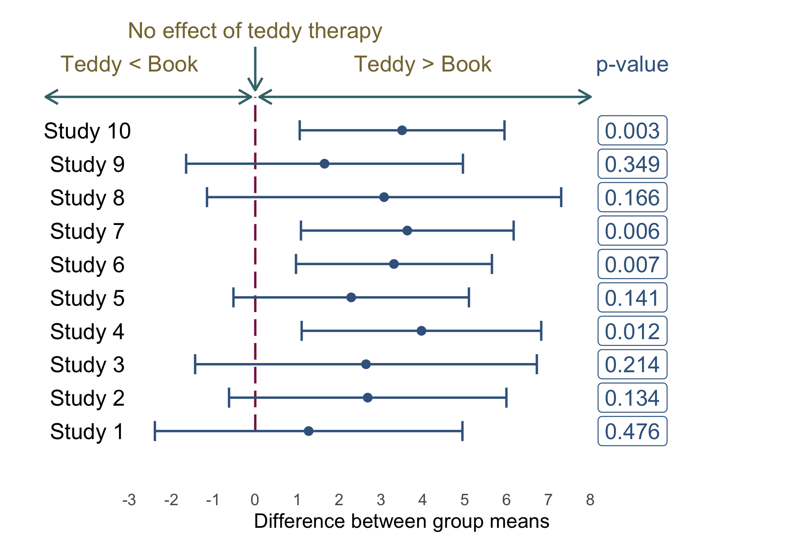

## Slide 40: Problems with NHST

- Tells us nothing about importance because *p* depends upon sample size
- Provides little evidence about the null (or alternative) hypothesis
- Encourages all-or-nothing thinking
- Based on long-run probabilities
  - *p* is the relative frequency of the observed test statistic relative to all test statistics from an infinite number of identical experiments with the exact same a priori sample size
  - The type I error rate is in a given study is either 0 or 1, but we don’t know which

## Slide 41: Effect sizes

> **Note: Statis-tip**
>
> - The *p*-value is just one source of information
> - It must be placed within the context of the effect size

- Raw effect sizes (*b*)
- Standardized effect sizes
  - Standardized $`\beta`$
  - Cohen’s *d*
  - Pearson’s *r*
  - Odds ratio

## Slide 42: p depends upon sample size

### Same effects, different *p*s

#### Study 1: $`\beta`$ = -0.86

| term        | estimate | std.error | statistic | p.value |
|-------------|----------|-----------|-----------|---------|
| (Intercept) | 12.89    | 0.525     | 24.565    | 0       |
| groupBook   | -5.00    | 0.742     | -6.738    | 0       |

#### Study 2: $`\beta`$ = -0.73

| term        | estimate | std.error | statistic | p.value |
|-------------|----------|-----------|-----------|---------|
| (Intercept) | 12.8     | 2.054     | 6.233     | 0.000   |
| groupBook   | -5.0     | 2.904     | -1.722    | 0.102   |

### Zero effect (approx), significant *p*

#### Study 3: $`\beta`$ = 0.01

| term        | estimate | std.error | statistic | p.value |
|-------------|----------|-----------|-----------|---------|
| (Intercept) | 12.113   | 0.018     | 660.082   | 0.000   |
| groupBook   | 0.052    | 0.026     | 1.997     | 0.046   |

## Slide 43: All or nothing thinking

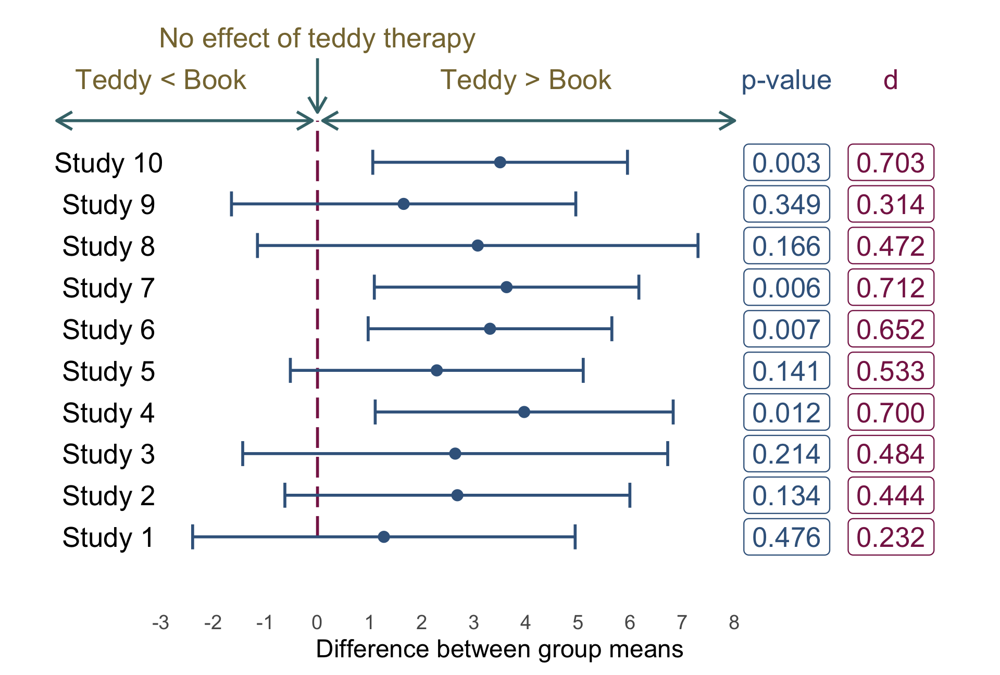

## Slide 44: Back to Birnbaum

``` math
 \text{interest}_i = \hat{b}_0 + \hat{b}_1\text{hard to get}_i +e_i 
```

| Parameter   | Coefficient | SE   | 95% CI        | t(126) | p     |
|-------------|-------------|------|---------------|--------|-------|
| (Intercept) | 0.31        | 0.52 | (-0.73, 1.35) | 0.59   | 0.556 |
| hard to get | 0.29        | 0.17 | (-0.04, 0.62) | 1.76   | 0.080 |

> **Note: Statis-tip**
>
> - The *p*-value suggests a non-significant effect
>   - Context: what’s the sample size? (***n* = 128**)
> - The raw effect (*b*) tells us as the perception that the other person was hard to get increased by 1 (on a scale from 1-5), **0.29** more expressions of interest were made. (A small practical effect)
> - The 95% CI tells us (**under certain assumptions**) that the change in expressions of interest could be
>   - As small as **-0.04**
>   - As large as **0.62**
>   - Zero (no effect)
> - The standardized effect ($`\beta`$) tells us that as the perception that the other person was hard to get increased by 1 **standard deviation**, expressions of interest changed by 0.16 **standard deviations**. (A small practical effect)

## Slide 45: Summary

- To interpret models we need to look at a range of information
- The raw parameter estimate tells us the effect in units we measured
- The standardized parameter estimate tells us the effect in standard deviation units
  - Can be compared across studies that use different measures
- The confidence interval tells us about the uncertainty of our estimates
- The *p*-value tells us about statistical ‘significance’
  - It must be interpretted within the context of the sample size and other information
