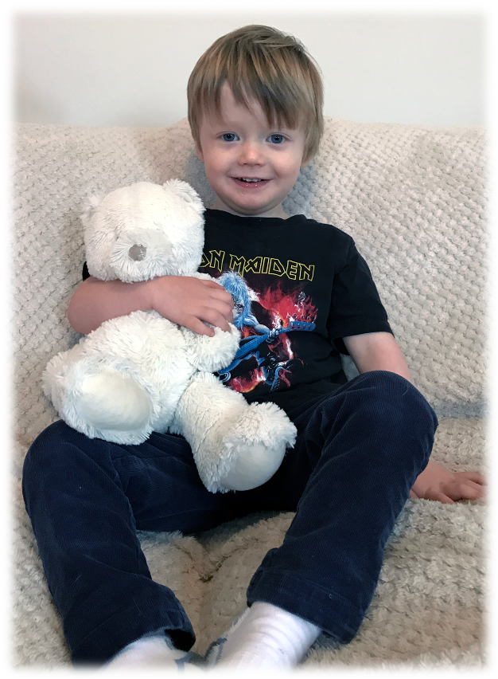

## Using parameters to test hypotheses

:::: columns
::: {.column width="50%"}
::: txt_s

- Parameters represent effects:
  - Relationships between variables
  - Differences between means
- Parameters reflect hypotheses:
  - $H_0$: $b = 0$ or $b_1 = b_2$
  - $H_1$: $b \ne 0$ or $b_1 \ne b_2$
- All parameters have an associated sampling distribution
  - For any parameter, we can work out the probability of getting at least the value we have if the null hypothesis is true (e.g., if $b = 0$, or $b_1 \ne b_2$)
  - *p* < 0.05 is typically used as a threshold for 'significance'
  
::: center-h
::: txt_mulberry

$$
t = \frac{b}{SE_b}
$$

:::
:::

:::
:::

::: {.column width="50%"}

```{r}
#| echo: false
#| message: false
#| fig-width: 6
#| fig-height: 3

birm_gg + 
  annotate("text", x = 5, y = 1.7, label = "hat(italic(b))[italic(1)] != 0", parse = TRUE, size=4)
```

::: fragment

```{r}
#| echo: false
#| message: false
#| fig-width: 6
#| fig-height: 3

birm_gg + 
  stat_smooth(method = "lm", formula = y ~ 1, colour = mulberry, se = FALSE) +
  annotate("text", x = 5, y = 1.7, label = "hat(italic(b))[italic(1)] != 0", parse = TRUE, size=4) +
  annotate("text", x = 5, y = 1.2, label = "hat(italic(b))[italic(1)] == 0", parse = TRUE, size=4)
```

:::
:::
:::


## What is a *p*-value?

:::: columns
::: {.column width="50%"}

### Hypothesis

{height=200}

- H~0~: Alice does not want to date Zach
- H~1~: Alice wants to date Zach

:::

::: {.column width="50%"}

### Test statistic

{height=200}

Humour rating = 5

:::
:::


::: notes

Alice and Zach met in their college library when they were teenagers. Imagine he'd been curious to know whether Alice would date him.
H0 = she doesn't
H1 =  she does.
How does he find out which is the case? Collect data.

We know from work by Ha et al., that teenage girls rate humour highly as a characteristic 
Imagine that the college is really weird and had a dating system. Every day you're sent a picture of someone you know, and you're asked to rate them along the same dimensions as in the Ha study (kindness, attractiveness, humour, ambition etc.) and then you're asked whether you'd date the person. Alice is shy and studious. She has diligently rated hundred of people but for every one of them she has responded that she doesn't want to date them. In other words, we have a bunch of information about the ratings she gives *when the null hypothesis is true*.

Then, one day, Alice rates Zach.

Zach discovers that she gives him a 5/10 on humour. This seems low. Knowing how important humour is in potential partners he feels dejected. The problem is that he has no context for his ‘test statistic. A p-value provides this context.
:::


## What is a *p*-value?

::: center-h
::: txt_l
Humour rating = 5
:::
:::

\

::: {.column width="50%"}

```{r}
#| echo: false
#| message: false
#| fig-height: 6

hum_m6 <- ggplot(data.frame(x = c(0, 10)), aes(x)) +
  stat_function(fun = dnorm, args = list(mean = 6, sd = 1.15), linewidth = 1, colour = blue) +
  theme_minimal() +
  scale_y_continuous(breaks = seq(0, 0.4, 0.1), limits = c(0, 0.4)) +
  scale_x_continuous(breaks = seq(0, 10, 1), limits = c(0, 10)) +
  labs(x = "Rating of humour", y = "Probability") +
  theme(axis.text = element_text(size = rel(1.2), colour = grey),
        axis.title = element_text(size = rel(1.2)),
        axis.text.y=element_blank(),
        axis.ticks.y=element_blank()) 
hum_m6
```

:::

{.absolute height=200 top=75 left=0}


## What is a *p*-value?

::: center-h
::: txt_l
Humour rating = 5
:::
:::

\

::: {.column width="50%"}

```{r}
#| echo: false
#| message: false
#| fig-height: 6

ggplot(data.frame(x = c(0, 10)), aes(x)) +
  stat_function(fun = dnorm, args = list(mean = 6, sd = 1.15), linewidth = 1, colour = blue) +
  stat_function(fun = dnorm, args = list(mean = 6, sd = 1.15), xlim = c(5, 10), geom = "area", fill = blue, alpha = 0.7) + 
  theme_minimal() +
  scale_y_continuous(breaks = seq(0, 0.4, 0.1), limits = c(0, 0.4)) +
  scale_x_continuous(breaks = seq(0, 10, 1), limits = c(0, 10)) +
  labs(x = "Rating of humour", y = "Probability") +
  theme(axis.text = element_text(size = rel(1.2), colour = grey),
        axis.title = element_text(size = rel(1.2)),
        axis.text.y=element_blank(),
        axis.ticks.y=element_blank()) 
```

:::

{.absolute height=200 top=75 left=0}

::: notes
Imagine Zach managed to access all of Alice's previous humour ratings of other people. These are all ratings *when the null hypothesis is true* (i.e. ratings of people she doesn't want to date). The graph on the left shows one scenario. On average, when she doesn't want to date someone, she rates a 6, and her ratings range from about 2 to 10. We can place Zach's rating in context by asking ‘what is the probability that Alice would rate him as at least a 5 if she didn't want to date him?' The probability is quite high: the blue area shows that she rates a lot of people who she doesn't want to date with a 5 or higher. Zach might reasonably ‘accept the null'. That is, because a rating of at least 5 is quite common when Alice doesn't want to date someone, it it plausible that she doesn't want to date him.
:::

## What is a *p*-value?

::: center-h
::: txt_l
Humour rating = 5
:::
:::

\

::: columns
::: {.column width="50%"}

```{r}
#| echo: false
#| message: false
#| fig-height: 6

ggplot(data.frame(x = c(0, 10)), aes(x)) +
  stat_function(fun = dnorm, args = list(mean = 6, sd = 1.15), linewidth = 1, colour = blue) +
  stat_function(fun = dnorm, args = list(mean = 6, sd = 1.15), xlim = c(5, 10), geom = "area", fill = blue, alpha = 0.7) + 
  theme_minimal() +
  scale_y_continuous(breaks = seq(0, 0.4, 0.1), limits = c(0, 0.4)) +
  scale_x_continuous(breaks = seq(0, 10, 1), limits = c(0, 10)) +
  labs(x = "Rating of humour", y = "Probability") +
  theme(axis.text = element_text(size = rel(1.2), colour = grey),
        axis.title = element_text(size = rel(1.2)),
        axis.text.y=element_blank(),
        axis.ticks.y=element_blank()) 
```

:::

::: {.column width="50%"}

```{r}
#| echo: false
#| message: false
#| fig-height: 6

ggplot(data.frame(x = c(0, 10)), aes(x)) +
  stat_function(fun = dnorm, args = list(mean = 3, sd = 1), size = 1, colour = mulberry) +
  theme_minimal() +
  scale_y_continuous(breaks = seq(0, 0.4, 0.1), limits = c(0, 0.4)) +
  scale_x_continuous(breaks = seq(0, 10, 1), limits = c(0, 10)) +
  labs(x = "Rating of humour", y = "Probability") +
  theme(axis.text = element_text(size = rel(1.2), colour = grey),
        axis.title = element_text(size = rel(1.2)), 
        axis.text.y=element_blank(),
        axis.ticks.y=element_blank())
```

:::
:::


{.absolute height=200 top=75 left=0}


## What is a *p*-value?

::: center-h
::: txt_l
Humour rating = 5
:::
:::

\

::: columns
::: {.column width="50%"}

```{r}
#| echo: false
#| message: false
#| fig-height: 6

ggplot(data.frame(x = c(0, 10)), aes(x)) +
  stat_function(fun = dnorm, args = list(mean = 6, sd = 1.15), linewidth = 1, colour = blue) +
  stat_function(fun = dnorm, args = list(mean = 6, sd = 1.15), xlim = c(5, 10), geom = "area", fill = blue, alpha = 0.7) + 
  theme_minimal() +
  scale_y_continuous(breaks = seq(0, 0.4, 0.1), limits = c(0, 0.4)) +
  scale_x_continuous(breaks = seq(0, 10, 1), limits = c(0, 10)) +
  labs(x = "Rating of humour", y = "Probability") +
  theme(axis.text = element_text(size = rel(1.2), colour = grey),
        axis.title = element_text(size = rel(1.2)),
        axis.text.y=element_blank(),
        axis.ticks.y=element_blank()) 
```

:::
::: {.column width="50%"}

```{r}
#| echo: false
#| message: false
#| fig-height: 6

ggplot(data.frame(x = c(0, 10)), aes(x)) +
  stat_function(fun = dnorm, args = list(mean = 3, sd = 1), xlim = c(5, 10), geom = "area", fill = mulberry, alpha = 0.7) + 
  stat_function(fun = dnorm, args = list(mean = 3, sd = 1), size = 1, colour = mulberry) +
  theme_minimal() +
  scale_y_continuous(breaks = seq(0, 0.4, 0.1), limits = c(0, 0.4)) +
  scale_x_continuous(breaks = seq(0, 10, 1), limits = c(0, 10)) +
  labs(x = "Rating of humour", y = "Probability") +
  theme(axis.text = element_text(size = rel(1.2), colour = grey),
        axis.title = element_text(size = rel(1.2)),
        axis.text.y=element_blank(),
        axis.ticks.y=element_blank()) 
```

:::
:::


{.absolute height=200 top=75 left=0}


## The *p*-value

::: {.callout-note icon = false}
##  Statis-tip 

The *p*-value IS:

- The probability of getting a test statistic at least as big as the one you have observed given that the null hypothesis is true.

:::

\

::: fragment
::: {.callout-warning icon = false}
##  The danger zone!

The *p*-value is NOT:

- The probability of a chance result
- The probability that H~1~ is true
- The probability that H~0~ is true

:::
:::

## Problems with *p*

:::: columns
::: {.column width="50%"}
### Teddy bear therapy

{height=500}
:::

::: {.column width="50%"}
### Control group

{height=500}
:::
:::


## *p* depends upon sample size


```{r}
n_20 <- readRDS("data/n_20.RDS")
n_200 <- readRDS("data/n_200.RDS")
n_200000 <- readRDS("data/n_200000.RDS")

ted200000_lm <- n_200000 |> 
    lm(self_esteem ~ group, data = _) |> 
    broom::tidy()

ted200_lm <- n_200 |> 
    lm(self_esteem ~ group, data = _) |> 
    broom::tidy()

ted20_lm <- n_20 |> 
    lm(self_esteem ~ group, data = _) |> 
    broom::tidy()

zted20_tbl <- lm(self_esteem ~ group, data = n_20) |>  model_parameters(standardize = "refit")
z20 <- value_from_ez(zted20_tbl, row = 2)

zted200_tbl <- lm(self_esteem ~ group, data = n_200) |>  model_parameters(standardize = "refit")
z200 <- value_from_ez(zted200_tbl, row = 2)

zted200000_tbl <- lm(self_esteem ~ group, data = n_200000) |>  model_parameters(standardize = "refit")
z200000 <- value_from_ez(zted200000_tbl, row = 2)

```


### Same effects, different *p*s


:::: columns
::: {.column width="50%"}
#### Study 1:
::: tbl_med
```{r warning = FALSE}
ted200_lm |> 
  knitr::kable(digits = 3) |> 
  kableExtra::column_spec(c(2, 5), background = "yellow") |> 
  kableExtra::row_spec(1, background = tbl_row)
```
:::
:::

::: {.column width="50%"}
#### Study 2:
::: tbl_med
```{r warning = FALSE}
ted20_lm |> 
  knitr::kable(digits = 3) |> 
  kableExtra::column_spec(c(2, 5), background = "yellow") |> 
  kableExtra::row_spec(1, background = tbl_row)
```
:::
:::
:::

\


### Zero effect (approx), significant *p*
#### Study 3:
::: center-h
::: tbl_med
```{r warning = FALSE}
ted200000_lm |> 
  knitr::kable(digits = 3) |> 
  kableExtra::column_spec(c(2, 5), background = "yellow") |> 
  kableExtra::row_spec(1, background = tbl_row)
```
:::
:::

\

::: {.callout-caution icon = false}
##  Think about it!

- Why?
:::


## *p* depends upon sample size

### Same effects, different *p*s

:::: columns
::: {.column width="50%"}
#### Study 1: [*n* = 200]{.txt_mulberry}
::: tbl_med
```{r results = 'asis', warning = FALSE}
ted200_lm |> 
  knitr::kable(digits = 3) |> 
  kableExtra::column_spec(c(2, 5), background = "yellow") |> 
  kableExtra::row_spec(1, background = tbl_row)
```
:::
:::

::: {.column width="50%"}
#### Study 2: [*n* = 20]{.txt_mulberry}
::: tbl_med
```{r results = 'asis', warning = FALSE}
ted20_lm |> 
  knitr::kable(digits = 3) |> 
  kableExtra::column_spec(c(2, 5), background = "yellow") |> 
  kableExtra::row_spec(1, background = tbl_row)
```
:::
:::
:::

\

### Zero effect (approx), significant *p*

#### Study 3: [*n* = 200,000]{.txt_mulberry}
::: center-h
::: tbl_med
```{r results = 'asis', warning = FALSE}
ted200000_lm |> 
  knitr::kable(digits = 3) |> 
  kableExtra::column_spec(c(2, 5), background = "yellow") |> 
  kableExtra::row_spec(1, background = tbl_row)
```

:::
:::


## Problems with NHST

- Tells us nothing about importance because *p* depends upon sample size
- Provides little evidence about the null (or alternative) hypothesis
  - Assumes the null is true
  - *p* > .05 simply means the effect is not big enough to be found, not that it is 0
  - *p* < .05 means that the observed test statistic is unlikely given the null is true

::: fragment

- All or nothing thinking

:::


# When *p* > .05 (not significant) 

## {background-video="media/animal_screams.mp4" background-size="cover"}


# When *p* < .05 (significant) 

## {background-video="media/dancing_cat.mp4" background-size="cover"}

## All or nothing thinking

```{r}
#| echo: false
#| fig-width: 10
#| fig-height: 6.75


nhst_tib <- readr::read_csv("data/all_or_nothing_summary.csv")
nhst_tib <- metafor::escalc(measure = "SMD", m1i = x1, m2i = x2, n1i = n1, n2i = n2, sd1i = sd1, sd2i = sd2,  data = nhst_tib)

nhst_tib <- nhst_tib |> 
  dplyr::mutate(
    Study = paste("Study", 1:10) |> forcats::as_factor(),
    p_lab = sprintf(fmt = "%.3f", p),
    p_x = 9,
    d_lab = sprintf(fmt = "%.3f", yi),
    d_x = 11,
    study_x = -4
  )

forest <- ggplot(nhst_tib, aes(x = diff, y = Study)) +
  geom_point(size = 3, colour = blue) +
  annotate("segment", x = 0, xend = 0, y = "Study 1", yend = 11, colour = mulberry, size = 1, linetype = "longdash") +
    geom_errorbarh(aes(xmax = ci.u, xmin = ci.l), height = 0.6, size = 1, colour = blue) +
  coord_cartesian(ylim = c(0, 13)) +
  labs(x = "Difference between group means") +
  theme_minimal(base_size = 18) +
  theme(axis.text = element_text(colour = "grey35")) +
  scale_x_continuous(breaks = seq(-3, 8, 1), limits = c(-5, 12)) +
  theme(panel.grid = element_blank(), axis.title.y = element_blank(), axis.text.y = element_blank()) +
  geom_text(data = nhst_tib, aes(y = Study, x = study_x, label = Study), size= 7)

forest
```

## All or nothing thinking

```{r}
#| echo: false
#| fig-width: 10
#| fig-height: 6.75

forest <- forest +
  annotate("text", label = "No effect of teddy therapy", x = 0, y = 13, size = 7, colour = brown) +
  annotate("segment", x = 0, xend = 0, y = 12.5, yend = 11.2, colour = green, size = 1, arrow = arrow(length = unit(0.03, "npc")))

forest
```

## All or nothing thinking

```{r}
#| echo: false
#| fig-width: 10
#| fig-height: 6.75

forest <- forest +
  annotate("segment", x = -5, xend = -0.1, y = 11, yend = 11, colour = green, size = 1, arrow = arrow(length = unit(0.03, "npc"), end = "both")) + 
 annotate("text", label = "Teddy < Book", x = -3, y = 12, size = 7, colour = brown)

forest
```

## All or nothing thinking

```{r}
#| echo: false
#| fig-width: 10
#| fig-height: 6.75

forest <- forest +
annotate("segment", x = 0.1, xend = 8, y = 11, yend = 11, colour = green, size = 1, arrow = arrow(length = unit(0.03, "npc"), end = "both")) +
annotate("text", label = "Teddy > Book", x = 4, y = 12, size = 7, colour = brown)

forest
```

## All or nothing thinking


```{r}
#| echo: false
#| fig-width: 10
#| fig-height: 6.75

forest <- forest +
  annotate("text", label = "p-value", x = 9, y = 12, size = 7, colour = blue) +
  geom_label(data = nhst_tib, aes(y = Study, x = p_x, label = p_lab), size= 7, colour = blue)

forest
```


::: notes
9 Other people replicated the teddy bear therapy study. The results of the 10 studies are shown along with the p-value within each study. Which of the following statements best reflects your view of teddy therapy?

1. The evidence is equivocal, we need more research.
2. All of the mean differences show a positive effect of the intervention, therefore, we have consistent evidence that the treatment works.
3. Four of the studies show a significant result (p < .05), but the other 6 do not. Therefore, the studies are inconclusive: some suggest that the intervention is better than placebo, but others suggest there's no difference. The fact that more than half of the studies showed no significant effect means that the treatment is not (on balance) more successful in reducing anxiety than the control.
4. I want to go for C, but I have a feeling it's a trick question. 
:::

## Problems with NHST

- Tells us nothing about importance because *p* depends upon sample size
- Provides little evidence about the null (or alternative) hypothesis
- Encourages all-or-nothing thinking

::: fragment

- Based on long-run probabilities
  - *p* is the relative frequency of the observed test statistic relative to all test statistics from an infinite number of identical experiments with the exact same a priori sample size
  - The type I error rate is in a given study is either 0 or 1, but we don't know which

:::

## Effect sizes

::: {.callout-note icon = false}
##  Statis-tip

- The *p*-value is just one source of information
- It must be placed within the context of the effect size

:::

- Raw effect sizes (*b*)
- Standardized effect sizes
  - Standardized $\beta$
  - Cohen's *d*
  - Pearson's *r*
  - Odds ratio
  

## *p* depends upon sample size

### Same effects, different *p*s

:::: columns
::: {.column width="50%"}
#### Study 1: [$\beta$ = `r z200`]{.txt_mulberry}
::: tbl_med
```{r, warning = FALSE}
ted200_lm |> 
  knitr::kable(digits = 3) |> 
  kableExtra::column_spec(c(2, 5), background = "yellow") |> 
  kableExtra::row_spec(1, background = tbl_row)
```
:::
:::

::: {.column width="50%"}
#### Study 2: [$\beta$ = `r z20`]{.txt_mulberry}
::: tbl_med
```{r, warning = FALSE}
ted20_lm |> 
  knitr::kable(digits = 3) |> 
  kableExtra::column_spec(c(2, 5), background = "yellow") |> 
  kableExtra::row_spec(1, background = tbl_row)
```
:::
:::
:::

\

### Zero effect (approx), significant *p*

#### Study 3: [$\beta$ = `r z200000`]{.txt_mulberry}
::: center-h
::: tbl_med
```{r, warning = FALSE}
ted200000_lm |> 
  knitr::kable(digits = 3) |> 
  kableExtra::column_spec(c(2, 5), background = "yellow") |> 
  kableExtra::row_spec(1, background = tbl_row)
```

:::
:::

## All or nothing thinking


```{r}
#| echo: false
#| fig-width: 10
#| fig-height: 6.75

forest +
  annotate("text", label = "d", x = 11, y = 12, size = 7, colour = mulberry) +
  geom_label(data = nhst_tib, aes(y = Study, x = d_x, label = d_lab), size= 7, colour = mulberry)
```


## Back to Birnbaum

::: center-h
::: txt_mulberry
$$
\text{interest}_i = \hat{b}_0 + \hat{b}_1\text{hard to get}_i +e_i
$$
:::
:::


::: tbl_med
```{r}
#| echo: false

display(birm_noci_tbl)
```
:::

::: {.callout-note icon = false}
##  Statis-tip

::: incremental

- The *p*-value suggests a non-significant effect
  - Context: what's the sample size? ([*n* = 128]{.txt_mulberry})
- The raw effect (*b*) tells us as the perception that the other person was hard to get increased by 1 (on a scale from 1-5), **`r value_from_ez(birm_noci_tbl, row  = 2)`** more expressions of interest were made. (A small practical effect)
- The 95% CI tells us ([under certain assumptions]{.txt_mulberry}) that the change in expressions of interest could be
  - As small as **`r value_from_ez(birm_noci_tbl, row  = 2, value = "CI_low")`**
  - As large as **`r value_from_ez(birm_noci_tbl, row  = 2, value = "CI_high")`**
  - Zero (no effect)
- The standardized effect ($\beta$) tells us that as the perception that the other person was hard to get increased by 1 [standard deviation]{.alt}, expressions of interest changed by `r value_from_ez(zhard_tbl, row  = 2)` [standard deviations]{.alt}. (A small practical effect)

:::
:::

