# Extending and Evaluating the model

**Adding predictors, model fit and hidden messages**

Professor Andy Field, University of Sussex

Links: [opeth the lines in my hand](https://profandyfield.github.io/statistics_lectures/ds_03_fit/media/opeth_the_lines_in_my_hand.mp3) \| [bsky.app](https://bsky.app/profile/profandyfield.bsky.social) \| [youtube.com](https://www.youtube.com/user/ProfAndyField) \| [discoveringstatistics.com](https://www.discoveringstatistics.com) \| [discovr.rocks](https://www.discovr.rocks) \| [statisticsadventure.com](https://www.statisticsadventure.com)

## About this version

This is a plain-text version of the lecture slides. Each slide starts with a heading such as “Slide 5”, and the numbers match the slide numbers shown in the lecture. Content that appeared one piece at a time, in columns or in tabs is shown in reading order. Videos and interactive apps are given as links.

## Slide 2: Learning outcomes

### Extending the model

- Understanding how to incorporate multiple predictors in the general linear model
  - The mathematical model
  - Visualizing the model
  - Methods for entering predictors to the model
  - Interpreting parameter estimates

### Model fit

- Understand how we establish the fit of a general linear model to the
  - Sums of squares
  - Mean squares
  - The *F*-statistic
  - *R*<sup>2</sup>

## Slide 3


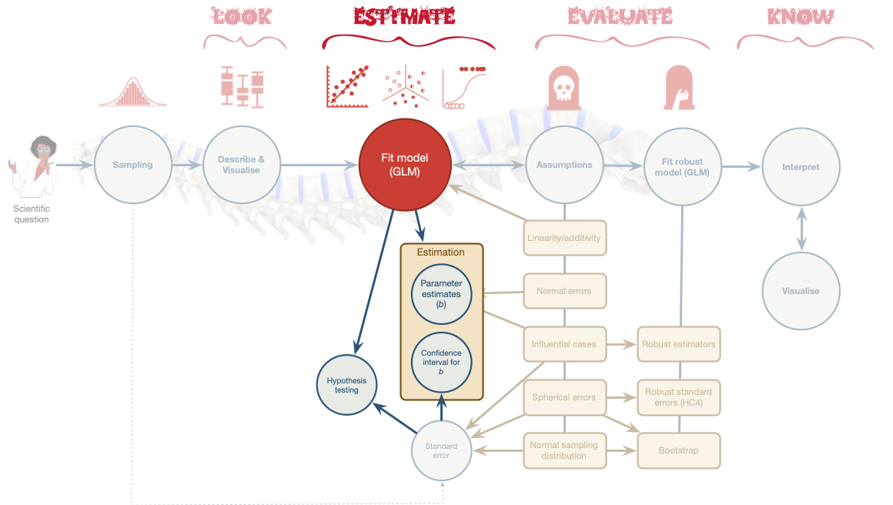

## Slide 4


## Slide 5 (new section): Extending the model

## Slide 6: Birnbaum revisited


- Does playing hard to get work?<sup>1</sup>
- Heterosexual participants conversed with an opposite-sex confederate over Instant Messenger for 8 mins
- **Interest**: Final message coded for the number of expressions of romantic interest (range 0 to 4)
- **Hard to get**: 3 items rated 1 (not at all) and 5 (very much so)
  - *The other participant is hard to get*
- **Mate value**: 4 items rated 1 (not at all) and 5 (very much so)
  - *I perceive the other participant as a valued mate*

*Footnotes*

1.  [Birnbaum et al. (2020). *Journal of Social and Personal Relationships*. Study 3.](https://doi.org/10.1177/0265407520927469)

## Slide 7: The model

``` math
 \text{interest}_i = \hat{b}_0 + \hat{b}_1\text{hard to get}_i +e_i 
```

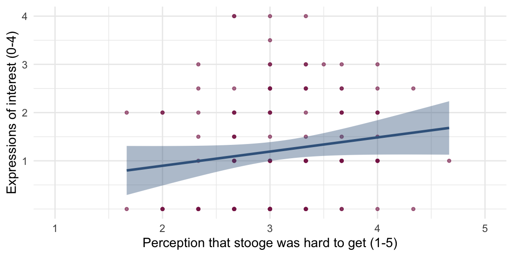

| Parameter   | Coefficient | SE   | 95% CI        | t(126) | p     |
|-------------|-------------|------|---------------|--------|-------|
| (Intercept) | 0.31        | 0.52 | (-0.73, 1.35) | 0.59   | 0.556 |
| hard to get | 0.29        | 0.17 | (-0.04, 0.62) | 1.76   | 0.080 |

> **Caution: Think about it!**
>
> - How do we extend the model to include mate value?

## Slide 8: Extending the linear model

``` math
 \text{interest}_i = \hat{b}_0 + \hat{b}_1\text{hard to get}_i + \hat{b}_2\text{mate value}_i +e_i 
```


## Slide 9: Parameter estimates

$`\hat{\text{interest}}_i = -0.49 + 0.13\text{ hard to get}_i + 0.39\text{ mate value}_i`$

| Parameter   | Coefficient | SE   | 95% CI        | t(125) | p     |
|-------------|-------------|------|---------------|--------|-------|
| (Intercept) | -0.49       | 0.62 | (-1.72, 0.74) | -0.79  | 0.432 |
| hard to get | 0.13        | 0.18 | (-0.23, 0.48) | 0.70   | 0.484 |
| mate value  | 0.39        | 0.17 | (0.05, 0.72)  | 2.31   | 0.023 |

- As the perception that the other person was hard to get increased by 1 (on a scale from 1-5), **0.13** more expressions of interest were made (when mate value is constant)
  - This effect is not significant, $`\hat{b}`$ = 0.13 (-0.23, 0.48), *t*(125) = 0.70, *p* = 0.484
  - This is the effect of ‘hard to get’ on interest **adjusted for** the effect of ‘mate value’
- As the perception of mate value increased by 1 (on a scale from 1-5), **0.39** more expressions of interest were made (when perceptions of being hard to get are constant)
  - This effect is significant, $`\hat{b}`$ = 0.39 (0.05, 0.72), *t*(125) = 2.31, *p* = 0.023
  - This is the effect of ‘mate value’ on interest **adjusted for** the effect of ‘hard to get’

## Slide 10: How to enter predictors

- Hierarchical
  - Experimenter decides the order in which variables are entered into the model
  - Best for theory testing
- Forced entry
  - All predictors are entered simultaneously
- Stepwise
  - Predictors are selected using their semi-partial correlation with the outcome
  - The model is unlikely to replicate in other samples (i.e., can produce spurious results)
  - Use only for exploratory analysis

## Slide 11 (new section): When a hierarchical model gets you dressed

## Slide 12

Video clip: [arlo hierarchical small](https://profandyfield.github.io/statistics_lectures/ds_03_fit/media/arlo_hierarchical_small.mp4)

## Slide 13 (new section): When a stepwise model gets you dressed

## Slide 14

Video clip: [arlo stepwise small](https://profandyfield.github.io/statistics_lectures/ds_03_fit/media/arlo_stepwise_small.mp4)

## Slide 15

Video clip: [arlo outtake small](https://profandyfield.github.io/statistics_lectures/ds_03_fit/media/arlo_outtake_small.mp4)

## Slide 16 (new section): Model fit

## Slide 17: How do we tell if a model is a good fit?

- Let’s look at a simple model: the mean
- How do we tell if it’s a good fit?
- With some help from Taylor Swift
  - The album **1989**
- Spotify produce measures of song content
  - Energy
  - Valence
  - Danceability

> “Energy is a measure from 0.0 to 1.0 and represents a perceptual measure of intensity and activity.” (Spotify, API)

- The `spotifyr` package scrapes this data!

## Slide 18: Is the average energy score a good fit?

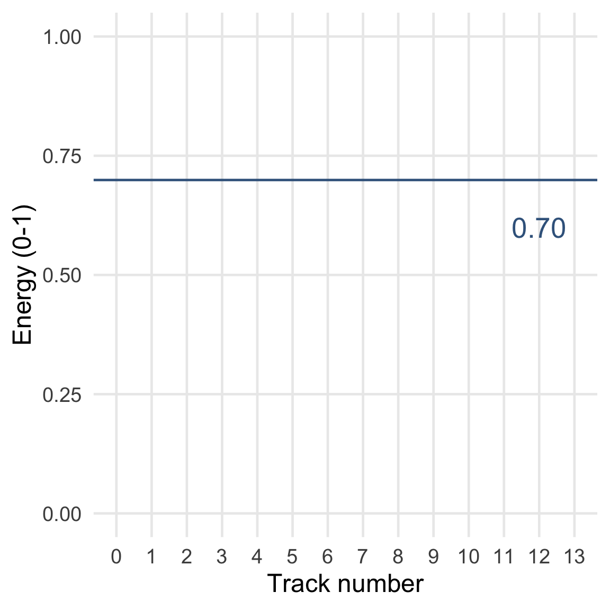


## Slide 19: Is the average energy score a good fit?


Audio clip: [taylor swift satan](https://profandyfield.github.io/statistics_lectures/ds_03_fit/media/taylor_swift_satan.mp3)


## Slide 20: Is the average energy score a good fit?

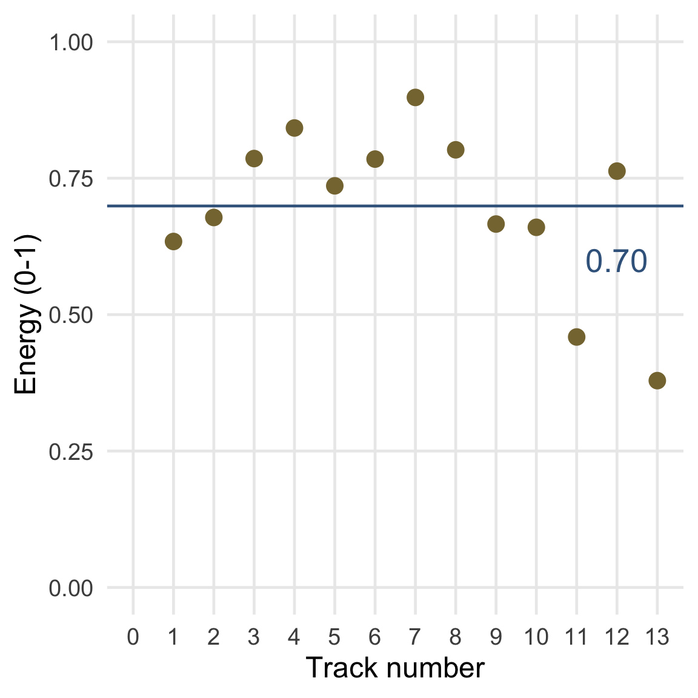

Audio clip: [taylor swift satan](https://profandyfield.github.io/statistics_lectures/ds_03_fit/media/taylor_swift_satan.mp3)

“Worship Satan for he is your dark lord and master,

Sacrifice goats to Beelzibub …

you know you want to”


## Slide 21: Is the average energy score a good fit?


## Slide 22

Video clip: [flight of icarus vancouver](https://profandyfield.github.io/statistics_lectures/ds_03_fit/media/flight_of_icarus_vancouver.mp4)

## Slide 23: Is the average energy score a good fit?


## Slide 24: Is the average energy score a good fit?


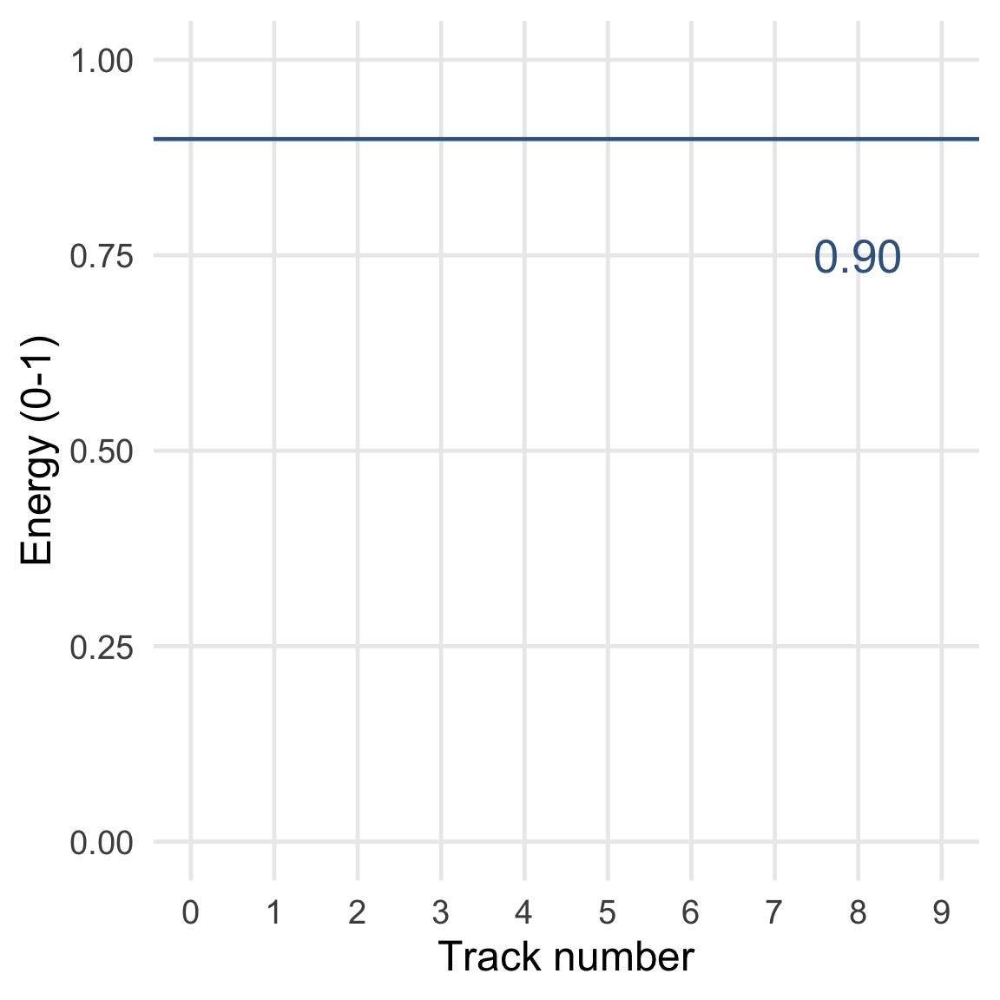


## Slide 25: Is the average energy score a good fit?

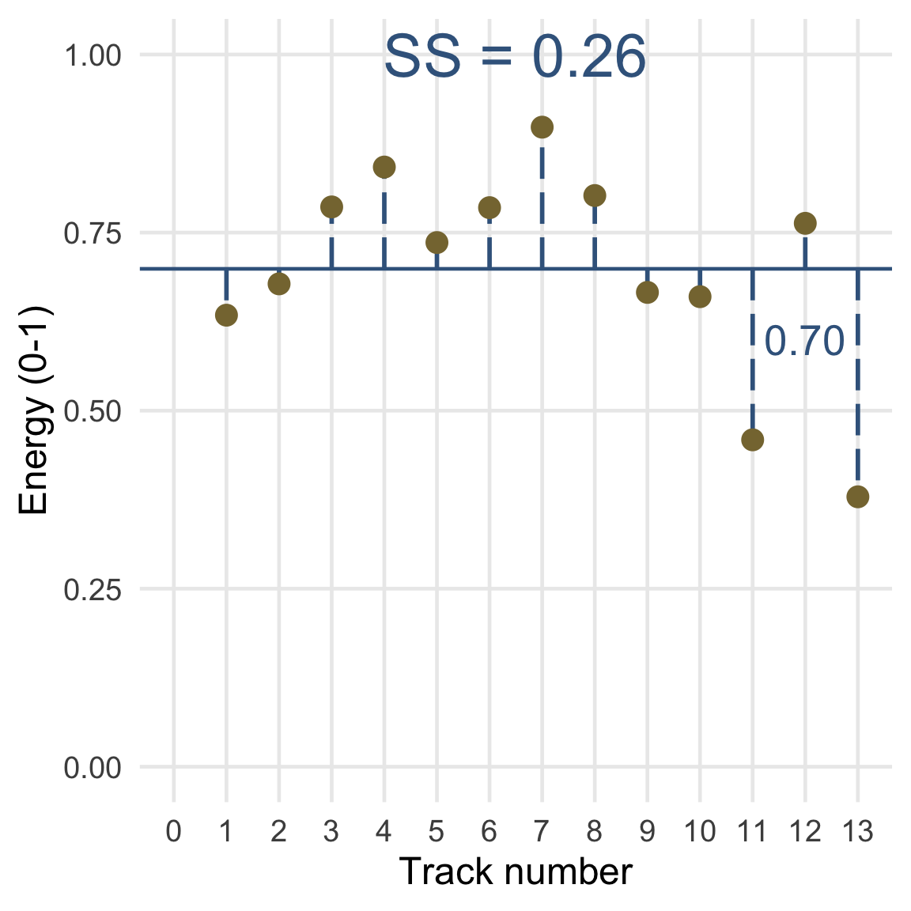

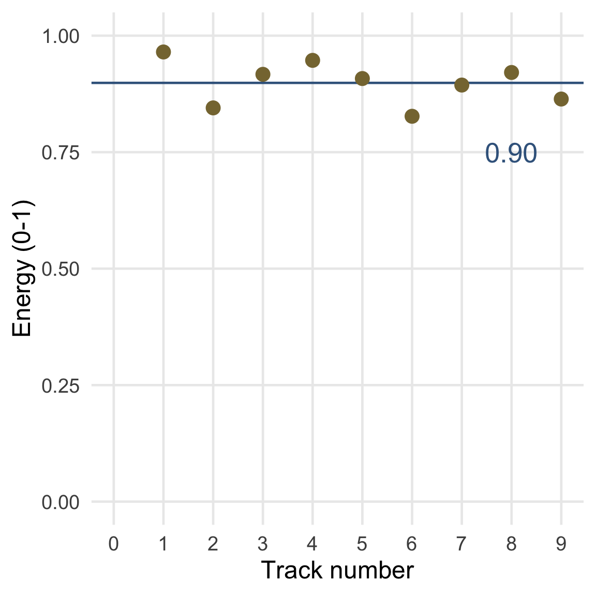


## Slide 26: Comparing sums of squares

- Sums of squares represent **total** error
- Because sums of squares are totals we can compare them only when they are based on the same number of scores.
- Alternatively, we factor in the number of scores
- We can get the **average** error by divide by a function of the number of scores
  - The degrees of freedom (the number of independent pieces of information)
  - The number of scores minus the number of parameters
  - $`\text{df} = N-p`$

``` math
 \begin{aligned} \text{MS} &= \frac{\text{SS}}{N-p} \\ &= \frac{\text{SS}}{N-1} \end{aligned} 
```

## Slide 27: Is the average energy score a good fit?

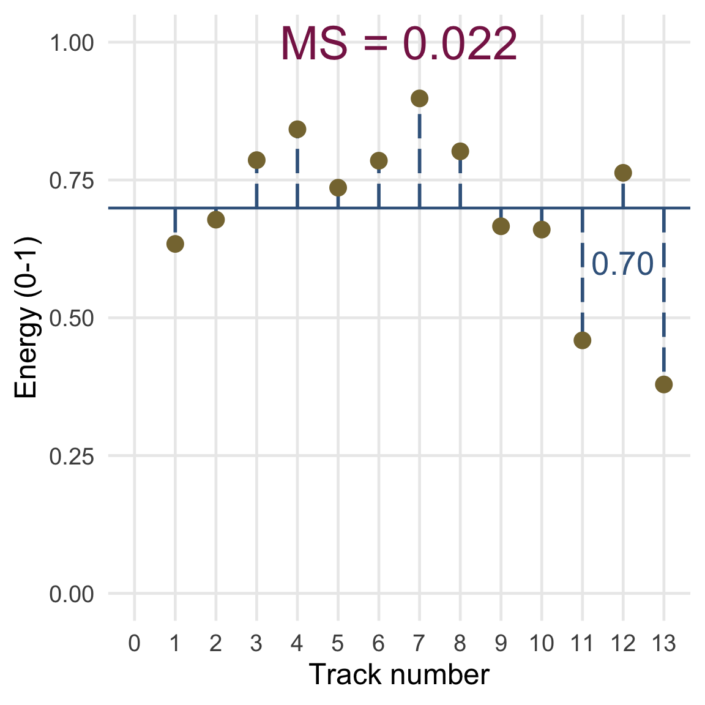

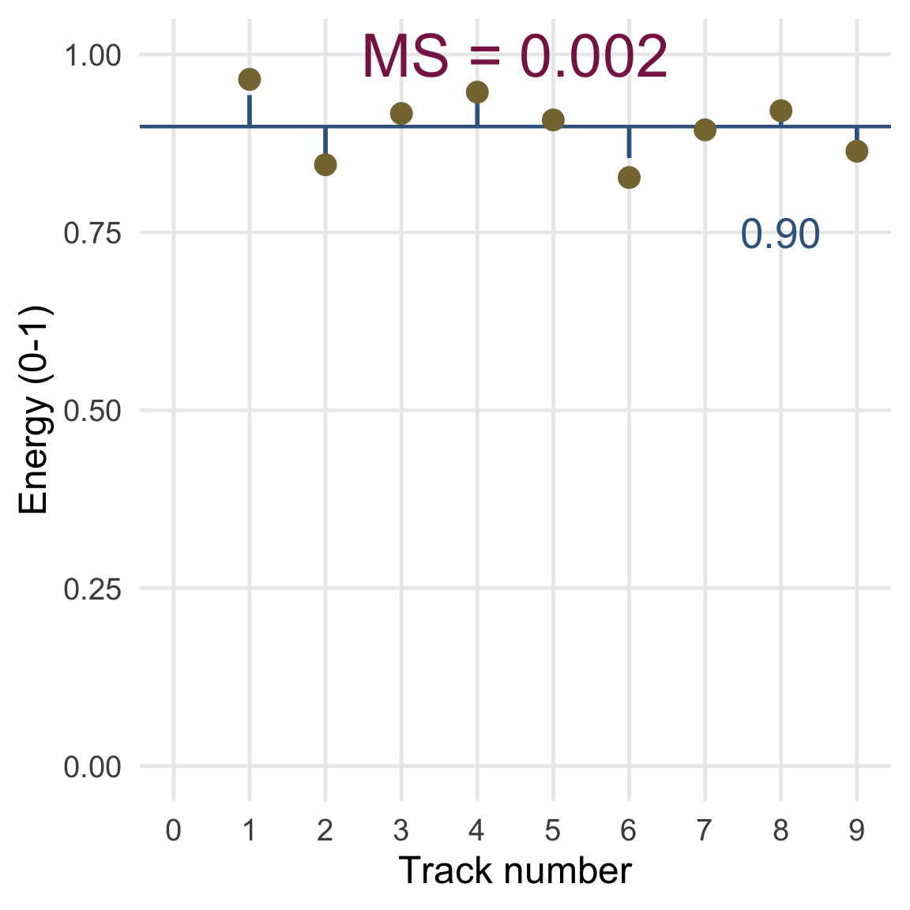


## Slide 28: Illusory Truth Effect (ITE)1

- Repetition increases perceived truthfulness (Hasher et al., 1977)
- This is equally true for plausible and implausible statements (Fazio et al., 2019)

*Footnotes*

1.  Murray et al. (2020). <https://doi.org/10.31234/osf.io/9evzc>

## Slide 29

Video clip: [milton lecture amazing repeat](https://profandyfield.github.io/statistics_lectures/ds_03_fit/media/milton_lecture_amazing_repeat.mp4)

## Slide 30: Illusory Truth Effect (ITE)1

- Repetition increases perceived truthfulness (Hasher et al., 1977)
- This is equally true for plausible and implausible statements (Fazio et al., 2019)
- Worryingly, the effect is true for false political statements regardless of political ideology
  - Of 105 statements made by Donald Trump between 02/11/2016 and 9/10/2019 77 (73%) were only half true or worse.
  - In experiments, people exposed repeatedly to Trump statements rated them as more truthful than those who were not on a 6-point scale <sup>1</sup>
- Imagine a model that predicts ratings of truth of fake statements from number of exposures
  - Predictor: number of exposures
  - outcome: ratings of truth (0 = definitely false, 5 = definitely true)

*Footnotes*

1.  Murray et al. (2020). <https://doi.org/10.31234/osf.io/9evzc>

## Slide 31: Testing the fit of the general linear model

To see whether the model is a reasonable ‘fit’ of the observed data we use the sum of squared errors (**SS**):

- **SS<sub>T</sub>**
  - Total variability (variability between scores and the mean)
- **SS<sub>R</sub>**
  - Total residual/error variability (variability between the model and the observed data)
  - How badly the model fits (in total)
- **SS<sub>M</sub>**
  - Total model variability (difference in variability between the model and the grand mean)
  - How much better the model is at predicting *Y* than the mean
  - How well the model fits (in total)

## Slide 32

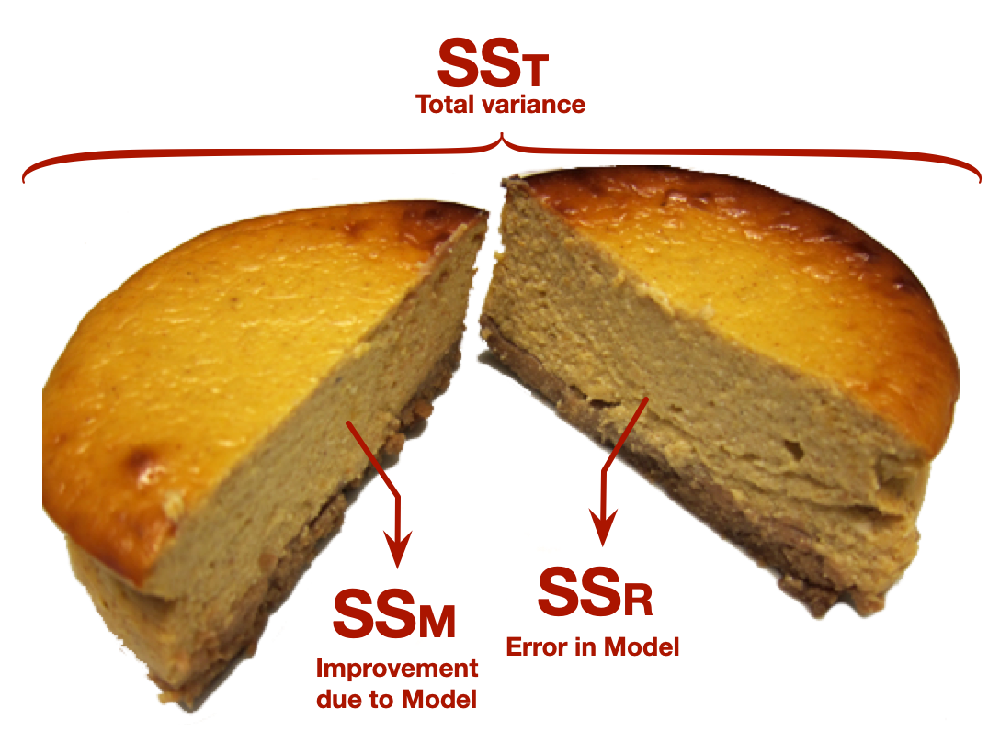

## Slide 33

``` math
 \begin{aligned} \text{perceived truth}_i &= \hat{b}_0 + \hat{b}_1\text{repetition}_{i} + e_i \\ \hat{\text{perceived truth}}_i &= 1.28 + 0.54\text{ repetition}_{i} \\ \end{aligned} 
```

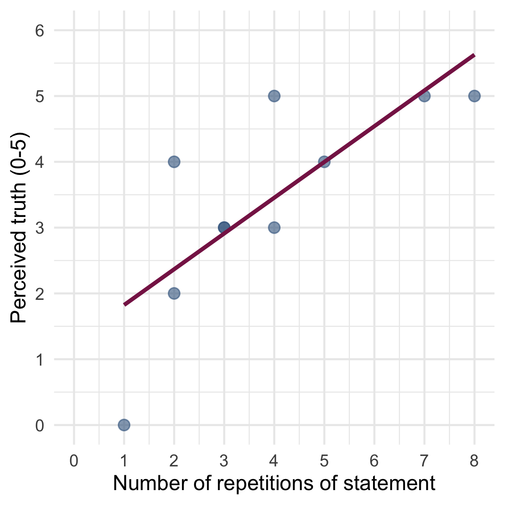

## Slide 34

### Total sum of squared error, SS<sub>T</sub>

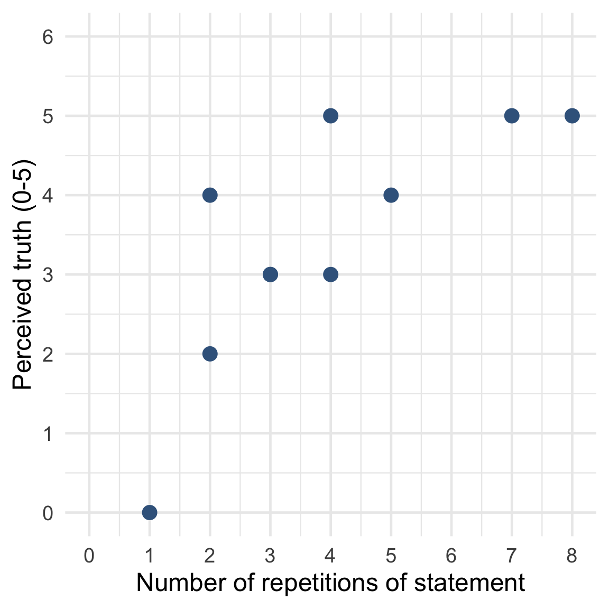

## Slide 35

### Total sum of squared error, SS<sub>T</sub>


## Slide 36

### Total sum of squared error, SS<sub>T</sub>

|          | Reps | Truth | Predicted value | Error | Squared error |
|----------|------|-------|-----------------|-------|---------------|
|          | 1    | 0     | 3.4             | -3.4  | 11.56         |
|          | 2    | 2     | 3.4             | -1.4  | 1.96          |
|          | 2    | 4     | 3.4             | 0.6   | 0.36          |
|          | 3    | 3     | 3.4             | -0.4  | 0.16          |
|          | 3    | 3     | 3.4             | -0.4  | 0.16          |
|          | 4    | 3     | 3.4             | -0.4  | 0.16          |
|          | 4    | 5     | 3.4             | 1.6   | 2.56          |
|          | 5    | 4     | 3.4             | 0.6   | 0.36          |
|          | 7    | 5     | 3.4             | 1.6   | 2.56          |
|          | 8    | 5     | 3.4             | 1.6   | 2.56          |
| SS Total | —    | —     | —               | —     | 22.4          |


## Slide 37

### Total sum of squared errors, SS<sub>T</sub>

- Each SS has associated **degrees of freedom** (**df**)
- The *df* is the amount of *independent information* available to compute SS
- To begin with we have *N* pieces of independent information
- For every parameter (*p*) estimated we lose 1 piece of independent information
- To get SS<sub>T</sub> we estimate 1 parameter (the overall mean):

``` math
 \begin{aligned} \text{df}_\text{T} &= N-p \\ &= 10 - 1 \\ &= 9 \end{aligned} 
```

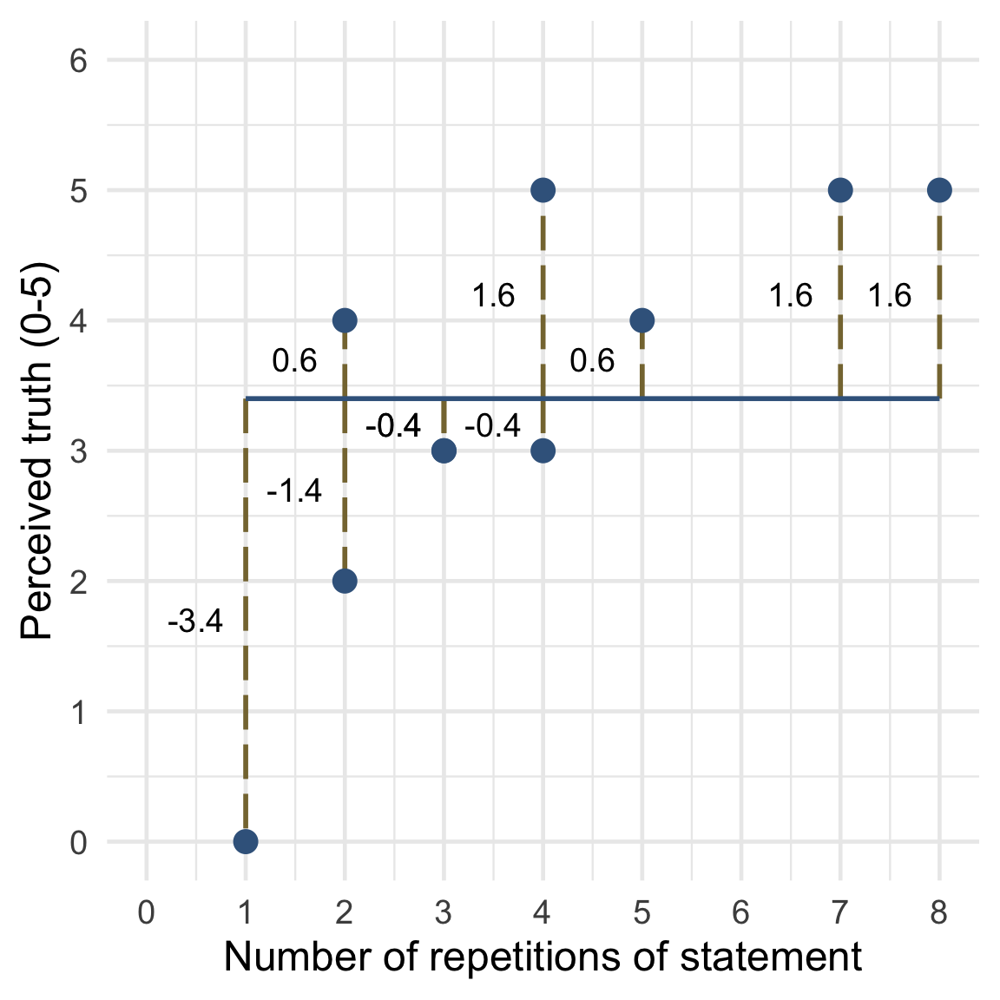

## Slide 38

### Residual sum of squared errors, SS<sub>R</sub>

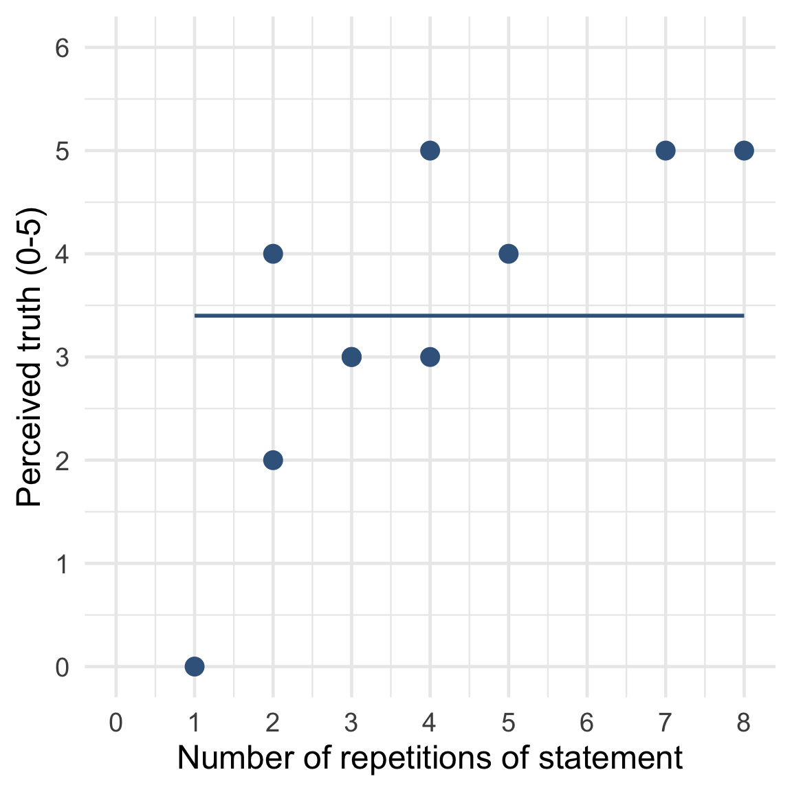

## Slide 39

### Residual sum of squared errors, SS<sub>R</sub>


## Slide 40

### Residual sum of squared errors, SS<sub>R</sub>

|             | Reps | Truth | Predicted value | Error | Squared error |
|-------------|------|-------|-----------------|-------|---------------|
|             | 1    | 0     | 1.82            | -1.82 | 3.31          |
|             | 2    | 2     | 2.37            | -0.37 | 0.14          |
|             | 2    | 4     | 2.37            | 1.63  | 2.66          |
|             | 3    | 3     | 2.91            | 0.09  | 0.01          |
|             | 3    | 3     | 2.91            | 0.09  | 0.01          |
|             | 4    | 3     | 3.45            | -0.45 | 0.20          |
|             | 4    | 5     | 3.45            | 1.55  | 2.40          |
|             | 5    | 4     | 4.00            | 0.00  | 0.00          |
|             | 7    | 5     | 5.08            | -0.08 | 0.01          |
|             | 8    | 5     | 5.63            | -0.63 | 0.40          |
| SS Residual | —    | —     | —               | —     | 9.14          |

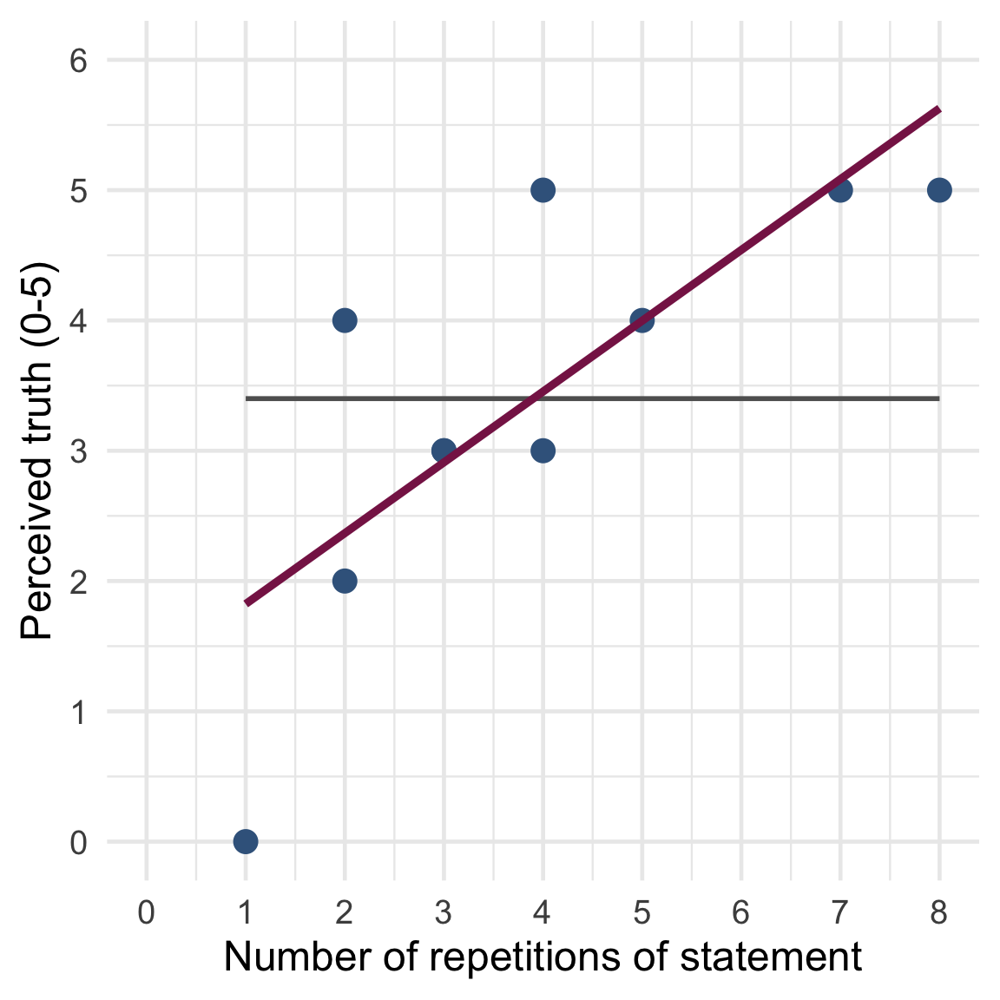

## Slide 41

### Residual sum of squared errors, SS<sub>R</sub>

- To begin with we have *N* pieces of independent information
- To get SS<sub>R</sub> we estimate two parameters (*b*<sub>0</sub> and *b*<sub>1</sub>):

``` math
 \begin{aligned} \text{df}_\text{R} &= N-p \\ &= 10 - 2 \\ &= 8 \end{aligned} 
```

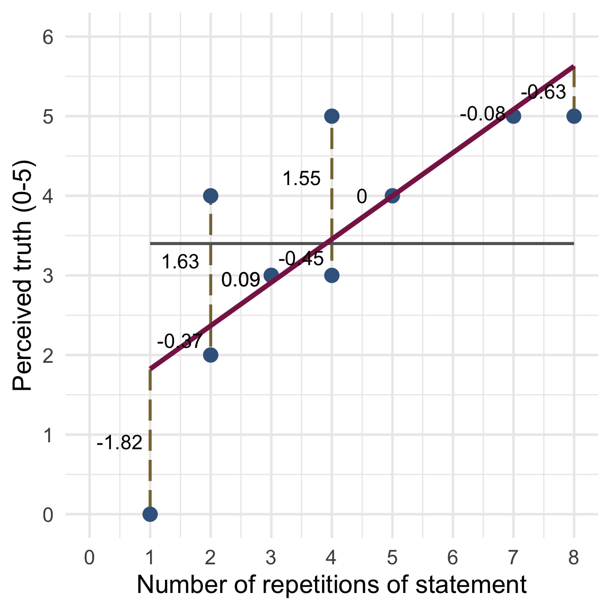

## Slide 42

### Model sum of squared errors, SS<sub>M</sub>

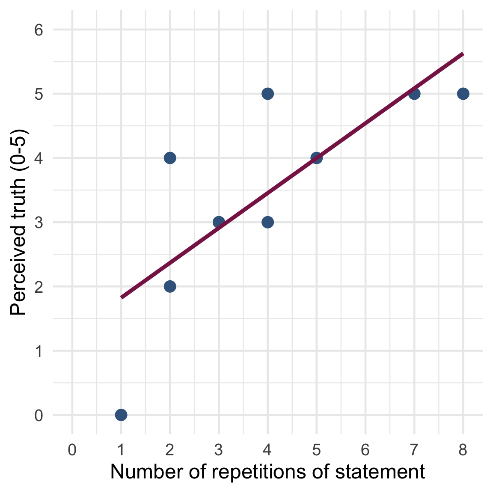

## Slide 43

### Model sum of squared errors, SS<sub>M</sub>

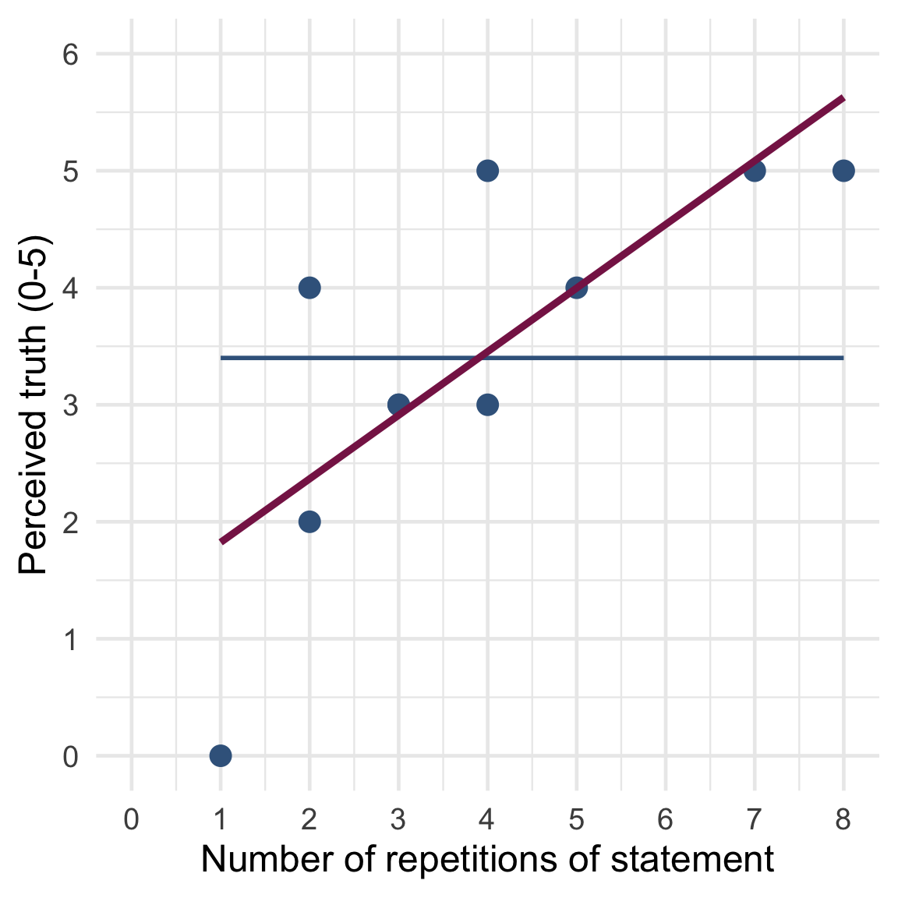

## Slide 44

### Model sum of squared errors, SS<sub>M</sub>

|       | Reps | Truth | Predicted value | Mean | Error | Squared error |
|-------|------|-------|-----------------|------|-------|---------------|
|       | 1    | 0     | 1.82            | 3.4  | -1.58 | 2.50          |
|       | 2    | 2     | 2.37            | 3.4  | -1.03 | 1.06          |
|       | 2    | 4     | 2.37            | 3.4  | -1.03 | 1.06          |
|       | 3    | 3     | 2.91            | 3.4  | -0.49 | 0.24          |
|       | 3    | 3     | 2.91            | 3.4  | -0.49 | 0.24          |
|       | 4    | 3     | 3.45            | 3.4  | 0.05  | 0.00          |
|       | 4    | 5     | 3.45            | 3.4  | 0.05  | 0.00          |
|       | 5    | 4     | 4.00            | 3.4  | 0.60  | 0.36          |
|       | 7    | 5     | 5.08            | 3.4  | 1.68  | 2.82          |
|       | 8    | 5     | 5.63            | 3.4  | 2.23  | 4.97          |
| SS~M~ | —    | —     | —               | —    | —     | 13.25         |


## Slide 45

### Model sum of squared errors, SS<sub>M</sub>

- The model is a rotation of the null model (the grand mean)
- Therefore, the null model and the estimated model are distinguished by 1 piece of independent information: the slope, *b*<sub>1</sub>
  - (Note, the intercept, *b*<sub>0</sub>, co-depends on the slope - it is not an independent piece of information)

``` math
 \begin{aligned} \text{df}_\text{M} &= \text{df}_\text{T} - \text{df}_\text{R} \\ &= 9 - 8 \\ &= 1 \end{aligned} 
```

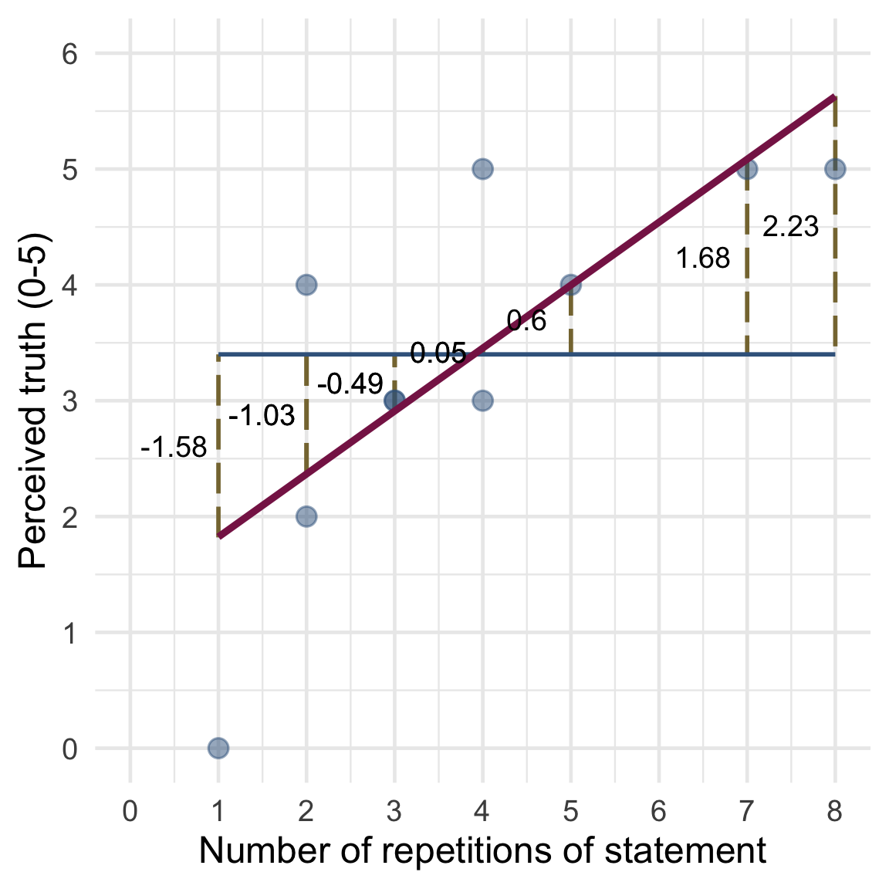

## Slide 46

``` math
 \begin{aligned} \text{SS}_\text{T} &= \text{SS}_\text{M} + \text{SS}_\text{R} \\ 22.40 &= 13.25 + 9.14 \end{aligned} 
```

(Within rounding error)


## Slide 47: Extending the linear model

``` math
 \text{interest}_i = \hat{b}_0 + \hat{b}_1\text{hard to get}_i + \hat{b}_2\text{mate value}_i +e_i 
```

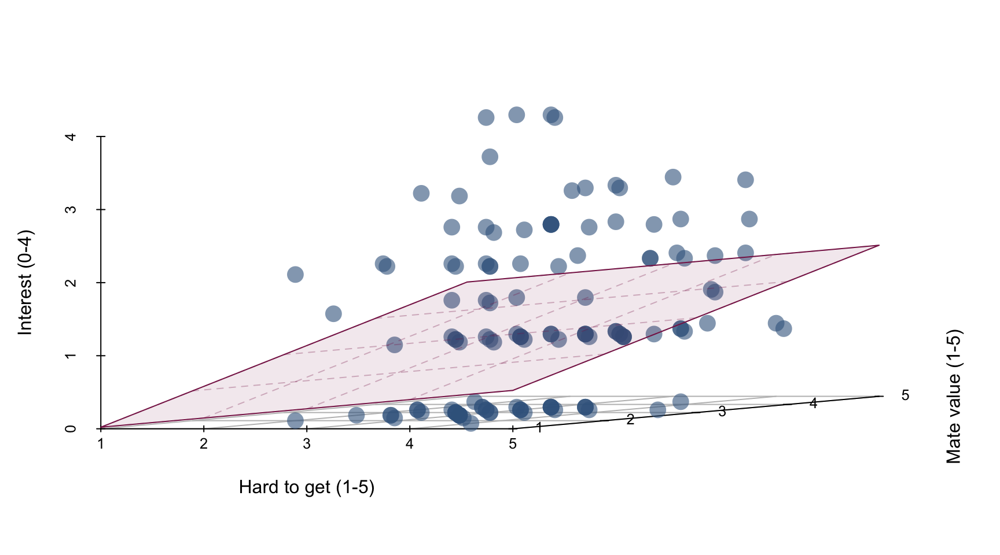

## Slide 48: Extending the linear model (SST)

``` math
 \text{interest}_i = \hat{b}_0 + \hat{b}_1\text{hard to get}_i + \hat{b}_2\text{mate value}_i +e_i 
```

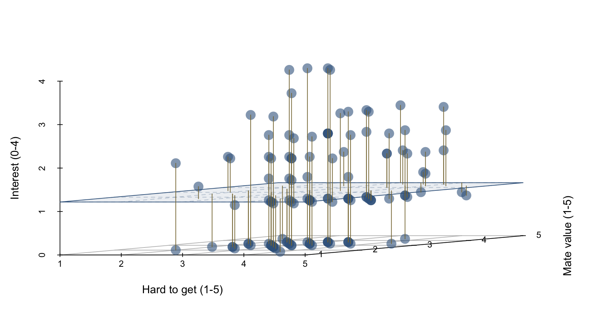

## Slide 49: Extending the linear model (SSR)

``` math
 \text{interest}_i = \hat{b}_0 + \hat{b}_1\text{hard to get}_i + \hat{b}_2\text{mate value}_i +e_i 
```

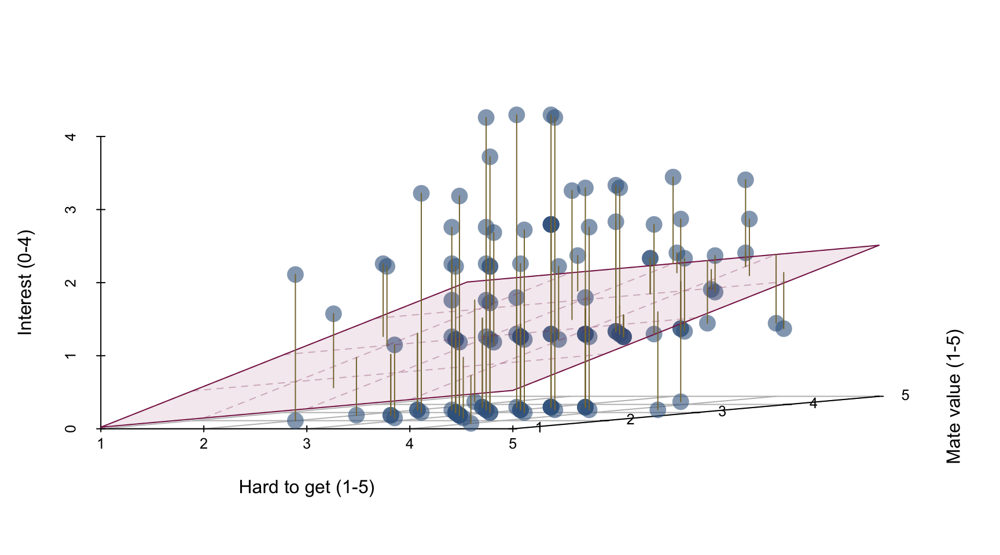

## Slide 50: Extending the linear model (SSM)

``` math
 \text{interest}_i = \hat{b}_0 + \hat{b}_1\text{hard to get}_i + \hat{b}_2\text{mate value}_i +e_i 
```

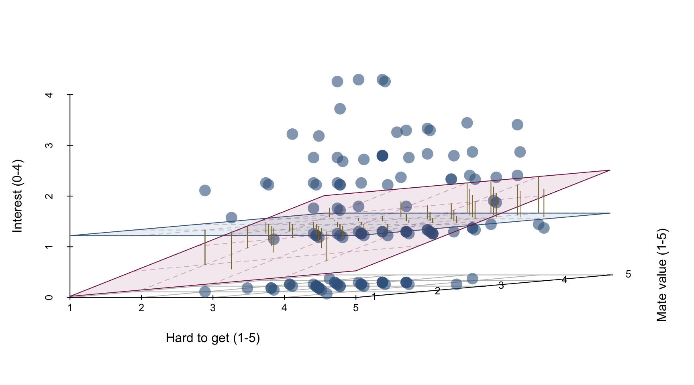

## Slide 51

Video clip: [lazinc durt we are coming](https://profandyfield.github.io/statistics_lectures/ds_03_fit/media/lazinc_durt_we_are_coming.mp4)

## Slide 52: Mean squared error (MS)

> **Note: Statis-tip**
>
> Why do we use mean squared error?
>
> - A sum/total of squared errors depends on the amount of information used to compute it. (If you add more squared errors, the sum increases.)
> - We can’t compare sums of squared errors based on different amounts of information
> - We can compute the average or mean squared error by dividing a SS by the amount of information used to compute it
> - The df quantifies the amount of information used to compute a sum of squared errors

``` math
 \text{MS} = \frac{\text{SS}}{\text{df}} 
```

## Slide 53: Mean squared error (MS)

- **MS<sub>R</sub>**
  - Average residual/error variability (variability between the model and the observed data)
  - How badly the model fits (on average)

``` math
 \begin{aligned} \text{MS}_\text{R} = \frac{\text{SS}_\text{R}}{\text{df}} = \frac{9.14}{8} = 1.14 \\ \end{aligned} 
```

- **MS<sub>M</sub>**
  - Average model variability (difference in variability between the model and the grand mean)
  - How much better the model is at predicting *Y* than the mean
  - How well the model fits (on average)

``` math
 \begin{aligned} \text{MS}_\text{M} = \frac{\text{SS}_\text{M}}{\text{df}} = \frac{13.25}{1} = 13.25 \\ \end{aligned} 
```

## Slide 54: Testing the model fit: the F-statistic

- If the model results in better prediction than using the mean, then MS<sub>M</sub> should be greater than MS<sub>R</sub>
- The *F*-statistic is the ratio of MS<sub>M</sub> to MS<sub>R</sub>
  - It’s the good-to-shit ratio

``` math
 \begin{aligned} F = \frac{\text{MS}_\text{M}}{\text{MS}_\text{R}} = \frac{13.25}{1.14} = 11.62 \\ \end{aligned} 
```

``` r
ite_lm <- lm(belief ~ repetition, data = ite_tib)
ite_aov <- anova(ite_lm)
display(ite_aov)
```

| Parameter  | Sum_Squares | df  | Mean_Square | F     | p     |
|------------|-------------|-----|-------------|-------|-------|
| repetition | 13.26       | 1   | 13.26       | 11.61 | 0.009 |
| Residuals  | 9.14        | 8   | 1.14        |       |       |

## Slide 55: Testing the model fit: the F-statistic

``` math
 \text{interest}_i = \hat{b}_0 + \hat{b}_1\text{hard to get}_i + \hat{b}_2\text{mate value}_i +e_i 
```

``` r
test_wald(more_hard_lm) |> 
  display()
```

| Name       | Model | df  | df_diff | F    | p     |
|------------|-------|-----|---------|------|-------|
| Null model | lm    | 127 |         |      |       |
| Full model | lm    | 125 | 2       | 4.27 | 0.016 |

> **Important: ReportR**
>
> Overall, including both playing hard to get and mate value significantly improved the fit of the model, *F*(2, 125) = 4.27, *p* = 0.016.

## Slide 56: Testing the model fit: R2

- ***R*<sup>2</sup>**
  - The proportion of variance accounted for by the model
  - The Pearson correlation between observed and predicted scores squared

``` math
 \begin{aligned} R^2 = \frac{\text{SS}_\text{M}}{\text{SS}_\text{T}} = \frac{13.25}{22.40} = 0.59 \\ \end{aligned} 
```

- **Adjusted *R*<sup>2</sup>**
  - *R*<sup>2</sup> increases as you add more predictors (unless those predictors explain zero variance)
  - Adjusted *R*<sup>2</sup> is an estimate of *R*<sup>2</sup> adjusted for the number of parameters in the model.

``` r
ite_lm <- lm(belief ~ repetition, data = ite_tib)
ite_fit <- model_performance(ite_lm)
display(ite_fit)
```

| AIC  | AICc | BIC  | R2   | R2 (adj.) | RMSE | Sigma |
|------|------|------|------|-----------|------|-------|
| 33.5 | 37.5 | 34.4 | 0.59 | 0.54      | 0.96 | 1.07  |

## Slide 57: Testing the model fit: R2

``` math
 \text{interest}_i = \hat{b}_0 + \hat{b}_1\text{hard to get}_i + \hat{b}_2\text{mate value}_i +e_i 
```

``` r
model_performance(more_hard_lm) |> 
  display()
```

| AIC   | AICc  | BIC   | R2   | R2 (adj.) | RMSE | Sigma |
|-------|-------|-------|------|-----------|------|-------|
| 390.8 | 391.2 | 402.3 | 0.06 | 0.05      | 1.08 | 1.09  |

> **Important: ReportR**
>
> Overall, including both playing hard to get and mate value significantly accounted for 6% of the variance in expressions of interest, or 5% adjusting for the number of predictors (*R*<sup>2</sup> = 0.06, *R*<sup>2</sup><sub>adjusted</sub> = 0.05).

## Slide 58: Summary

- Multiple predictors can be added to a linear model
  - *b*s are the change in the outcome associated with a unit change in the predictor **when other predictors are held constant**
  - Other things being equal, predictors are entered based on theory.
- We evaluate fit of a general linear model using Sums of Squared Errors (**SS**)
  - SS<sub>T</sub> = the **total** variance/error in observed scores
  - SS<sub>R</sub> = the **total** variance/error in predicted scores
  - S<sub>M</sub> = the **total** reduction in variance/error due to the model
- It can be useful to convert totals to averages or Mean Squared Errors (**MS**)
  - MS<sub>R</sub> = the **average** variance/error in predicted scores
  - MS<sub>M</sub> = the **average** reduction in variance/error due to the model
- *R*<sup>2</sup> is the proportion of variance in observed scores accounted for by the model
- *F* is the average variance accounted for by the model compared to the model’s error in prediction
