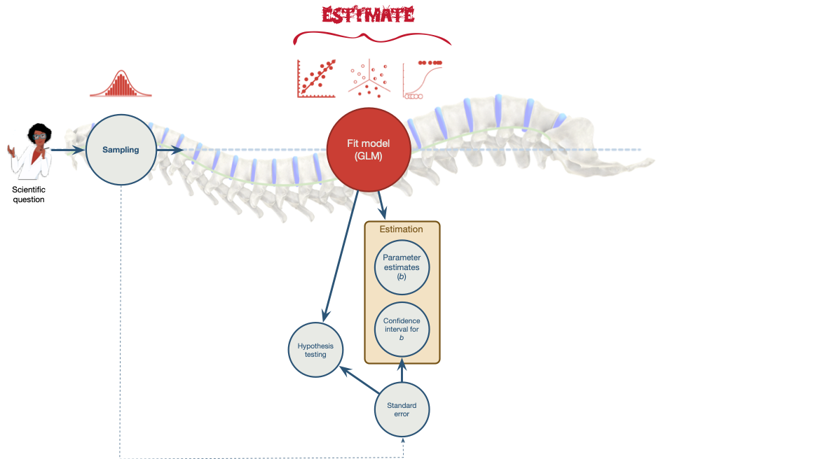

```{r}
# general
library(easystats)
library(tidyverse)
# specific
library(gt)
library(kableExtra) 
library(scatterplot3d)

source("../helpers/discovr_helpers.R")
source("../helpers/easystats_helpers.R")
```


##  Learning outcomes

### Extending the model

- Understanding how to incorporate multiple predictors in the general linear model
  - The mathematical model
  - Visualizing the model
  - Methods for entering predictors to the model
  - Interpreting parameter estimates
  
::: fragment
### Model fit

- Understand how we establish the fit of a general linear model to the
  - Sums of squares
  - Mean squares
  - The *F*-statistic
  - *R*^2^

:::

::: notes
Use C to toggle pen/markup
Use backspace to delete markup
Use f to toggle fullscreen
:::


## 

::: r-stack
{.fragment fig-align="center" width="1050" height="594"}

{.fragment fig-align="center" width="1050" height="594"}
:::


##

{fig-align="center" height=600}

# Extending the model

```{r, child = "multireg.qmd"}

```

# Model fit

```{r, child = "ss_taylor.qmd"}

```

```{r, child = "sum_squares.qmd"}

```


## Summary

- Multiple predictors can be added to a linear model
  - *b*s are the change in the outcome associated with a unit change in the predictor **when other predictors are held constant**
  - Other things being equal, predictors are entered based on theory.

::: fragment

- We evaluate fit of a general linear model using Sums of Squared Errors ([SS]{.alt})
  - SS~T~  = the **total** variance/error in observed scores
  - SS~R~ = the **total** variance/error in predicted scores
  - S~M~ = the **total** reduction in variance/error due to the model

:::
::: fragment

- It can be useful to convert totals to averages or Mean Squared Errors ([MS]{.alt})
  - MS~R~ = the **average** variance/error in predicted scores
  - MS~M~ = the **average** reduction in variance/error due to the model
  
:::
::: fragment
- *R*^2^ is the proportion of variance in observed scores accounted for by the model
:::
::: fragment
- *F* is the average variance accounted for by the model compared to the model's error in prediction
:::

