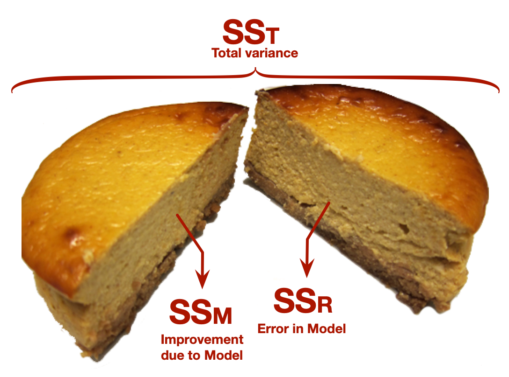

## Illusory Truth Effect (ITE)^[Murray et al. (2020). [https://doi.org/10.31234/osf.io/9evzc](https://doi.org/10.31234/osf.io/9evzc)]

::: fragment

- Repetition increases perceived truthfulness (Hasher et al., 1977)

:::
::: fragment

- This is equally true for plausible and implausible statements (Fazio et al., 2019)

:::

## {background-video="media/milton_lecture_amazing_repeat.mp4" background-size="cover"}


## Illusory Truth Effect (ITE)^[Murray et al. (2020). [https://doi.org/10.31234/osf.io/9evzc](https://doi.org/10.31234/osf.io/9evzc)]


- Repetition increases perceived truthfulness (Hasher et al., 1977)
- This is equally true for plausible and implausible statements (Fazio et al., 2019)

::: fragment

- Worryingly, the effect is true for false political statements regardless of political ideology
  - Of 105 statements made by Donald Trump between 02/11/2016 and 9/10/2019 77 (73%) were only half true or worse.
  - In experiments, people exposed repeatedly to Trump statements rated them as more truthful than those who were not on a 6-point scale <sup>1</sup>

:::
::: fragment

- Imagine a model that predicts ratings of truth of fake statements from number of exposures
  - Predictor: number of exposures
  - outcome: ratings of truth (0 = definitely false, 5 = definitely true)

:::

## Testing the fit of the general linear model

To see whether the model is a reasonable ‘fit’ of the observed data we use the sum of squared errors ([SS]{.alt}):

::: fragment

- **SS~T~**
  + Total variability (variability between scores and the mean)

:::
::: fragment

- **SS~R~**
  - Total residual/error variability (variability between the model and the observed data)
  - How badly the model fits (in total)

:::
::: fragment

- **SS~M~** 
  - Total model variability (difference in variability between the model and the grand mean)
  - How much better the model is at predicting *Y* than the mean
  - How well the model fits (in total)

:::

## 

{fig-align="center" height=600}

##

```{r}
#| echo: false

set.seed(666)

ite_tib <- tibble::tibble(
  id = stringi::stri_rand_strings(10, 5),
  repetition = round(rnorm(id, mean = 5, sd = 2)),
  belief = round(1 + 0.5*repetition  + rnorm(repetition, mean = 0, sd = 1))
)

ite_lm <- lm(belief ~ repetition, data = ite_tib)
ite_fit <- model_performance(ite_lm)
ite_pe <- model_parameters(ite_lm)
mean_truth <- mean(ite_tib$belief)
```

:::: columns
::: {.column width="50%"}
::: txt_mulberry
::: txt_s
$$
\begin{aligned}
\text{perceived truth}_i &= \hat{b}_0 + \hat{b}_1\text{repetition}_{i} + e_i \\
\hat{\text{perceived truth}}_i &= 1.28 + 0.54\text{ repetition}_{i} \\
\end{aligned}
$$
:::
:::
:::
::: {.column width="50%"}
```{r}
#| echo: false
#| message: false
#| fig-width: 6
#| fig-height: 6

ite_plot <- ggplot2::ggplot(ite_tib, aes(y = belief, x = repetition)) +
  geom_point(colour = blue, alpha = 0.6, size = 4) +
  geom_smooth(method = "lm", fill = mulberry, colour = mulberry, se = F) +
  labs(x = "Number of repetitions of statement", y = "Perceived truth (0-5)") +
  coord_cartesian(xlim = c(0, 8), ylim = c(0, 6)) +
  scale_x_continuous(breaks = 0:8) +
  scale_y_continuous(breaks = 0:6) +
  theme_minimal(base_size = 18) 
ite_plot
```
:::
::::

##

:::: columns 
::: {.column width="50%"} :::
### Total sum of squared error, SS~T~
:::

::: {.column width="50%"}
```{r}
#| echo: false
#| message: false
#| fig-width: 6
#| fig-height: 6

ite_scat <- ggplot2::ggplot(ite_tib, aes(y = belief, x = repetition)) +
  labs(x = "Number of repetitions of statement", y = "Perceived truth (0-5)") +
  coord_cartesian(xlim = c(0, 8), ylim = c(0, 6)) +
  scale_x_continuous(breaks = 0:8) +
  scale_y_continuous(breaks = 0:6) +
  theme_minimal(base_size = 18) 

ite_scat +
  geom_point(colour = blue, size = 4)
```
:::
::::

##

:::: columns 
::: {.column width="50%"} :::
### Total sum of squared error, SS~T~
:::

::: {.column width="50%"}
```{r}
#| echo: false
#| message: false
#| fig-width: 6
#| fig-height: 6

ite_scat +
  geom_point(colour = blue, size = 4) +
  annotate("segment", x = 1, xend = 8, y = mean_truth, yend = mean_truth, colour = blue, size = 1)
```
:::
::::

##

:::: columns 
::: {.column width="50%"} :::
### Total sum of squared error, SS~T~


```{r}
#| echo: false
#| message: false
#| warning: false

sst <- tibble::tibble(
  Reps = ite_tib$repetition,
  Truth = ite_tib$belief,
  Predicted = mean_truth,
  Error = Truth - Predicted,
  `Squared error` = Error^2
)

sst |>
  dplyr::arrange(Reps) |> 
  dplyr::rename(
    `Predicted value` = Predicted
    ) |> 
  gt::gt() |> 
  gt::grand_summary_rows(
    columns = vars(`Squared error`),
    fns = list(label = "SS Total", fn = "sum")
  ) |>
  gt::tab_style(
    style = list(
      gt::cell_fill(color = blue, alpha = 0.8),
      gt::cell_text(weight = "bold", color = "white", align = "right")
      ),
    locations = gt::cells_body(
      columns = vars(Error)
    )
    ) |>
  gt::tab_style(
    style = list(
      gt::cell_fill(color = purple, alpha = 0.8),
      gt::cell_text(weight = "bold", color = "white", align = "right")
      ),
    locations = gt::cells_body(
      columns = vars(`Squared error`)
    )
    ) |>
  gt::tab_style(
    style = list(
      gt::cell_fill(color = mulberry, alpha = 0.1),
      gt::cell_text(weight = "bold", color = mulberry, align = "right")
      ),
    locations = gt::cells_grand_summary(
      columns = vars(`Squared error`),
      rows = 1
    )
    )
```

:::
::: {.column width="50%"}
```{r}
#| echo: false
#| message: false
#| warning: false
#| fig-width: 6
#| fig-height: 6

ite_scat +
  geom_linerange(aes(ymin = mean_truth, ymax = ite_tib$belief), size = 1, colour = brown, linetype = "longdash") +
  geom_point(colour = blue, size = 4) +
  annotate("segment", x = 1, xend = 8, y = mean_truth, yend = mean_truth, colour = blue, size = 1) +
  annotate("text", x = ite_tib$repetition-0.5, y = ite_tib$belief - (sst$Error/2), label = sst$Error, size = 5)
```
:::
::::

##

:::: columns
::: {.column width="50%"}
### Total sum of squared errors, SS~T~

- Each SS has associated [degrees of freedom]{.alt} ([df]{.alt})
- The *df* is the amount of *independent information* available to compute SS 
- To begin with we have *N* pieces of independent information
- For every parameter (*p*) estimated we lose 1 piece of independent information
- To get SS~T~ we estimate 1 parameter (the overall mean):

::: txt_mulberry
$$
\begin{aligned}
\text{df}_\text{T} &= N-p \\
&= 10 - 1 \\
&= 9
\end{aligned}
$$
:::
:::
::: {.column width="50%"}
```{r}
#| echo: false
#| message: false
#| warning: false
#| fig-width: 6
#| fig-height: 6

ite_scat +
  geom_linerange(aes(ymin = mean_truth, ymax = ite_tib$belief), size = 1, colour = brown, linetype = "longdash") +
  geom_point(colour = blue, size = 4) +
  annotate("segment", x = 1, xend = 8, y = mean_truth, yend = mean_truth, colour = blue, size = 1) +
  annotate("text", x = ite_tib$repetition-0.5, y = ite_tib$belief - (sst$Error/2), label = sst$Error, size = 5)
```
:::
::::

##

:::: columns
::: {.column width="50%"}
### Residual sum of squared errors, SS~R~
::: 
::: {.column width="50%"}
```{r}
#| echo: false
#| message: false
#| warning: false
#| fig-width: 6
#| fig-height: 6

ite_scat +
  geom_point(colour = blue, size = 4) +
  annotate("segment", x = 1, xend = 8, y = mean_truth, yend = mean_truth, colour = blue, size = 1)
```
:::
::::


##

:::: columns
::: {.column width="50%"}
### Residual sum of squared errors, SS~R~
:::
::: {.column width="50%"}
```{r}
#| echo: false
#| message: false
#| warning: false
#| fig-width: 6
#| fig-height: 6

ite_scat +
  geom_point(colour = blue, size = 4) +
  annotate("segment", x = 1, xend = 8, y = mean_truth, yend = mean_truth, colour = grey, size = 1) +
  geom_smooth(method = "lm", fill = mulberry, colour = mulberry, se = F)
```
:::
::::

##

:::: columns
::: {.column width="50%"}
### Residual sum of squared errors, SS~R~

```{r}
#| echo: false
#| message: false
#| warning: false
#| results: asis

ssr <- tibble::tibble(
  Reps = ite_tib$repetition,
  Truth = ite_tib$belief,
  Predicted = round(predict(ite_lm), 2),
  Error = Truth - Predicted,
  `Squared error` = round(Error^2, 2)
)

ssr |> 
  dplyr::arrange(Reps) |>
  dplyr::rename(
    `Predicted value` = Predicted
    ) |>
  gt::gt() |> 
  gt::grand_summary_rows(
    columns = vars(`Squared error`),
    fns = list(label = "SS Residual", fn = "sum")
  ) |>
  gt::tab_style(
    style = list(
      gt::cell_fill(color = blue, alpha = 0.8),
      gt::cell_text(weight = "bold", color = "white", align = "right")
      ),
    locations = gt::cells_body(
      columns = vars(Error)
    )
    ) |>
  gt::tab_style(
    style = list(
      gt::cell_fill(color = purple, alpha = 0.8),
      gt::cell_text(weight = "bold", color = "white", align = "right")
      ),
    locations = gt::cells_body(
      columns = vars(`Squared error`)
    )
    ) |>
  gt::tab_style(
    style = list(
      gt::cell_fill(color = mulberry, alpha = 0.1),
      gt::cell_text(weight = "bold", color = mulberry, align = "right")
      ),
    locations = gt::cells_grand_summary(
      columns = vars(`Squared error`),
      rows = 1
    )
    )
```

:::
::: {.column width="50%"}
```{r}
#| echo: false
#| message: false
#| warning: false
#| fig-width: 6
#| fig-height: 6

ite_scat +
  geom_linerange(aes(ymin = ssr$Predicted, ymax = ite_tib$belief), size = 1, colour = brown, linetype = "longdash") +
  geom_point(colour = blue, size = 4) +
  annotate("segment", x = 1, xend = 8, y = mean_truth, yend = mean_truth, colour = grey, size = 1) +
  geom_smooth(method = "lm", fill = mulberry, colour = mulberry, se = F) +
  annotate("text", x = ite_tib$repetition-0.5, y = ite_tib$belief - (ssr$Error/2), label = round(ssr$Error, 2), size = 5)
```
:::
::::

##

:::: columns 
::: {.column width="50%"}
### Residual sum of squared errors, SS~R~

- To begin with we have *N* pieces of independent information
- To get SS~R~ we estimate two parameters (*b*~0~ and *b*~1~):

::: txt_mulberry
$$
\begin{aligned}
\text{df}_\text{R} &= N-p \\
&= 10 - 2 \\
&= 8
\end{aligned}
$$
:::
:::
::: {.column width="50%"}
```{r}
#| echo: false
#| message: false
#| warning: false
#| fig-width: 6
#| fig-height: 6

ite_scat +
  geom_linerange(aes(ymin = ssr$Predicted, ymax = ite_tib$belief), size = 1, colour = brown, linetype = "longdash") +
  geom_point(colour = blue, size = 4) +
  annotate("segment", x = 1, xend = 8, y = mean_truth, yend = mean_truth, colour = grey, size = 1) +
  geom_smooth(method = "lm", fill = mulberry, colour = mulberry, se = F) +
  annotate("text", x = ite_tib$repetition-0.5, y = ite_tib$belief - (ssr$Error/2), label = round(ssr$Error, 2), size = 5)
```
:::
::::


##

:::: columns
::: {.column width="50%"}
### Model sum of squared errors, SS~M~
:::
::: {.column width="50%"}
```{r}
#| echo: false
#| message: false
#| warning: false
#| fig-width: 6
#| fig-height: 6

ite_scat +
  geom_point(colour = blue, size = 4) +
  geom_smooth(method = "lm", fill = mulberry, colour = mulberry, se = F)
```
:::
::::

##

:::: columns
::: {.column width="50%"}
### Model sum of squared errors, SS~M~
:::
::: {.column width="50%"}
```{r}
#| echo: false
#| message: false
#| warning: false
#| fig-width: 6
#| fig-height: 6

ite_scat +
  geom_point(colour = blue, size = 4) +
  annotate("segment", x = 1, xend = 8, y = mean_truth, yend = mean_truth, colour = blue, size = 1) +
  geom_smooth(method = "lm", fill = mulberry, colour = mulberry, se = F)
```
:::
::::

##

:::: columns 
::: {.column width="50%"}
### Model sum of squared errors, SS~M~

```{r}
#| echo: false
#| message: false
#| warning: false
#| results: asis

ssm <- tibble::tibble(
  Reps = ite_tib$repetition,
  Truth = ite_tib$belief,
  Predicted = round(predict(ite_lm), 2),
  Mean = mean_truth,
  Error = Predicted - mean_truth,
  `Squared error` = round(Error^2, 2)
)

ssm |>
  dplyr::arrange(Reps) |> 
  dplyr::rename(
    `Predicted value` = Predicted
    ) |>
  gt::gt() |> 
  gt::grand_summary_rows(
    columns = vars(`Squared error`),
    fns = list(label = "SS~M~", fn = "sum")
  ) |>
  gt::tab_style(
    style = list(
      gt::cell_fill(color = blue, alpha = 0.8),
      gt::cell_text(weight = "bold", color = "white", align = "right")
      ),
    locations = gt::cells_body(
      columns = vars(Error)
    )
    ) |>
  gt::tab_style(
    style = list(
      gt::cell_fill(color = purple, alpha = 0.8),
      gt::cell_text(weight = "bold", color = "white", align = "right")
      ),
    locations = gt::cells_body(
      columns = vars(`Squared error`)
    )
    ) |>
  gt::tab_style(
    style = list(
      gt::cell_fill(color = mulberry, alpha = 0.1),
      gt::cell_text(weight = "bold", color = mulberry, align = "right")
      ),
    locations = gt::cells_grand_summary(
      columns = vars(`Squared error`),
      rows = 1
    )
    )
```
:::
::: {.column width="50%"}
```{r}
#| echo: false
#| message: false
#| warning: false
#| fig-width: 6
#| fig-height: 6

ite_scat +
  geom_linerange(aes(ymin = ssm$Predicted, ymax = ssm$Mean), size = 1, colour = brown, linetype = "longdash") +
  geom_point(colour = blue, size = 4, alpha = 0.5) +
  annotate("segment", x = 1, xend = 8, y = mean_truth, yend = mean_truth, colour = blue, size = 1) +
  geom_smooth(method = "lm", fill = mulberry, colour = mulberry, se = F) +
  annotate("text", x = ite_tib$repetition-0.5, y = ssm$Predicted - (ssm$Error/2), label = round(ssm$Error, 2), size = 5)
```
:::
::::

##

:::: columns
::: {.column width="50%"}
### Model sum of squared errors, SS~M~

- The model is a rotation of the null model (the grand mean)
- Therefore, the null model and the estimated model are distinguished by 1 piece of independent information: the slope, *b*~1~
  - (Note, the intercept, *b*~0~, co-depends on the slope - it is not an independent piece of information)

::: txt_mulberry
$$
\begin{aligned}
\text{df}_\text{M} &= \text{df}_\text{T} - \text{df}_\text{R} \\
&= 9 - 8 \\
&= 1
\end{aligned}
$$

:::
:::
::: {.column width="50%"}
```{r}
#| echo: false
#| message: false
#| warning: false
#| fig-width: 6
#| fig-height: 6

ite_scat +
  geom_linerange(aes(ymin = ssm$Predicted, ymax = ssm$Mean), size = 1, colour = brown, linetype = "longdash") +
  geom_point(colour = blue, size = 4, alpha = 0.5) +
  annotate("segment", x = 1, xend = 8, y = mean_truth, yend = mean_truth, colour = blue, size = 1) +
  geom_smooth(method = "lm", fill = mulberry, colour = mulberry, se = F) +
  annotate("text", x = ite_tib$repetition-0.5, y = ssm$Predicted - (ssm$Error/2), label = round(ssm$Error, 2), size = 5)
```
:::
::::


##

::: center-h
::: txt_mulberry
::: txt_l
$$
\begin{aligned}
\text{SS}_\text{T} &= \text{SS}_\text{M} + \text{SS}_\text{R} \\
22.40 &= 13.25 + 9.14
\end{aligned}
$$
:::
:::
:::


(Within rounding error)

{fig-align="center" height=500}

## Extending the linear model

::: center-h
::: txt_mulberry
::: txt_l
$$
\text{interest}_i = \hat{b}_0 + \hat{b}_1\text{hard to get}_i + \hat{b}_2\text{mate value}_i +e_i
$$
:::
:::
:::

::: center-h

```{r}
#| echo: false
#| warning: false
#| message: false
#| fig-width: 9
#| fig-height: 5


s3d <- scatterplot3d::scatterplot3d(x = hard_tib$hard_to_get,
                               y = hard_tib$mate_value,
                               z = hard_tib$interest,
                               color = alpha(blue, 0.6),
                               angle = 10,
                               pch = 16,
                               zlim = c(0, 4),
                               xlim = c(1, 5),
                               ylim = c(1, 5),
                               box = FALSE,
                               cex.symbols = 2,
                               ylab = "Mate value (1-5)",
                               zlab = "Interest (0-4)",
                               xlab = "Hard to get (1-5)"
                               )

s3d$plane3d(more_hard_lm, lty = 2, draw_polygon = TRUE, col = alpha(mulberry, 0.3), polygon_args = list(col = alpha(mulberry, 0.1), border = mulberry))

```

:::

## Extending the linear model (SS~T~)

::: center-h
::: txt_mulberry
::: txt_l
$$
\text{interest}_i = \hat{b}_0 + \hat{b}_1\text{hard to get}_i + \hat{b}_2\text{mate value}_i +e_i
$$
:::
:::
:::

::: center-h

```{r}
#| echo: false
#| warning: false
#| message: false
#| fig-width: 9
#| fig-height: 5

s3d <- scatterplot3d::scatterplot3d(x = hard_tib$hard_to_get,
                               y = hard_tib$mate_value,
                               z = hard_tib$interest,
                               color = alpha(blue, 0.6),
                               angle = 10,
                               pch = 16,
                               zlim = c(0, 4),
                               xlim = c(1, 5),
                               ylim = c(1, 5),
                               box = FALSE,
                               cex.symbols = 2,
                               ylab = "Mate value (1-5)",
                               zlab = "Interest (0-4)",
                               xlab = "Hard to get (1-5)"
                               )

orig <- s3d$xyz.convert(hard_tib$hard_to_get, 
                       hard_tib$mate_value, 
                       hard_tib$interest)
plane <- s3d$xyz.convert(hard_tib$hard_to_get, 
                        hard_tib$mate_value,  fitted(more_hard_null))


s3d$plane3d(more_hard_null, lty = 2, draw_polygon = TRUE, col = alpha(blue, 0.3), polygon_args = list(col = alpha(blue, 0.1), border = blue))

segments(orig$x, orig$y, plane$x, plane$y,
         col = brown, 
         lty = 1)

```

:::

## Extending the linear model (SS~R~)

::: center-h
::: txt_mulberry
::: txt_l
$$
\text{interest}_i = \hat{b}_0 + \hat{b}_1\text{hard to get}_i + \hat{b}_2\text{mate value}_i +e_i
$$
:::
:::
:::

::: center-h

```{r}
#| echo: false
#| warning: false
#| message: false
#| fig-width: 9
#| fig-height: 5

s3d <- scatterplot3d::scatterplot3d(x = hard_tib$hard_to_get,
                               y = hard_tib$mate_value,
                               z = hard_tib$interest,
                               color = alpha(blue, 0.6),
                               angle = 10,
                               pch = 16,
                               zlim = c(0, 4),
                               xlim = c(1, 5),
                               ylim = c(1, 5),
                               box = FALSE,
                               cex.symbols = 2,
                               ylab = "Mate value (1-5)",
                               zlab = "Interest (0-4)",
                               xlab = "Hard to get (1-5)"
                               )

s3d$plane3d(more_hard_lm, lty = 2, draw_polygon = TRUE, col = alpha(mulberry, 0.3), polygon_args = list(col = alpha(mulberry, 0.1), border = mulberry))

orig <- s3d$xyz.convert(hard_tib$hard_to_get, 
                       hard_tib$mate_value, 
                       hard_tib$interest)
plane <- s3d$xyz.convert(hard_tib$hard_to_get, 
                        hard_tib$mate_value,  fitted(more_hard_lm))

segments(orig$x, orig$y, plane$x, plane$y,
         col = brown, 
         lty = 1)

```

:::


## Extending the linear model (SS~M~)

::: center-h
::: txt_mulberry
::: txt_l
$$
\text{interest}_i = \hat{b}_0 + \hat{b}_1\text{hard to get}_i + \hat{b}_2\text{mate value}_i +e_i
$$
:::
:::
:::

::: center-h

```{r}
#| echo: false
#| warning: false
#| message: false
#| fig-width: 9
#| fig-height: 5

s3d <- scatterplot3d::scatterplot3d(x = hard_tib$hard_to_get,
                               y = hard_tib$mate_value,
                               z = hard_tib$interest,
                               color = alpha(blue, 0.6),
                               angle = 10,
                               pch = 16,
                               zlim = c(0, 4),
                               xlim = c(1, 5),
                               ylim = c(1, 5),
                               box = FALSE,
                               cex.symbols = 2,
                               ylab = "Mate value (1-5)",
                               zlab = "Interest (0-4)",
                               xlab = "Hard to get (1-5)"
                               )

s3d$plane3d(more_hard_null, lty = 2, draw_polygon = TRUE, col = alpha(blue, 0.3), polygon_args = list(col = alpha(blue, 0.1), border = blue))
s3d$plane3d(more_hard_lm, lty = 2, draw_polygon = TRUE, col = alpha(mulberry, 0.3), polygon_args = list(col = alpha(mulberry, 0.1), border = mulberry))

orig <- s3d$xyz.convert(hard_tib$hard_to_get, 
                       hard_tib$mate_value, 
                       fitted(more_hard_null))
plane <- s3d$xyz.convert(hard_tib$hard_to_get, 
                        hard_tib$mate_value,
                        fitted(more_hard_lm))

segments(orig$x, orig$y, plane$x, plane$y,
         col = brown, 
         lty = 1)

```

:::


## {background-video="media/lazinc_durt_we_are_coming.mp4" background-size="cover"}


## Mean squared error (MS)

::: {.callout-note icon = false}
##  Statis-tip

Why do we use mean squared error?

::: incremental

- A sum/total of squared errors depends on the amount of information used to compute it. (If you add more squared errors, the sum increases.)
- We can't compare sums of squared errors based on different amounts of information
- We can compute the average or mean squared error by dividing a SS by the amount of information used to compute it
- The df quantifies the amount of information used to compute a sum of squared errors

:::
:::


::: center-h
::: txt_mulberry
::: txt_l
$$
\text{MS} = \frac{\text{SS}}{\text{df}}
$$
:::
:::
:::


## Mean squared error (MS)


- **MS~R~**
  + Average residual/error variability (variability between the model and the observed data)
  + How badly the model fits (on average)

::: center-h
::: txt_mulberry
$$
\begin{aligned}
\text{MS}_\text{R} = \frac{\text{SS}_\text{R}}{\text{df}} = \frac{9.14}{8} = 1.14 \\
\end{aligned}
$$
:::
:::

::: fragment

- **MS~M~** 
  + Average model variability (difference in variability between the model and the grand mean)
  + How much better the model is at predicting *Y* than the mean
  + How well the model fits (on average)

::: center-h
::: txt_mulberry
$$
\begin{aligned}
\text{MS}_\text{M} = \frac{\text{SS}_\text{M}}{\text{df}} = \frac{13.25}{1} = 13.25 \\
\end{aligned}
$$
:::
:::

:::

## Testing the model fit: the *F*-statistic

- If the model results in better prediction than using the mean, then MS~M~ should be greater than MS~R~
- The *F*-statistic is the ratio of MS~M~ to MS~R~
  - It's the good-to-shit ratio

::: fragment

::: center-h
::: txt_mulberry
::: txt_l
$$
\begin{aligned}
F = \frac{\text{MS}_\text{M}}{\text{MS}_\text{R}} = \frac{13.25}{1.14} = 11.62 \\
\end{aligned}
$$
:::
:::
:::
:::

::: fragment

```{r}
#| echo: true
#| eval: false
#| message: false
#| warning: false

ite_lm <- lm(belief ~ repetition, data = ite_tib)
ite_aov <- anova(ite_lm)
display(ite_aov)
```

\

```{r}
#| echo: false
#| message: false
#| warning: false

ite_aov <- anova(ite_lm) |> 
  model_parameters()
display(ite_aov, footer = "")
```
:::


## Testing the model fit: the *F*-statistic

::: center-h
::: txt_mulberry
::: txt_l
$$
\text{interest}_i = \hat{b}_0 + \hat{b}_1\text{hard to get}_i + \hat{b}_2\text{mate value}_i +e_i
$$
:::
:::
:::


```{r}
#| echo: true
#| eval: false
#| message: false
#| warning: false

test_wald(more_hard_lm) |> 
  display()
```

```{r}
#| echo: false
#| message: false
#| warning: false


hard_aov <- test_wald(more_hard_lm)
display(hard_aov, footer = "")
```


\

:::{.callout-important icon=false}
##  Report`r rproj()`

Overall, including both playing hard to get and mate value significantly improved the fit of the model, `r report_lrt(hard_aov)`.
:::


## Testing the model fit: *R*^2^

- ***R*^2^**
  - The proportion of variance accounted for by the model
  - The Pearson correlation between observed and predicted scores squared

::: center-h
::: txt_mulberry
$$
\begin{aligned}
R^2 = \frac{\text{SS}_\text{M}}{\text{SS}_\text{T}} = \frac{13.25}{22.40} = 0.59 \\
\end{aligned}
$$
:::
:::

::: fragment

- **Adjusted *R*^2^**
  - *R*^2^ increases as you add more predictors (unless those predictors explain zero variance)
  - Adjusted *R*^2^ is an estimate of *R*^2^ adjusted for the number of parameters in the model. 

:::
::: fragment

```{r}
#| echo: true
#| eval: false
#| message: false
#| warning: false

ite_lm <- lm(belief ~ repetition, data = ite_tib)
ite_fit <- model_performance(ite_lm)
display(ite_fit)
```

```{r}
#| echo: false
#| message: false
#| warning: false

model_performance(ite_lm) |> 
  display()
```
:::

## Testing the model fit: *R*^2^

::: center-h
::: txt_mulberry
::: txt_l
$$
\text{interest}_i = \hat{b}_0 + \hat{b}_1\text{hard to get}_i + \hat{b}_2\text{mate value}_i +e_i
$$
:::
:::
:::

```{r}
#| echo: false
#| message: false
#| warning: false

hard_r <- model_performance(more_hard_lm)
```


```{r}
#| echo: true
#| message: false
#| warning: false

model_performance(more_hard_lm) |> 
  display()
```

\

:::{.callout-important icon=false}
##  Report`r rproj()`

Overall, including both playing hard to get and mate value significantly accounted for `r percent_from_ez(hard_r, value = "R2")` of the variance in expressions of interest, or `r percent_from_ez(hard_r, value = "R2_adjusted")` adjusting for the number of predictors (*R*^2^ = `r value_from_ez(hard_r, value = "R2")`, *R*^2^~adjusted~ = `r value_from_ez(hard_r, value = "R2_adjusted")`).
:::

