```{r}
library(dplyr)
library(ggplot2)
library(ggfortify)
library(gt)
library(kableExtra)
library(parameters)
library(tibble)

source("../helpers/discovr_helpers.R")

hov_cont_tib <- readr::read_csv("data/dragon_hov_contnuous.csv")

hov_cat_tib <- readr::read_csv("data/dragon_hov_categorical.csv") |>
  dplyr::mutate(
    dragons = forcats::as_factor(dragons) |> forcats::fct_relevel("No dragons"),
    dummy = ifelse(dragons == "No dragons", 0, 1)
  )

hom_tib <-   readr::read_csv("data/dragon_hom_contnuous.csv") |> 
  dplyr::mutate(
    drag_gp = ifelse(dragons > 1, "Dragons", "No dragons") |> forcats::as_factor() |> forcats::fct_relevel("No dragons")
  )


out_tib <- readr::read_csv("data/dragon_outlier.csv")
poop_tib <- readr::read_csv("data/dragon_poop.csv") 
poop_norm_tib <-   readr::read_csv("data/dragon_poop_norm.csv") 
```

## {background-image="media/lone_knight.jpg" background-size="cover"}

<audio controls autoplay>
  <source src="media/beast_of_bias_narration.mp3" type="audio/mpeg">
  <source src="media/beast_of_bias_narration.ogg" type="audio/ogg"/>
</audio>

:::{.center-h}
:::{.txt_l}
:::{.txt_white}
All is not well in the island of linearis modelus.

For years, humans and dragons have lived in harmony, until recently.

The rulers of the 134 kingdoms want the island for themselves.

Through a campaign of propaganda, they have convinced their subjects

that the dragons should be banished.

They have sent their best knights to slay the dragons.

Only Melvin, a wise wizzard of statistics, can save them.

He meets with the commander in chief of the knights of the 134 kingdoms.
:::
:::
:::

::: notes
I am Melvin, a wise wizzard of statistics. Who are you?
:::


```{r, child = "knight_intro.qmd"}

```

##

```{r, child = "spine_map_bias.qmd"}

```

# Part 1: Outliers and do dragons eat sheep? {}

> "Coz they eat all our sheep"
>
> *Sir Knight Zach, Defender of the world of Military*

##

```{r}
#| fig-width: 7
#| fig-height: 4
#| fig-align: center

ggplot2::ggplot(out_tib, aes(dragons, livestock)) +
  geom_point(colour = mulberry, size = 3, alpha = 0.5) +
  geom_smooth(method = "lm", se = FALSE, colour = blue) +
  labs(x = "Number of dragons in area", y = "Livestock killed per week") +
  coord_cartesian(ylim = c(0, 75)) +
  scale_y_continuous(breaks = seq(0, 75, 5)) +
  scale_x_continuous(breaks = seq(0, 9, 1)) +
  theme_minimal()
```

::: notes
This is the plot the night showed me of the number of dragons in each area of the kingdom, and how many livestock were killed per week. It looks as though there is a positive relationship. Residual looks huge, which means it is an outlier, but this doesn't necessarily mean that it has influenced the model. To see whether it has influenced the model we need to look at what happens when we fit the model *without* that observation (or those observations).
:::

##

```{r}
#| fig-width: 7
#| fig-height: 4
#| fig-align: center

no_out <- out_tib |> 
  dplyr::filter(outlier == FALSE)

ggplot2::ggplot(out_tib, aes(dragons, livestock, colour = outlier)) +
  geom_point(size = 3, alpha = 0.5) +
  geom_smooth(method = "lm", se = FALSE, colour = blue) +
  geom_smooth(data = no_out, method = "lm", se = FALSE, colour = green) +
  labs(x = "Number of dragons in area", y = "Livestock killed per week") +
  coord_cartesian(ylim = c(0, 75)) +
  scale_colour_manual(values = c(mulberry, "white")) +
  scale_y_continuous(breaks = seq(0, 75, 5)) +
  scale_x_continuous(breaks = seq(0, 9, 1)) +
  theme_minimal() +
  theme(legend.position = "none")
```


::: notes
As you can see, without those observations, the line becomes flatter.
:::


##  Detecting outliers

::: fragment
- Graphs
	- Scatterplots (less helpful with several predictors)
	- Histograms 

:::

::: fragment

- Standardized residual
	- In an average sample, 95% of standardized residuals should lie between $\pm 2$
	- 99% of standardized residuals should lie between $\pm 2.5$
	- Any case for which the absolute value of the standardized residual is 3 or more, is likely to be an outlier

:::


##  Detecting influential cases

### DF Beta

- The change in *b* when a case is removed
- Be wary of standardized values with absolute values > 1

::: fragment
#### Full sample

```{r}
#| fig-align: center

out_lm <- lm(livestock ~ dragons,data = out_tib)
out_est <- model_parameters(out_lm)

display(out_est)
```

:::

\

::: fragment
#### Influential cases removed

```{r}
#| fig-align: center

no_out_lm <- out_tib |> 
  dplyr::filter(outlier == FALSE) |> 
  lm(livestock ~ dragons, data = _)

no_out_est <- parameters::model_parameters(no_out_lm) 

display(no_out_est)
```

:::

::: notes
When we look only at kingdoms with dragons, the significant relationship between dragon numbers and livestock deaths is not significant - most important, it has dropped to virtually zero.
:::

## Detecting influential cases

### Cook's distance  

:::: columns
:::{.column width="50%"}

- Measures the *influence* of a single case on the model as a whole
- Absolute values greater than 1 are cause for concern (Cook & Weisberg , 1982), but check any > 0.5.

:::

:::{.column width="50%"}
```{r}
#| echo: true
#| eval: false
#| 
out_lm <- lm(livestock ~ dragons, data = out_tib)

check_outliers(out_lm,
               method = "cook",
               threshold = list('cook' = 0.5)
               ) |> 
  plot()
```
:::
::::

::: fragment
```{r}
#| fig-height: 3.5
#| fig-width: 7
#| fig-align: center

# plot(out_lm,  which = 4)

performance::check_outliers(out_lm, method = "cook", threshold = list('cook' = 0.5)) |> 
  plot()
```
:::

::: notes
There are, in fact two influential cases, not one. But they have the same values. Cook's is OK, but the df beta (standardized) f or the slope is > 1 giving cause for concern. We'd look at whether there were explanations for these observations being unusual. For example ... 
:::

##  {background-video="media/shrek_burp.mp4" background-size="cover"}


::: notes
These two cases were kingdoms containing Ogres and not dragons. Given we want to know about the relationship between the dragon population and livestock deaths, we might reasonable fit the model without the kingdoms containing Ogres. What happens if we remove these cases?
:::


## Robust estimation

### Normal model (OLS)

```{r}
#| echo: true
#| eval: true

out_lm <- lm(livestock ~ dragons, data = out_tib)
model_parameters(out_lm) |> 
  display()
```


::: fragment
### Robust model

```{r}
#| echo: true
#| eval: true

out_rob <- robust::lmRob(livestock ~ dragons, data = out_tib)
model_parameters(out_rob) |> 
  display()
```

:::

::: notes
When we look only at kingdoms with dragons, the significant relationship between dragon numbers and livestock deaths is not significant - most important, it has dropped to virtually zero.
:::

##  {background-video="media/arlo_have_you_saved_the_dragons_yet_2_caption.mp4" background-size="cover"}


::: notes
I think I may have done ...

CLICK
:::

## {background-image="media/zach_knight.jpg" background-size="cover"}

::: notes
So, you see, it was the ogre's eating the sheep. Without them there's no significant relationship between the number of dragons and the number of sheep eaten. Can you stop killing the dragons now?

CLICK
:::

##  {background-video="media/zach_shakes_head.mp4" background-size="cover"}

::: notes
CLICK: Zach chasing Arlo ....
:::

##  {background-video="media/dragon_chase.mp4" background-size="cover"}


#  Part 2: Linearity, spherical errors and do dragons kidnap royalty?

> "Coz they kidnap the princesses"
>
> *Sir Knight Zach, Defender of the world of Military*


## Are more princesses kidnapped in areas with more dragons?

:::{.center-h}
:::{.txt_mulberry}
$$\hat{\text{royalty}}_i = 3.98 + 0.12\text{dragons}_{i}$$
:::
:::

:::{.center-h}
```{r}
kidnap_lm <- lm(royalty ~ dragons,data = hov_cont_tib)
model_parameters(kidnap_lm) |> 
  display()
```


::: fragment
```{r}
#| fig-width: 6
#| fig-height: 3.5
#| fig-align: center

ggplot2::ggplot(hov_cont_tib, aes(dragons, royalty)) +
  geom_point(colour = mulberry, size = 3, alpha = 0.8) +
  geom_smooth(method = "lm", se = FALSE, colour = blue) +
  labs(x = "Number of dragons in area", y = "Number of missing royalty") +
  coord_cartesian(ylim = c(0, 10)) +
  scale_y_continuous(breaks = seq(0, 10, 1)) +
  scale_x_continuous(breaks = seq(0, 9, 1)) +
  theme_minimal()
```

:::
:::

::: notes
It seems like the number of dragons in an area significantly predicts the number of princesses kidnapped
:::

## Are more princesses kidnapped in areas that have dragons?

:::{.center-h}
:::{.txt_mulberry}
$$\hat{\text{royalty}}_i = 4.26 + 1.21\text{dragons}_{i}$$
:::
:::

:::{.center-h}
```{r}
kidnap_gp_lm <- lm(royalty ~ dragons,data = hov_cat_tib)
model_parameters(kidnap_gp_lm) |> 
  display()
```

:::

::: fragment
:::{.center-h}
```{r}
#| echo: false
#| fig-width: 6
#| fig-height: 3.5

ggplot(hov_cat_tib, aes(dummy, royalty, colour = dragons)) +
  geom_point(position = position_jitter(w = 0.1), size = 2) +
  labs(x = "Dragons in area", y = "Number of missing royalty") +
  coord_cartesian(xlim = c(-0.5, 1.5)) +
  scale_x_continuous(breaks = c(0, 1), labels = c("No dragons", "Dragons")) +
  scale_y_continuous(breaks = seq(0, 10, 1)) + 
  scale_colour_manual(values = c(mulberry, blue)) +
  theme_minimal() +
  geom_hline(aes(yintercept = mean(subset(hov_cat_tib$royalty, hov_cat_tib$dragons == "No dragons"))), colour = mulberry, linetype = 3, linewidth = 1) + 
  geom_hline(aes(yintercept = mean(subset(hov_cat_tib$royalty, hov_cat_tib$dragons == "Dragons"))), colour = blue, linetype = 3, size = 1)  + 
  geom_smooth(method = "lm", colour = green, size = 2, alpha = 0.1) + 
  stat_summary(fun = mean, geom = "point", size = 5, shape = 15, colour = "Black") +
  theme(legend.position = "none")
```

:::
:::

::: notes
It seems like significantly more princesses are kidnapped in areas that have dragons compared to those without
:::


##  Key assumptions of the General Linear Model 

### Linearity and additivity

::: fragment

### Spherical errors

The population model should have:

- Homoscedastic errors
  - Inspect the model residuals
- Independent errors
  - Inspect the model residuals

:::
::: fragment

### Normality of something-or-other

- Population model errors
- Sampling distribution

:::


##  Linearity and additivity 

The relationship between predictor(s) and outcome is, in reality, linear

:::{.txt_mulberry}
$$\text{royalty}_i = \hat{b}_0 + \hat{b}_1\text{dragons}_{i} + e_i$$
:::

The combined effect of predictors is additive

:::{.txt_mulberry}
$$\text{royalty}_i = \hat{b}_0 + \hat{b}_1\text{dragons}_{i} + \hat{b}_2\text{strict regime}_{i} + e_i$$
:::

\

::: {.callout-note icon = false}
##  Statis-tip

- Test linearity using plots. If the data cloud looks banana shaped (curved), linearity probably can't be assumed. 

:::


::: notes
Imagine we factored in how strict the regime was (i.e. how restricted royalty were and how much they were expected to conform to traditional roles. Might predict their desire to escape.). The effect of how many dragons and the regime of interest should be, in reality, additive.
:::

##  Errors vs. Residuals

::: {.callout-note icon = false}
##  Statis-tip

- A model's **ERROR**s refer to the differences between predicted values and observed values of the outcome variable **in the population model**
- These values cannot be observed

:::

\

::: {.callout-note icon = false}
##  Statis-tip

- A model's **RESIDUAL**s refer to the differences between predicted values and observed values of the outcome variable **in the sample model**
- These values can be observed and are representative of the population model errors.

:::

## 

```{r child = "errors_residuals.qmd"}

```

##  Spherical errors
### Errors should be independent

- The **population** error in prediction for one case should not be related to the error in prediction for another case (**autocorrelation**).
- Independent observations tend to lead to independent errors
- **Because we cannot observe population errors we inspect the sample residuals**

::: fragment
### Errors should be homoscedastic

- Variance of population errors (residuals) should be consistent at different values of the predictor variable
- **Because we cannot observe population errors we inspect the sample residuals**
:::

::: fragment
### Violation of the assumption

- *b*s are unbiased but not optimal
- Standard error is incorrect
	- Therefore, *t*-tests, *p*-values and confidence intervals will also be incorrect

:::

##  Residuals vs. Predicted values


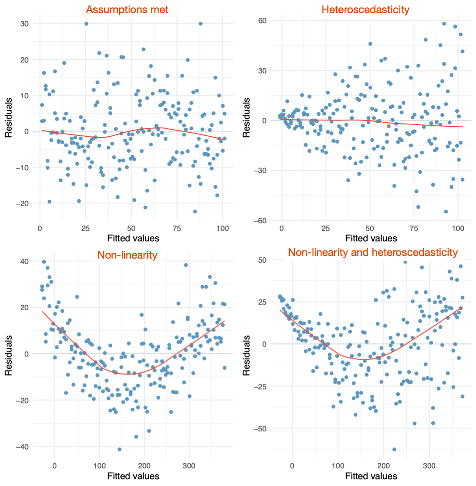

##  Residuals vs. Predicted values


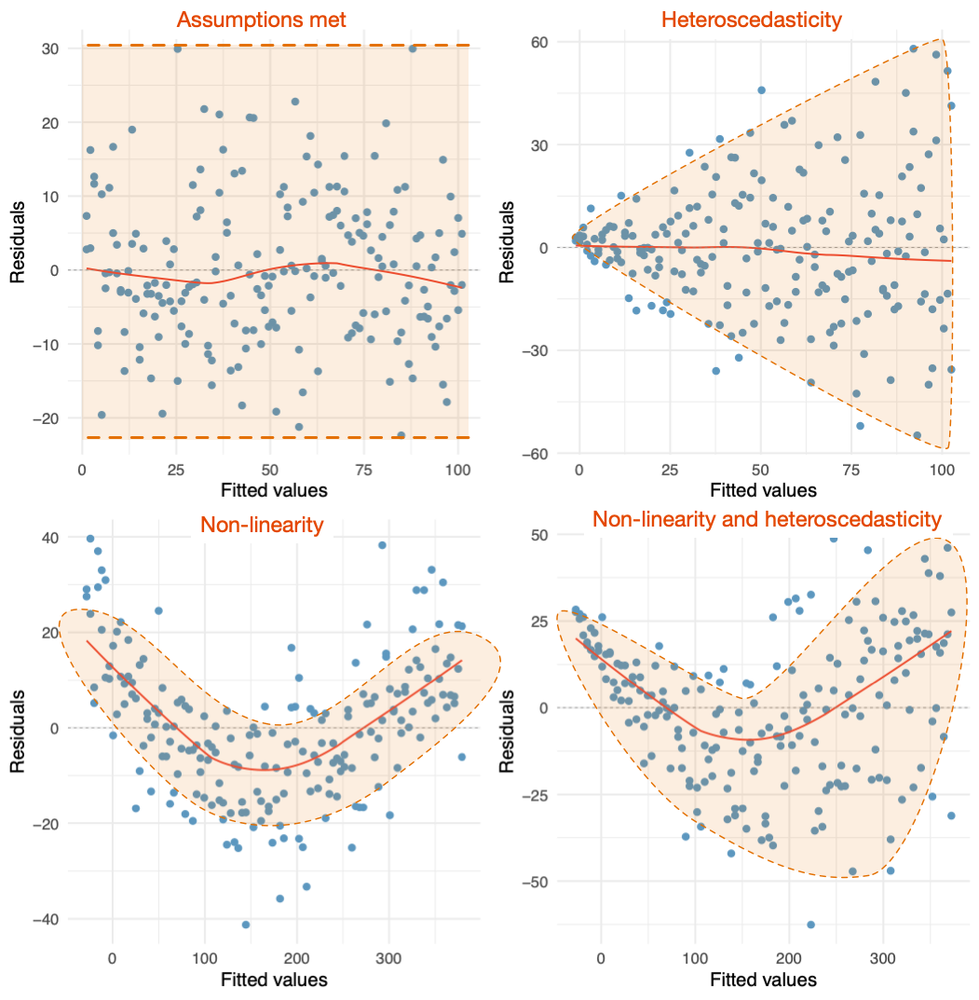


```{r}
#| eval: false


# Create images
hom_con_lm <- lm(royalty ~ dragons, data = hom_tib)
hom_con_plot <- ggplot2::autoplot(hom_con_lm, which = 1,
                  colour = "#5c97bf",
                  alpha = 0.5,
                  size = 2) + theme_minimal()
ggsave(hom_con_plot, file = "media/hom_con_plot.png", width = 7, height = 5, unit = "in")


hom_con_poly <- hom_con_plot + 
  geom_polygon(data = data.frame(x = c(3.75, 5, 5, 3.75), y = c(-2, -2, 2, 2)), aes(x = x, y = y), fill = mulberry, colour = mulberry, alpha = 0.2) 
  
ggsave(hom_con_poly, file = "media/hom_con_plot_layer.png", width = 7, height = 5, unit = "in")


het_con_lm <- lm(royalty ~ dragons, data = hov_cont_tib)
het_con_plot <- ggplot2::autoplot(het_con_lm, which = 1,
                  colour = "#5c97bf",
                  alpha = 0.5,
                  size = 2) + theme_minimal()
ggsave(het_con_plot, file = "media/het_con_plot.png", width = 7, height = 5, unit = "in")

het_con_poly <- het_con_plot + 
  geom_polygon(data = data.frame(x = c(4, 5, 5, 4), y = c(-1.25, -5, 4, 0)), aes(x = x, y = y), fill = mulberry, colour = mulberry, alpha = 0.2) 
  
ggsave(het_con_poly, file = "media/het_con_plot_layer.png", width = 7, height = 5, unit = "in")

hom_cat_lm <- lm(royalty ~ drag_gp, data = hom_tib)
hom_cat_plot <- ggplot2::autoplot(hom_cat_lm, which = 1,
                  colour = "#5c97bf",
                  alpha = 0.5,
                  size = 2) + theme_minimal()
ggsave(hom_cat_plot, file = "media/hom_cat_plot.png", width = 7, height = 5, unit = "in")


nd_mean <- subset(hom_tib, drag_gp == "No dragons")$royalty |> mean()
d_mean <-  subset(hom_tib, drag_gp == "Dragons")$royalty |> mean() 

hom_cat_layer <- hom_cat_plot + 
  annotate("segment", x = nd_mean + 0.05, xend = nd_mean + 0.05, y = -3, yend = 2, colour = mulberry, arrow = arrow(length = unit(0.03, "npc"), end = "both"), lineend = 'round', linejoin = 'round') +
  annotate("segment", x = d_mean - 0.05, xend = d_mean - 0.05, y = -2.5, yend = 2.5, colour = mulberry, arrow = arrow(length = unit(0.03, "npc"), end = "both"), lineend = 'round', linejoin = 'round')
  
ggsave(hom_cat_layer, file = "media/hom_cat_plot_layer.png", width = 7, height = 5, unit = "in")

het_cat_lm <- lm(royalty ~ dragons, data = hov_cat_tib)
het_cat_plot <- ggplot2::autoplot(het_cat_lm, which = 1,
                  colour = "#5c97bf",
                  alpha = 0.5,
                  size = 2) + theme_minimal()
ggsave(het_cat_plot, file = "media/het_cat_plot.png", width = 7, height = 5, unit = "in")


nd_mean <- subset(hov_cat_tib, dragons == "No dragons")$royalty |> mean()
d_mean <-  subset(hov_cat_tib, dragons == "Dragons")$royalty |> mean() 


het_cat_layer <- het_cat_plot + 
  annotate("segment", x = nd_mean + 0.1, xend = nd_mean + 0.1, y = -4.2, yend = 5.8, colour = mulberry, arrow = arrow(length = unit(0.03, "npc"), end = "both"), lineend = 'round', linejoin = 'round') +
  annotate("segment", x = d_mean - 0.1, xend = d_mean - 0.1, y = -2.5, yend = 3.5, colour = mulberry, arrow = arrow(length = unit(0.03, "npc"), end = "both"), lineend = 'round', linejoin = 'round') 
  
ggsave(het_cat_layer, file = "media/het_cat_plot_layer.png", width = 7, height = 5, unit = "in")
```


##

::: columns
:::{.column width="50%"}
### Homoscedastic

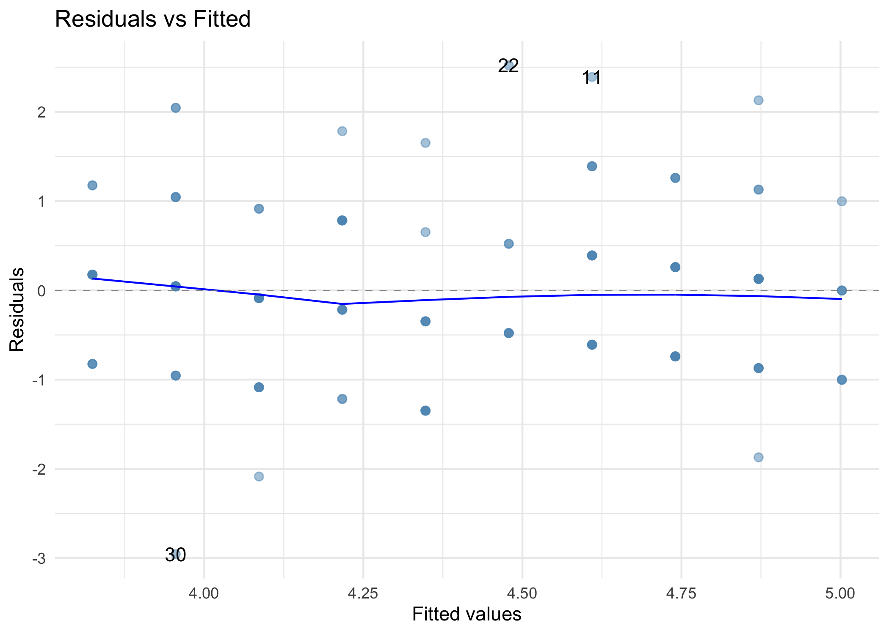{width=450}

:::

:::{.column width="50%"}
:::{.fragment}
### Our data

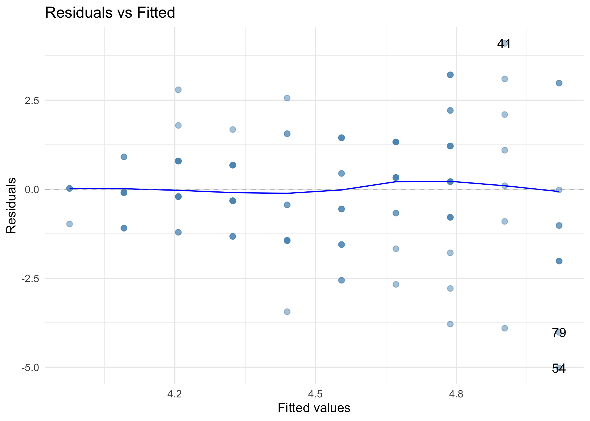{width=450}

:::
:::
:::

##

:::: columns
:::{.column width="50%"}
### Homoscedastic

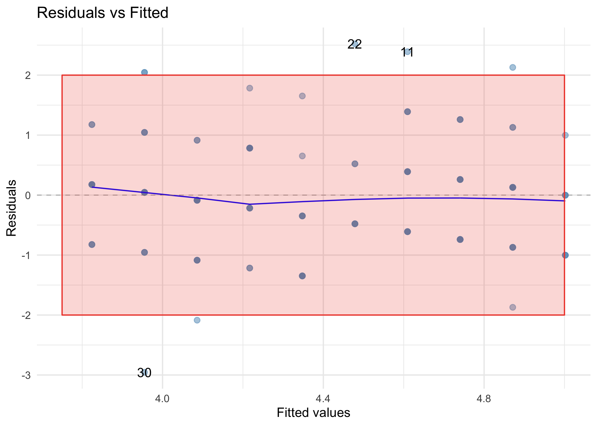{width=450}

:::

:::{.column width="50%"}
### Our data: Heteroscedastic

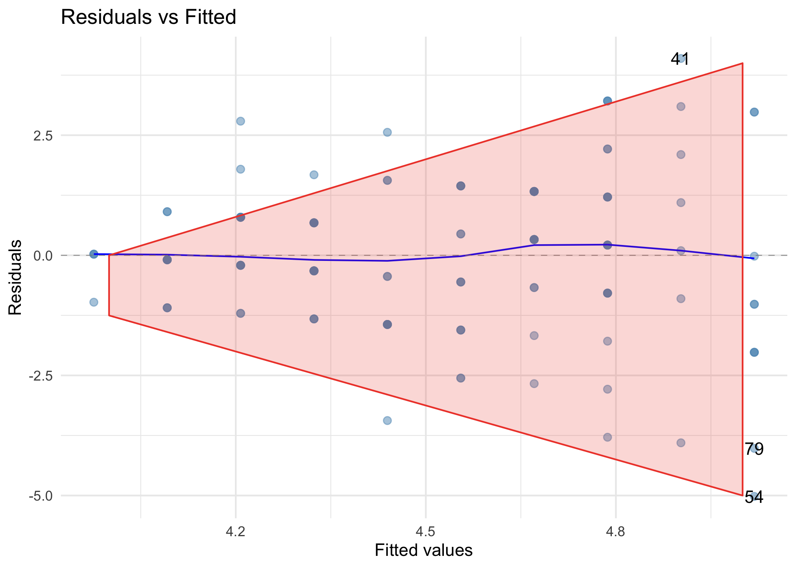{width=450}

:::
::::

##

:::: columns
:::{.column width="50%"}
### Homoscedastic

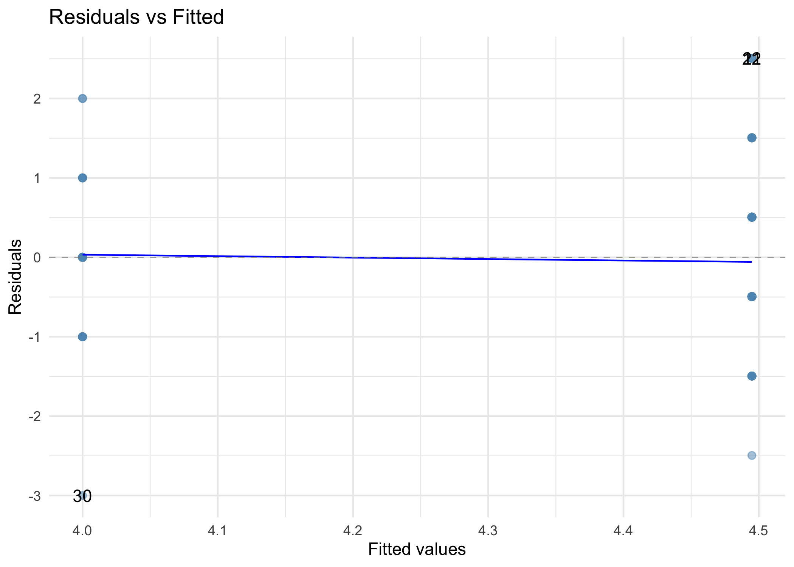

:::

:::{.column width="50%"}
### Our data

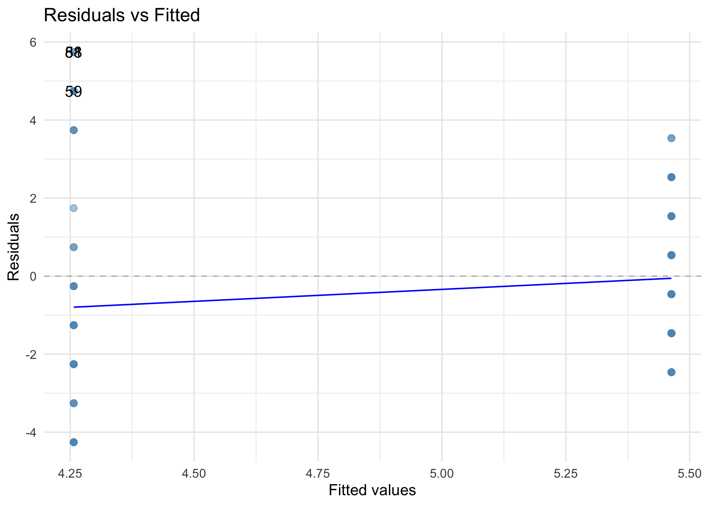

:::
::::

##
:::: columns
:::{.column width="50%"}
### Homoscedastic

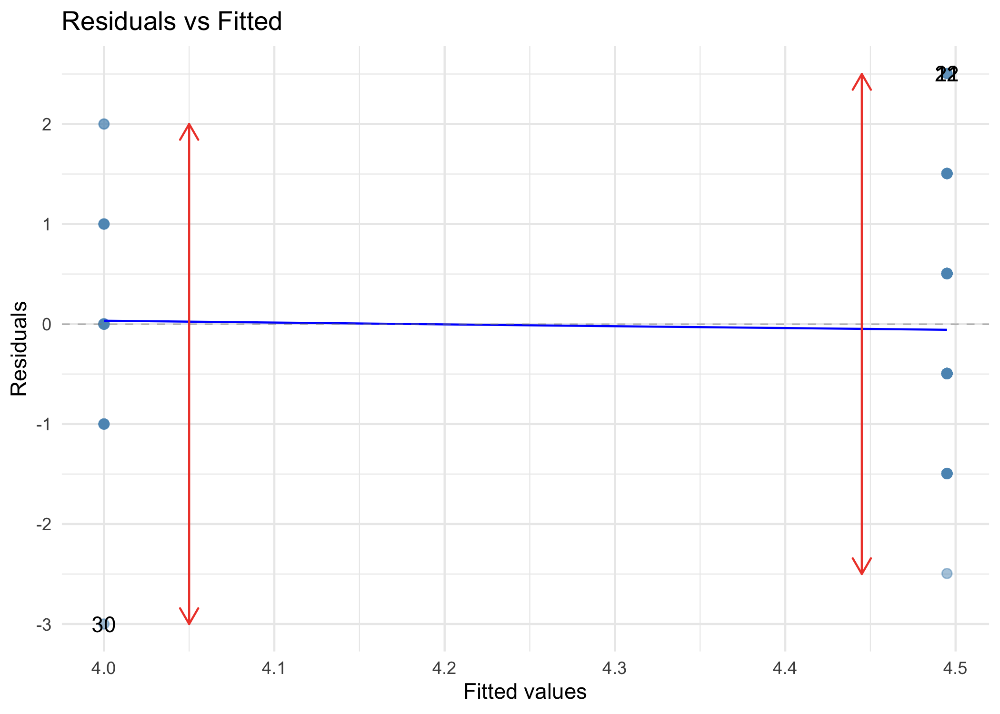
:::

:::{.column width="50%"}
### Our data: Heteroscedastic

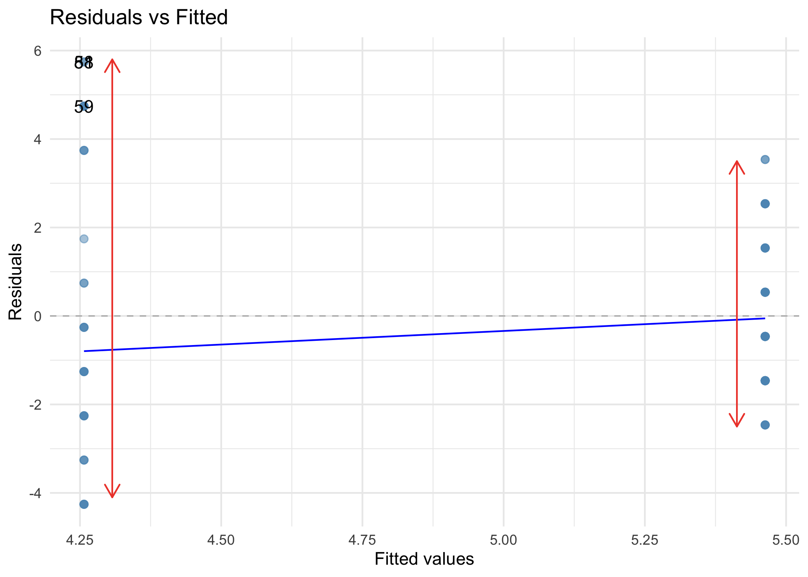
:::
::::

##  {background-video="media/heteroscedasticity_song.mp4" background-size="cover"}


##  Levene's Test 

::: {.callout-warning icon = false}
##  The danger zone!

- You might hear about it but **don’t use it**: think about what we know about sample sizes and significance.
- For the avoidance of doubt, **don’t use it**.
- One more time ... **don’t use it**
:::


##  {background-video="media/shocked_baby_levene.mp4" background-size="cover"}


##  {background-video="media/zach_dragon_hunt_caption.mp4" background-size="cover"}

##  {background-video="media/dragon_chase_2.mp4" background-size="cover"}


#  Part 3: Normality and does dragons poo kill crops?

> "Coz their dung doesn't help our crops to grow"
>
> *Sir Knight Zach, Defender of the world of Military*


## Is dung associated with crop yield?

:::{.center-h}
:::{.txt_mulberry}
$$\hat{\text{yield}}_i = 14.34 + 2.02\text{poop}_{i}$$
:::

```{r}
dung_lm <- lm(yield ~ poop, data = poop_tib)
dung_est <- broom::tidy(dung_lm, conf.int = T)


knitr::kable(dung_est, digits = 2) |> 
  style_my_kable(nrows = nrow(dung_est))
```

:::

\

::: fragment
```{r}
#| echo: false
#| fig-width: 6
#| fig-height: 3.5
#| fig-align: center


ggplot2::ggplot(poop_tib, aes(poop, yield)) +
  geom_point(colour = mulberry, size = 3, alpha = 0.8) +
  geom_smooth(method = "lm", se = FALSE, colour = blue) +
  labs(x = "Dragon poop", y = "Crop yield (%)") +
  coord_cartesian(ylim = c(0, 100)) +
  scale_y_continuous(breaks = seq(0, 100, 10)) +
  scale_x_continuous(breaks = seq(0, 10, 1)) +
  theme_minimal()
```

:::

::: notes
It seems like the amount of poop doesn't sig. affect crop yield.
:::

## Normally distributed errors 

::: {.callout-warning icon = false}
##  The danger zone!

People usually (falsely) think the data or population need to be normally distributed.
:::

:::{.center-h}
```{r}
#| fig-width: 8
#| fig-height: 4.5

dist <- data.frame(norm = rnorm(30000, 0, 1))

hist<-ggplot(dist, aes(norm)) 
hist +
  geom_histogram(colour = blue, fill = blue, alpha = 0.5) +
  stat_function(fun = function(x, mean, sd, n){(n/4)*dnorm(x = x, mean = mean, sd = sd)}, args = with(dist, c(mean = mean(norm), sd = sd(norm), n = length(norm))), colour = mulberry, size = 1) +
  labs(x = "Score", y = "Frequency") +
  scale_x_continuous(breaks = seq(-4, 4, 1)) +
  theme_minimal()
```
:::

## Normally distributed errors 

::: fragment
### Estimation 

- Normal errors don't really matter
- When errors are not normally distributed, *b* will be unbiased and optimal (i.e., will minimize the variance), but there may be classes of estimator (other than OLS) that are more accurate (Wilcox, 2010)
:::
::: fragment
### Confidence intervals and significance tests

- When residuals are normal
  - It can be shown that the *b*s have a normal sampling distribution.
  - Test statistics of *b*s (usually testing the null of *b* = 0) follow a *t*-distribution.
- If they are not normal then
  - We can't base confidence intervals on the properties of the normal distribution.
  - We don't know what distribution tests statistics have.

:::

## The Central Limit Theorem (CLT) 

:::{.center-h}
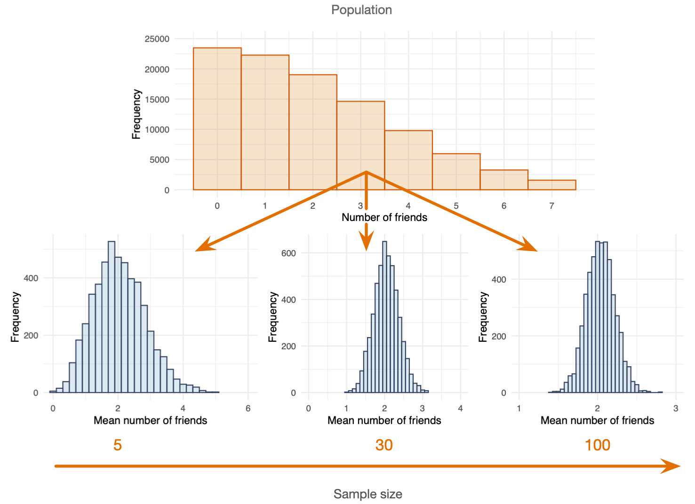{width=75%}
:::

## Exploring normality of model errors


- Check the distribution of the model residuals using a P-P/Q-Q plot

### Large samples

- You don't need to worry about this assumption in large samples because of the CLT

### Small samples

- Use a **bootstrap** to get an empirical confidence interval and standard error (more on this later ...)

## The K-S Test 

::: {.callout-warning icon = false}
##  The danger zone!

- You might hear about it but **don’t use it**: think about what we know about sample sizes and significance.
- For the avoidance of doubt, **don’t use it**.
- One more time ... **don’t use it**

:::


##  {background-video="media/shocked_cat_ks.mp4" background-size="cover"}


##

```{r}
#| eval: false

# Create images

poop_lm <- lm(yield ~ poop, data = poop_tib)
poop_plot <- ggplot2::autoplot(poop_lm, which = 2,
                  colour = "#5c97bf",
                  alpha = 0.5,
                  size = 2) + theme_minimal()

ggsave(poop_plot, file = "media/poop_qq_plot.png", width = 7, height = 5, unit = "in")

poop_norm_lm <- lm(yield ~ poop, data = poop_norm_tib)
poop_norm_plot <- ggplot2::autoplot(poop_norm_lm, which = 2,
                  colour = "#5c97bf",
                  alpha = 0.5,
                  size = 2) + theme_minimal()

ggsave(poop_norm_plot, file = "media/poop_norm_qq_plot.png", width = 7, height = 5, unit = "in")
```


::: columns
:::{.column width="50%"}
### Normal residuals
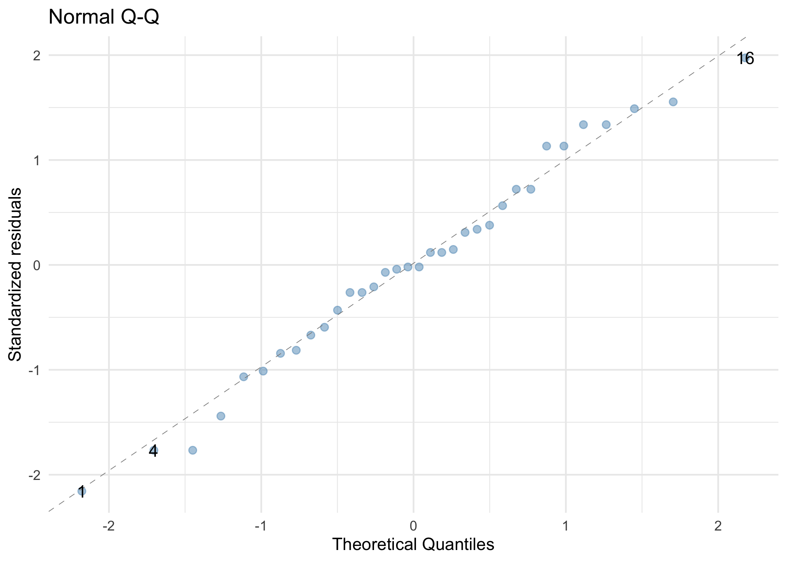
:::

:::{.column width="50%"}
::: fragment
### Our residuals: Non-normal

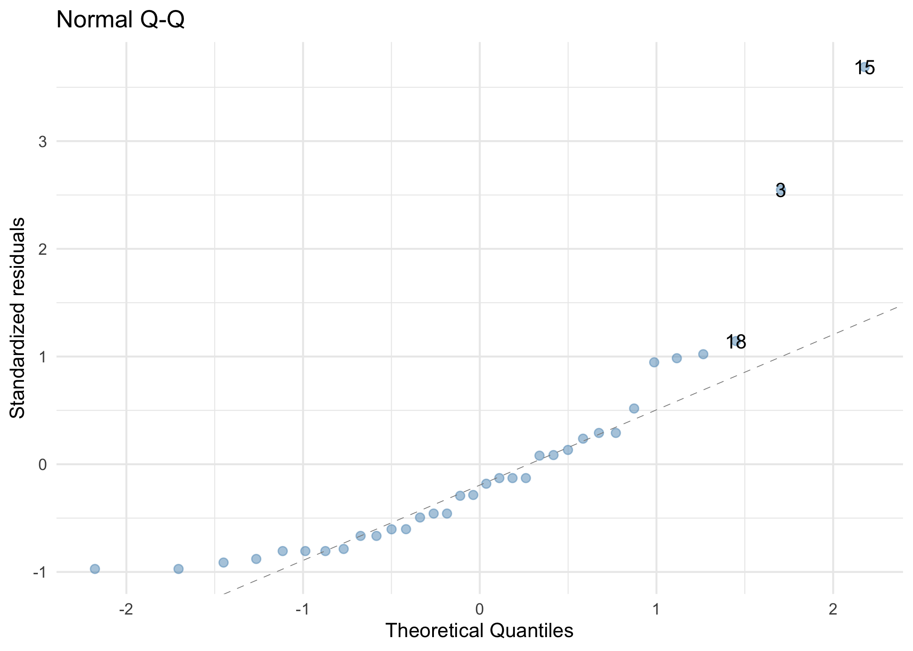
:::
:::
:::


::: notes
S-shape = heavy tails
Curve above line = left skew
Curve below loine = right skew (which is what we have here, see earlier histogram)
:::

##  {background-video="media/normality_song.mp4" background-size="cover"}

##  {background-video="media/normality_song_instrumental.mp4" background-size="cover"}

#  Part 4: Correcting problems

## Robust procedures


{fig-align="center" height=600}


## Robust procedures

### The bootstrap

- Standard errors are derived empirically using a resampling technique
- Results in robust confidence intervals and *p*-values
- Designed for small samples (when normality matters)

::: fragment
### Heteroskedasticity-consistent standard errors

- Use a sandwich estimator
- HC3 and HC4 methods work best

:::

##  {background-video="media/bootstrap_hippo.mp4" background-size="cover"}

## The Bootstrap 

```{r}
poop_tib |> 
  dplyr::select(yield) |> 
  dplyr::arrange(yield) |> 
  t() |> 
  knitr::kable() |> 
  kableExtra::row_spec(1, color = "#447E41", font_size = 12)
```

:::{.center-h}
Mean = `r round(mean(poop_tib$yield), 2)`
:::

::: fragment
Bootstrap sample 1:

```{r}
boot_size = nrow(poop_tib)

boot <- poop_tib |> 
  dplyr::sample_n(size = boot_size, replace = TRUE)

boot |> 
  dplyr::select(yield) |> 
  dplyr::arrange(yield) |> 
  t() |> 
  knitr::kable() |> 
  kableExtra::row_spec(1, color = "#447E41", font_size = 12)
```

:::{.center-h}
Mean = `r round(mean(boot$yield), 2)`
:::
:::


::: fragment
Bootstrap sample 2:

```{r}

boot <- poop_tib |> 
  dplyr::sample_n(size = boot_size, replace = TRUE)

boot |> 
  dplyr::select(yield) |> 
  dplyr::arrange(yield) |> 
  t() |> 
  knitr::kable() |> 
  kableExtra::row_spec(1, color = "#447E41", font_size = 12)
```

:::{.center-h}
Mean = `r round(mean(boot$yield), 2)`
:::
:::

##


```{r}
poop_tib |> 
  dplyr::select(yield) |> 
  dplyr::arrange(yield) |> 
  t() |> 
  knitr::kable() |> 
  kableExtra::row_spec(1, color = "#447E41", font_size = 12)
```

:::{.center-h}
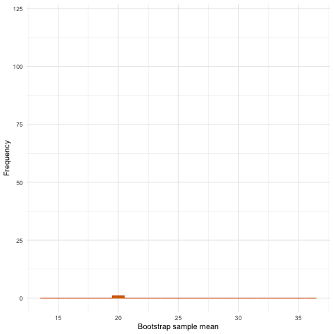
:::

##


```{r}
poop_tib |> 
  dplyr::select(yield) |> 
  dplyr::arrange(yield) |> 
  t() |> 
  knitr::kable() |> 
  kableExtra::row_spec(1, color = "#447E41", font_size = 12)
```


:::{.center-h}
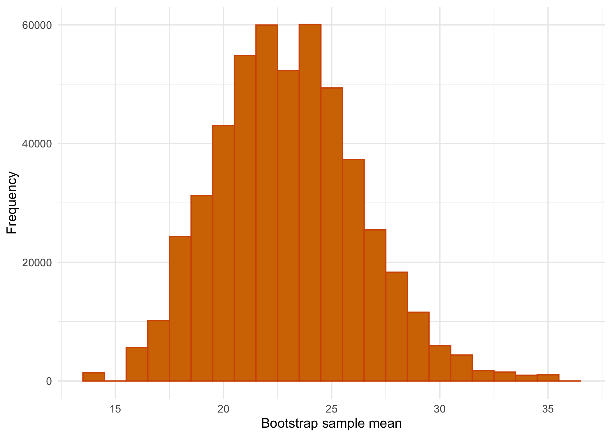{height=550}
:::

::: notes
next slide - video of dragon chase.
:::

##  {background-video="media/zach_chops_arlos_tail.mp4" background-size="cover"}

::: notes
Oh deary me, I must hurry up ....
:::

## Do dragons really kidnap royalty?
### Normal model (number of dragons)

```{r}
#| echo: true
#| eval: true

kidnap_lm <- lm(royalty ~ dragons,data = hov_cont_tib)
model_parameters(kidnap_lm) |> 
  display()
```


\

::: fragment
### Robust model (number of dragons) HC4 Standard errors

```{r}
#| echo: true
#| eval: true

kidnap_lm <- lm(royalty ~ dragons, data = hov_cont_tib)
model_parameters(kidnap_lm, vcov = "HC4") |> 
  display()
```

:::

::: notes
When we fit a robust model there's no sig relationship between the number of dragons and how many royalty are kidnapped. (Note the (small) b doesn't change - only the p and CIs)
:::

## Do dragons really kidnap royalty?

### Normal model (dragons or not)

```{r}
#| echo: true
#| eval: true

kidnap_gp_lm <- lm(royalty ~ dragons, data = hov_cat_tib)
model_parameters(kidnap_gp_lm) |> 
  display()
```


\

::: fragment
### Robust model (dragons or not) HC4 standard errors

```{r}
#| echo: true

kidnap_gp_lm <- lm(royalty ~ dragons, data = hov_cat_tib)
model_parameters(kidnap_gp_lm, vcov = "HC4") |> 
  display()
```

:::

::: notes
When we fit a robust model there's no sig relationship between the number of dragons and how many royalty 
are kidnapped. (Note the (small) *b* doesn't change - only the *p* and CIs)
:::

##  Does dragon poo help crops to grow?
### Normal model


```{r}
#| echo: true
#| eval: true

poop_lm <- lm(yield ~ poop, data = poop_tib)
model_parameters(poop_lm) |> 
  display()
```


::: fragment
### Bootstrap model

```{r}
#| echo: true
#| eval: false

poop_lm <- lm(yield ~ poop, data = poop_tib)
model_parameters(poop_lm, bootstrap = TRUE) |> 
  display()
```

```{r}
set.seed(6789)
poop_boot_est <- lm(yield ~ poop, data = poop_tib) |> 
  model_parameters(bootstrap = TRUE, iterations = 1000)

display(poop_boot_est)
```

:::

::: notes
When we fit a robust model there is a sig relationship between the quantity of dragon poop and the yield of crops. (Note a 2% increase in yield per extra dragon, so with only 5 additional dragons Yield will improve by 10%)
:::

##  {background-video="media/arlo_have_you_saved_the_dragons_yet_2_caption.mp4" background-size="cover"}

::: notes
I think I might just have ...
:::

##  {background-video="media/zach_not_allowed_to_kill_dragons_caption.mp4" background-size="cover"}

::: notes
No, no more dragon slaying because I'm afraid you've been misled. When you remove the ogres, there's no significant association between the presence of dragons and sheep being eaten. Also, when you fit robust models there's no significant association between the presence of dragons and royalty going missing, but dragon poo does significantly improve crop yield. Your rulers have been feeding you, well ... lies ...

CLICK VIDEO
:::

##  {background-video="media/zach_what_can_i_kill_caption.mp4" background-size="cover"}

::: notes
Maybe the rulers statisticians? But really, it's not nice to kill anyone, so maybe we should all have a nice cup of tea ...
CLICK VIDEO
:::

##  {background-video="media/zach_kill_you_caption.mp4" background-size="cover"}

::: notes
CLICK VIDEO and run screaming from lecture theatre
:::

