# Mediation

Professor Andy Field, University of Sussex

Links: [alestorm kheelhaulled clip](https://profandyfield.github.io/statistics_lectures/ds_05_mediation/media/alestorm_kheelhaulled_clip.mp3) \| [bsky.app](https://bsky.app/profile/profandyfield.bsky.social) \| [youtube.com](https://www.youtube.com/user/ProfAndyField) \| [discoveringstatistics.com](https://www.discoveringstatistics.com) \| [discovr.rocks](https://www.discovr.rocks) \| [statisticsadventure.com](https://www.statisticsadventure.com)

## About this version

This is a plain-text version of the lecture slides. Each slide starts with a heading such as “Slide 5”, and the numbers match the slide numbers shown in the lecture. Content that appeared one piece at a time, in columns or in tabs is shown in reading order. Videos and interactive apps are given as links.

## Slide 2

Video clip: [pirate scene r1 small](https://profandyfield.github.io/statistics_lectures/ds_05_mediation/media/pirate_scene_r1_small.mp4)

## Slide 3

Video clip: [pirate scene r2 small](https://profandyfield.github.io/statistics_lectures/ds_05_mediation/media/pirate_scene_r2_small.mp4)

## Slide 4

Video clip: [pirate scene 1 1 small](https://profandyfield.github.io/statistics_lectures/ds_05_mediation/media/pirate_scene_1_1_small.mp4)

## Slide 5

Video clip: [pirate academy small](https://profandyfield.github.io/statistics_lectures/ds_05_mediation/media/pirate_academy_small.mp4)

## Slide 6

Video clip: [pirate scene 1 2 small](https://profandyfield.github.io/statistics_lectures/ds_05_mediation/media/pirate_scene_1_2_small.mp4)

## Slide 7


## Slide 8


## Slide 9: Does AI-use reduce critical thinking?1

- 669 participants (666 considered ‘valid’ 😈)
- Measures
  - AI-tool usage (`ai`)
  - Cognitive offloading (`cog_off`): externalisation of cognitive processes, often involving tools or external agents, such as notes, calculators, or digital tools like AI, to reduce cognitive load.
  - Critical thinking (`crit_think`): the capacity to think clearly and rationally, understand logical connections between ideas, evaluate arguments, and identify inconsistencies in reasoning

> **Caution: Think about it!**
>
> Hypotheses
>
> - H<sub>1</sub>: Higher AI tool usage is associated with reduced critical thinking skills.
> - H<sub>2</sub>: Cognitive offloading mediates the relationship between AI tool usage and critical thinking skills.

*Footnotes*

1.  Gerlich, M. (2025). AI tools in society: Impacts on cognitive offloading and the future of critical thinking. *Societies*, 15(1): 6. [doi.org/10.3390/soc15010006](https://doi.org/10.3390/soc15010006).

## Slide 10: Measures

- AI-tool usage
  - 5 items (1 = not at all/strongly disagree, 6 = always/strongly agree)
  - *How often do you use AI tools*
  - *To what extent do you rely on AI tools for decision-making?*
  - *I often cross-check information provided by AI tools with other sources*
- Cognitive offloading
  - 5 items (1 = not at all/strongly disagree/unlikely, 6 = always/strongly agree)
  - *How often do you use search engines like Google to find information quickly?*
  - *When faced with a problem or question, how likely are you to search for the answer online rather than trying to figure it out yourself?*
- Critical thinking
  - 8 items (1 = not at all/strongly disagree, 6 = always/strongly agree)
  - *How often do you critically evaluate the sources of information you encounter?*
  - *I question the assumptions underlying the information provided by AI tools*

## Slide 11: Mediation: the conceptual model

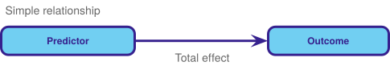

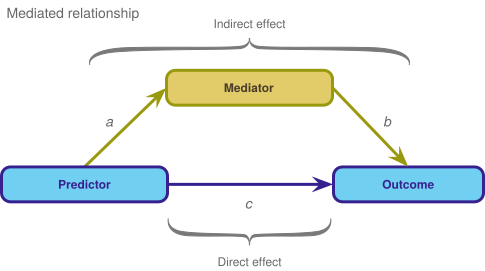

## Slide 12: Key points

> Mediation is when the relationship between a predictor and outcome can be explained by their relationship to a third variable.


- The **total effect** between a predictor and outcome can be broken down into:
  - The **direct effect**, which is the relationship between the predictor and outcome **adjusting for** the mediator (path *c*)
  - The **indirect effect**, which is the relationship between the predictor and outcome **via** for the mediator (path *ab*)
- The **indirect effect quantifies mediation**

``` math
 \begin{aligned} \text{Total effect} &= \text{Direct effect} + \text{Indirect effect} \\ \text{Total effect} &= c + (a \times b) \end{aligned} 
```

## Slide 13: Mediation in practice

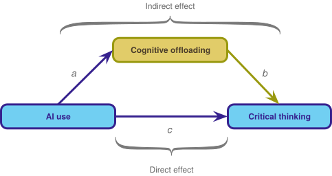

``` math
 \begin{aligned} \text{Total effect} &= \text{Direct effect} + \text{Indirect effect} \\ \text{Total effect} &= c + (a \times b) \end{aligned} 
```

## Slide 14: Load and Look


| ID  | ai  | cog_off | crit_think |
|-----|-----|---------|------------|
| 1   | 7   | 8       | 33         |
| 2   | 11  | 12      | 24         |
| 3   | 22  | 18      | 22         |
| 4   | 21  | 21      | 23         |
| 5   | 3   | 5       | 29         |
| 6   | 16  | 16      | 19         |
| 7   | 15  | 13      | 19         |
| 8   | 7   | 10      | 15         |
| 9   | 15  | 15      | 18         |
| 10  | 18  | 15      | 18         |
| 11  | 9   | 8       | 27         |
| 12  | 9   | 7       | 28         |
| 13  | 18  | 17      | 17         |
| 14  | 12  | 11      | 15         |
| 15  | 17  | 13      | 11         |
| 16  | 20  | 18      | 16         |
| 17  | 6   | 7       | 22         |
| 18  | 12  | 14      | 9          |
| 19  | 10  | 10      | 23         |
| 20  | 16  | 11      | 20         |
| 21  | 13  | 13      | 12         |
| 22  | 9   | 12      | 15         |
| 23  | 21  | 17      | 22         |
| 24  | 17  | 14      | 19         |
| 25  | 11  | 11      | 17         |
| 26  | 1   | 4       | 23         |
| 27  | 5   | 7       | 23         |
| 28  | 13  | 10      | 13         |
| 29  | 20  | 13      | 13         |
| 30  | 12  | 10      | 18         |
| 31  | 16  | 14      | 19         |
| 32  | 13  | 11      | 24         |
| 33  | 8   | 9       | 25         |
| 34  | 13  | 16      | 18         |
| 35  | 17  | 14      | 13         |
| 36  | 8   | 10      | 27         |
| 37  | 5   | 9       | 23         |
| 38  | 13  | 11      | 21         |
| 39  | 7   | 9       | 20         |
| 40  | 9   | 9       | 18         |
| 41  | 16  | 16      | 18         |
| 42  | 22  | 19      | 20         |
| 43  | 20  | 21      | 11         |
| 44  | 13  | 12      | 22         |
| 45  | 9   | 12      | 28         |
| 46  | 5   | 9       | 22         |
| 47  | 22  | 18      | 15         |
| 48  | 8   | 7       | 23         |
| 49  | 15  | 15      | 14         |
| 50  | 14  | 15      | 17         |

Table 1: Data simulated to match Gerlich (2025) (first 50 of 666 rows)

``` r
describe_distribution(gerlich_tib) |> display()
```

| Variable   | Mean  | SD   | IQR  | Range         | Skewness | Kurtosis | n   | n_Missing |
|------------|-------|------|------|---------------|----------|----------|-----|-----------|
| ai         | 13.28 | 4.62 | 6.25 | (0.00, 25.00) | -0.04    | -0.23    | 666 | 0         |
| cog_off    | 12.61 | 3.97 | 5.00 | (0.00, 25.00) | -0.07    | 0.02     | 666 | 0         |
| crit_think | 20.42 | 4.93 | 7.00 | (0.00, 35.00) | -0.11    | 0.31     | 666 | 0         |

## Slide 15: Visualize

``` r
ggscatmat(data = gerlich_tib, alpha = 0.5) + theme_minimal()
```

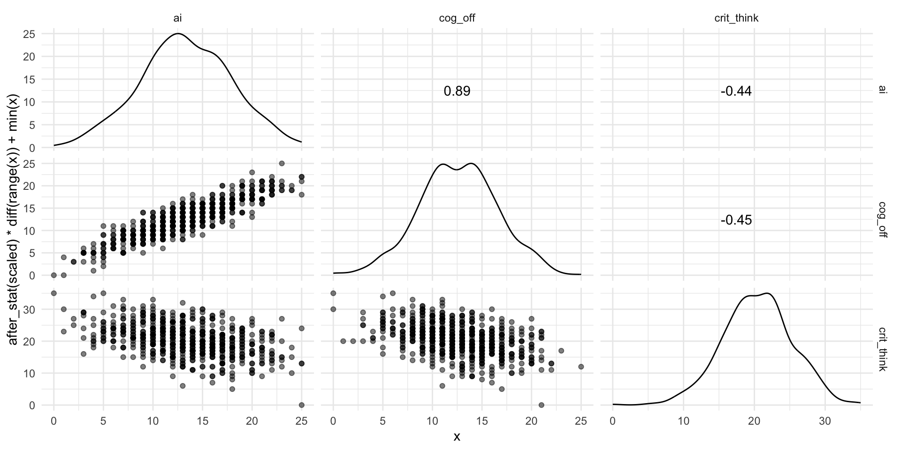


## Slide 16: How do we specify the model?

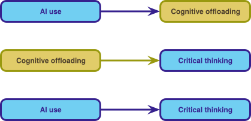

``` math
 \begin{aligned} \widehat{\text{Cognitive offloading}}_i &= \hat{a}\times \text{AI Use}_i \\ \\ \widehat{\text{Critical thinking}}_i &= \hat{b}\times \text{Cognitive offloading}_i \\ \\ \widehat{\text{Critical thinking}}_i &= \hat{c}\times \text{AI Use}_i \end{aligned} 
```

> **Caution: Think about it!**
>
> Can we fit a series of regular linear models?
>
> - Each relationship is treated as independent
>   - We want to adjust the relationship between AI use and critical thinking for cognitive offloading
>   - How?

## Slide 17: How do we specify the model?

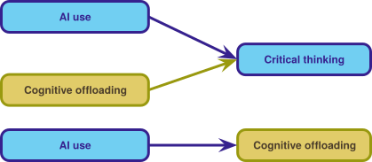

``` math
 \begin{aligned} \\ \\ \widehat{\text{Critical thinking}}_i &= \hat{c}\text{AI Use}_i +\hat{b}\text{Cognitive offloading}_i \\ \\ \\ \widehat{\text{Cognitive offloading}}_i &= \hat{a}\text{AI Use}_i \\ \end{aligned} 
```

> **Caution: Think about it!**
>
> Can we fit a series of regular linear models?
>
> - This gets us closer, because these models adjust the relationship between AI use and critical thinking for cognitive offloading, but …
> - … the relationships between between AI use, cognitive offloading and critical thinking are treated as independent from the relationship between AI use and cognitive offloading
> - The solution is to fit these models *simultaneously* using **Structural Equation Modelling (SEM)**

## Slide 18: Path analysis

``` r
gerlich_mod <- 'crit_think ~ c*ai + b*cog_off
                cog_off ~ a*ai
       
                indirect_effect := a*b
                total_effect := c + (a*b)
                '
```

``` math
 \begin{aligned} \widehat{\text{Critical thinking}}_i &= \hat{c}\text{AI Use}_i +\hat{b}\text{Cognitive offloading}_i \\ \widehat{\text{Cognitive offloading}}_i &= \hat{a}\text{AI Use}_i \\ \\ \text{Total effect} &= \text{Direct effect} + \text{Indirect effect} \\ \text{Total effect} &= c + (a \times b) \end{aligned} 
```

## Slide 19: Fitting the model

``` r
gerlich_mod <- 'crit_think ~ c*ai + b*cog_off
                cog_off ~ a*ai
       
                indirect_effect := a*b
                total_effect := c + (a*b)
                '

gerlich_fit <- lavaan::sem(model = gerlich_mod,
                           data = gerlich_tib,
                           missing = "FIML",
                           estimator = "MLR")
```

## Slide 20: Evaluate

> **Note: Statis-tip**
>
> - As with other models, we can use `model_performance()` to get fit statistics, but these will always show perfect fit (we are fitting what’s known as a **saturated model**).
> - We cannot use `check_model()` to get diagnostic plots.
> - By using `estimator = "MLR"` we have fitted a robust model.


## Slide 21: Interpret parameter estimates, CIs and tests

``` r
model_parameters(gerlich_fit) |> 
  display()
```

| Link | Coefficient | SE | 95% CI | z | p | Label | Component |
|----|----|----|----|----|----|----|----|
| crit_think ~ ai | -0.22 | 0.08 | \[-0.38, -0.05\] | -2.59 | 0.010 | c | Regression |
| crit_think ~ cog_off | -0.33 | 0.09 | \[-0.51, -0.15\] | -3.52 | \< .001 | b | Regression |
| cog_off ~ ai | 0.76 | 0.02 | \[ 0.73, 0.79\] | 50.54 | \< .001 | a | Regression |

| Link | Coefficient | SE | 95% CI | z | p | Label | Component |
|----|----|----|----|----|----|----|----|
| indirect_effect := a\*b | -0.25 | 0.07 | \[-0.39, -0.11\] | -3.52 | \< .001 | indirect_effect | Defined |
| total_effect := c+(a\*b) | -0.47 | 0.04 | \[-0.54, -0.39\] | -12.16 | \< .001 | total_effect | Defined |


## Slide 22: The fitted model


## Slide 23: Standardized parameter estimates

``` r
model_parameters(gerlich_fit, standardize = TRUE) |> 
  display()
```

| Link | Coefficient | SE | 95% CI | z | p | Label | Component |
|----|----|----|----|----|----|----|----|
| crit_think ~ ai | -0.20 | 0.08 | \[-0.35, -0.05\] | -2.63 | 0.008 | c | Regression |
| crit_think ~ cog_off | -0.27 | 0.08 | \[-0.41, -0.12\] | -3.52 | \< .001 | b | Regression |
| cog_off ~ ai | 0.89 | 6.25e-03 | \[ 0.88, 0.90\] | 142.56 | \< .001 | a | Regression |

| Link | Coefficient | SE | 95% CI | z | p | Label | Component |
|----|----|----|----|----|----|----|----|
| indirect_effect := a\*b | -0.24 | 0.07 | \[-0.37, -0.10\] | -3.52 | \< .001 | indirect_effect | Defined |
| total_effect := c+(a\*b) | -0.44 | 0.03 | \[-0.50, -0.38\] | -14.74 | \< .001 | total_effect | Defined |


## Slide 24: The fitted model

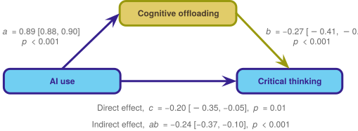

## Slide 25: The squid of despair

> Do AI use and cognitive offloading **cause** lower critical thinking?

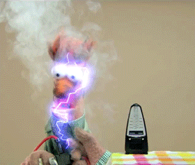

> **Warning: The danger zone!**
>
> - **NO!!!** You cannot infer causality from these model

## Slide 26

Video clip: [pirate scene entry small](https://profandyfield.github.io/statistics_lectures/ds_05_mediation/media/pirate_scene_entry_small.mp4)

## Slide 27

Video clip: [pirate scene 2 1 small](https://profandyfield.github.io/statistics_lectures/ds_05_mediation/media/pirate_scene_2_1_small.mp4)

## Slide 28

Video clip: [pirate scene 2 2 small](https://profandyfield.github.io/statistics_lectures/ds_05_mediation/media/pirate_scene_2_2_small.mp4)

## Slide 29: The theory of planned behaviour1

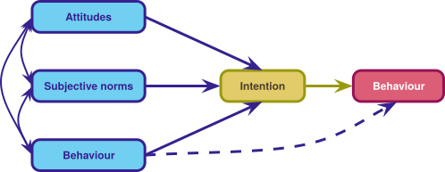

*Footnotes*

1.  Ajzen, I. (1985). From intentions to actions: A theory of planned behavior. In J. Kuhl & J. Beckmann (Eds.), *Action control: From cognition to behavior*. Berlin, Heidelber, New York: Springer-Verlag. (pp. 11–39).

## Slide 30: The theory of planned behaviour and AI1

- 610 participants
- AI-tool usage (`ai_use`)
  - 1 item (high score = cheated more often)
  - *“How often have you used artificial intelligence like ChatGPT without indicating (i.e., not specifying that you used artificial intelligence) in the last 12 months for your seminar papers?”* (never to \> 5)
- Subjective norm (`norms`):
  - 3 items (high score = fine to cheat)
  - *Most people who are important to me would look down on me if I used artificial intelligence without indicating it in a seminar paper* (likely-unlikely)
- Intention to use AI (`intention`)
  - 5 items (high score = greater intention)
  - *Even if I had a good reason, I couldn’t bring myself to use artificial intelligence in a seminar paper without indicating it (likely–unlikely)*

*Footnotes*

1.  Greitemeyer, T., & Kastenmüller, A. (2024). A longitudinal analysis of the willingness to use chatGPT for academic cheating: Applying the theory of planned behavior. *Technology, Mind, and Behavior*, 5(2), 1–8. <https://doi.org/10.1037/tmb0000133>

## Slide 31: Hypotheses

> What can we predict from the theory of planned behaviour?

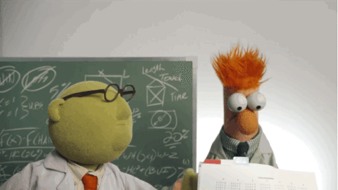

> **Caution: Think about it!**
>
> Hypotheses
>
> - H<sub>1</sub>: Higher subjective norms are associated with greater AI usage (without declaring it).
> - H<sub>2</sub>: Intention to use AI mediates the relationship between subjective norms and AI usage.

## Slide 32: Load and Look

|     | id         | norms            | intention | ai_use |
|-----|------------|------------------|-----------|--------|
| 1   | WY6E1KKS18 | 1                | 1.6       | 1      |
| 2   |            | 3.33333333333333 | 6         | 1      |
| 3   | 6ES95AA6LL | 7                | 6         | 1      |
| 4   |            | 2                | 1         | 1      |
| 5   | Q1CXDQEBA8 | 6.33333333333333 | 1.6       | 1      |
| 6   | GETF98ZD1S | 1.66666666666667 | 1.4       | 2      |
| 7   | DXBXC5QS1T | 3.66666666666667 | 2.6       | 1      |
| 8   | GSH7S7SFEL | 4                | 2.4       | 1      |
| 9   | MFW2P2QQ2B | 2.66666666666667 | 4         | 1      |
| 10  | W7HBEH5F7T | 2.66666666666667 | 2.6       | 1      |
| 11  | XL58MNLV3M | 4                | 4         | 1      |
| 12  | 1TB84UMBTV | 3.33333333333333 | 2.6       | 1      |
| 13  | 22ZQGHULE1 | 1.66666666666667 | 3         | 1      |
| 14  | 29BEXD7CN3 | 2                | 1.2       | 1      |
| 15  | 53UUPTLXCQ | 5.33333333333333 | 1.2       | 1      |
| 16  | 5RM9KXLRN2 | 3                | 1.4       | 1      |
| 17  | 5V926M25ZS | 4                | 3.2       | 1      |
| 18  | 6EH5HRG7C2 | 5.33333333333333 | 4.6       | 2      |
| 19  | 7G8QPN4W2T | 6.66666666666667 | 4         | 1      |
| 20  | 7W14361ZB3 | 3.33333333333333 | 2.2       | 1      |
| 21  | 9EFR7MRBV6 | 7                | 3.6       | 7      |
| 22  | 9ELT5KMUFN | 2.66666666666667 | 4.8       | 3      |
| 23  | BC3RK4XG7C | 4.66666666666667 | 2.4       | 1      |
| 24  | DCSPLWEWET | 3.66666666666667 | 3.4       | 1      |
| 25  | FRL6H2CVW3 | 5                | 4.6       | 1      |
| 26  | HH7CHN819P | 2                | 5.2       | 1      |
| 27  | HWBX2YSC6M | 5.66666666666667 | 4         | 7      |
| 28  | KB8FUQS96B | 4.33333333333333 | 2.2       | 1      |
| 29  | KDUPKXZ3M1 | 5.33333333333333 | 7         | 1      |
| 30  | L487SEYYGD | 4.66666666666667 | 5.2       | 1      |
| 31  | LZ54U4PDWD | 5                | 5         | 2      |
| 32  | M2FRA5ZAXV | 4.66666666666667 | 2.4       | 1      |
| 33  | M6XBZ83XQV | 4.33333333333333 | 6.4       | 3      |
| 34  | SDT8KUHYUZ | 2                | 1.2       | 1      |
| 35  | UWD7TADXDT | 4.33333333333333 | 4.2       | 2      |
| 36  | XEZ8TYZBF9 | 4.66666666666667 | 2.8       | 1      |
| 37  |            | 6.33333333333333 | 3.8       | 1      |
| 38  |            | 2.33333333333333 | 1         | 1      |
| 39  |            | 4.66666666666667 | 2.2       | 1      |
| 40  | 3E6L7SE2ZQ | 2.66666666666667 | 1.2       | 1      |
| 41  | 3GD4687EX1 | 4.33333333333333 | 1.8       | 1      |
| 42  | 3YLWGQ7GEC | 2.33333333333333 | 1.2       | 1      |
| 43  | 4KMR51LC34 | 4.66666666666667 | 5.4       | 3      |
| 44  | 7XZ9P92N2X | 5.66666666666667 | 6         | 4      |
| 45  | BC1BXYU59U | 5.66666666666667 | 4         | 2      |
| 46  | FXG3WAZ9PV | 5                | 3         | 1      |
| 47  | K5STDB6AAH | 7                | 6.6       | 1      |
| 48  | KYP187PAXK | 4                | 2.6       | 1      |
| 49  | Q16DL1K1UB | 5                | 6.4       | 2      |
| 50  | RGQ8KZ1AZN | 6.33333333333333 | 5         | 1      |

Table 1: Data from Greitemeyer & Kastenmüller (2024) (first 50 of 610 rows)


``` r
describe_distribution(greitemeyer_tib) |> display()
```

| Variable  | Mean | SD   | IQR  | Range        | Skewness | Kurtosis | n   | n_Missing |
|-----------|------|------|------|--------------|----------|----------|-----|-----------|
| norms     | 4.30 | 1.66 | 2.67 | (1.00, 7.00) | -0.22    | -0.87    | 610 | 0         |
| intention | 3.55 | 1.83 | 3.00 | (1.00, 7.00) | 0.19     | -1.13    | 610 | 0         |
| ai_use    | 1.53 | 1.27 | 0.00 | (1.00, 7.00) | 3.05     | 9.44     | 610 | 0         |

## Slide 33: Visualize

``` r
ggscatmat(data = greitemeyer_tib, alpha = 0.5) + theme_minimal()
```

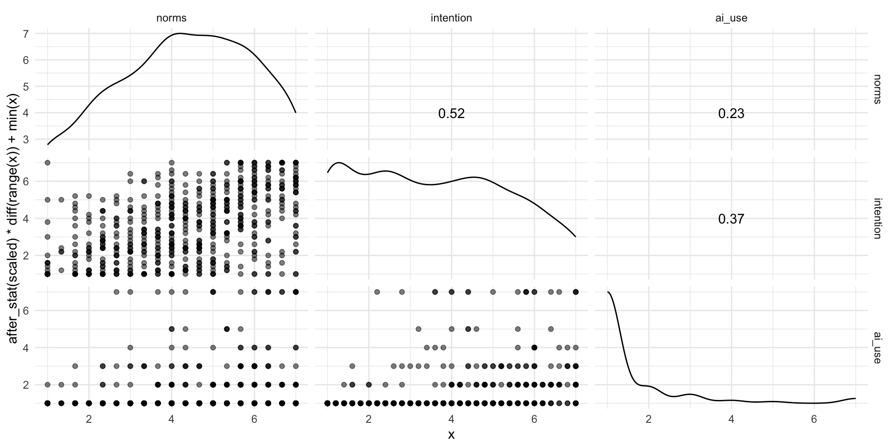


## Slide 34: The mediation model

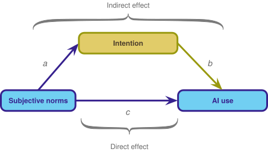

``` math
 \begin{aligned} \widehat{\text{AI use}}_i &= \hat{c}\text{Subjective norms}_i +\hat{b}\text{Intention}_i \\ \widehat{\text{Intention}}_i &= \hat{a}\text{Subjective norms}_i \\ \\ \text{Total effect} &= \text{Direct effect} + \text{Indirect effect} \\ \text{Total effect} &= c + (a \times b) \end{aligned} 
```

## Slide 35: Specifying the model

``` r
greitemeyer_mod <- 'ai_use ~ c*norms + b*intention
                    intention ~ a*norms
       
                    indirect_effect := a*b
                    total_effect := c + (a*b)
                    '
```

``` math
 \begin{aligned} \widehat{\text{AI use}}_i &= \hat{c}\text{Subjective norms}_i +\hat{b}\text{Intention}_i \\ \widehat{\text{Intention}}_i &= \hat{a}\text{Subjective norms}_i \\ \\ \text{Total effect} &= \text{Direct effect} + \text{Indirect effect} \\ \text{Total effect} &= c + (a \times b) \end{aligned} 
```

## Slide 36: Fitting the model

``` r
greitemeyer_mod <- 'ai_use ~ c*norms + b*intention
                    intention ~ a*norms
       
                    indirect_effect := a*b
                    total_effect := c + (a*b)
                    '

greitemeyer_fit <- lavaan::sem(model = greitemeyer_mod,
                           data = greitemeyer_tib,
                           missing = "FIML",
                           estimator = "MLR")
```

## Slide 37: Evaluate

> **Note: Statis-tip**
>
> - As with other models, we can use `model_performance()` to get fit statistics, but these will always show perfect fit (we are fitting what’s known as a **saturated model**).
> - We cannot use `check_model()` to get diagnostic plots.
> - By using `estimator = "MLR"` we have fitted a robust model.


## Slide 38: Interpret parameter estimates, CIs and tests

``` r
model_parameters(greitemeyer_fit) |> 
  display()
```

| Link | Coefficient | SE | 95% CI | z | p | Label | Component |
|----|----|----|----|----|----|----|----|
| ai_use ~ norms | 0.04 | 0.03 | \[-0.02, 0.10\] | 1.34 | 0.180 | c | Regression |
| ai_use ~ intention | 0.24 | 0.03 | \[ 0.18, 0.30\] | 8.02 | \< .001 | b | Regression |
| intention ~ norms | 0.57 | 0.04 | \[ 0.50, 0.64\] | 15.05 | \< .001 | a | Regression |

| Link | Coefficient | SE | 95% CI | z | p | Label | Component |
|----|----|----|----|----|----|----|----|
| indirect_effect := a\*b | 0.14 | 0.02 | \[0.10, 0.18\] | 6.92 | \< .001 | indirect_effect | Defined |
| total_effect := c+(a\*b) | 0.18 | 0.03 | \[0.12, 0.24\] | 5.91 | \< .001 | total_effect | Defined |


## Slide 39: The fitted model

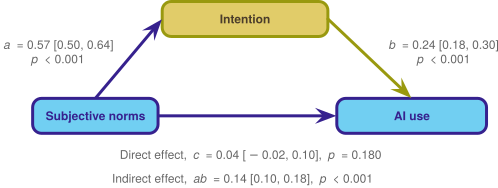

## Slide 40: Standardized parameter estimates

``` r
model_parameters(greitemeyer_fit, standardize = TRUE) |> 
  display()
```

| Link | Coefficient | SE | 95% CI | z | p | Label | Component |
|----|----|----|----|----|----|----|----|
| ai_use ~ norms | 0.05 | 0.04 | \[-0.02, 0.13\] | 1.37 | 0.170 | c | Regression |
| ai_use ~ intention | 0.34 | 0.04 | \[ 0.27, 0.42\] | 8.96 | \< .001 | b | Regression |
| intention ~ norms | 0.52 | 0.03 | \[ 0.46, 0.58\] | 16.66 | \< .001 | a | Regression |

| Link | Coefficient | SE | 95% CI | z | p | Label | Component |
|----|----|----|----|----|----|----|----|
| indirect_effect := a\*b | 0.18 | 0.02 | \[0.13, 0.22\] | 7.75 | \< .001 | indirect_effect | Defined |
| total_effect := c+(a\*b) | 0.23 | 0.03 | \[0.17, 0.30\] | 7.12 | \< .001 | total_effect | Defined |


## Slide 41: The fitted model


## Slide 42

Video clip: [pirate scene entry deck small](https://profandyfield.github.io/statistics_lectures/ds_05_mediation/media/pirate_scene_entry_deck_small.mp4)

## Slide 43

Video clip: [pirate scene 3 small](https://profandyfield.github.io/statistics_lectures/ds_05_mediation/media/pirate_scene_3_small.mp4)

## Slide 44

Video clip: [pirate academy end small](https://profandyfield.github.io/statistics_lectures/ds_05_mediation/media/pirate_academy_end_small.mp4)

## Slide 45: Summary

- Mediation is when the relationship between a predictor and outcome can be explained by their relationship to a third variable.
- The **total effect** between a predictor and outcome can be broken down into:
  - The **direct effect**, which is the relationship between the predictor and outcome **adjusting for** the mediator
  - The **indirect effect**, which is the relationship between the predictor and outcome **via** for the mediator
- We cannot infer causality from these models.
