# Categorical predictors

**Comparing means with the GLM**

Professor Andy Field, University of Sussex

Links: [bsky.app](https://bsky.app/profile/profandyfield.bsky.social) \| [youtube.com](https://www.youtube.com/user/ProfAndyField) \| [discoveringstatistics.com](https://www.discoveringstatistics.com) \| [discovr.rocks](https://www.discovr.rocks) \| [statisticsadventure.com](https://www.statisticsadventure.com)

## About this version

This is a plain-text version of the lecture slides. Each slide starts with a heading such as “Slide 5”, and the numbers match the slide numbers shown in the lecture. Content that appeared one piece at a time, in columns or in tabs is shown in reading order. Videos and interactive apps are given as links.

## Slide 2


Audio clip: [helloween narrative](https://profandyfield.github.io/statistics_lectures/ds_06_means/media/helloween_narrative.mp3)

Every Halloween the zombies and werewolves gather in an underground tomb.

They don’t like Halloween because it’s the one night that they can’t scare humans. On Halloween everyone thinks that they are a small child in fancy dress.

So they gather underground and bemoan how scary small children are these days. Invariably they quarrel about who is the scariest.

The zombies argue that they are scariest because they look rotten, but the Werewolves believe that they are scariest because they have big teeth.

The zombies think the Werewolves look too cuddly.

Each year Azal, head of the Werewolves becomes so enraged that he eats all of the zombies to win the argument. They taste rotten too.

This year, the zombies are fighting back …

## Slide 3

Video clip: [cubit azal lecture intro](https://profandyfield.github.io/statistics_lectures/ds_06_means/media/cubit_azal_lecture_intro.mp4)

## Slide 4

Video clip: [cubit facetime live lecture 01](https://profandyfield.github.io/statistics_lectures/ds_06_means/media/cubit_facetime_live_lecture_01.mp4)

## Slide 5

Video clip: [cubit facetime live lecture 02](https://profandyfield.github.io/statistics_lectures/ds_06_means/media/cubit_facetime_live_lecture_02.mp4)

## Slide 6

Video clip: [cubit facetime live lecture 03](https://profandyfield.github.io/statistics_lectures/ds_06_means/media/cubit_facetime_live_lecture_03.mp4)

## Slide 7

Video clip: [cubit facetime live lecture 04](https://profandyfield.github.io/statistics_lectures/ds_06_means/media/cubit_facetime_live_lecture_04.mp4)

## Slide 8


## Slide 9


## Slide 10: The GLM and experiments

- In experimental research, predictors in the linear model are defined by a manipulation
  - By manipulating a predictor variable can we cause (and therefore predict) a change in behaviour?
- The *F*-statistic
  - Still quantifies the fit of the model to the data
  - Still has an associated significance test
  - The ‘fit’ represents the experimental manipulation (which defines the predictor)
  - ‘Significant’ fit equates to a ‘significant’ effect of the experimental manipulation

## Slide 11 (new section): A ghoulish example

## Slide 12

Video clip: [zombie prank](https://profandyfield.github.io/statistics_lectures/ds_06_means/media/zombie_prank.mp4)

## Slide 13

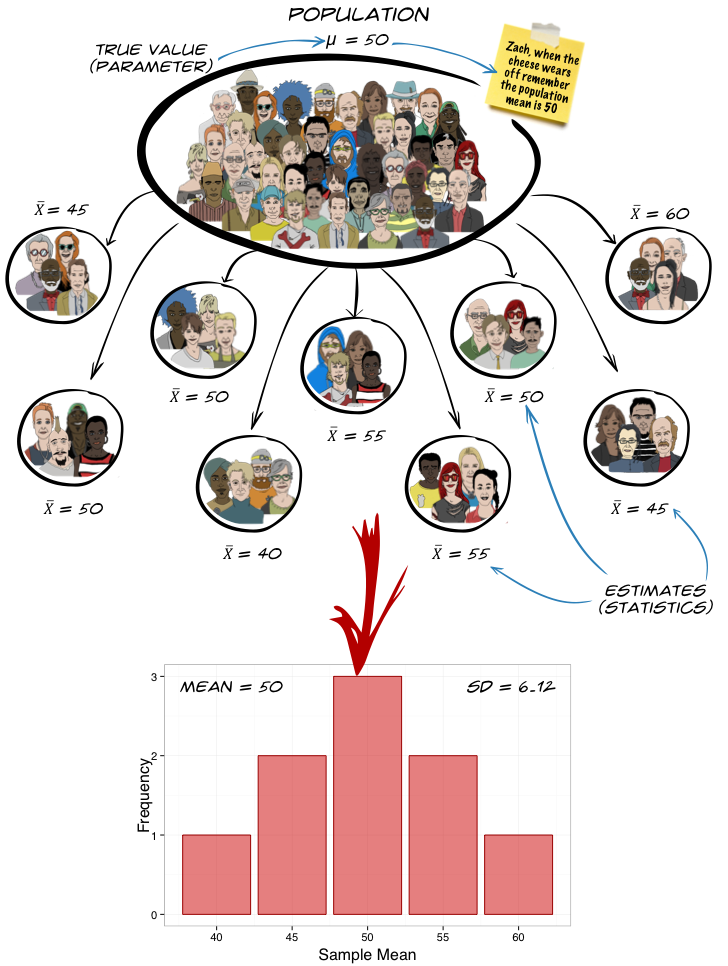

### Same ghoul

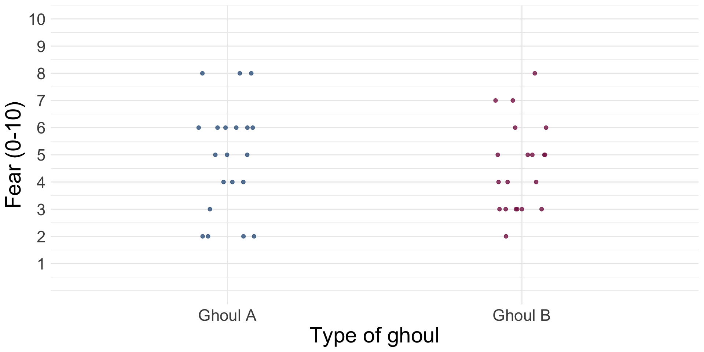

## Slide 14


### Same ghoul

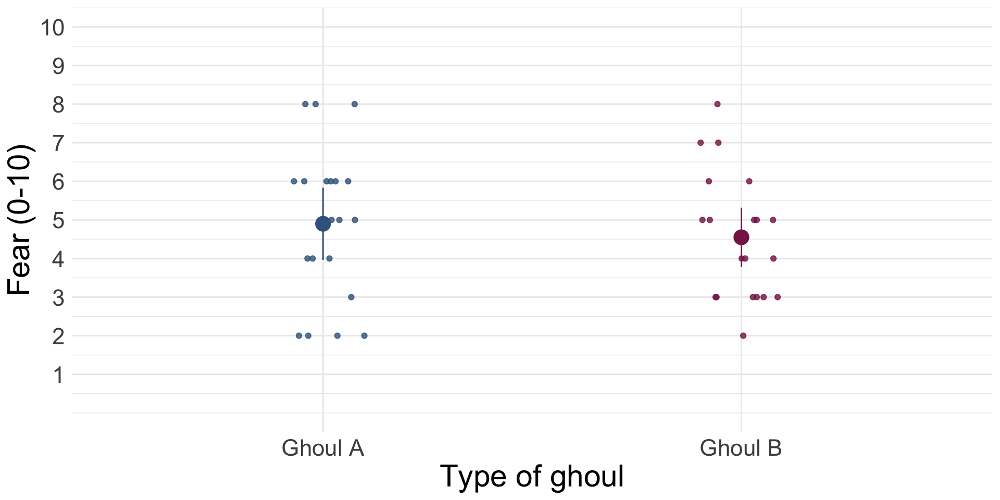

## Slide 15


### Different ghouls

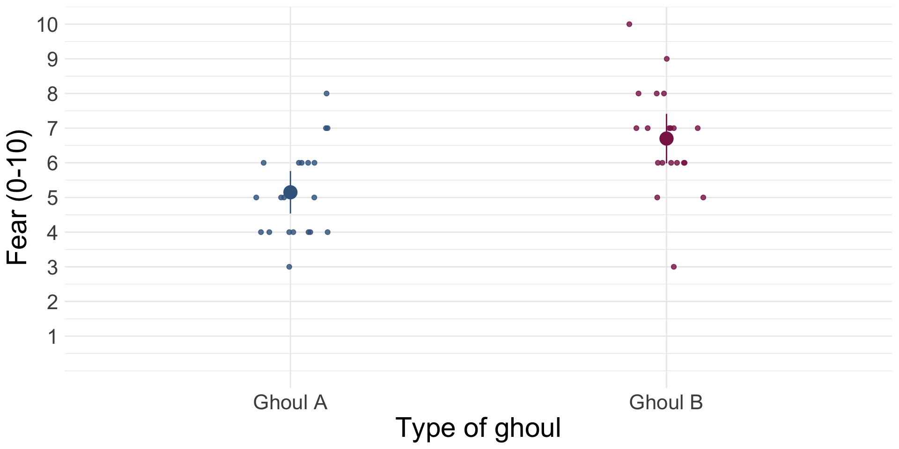

## Slide 16

| ID  | Costume | Fear | Numeric code |
|-----|---------|------|--------------|
| 1   | Zombie  | 6    | 0            |
| 2   | Zombie  | 8    | 0            |
| 3   | Zombie  | 5    | 0            |
| 4   | Zombie  | 6    | 0            |
| 5   | Zombie  | 8    | 0            |
| 6   | Zombie  | 8    | 0            |
| 7   | Zombie  | 7    | 0            |
| 8   | Zombie  | 10   | 0            |
| 9   | Zombie  | 7    | 0            |
| 10  | Zombie  | 3    | 0            |
| 11  | Zombie  | 6    | 0            |
| 12  | Zombie  | 8    | 0            |
| 13  | Zombie  | 8    | 0            |
| 14  | Zombie  | 7    | 0            |
| 15  | Zombie  | 2    | 0            |
| 16  | Zombie  | 5    | 0            |
| 17  | Zombie  | 8    | 0            |
| 18  | Zombie  | 10   | 0            |
| 19  | Zombie  | 7    | 0            |
| 20  | Zombie  | 9    | 0            |
| 21  | Zombie  | 4    | 0            |
| 22  | Zombie  | 8    | 0            |
| 23  | Zombie  | 9    | 0            |
| 24  | Zombie  | 6    | 0            |
| 25  | Zombie  | 9    | 0            |
| 26  | Zombie  | 3    | 0            |
| 27  | Zombie  | 3    | 0            |
| 28  | Zombie  | 6    | 0            |
| 29  | Zombie  | 8    | 0            |
| 30  | Zombie  | 6    | 0            |
| 31  | Zombie  | 8    | 0            |
| 32  | Zombie  | 8    | 0            |
| 33  | Zombie  | 7    | 0            |
| 34  | Zombie  | 3    | 0            |
| 35  | Zombie  | 8    | 0            |
| 36  | Zombie  | 9    | 0            |
| 37  | Zombie  | 7    | 0            |
| 38  | Zombie  | 9    | 0            |
| 39  | Zombie  | 6    | 0            |
| 40  | Zombie  | 4    | 0            |
| 41  | Zombie  | 7    | 0            |
| 42  | Zombie  | 7    | 0            |
| 43  | Zombie  | 10   | 0            |
| 44  | Zombie  | 6    | 0            |
| 45  | Zombie  | 7    | 0            |
| 46  | Zombie  | 9    | 0            |
| 47  | Zombie  | 7    | 0            |
| 48  | Zombie  | 9    | 0            |
| 49  | Zombie  | 10   | 0            |
| 50  | Zombie  | 9    | 0            |

Table 1: Data for the zombie vs. werewolf costume experiment (first 50 of 100 rows)

## Slide 17: The model

``` math
 \begin{aligned} Y_i &= \hat{b}_0 + \hat{b}_1X_{i} + e_i \\ \text{Fear}_i &= \hat{b}_0 + \hat{b}_1\text{Costume}_{i} + e_i \end{aligned} 
```

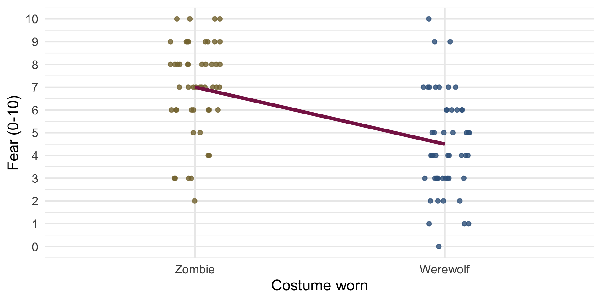

## Slide 18: The model

``` math
 \begin{aligned} Y_i &= \hat{b}_0 + \hat{b}_1X_{i} + e_i \\ \text{Fear}_i &= \hat{b}_0 + \hat{b}_1\text{Costume}_{i} + e_i \end{aligned} 
```

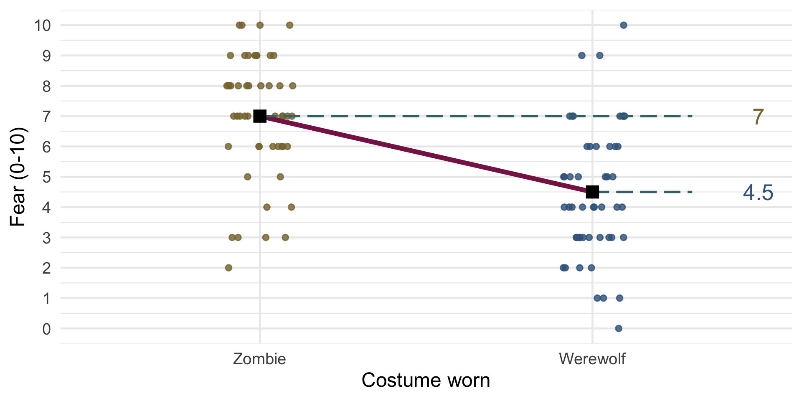

## Slide 19: The model

``` math
 \begin{aligned} \text{Fear}_i &= \hat{b}_0 + \hat{b}_1\text{Costume}_{i} + e_i \\ \hat{\text{Fear}}_i &= \hat{b}_0 + \hat{b}_1\text{Costume}_{i} \\ \end{aligned} 
```

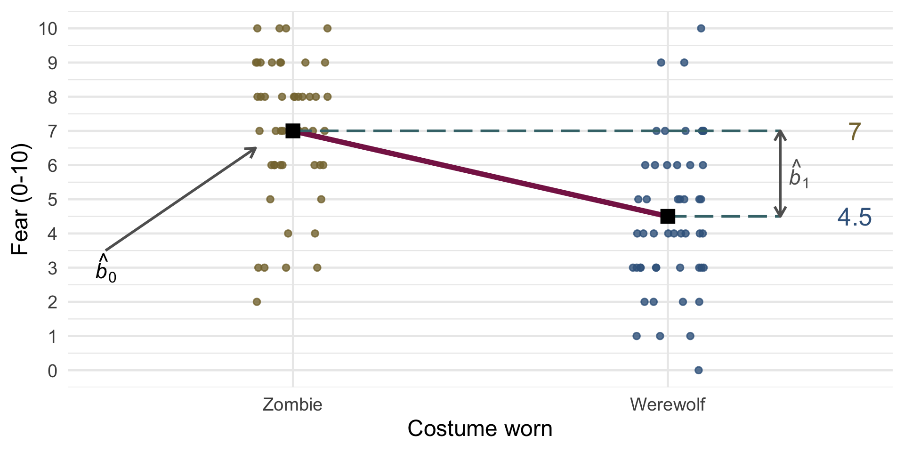

## Slide 20: Dummy coding: b0

- Dummy Coding
  - Zombie = 0,
  - Werewolf = 1
- When costume = zombie
  - Costume = 0
  - Predicted fear = mean of zombie group:

``` math
 \begin{aligned} \hat{\text{fear}}_i &= \hat{b}_0 + \hat{b}_1\text{Costume}_i \\ \bar{X}_\text{zombie} &= \hat{b}_0 + \hat{b}_1\times0 \\ \bar{X}_\text{zombie} &= \hat{b}_0 \end{aligned} 
```

## Slide 21: Dummy coding: b1

- When costume = werewolf
  - Costume = 1
  - Predicted fear = mean of werewolf group:

``` math
 \begin{aligned} \hat{\text{fear}}_i &= \hat{b}_0 + \hat{b}_1\text{Costume}_i \\ \bar{X}_\text{werewolf} &= \hat{b}_0 + \hat{b}_1\times1 \\ \bar{X}_\text{werewolf} &= \hat{b}_0 + \hat{b}_1 \end{aligned} 
```

``` math
 \begin{aligned} \bar{X}_\text{werewolf} &= \bar{X}_\text{zombie} + \hat{b}_1 \\ \hat{b}_1 &= \bar{X}_\text{werewolf} - \bar{X}_\text{zombie} \end{aligned} 
```

## Slide 22: The linear model

- We can fit a linear model with fear as the outcome and the type of costume (zombie or werewolf) as the predictor, note:
  - Intercept (*b*<sub>0</sub>) is the mean of ‘zero coded’ group
  - *b* for the dummy variable is the difference between the means of the two costume groups (4.5 − 7 = −2.5)

``` r
zombie_lm <- lm(Fear ~ Costume, zombie_tib)
model_parameters(zombie_lm) |> 
  display()
```

| Parameter          | Coefficient | SE   | 95% CI         | t(98) | p       |
|--------------------|-------------|------|----------------|-------|---------|
| (Intercept)        | 7.00        | 0.30 | (6.41, 7.59)   | 23.40 | \< .001 |
| Costume (Werewolf) | -2.50       | 0.42 | (-3.34, -1.66) | -5.91 | \< .001 |

## Slide 23: Standardized effect size: Cohens \\\hat{d}\\

- Cohens $`\hat{d}`$ expresses the difference in means in standard deviation units
- Guide (but we’re not selling T-shirts …)
  - $`\hat{d}`$ = 0.2 is small
  - $`\hat{d}`$ = 0.5 is medium
  - $`\hat{d}`$ = 0.8 is large

``` math
 \begin{aligned} \hat{d} &= \frac{\bar{X}_1-\bar{X}_2}{s_p} \\ s_p &= \sqrt{\frac{(N_1-1)s^2_1 + (N_2-1)s^2_2}{N_1 + N_2 -2}} \end{aligned} 
```

``` r
cohens_d(Fear ~ Costume, data = zombie_tib, reference = "Werewolf") |> 
  display()
```

| Cohen’s d | 95% CI         |
|-----------|----------------|
| 1.18      | \[0.75, 1.60\] |

## Slide 24

Video clip: [cubit azal lecture middle captioned](https://profandyfield.github.io/statistics_lectures/ds_06_means/media/cubit_azal_lecture_middle_captioned.mp4)

## Slide 25

Video clip: [cubit facetime live lecture 05](https://profandyfield.github.io/statistics_lectures/ds_06_means/media/cubit_facetime_live_lecture_05.mp4)

## Slide 26

Video clip: [cubit facetime live lecture 06](https://profandyfield.github.io/statistics_lectures/ds_06_means/media/cubit_facetime_live_lecture_06.mp4)

## Slide 27

Video clip: [cubit facetime live lecture 07](https://profandyfield.github.io/statistics_lectures/ds_06_means/media/cubit_facetime_live_lecture_07.mp4)

## Slide 28

Video clip: [cubit facetime live lecture 08](https://profandyfield.github.io/statistics_lectures/ds_06_means/media/cubit_facetime_live_lecture_08.mp4)

## Slide 29: Another ghoulish example

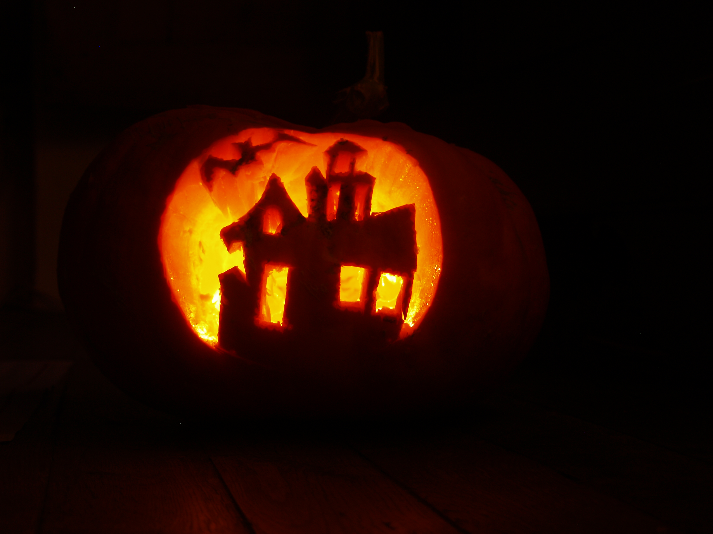

- Which is more scary?
  - Human
  - Zombie
  - Werewolf
- Design
  - Prank
- Outcome
  - Fear
- Process
  - E.V.I.L.

> **Note: Statis-tip**
>
> - This experiment is using a **one-way independent design**.
>   - One-way = one predictor variable is manipulated (costume)
>   - Participants are assigned to independent groups

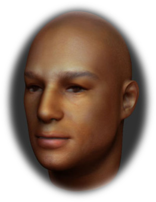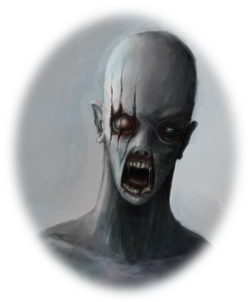

## Slide 30: Load and Look

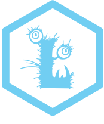

|                            | Human | Zombie | Werewolf |
|----------------------------|-------|--------|----------|
|                            | 2     | 10     | 6        |
|                            | 6     | 8      | 3        |
|                            | 1     | 5      | 0        |
|                            | 1     | 7      | 2        |
|                            | 2     | 6      | 8        |
| Mean                       | 2.40  | 7.20   | 3.80     |
| Variance (*s*<sup>2</sup>) | 4.30  | 3.70   | 10.20    |
| Standard deviation (*s*)   | 2.07  | 1.92   | 3.19     |

$`\text{Overall mean (} \bar{X}_\text{grand}\text{)} = 4.47`$

## Slide 31: Visualize the model


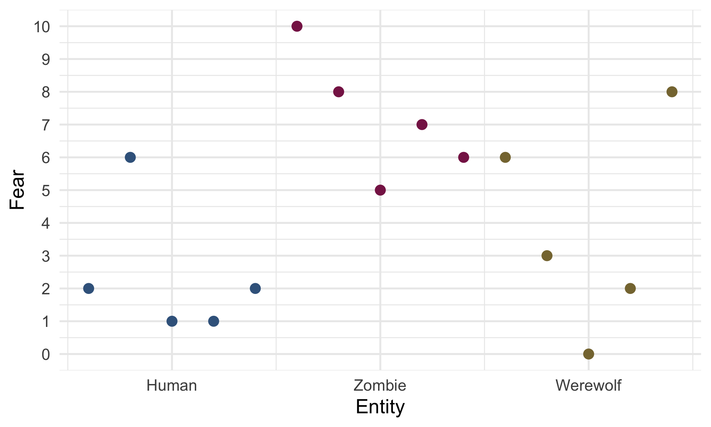

## Slide 32: Visualize the model


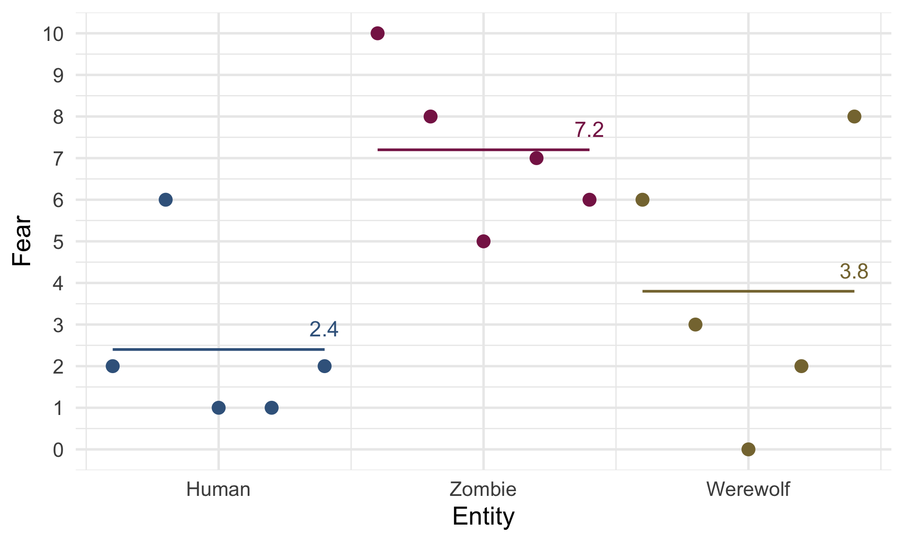

## Slide 33: Dummy coding multiple categories

- You can code any categorical predictor into a series of dummy variables
  - Dummy variables must be entered in the same block
  - Choose a baseline category - it is always coded as 0
    - (By default R chooses the first level of the factor)
  - The *b* for each dummy variable will be the difference in means between each category and the baseline

| Entity   | Dummy 1 (Zombie vs. Human) | Dummy 2 (Werewolf vs. Human) |
|----------|----------------------------|------------------------------|
| Human    | 0                          | 0                            |
| Zombie   | 1                          | 0                            |
| Werewolf | 0                          | 1                            |

``` math
 \begin{aligned} \hat{\text{Fear}}_i &= \hat{b}_0 + \hat{b}_1\text{Zombie vs. Human}_i + \hat{b}_2\text{Werewolf vs. Human}_i \end{aligned} 
```

## Slide 34: Dummy coding: b0

- When entity = human
  - Zombie vs. Human = 0
  - Wolf vs. Human = 0
- Predicted fear = mean of human group:

| Entity   | Zombie vs. Human | Werewolf vs. Human |
|----------|------------------|--------------------|
| Human    | 0                | 0                  |
| Zombie   | 1                | 0                  |
| Werewolf | 0                | 1                  |


``` math
 \begin{aligned} \hat{\text{Fear}}_i &= \hat{b}_0 + \hat{b}_1\text{Zombie vs. Human}_i + \hat{b}_2\text{Werewolf vs. Human}_i \\ \bar{X}_\text{human} &= \hat{b}_0 + \hat{b}_1\times 0 + \hat{b}_2\times 0 \\ \hat{b}_0 &= \bar{X}_\text{human} \end{aligned} 
```

## Slide 35: Dummy coding: b1

- When entity = zombie
  - Zombie vs. Human = 1
  - Wolf vs. Human = 0
- Predicted fear = mean of zombie group:

| Entity   | Zombie vs. Human | Werewolf vs. Human |
|----------|------------------|--------------------|
| Human    | 0                | 0                  |
| Zombie   | 1                | 0                  |
| Werewolf | 0                | 1                  |


``` math
 \begin{aligned} \hat{\text{Fear}}_i &= \hat{b}_0 + \hat{b}_1\text{Zombie vs. Human}_i + \hat{b}_2\text{Werewolf vs. Human}_i \\ \bar{X}_\text{zombie} &= \hat{b}_0 + \hat{b}_1\times 1 + \hat{b}_2\times 0 \\ \bar{X}_\text{zombie} &= \hat{b}_0 + \hat{b}_1 \\ \hat{b}_1 &= \bar{X}_\text{zombie}- \hat{b}_0 \\ &= \bar{X}_\text{zombie}- \bar{X}_\text{human} \end{aligned} 
```

## Slide 36: Dummy coding: b2

- When entity = werewolf
  - Zombie vs. Human = 0
  - Wolf vs. Human = 1
- Predicted fear = mean of werewolf group:

| Entity   | Zombie vs. Human | Werewolf vs. Human |
|----------|------------------|--------------------|
| Human    | 0                | 0                  |
| Zombie   | 1                | 0                  |
| Werewolf | 0                | 1                  |


``` math
 \begin{aligned} \hat{\text{Fear}}_i &= \hat{b}_0 + \hat{b}_1\text{Zombie vs. Human}_i + \hat{b}_2\text{Werewolf vs. Human}_i \\ \bar{X}_\text{werewolf} &= \hat{b}_0 + \hat{b}_1\times 0 + \hat{b}_2\times 1 \\ \bar{X}_\text{werewolf} &= \hat{b}_0 + \hat{b}_2 \\ \hat{b}_2 &= \bar{X}_\text{werewolf}- \hat{b}_0 \\ &= \bar{X}_\text{werewolf}- \bar{X}_\text{human} \end{aligned} 
```

## Slide 37: The model


## Slide 38: The parameter values

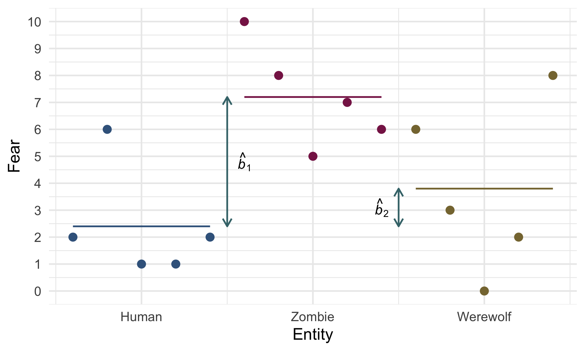

## Slide 39: The parameter values

|          | Human | Zombie | Werewolf |
|----------|-------|--------|----------|
|          | 2     | 10     | 6        |
|          | 6     | 8      | 3        |
|          | 1     | 5      | 0        |
|          | 1     | 7      | 2        |
|          | 2     | 6      | 8        |
| **Mean** | 2.4   | 7.2    | 3.8      |

$`\hat{b}_0 = \bar{X}_\text{human} = 2.40`$

$`\hat{b}_1 = \bar{X}_\text{zombie} - \bar{X}_\text{human} = 7.20 - 2.40 = 4.80`$

$`\hat{b}_2 = \bar{X}_\text{werewolf} - \bar{X}_\text{human} = 3.80 - 2.40 = 1.40`$

## Slide 40

### The model

``` math
 \begin{aligned} \hat{\text{Fear}}_i &= \hat{b}_0 + \hat{b}_1\text{Zombie vs. Human}_i + \hat{b}_2\text{Werewolf vs. Human}_i \end{aligned} 
```

``` math
 \begin{aligned} \hat{\text{Fear}}_i &= 2.4 + 4.8\text{Zombie vs. Human}_i + 1.4\text{Werewolf vs. Human}_i \end{aligned} 
```

``` r
# Fit model
human_lm <- lm(fear ~ entity, data = humans_tib)
```

## Slide 41 (new section): Evaluate the model


## Slide 42: How to Evaluate


### Overall fit (*F*-statistic)

- The ratio of how well the model fits to how much error it has
- In the case of experiments: \_ The model = differences between means
  - *F* is the ratio of the experimental effect to the background ‘error’
  - Tests whether group means differ **overall**

### Overall fit (*R*<sup>2</sup>)

- How much variance in the outcome is explained by group membership?

### Assumptions

- Interpreted the same as other models
- Residual plots will show vertical lines of dots (review the **Beast of Bias** lecture)

## Slide 43: Total sum of squared error, SST

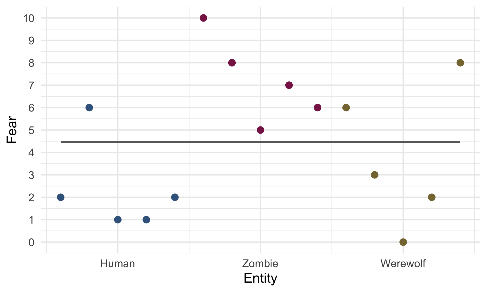

## Slide 44: Total sum of squared error, SST

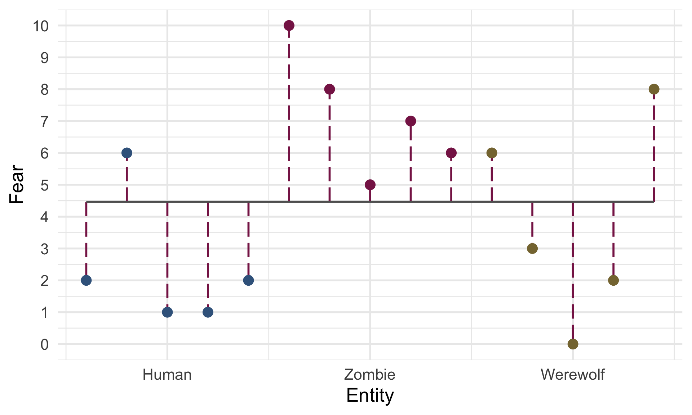

## Slide 45: Residual sum of squared error, SSR

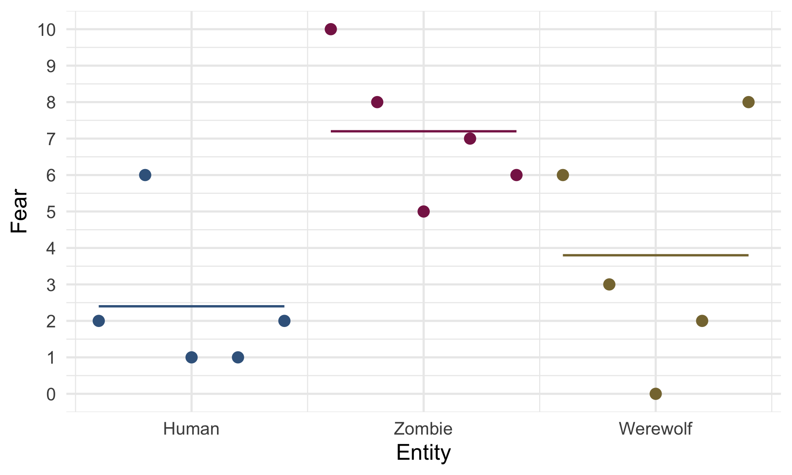

## Slide 46: Residual sum of squared error, SSR

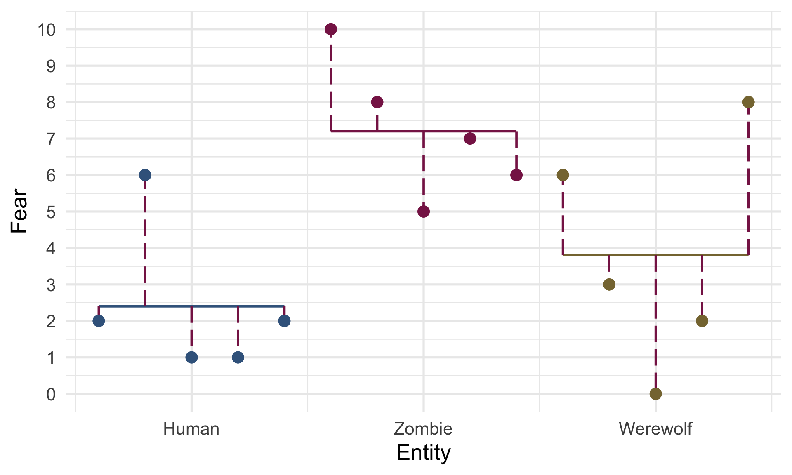

## Slide 47: Model sum of squared error, SSM


## Slide 48: Model sum of squared error, SSM

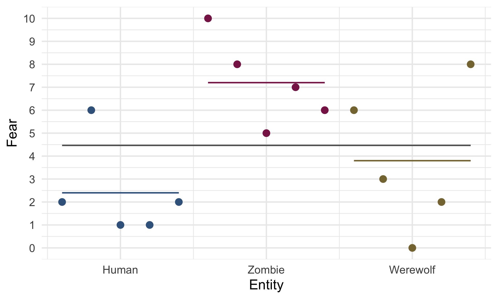

## Slide 49: Model sum of squared error, SSM

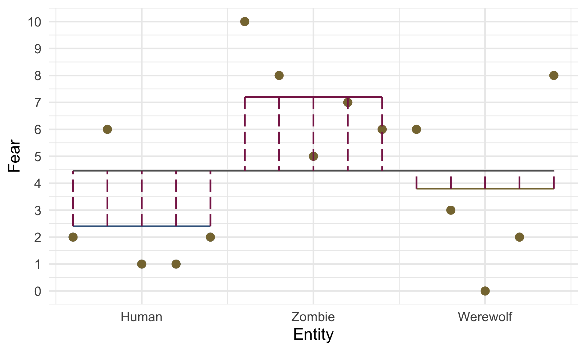

## Slide 50: Overall fit

``` r
# get F
test_wald(human_lm) |> 
  display()
```

| Name       | Model | df  | df_diff | F    | p     |
|------------|-------|-----|---------|------|-------|
| Null model | lm    | 14  |         |      |       |
| Full model | lm    | 12  | 2       | 5.02 | 0.026 |

``` r
# get R^2
model_performance(human_lm) |> 
  display()
```

| AIC  | AICc | BIC  | R2   | R2 (adj.) | RMSE | Sigma |
|------|------|------|------|-----------|------|-------|
| 74.3 | 78.3 | 77.1 | 0.46 | 0.36      | 2.20 | 2.46  |

> **Important: ReportR**
>
> The type of monster in the prank had a significant effect on fear levels, *F*(2, 12) = 5.02, *p* = 0.026, *R*<sup>2</sup> = 0.46.

## Slide 51: Evaluate assumptions

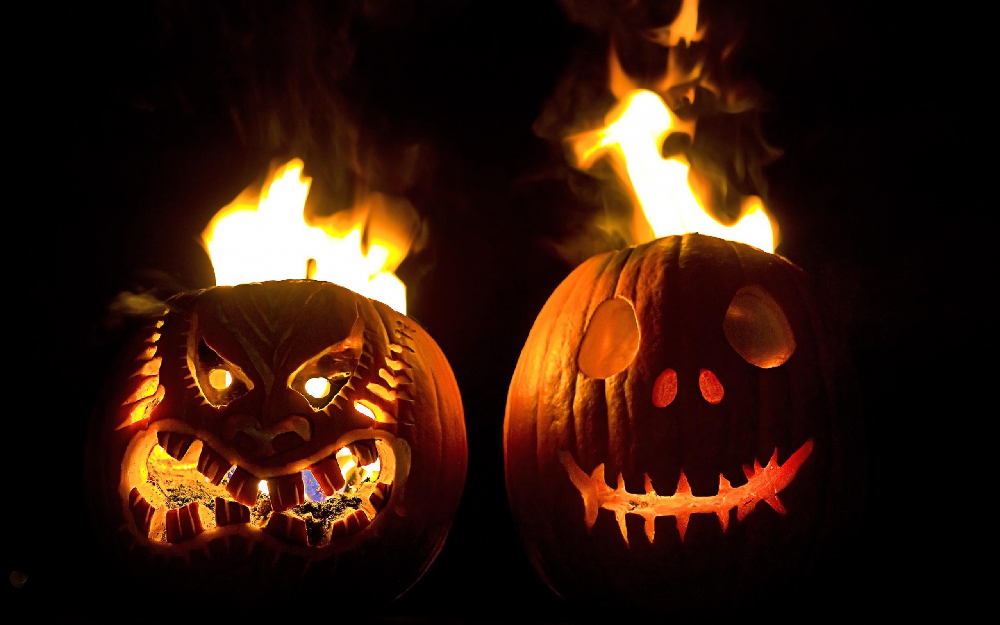

``` r
check_model(human_lm)
```

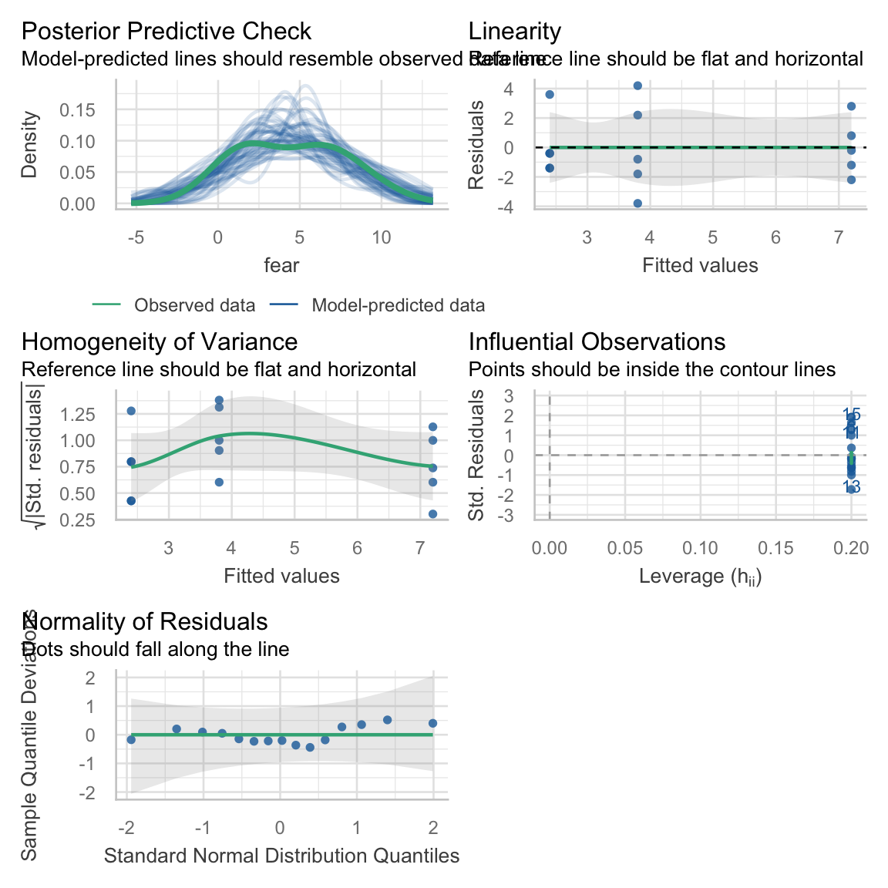

## Slide 52: Robust F-statistic

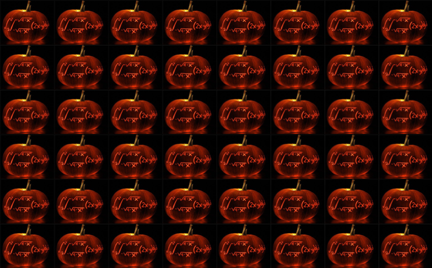

``` r
welchf <- oneway.test(fear ~ entity, data = humans_tib)
model_parameters(welchf) |> 
  display()
```

| F    | df  | df (error) | p     |
|------|-----|------------|-------|
| 6.89 | 2   | 7.74       | 0.019 |

One-way analysis of means (not assuming equal variances)

> **Important: ReportR**
>
> The type of monster in the prank had a significant effect on fear levels, F(2, 7.74) = 6.89, *p* = 0.019.

## Slide 53 (new section): Interpret the model

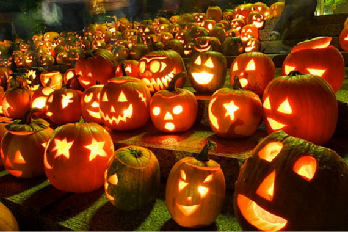

## Slide 54: Robust procedures


## Slide 55: Interpret parameter estimates, CIs and tests


- Break down the overall fit
- Tell us, specifically, which means differ

``` r
model_parameters(human_lm, vcov = "HC4") |> 
  display()
```

| Parameter         | Coefficient | SE   | 95% CI        | t(12) | p     |
|-------------------|-------------|------|---------------|-------|-------|
| (Intercept)       | 2.40        | 0.93 | (0.38, 4.42)  | 2.59  | 0.024 |
| entity (Zombie)   | 4.80        | 1.26 | (2.04, 7.56)  | 3.79  | 0.003 |
| entity (Werewolf) | 1.40        | 1.70 | (-2.31, 5.11) | 0.82  | 0.427 |

> **Important: ReportR**
>
> The type of monster in the prank had a significant effect on fear levels, F(2, 7.74) = 6.89, *p* = 0.019. Compared to humans, zombies elicited greater fear, $`\hat{b}`$ = 4.80 (2.04, 7.56), *t*(12) = 3.79, *p* = 0.003, but werewolves did not, $`\hat{b}`$ = 1.40 (-2.31, 5.11), *t*(12) = 0.82, *p* = 0.427.

## Slide 56

Video clip: [cubit azal lecture end captioned](https://profandyfield.github.io/statistics_lectures/ds_06_means/media/cubit_azal_lecture_end_captioned.mp4)

## Slide 57

Video clip: [f song instrumental](https://profandyfield.github.io/statistics_lectures/ds_06_means/media/f_song_instrumental.mp4)

## Slide 58

Video clip: [f song](https://profandyfield.github.io/statistics_lectures/ds_06_means/media/f_song.mp4)
