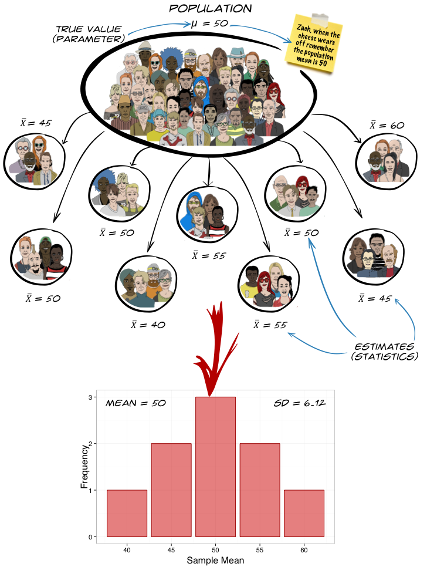

```{r}
# general
library(DT)
library(gt)
library(easystats)
library(tidyverse)
# specific

source("../helpers/discovr_helpers.R")
source("../helpers/easystats_helpers.R")

zombie_tib <- read_csv("data/zombie_werewolf.csv",
                              col_names = c("id", "Costume", "Fear"),
                              skip = 1) |> 
  mutate(
    Costume = as_factor(Costume) |> forcats::fct_relevel("Zombie", "Werewolf")
    )

humans_tib <- read_csv("data/zombies_humans_werewolves.csv") |> 
  mutate(
    entity = as_factor(entity) |> fct_relevel("Human", "Zombie", "Werewolf")
  )
```


## {background-image="media/hell_fire_background.jpg" background-size="cover"}

<audio controls autoplay>
  <source src="media/helloween_narrative.mp3" type="audio/mpeg">
  <source src="media/helloween_narrative.ogg" type="audio/ogg"/>
</audio>


:::{.center-h}
:::{.txt_l}
:::{.txt_white}

Every Halloween the zombies and werewolves gather in an underground tomb.

They don't like Halloween because it's the one night that they can't scare humans. On Halloween everyone thinks that they are a small child in fancy dress.

So they gather underground and bemoan how scary small children are these days. Invariably they quarrel about who is the scariest.

The zombies argue that they are scariest because they look rotten, but the Werewolves believe that they are scariest because they have big teeth.

The zombies think the Werewolves look too cuddly.

Each year Azal, head of the Werewolves becomes so enraged that he eats all of the zombies to win the argument. They taste rotten too.

This year, the zombies are fighting back ...

:::
:::
:::

::: notes
Use C to toggle pen/markup
Use backspace to delete markup
Use f to toggle fullscreen
:::

## {background-video="media/cubit_azal_lecture_intro.mp4" background-size="cover"}

##

```{r, child = "cubit_phone_01.qmd"}

```

## 

::: r-stack
{.fragment fig-align="center" width="1050" height="594"}

{.fragment fig-align="center" width="1050" height="594"}
:::


##

{fig-align="center" height=600}

##  The GLM and experiments

- In experimental research, predictors in the linear model are defined by a manipulation
  - By manipulating a predictor variable can we cause (and therefore predict) a change in behaviour?
  
::: fragment
  
- The *F*-statistic
  - Still quantifies the fit of the model to the data
  - Still has an associated significance test
  - The 'fit' represents the experimental manipulation (which defines the predictor)
  - 'Significant' fit equates to a 'significant' effect of the experimental manipulation

:::

# A ghoulish example

## {background-video="media/zombie_prank.mp4" background-size="cover"}


##

```{r}
#| echo: false

set.seed(666)
ghoul_tib <- tibble::tibble(
  Ghoul = gl(2, 20, labels = c("Ghoul A", "Ghoul B")),
  Fear = ifelse(Ghoul == "Ghoul A", round(rnorm(20, 5, 1.5)), round(rnorm(20, 5, 1.5))),
  Fear2 = ifelse(Ghoul == "Ghoul A", round(rnorm(20, 5, 1.5)), round(rnorm(20, 7, 1.5))),
)
```


:::: columns 
::: {.column width="50%"}
{height=600}
:::

::: {.column width="50%"}

### Same ghoul

```{r}
#| echo: false

same_plot <- ggplot2::ggplot(ghoul_tib, aes(x = Ghoul, y = Fear, colour = Ghoul)) +
  geom_point(alpha = 0.8, position = position_jitter(width = 0.1, height = 0)) +
  scale_color_manual(values = c(blue, mulberry)) +
  coord_cartesian(ylim = c(0, 10)) +
  scale_y_continuous(breaks = 1:10) +
  labs(x = "Type of ghoul", y = "Fear (0-10)") +
  theme_minimal() +
  theme(legend.position = "none",
        axis.text = element_text(size = rel(1.5)),
        axis.title = element_text(size = rel(2))
  )
same_plot
```


:::
::::

##

:::: columns 
::: {.column width="50%"}
{height=600}
:::

::: {.column width="50%"}

### Same ghoul

```{r}
#| echo: false

same_plot +
  stat_summary(fun.data = "mean_cl_normal", size = 1)
```


:::
::::

##


:::: columns
::: {.column width="50%"}
{height=600}
:::

::: {.column width="50%"}

### Different ghouls

```{r}
#| echo: false

diff_plot <- ggplot2::ggplot(ghoul_tib, aes(x = Ghoul, y = Fear2, colour = Ghoul)) +
  geom_point(alpha = 0.8, position = position_jitter(width = 0.1, height = 0)) +
  stat_summary(fun.data = "mean_cl_normal", size = 1) +
  scale_color_manual(values = c(blue, mulberry)) +
  coord_cartesian(ylim = c(0, 10)) +
  scale_y_continuous(breaks = 1:10) +
  labs(x = "Type of ghoul", y = "Fear (0-10)") +
  theme_minimal() +
  theme(legend.position = "none",
        axis.text = element_text(size = rel(1.5)),
        axis.title = element_text(size = rel(2))
  )
diff_plot
```


:::
::::

##

```{r}
#| echo: false
#| 
zombie_tib |>
  select(Costume, Fear) |>
  mutate(
    `Numeric code` = ifelse(Costume == "Zombie", 0, 1)
  ) |>
  DT::datatable(colnames = c('ID' = 1),
                caption = 'Table 1: Data for the zombie vs. werewolf costume experiment',
                options = list(
                dom = 'tp',
                columnDefs = list(
                  list(className = 'dt-center', targets = 1:3)
                  ),
                pageLength = 10
  )
  )
```

## The model

::: center-h
::: txt_mulberry
$$
\begin{aligned}
Y_i &= \hat{b}_0 + \hat{b}_1X_{i} + e_i \\
\text{Fear}_i &= \hat{b}_0 + \hat{b}_1\text{Costume}_{i} + e_i 
\end{aligned}
$$
:::


```{r}
#| echo: false
#| message: false

m_z <- mean(subset(zombie_tib$Fear, zombie_tib$Costume == "Zombie"))
m_w <- mean(subset(zombie_tib$Fear, zombie_tib$Costume == "Werewolf"))

zom_plot <- ggplot2::ggplot(zombie_tib, aes(y = Fear, x = Costume, colour = Costume)) +
  geom_point(alpha = 0.8, size = 2, position = position_jitter(width = 0.1, height = 0)) +
  labs(x = "Costume worn", y = "Fear (0-10)") +
  coord_cartesian(ylim = c(0, 10)) +
  scale_y_continuous(breaks = 0:10) +
  scale_colour_manual(values = c(brown, blue)) +
  theme_minimal(base_size = 18) +
  theme(legend.position = "none") +
  annotate("segment", x = 1, y = m_z, xend = 2, yend = m_w, colour = mulberry, linewidth = 2) 
zom_plot
```
:::


## The model

::: center-h
::: txt_mulberry
$$
\begin{aligned}
Y_i &= \hat{b}_0 + \hat{b}_1X_{i} + e_i \\
\text{Fear}_i &= \hat{b}_0 + \hat{b}_1\text{Costume}_{i} + e_i 
\end{aligned}
$$
:::

```{r}
#| echo: false
#| message: false
#| warning: false

zom_plot2 <- zom_plot +
  annotate("segment", x = 1, y = m_z, xend = 2.3, yend = m_z, colour = green, linetype = "longdash", linewidth = 1) +
  annotate("segment", x = 2, y = m_w, xend = 2.3, yend = m_w, colour = green, linetype = "longdash", linewidth = 1) +
  annotate("text", x = 2.5, y = m_z, colour = brown, label = m_z, size = 7) +
  annotate("text", x = 2.5, y = m_w, colour = blue, label = m_w, size = 7) +
  stat_summary(fun = mean, geom = "point", size = 5, shape = 15, colour = "Black")

zom_plot2
```
:::

::: notes
The intercept represents the mean of the control group
:::

## The model

::: center-h
::: txt_mulberry
$$
\begin{aligned}
\text{Fear}_i &= \hat{b}_0 + \hat{b}_1\text{Costume}_{i} + e_i \\
\hat{\text{Fear}}_i &= \hat{b}_0 + \hat{b}_1\text{Costume}_{i} \\
\end{aligned}
$$
:::

```{r}
#| echo: false
#| message: false
#| warning: false

zom_plot2 +
    annotate("text", x = 0.5, y = 3, label = deparse(bquote(hat(italic(b))[0])), parse = T, size = 6) +
  annotate("segment", x = 0.5, y = 3.5, xend = 0.9, yend = m_z-0.5, colour = grey, arrow = arrow(length = unit(0.03, "npc")), linewidth = 1) +
  annotate("text", x = 2.35, y = (m_z + m_w)/2, label = deparse(bquote(hat(italic(b))[1])), parse = T, size = 6, colour = grey) +
  annotate("segment", x = 2.3, y = m_z, xend = 2.3, yend = m_w, colour = grey, linewidth = 1, arrow = arrow(length = unit(0.03, "npc"), ends = "both"))
```
:::

::: notes
b_1 represents the difference between group means
:::

## Dummy coding: *b*~0~

- Dummy Coding
  - Zombie = 0,
  - Werewolf = 1

- When costume = zombie
  - Costume = 0
  - Predicted fear = mean of zombie group:

::: center-h
::: txt_mulberry
::: txt_l
$$
\begin{aligned}
\hat{\text{fear}}_i &= \hat{b}_0 + \hat{b}_1\text{Costume}_i \\
\bar{X}_\text{zombie} &= \hat{b}_0 + \hat{b}_1\times0 \\
\bar{X}_\text{zombie} &= \hat{b}_0
\end{aligned}
$$
:::
:::
:::

## Dummy coding: *b*~1~

* When costume = werewolf
  + Costume = 1
  + Predicted fear = mean of werewolf group:

::: center-h
::: txt_l
::: txt_mulberry
$$
\begin{aligned}
\hat{\text{fear}}_i &= \hat{b}_0 + \hat{b}_1\text{Costume}_i \\
\bar{X}_\text{werewolf} &= \hat{b}_0 + \hat{b}_1\times1 \\
\bar{X}_\text{werewolf} &= \hat{b}_0 + \hat{b}_1
\end{aligned}
$$
:::
:::
:::

::: fragment
::: center-h
::: txt_l
::: txt_mulberry
$$
\begin{aligned}
\bar{X}_\text{werewolf} &= \bar{X}_\text{zombie} + \hat{b}_1 \\
\hat{b}_1 &= \bar{X}_\text{werewolf} - \bar{X}_\text{zombie}
\end{aligned}
$$
:::
:::
:::
:::

## The linear model

- We can fit a linear model with fear as the outcome and the type of costume (zombie or werewolf) as the predictor, note:
  - Intercept (*b*~0~) is the mean of ‘zero coded' group
  - *b* for the dummy variable is the difference between the means of the two costume groups (4.5 − 7 = −2.5)

\

::: fragment
```{r}
#| echo: true

zombie_lm <- lm(Fear ~ Costume, zombie_tib)
model_parameters(zombie_lm) |> 
  display()
```
:::

## Standardized effect size: Cohens $\hat{d}$

:::: columns
::: {.column width="50%"}
- Cohens $\hat{d}$ expresses the difference in means in standard deviation units
- Guide (but we're not selling T-shirts ...)
  - $\hat{d}$ = 0.2 is small
  - $\hat{d}$ = 0.5 is medium
  - $\hat{d}$ = 0.8 is large
:::

::: {.column width="50%"}
::: txt_mulberry
$$
\begin{aligned}
\hat{d} &= \frac{\bar{X}_1-\bar{X}_2}{s_p} \\
s_p &= \sqrt{\frac{(N_1-1)s^2_1 + (N_2-1)s^2_2}{N_1 + N_2 -2}}
\end{aligned}
$$
:::
:::
::::

\

::: txt_l
```{r}
#| echo: true
#| eval: false
cohens_d(Fear ~ Costume, data = zombie_tib, reference = "Werewolf") |> 
  display()
```
:::

```{r}
#| echo: false

cohens_d(Fear ~ Costume, data = zombie_tib, reference = "Werewolf") |> 
  format_table(footnote = "") |> 
  display()
```


## {background-video="media/cubit_azal_lecture_middle_captioned.mp4" background-size="cover"}

```{r, child = "cubit_phone_02.qmd"}

```


## [Another ghoulish example]{.txt_ong} {background-image="media/halloween_pumpkin_house.jpg" background-size="cover"}

::: txt_white

- Which is more scary?
  - Human
  - Zombie
  - Werewolf

- Design
  - Prank

- Outcome
  - Fear
  
- Process
  - E.V.I.L.
  
:::

::: txt_dk_bg
::: {.callout-note icon = false}
##  Statis-tip

- This experiment is using a **one-way independent design**.
  - One-way = one predictor variable is manipulated (costume)
  - Participants are assigned to independent groups

:::
:::

{.absolute width="150" left=750 top=35}
{.absolute width="150"  left=750 top=260}
{.absolute width="150" left=750 top=470}


## [L]{.txt_ong}oad and [L]{.txt_ong}ook

{.absolute top=0 left=800 height="80"}


```{r}
#| echo: false
#| 

human_means <- humans_tib |>
  group_by(entity) |> 
  summarize(
    mean = mean(fear)
  )

h_mean <- human_means[1, 2] |> pull()
z_mean <- human_means[2, 2] |> pull()
w_mean <- human_means[3, 2] |> pull()

```


```{r}
#| echo: false

humans_dt <- humans_tib |>
  select(fear, entity) |>
  mutate(row = rep(1:5, 3)) |> 
  pivot_wider(
    id_cols = row,
    names_from = entity,
    values_from = fear
  ) |>
  select(-row) |> 
  gt() |> 
  cols_align(
    align = "center"
    ) 

humans_dt |> 
  grand_summary_rows(
    columns = c(Human, Zombie, Werewolf),
    fns = list(
      list(label = "Mean") ~ mean(.),
      list(label = md("Variance (*s*^2^)")) ~ var(.),
      list(label = md("Standard deviation (*s*)")) ~ sd(.)
      ),
    fmt = ~ fmt_number(., decimals = 2)
  ) |> 
  tab_style(
    style = list(
      cell_fill(color = mulberry, alpha = 0.2),
      cell_text(weight = "bold", color = grey, align = "right")
      ),
    locations = cells_grand_summary(
      columns = c(Human, Zombie, Werewolf),
      rows = 1
    )
    )

```


\

::: center-h
::: txt_l
::: txt_mulberry
$\text{Overall mean (} \bar{X}_\text{grand}\text{)} = 4.47$
:::
:::
:::

## [V]{.txt_ong}isualize the model

{.absolute top=0 left=800 height="80"}


```{r}
#| echo: false
#| fig-width: 10
#| fig-height: 6


human_plot <- ggplot(humans_tib, aes(id, fear, colour = entity)) +
  geom_point(size = 4) +
  labs(x = "Entity", y = "Fear") +
  scale_x_continuous(breaks = c(3, 8, 13), labels = c("Human", "Zombie", "Werewolf")) +
  scale_colour_manual(values = c(blue, mulberry, brown)) +
  scale_y_continuous(breaks = seq(0, 10, 1)) +
  theme_minimal(base_size = 20) +
  theme(legend.position = "none")

human_plot
```


## [V]{.txt_ong}isualize the model

{.absolute top=0 left=800 height="80"}


```{r}
#| echo: false
#| message: false
#| fig-width: 10
#| fig-height: 6

human_plot_ano <- human_plot +
  annotate("segment", x = 1, y = h_mean, xend = 5, yend = h_mean, linewidth = 1, colour = blue) + 
  annotate("segment", x = 6, y = z_mean, xend = 10, yend = z_mean, linewidth = 1, colour = mulberry) +
  annotate("segment", x = 11, y = w_mean, xend = 15, yend = w_mean, linewidth = 1, colour = brown) 

human_plot_ano +
  annotate("text", x = 5, y = h_mean + 0.5, size = 6, colour = blue, label = h_mean) + 
  annotate("text", x = 10, y = z_mean + 0.5, size = 6, colour = mulberry, label = z_mean) +
  annotate("text", x = 15, y = w_mean + 0.5, size = 6, colour = brown, label = w_mean)
```


## Dummy coding multiple categories

- You can code any categorical predictor into a series of dummy variables
  - Dummy variables must be entered in the same block
  - Choose a baseline category  - it is always coded as 0
    - (By default `r rproj()` chooses the first level of the factor)
  - The *b* for each dummy variable will be the difference in means between each category and the baseline

\

::: fragment
::: center-h
```{r}
#| echo: false

dum_tbl <- tibble::tibble(
  Entity = c("Human", "Zombie", "Werewolf"),
  `Dummy 1 (Zombie vs. Human)` = c(0, 1, 0),
  `Dummy 2 (Werewolf vs. Human)` = c(0, 0, 1),
)

dum_tbl |> 
  knitr::kable(align = "lcc")
```
:::
:::


::: fragment
::: center-h
::: txt_l
::: txt_mulberry
$$
\begin{aligned}
\hat{\text{Fear}}_i &= \hat{b}_0 + \hat{b}_1\text{Zombie vs. Human}_i + \hat{b}_2\text{Werewolf vs. Human}_i
\end{aligned}
$$
:::
:::
:::
:::

## Dummy coding: *b*~0~

:::: columns 
::: {.column width="50%"}

- When entity = human
  - Zombie vs. Human = 0
  - Wolf vs. Human = 0

- Predicted fear = mean of human group:

:::

::: {.column width="50%"}
```{r}
#| echo: false

dum_mini_tbl <- tibble::tibble(
  Entity = c("Human", "Zombie", "Werewolf"),
  `Zombie vs. Human` = c(0, 1, 0),
  `Werewolf vs. Human` = c(0, 0, 1),
)

dum_mini_tbl |> 
  knitr::kable(align = "lcc")
```
:::
::::

{.absolute width="150" left=810 top=420}


::: fragment
::: txt_mulberry
::: txt_l
$$
\begin{aligned}
\hat{\text{Fear}}_i &= \hat{b}_0 + \hat{b}_1\text{Zombie vs. Human}_i + \hat{b}_2\text{Werewolf vs. Human}_i \\
\bar{X}_\text{human} &= \hat{b}_0 + \hat{b}_1\times 0 + \hat{b}_2\times 0 \\
\hat{b}_0 &= \bar{X}_\text{human}
\end{aligned}
$$
:::
:::
:::

## Dummy coding: *b*~1~

:::: columns 
::: {.column width="50%"}
- When entity = zombie
  - Zombie vs. Human = 1
  - Wolf vs. Human = 0

- Predicted fear = mean of zombie group:

:::

::: {.column width="50%"}
```{r}
#| echo: false

dum_mini_tbl |> 
  knitr::kable(align = "lcc")
```
:::
::::

{.absolute width="150" left=810 top=420}

::: fragment

::: txt_mulberry
::: txt_l
$$
\begin{aligned}
\hat{\text{Fear}}_i &= \hat{b}_0 + \hat{b}_1\text{Zombie vs. Human}_i + \hat{b}_2\text{Werewolf vs. Human}_i \\
\bar{X}_\text{zombie} &= \hat{b}_0 + \hat{b}_1\times 1 + \hat{b}_2\times 0 \\
\bar{X}_\text{zombie} &= \hat{b}_0 + \hat{b}_1 \\
\hat{b}_1 &= \bar{X}_\text{zombie}- \hat{b}_0 \\
 &= \bar{X}_\text{zombie}- \bar{X}_\text{human}
\end{aligned}
$$
:::
:::
:::


## Dummy coding: *b*~2~

:::: columns 
::: {.column width="50%"}

- When entity = werewolf
  - Zombie vs. Human = 0
  - Wolf vs. Human = 1

- Predicted fear = mean of werewolf group:

:::

::: {.column width="50%"}
```{r}
#| echo: false

dum_mini_tbl |> 
  knitr::kable(align = "lcc")
```
:::
::::

{.absolute width="150" left=810 top=420}


::: fragment
::: txt_l
::: txt_mulberry
$$
\begin{aligned}
\hat{\text{Fear}}_i &= \hat{b}_0 + \hat{b}_1\text{Zombie vs. Human}_i + \hat{b}_2\text{Werewolf vs. Human}_i \\
\bar{X}_\text{werewolf} &= \hat{b}_0 + \hat{b}_1\times 0 + \hat{b}_2\times 1 \\
\bar{X}_\text{werewolf} &= \hat{b}_0 + \hat{b}_2 \\
\hat{b}_2 &= \bar{X}_\text{werewolf}- \hat{b}_0 \\
 &= \bar{X}_\text{werewolf}- \bar{X}_\text{human}
\end{aligned}
$$
:::
:::
:::

## The model

```{r}
#| echo: false
#| fig-width: 10
#| fig-height: 6

human_plot_ano
```

## The parameter values

```{r}
#| echo: false
#| fig-width: 10
#| fig-height: 6

human_plot_ano +
    annotate("text", x = 6, y = (z_mean + h_mean)/2, label = deparse(bquote(hat(italic(b))[1])), parse = T, size = 6) +
  annotate("segment", x = 5.5, y = z_mean, xend = 5.5, yend = h_mean, colour = green, linewidth = 1, arrow = arrow(length = unit(0.03, "npc"), ends = "both")) +
  annotate("text", x = 10, y = (w_mean + h_mean)/2, label = deparse(bquote(hat(italic(b))[2])), parse = T, size = 6) +
  annotate("segment", x = 10.5, y = w_mean, xend = 10.5, yend = h_mean, colour = green, linewidth = 1, arrow = arrow(length = unit(0.03, "npc"), ends = "both"))
```

## The parameter values

```{r}
#| echo: false

humans_dt |> 
  grand_summary_rows(
    columns = c(Human, Zombie, Werewolf),
    fns = list(label = md("**Mean**"), fn = "mean")
  ) |> 
  tab_style(
    style = list(
      cell_fill(color = mulberry, alpha = 0.2),
      cell_text(weight = "bold", color = grey, align = "center")
      ),
    locations = cells_grand_summary(
      columns = c(Human, Zombie, Werewolf),
      rows = 1
    )
    )
```


::: fragment
::: txt_l
::: txt_mulberry
$\hat{b}_0 = \bar{X}_\text{human} = 2.40$
:::
:::
:::

::: fragment
::: txt_l
::: txt_mulberry
$\hat{b}_1 = \bar{X}_\text{zombie} - \bar{X}_\text{human} = 7.20 - 2.40 = 4.80$
:::
:::
:::

::: fragment
::: txt_l
::: txt_mulberry
$\hat{b}_2 = \bar{X}_\text{werewolf} - \bar{X}_\text{human} = 3.80 - 2.40 = 1.40$
:::
:::
:::

##

### The model

\

::: txt_l
::: txt_mulberry
$$
\begin{aligned}
\hat{\text{Fear}}_i &= \hat{b}_0 + \hat{b}_1\text{Zombie vs. Human}_i + \hat{b}_2\text{Werewolf vs. Human}_i
\end{aligned}
$$
:::
:::

\

::: fragment
::: txt_l
::: txt_mulberry
$$
\begin{aligned}
\hat{\text{Fear}}_i &= 2.4 + 4.8\text{Zombie vs. Human}_i + 1.4\text{Werewolf vs. Human}_i
\end{aligned}
$$
:::
:::
:::

\

::: fragment
::: txt_l
```{r}
#| echo: true

# Fit model
human_lm <- lm(fear ~ entity, data = humans_tib)
```
:::
:::

# [Evaluate the model]{.txt_dk_bg} {background-image="media/halloween_pumpkins_at_night.jpg" background-size="cover"}

## How to [E]{.txt_ong}valuate

{.absolute top=0 left=800 height="80"}

### Overall fit (*F*-statistic)

- The ratio of how well the model fits to how much error it has
- In the case of experiments:
  _ The model = differences between means
  - *F* is the ratio of the experimental effect to the background ‘error'
  - Tests whether group means differ **overall**
  
### Overall fit (*R*^2^)

- How much variance in the outcome is explained by group membership?
  
### Assumptions

- Interpreted the same as other models
- Residual plots will show vertical lines of dots (review the [Beast of Bias]{.txt_mulberry} lecture)
  

## Total sum of squared error, SS~T~

::: center-h
```{r}
#| echo: false
#| message: false
#| fig-width: 10
#| fig-height: 6

mean_fear <- mean(humans_tib$fear)

human_plot +
  annotate("segment", x = 1, xend = 15, y = mean_fear, yend = mean_fear, colour = grey, linewidth = 1)
```
:::

## Total sum of squared error, SS~T~

::: center-h
```{r}
#| echo: false
#| message: false
#| fig-width: 10
#| fig-height: 6

human_plot +
  geom_linerange(aes(ymin = mean_fear, ymax = humans_tib$fear), linewidth = 1, colour = mulberry, linetype = "longdash") +
    annotate("segment", x = 1, xend = 15, y = mean_fear, yend = mean_fear, colour = grey, linewidth = 1) +
  geom_point(size = 4)
```

:::

## Residual sum of squared error, SS~R~

::: center-h
```{r}
#| echo: false
#| message: false
#| fig-width: 10
#| fig-height: 6

human_plot_ano
```
:::

## Residual sum of squared error, SS~R~

::: center-h
```{r}
#| echo: false
#| message: false
#| fig-width: 10
#| fig-height: 6

human_plot_ano +
  geom_linerange(aes(ymin = predict(human_lm), ymax = humans_tib$fear), linewidth = 1, colour = mulberry, linetype = "longdash") +
  geom_point(size = 4)
```

:::

## Model sum of squared error, SS~M~

::: center-h
```{r}
#| echo: false
#| message: false
#| fig-width: 10
#| fig-height: 6

human_plot_ano
```
:::

## Model sum of squared error, SS~M~

::: center-h
```{r}
#| echo: false
#| message: false
#| fig-width: 10
#| fig-height: 6

human_plot_ano +
   annotate("segment", x = 1, xend = 15, y = mean_fear, yend = mean_fear, colour = grey, linewidth = 1)
```
:::

## Model sum of squared error, SS~M~

::: center-h
```{r}
#| echo: false
#| message: false
#| fig-width: 10
#| fig-height: 6

human_plot_ano +
   annotate("segment", x = 1, xend = 15, y = mean_fear, yend = mean_fear, colour = grey, linewidth = 1) +
  geom_point(size = 4, colour = brown) +
  geom_linerange(aes(ymin = predict(human_lm), ymax = mean_fear), linewidth = 1, colour = mulberry, linetype = "longdash")
```
:::

## Overall fit

:::: columns
::: {.column width="50%"}
```{r}
#| echo: true
#| eval: false

# get F
test_wald(human_lm) |> 
  display()
```

\

::: tbl_s
```{r}
#| echo: false

# get F
test_wald(human_lm) |> 
  display(footer = "")
```
:::
:::

::: {.column width="50%"}
```{r}
#| echo: true
#| eval: false

# get R^2
model_performance(human_lm) |> 
  display()
```

\

::: tbl_s
```{r}
#| echo: false

# get R^2
model_performance(human_lm) |> 
  display()
```
:::
:::
::::


\
\
\

```{r}
#| echo: false

human_lm_fit <- model_performance(human_lm)
human_lm_wald <- test_wald(human_lm)
human_lm_welch <- oneway.test(fear ~ entity, data = humans_tib) |> model_parameters()
human_lm_pars<- model_parameters(human_lm, vcov = "HC4")
```


::: fragment
:::{.callout-important icon=false}
##  Report`r rproj()`
::: txt_xl
The type of monster in the prank had a significant effect on fear levels, `r report_lrt(human_lm_wald)`, *R*^2^ = `r value_from_ez(human_lm_fit, value = "R2")`.
:::
:::
:::

## [Evaluate assumptions]{.txt_ong} {background-image="media/halloween_pumpkins_fire.jpg" background-size="cover"}

::: fragment
::: center-h
```{r}
#| echo: true
#| message: false
#| warning: false
#| fig-width: 6
#| fig-height: 6

check_model(human_lm)
```
:::
:::

## [Robust *F*-statistic]{.txt_white} {background-image="media/pumpkin_maths_background.png" background-size="cover"}

::: tbl_dk
::: center-h
```{r}
#| echo: true

welchf <- oneway.test(fear ~ entity, data = humans_tib)
model_parameters(welchf) |> 
  display()
```
:::
:::


\

:::{.callout-important icon=false}
##  Report`r rproj()`
::: txt_dk_bg
::: txt_xl
The type of monster in the prank had a significant effect on fear levels, `r report_ez_aov(human_lm_welch, df_digits = 2)`.
:::
:::
:::

# [Interpret the model]{.txt_dk_bg} {background-image="media/halloween_lots_of_pumpkins.jpg" background-size="cover"}


## Robust procedures

{fig-align="center" height=600}

## [I]{.txt_ong}[nterpret parameter estimates, CIs and tests]{.txt_white} {background-image="media/halloween_trick_or_treat.jpg" background-size="cover"}

{.absolute top=0 left=900 height="80"}

::: txt_white

- Break down the overall fit
- Tell us, specifically, which means differ

:::

::: tbl_dk
```{r}
#| echo: true

model_parameters(human_lm, vcov = "HC4") |> 
  display()
```
:::

\

:::{.callout-important icon=false}
##  Report`r rproj()`
::: txt_xl
::: txt_dk_bg
The type of monster in the prank had a significant effect on fear levels, `r report_ez_aov(human_lm_welch, df_digits = 2)`. Compared to humans, zombies  elicited greater fear, `r report_pe(human_lm_pars, row = 2)`, but werewolves did not, `r report_pe(human_lm_pars, row = 3)`.
:::
:::
:::


::: notes
Using a robust model the results don't change.
:::

## {background-video="media/cubit_azal_lecture_end_captioned.mp4" background-size="cover"}

## {background-video="media/f_song_instrumental.mp4" background-size="cover"}

## {background-video="media/f_song.mp4" background-size="cover"}


