# Contrast coding

**Different ways to explore categorical predictors**

Professor Andy Field, University of Sussex

Links: [rush subdivisions](https://profandyfield.github.io/statistics_lectures/ds_07_contrasts/media/rush_subdivisions.mp3) \| [bsky.app](https://bsky.app/profile/profandyfield.bsky.social) \| [youtube.com](https://www.youtube.com/user/ProfAndyField) \| [discoveringstatistics.com](https://www.discoveringstatistics.com) \| [discovr.rocks](https://www.discovr.rocks) \| [statisticsadventure.com](https://www.statisticsadventure.com)

## About this version

This is a plain-text version of the lecture slides. Each slide starts with a heading such as “Slide 5”, and the numbers match the slide numbers shown in the lecture. Content that appeared one piece at a time, in columns or in tabs is shown in reading order. Videos and interactive apps are given as links.

## Slide 2: Learning outcomes

- Explain the different ways to break down categorical predictors in a linear model
  - Planned contrasts/comparisons)
  - Choosing contrasts
  - Contrast coding
- *Post hoc* tests
- Polynomial contrasts (trend analysis)

## Slide 3


## Slide 4


## Slide 5: Contrast coding

- The *F*-statistic tests the overall fit of the model
  - i.e. It is a general test of model fits/whether group means significantly differ
- Model parameters tells us about specific differences between means
  - Dummy coding compares each category to a baseline
- What do we do when dummy coding does not reflect our *a priori* hypotheses?

## Slide 6: Options for breaking down categorical predictors

- Orthogonal contrasts (contrast coding)
- Hypothesis driven
- Planned *a priori*
- Control Type I error rate
- *Post hoc* tests
  - Not planned (not hypothesis driven)
  - Compare all pairs of means
  - Multiple *t*-tests adjusted for the number of tests
- Trend analysis
  - Useful only for ordered means

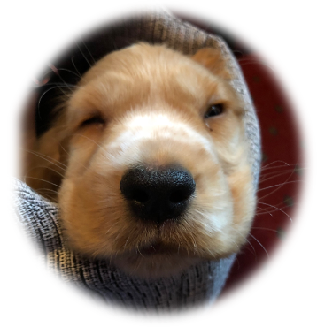

## Slide 7

Video clip: [milton insert puppies](https://profandyfield.github.io/statistics_lectures/ds_07_contrasts/media/milton_insert_puppies.mp4)

## Slide 8: A puppy-tastic example

- A puppy therapy RCT in which we randomized people into three groups:
  - A control group
  - 15 minutes of puppy therapy
  - 30 minutes of puppy contact
- The outcome is happiness (0 = unhappy) to 10 (happy).
- Predictions:
  - Any form of puppy therapy should be better than the control (i.e. higher happiness scores)
  - A dose-response hypothesis that as exposure time increases (from 15 to 30 minutes) happiness will increase too.


## Slide 9: Load and Look


|                            | No puppies | 15 mins | 30 mins |
|----------------------------|------------|---------|---------|
|                            | 3          | 5       | 7       |
|                            | 2          | 2       | 4       |
|                            | 1          | 4       | 5       |
|                            | 1          | 2       | 3       |
|                            | 4          | 3       | 6       |
| Mean                       | 2.20       | 3.20    | 5.00    |
| Variance (*s*<sup>2</sup>) | 1.70       | 1.70    | 2.50    |
| Standard deviation (*s*)   | 1.30       | 1.30    | 1.58    |

$`\text{Overall mean (} \bar{X}_\text{grand}\text{)} = 3.467`$


## Slide 10: The general linear model


### Dummy coding

| Therapy group | Long (30 mins vs. no puppies) | Short 1 (15 mins vs. no puppies) |
|----|----|----|
| No Puppies | 0 | 0 |
| 15 mins | 0 | 1 |
| 30 mins | 1 | 0 |

``` math
 \begin{aligned} \text{Happiness}_i &= \hat{b}_0 + \hat{b}_1\text{Long}_i + \hat{b}_2\text{Short}_i + e_i \end{aligned} 
```

## Slide 11: Visualize the ‘dummy’ model


## Slide 12: Visualize the ‘dummy’ model


## Slide 13: Visualize the ‘dummy’ model


## Slide 14: Fit the model

``` math
 \begin{aligned} \hat{\text{Happiness}}_i &= \hat{b}_0 + \hat{b}_1\text{Long}_i + \hat{b}_2\text{Short}_i \end{aligned} 
```

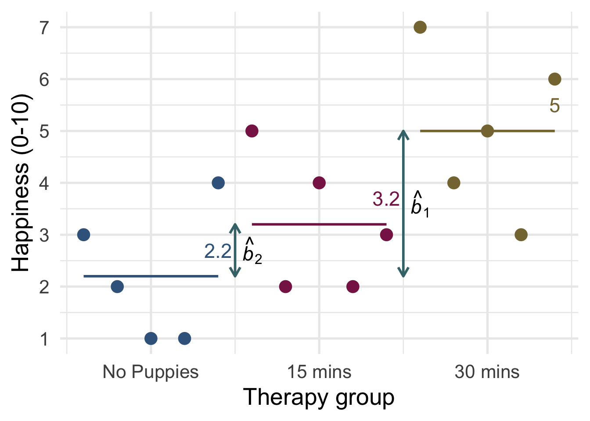

``` math
 \begin{aligned} \hat{b}_0 &= \bar{X}_\text{No puppies} = 2.2 \\ \hat{b}_1 &= 5.0-2.2 = 2.8 \\ \hat{b}_2 &= 3.2-2.2 = 1.0 \end{aligned} 
```

## Slide 15: Evaluate fit

``` r
# get F
anova(puppy_lm) |> 
  model_parameters(es_type = "omega", ci = 0.95) |> 
  display()
```

| Parameter | Sum_Squares | df  | Mean_Square | F    | p     | Omega2 | Omega2 95% CI |
|-----------|-------------|-----|-------------|------|-------|--------|---------------|
| dose      | 20.13       | 2   | 10.07       | 5.12 | 0.025 | 0.35   | (0.00, 1.00)  |
| Residuals | 23.60       | 12  | 1.97        |      |       |        |               |

``` r
# get R^2
model_performance(puppy_lm) |> 
  display()
```

| AIC  | AICc | BIC  | R2   | R2 (adj.) | RMSE | Sigma |
|------|------|------|------|-----------|------|-------|
| 57.4 | 61.4 | 60.2 | 0.46 | 0.37      | 1.25 | 1.40  |

## Slide 16: Evaluate assumptions

``` r
check_model(puppy_lm)
```

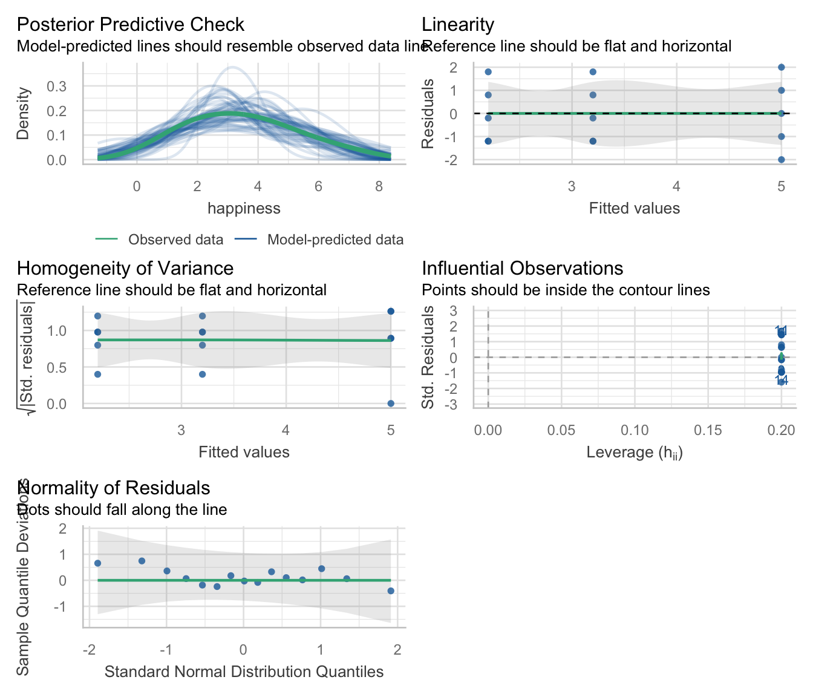


## Slide 17: Interpret parameter estimates, CIs and tests

``` r
model_parameters(puppy_lm) |> 
  display()
```

| Parameter      | Coefficient | SE   | 95% CI        | t(12) | p     |
|----------------|-------------|------|---------------|-------|-------|
| (Intercept)    | 2.20        | 0.63 | (0.83, 3.57)  | 3.51  | 0.004 |
| dose (15 mins) | 1.00        | 0.89 | (-0.93, 2.93) | 1.13  | 0.282 |
| dose (30 mins) | 2.80        | 0.89 | (0.87, 4.73)  | 3.16  | 0.008 |


## Slide 18: Planned contrasts

- The variability explained by the model, SS<sub>M</sub> is due to participants being assigned to different groups
  - This variability sometimes represents an experimental manipulation
- This variability (SS<sub>M</sub>) can be broken down further to test specific hypotheses about which groups might differ
- We break down the variance according to hypotheses made *a priori* (before the experiment)
- It’s like cutting up a cake (yum yum!)

## Slide 19

Video clip: [partitioning chocolate silent](https://profandyfield.github.io/statistics_lectures/ds_07_contrasts/media/partitioning_chocolate_silent.mp4)

## Slide 20: The cake analogy again

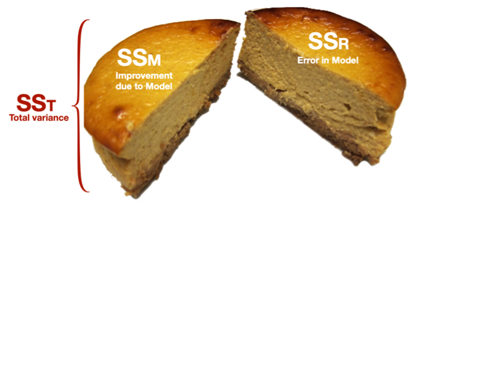

## Slide 21: The cake analogy again

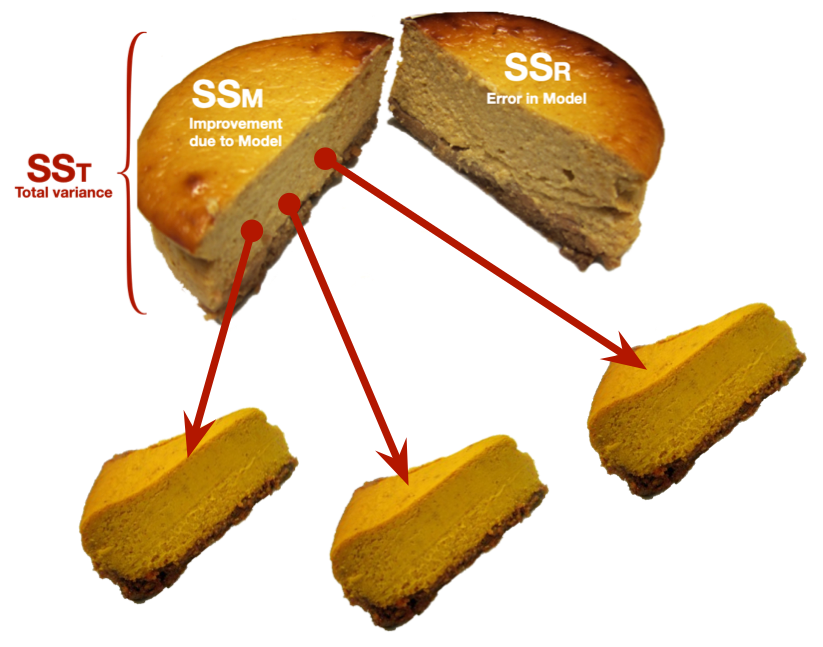

## Slide 22: Choosing contrasts

- Independent
  - To control Type I error rates contrasts must be independent (they must test unique hypotheses)
  - If a group is singled out in a contrast, then that group should not be used in any subsequent contrasts
- Only 2 Chunks
  - Each contrast should compare only 2 chunks of variation (why?)
- *K*-1
  - You should always end up with one less contrast than the number of groups

## Slide 23: How do I choose contrasts?

> **Note: Statis-tip**
>
> - Most experimental designs typically have one or more control groups
> - The logic of control groups means that we expect scores within them to differ from those in the groups we’ve manipulated
> - The first contrast will usually compare any control conditions (chunk 1) with any experimental ones (chunk 2)

## Slide 24

Video clip: [milton slideshow](https://profandyfield.github.io/statistics_lectures/ds_07_contrasts/media/milton_slideshow.mp4)

## Slide 25: Hypotheses

> **Caution: Think about it!**
>
> Hypothesis 1:
>
> - People who have puppy therapy will be happier (have have higher happiness scores) than those who don’t
> - Control $`\ne`$ (15 mins, 30 mins)

> **Caution: Think about it!**
>
> Hypothesis 2:
>
> - People receiving a high dose of puppy therapy (30 mins) will be happier than those receiving a low dose (15 mins)
> - 15 mins $`\ne`$ 30 mins

## Slide 26

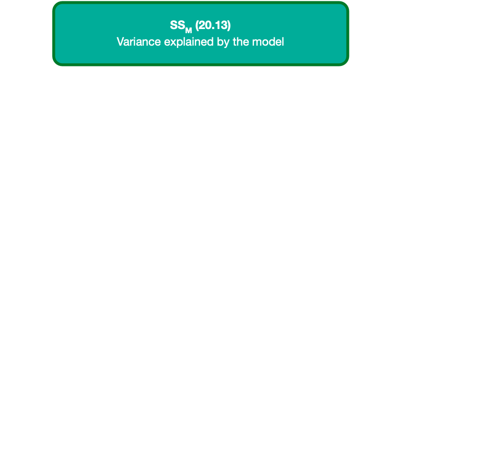

## Slide 27

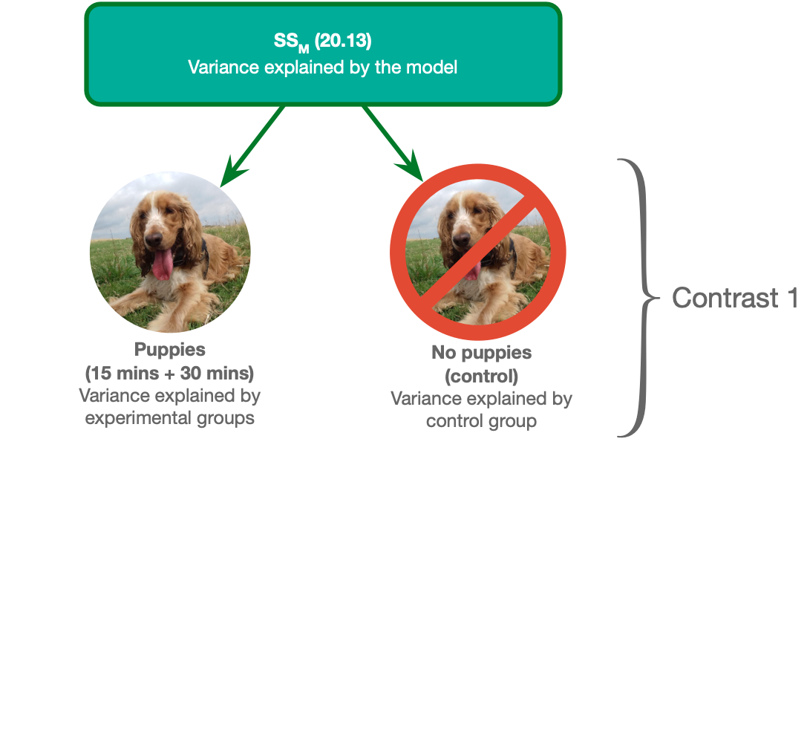

## Slide 28

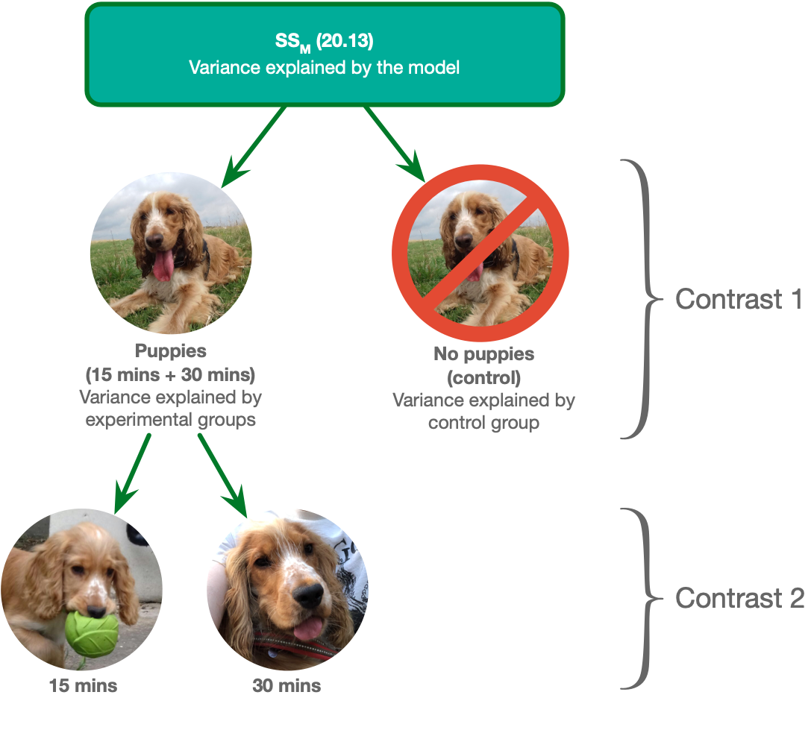

## Slide 29

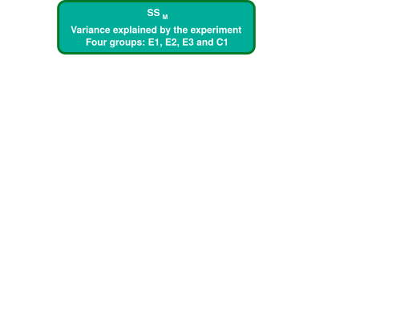

## Slide 30

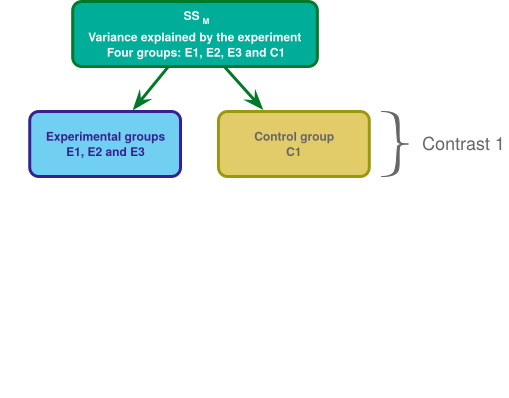

## Slide 31

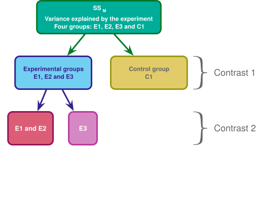

## Slide 32

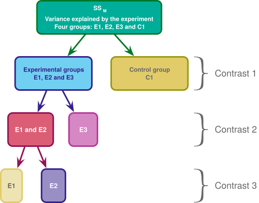

## Slide 33

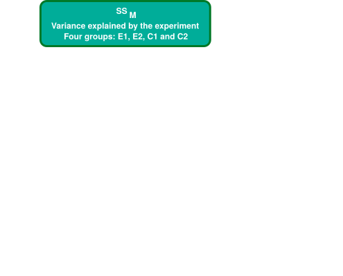

## Slide 34

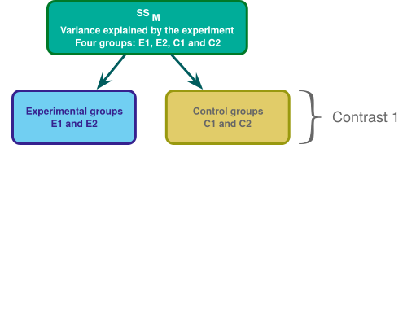

## Slide 35

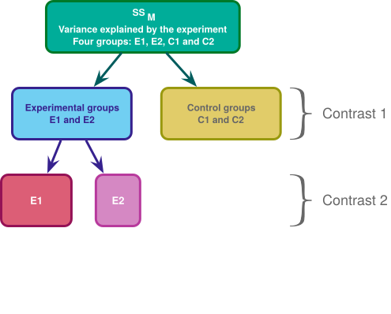

## Slide 36

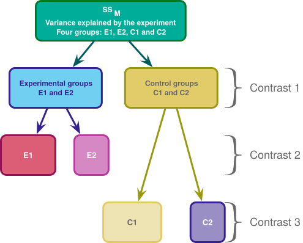

## Slide 37: Coding planned contrasts

- Rule 1
  - Groups coded with positive weights compared to groups coded with negative weights
- Rule 2
  - The sum of weights for a comparison should be zero
- Rule 3
  - If a group is not involved in a comparison, assign it a weight of zero
- Rule 4
  - For a given contrast, the **initial weight** assigned to the group(s) in one chunk of variation should be equal to the number of groups in the opposite chunk of variation
- Rule 5
  - To get the **final weight**, divide the initial weights by the number of groups with non-zero weights

## Slide 38

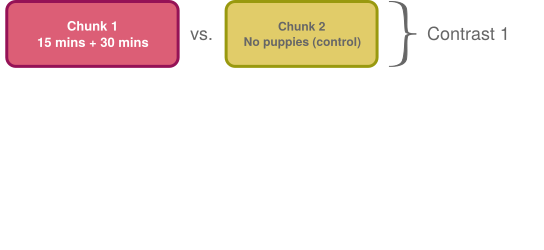

## Slide 39

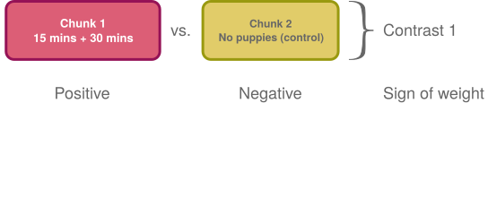

## Slide 40

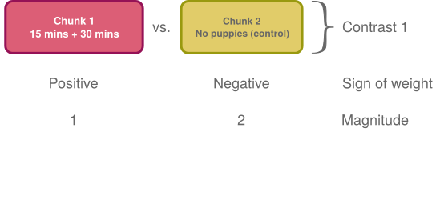

## Slide 41

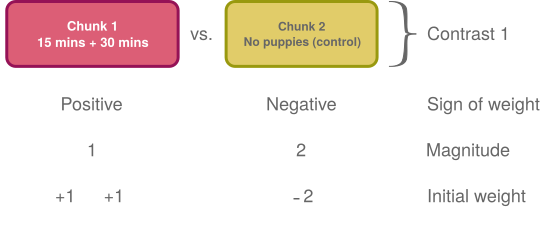

## Slide 42

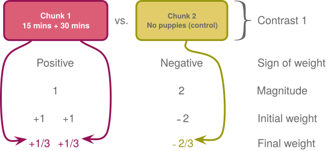

## Slide 43

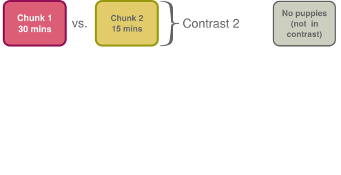

## Slide 44

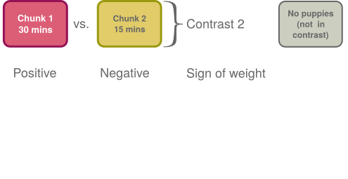

## Slide 45

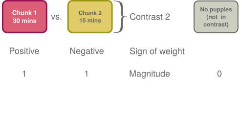

## Slide 46

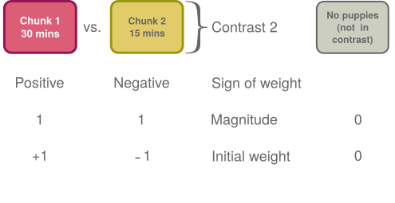

## Slide 47

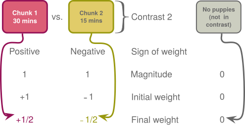

## Slide 48

Video clip: [lazinc durt your time will come](https://profandyfield.github.io/statistics_lectures/ds_07_contrasts/media/lazinc_durt_your_time_will_come.mp4)

## Slide 49: What the coding does


### Dummy coding

| Therapy group | Long (30 mins vs. no puppies) | Short 1 (15 mins vs. no puppies) |
|----|----|----|
| No Puppies | 0 | 0 |
| 15 mins | 0 | 1 |
| 30 mins | 1 | 0 |

### Contrast coding

| Therapy group | Contrast 1 (Puppies vs. no puppies) | Contrast 2 (15 mins vs. 30 mins) |
|----|----|----|
| No Puppies | -2/3 | 0 |
| 15 mins | 1/3 | -1/2 |
| 30 mins | 1/3 | 1/2 |

## Slide 50


### The ‘dummy’ model

``` math
 \begin{aligned} \hat{\text{Happiness}}_i &= \hat{b}_0 + \hat{b}_1\text{Long}_i + \hat{b}_2\text{Short}_i \\ \hat{\text{Happiness}}_i &= \hat{b}_0 + \hat{b}_1\text{30 vs. control}_i + \hat{b}_2\text{15 vs.control}_i\\ \end{aligned} 
```

### The ‘contrast’ model

``` math
 \begin{aligned} \hat{\text{Happiness}}_i &= \hat{b}_0 + \hat{b}_1\text{Contrast 1}_i + \hat{b}_2\text{Contrast 2}_i \\ \hat{\text{Happiness}}_i &= \hat{b}_0 + \hat{b}_1\text{Therapy vs. control}_i + \hat{b}_2\text{15 vs. 30 mins}_i \\ \end{aligned} 
```

## Slide 51: Visualize the ‘dummy’ model

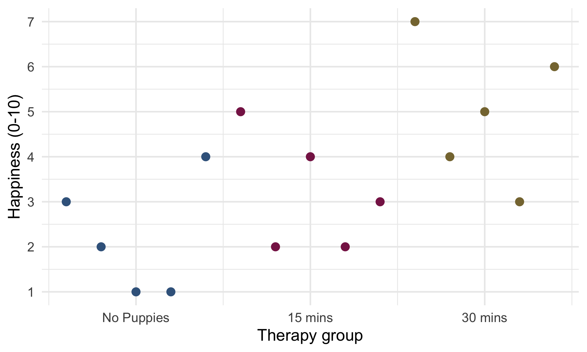


## Slide 52: Visualize the ‘dummy’ model

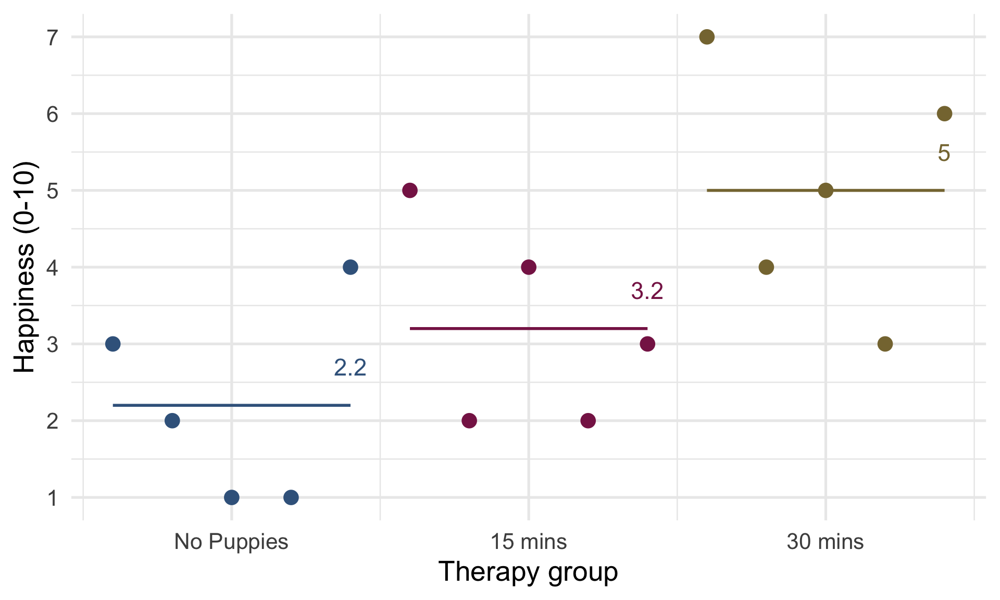


## Slide 53: Visualize the ‘dummy’ model

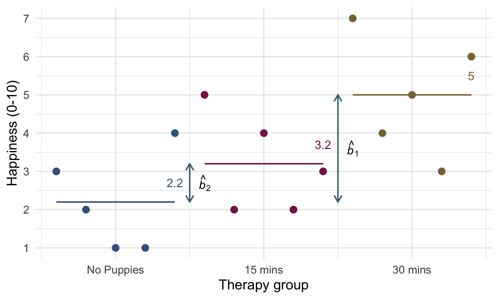


## Slide 54: Visualize the contrast model

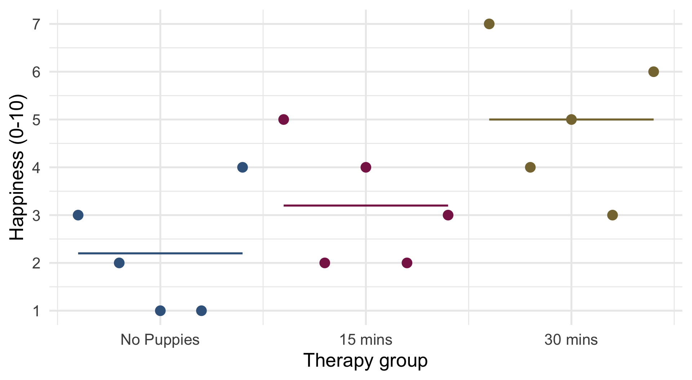


## Slide 55: Visualize contrast 1

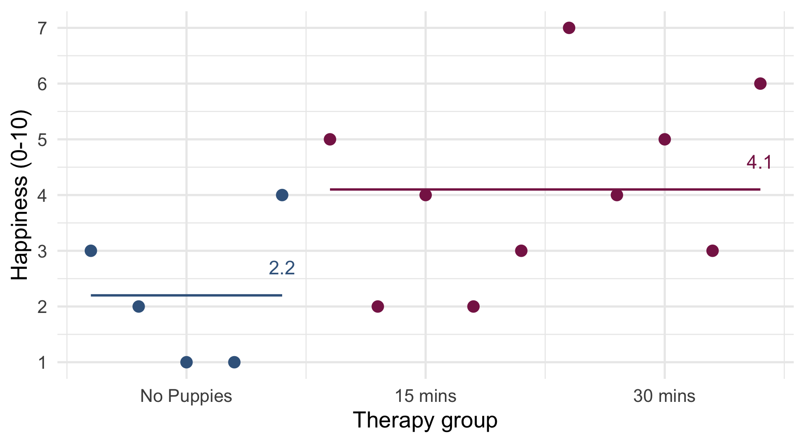


## Slide 56: Visualize contrast 1

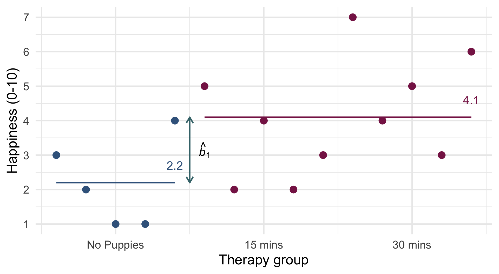

``` math
 \begin{aligned} \hat{b}_1 &= 4.1-2.2 = 1.9 \end{aligned} 
```


## Slide 57: Visualize contrast 2

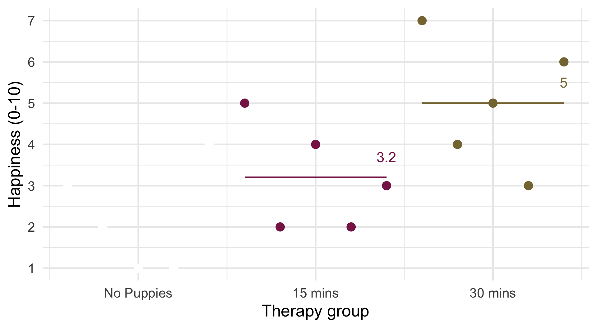


## Slide 58: Visualize contrast 2

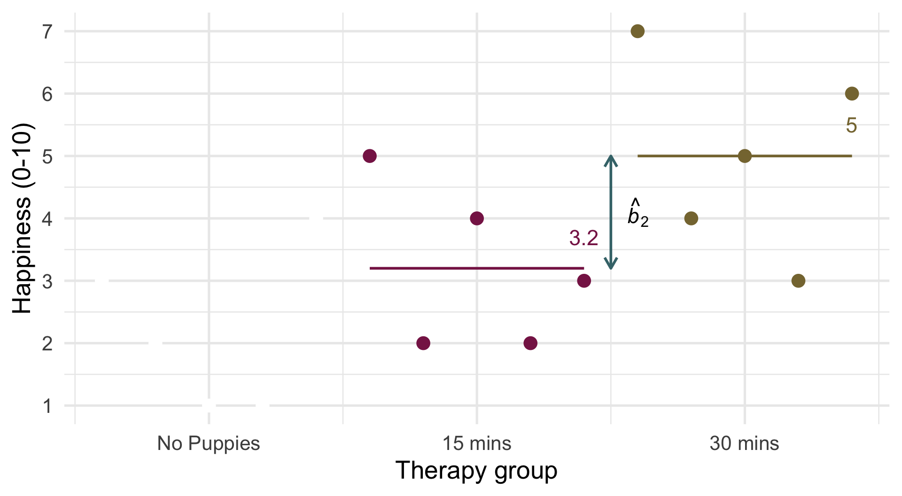

``` math
 \begin{aligned} \hat{b}_2 &= 5-3.2 = 1.8 \end{aligned} 
```

## Slide 59: Evaluate

> **Note: Statis-tip**
>
> - Changing the contrast codes will not affect the fit statistics or residual plots.


## Slide 60: Interpret parameter estimates, CIs and tests

``` r
puppy_vs_none <- c(-2/3, 1/3, 1/3)
long_vs_short <- c(0, -1/2, 1/2)

contrasts(puppy_tib$dose) <- cbind(puppy_vs_none, long_vs_short)

puppy_lm <- lm(happiness ~ dose, data = puppy_tib)
model_parameters(puppy_lm) |> 
  display()
```

| Parameter            | Coefficient | SE   | 95% CI        | t(12) | p       |
|----------------------|-------------|------|---------------|-------|---------|
| (Intercept)          | 3.47        | 0.36 | (2.68, 4.26)  | 9.57  | \< .001 |
| dose (puppy_vs_none) | 1.90        | 0.77 | (0.23, 3.57)  | 2.47  | 0.029   |
| dose (long_vs_short) | 1.80        | 0.89 | (-0.13, 3.73) | 2.03  | 0.065   |


> **Important: ReportR**
>
> Overall, happiness was significantly different across the three therapy groups, F(2, 12) = 5.12, *p* = 0.025, $`\hat{\omega}^2`$ = 0.35 (0.00, 1.00). Happiness was significantly different to zero in the no puppies group, $`\hat{b}`$ = 3.47 (2.68, 4.26), *t*(12) = 9.57, *p* \< 0.001. Happiness was significantly higher for those that had any puppy therapy compared to the no puppy control, $`\hat{b}`$ = 1.90 (0.23, 3.57), *t*(12) = 2.47, *p* = 0.029, but was not significantly different in the 30-minute therapy group compared to the 15-minute group, $`\hat{b}`$ = 1.80 (-0.13, 3.73), *t*(12) = 2.03, *p* = 0.065. A dose of puppies, therefore, appears to improve happiness compared to no puppies but the duration of therapy did not have a significant impact.

## Slide 61

Video clip: [milton insert snow](https://profandyfield.github.io/statistics_lectures/ds_07_contrasts/media/milton_insert_snow.mp4)

## Slide 62: Post hoc tests

- In the absence of specific hypotheses
  - Compare all pairs of means to see where the specific differences lie
- Problem
  - Inflates the Type I error rate

``` math
 \begin{aligned} \text{Familywise error} = 1-0.95^n \end{aligned} 
```

- Solution
  - Adjust the alpha (or test statistic) to be more conservative

``` math
 \begin{aligned} \text{Bonferroni} \ \alpha = \frac{\alpha}{\text{number of tests}} \end{aligned} 
```

## Slide 63: Post hoc tests

``` r
estimate_contrasts(puppy_lm, p_adjust = "bonferroni") |> 
  display()
```

| Level1  | Level2     | Difference | SE   | 95% CI        | t(12) | p     |
|---------|------------|------------|------|---------------|-------|-------|
| 15 mins | No puppies | 1.00       | 0.89 | (-0.93, 2.93) | 1.13  | 0.845 |
| 30 mins | No puppies | 2.80       | 0.89 | ( 0.87, 4.73) | 3.16  | 0.025 |
| 30 mins | 15 mins    | 1.80       | 0.89 | (-0.13, 3.73) | 2.03  | 0.196 |

Marginal Contrasts Analysis

## Slide 64: Trend analysis (Polynomial contrasts)

- Test for trends in the means
- Makes sense only for ordered groups

``` r
contrasts(puppy_tib$dose) <- contr.poly(3)
puppy_trend <- lm(happiness ~ dose, data = puppy_tib)

model_parameters(puppy_trend) |> 
  display()
```

| Parameter   | Coefficient | SE   | 95% CI        | t(12) | p       |
|-------------|-------------|------|---------------|-------|---------|
| (Intercept) | 3.47        | 0.36 | (2.68, 4.26)  | 9.57  | \< .001 |
| dose (.L)   | 1.98        | 0.63 | (0.61, 3.35)  | 3.16  | 0.008   |
| dose (.Q)   | 0.33        | 0.63 | (-1.04, 1.69) | 0.52  | 0.612   |

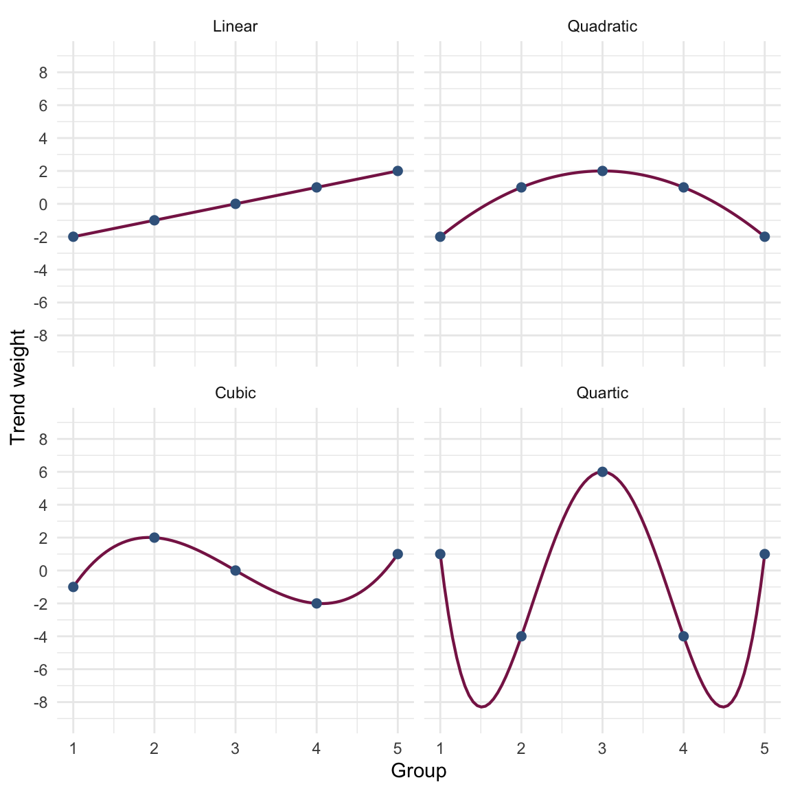

## Slide 65: Summary

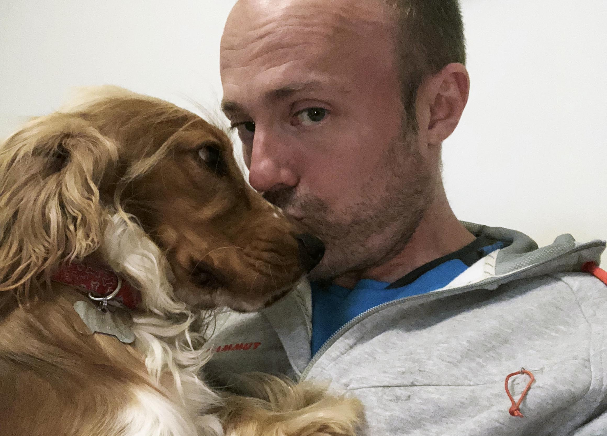

- Categorical predictors can be coded to test specific a priori hypotheses

- First devise contrasts to test your hypotheses

  - Independent
  - *K*-1 contrasts
  - Each compares 2 ‘chunks’ -Assign ‘weights’ to each group within each contrast
  - Assign 1 chunk positive values and the other negative
  - Assign an initial weight equal to the number of conditions in the opposite chunk
  - Divide the initial weight by the number of groups with non-zero weights

- *Post hoc* tests

  - Compare all pairs of group means but adjusting for multiple tests

- Polynomial contrasts (trend analysis)

  - Test for trends in the means of ordered categories
