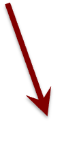
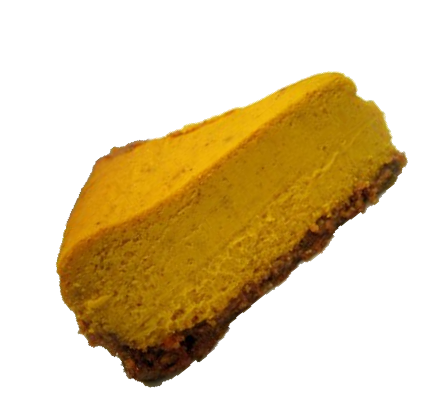
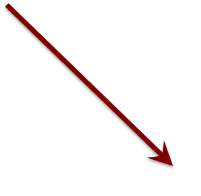
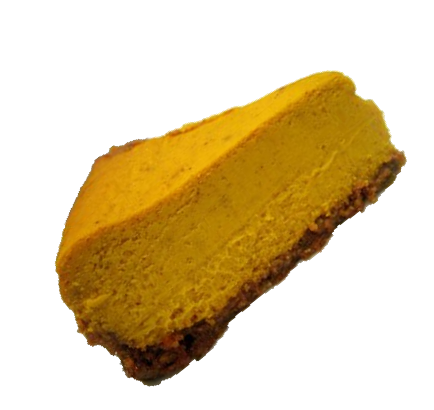
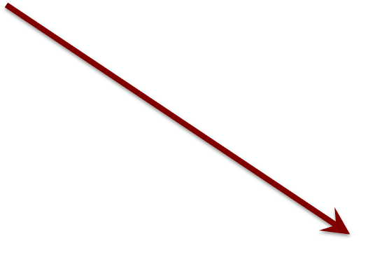

## The cake analogy again

{.absolute width=500 left=0 top="100"}

::: fragment

{.absolute width=250 left=100 top="350"}
{.absolute width=75 left=150 top="350"}

:::
::: fragment

{.absolute width=250 left=350 top="350"}
{.absolute width=150 left=300 top="280"}

:::
::: fragment

{.absolute width=250 left=600 top="350"}
{.absolute width=250 left=500 top="245"}

:::
