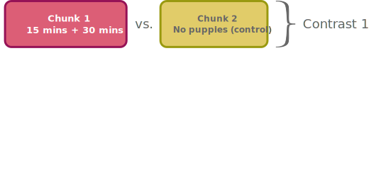
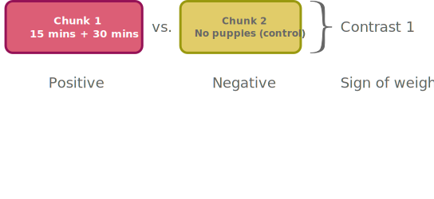
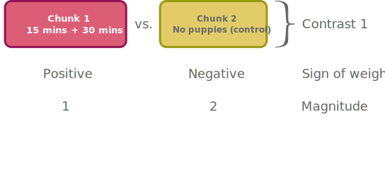
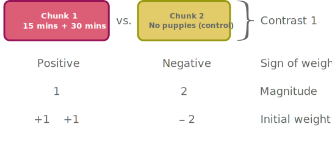
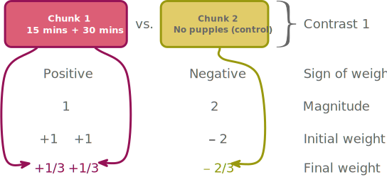
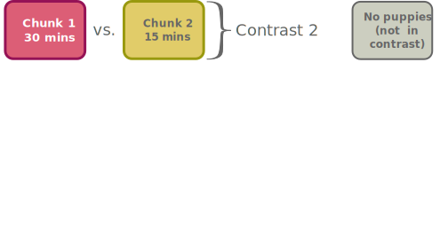
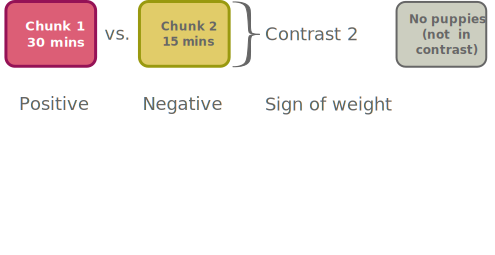
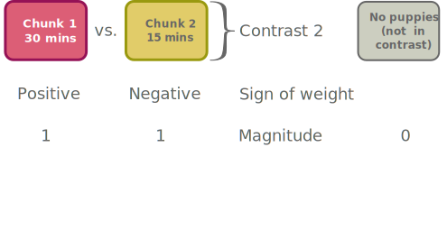
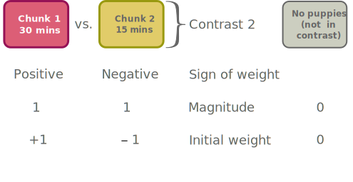
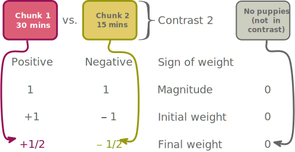

{fig-align="center" height=600}

##

{fig-align="center" height=600}

##

{fig-align="center" height=600}

##

{fig-align="center" height=600}

##

{fig-align="center" height=600}

##

{fig-align="center" height=600}

##

{fig-align="center" height=600}

##

{fig-align="center" height=600}

## 

{fig-align="center" height=600}

##

{fig-align="center" height=600}

