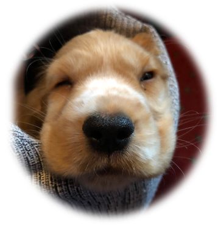
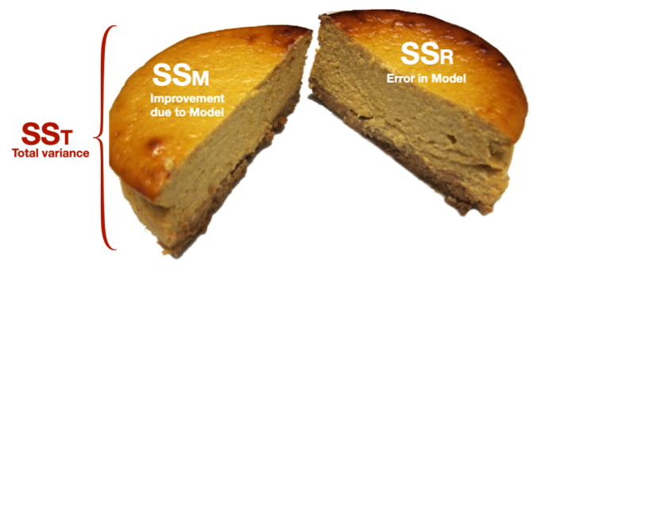
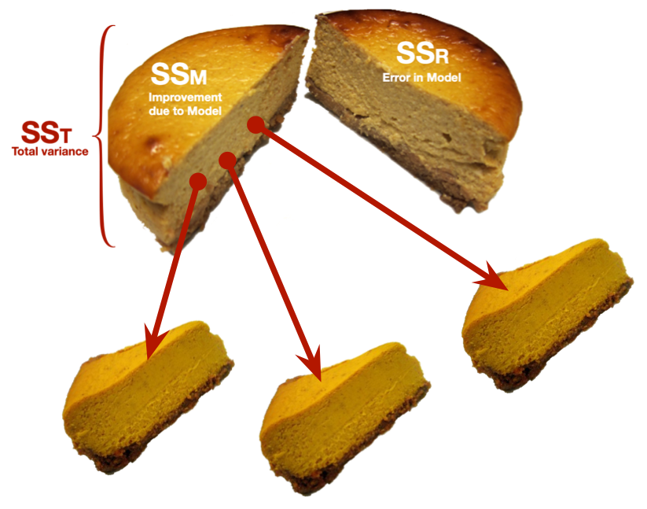

```{r}
# general
library(easystats)
library(tidyverse)
# specific
library(gt)

source("../helpers/discovr_helpers.R")
source("../helpers/easystats_helpers.R")

# get data
puppy_tib <- discovr::puppies
```


##  Learning outcomes 

::: fragment

- Explain the different ways to break down categorical predictors in a linear model
  - Planned contrasts/comparisons)
  - Choosing contrasts
  - Contrast coding
  
:::

::: fragment

- *Post hoc* tests

:::
::: fragment

- Polynomial contrasts (trend analysis)

:::

::: notes
Use C to toggle pen/markup
Use backspace to delete markup
Use f to toggle fullscreen
:::


## 

::: r-stack
{.fragment fig-align="center" width="1050" height="594"}

{.fragment fig-align="center" width="1050" height="594"}
:::


##

{fig-align="center" height=600}

## Contrast coding

::: incremental

- The *F*-statistic tests the overall fit of the model
  - i.e. It is a general test of model fits/whether group means significantly differ
- Model parameters tells us about specific differences between means
  - Dummy coding compares each category to a baseline
- What do we do when dummy coding does not reflect our *a priori* hypotheses?

:::

## Options for breaking down categorical predictors

::: fragment

-  Orthogonal contrasts (contrast coding)
  - Hypothesis driven
  - Planned *a priori*
  - Control Type I error rate

:::
::: fragment

- *Post hoc* tests
  - Not planned (not hypothesis driven)
  - Compare all pairs of means
  - Multiple *t*-tests adjusted for the number of tests

:::
::: fragment

- Trend analysis
  - Useful only for ordered means

:::

{.absolute width=250 left=750 top=100}

## {background-video="media/milton_insert_puppies.mp4" background-size="cover"}


## A puppy-tastic example


- A puppy therapy RCT in which we randomized people into three groups:
  - A control group
  - 15 minutes of puppy therapy
  - 30 minutes of puppy contact

::: fragment

- The outcome is happiness (0 = unhappy) to 10 (happy).

:::
::: fragment

- Predictions:
  - Any form of puppy therapy should be better than the control (i.e. higher happiness scores)
  - A dose-response hypothesis that as exposure time increases (from 15 to 30 minutes) happiness will increase too.

:::

{.absolute width=250 left=750 top=100}

## [L]{.txt_mulberry}oad and [L]{.txt_mulberry}ook {background-image="media/milton_20190724_155300.JPG" background-size="cover"}

{.absolute top=0 left=800 height="80"}

```{r}
puppy_means <- puppy_tib |>
  group_by(dose) |> 
  summarize(
    mean = mean(happiness)
  )

mean_none <- puppy_means[1, 2] |> pull()
mean_15 <- puppy_means[2, 2] |> pull()
mean_30 <- puppy_means[3, 2] |> pull()
```


::: tbl_l
```{r}
puppies_dt <- puppy_tib |>
  select(dose, happiness) |>
  mutate(row = rep(1:5, 3)) |> 
  pivot_wider(
    id_cols = row,
    names_from = dose,
    values_from = happiness
  ) |>
  select(-row) |> 
  gt() |> 
  cols_align(
    align = "center"
    ) 

puppies_dt |>
  grand_summary_rows(
    columns = c(`No puppies`, `15 mins`, `30 mins`),
    fns = list(
      list(label = "Mean") ~ mean(.),
      list(label = md("Variance (*s*^2^)")) ~ var(.),
      list(label = md("Standard deviation (*s*)")) ~ sd(.)
      ),
    fmt = ~fmt_number(., decimals = 2)
  ) |> 
  tab_style(
    style = list(
      cell_fill(color = mulberry, alpha = 0.8),
      cell_text(weight = "bold", color = "white")
      ),
    locations = cells_grand_summary(
      columns = vars(`No puppies`, `15 mins`, `30 mins`),
      rows = 1
    )
    )

```
:::

<br>

::: center-h
::: txt_dk_bg
::: txt_white
::: txt_l
$\text{Overall mean (} \bar{X}_\text{grand}\text{)} = 3.467$
:::
:::
:::
:::

{.absolute top=0 left=800 height="80"}

## The general linear model {background-image="media/milton_20190801_160443.JPG" background-size="cover"}

### Dummy coding

::: fragment

```{r}
dum_tbl <- tibble::tibble(
  `Therapy group` = c("No Puppies", "15 mins", "30 mins"),
  `Long (30 mins vs. no puppies)` = c(0, 0, 1),
  `Short 1 (15 mins vs. no puppies)` = c(0, 1, 0),
)

dum_tbl |> 
  knitr::kable(align = "lcc") |> 
  kableExtra::row_spec(0:3, background = "white")
```

:::

<br>

::: fragment
::: txt_dk_bg
::: txt_white
::: txt_l
$$
\begin{aligned}
\text{Happiness}_i &= \hat{b}_0 + \hat{b}_1\text{Long}_i + \hat{b}_2\text{Short}_i + e_i
\end{aligned}
$$

:::
:::
:::
:::

```{r, child = "puppy_dummy_model.qmd"}

```

## Fit the model

::: center-h
::: txt_mulberry
::: txt_l
$$
\begin{aligned}
\hat{\text{Happiness}}_i &= \hat{b}_0 + \hat{b}_1\text{Long}_i + \hat{b}_2\text{Short}_i
\end{aligned}
$$
:::
:::
:::


:::: columns 
::: {.column width="60%"}
```{r}
#| fig-width: 7
#| fig-height: 5
puppy_plot_ano_full
```
:::

::: {.column width="40%"}
::: fragment
::: txt_mulberry
::: txt_l
$$
\begin{aligned}
\hat{b}_0 &= \bar{X}_\text{No puppies} = 2.2 \\
\hat{b}_1 &= 5.0-2.2 = 2.8 \\
\hat{b}_2 &= 3.2-2.2 = 1.0 
\end{aligned}
$$

:::
:::
:::
:::
::::

::: txt_xl

```{r}
puppy_lm <- lm(happiness ~ dose, data = puppy_tib)
```
:::


## [E]{.txt_mulberry}valuate fit

```{r}
#| echo: true
#| eval: false

# get F
anova(puppy_lm) |> 
  model_parameters(es_type = "omega", ci = 0.95) |> 
  display()
```

\


```{r}
#| echo: false

# get F
anova(puppy_lm) |> 
  model_parameters(es_type = "omega", ci = 0.95) |> 
  display(footer = "")
```


\

```{r}
#| echo: true
#| eval: false

# get R^2
model_performance(puppy_lm) |> 
  display()
```

\


```{r}
#| echo: false

# get R^2
model_performance(puppy_lm) |> 
  display()
```


## [E]{.txt_mulberry}valuate assumptions

::: center-h
```{r}
#| echo: true
#| message: false
#| warning: false
#| fig-width: 7
#| fig-height: 6

check_model(puppy_lm)
```
:::

{.absolute top=0 left=800 height="80"}

## [I]{.txt_mulberry}nterpret parameter estimates, CIs and tests


```{r}
#| echo: true

model_parameters(puppy_lm) |> 
  display()
```


{.absolute top=0 left=900 height="80"}


## Planned contrasts

- The variability explained by the model, SS~M~ is due to participants being assigned to different groups
  - This variability sometimes represents an experimental manipulation

::: fragment

- This variability (SS~M~) can be broken down further to test specific hypotheses about which groups might differ

:::
::: fragment

- We break down the variance according to hypotheses made *a priori* (before the experiment)

:::
::: fragment

- It’s like cutting up a cake (yum yum!)

:::

## {background-video="media/partitioning_chocolate_silent.mp4" background-size="cover"}


## The cake analogy again

{fig-align="center" height=600}

## The cake analogy again

{fig-align="center" height=600}

## Choosing contrasts

- Independent
  - To control Type I error rates contrasts must be independent (they must test unique hypotheses)
  - If a group is singled out in a contrast, then that group should not be used in any subsequent contrasts

::: fragment

- Only 2 Chunks
    - Each contrast should compare only 2 chunks of variation (why?)

:::
::: fragment

- *K*-1
  - You should always end up with one less contrast than the number of groups

:::

## How do I choose contrasts?

::: {.callout-note icon = false}
##  Statis-tip

- Most experimental designs typically have one or more control groups
- The logic of control groups means that we expect scores within them to differ from those in the groups we've manipulated
- The first contrast will usually compare any control conditions (chunk 1) with any experimental ones (chunk 2)

:::

::: notes
In our puppy therapy example, what hypotheses might we have?
Think about that during interlude
:::

## {background-video="media/milton_slideshow.mp4" background-size="cover"}

## Hypotheses

::: {.callout-caution icon = false}
##  Think about it!

Hypothesis 1:

- People who have puppy therapy will be happier (have have higher happiness scores) than those who don’t
- Control $\ne$ (15 mins, 30 mins)

:::

::: fragment
::: {.callout-caution icon = false}
##  Think about it!

Hypothesis 2:

- People receiving a high dose of puppy therapy (30 mins) will be happier than those receiving a low dose (15 mins)
- 15 mins $\ne$ 30 mins

:::
:::


##

```{r, child = "partitioning_ssm.qmd"}

```

## Coding planned contrasts

- Rule 1
  - Groups coded with positive weights compared to groups coded with negative weights

::: fragment

- Rule 2
  - The sum of weights for a comparison should be zero

:::
::: fragment

- Rule 3
  - If a group is not involved in a comparison, assign it a weight of zero

:::
::: fragment

- Rule 4
  - For a given contrast, the **initial weight** assigned to the group(s) in one chunk of variation should be equal to the number of groups in the opposite chunk of variation

:::
::: fragment

- Rule 5
  - To get the **final weight**, divide the initial weights by the number of groups with non-zero weights

:::

##

```{r, child = "contrast_codes.qmd"}

```

## {background-video="media/lazinc_durt_your_time_will_come.mp4" background-size="cover"}

## [What the coding does]{.txt_ong} {background-image="media/milton_20190623_191707.jpg" background-size="cover"}

::: fragment

### [Dummy coding]{.txt_white}

::: center-h
```{r}
dum_tbl |> 
  knitr::kable(align = "lcc") |> 
  kableExtra::row_spec(0:3, background = "white")
```
:::

:::

<br>

::: fragment

### [Contrast coding]{.txt_white}

::: center-h
```{r}
con_tbl <- tibble::tibble(
  `Therapy group` = c("No Puppies", "15 mins", "30 mins"),
  `Contrast 1 (Puppies vs. no puppies)` = c("-2/3", "1/3", "1/3"),
  `Contrast 2 (15 mins vs. 30 mins)` = c("0", "-1/2", "1/2")
)

con_tbl |> 
  knitr::kable(align = "lcc") |> 
  kableExtra::row_spec(0:3, background = "white")
```
:::
:::

## {background-image="media/milton_dawlish_beach_2018.JPG" background-size="cover"}

:::: txt_white
### [The 'dummy' model]{.txt_white}

::: txt_dk_bg
::: center-h
::: txt_l
$$
\begin{aligned}
\hat{\text{Happiness}}_i &= \hat{b}_0 + \hat{b}_1\text{Long}_i + \hat{b}_2\text{Short}_i \\
\hat{\text{Happiness}}_i &= \hat{b}_0 + \hat{b}_1\text{30 vs. control}_i + \hat{b}_2\text{15 vs.control}_i\\
\end{aligned}
$$
:::
:::
:::

<br>

::: fragment

### [The 'contrast' model]{.txt_white}

::: txt_dk_bg
::: center-h
::: txt_l
$$
\begin{aligned}
\hat{\text{Happiness}}_i &= \hat{b}_0 + \hat{b}_1\text{Contrast 1}_i + \hat{b}_2\text{Contrast 2}_i \\
\hat{\text{Happiness}}_i &= \hat{b}_0 + \hat{b}_1\text{Therapy vs. control}_i + \hat{b}_2\text{15 vs. 30 mins}_i \\
\end{aligned}
$$
:::
:::
:::
:::
::::


```{r, child = "puppy_dummy_model.qmd"}

```

## [V]{.txt_mulberry}isualize the contrast model

```{r}
puppy_tib <- puppy_tib |> 
  mutate(
    c1 = ifelse(dose == "No puppies", "No puppies", "Puppies")
  )

mean_puppies <- subset(puppy_tib, c1 == "Puppies")$happiness |> mean()
```

```{r}
#| fig-width: 10
#| fig-height: 5.5

puppy_plot_ano
```


{.absolute top=0 left=800 height="80"}

## [V]{.txt_mulberry}isualize contrast 1

```{r}
#| fig-width: 10
#| fig-height: 5.5

c1_plot <- ggplot(puppy_tib, aes(id_num, happiness, colour = c1)) +
  geom_point(size = 4) +
  labs(x = "Therapy group", y = "Happiness (0-10)") +
  scale_x_continuous(breaks = c(3, 8, 13), labels = c("No Puppies", "15 mins", "30 mins")) +
  scale_colour_manual(values = c(blue, mulberry, brown)) +
  scale_y_continuous(breaks = seq(0, 10, 1)) +
  theme_minimal(base_size = 20) +
  theme(legend.position = "none")

c1_plot_means <- c1_plot +
  annotate("segment", x = 1, y = mean_none, xend = 5, yend = mean_none, size = 1, colour = blue) + 
  annotate("segment", x = 6, y = mean_puppies, xend = 15, yend = mean_puppies, size = 1, colour = mulberry) +
  annotate("text", x = 5, y = mean_none + 0.5, size = 6, colour = blue, label = mean_none) + 
  annotate("text", x = 15, y = mean_puppies + 0.5, size = 6, colour = mulberry, label = mean_puppies)

c1_plot_means
```

{.absolute top=0 left=800 height="80"}

## [V]{.txt_mulberry}isualize contrast 1

```{r}
#| fig-width: 10
#| fig-height: 5.5

c1_plot_means +
  annotate("text", x = 6, y = (mean_puppies + mean_none)/2, label = deparse(bquote(hat(italic(b))[1])), parse = TRUE, size = 6) +
  annotate("segment", x = 5.5, y = mean_puppies, xend = 5.5, yend = mean_none, colour = green, size = 1, arrow = arrow(length = unit(0.03, "npc"), ends = "both"))
```

::: txt_mulberry
$$
\begin{aligned}
\hat{b}_1 &= 4.1-2.2 = 1.9
\end{aligned}
$$
:::

{.absolute top=0 left=800 height="80"}

## [V]{.txt_mulberry}isualize contrast 2

```{r}
#| fig-width: 10
#| fig-height: 5.5

c2_plot <- puppy_plot +
  scale_colour_manual(values = c("white", mulberry, brown))

c2_plot_means <- c2_plot +
  annotate("segment", x = 6, y = mean_15, xend = 10, yend = mean_15, size = 1, colour = mulberry) +
  annotate("segment", x = 11, y = mean_30, xend = 15, yend = mean_30, size = 1, colour = brown) +
  annotate("text", x = 10, y = mean_15 + 0.5, size = 6, colour = mulberry, label = mean_15) +
  annotate("text", x = 15, y = mean_30 + 0.5, size = 6, colour = brown, label = mean_30)

c2_plot_means
```

{.absolute top=0 left=800 height="80"}

## [V]{.txt_mulberry}isualize contrast 2

```{r}
#| fig-width: 10
#| fig-height: 5.5

c2_plot_means +
  annotate("text", x = 11, y = (mean_15 + mean_30)/2, label = deparse(bquote(hat(italic(b))[2])), parse = TRUE, size = 6) +
  annotate("segment", x = 10.5, y = mean_15, xend = 10.5, yend = mean_30, colour = green, size = 1, arrow = arrow(length = unit(0.03, "npc"), ends = "both"))
```


::: txt_mulberry
$$
\begin{aligned}
\hat{b}_2 &= 5-3.2 = 1.8
\end{aligned}
$$
:::

## [E]{.txt_mulberry}valuate

::: txt_xl
::: {.callout-note icon = false}
##  Statis-tip

- Changing the contrast codes will not affect the fit statistics or residual plots.

:::
:::

{.absolute top=0 left=800 height="80"}

## [I]{.txt_mulberry}nterpret parameter estimates, CIs and tests

```{r}
#| echo: true

puppy_vs_none <- c(-2/3, 1/3, 1/3)
long_vs_short <- c(0, -1/2, 1/2)

contrasts(puppy_tib$dose) <- cbind(puppy_vs_none, long_vs_short)

puppy_lm <- lm(happiness ~ dose, data = puppy_tib)
model_parameters(puppy_lm) |> 
  display()
```

{.absolute top=0 left=900 height="80"}

```{r}
#| results: hide
#| message: false

con_aov <- anova(puppy_lm) |> 
  model_parameters(es_type = "omega", ci = 0.95)

con_par <- model_parameters(puppy_lm)
```


:::{.callout-important icon=false}
##  Report`r rproj()`

Overall, happiness was significantly different across the three therapy groups, `r report_ez_aov(con_aov)`. Happiness was significantly different to zero in the no puppies group, `r report_pe(con_par, row = 1)`. Happiness was significantly higher for those that had any puppy therapy compared to the no puppy control, `r report_pe(con_par, row = 2)`, but was not significantly different in the 30-minute therapy group compared to the 15-minute group, `r report_pe(con_par, row = 3)`. A dose of puppies, therefore, appears to improve happiness compared to no puppies but the duration of therapy did not have a significant impact.

:::


## {background-video="media/milton_insert_snow.mp4" background-size="cover"}


## *Post hoc* tests

- In the absence of specific hypotheses
  - Compare all pairs of means to see where the specific differences lie

::: fragment

- Problem
  - Inflates the Type I error rate
  
::: center-h
::: txt_mulberry
::: txt_l
$$
\begin{aligned}
\text{Familywise error} = 1-0.95^n
\end{aligned}
$$
:::
:::
:::
:::

::: fragment

- Solution
  - Adjust the alpha (or test statistic) to be more conservative
  
::: center-h
::: txt_mulberry
::: txt_l

$$
\begin{aligned}
\text{Bonferroni} \ \alpha = \frac{\alpha}{\text{number of tests}} 
\end{aligned}
$$
:::
:::
:::
:::

## *Post hoc* tests


```{r}
#| echo: true
#| eval: false

estimate_contrasts(puppy_lm, p_adjust = "bonferroni") |> 
  display()
```


```{r}

estimate_contrasts(puppy_lm, p_adjust = "bonferroni") |> 
  display(footer = "")
```

## Trend analysis (Polynomial contrasts)

:::: columns 
::: {.column width="50%"}
- Test for trends in the means
- Makes sense only for ordered groups

::: tbl_s
```{r}
#| echo: true

contrasts(puppy_tib$dose) <- contr.poly(3)
puppy_trend <- lm(happiness ~ dose, data = puppy_tib)

model_parameters(puppy_trend) |> 
  display()
```
:::
:::

::: {.column width="50%"}
```{r}
#| fig-width: 6
#| fig-height: 6

poly_tib <- tibble::tibble(
  name = c(rep("Linear", 5), rep("Quadratic", 5), rep("Cubic", 5), rep("Quartic", 5)) |> 
             forcats::as_factor(),
  group_num = rep(1:5, 4),
  weight = c(-2, -1, 0, 1, 2, -2, 1, 2, 1, -2, -1, 2, 0, -2, 1, 1, -4, 6,-4, 1)
  )

ggplot(poly_tib, aes(group_num, weight)) +
  facet_wrap(~name, ncol = 2) +
  geom_smooth(method = "lm", data = subset(poly_tib, name =="Linear"), colour = mulberry, size = 0.75) +
  geom_smooth(method = "lm", formula = y ~ poly(x, 2), data = subset(poly_tib, name =="Quadratic"), colour = mulberry, size = 0.75) +
  geom_smooth(method = "lm", formula = y ~ poly(x, 3), data = subset(poly_tib, name =="Cubic"), colour = mulberry, size = 0.75) +
  geom_smooth(method = "lm", formula = y ~ poly(x, 4), data = subset(poly_tib, name =="Quartic"), colour = mulberry, size = 0.75) +
  geom_point(size = 2, colour = blue) +
  scale_y_continuous(limits=c(-9, 9), breaks=seq(-8, 8, 2)) +
  scale_x_continuous(limits=c(1, 5), breaks=1:5) +
  labs(x = "Group", y = "Trend weight") +
  theme_minimal()
```
:::
::::


## Summary {background-image="media/andy_kissing_milton_20180831_processed.jpg" background-size="cover"}

::: txt_dk_bg

- Categorical predictors can be coded to test specific a priori hypotheses

- First devise contrasts to test your hypotheses
  - Independent
  - *K*-1 contrasts
  - Each compares 2 'chunks'
-Assign ‘weights’ to each group within each contrast
  - Assign 1 chunk positive values and the other negative
  - Assign an initial weight equal to the number of conditions in the opposite chunk
  - Divide the initial weight by the number of groups with non-zero weights
- *Post hoc* tests
  - Compare all pairs of group means but adjusting for multiple tests
- Polynomial contrasts (trend analysis)
  - Test for trends in the means of ordered categories

:::
