# Comparing means adjusted for other predictors

**including Analysis of Covariance**

Professor Andy Field, University of Sussex

Links: [primus too many puppies](https://profandyfield.github.io/statistics_lectures/ds_08_adjusted_means/media/primus_too_many_puppies.mp3) \| [bsky.app](https://bsky.app/profile/profandyfield.bsky.social) \| [youtube.com](https://www.youtube.com/user/ProfAndyField) \| [discoveringstatistics.com](https://www.discoveringstatistics.com) \| [discovr.rocks](https://www.discovr.rocks) \| [statisticsadventure.com](https://www.statisticsadventure.com)

## About this version

This is a plain-text version of the lecture slides. Each slide starts with a heading such as “Slide 5”, and the numbers match the slide numbers shown in the lecture. Content that appeared one piece at a time, in columns or in tabs is shown in reading order. Videos and interactive apps are given as links.

## Slide 2: Learning outcomes

- Describe the non-parallel slopes model
- Describe the parallel slopes model
- Explain how to compare means adjusting for other predictors using a linear model
  - Linear model with a categorical and continuous predictor
  - a.k.a. analysis of covariance (ANCOVA)
- Type I vs. Type III sums of squares
- Interpreting the model
  - Main effects
  - Covariates

## Slide 3


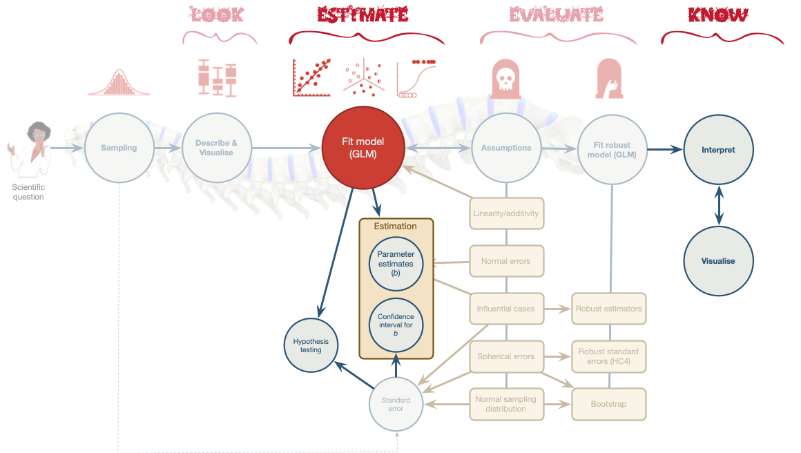

## Slide 4: Extending the puppy example

- A puppy therapy RCT
  - A no puppies control group
  - 15 minutes of puppy therapy
  - 30 minutes of puppy therapy
- Outcome variable
  - Happiness (0 = unhappy to 10 = happy) **after** (*post*) treatment
- Continuous predictor
  - Happiness (0 = unhappy to 10 = happy) **before** (*pre*) treatment

## Slide 5: The data

|     | id    | dose       | pre_happy | post_happy |
|-----|-------|------------|-----------|------------|
| 1   | 1dl4x | 15 mins    | 2         | 3          |
| 2   | nafnu | No puppies | 2         | 2          |
| 3   | 213u4 | 15 mins    | 3         | 2          |
| 4   | 0g144 | 15 mins    | 6         | 6          |
| 5   | g6216 | 15 mins    | 5         | 8          |
| 6   | mw911 | No puppies | 2         | 2          |
| 7   | ov70d | No puppies | 4         | 3          |
| 8   | 8v8y1 | No puppies | 5         | 4          |
| 9   | g1mhs | 30 mins    | 3         | 5          |
| 10  | 2c432 | 15 mins    | 6         | 5          |
| 11  | 6r4is | 15 mins    | 4         | 4          |
| 12  | 3v2jl | 15 mins    | 3         | 4          |
| 13  | 75477 | No puppies | 7         | 7          |
| 14  | 8g05h | 30 mins    | 2         | 4          |
| 15  | 83g9a | 15 mins    | 5         | 4          |
| 16  | l8sxg | 30 mins    | 2         | 4          |
| 17  | 1209t | No puppies | 1         | 2          |
| 18  | 85y83 | 15 mins    | 6         | 2          |
| 19  | 06558 | 15 mins    | 5         | 7          |
| 20  | 94fd8 | No puppies | 5         | 5          |
| 21  | 76g3e | No puppies | 4         | 2          |
| 22  | 61xkp | 15 mins    | 3         | 6          |
| 23  | 9gf5g | 30 mins    | 4         | 5          |
| 24  | miu7f | No puppies | 1         | 2          |
| 25  | 2yg6b | 30 mins    | 1         | 3          |
| 26  | 1jkqm | 15 mins    | 1         | 3          |
| 27  | 5y5jy | 15 mins    | 3         | 4          |
| 28  | y1q8f | 30 mins    | 2         | 4          |
| 29  | 6ide8 | 30 mins    | 6         | 7          |
| 30  | o84p7 | 30 mins    | 5         | 7          |

Table 1: Data for the puppy therapy example

## Slide 6: The parallel slopes model

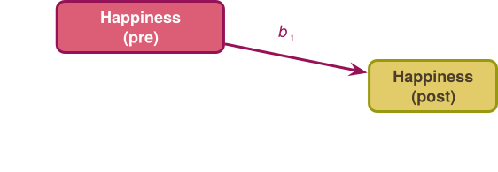

``` math
 \begin{aligned} \text{happy (post)}_i &= \hat{b}_0 + \hat{b}_1\text{happy (pre)}_i + e_i\\ \end{aligned} 
```

## Slide 7: The parallel slopes model

> The parallel slopes model assumes no combined effect of the predictors.

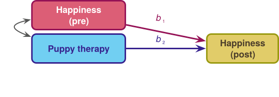

``` math
 \begin{aligned} \text{happy (post)}_i &= \hat{b}_0 + \hat{b}_1\text{happy (pre)}_i + \hat{b}_2\text{dose}_i + e_i\\ \end{aligned} 
```

## Slide 8: The parallel slopes model

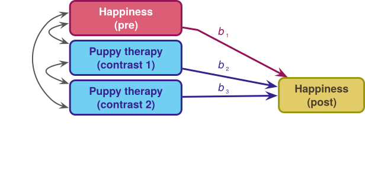

``` math
 \begin{aligned} \text{happy (post)}_i &= \hat{b}_0 + \hat{b}_1\text{happy (pre)}_i + \hat{b}_2\text{Contrast 1}_i + \hat{b}_3\text{Contrast 2}_i + e_i\\ \end{aligned} 
```

## Slide 9: Contrasts

> **Caution: Think about it!**
>
> Hypothesis 1:
>
> - People who have puppy therapy will be happier (have have higher happiness scores) than those who don’t
> - Control $`\ne`$ (15 mins, 30 mins)

> **Caution: Think about it!**
>
> Hypothesis 2:
>
> - People receiving a high dose of puppy therapy (30 mins) will be happier than those receiving a low dose (15 mins)
> - 15 mins $`\ne`$ 30 mins

### Contrast coding

| Therapy group | Contrast 1 (Puppies vs. no puppies) | Contrast 2 (15 mins vs. 30 mins) |
|----|----|----|
| No Puppies | -2/3 | 0 |
| 15 mins | 1/3 | -1/2 |
| 30 mins | 1/3 | 1/2 |

## Slide 10: Extending the parallel slopes model


``` math
 \begin{aligned} \text{happy (post)}_i &= \hat{b}_0 + \hat{b}_1\text{happy (pre)}_i + \hat{b}_2\text{dose}_i + e_i\\ \end{aligned} 
```

## Slide 11: The non-parallel slopes model

> Models the combined effect of predictors (**interaction**)

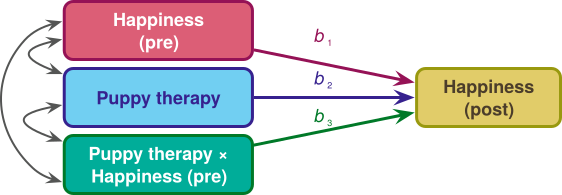

``` math
 \begin{aligned} \text{happy (post)}_i = \ &\hat{b}_0 + \hat{b}_1\text{happy (pre)}_i + \hat{b}_2\text{dose}_i \\ \quad &+ \hat{b}_3[\text{dose} \times \text{happy (pre)}]_i + e_i \end{aligned} 
```

## Slide 12: The non-parallel slopes model

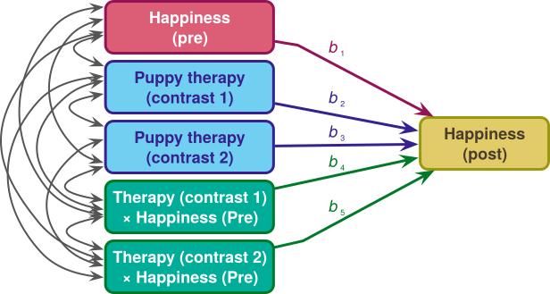

``` math
 \begin{aligned} \text{happy (post)}_i = \ &\hat{b}_0 + \hat{b}_1\text{happy (pre)}_i + \hat{b}_2\text{contrast 1}_i+ \hat{b}_3\text{contrast 2}_i \\ \quad &+ \hat{b}_4[\text{contrast 1} \times \text{happy (pre)}]_i + \\ \quad &+ \hat{b}_5[\text{contrast 2} \times \text{happy (pre)}]_i + e_i \end{aligned} 
```

## Slide 13: What is an interaction?

> The effect of one predictor on the outcome changes as a function of another predictor.

- The relationship between pre-therapy happiness and post-therapy happiness is ‘different’ in the different treatment groups (**Heterogeneity of regression slopes**).
- The relationship between pre-therapy happiness and post-therapy happiness is ‘the same’ in the different treatment groups (**Homogeneity of regression slopes**).
- Interactions represent the concept of (**Moderation**) - more on this in [factorial designs](https://profandyfield.github.io/statistics_lectures/ds_09_factorial/ds_factorial.html)

## Slide 14: Homogeneity of regression slopes (no interaction)

### Parallel slopes

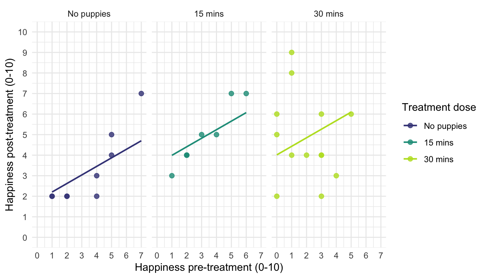

## Slide 15: Heterogeneity of regression slopes (interaction)

### Non-parallel slopes

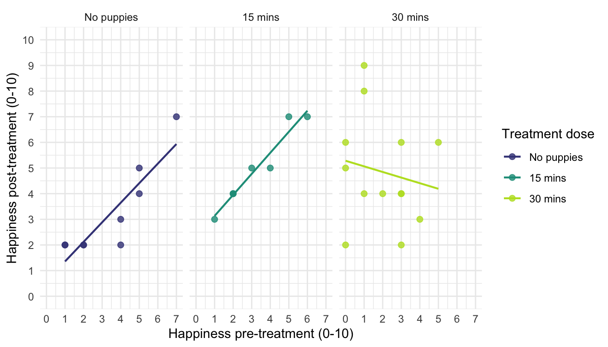

## Slide 16

Video clip: [milton just as boring](https://profandyfield.github.io/statistics_lectures/ds_08_adjusted_means/media/milton_just_as_boring.mp4)

## Slide 17 (new section): The non-parallel slopes model

> Checking Homogeneity of regression slopes

## Slide 18: Overview

> **Note: Statis-tip**
>
> - Use a non-parallel slopes when you predict a combined effect of the categorical and continuous predictor.
> - In this case, we’d use it if we believed that the relationship between pre- and post-treatment happiness would be different in the three therapy groups.
> - Also for checking **homogeneity of regression slopes** before a parallel slopes model


## Slide 19: Visualize

``` r
ggplot2::ggplot(puptreat_tib, aes(x = pre_happy, y = post_happy)) +
  geom_smooth(method = "lm", colour = "#CC6677", fill = "#CC6677", alpha = 0.2) +
  geom_point(colour = "#882255") +
  coord_cartesian(ylim = c(0, 10), xlim = c(0, 10)) +
  scale_x_continuous(breaks = 0:10) +
  scale_y_continuous(breaks = 0:10) +
  labs(x = "Pre-treatment happiness (0-10)", y = "Post-treatment happiness (0-10)", colour = "Treatment", fill = "Treatment") +
 facet_wrap(~dose) + 
  theme_minimal()
```

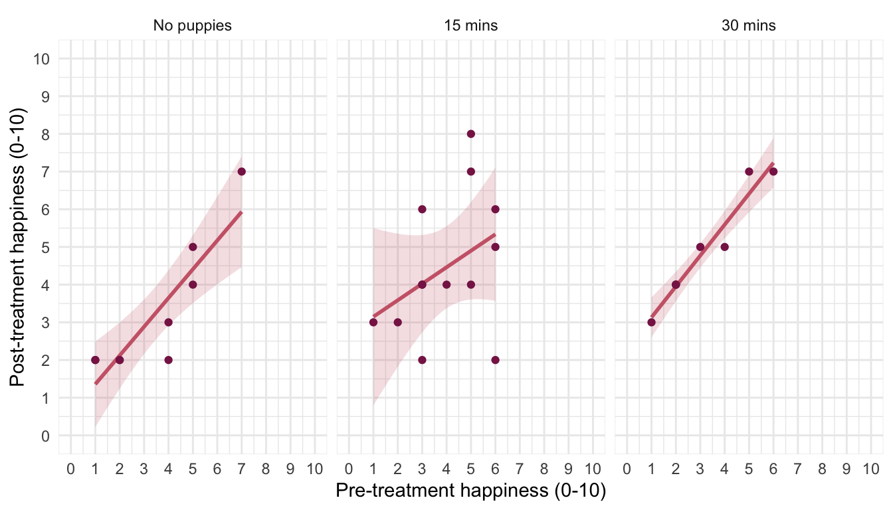


## Slide 20: Fit the model

### Set contrasts

``` r
puppy_vs_none <- c(-2/3, 1/3, 1/3)
long_vs_short <- c(0, -1/2, 1/2)
contrasts(puptreat_tib$dose) <- cbind(puppy_vs_none, long_vs_short)
```

### Fit the model

``` r
intcpt_lm <- lm(post_happy ~ 1, data = puptreat_tib)
pre_lm <- lm(post_happy ~ pre_happy, data = puptreat_tib)
dose_lm <- lm(post_happy ~ pre_happy + dose, data = puptreat_tib)
interact_lm <- lm(post_happy ~ pre_happy + dose + dose:pre_happy, data = puptreat_tib)

test_wald(intcpt_lm, pre_lm, dose_lm, interact_lm) |> 
  display()
```

| Name        | Model | df  | df_diff | F     | p       |
|-------------|-------|-----|---------|-------|---------|
| intcpt_lm   | lm    | 29  |         |       |         |
| pre_lm      | lm    | 28  | 1       | 20.86 | \< .001 |
| dose_lm     | lm    | 26  | 2       | 4.22  | 0.027   |
| interact_lm | lm    | 24  | 2       | 0.72  | 0.498   |

> The interaction is not significant so a parallel slopes model seems reasonable

## Slide 21 (new section): The parallel slopes model (ANCOVA)

## Slide 22: Overview

### Generally

> **Note: Statis-tip**
>
> - To test for differences between group means when we know that an extraneous variable affects the outcome variable
> - Used to adjust the means for extraneous and confounding variables

### In experimental research (ANCOVA)

> **Note: Statis-tip**
>
> - Reduce error variance (sometimes)
>   - By explaining some of the unexplained variance (SS<sub>R</sub>) the error variance in the model can be reduced
> - Greater experimental control
>   - By adjusting for known confounds, we can gain greater insight into the effect of the predictor variable(s)

## Slide 23: Partitioning variance

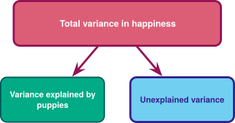

## Slide 24: Partitioning variance: ideal

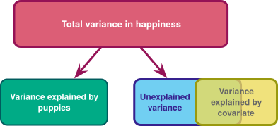

## Slide 25: Partitioning variance: reality

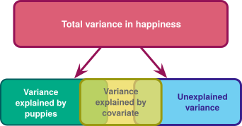

## Slide 26: Independence of the covariate

> **Note: Statis-tip**
>
> - If, and only if, you care about reducing error variance you should test that the covariate and categorical predictor are ‘independent’
> - In this case, does treatment group (`dose`) predict pre-treatment happiness (`pre_happy`)

``` r
pre_lm <- lm(pre_happy ~ dose, data = puptreat_tib) 
test_wald(pre_lm) |> 
  display()
```

| Name       | Model | df  | df_diff | F    | p     |
|------------|-------|-----|---------|------|-------|
| Null model | lm    | 29  |         |      |       |
| Full model | lm    | 27  | 2       | 0.64 | 0.537 |

## Slide 27

Video clip: [milton even prettier as a puppy](https://profandyfield.github.io/statistics_lectures/ds_08_adjusted_means/media/milton_even_prettier_as_a_puppy.mp4)

## Slide 28: The model

``` math
 \begin{aligned} \text{happy (post)}_i &= \hat{b}_0 + \hat{b}_1\text{happy (pre)}_i + \hat{b}_2\text{Contrast 1}_i + \hat{b}_3\text{Contrast 2}_i + e_i\\ \text{happy (post)}_i &= \hat{b}_0 + \hat{b}_1\text{happy (pre)}_i + \hat{b}_2\left(\text{puppies vs. none}\right)_i + \\ &\qquad \hat{b}_3\left(\text{30 vs 15 minutes}\right)_i + e_i\\ \end{aligned} 
```


## Slide 29: Load and Look

### Overall summary

``` r
puptreat_tib |> 
  describe_distribution(select = pre_happy) |> 
  data_remove(c(Skewness, Kurtosis, n_Missing)) |> 
  display()
```

| Variable  | Mean | SD   | IQR | Range        | n   |
|-----------|------|------|-----|--------------|-----|
| pre_happy | 3.60 | 1.77 | 3   | (1.00, 7.00) | 30  |

``` r
puptreat_tib |> 
  describe_distribution(select = post_happy) |> 
  data_remove(c(Skewness, Kurtosis, n_Missing)) |> 
  display()
```

| Variable   | Mean | SD   | IQR  | Range        | n   |
|------------|------|------|------|--------------|-----|
| post_happy | 4.20 | 1.81 | 2.50 | (2.00, 8.00) | 30  |

## Slide 30: Load and Look

### By group

``` r
puptreat_tib |> 
  group_by(dose) |> 
  describe_distribution(select = pre_happy) |> 
  data_remove(c(Skewness, Kurtosis, n_Missing)) |> 
  display()
```

| dose       | Variable  | Mean | SD   | IQR  | Range        | n   |
|------------|-----------|------|------|------|--------------|-----|
| No puppies | pre_happy | 3.44 | 2.07 | 3.50 | (1.00, 7.00) | 9   |
| 15 mins    | pre_happy | 4.00 | 1.63 | 2.50 | (1.00, 6.00) | 13  |
| 30 mins    | pre_happy | 3.12 | 1.73 | 2.75 | (1.00, 6.00) | 8   |

``` r
puptreat_tib |> 
  group_by(dose) |> 
  describe_distribution(select = post_happy) |> 
  data_remove(c(Skewness, Kurtosis, n_Missing)) |> 
  display()
```

| dose       | Variable   | Mean | SD   | IQR  | Range        | n   |
|------------|------------|------|------|------|--------------|-----|
| No puppies | post_happy | 3.22 | 1.79 | 2.50 | (2.00, 7.00) | 9   |
| 15 mins    | post_happy | 4.46 | 1.85 | 3.00 | (2.00, 8.00) | 13  |
| 30 mins    | post_happy | 4.88 | 1.46 | 2.50 | (3.00, 7.00) | 8   |

## Slide 31: Visualize

``` r
ggplot(puptreat_tib, aes(x = dose, y = post_happy, colour = dose)) +
  geom_point(position = position_jitter(width = 0.1), alpha = 0.6) +
  geom_violin(alpha = 0.2) + 
  stat_summary(fun.data = "mean_cl_normal", geom = "pointrange", position = position_dodge(width = 0.9)) +
  coord_cartesian(ylim = c(0, 10)) +
  scale_y_continuous(breaks = 0:10) +
  scale_colour_viridis_d(begin = 0.3, end = 0.8) +
  labs(x = "Puppy therapy group", y = "Post-therapy happiness (0-10)", colour = "Puppy therapy group") +
  theme_minimal() +
  theme(legend.position = "none")
```

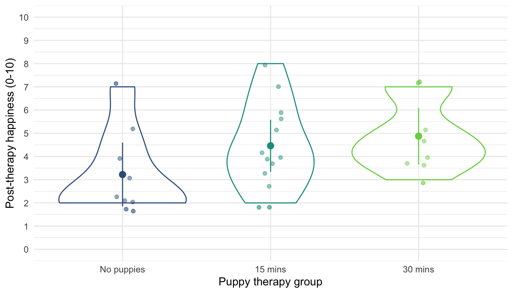

## Slide 32: Fit the model

### Set contrasts

``` r
puppy_vs_none <- c(-2/3, 1/3, 1/3)
long_vs_short <- c(0, -1/2, 1/2)
contrasts(puptreat_tib$dose) <- cbind(puppy_vs_none, long_vs_short)
```

### Fit the model

``` r
puptreat_lm <- lm(post_happy ~ pre_happy + dose, data = puptreat_tib)
```

## Slide 33: Evaluate

### The *F*-statistic with multiple predictors

- The *F*-statistic is calculated using sums of squares
- Type I (sequential)
  - The default in R
  - Each predictor is evaluated taking account of previous predictors
  - **The order of predictors matters!**
- Type III
  - Each predictor is evaluated taking account of all other predictors
  - The order of predictors doesn’t matter

> **Note: Statis-tip**
>
> - When we want to evaluate individual predictors simultaneously using an *F*-statistic, we must:
>   - **Set orthogonal contrasts**
>   - **Use Type III sums of squares**
> - We use `car::Anova(mod = my_model, type = 3)` rather than `test_wald()`


## Slide 34: Evaluate fit

``` r
car::Anova(mod = puptreat_lm, type = 3) |> 
  model_parameters(es_type = "omega") |> 
  display(use_symbols = TRUE)
```

| Parameter | Sum_Squares | df  | Mean_Square | F     | p       | ω² (partial) |
|-----------|-------------|-----|-------------|-------|---------|--------------|
| pre_happy | 37.61       | 1   | 37.61       | 22.20 | \< .001 | 0.41         |
| dose      | 14.62       | 2   | 7.31        | 4.32  | 0.024   | 0.18         |
| Residuals | 44.05       | 26  | 1.69        |       |         |              |

Anova Table (Type 3 tests)

> **Important: ReportR**
>
> Pre-treatment happiness significantly predicted post-treatment happiness, F(1, 26) = 22.20, *p* \< 0.001, $`\hat{\omega}^2_p`$ = 0.41
>
> The dose of puppy therapy had a significant effect on happiness, F(2, 26) = 4.32, *p* = 0.024, $`\hat{\omega}^2_p`$ = 0.18.


## Slide 35: Evaluate assumptions

``` r
check_model(puptreat_lm)
```

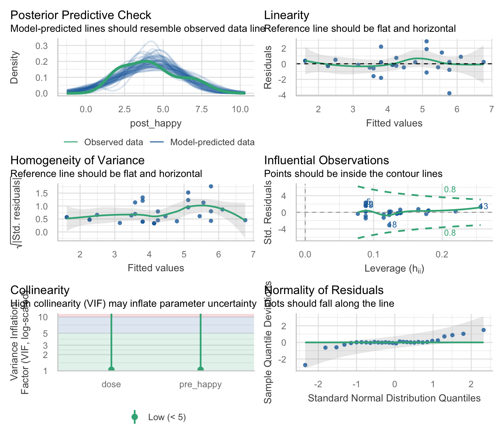


## Slide 36: Robust procedures

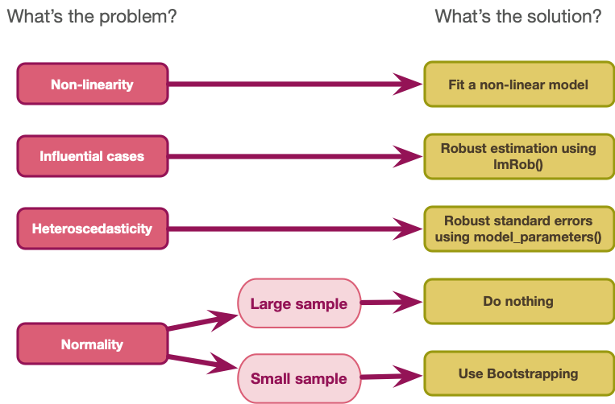

## Slide 37

Video clip: [milton tickly tummy](https://profandyfield.github.io/statistics_lectures/ds_08_adjusted_means/media/milton_tickly_tummy.mp4)

## Slide 38: Interpret parameter estimates, CIs and tests

``` r
model_parameters(puptreat_lm, vcov = "HC4") |> 
  display()
```

| Parameter            | Coefficient | SE   | 95% CI       | t(26) | p       |
|----------------------|-------------|------|--------------|-------|---------|
| (Intercept)          | 1.87        | 0.40 | (1.05, 2.69) | 4.69  | \< .001 |
| pre happy            | 0.66        | 0.14 | (0.37, 0.95) | 4.66  | \< .001 |
| dose (puppy_vs_none) | 1.37        | 0.41 | (0.53, 2.21) | 3.35  | 0.002   |
| dose (long_vs_short) | 0.99        | 0.47 | (0.01, 1.96) | 2.09  | 0.047   |

> **Caution: Think about it!**
>
> - What do we expect the parameter estimates of `dose` to represent?

## Slide 39: Visualize the contrast model

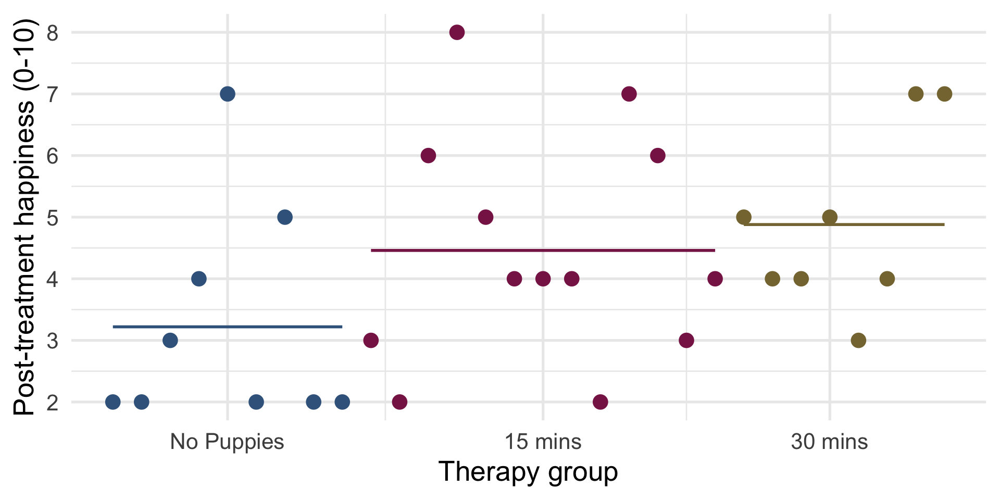


## Slide 40: Visualize contrast 1

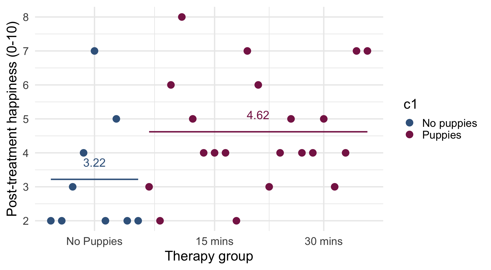


## Slide 41: Visualize contrast 1

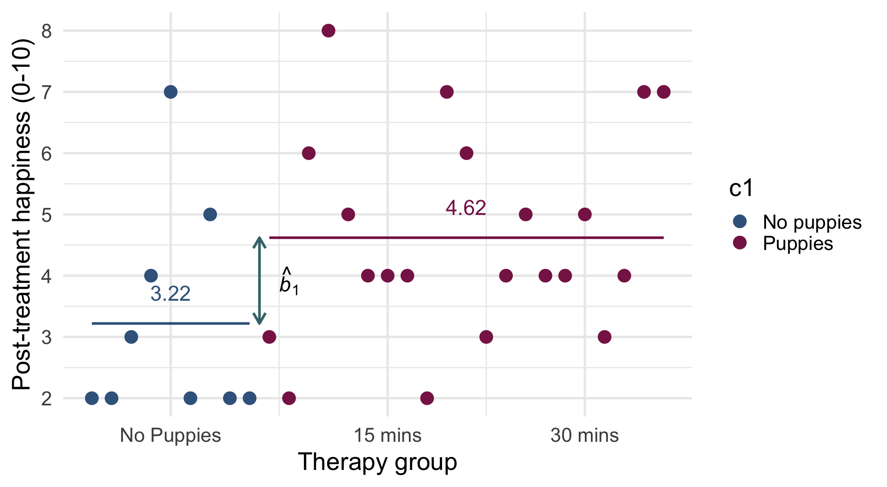

``` math
 \begin{aligned} \hat{b}_1 &= 4.62-3.22 = 1.4 \end{aligned} 
```


## Slide 42: Visualize contrast 2

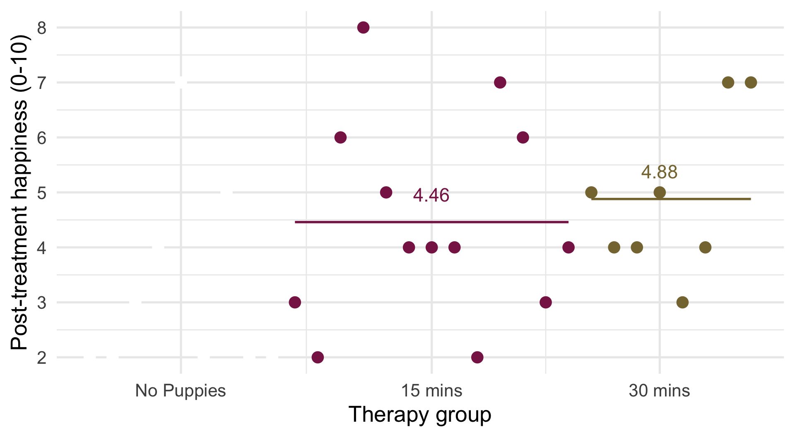


## Slide 43: Visualize contrast 2

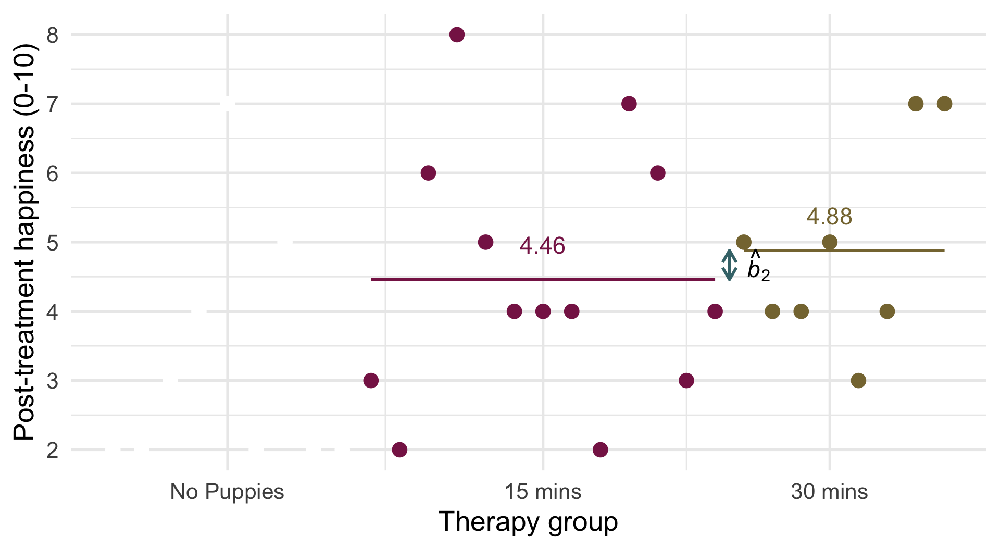

``` math
 \begin{aligned} \hat{b}_2 &= 4.88-4.46 = 0.42 \end{aligned} 
```

## Slide 44: Interpret parameter estimates, CIs and tests

> **Caution: Think about it!**
>
> What do we expect the parameter estimates for `dose` to represent?
>
> - The difference between the mean of the puppy groups and the no puppy group ($`\hat{b}_1 = 4.62-3.22 = 1.4`$)
> - The difference between means in the 30- and 15-minute groups ($`\hat{b}_2 = 4.88-4.46 = 0.42`$)

### What do we get?

``` r
model_parameters(puptreat_lm, vcov = "HC4") |> 
  display()
```

| Parameter            | Coefficient | SE   | 95% CI       | t(26) | p       |
|----------------------|-------------|------|--------------|-------|---------|
| (Intercept)          | 1.87        | 0.40 | (1.05, 2.69) | 4.69  | \< .001 |
| pre happy            | 0.66        | 0.14 | (0.37, 0.95) | 4.66  | \< .001 |
| dose (puppy_vs_none) | 1.37        | 0.41 | (0.53, 2.21) | 3.35  | 0.002   |
| dose (long_vs_short) | 0.99        | 0.47 | (0.01, 1.96) | 2.09  | 0.047   |

## Slide 45: Adjusting means

- The parameter estimates represent the differences between means `adjusted for` the covariate

``` r
estimate_means(puptreat_lm, by = c("dose")) |> 
  display()
```

| dose       | Mean | SE   | 95% CI       | t(26) |
|------------|------|------|--------------|-------|
| No puppies | 3.32 | 0.43 | (2.43, 4.22) | 7.65  |
| 15 mins    | 4.20 | 0.37 | (3.45, 4.95) | 11.49 |
| 30 mins    | 5.19 | 0.46 | (4.23, 6.14) | 11.16 |

Estimated Marginal Means

``` math
 \begin{aligned} \hat{b}_1 &\approx \frac{\overline{X}_{\text{15 mins}} + \overline{X}_{\text{30 mins}}}{2} - \overline{X}_{\text{No puppies}} \\ &\approx \frac{4.20 + 5.19}{2} - 3.32 \\ &\approx 4.7-3.32 \\ &\approx 1.38 \end{aligned} 
```

``` math
 \begin{aligned} \hat{b}_2 &= \overline{X}_{\text{30 mins}} - \overline{X}_{\text{15 mins}} \\ &= 5.19-4.20\\ &= 0.99 \end{aligned} 
```

## Slide 46: Interpret parameter estimates, CIs and tests

``` r
model_parameters(puptreat_lm, vcov = "HC4") |> 
  display()
```

| Parameter            | Coefficient | SE   | 95% CI       | t(26) | p       |
|----------------------|-------------|------|--------------|-------|---------|
| (Intercept)          | 1.87        | 0.40 | (1.05, 2.69) | 4.69  | \< .001 |
| pre happy            | 0.66        | 0.14 | (0.37, 0.95) | 4.66  | \< .001 |
| dose (puppy_vs_none) | 1.37        | 0.41 | (0.53, 2.21) | 3.35  | 0.002   |
| dose (long_vs_short) | 0.99        | 0.47 | (0.01, 1.96) | 2.09  | 0.047   |

> **Important: ReportR**
>
> Pre-treatment happiness significantly predicted post-treatment happiness, $`\hat{b}`$ = 0.66 (0.37, 0.95), *t*(26) = 4.66, *p* \< 0.001. For every unit increase in pre-treatment happiness, predicted (post-treatment) happiness increased by 0.66 units.
>
> The dose of puppy therapy also significantly predicted happiness **at average levels of pre-treatment happiness**. Compared to no puppy controls, post-treatment happiness was significantly higher after any puppy therapy, $`\hat{b}`$ = 1.37 (0.53, 2.21), *t*(26) = 3.35, *p* = 0.002. Post-treatment happiness was also significantly higher after 30 minutes than after 15 minuted of therapy, $`\hat{b}`$ = 0.99 (0.01, 1.96), *t*(26) = 2.09, *p* = 0.047.

## Slide 47: Summary

- When we include both a categorical and continuous predictor, the categorical predictor compares means **adjusted for** the effect of the continuous predictor.
  - The effect of the categorical variable **at average levels** of the continuous predictor
- Test the overall effect of categorical predictors using the *F*-statistic
  - Use Type III sums of squares (other things being equal)
  - Test for homogeneity of regression slopes
- Break down the effects of categorical predictors using parameter estimates and their associated tests
  - Interpret in the same way as in previous lectures
- Test and correct for the usual assumptions in the usual way
