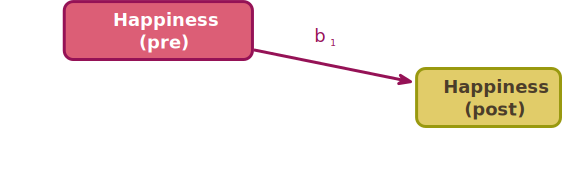
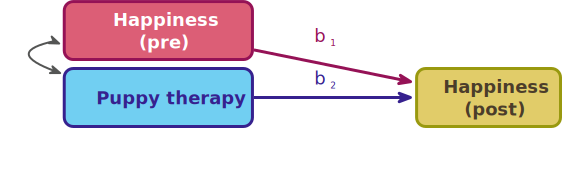
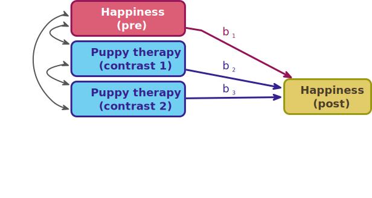
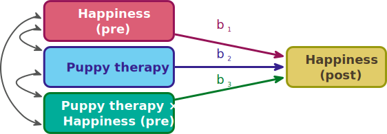
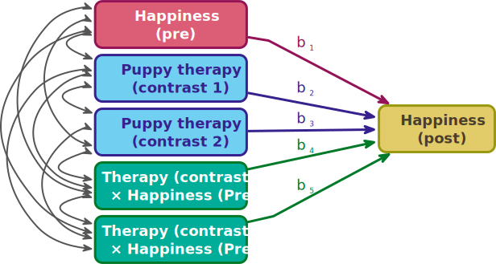
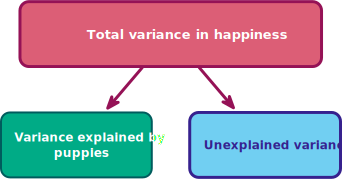
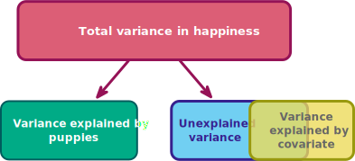
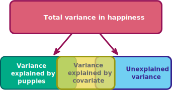

```{r}
# general
library(easystats)
library(tidyverse)
# specific
library(DT)
library(gt)
library(knitr)

conflicted::conflicts_prefer(dplyr::select(),
                             dplyr::filter())

source("../helpers/discovr_helpers.R")
source("../helpers/easystats_helpers.R")

puptreat_tib <- discovr::puppy_rct
pupluv_tib <- discovr::puppy_love

puppy_lm <- lm(happiness ~ dose + puppy_love, data = pupluv_tib)
pupluv_predict <- broom::augment(puppy_lm) |> 
  pivot_longer(
    cols = c(happiness,.fitted),
    values_to = "happy",
    names_to = "data"
  ) |> 
  select(dose, puppy_love, data, happy) |> 
  mutate(
    data = factor(data, labels = c("Predicted happiness", "Observed happiness"))
  )
```


##  Learning outcomes 

::: incremental

- Describe the non-parallel slopes model
- Describe the parallel slopes model
- Explain how to compare means adjusting for other predictors using a linear model
  - Linear model with a categorical and continuous predictor
  - a.k.a. analysis of covariance (ANCOVA)
- Type I vs. Type III sums of squares
- Interpreting the model
  + Main effects
  + Covariates

:::

::: notes
Use C to toggle pen/markup
Use backspace to delete markup
Use f to toggle fullscreen
:::


## 

::: r-stack
{.fragment fig-align="center" width="1050" height="594"}

{.fragment fig-align="center" width="1050" height="594"}
:::

## [Extending the puppy example]{.txt_ong} {background-image="media/milton_bed_crop_2018.jpg" background-size="cover"}

::: txt_dk_bg

- A puppy therapy RCT
  - A no puppies control group 
  - 15 minutes of puppy therapy
  - 30 minutes of puppy therapy
- Outcome variable
  - Happiness (0 = unhappy to 10 = happy) **after** (*post*) treatment
- Continuous predictor
  - Happiness (0 = unhappy to 10 = happy) **before**  (*pre*) treatment

:::

## [The data]{.txt_white} {background-image="media/milton_20180308_202134.jpg" background-size="cover"}


::: txt_dk_bg
```{r}
#| echo: false
#| message: false
#| warning: false

puptreat_tib |> 
  DT::datatable(caption = 'Table 1: Data for the puppy therapy example',
                options = list(
                dom = 'tp',
                columnDefs = list(
                  list(className = 'dt-center', targets = 1:3)
                  ),
                pageLength = 10))
```
:::

## The parallel slopes model

{fig-align="center" height=400}

$$
\begin{aligned}
\text{happy (post)}_i &= \hat{b}_0 + \hat{b}_1\text{happy (pre)}_i + e_i\\
\end{aligned}
$$

::: notes
We out in the known predictor first
:::


## The parallel slopes model

> The parallel slopes model assumes no combined effect of the predictors.

{fig-align="center" height=400}

::: center-h
::: txt_mulberry
::: txt_l
$$
\begin{aligned}
\text{happy (post)}_i &= \hat{b}_0 + \hat{b}_1\text{happy (pre)}_i + \hat{b}_2\text{dose}_i + e_i\\
\end{aligned}
$$

:::
:::
:::


## The parallel slopes model

{fig-align="center" height=400}

::: center-h
::: txt_mulberry
::: txt_l
$$
\begin{aligned}
\text{happy (post)}_i &= \hat{b}_0 + \hat{b}_1\text{happy (pre)}_i + \hat{b}_2\text{Contrast 1}_i + \hat{b}_3\text{Contrast 2}_i + e_i\\
\end{aligned}
$$

:::
:::
:::


## [Contrasts]{.txt_ong} {background-image="media/milton_20190623_191707.jpg" background-size="cover"}

::: txt_dk_bg
::: {.callout-caution icon = false}
##  Think about it!

Hypothesis 1:

- People who have puppy therapy will be happier (have have higher happiness scores) than those who don’t
- Control $\ne$ (15 mins, 30 mins)

:::
:::

::: txt_dk_bg
::: {.callout-caution icon = false}
##  Think about it!

Hypothesis 2:

- People receiving a high dose of puppy therapy (30 mins) will be happier than those receiving a low dose (15 mins)
- 15 mins $\ne$ 30 mins

:::
:::

::: fragment

### [Contrast coding]{.txt_white}

::: center-h
```{r}
con_tbl <- tibble::tibble(
  `Therapy group` = c("No Puppies", "15 mins", "30 mins"),
  `Contrast 1 (Puppies vs. no puppies)` = c("-2/3", "1/3", "1/3"),
  `Contrast 2 (15 mins vs. 30 mins)` = c("0", "-1/2", "1/2")
)

con_tbl |> 
  knitr::kable(align = "lcc") |> 
  kableExtra::row_spec(0:3, background = "white")
```
:::
:::

## Extending the parallel slopes model

{fig-align="center" height=400}

::: center-h
::: txt_mulberry
::: txt_l
$$
\begin{aligned}
\text{happy (post)}_i &= \hat{b}_0 + \hat{b}_1\text{happy (pre)}_i + \hat{b}_2\text{dose}_i + e_i\\
\end{aligned}
$$

:::
:::
:::


## The non-parallel slopes model

> Models the combined effect of predictors ([**interaction**]{.txt_mulberry})

{fig-align="center" height=300}


::: center-h
::: txt_mulberry
::: txt_l
$$
\begin{aligned}
\text{happy (post)}_i = \ &\hat{b}_0 + \hat{b}_1\text{happy (pre)}_i + \hat{b}_2\text{dose}_i \\
\quad &+ \hat{b}_3[\text{dose} \times \text{happy (pre)}]_i  + e_i
\end{aligned}
$$

:::
:::
:::

## The non-parallel slopes model

{fig-align="center" height=400}


::: center-h
::: txt_mulberry
::: txt_l
$$
\begin{aligned}
\text{happy (post)}_i = \ &\hat{b}_0 + \hat{b}_1\text{happy (pre)}_i + \hat{b}_2\text{contrast 1}_i+ \hat{b}_3\text{contrast 2}_i \\
\quad &+ \hat{b}_4[\text{contrast 1} \times \text{happy (pre)}]_i + \\
\quad &+ \hat{b}_5[\text{contrast 2} \times \text{happy (pre)}]_i + e_i
\end{aligned}
$$

:::
:::
:::

## What is an interaction?

> The effect of one predictor on the outcome changes as a function of another predictor.


::: incremental

- The relationship between pre-therapy happiness and post-therapy happiness is 'different' in the different treatment groups ([**Heterogeneity of regression slopes**]{.txt_mulberry}).
- The relationship between pre-therapy happiness and post-therapy happiness is 'the same' in the different treatment groups ([**Homogeneity of regression slopes**]{.txt_mulberry}).
- Interactions represent the concept of ([**Moderation**]{.txt_mulberry}) - more on this in [factorial designs](https://profandyfield.github.io/statistics_lectures/ds_09_factorial/ds_factorial.html)

:::

## Homogeneity of regression slopes (no interaction)

### Parallel slopes

```{r}
#| fig-width: 7
#| fig-height: 4

pupluv_predict |> 
  filter(data == "Predicted happiness") |> 
  ggplot(data = _, aes(puppy_love, happy, colour = dose)) +
  geom_point(data = pupluv_tib, aes(puppy_love, happiness, colour = dose), size = 2, alpha = 0.8) +
  geom_smooth(method = "lm", se = F, linewidth = 0.75) +
  scale_y_continuous(limits=c(0, 10), breaks=0:10) +
  scale_x_continuous(limits=c(0, 7), breaks=0:7) +
  scale_colour_manual(values = viridis_3) +
  facet_wrap(~dose) +
  labs(x = "Happiness pre-treatment (0-10)", y = "Happiness post-treatment (0-10)", colour = "Treatment dose") +
  theme_minimal()
```


## Heterogeneity of regression slopes (interaction)

### Non-parallel slopes

```{r}
#| fig-width: 7
#| fig-height: 4

pupluv_predict |> 
  filter(data == "Observed happiness") |> 
  ggplot(data = _, aes(puppy_love, happy, colour = dose)) +
  geom_point(data = pupluv_tib, aes(puppy_love, happiness, colour = dose), size = 2, alpha = 0.8) +
  geom_smooth(method = "lm", se = F, linewidth = 0.75) +
  scale_y_continuous(limits=c(0, 10), breaks=0:10) +
  scale_x_continuous(limits=c(0, 7), breaks=0:7) +
  scale_colour_manual(values = viridis_3) +
  facet_wrap(~dose) +
  labs(x = "Happiness pre-treatment (0-10)", y = "Happiness post-treatment (0-10)", colour = "Treatment dose") +
  theme_minimal()
```


## {background-video="media/milton_just_as_boring.mp4" background-size="cover"}

# The non-parallel slopes model

> Checking Homogeneity of regression slopes

## Overview

::: {.callout-note icon = false}
##  Statis-tip

- Use a non-parallel slopes when you predict a combined effect of the categorical and continuous predictor.
- In this case, we'd use it if we believed that the relationship between pre- and post-treatment happiness would be different in the three therapy groups.
- Also for checking **homogeneity of regression slopes** before a parallel slopes model

:::

::: fragment

{fig-align="center" height=400}

:::


## [V]{.txt_ong}isualize


```{r}
#| echo: true
#| fig-width: 7
#| fig-height: 4

ggplot2::ggplot(puptreat_tib, aes(x = pre_happy, y = post_happy)) +
  geom_smooth(method = "lm", colour = "#CC6677", fill = "#CC6677", alpha = 0.2) +
  geom_point(colour = "#882255") +
  coord_cartesian(ylim = c(0, 10), xlim = c(0, 10)) +
  scale_x_continuous(breaks = 0:10) +
  scale_y_continuous(breaks = 0:10) +
  labs(x = "Pre-treatment happiness (0-10)", y = "Post-treatment happiness (0-10)", colour = "Treatment", fill = "Treatment") +
 facet_wrap(~dose) + 
  theme_minimal()
```


{.absolute top=0 left=800 height="80"}


## Fit the model

### Set contrasts

```{r}
#| echo: true
#| warning: false
#| message: false

puppy_vs_none <- c(-2/3, 1/3, 1/3)
long_vs_short <- c(0, -1/2, 1/2)
contrasts(puptreat_tib$dose) <- cbind(puppy_vs_none, long_vs_short)
```

### Fit the model

```{r}
#| echo: true
#| eval: false
#| code-line-numbers: 1|2|3|4|5

intcpt_lm <- lm(post_happy ~ 1, data = puptreat_tib)
pre_lm <- lm(post_happy ~ pre_happy, data = puptreat_tib)
dose_lm <- lm(post_happy ~ pre_happy + dose, data = puptreat_tib)
interact_lm <- lm(post_happy ~ pre_happy + dose + dose:pre_happy, data = puptreat_tib)

test_wald(intcpt_lm, pre_lm, dose_lm, interact_lm) |> 
  display()
```


```{r}
#| warning: false
#| message: false

intcpt_lm <- lm(post_happy ~ 1, data = puptreat_tib)
pre_lm <- lm(post_happy ~ pre_happy, data = puptreat_tib)
dose_lm <- lm(post_happy ~ pre_happy + dose, data = puptreat_tib)
interact_lm <- lm(post_happy ~ pre_happy + dose + dose:pre_happy, data = puptreat_tib)

test_wald(intcpt_lm, pre_lm, dose_lm, interact_lm) |> 
  display(footer = "")
```


> The interaction is not significant so a parallel slopes model seems reasonable

# The parallel slopes model (ANCOVA)

## Overview

### Generally

::: {.callout-note icon = false}
##  Statis-tip

- To test for differences between group means when we know that an extraneous variable affects the outcome variable 
- Used to adjust the means for extraneous and confounding variables

:::

::: fragment
### In experimental research (ANCOVA)

::: {.callout-note icon = false}
##  Statis-tip

- Reduce error variance (sometimes)
  - By explaining some of the unexplained variance (SS<sub>R</sub>) the error variance in the model can be reduced
- Greater experimental control
  - By adjusting for known confounds, we can gain greater insight into the effect of the predictor variable(s)

:::
:::

## Partitioning variance

{fig-align="center" height=600}

## Partitioning variance: ideal

{fig-align="center" height=600}

## Partitioning variance: reality

{fig-align="center" height=600}

## Independence of the covariate


::: {.callout-note icon = false}
##  Statis-tip

- If, and only if, you care about reducing error variance you should test that the covariate and categorical predictor are 'independent'
- In this case, does treatment group (`dose`) predict pre-treatment happiness (`pre_happy`)

:::

::: fragment

```{r}
#| echo: true
#| eval: false

pre_lm <- lm(pre_happy ~ dose, data = puptreat_tib) 
test_wald(pre_lm) |> 
  display()
```

```{r}
#| eval: true

pre_lm <- lm(pre_happy ~ dose, data = puptreat_tib) 
test_wald(pre_lm) |> 
  display(footer = "")
```

:::


## {background-video="media/milton_even_prettier_as_a_puppy.mp4" background-size="cover"}

## The model {background-image="media/milton_20180606_113722_crop.jpg" background-size="cover"}


::: txt_dk_bg
::: center-h
$$
\begin{aligned}
\text{happy (post)}_i &= \hat{b}_0 + \hat{b}_1\text{happy (pre)}_i + \hat{b}_2\text{Contrast 1}_i + \hat{b}_3\text{Contrast 2}_i + e_i\\
\text{happy (post)}_i &= \hat{b}_0 + \hat{b}_1\text{happy (pre)}_i + \hat{b}_2\left(\text{puppies vs. none}\right)_i + \\
&\qquad \hat{b}_3\left(\text{30 vs 15 minutes}\right)_i + e_i\\
\end{aligned}
$$

:::
:::

::: fragment

{fig-align="center" height=400}

:::

## [L]{.txt_ong}oad and [L]{.txt_ong}ook

### Overall summary

::: tbl_s
```{r}
#| echo: true
#| warning: FALSE
#| message: FALSE

puptreat_tib |> 
  describe_distribution(select = pre_happy) |> 
  data_remove(c(Skewness, Kurtosis, n_Missing)) |> 
  display()
```

:::

\

::: tbl_s
```{r}
#| echo: true
#| warning: FALSE
#| message: FALSE

puptreat_tib |> 
  describe_distribution(select = post_happy) |> 
  data_remove(c(Skewness, Kurtosis, n_Missing)) |> 
  display()
```

:::


## [L]{.txt_ong}oad and [L]{.txt_ong}ook

### By group

::: tbl_s
```{r}
#| echo: true
#| warning: FALSE
#| message: FALSE

puptreat_tib |> 
  group_by(dose) |> 
  describe_distribution(select = pre_happy) |> 
  data_remove(c(Skewness, Kurtosis, n_Missing)) |> 
  display()
```

:::

\

::: tbl_s
```{r}
#| echo: true
#| warning: false
#| message: false

puptreat_tib |> 
  group_by(dose) |> 
  describe_distribution(select = post_happy) |> 
  data_remove(c(Skewness, Kurtosis, n_Missing)) |> 
  display()
```
:::

## [V]{.txt_mulberry}isualize

```{r}
#| fig-width: 7
#| fig-height: 4
#| echo: true

ggplot(puptreat_tib, aes(x = dose, y = post_happy, colour = dose)) +
  geom_point(position = position_jitter(width = 0.1), alpha = 0.6) +
  geom_violin(alpha = 0.2) + 
  stat_summary(fun.data = "mean_cl_normal", geom = "pointrange", position = position_dodge(width = 0.9)) +
  coord_cartesian(ylim = c(0, 10)) +
  scale_y_continuous(breaks = 0:10) +
  scale_colour_viridis_d(begin = 0.3, end = 0.8) +
  labs(x = "Puppy therapy group", y = "Post-therapy happiness (0-10)", colour = "Puppy therapy group") +
  theme_minimal() +
  theme(legend.position = "none")
```


## Fit the model {background-image="media/milton_20190627_072357_crop.jpg" background-size="cover"}

### [Set contrasts]{.txt_white}

```{r}
#| echo: true
#| warning: false
#| message: false

puppy_vs_none <- c(-2/3, 1/3, 1/3)
long_vs_short <- c(0, -1/2, 1/2)
contrasts(puptreat_tib$dose) <- cbind(puppy_vs_none, long_vs_short)
```

\

### [Fit the model]{.txt_white}

::: txt_xl
```{r}
#| echo: true

puptreat_lm <- lm(post_happy ~ pre_happy + dose, data = puptreat_tib)
```
:::

## [E]{.txt_ong}valuate

### The *F*-statistic with multiple predictors

- The *F*-statistic is calculated using sums of squares
- Type I (sequential)
  - The default in R
  - Each predictor is evaluated taking account of previous predictors
  - **The order of predictors matters!**
- Type III
  + Each predictor is evaluated taking account of all other predictors
  + The order of predictors doesn’t matter


::: {.callout-note icon = false}
##  Statis-tip

- When we want to evaluate individual predictors simultaneously using an *F*-statistic, we must:
  - [**Set orthogonal contrasts**]{.txt_mulberry}
  - [**Use Type III sums of squares**]{.txt_mulberry}
- We use `car::Anova(mod = my_model, type = 3)` rather than `test_wald()`

:::

{.absolute top=0 left=800 height="80"}


## [E]{.txt_ong}valuate fit

```{r}
#| echo: true

car::Anova(mod = puptreat_lm, type = 3) |> 
  model_parameters(es_type = "omega") |> 
  display(use_symbols = TRUE)
```


```{r}
pup_lmf <- car::Anova(mod = puptreat_lm, type = 3) |> 
  model_parameters(es_type = "omega")

pup_par <- model_parameters(puptreat_lm, vcov = "HC4")
```


::: fragment
:::{.callout-important icon=false}
##  Report`r rproj()`

Pre-treatment happiness significantly predicted post-treatment happiness, `r report_ez_aov(pup_lmf, row = 1, es_type = "Omega2_partial")`

The dose of puppy therapy had a significant effect on happiness, `r report_ez_aov(pup_lmf, row = 2, es_type = "Omega2_partial")`.

:::
:::


{.absolute top=0 left=800 height="80"}

## [E]{.txt_mulberry}valuate assumptions {background-image="media/milton_20180720_100533_crop.jpg" background-size="cover"}

::: fragment
::: center-h
```{r}
#| echo: true
#| message: false
#| warning: false
#| fig-width: 7
#| fig-height: 6

check_model(puptreat_lm)
```
:::
:::

{.absolute top=0 left=800 height="80"}

## Robust procedures {}

{fig-align="center" height=600}

## {background-video="media/milton_tickly_tummy.mp4" background-size="cover"}

## [I]{.txt_ong}nterpret parameter estimates, CIs and tests


```{r}
#| echo: true

model_parameters(puptreat_lm, vcov = "HC4") |> 
  display()
```


::: fragment
::: {.callout-caution icon = false}
##  Think about it!

- What do we expect the parameter estimates of `dose` to represent?

:::
:::


## [V]{.txt_mulberry}isualize the contrast model {background-image="media/milton_20180720_100533_crop.jpg" background-size="cover"}

```{r}
puppy_gp_means <- describe_distribution(x = puptreat_tib, select = post_happy, by = "dose")

mean_none <- value_from_ez(puppy_gp_means, value = "Mean", row = 1, as_is = T) |>  round(digits = 2)
mean_15 <- value_from_ez(puppy_gp_means, value = "Mean", row = 2, as_is = T) |>  round(digits = 2)
mean_30 <- value_from_ez(puppy_gp_means, value = "Mean", row = 3, as_is = T) |>  round(digits = 2)

puptreat_tib <- puptreat_tib |> 
   arrange(dose) |> 
   mutate(
     id_num = 1:30,
     c1 = ifelse(dose == "No puppies", "No puppies", "Puppies")
   )
 
 mean_puppies <- subset(puptreat_tib, c1 == "Puppies")$post_happy |> mean() |>  round(digits = 2)
```

```{r}
#| fig-width: 10
#| fig-height: 5.5

puppy_plot <- ggplot(puptreat_tib, aes(id_num, post_happy, colour = dose)) +
  geom_point(size = 4) +
  labs(x = "Therapy group", y = "Post-treatment happiness (0-10)") +
  scale_x_continuous(breaks = c(5, 16, 26), labels = c("No Puppies", "15 mins", "30 mins")) +
  scale_colour_manual(values = c(blue, mulberry, brown)) +
  scale_y_continuous(breaks = seq(0, 10, 1)) +
  theme_minimal(base_size = 20) +
  theme(legend.position = "none") 


puppy_plot_ano <- puppy_plot +
  annotate("segment", x = 1, y = mean_none, xend = 9, yend = mean_none, linewidth = 1, colour = blue) + 
  annotate("segment", x = 10, y = mean_15, xend = 22, yend = mean_15, linewidth = 1, colour = mulberry) +
  annotate("segment", x = 23, y = mean_30, xend = 30, yend = mean_30, linewidth = 1, colour = brown) 
```


::: fragment

```{r}
puppy_plot_ano
```

:::

{.absolute top=0 left=800 height="80"}

## [V]{.txt_mulberry}isualize contrast 1

```{r}
#| fig-width: 10
#| fig-height: 5.5

c1_plot_means <- ggplot(puptreat_tib, aes(id_num, post_happy, colour = c1)) +
  geom_point(size = 4) +
  labs(x = "Therapy group", y = "Post-treatment happiness (0-10)") +
  scale_x_continuous(breaks = c(5, 16, 26), labels = c("No Puppies", "15 mins", "30 mins")) +
  scale_colour_manual(values = c(blue, mulberry, brown)) +
  scale_y_continuous(breaks = seq(0, 10, 1)) +
  theme_minimal(base_size = 20)  +
  annotate("segment", x = 1, y = mean_none, xend = 9, yend = mean_none, size = 1, colour = blue) + 
  annotate("segment", x = 10, y = mean_puppies, xend = 30, yend = mean_puppies, size = 1, colour = mulberry) +
  annotate("text", x = 5, y = mean_none + 0.5, size = 6, colour = blue, label = mean_none) + 
  annotate("text", x = 20, y = mean_puppies + 0.5, size = 6, colour = mulberry, label = mean_puppies)

c1_plot_means
```

{.absolute top=0 left=800 height="80"}

## [V]{.txt_mulberry}isualize contrast 1

```{r}
#| fig-width: 10
#| fig-height: 5.5

c1_plot_means +
  annotate("text", x = 11, y = (mean_puppies + mean_none)/2, label = deparse(bquote(hat(italic(b))[1])), parse = TRUE, size = 6) +
  annotate("segment", x = 9.5, y = mean_puppies, xend = 9.5, yend = mean_none, colour = green, size = 1, arrow = arrow(length = unit(0.03, "npc"), ends = "both"))
```

::: txt_mulberry
$$
\begin{aligned}
\hat{b}_1 &= 4.62-3.22 = 1.4
\end{aligned}
$$
:::

{.absolute top=0 left=800 height="80"}

## [V]{.txt_mulberry}isualize contrast 2

```{r}
#| fig-width: 10
#| fig-height: 5.5

c2_plot <- puppy_plot +
  scale_colour_manual(values = c("white", mulberry, brown))

c2_plot_means <- c2_plot +
  annotate("segment", x = 10, y = mean_15, xend = 22, yend = mean_15, size = 1, colour = mulberry) +
  annotate("segment", x = 23, y = mean_30, xend = 30, yend = mean_30, size = 1, colour = brown) +
  annotate("text", x = 16, y = mean_15 + 0.5, size = 6, colour = mulberry, label = mean_15) +
  annotate("text", x = 26, y = mean_30 + 0.5, size = 6, colour = brown, label = mean_30)

c2_plot_means
```

{.absolute top=0 left=800 height="80"}

## [V]{.txt_mulberry}isualize contrast 2

```{r}
#| fig-width: 10
#| fig-height: 5.5

c2_plot_means +
  annotate("text", x = 23.5, y = (mean_15 + mean_30)/2, label = deparse(bquote(hat(italic(b))[2])), parse = TRUE, size = 6) +
  annotate("segment", x = 22.5, y = mean_15, xend = 22.5, yend = mean_30, colour = green, size = 1, arrow = arrow(length = unit(0.03, "npc"), ends = "both"))
```


::: txt_mulberry
$$
\begin{aligned}
\hat{b}_2 &= 4.88-4.46 = 0.42
\end{aligned}
$$
:::


## [I]{.txt_ong}nterpret parameter estimates, CIs and tests


::: fragment
::: {.callout-caution icon = false}
##  Think about it!

What do we expect the parameter estimates for `dose` to represent?

- The difference between the mean of the puppy groups and the no puppy group ($\hat{b}_1 = 4.62-3.22 = 1.4$)
- The difference between means in the 30- and 15-minute groups ($\hat{b}_2 = 4.88-4.46 = 0.42$)

:::
:::

::: fragment
### What do we get?

```{r}
#| echo: true

model_parameters(puptreat_lm, vcov = "HC4") |> 
  display()
```

:::


## Adjusting means

- The parameter estimates represent the differences between means `adjusted for` the covariate


::: fragment

```{r}
#| echo: true
#| eval: false

estimate_means(puptreat_lm, by = c("dose")) |> 
  display()
```

```{r}
#| echo: false

estimate_means(puptreat_lm, by = c("dose")) |> 
  display(footer = "")
```

:::


::::: fragment
:::: columns
::: {.column width="50%"}
::: txt_mulberry
$$
\begin{aligned}
\hat{b}_1 &\approx \frac{\overline{X}_{\text{15 mins}} + \overline{X}_{\text{30 mins}}}{2} - \overline{X}_{\text{No puppies}} \\
&\approx \frac{4.20 + 5.19}{2} - 3.32 \\
&\approx 4.7-3.32 \\
&\approx 1.38
\end{aligned}
$$
:::
:::


::: {.column width="50%"}
::: txt_mulberry
$$
\begin{aligned}
\hat{b}_2 &= \overline{X}_{\text{30 mins}} - \overline{X}_{\text{15 mins}}  \\
&= 5.19-4.20\\
&= 0.99
\end{aligned}
$$
:::
:::
::::
:::::

## [I]{.txt_ong}nterpret parameter estimates, CIs and tests


```{r}
#| echo: true

model_parameters(puptreat_lm, vcov = "HC4") |> 
  display()
```


\

:::{.callout-important icon=false}
##  Report`r rproj()`

Pre-treatment happiness significantly predicted post-treatment happiness, `r report_pe(pup_par, row = 2)`. For every unit increase in pre-treatment happiness, predicted (post-treatment) happiness increased by `r value_from_ez(pup_par, row = 2)` units.

The dose of puppy therapy also significantly predicted happiness [**at average levels of pre-treatment happiness**]{.txt_mulberry}. Compared to no puppy controls, post-treatment happiness was significantly higher after any puppy therapy, `r report_pe(pup_par, row = 3)`. Post-treatment happiness was also significantly higher after 30 minutes than after 15 minuted of therapy, `r report_pe(pup_par, row = 4)`. 

:::


## Summary

- When we include both a categorical and continuous predictor, the categorical predictor compares means **adjusted for** the effect of the continuous predictor.
  - The effect of the categorical variable **at average levels** of the continuous predictor
- Test the overall effect of categorical predictors using the *F*-statistic
  - Use Type III sums of squares (other things being equal)
  - Test for homogeneity of regression slopes
- Break down the effects of categorical predictors using parameter estimates and their associated tests
  - Interpret in the same way as in previous lectures
- Test and correct for the usual assumptions in the usual way
