```{r}
# general
library(easystats)
library(tidyverse)
# specific

source("../helpers/discovr_helpers.R")
source("../helpers/easystats_helpers.R")

vids_tib <- discovr::video_games |> 
  dplyr::mutate(
    caunts_cat = ifelse(caunts >= median(caunts), 'Callous', 'Not callous')
  )
xbox_tib <- discovr::xbox |> 
  dplyr::mutate(
    game = forcats::as_factor(game) |> forcats::fct_relevel("Static"),
    console = forcats::as_factor(console) |> forcats::fct_relevel("Xbox One")
  )
goggles_tib <- discovr::goggles

```


##  Learning outcomes 

::: incremental

- What is a factorial design?
- Moderation and interaction effects
- Factorial designs and the GLM
  - The process of E.V.I.L.
- Breaking down interactions
  - Plots
  - Simple effects analysis

:::

::: notes
Use C to toggle pen/markup
Use backspace to delete markup
Use f to toggle fullscreen
:::


## 

::: r-stack
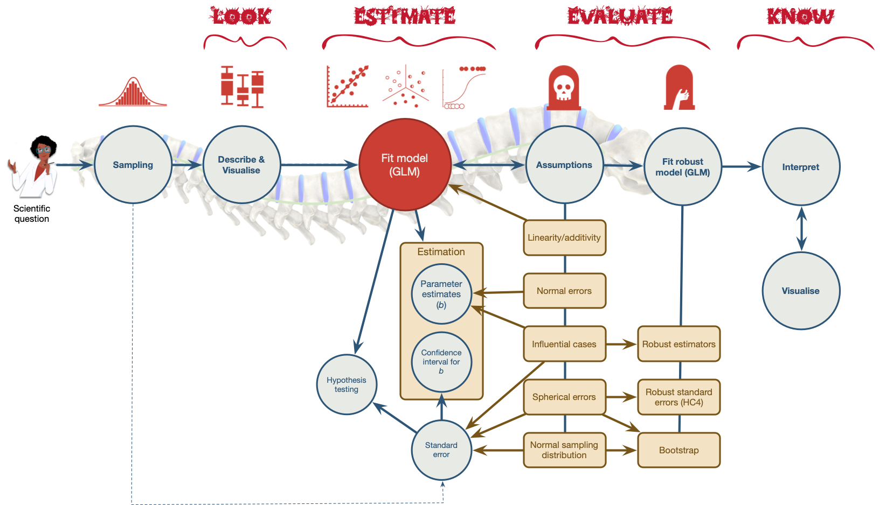{.fragment fig-align="center" width="1050" height="594"}

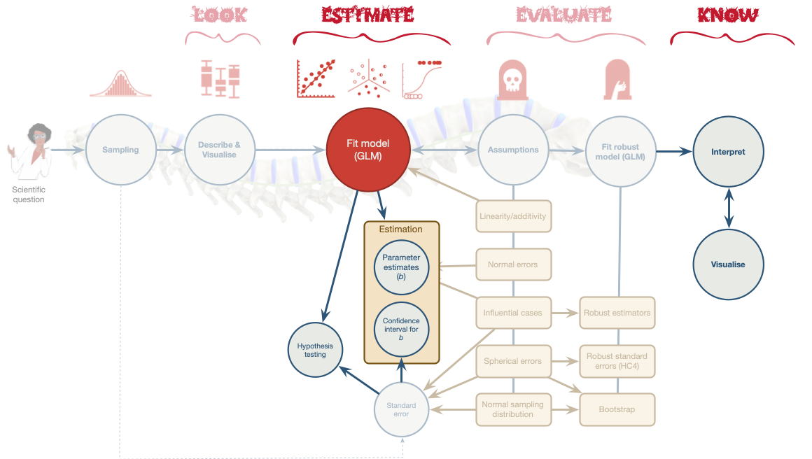{.fragment fig-align="center" width="1050" height="594"}
:::


##

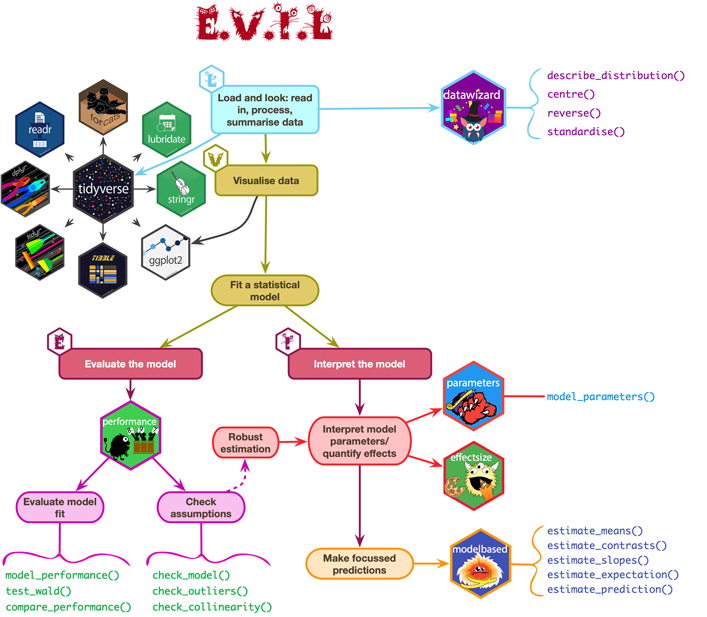{fig-align="center" height=600}

## Terminology

- Variables in experimental designs
  - Predictor variables referred to as **independent variables (IV)** because their value is independent of (is not being predicted from) other variables.
  - Outcome variable referred to as the **dependent variables (DV)**, because their value 'depends' upon (is being predicted from) other variables. 
  
::: fragment

- **Factorial design**: Two or more predictor variables/IV have been manipulated

:::
::: fragment

- ***n*-way design**: The number of predictor variables/IVs manipulated
  - Two-way = 2 predictor variables/IVs manipulated
  - Three-way = 3 predictor variables/IVs manipulated

:::
::: fragment

- The allocation of participants
  - **Independent design** = different entities in all conditions
  - **Repeated measures design** = the same entities in all conditions
  - **Mixed design** = different entities in all conditions of at least one predictor/IV, the same entities in all conditions of at least one other predictor variable/IV

:::

# Moderation: Do video games lead to aggression?

## {background-video="../shared_media/video/warcraft_final.mp4" background-size="cover"}


## Moderation

- Is there a link between video games and aggression?
  - Outcome = aggressive behaviour (`aggress`)
  - Callus Unemotional Traits (`caunts`)
  - Video game Use (`vid_game`)

::: notes
Imagine a scientist wanted to look at the relationship between playing violent video games such as Grand Theft Auto, MadWorld and Manhunt and aggression. She gathered data from 442 youths. She measured their aggressive behaviour (aggress), callous unemotional traits (caunts), and the number of hours per week they play video games (vid_game) 
:::

## Moderation: The theoretical model

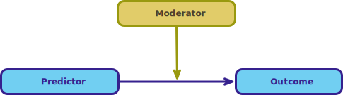{fig-align="center" width=700}

## Categorical moderator variable

::: center-h
```{r} 
#| fig-width: 10 
#| fig-height: 6.5

ggplot(vids_tib, aes(vid_game, aggress, colour = caunts_cat)) +
  geom_point(size = 2, alpha = 0.7) +
  geom_smooth(method = "lm", aes(fill = caunts_cat), alpha = 0.1) +
  labs(x = "Hours playing video games", y = "Aggression", colour = "Callous traits", fill = "Callous traits") +
  scale_colour_manual(values = c(blue, brown)) +
  scale_fill_manual(values = c(blue, brown)) +
  theme_minimal()
```
:::

## Continuous moderator variable

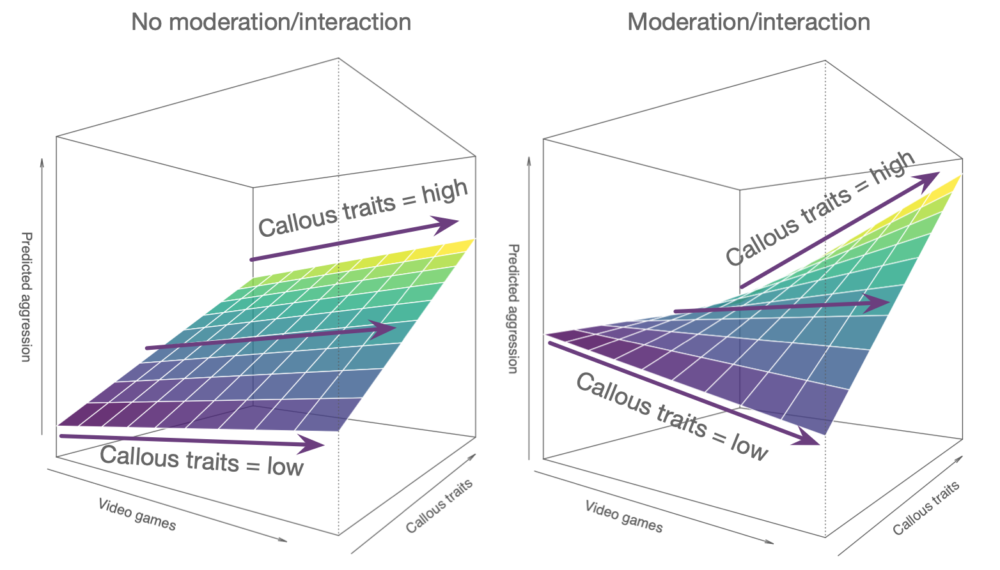{fig-align="center" height=600}


## Moderation: The statistical model

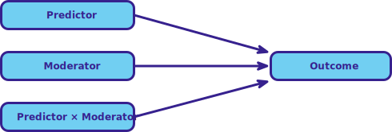{fig-align="center" width=700}

<br/>

::: fragment
::: center-h
::: txt_mulberry
$$
\begin{aligned}
\text{aggression}_i = \hat{b}_0 + \hat{b}_1\text{video games}_i + \hat{b}_2\text{caunts}_i + \hat{b}_3\text{video games}\times\text{caunts}_i + e_i
\end{aligned}
$$
:::
:::
:::

## Interactions in the linear model

- An interaction term is the product of the two variables:


::: center-h
::: txt_mulberry
::: txt_l
$$
\text{interaction} = \text{video_games} × \text{caunts}
$$
:::
:::
:::

::: fragment
### Interpretation
:::

::: incremental

- If the interaction term is significant, we have a significant moderation effect
- The parameter estimate (*b*) for the interaction quantifies the size of the interaction effect
- The effect of one predictor is stronger at some levels of another predictor
- In factorial designs, the effect of one predictor is stronger in certain categories of the other predictor
- Simple effects analysis

:::

## {background-video="../shared_media/video/wii_injuries.mp4" background-size="cover"}

## A dangerous example

::: fragment

- Injury severity (0-20) measured during video games

:::
::: fragment

- 40 Participants
  - 10 = Xbox One kinect (Static game)
  - 10 = Xbox One kinect (Active game)
  - 10 = Nintendo Switch (Static game)
  - 10 = Nintendo Switch (Active game)

:::
::: fragment

- Variables:
  - Predictor = Type of `console` (Xbox or Switch)
  - Predictor = Type of `game` (static or active)
  - Outcome = `injury` severity (0 = no injury, 20 = severe injury)

:::

::: fragment
::: {.callout-note icon = false}
##  Statis-tip

This is a **two-way independent factorial design**.

:::
:::

## The model

::: center-h
::: txt_mulberry
::: txt_l
$$
\begin{aligned}
\text{injuries}_i = \hat{b}_0 + \hat{b}_1\text{game}_i + \hat{b}_2\text{console}_i + \hat{b}_3\text{game}\times\text{console}_i + e_i
\end{aligned}
$$
:::
:::
:::

## Partitioning variance

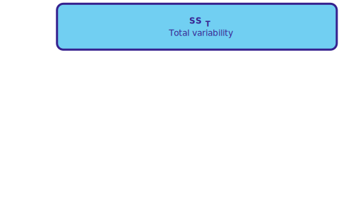{fig-align="center" height=600}

## Partitioning variance

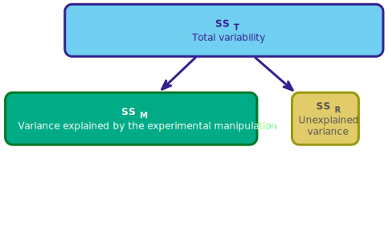{fig-align="center" height=600}


## Partitioning variance

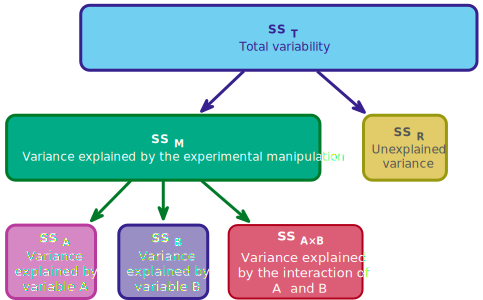{fig-align="center" height=600}

## [L]{.txt_ong}oad and [L]{.txt_ong}ook

```{r}
#| echo: true

xbox_tib |> 
  group_by(game, console) |> 
  describe_distribution(select = injury, ci = 0.95) |> 
  data_remove(c(Variable, Skewness, Kurtosis, n_Missing)) |> 
  display()
```


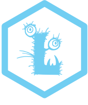{.absolute top=0 left=900 height="80"}

## [V]{.txt_ong}isualize

```{r}
#| echo: true
#| fig-width: 8
#| fig-height: 5

ggplot(xbox_tib, aes(x = console, y = injury, colour = game, shape = game)) +
  stat_summary(fun.data = "mean_cl_normal", geom = "pointrange", position = position_dodge(width = 0.2)) +
  coord_cartesian(ylim = c(0,15)) +
  scale_y_continuous(breaks = 0:15) +
  scale_colour_viridis_d(begin = 0.3, end = 0.85) +
  labs(x = "Type of console", y = "Injury severity (0-20)", colour = "Type of game", shape = "Type of game") +
  theme_minimal()
```


{.absolute top=0 left=900 height="80"}


## Fit the model

- Remember that for *F*-statistics we typically want Type III sums of squares
- We can fit the model in the usual way using `lm()`, but ...

::: fragment

- The `aov_4()` function from the `afex` package
  - An easier option
  - Automatically sets contrasts
  - Built in interaction plot with `afex_plot()`
  - But ... no parameter estimates, limited diagnostic plots, no robust methods


::: txt_xl
```{r}
#| echo: true

xbox_afx <- afex::aov_4(injury ~ game*console + (1|id), data = xbox_tib)
```
:::

:::

## Overall model summary

::: txt_xl
```{r}
#| echo: true
#| eval: false

model_parameters(xbox_afx, es_type = "omega") |> 
  display(use_symbols = TRUE)
```
:::

```{r}
xbox_aov <- model_parameters(xbox_afx, es_type = "omega") 
display(xbox_aov, use_symbols = TRUE, footer = "")
```


:::{.callout-important icon=false}
##  Report`r rproj()`

The type of game significantly moderated the effect of the games console on injury severity, `r report_ez_aov(xbox_aov, row = 3, es_type = "Omega2_partial")`. The interaction explained `r percent_from_ez(xbox_aov, row = 3, value = "Omega2_partial")` of the variance in injuries not attributable to other predictors.

:::

## [E]{.txt_mulberry}valuate assumptions {background-image="media/milton_20180720_100533_crop.jpg" background-size="cover"}

::: fragment
::: center-h
```{r}
#| echo: true
#| message: false
#| warning: false
#| fig-width: 7
#| fig-height: 6

check_model(xbox_afx)
```
:::
:::

{.absolute top=0 left=800 height="80"}

## [I]{.txt_ong}nterpret

```{r}
active_vs_static <- c(-1/2, 1/2)
switch_vs_xbox <- c(-1/2, 1/2)
contrasts(xbox_tib$game) <- active_vs_static
contrasts(xbox_tib$console) <- switch_vs_xbox
xbox_lm <- lm(injury ~ game*console, data = xbox_tib)

int_means <- modelbased::estimate_means(xbox_lm, by = c("console", "game"))
game_means <- modelbased::estimate_means(xbox_lm, by = "game")
console_means <- modelbased::estimate_means(xbox_lm, by = "console")


xbox_tib <- xbox_tib |> mutate(
  id = c(1:10, 21:30, 41:50, 61:70),
  group_id = gl(4, 10, labels = c("Active_xbox", "Active_switch", "Static_xbox", "Static_switch")),
  console_id = c(1:10, 41:50, 21:30, 61:70),
  game_id = c(1:10, 41:50, 21:30, 61:70),
  console_me = rep(c(rep(console_means$Mean[1], 10), rep(console_means$Mean[1], 10)), 2),
  game_me = c(rep(console_means$Mean[2], 20), rep(game_means$Mean[1], 20)),
  int = c(rep(int_means$Mean[3], 10), rep(int_means$Mean[4], 10), rep(int_means$Mean[1], 10), rep(int_means$Mean[2], 10))
  )
```

```{r} 
#| fig-width: 10 
#| fig-height: 6.5

xbox_int <- ggplot(xbox_tib, aes(id, injury, colour = group_id)) + 
  scale_x_continuous(breaks = c(5, 25, 45, 65), labels = c("Xbox (active)", "Switch (active)", "Xbox (static)", "Switch (static)")) +
  scale_colour_manual(values = viridis_4) + 
  geom_point(size = 3) +
  coord_cartesian(ylim = c(0,20), xlim = c(0, 71)) +
  scale_y_continuous(breaks = seq(0, 20, 2)) +
  labs(y = "Injury severity (0-20)", x = "Participant") + 
  theme_minimal(base_size = 18) +
  theme(legend.position = "none")

xbox_int
```

{.absolute top=0 left=900 height="80"}

## [I]{.txt_ong}nterpret


```{r} 
#| fig-width: 10 
#| fig-height: 6.5

xbox_int +
  geom_segment(aes(x = id, y = int, xend = id + 1, yend = int), size = 1)
```

{.absolute top=0 left=900 height="80"}


## [I]{.txt_ong}nterpret the main effect of `console`

```{r}
#| fig-width: 10
#| fig-height: 6.5

xbox_int
```

{.absolute top=0 left=900 height="80"}

## [I]{.txt_ong}nterpret the main effect of `console`

```{r} 
#| fig-width: 10
#| fig-height: 6.5

xbox_console <- ggplot(xbox_tib, aes(console_id, injury, colour = group_id)) + 
  scale_x_continuous(breaks = c(5, 25, 45, 65), labels = c("Xbox (active)", "Xbox (static)", "Switch (active)",  "Switch (static)")) +
  scale_colour_manual(values = viridis_4) + 
  geom_point(size = 3) +
  coord_cartesian(ylim = c(0,20), xlim = c(0, 71)) +
  scale_y_continuous(breaks = seq(0, 20, 2)) +
  labs(y = "Injury severity (0-20)", x = "Participant") + 
  theme_minimal(base_size = 18) +
  theme(legend.position = "none")
xbox_console
```

{.absolute top=0 left=900 height="80"}

## [I]{.txt_ong}nterpret the main effect of `console`

```{r} 
#| fig-width: 10
#| fig-height: 6.5

xbox_console_2 <- ggplot(xbox_tib, aes(console_id, injury, colour = console)) + 
  scale_x_continuous(breaks = c(5, 25, 45, 65), labels = c("Xbox (active)", "Xbox (static)", "Switch (active)",  "Switch (static)")) +
  scale_colour_manual(values = c(viridis_4[1], viridis_4[2])) + 
  geom_point(size = 3) +
  coord_cartesian(ylim = c(0,20), xlim = c(0, 71)) +
  scale_y_continuous(breaks = seq(0, 20, 2)) +
  labs(y = "Injury severity (0-20)", x = "Participant") + 
  theme_minimal(base_size = 18) +
  theme(legend.position = "none")
xbox_console_2
```

{.absolute top=0 left=900 height="80"}

## [I]{.txt_ong}nterpret the main effect of `console`

```{r} 
#| fig-width: 10 
#| fig-height: 6.5

xbox_console_2 + 
  annotate("segment", x = 1, xend = 30, y = console_means$Mean[1], yend = console_means$Mean[1], size = 1, colour = viridis_4[1]) +
  annotate("segment", x = 41, xend = 70, y = console_means$Mean[2], yend = console_means$Mean[2], size = 1, colour = viridis_4[2])
```

{.absolute top=0 left=900 height="80"}

## [I]{.txt_ong}nterpret the main effect of `game`

```{r} 
#| fig-width: 10 
#| fig-height: 6.5

xbox_int
```

{.absolute top=0 left=900 height="80"}

## [I]{.txt_ong}nterpret the main effect of `game`

```{r} 
#| fig-width: 10 
#| fig-height: 6.5

xbox_int +
  scale_colour_manual(values = c(viridis_4[2], viridis_4[2], viridis_4[4], viridis_4[4])) 
```

{.absolute top=0 left=900 height="80"}

## [I]{.txt_ong}nterpret the main effect of `game`

```{r} 
#| fig-width: 10 
#| fig-height: 6.5

xbox_int + 
  scale_colour_manual(values = c(viridis_4[2], viridis_4[2], viridis_4[4], viridis_4[4])) +
  annotate("segment", x = 1, xend = 30, y = game_means$Mean[2], yend = game_means$Mean[2], size = 1, colour = viridis_4[2]) +
  annotate("segment", x = 41, xend = 70, y = game_means$Mean[1], yend = game_means$Mean[1], size = 1, colour = viridis_4[4])
```

{.absolute top=0 left=900 height="80"}

## [I]{.txt_ong}nterpret the interaction (moderation effect)


```{r}
#| fig-height: 4

xbox_int +
  geom_segment(aes(x = id, y = int, xend = id + 1, yend = int), size = 1)
```

::: tbl_s
```{r}
display(xbox_aov, use_symbols = TRUE, footer = "")
```
:::


{.absolute top=0 left=900 height="80"}

## [I]{.txt_ong}nterpreting interactions
### Console moderating the effect of game

```{r}
int_plot <- ggplot2::ggplot(xbox_tib, aes(x = console, y = injury, colour = game)) +
  stat_summary(fun = "mean", geom = "point", size = 4) +
  scale_colour_manual(values = c(viridis_4[1], viridis_4[4])) + 
  coord_cartesian(ylim = c(0,16)) +
  scale_y_continuous(breaks = seq(0, 16, 2)) +
  labs(y = "Injury severity (0-20)", x = "Games console", colour = "Game type") + 
  theme_minimal(base_size = 18) +
  annotate("text", x = 1, y = int_means$Mean[2] + 1, label = sprintf("%.2f", int_means$Mean[2]), size= 4, colour = grey) + 
  annotate("text", x = 1, y = int_means$Mean[1] - 1, label = sprintf("%.2f", int_means$Mean[1]), size= 4, colour = grey) +
  annotate("text", x = 2, y = int_means$Mean[4] + 1, label = sprintf("%.2f", int_means$Mean[4]), size= 4, colour = grey) + 
  annotate("text", x = 2, y = int_means$Mean[3] - 1, label = sprintf("%.2f", int_means$Mean[3]), size= 4, colour = grey)
```


```{r}
#| fig-height: 5.5

int_plot
```


{.absolute top=0 left=900 height="80"}


## [I]{.txt_ong}nterpreting interactions
### Console moderating the effect of game

::::: columns 
:::: {.column width="50%"}

```{r, fig.height = 5.5}
int_plot +
  annotate("segment", x = 0.8, xend = 0.8, y = int_means$Mean[2], yend = int_means$Mean[1], size= 1, colour = mulberry, arrow = arrow(length = unit(0.03, "npc"), ends = "both")) +
  annotate("segment", x = 2.2, xend = 2.2, y = int_means$Mean[4], yend = int_means$Mean[3], size= 1, colour = mulberry, arrow = arrow(length = unit(0.03, "npc"), ends = "both")) +
  annotate("text", x = 0.6, y = mean(int_means$Mean[1:2]), label = sprintf("%.2f", int_means$Mean[2] - int_means$Mean[1]), size= 7, colour = mulberry) + 
  annotate("text", x = 2.4, y = mean(int_means$Mean[3:4]), label = sprintf("%.2f", int_means$Mean[4] - int_means$Mean[3]), size= 7, colour = mulberry)
```
::::

:::: {.column width="50%"}
::: fragment
::: txt_mulberry
::: txt_s
$$
\begin{aligned}
\text{game}_\text{Switch} &= \bar{X}_\text{active, Switch}-\bar{X}_\text{static, Switch} \\
&= 12.90 - 6.70 \\
&= 6.20
\end{aligned}
$$


</br>


$$
\begin{aligned}
\text{game}_\text{Xbox} &= \bar{X}_\text{active, Xbox}-\bar{X}_\text{static, Xbox} \\
&= 9.40 - 7.00 \\
&= 2.40
\end{aligned}
$$

</br>

$$
\begin{aligned}
\text{Interaction} &= \text{game}_\text{Switch} - \text{game}_\text{Xbox} \\
&= 6.2 - 2.40 \\
&= 3.8
\end{aligned}
$$
:::
:::
:::
::::
:::::

{.absolute top=0 left=900 height="80"}


## [I]{.txt_ong}nterpret simple effects
### The effect of type of game within consoles

```{r}
#| echo: true

estimate_contrasts(model = xbox_afx,
                   contrast = "game",
                   by = "console",
                   comparison = "joint",
                   p_adjust = "bonferroni") |> 
  display()
```


```{r}
xbox_se1 <- estimate_contrasts(model = xbox_afx,
                   contrast = "game",
                   by = "console",
                   comparison = "joint",
                   p_adjust = "bonferroni")
```


:::{.callout-important icon=false}
##  Report`r rproj()`

The effect of playing active vs. static games is less significant for the Xbox than the switch. The difference in mean injuries between active and static games was not significantly different for the Xbox, `r report_con(xbox_se1, row = 1)`, but was for the Switch, `r report_con(xbox_se1, row = 2)`.
:::


## Interpreting interactions
### Game moderating the effect of console

```{r}
int_plot_2 <- ggplot2::ggplot(xbox_tib, aes(x = game, y = injury, colour = console)) +
  stat_summary(fun = "mean", geom = "point", size = 4) +
  scale_colour_manual(values = c(viridis_4[1], viridis_4[4])) + 
  coord_cartesian(ylim = c(0,16)) +
  scale_y_continuous(breaks = seq(0, 16, 2)) +
  labs(y = "Injury severity (0-20)", colour = "Games console", x = "Game type") + 
  theme_minimal(base_size = 18) +
  annotate("text", x = 1, y = int_means$Mean[1] + 1, label = sprintf("%.2f", int_means$Mean[1]), size= 4, colour = grey) + 
  annotate("text", x = 1, y = int_means$Mean[3] - 1, label = sprintf("%.2f", int_means$Mean[3]), size= 4, colour = grey) +
  annotate("text", x = 2, y = int_means$Mean[4] + 1, label = sprintf("%.2f", int_means$Mean[4]), size= 4, colour = grey) + 
  annotate("text", x = 2, y = int_means$Mean[2] - 1, label = sprintf("%.2f", int_means$Mean[2]), size= 4, colour = grey)
```


```{r}
#| fig-height: 5.5

int_plot_2
```

## Interpreting interactions
### Game moderating the effect of console

:::: columns 
::: {.column width="50%"}

```{r} 
#| fig-height: 5.5

int_plot_2 +
  annotate("segment", x = 0.8, xend = 0.8, y = int_means$Mean[3], yend = int_means$Mean[1], size= 1, colour = mulberry, arrow = arrow(length = unit(0.03, "npc"), ends = "both")) +
  annotate("segment", x = 2.2, xend = 2.2, y = int_means$Mean[4], yend = int_means$Mean[2], size= 1, colour = mulberry, arrow = arrow(length = unit(0.03, "npc"), ends = "both")) +
  annotate("text", x = 0.6, y = mean(int_means$Mean[c(3, 1)]), label = sprintf("%.2f", int_means$Mean[3] - int_means$Mean[1]), size= 7, colour = mulberry) + 
  annotate("text", x = 2.4, y = mean(int_means$Mean[c(4, 2)]), label = sprintf("%.2f", int_means$Mean[4] - int_means$Mean[2]), size= 7, colour = mulberry)
```
:::

::: {.column width="50%"}
::: fragment
::: txt_mulberry
::: txt_s
$$
\begin{aligned}
\text{console}_\text{active} &= \bar{X}_\text{active, Switch}-\bar{X}_\text{active, Xbox} \\
&= 12.90 - 9.4 \\
&= 3.5
\end{aligned}
$$

</br>

$$
\begin{aligned}
\text{console}_\text{static} &= \bar{X}_\text{static, Switch}-\bar{X}_\text{static, Xbox} \\
&= 6.7 - 7.00 \\
&= -0.3
\end{aligned}
$$

</br>

$$
\begin{aligned}
\text{Interaction} &= \text{console}_\text{active} - \text{console}_\text{static} \\
&= 3.5 - (-0.3) \\
&= 3.8
\end{aligned}
$$
:::
:::
:::
:::
::::

{.absolute top=0 left=900 height="80"}

## [I]{.txt_ong}nterpret: simple effects analysis
### The effect of console within the type of game

```{r}
#| echo: true

estimate_contrasts(model = xbox_afx,
                   contrast = "console",
                   by = "game",
                   comparison = "joint",
                   p_adjust = "bonferroni") |> 
  display()
```


```{r}
xbox_se2 <- estimate_contrasts(model = xbox_afx,
                   contrast = "console",
                   by = "game",
                   comparison = "joint",
                   p_adjust = "bonferroni")
```


:::{.callout-important icon=false}
##  Report`r rproj()`

The effect of playing Xbox vs. Switch games is less significant for static games than active ones. The difference in mean injuries between Xbox and Switch games was not significantly different for static games, `r report_con(xbox_se2, row = 1)`, but was for the active games, `r report_con(xbox_se2, row = 2)`.
:::


##

::: txt_xl
::: {.callout-warning icon = false}
##  The danger zone!

Repeat the following mantra:

**"It is never sensible to interpret main effects in the presence of a significant interaction effect."**

:::
:::

## {background-video="../shared_media/video/lazinc_durt_the_time_is_here.mp4" background-size="cover"}

# The beer goggles effect

## A science reflecting art example

:::: columns 
::: {.column width="60%"}

- The beer goggles effect: subjective perceptions of physical attractiveness become inaccurate after drinking alcohol
- Chen et al., (2014)^[Chen, et al., (2014). The moderating effect of stimulus attractiveness on the effect of alcohol consumption on attractiveness ratings. Alcohol and Alcoholism, 49, 515–519. [https://doi.org/10.1093/alcalc/agu026](https://doi.org/10.1093/alcalc/agu026)]
  - Alcohol consumption reduces accuracy in symmetry judgements
  - Symmetric faces have been shown to be rated as more attractive.
  - If the beer-goggles effect is driven by alcohol impairing symmetry judgements then you’d expect a stronger effect for unattractive (asymmetric) faces than attractive (symmetric) ones
- Fictional data but matches Chen et al. findings

:::

::: {.column width="40%"}
::: center-h

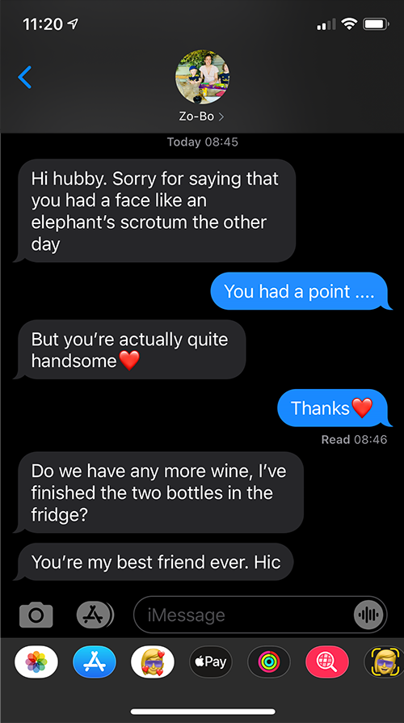{height=500}

:::
:::
::::


## Study design

:::: columns 
::: {.column width="60%"}

- 48 Participants (8 per group)
- Predictor: `alcohol`
  - **Placebo** group: 500 ml of alcohol-free beer
  - **Low-dose** group: 500 ml of beer (4% ABV);
  - **High-dose** group: 500 ml of beer (7% ABV).
- Predictor: `facetype`
 - Rated 50 **unattractive** (asymmetric) faces
 - Rated 50 **attractive** (symmetric) faces
- Outcome:
  - Median rating of the 50 photos on a scale from 0 (pass me a paper bag) to 10 (pass me their phone number)


::: {.callout-note icon = false}
##  Statis-tip

This is a **two-way independent factorial design**.

:::
:::

::: {.column width="40%"}
::: center-h

{height=500}
:::
:::
::::

## [L]{.txt_ong}oad and [L]{.txt_ong}ook

```{r}
#| echo: true

goggles_tib |> 
  group_by(facetype, alcohol) |> 
  describe_distribution(select = attractiveness, ci = 0.95) |> 
  data_remove(c(Variable, Skewness, Kurtosis, n_Missing)) |> 
  display()
```


{.absolute top=0 left=900 height="80"}

## [V]{.txt_ong}isualize


::: center-h
```{r goggles_plot}
#| fig-width: 12
#| fig-height: 6.5

goggles_lm <- lm(attractiveness ~ facetype*alcohol, data = goggles_tib)

dodge <- 0.4
dodge_lbl <- 0.3

gint_means <- modelbased::estimate_means(goggles_lm, by = c("alcohol", "facetype")) |> 
  dplyr::mutate(
    xcord = c(1-dodge_lbl, 1+dodge_lbl, 2-dodge_lbl, 2+dodge_lbl, 3-dodge_lbl, 3+dodge_lbl),
    yjit = c(-1, 1, -1, 1, 1, -1)
  )

goggle_plot <- ggplot2::ggplot(goggles_tib, aes(x = alcohol, y = attractiveness, colour = facetype)) +
  geom_point(alpha = 0.5, position = position_jitterdodge(dodge.width = dodge)) +
  stat_summary(fun.data = "mean_cl_normal", geom = "pointrange", position = position_dodge(width = dodge), size = 1) +
  coord_cartesian(ylim = c(0, 10)) +
  scale_y_continuous(breaks = 0:10) +
  scale_colour_manual(values = c(viridis_2[1], viridis_2[2])) +
  labs(x = "Alcohol consumption", y = "Attractiveness (0-10)", colour = "Type of face") +
  theme_minimal(base_size = 20) +
  annotate("text", x = gint_means$xcord, y = gint_means$Mean, label = sprintf("%.2f", gint_means$Mean), size= 4, colour = grey)
goggle_plot
```
:::

{.absolute top=0 left=900 height="80"}


## Fit the model

::: txt_xl
```{r}
#| echo: true
#| eval: false
goggles_afx <- afex::aov_4(attractiveness ~ facetype*alcohol + (1|id), data = goggles_tib)

model_parameters(goggles_afx, es_type = "omega") |> 
  display(use_symbols = TRUE)
```
:::

```{r}
goggles_afx <- afex::aov_4(attractiveness ~ facetype*alcohol + (1|id), data = goggles_tib)
goggles_aov <- model_parameters(goggles_afx, es_type = "omega") 
display(goggles_aov, use_symbols = TRUE, footer = "")
```


:::{.callout-important icon=false}
##  Report`r rproj()`

The dose of alcohol significantly moderated the effect of the type of face on attractiveness ratings, `r report_ez_aov(goggles_aov, row = 3, es_type = "Omega2_partial")`. The interaction explained `r percent_from_ez(goggles_aov, row = 3, value = "Omega2_partial")` of the variance in injuries not attributable to other predictors.

:::


## [E]{.txt_mulberry}valuate assumptions {background-image="media/milton_20180720_100533_crop.jpg" background-size="cover"}

::: fragment
::: center-h
```{r}
#| echo: true
#| message: false
#| warning: false
#| fig-width: 7
#| fig-height: 6

check_model(goggles_afx)
```
:::
:::

{.absolute top=0 left=800 height="80"}


## [I]{.txt_ong}nterpret simple effects
### Simple effects: facetype within alcohol group

```{r}
estimate_contrasts(model = goggles_afx,
                   contrast = "facetype",
                   by = "alcohol",
                   comparison = "joint",
                   p_adjust = "bonferroni") |> 
  display()
```


## [I]{.txt_ong}nterpret simple effects
### Simple effects: facetype within alcohol group

::: center-h
```{r}
#| fig-width: 12
#| fig-height: 6.5

goggle_plot
```
:::

{.absolute top=0 left=900 height="80"}

## [I]{.txt_ong}nterpret simple effects
### Simple effects: facetype within alcohol group

::: center-h
```{r}
#| fig-width: 12
#| fig-height: 6.5

goggle_plot +
  annotate("segment", x = 1, xend = 1, y = gint_means$Mean[1], yend = gint_means$Mean[2], size= 1, colour = mulberry, arrow = arrow(length = unit(0.02, "npc"), ends = "both")) +
  annotate("segment", x = 2, xend = 2, y = gint_means$Mean[3], yend = gint_means$Mean[4], size= 1, colour = mulberry, arrow = arrow(length = unit(0.02, "npc"), ends = "both")) +
  annotate("segment", x = 3, xend = 3, y = gint_means$Mean[5], yend = gint_means$Mean[6], size= 1, colour = mulberry, arrow = arrow(length = unit(0.02, "npc"), ends = "both")) +
  annotate("label", x = 1, y = 9, label = "italic(p) < '0.001'", parse = T, size = 7, colour = mulberry) +
  annotate("label", x = 2, y = 9, label = "italic(p) == '0.024'", parse = T, size = 7, colour = mulberry) +
  annotate("label", x = 3, y = 9, label = "italic(p) == '1.000'", parse = T, size = 7, colour = mulberry)
```

:::

{.absolute top=0 left=900 height="80"}

## [I]{.txt_ong}nterpret simple effects
### Simple effects: alcohol within facetype

```{r}
estimate_contrasts(model = goggles_afx,
                   contrast = "alcohol",
                   by = "facetype",
                   comparison = "joint",
                   p_adjust = "bonferroni") |> 
  display()
```

{.absolute top=0 left=900 height="80"}

## [I]{.txt_ong}nterpret simple effects
### Simple effects: alcohol within facetype

::: center-h
```{r}
#| fig-width: 12
#| fig-height: 6.5

goggle_plot
```
:::

{.absolute top=0 left=900 height="80"}

## [I]{.txt_ong}nterpret simple effects
### Simple effects: alcohol within facetype

::: center-h
```{r}
#| fig-width: 12
#| fig-height: 6.5

goggle_plot +
  annotate("label", x = 2, y = 2, label = "italic(p) < '0.001'", parse = T, size = 7, colour =  viridis_2[1]) +
  annotate("label", x = 2, y = 9, label = "italic(p) == '1.000'",  parse = T, size = 7, colour = viridis_2[2])
```
:::

{.absolute top=0 left=900 height="80"}


## Summary

- Factorial designs: two or more predictor variables are manipulated
- Moderation: Where the effect of one predictor differs at levels of another-
- Testing moderation (interaction effects)  
  - The model: a linear model in which predictors are entered as well as their interaction
  - Interpret interactions using plots or simple effects analysis, which quantifies the effect of one predictor at each level of another
  - The process of E.V.I.L.
- Main effects
  - The effect of one predictor variable collapsed across levels of other predictors
  - Uninteresting in the presence of a significant interaction
