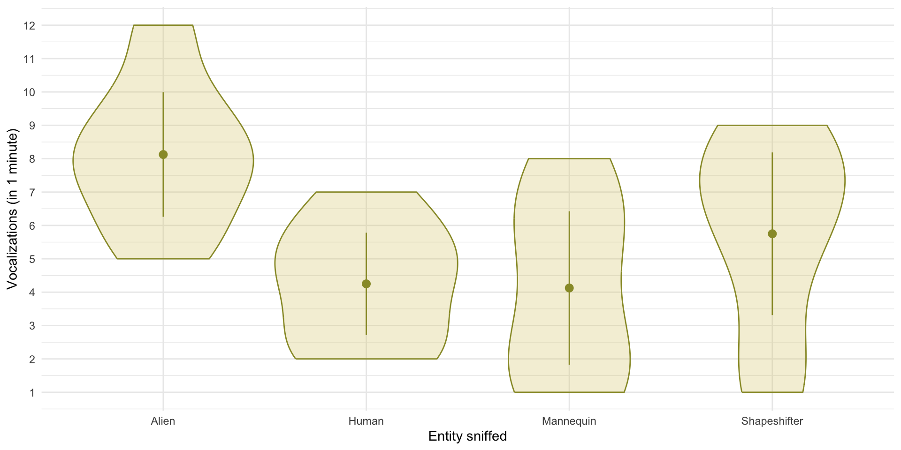
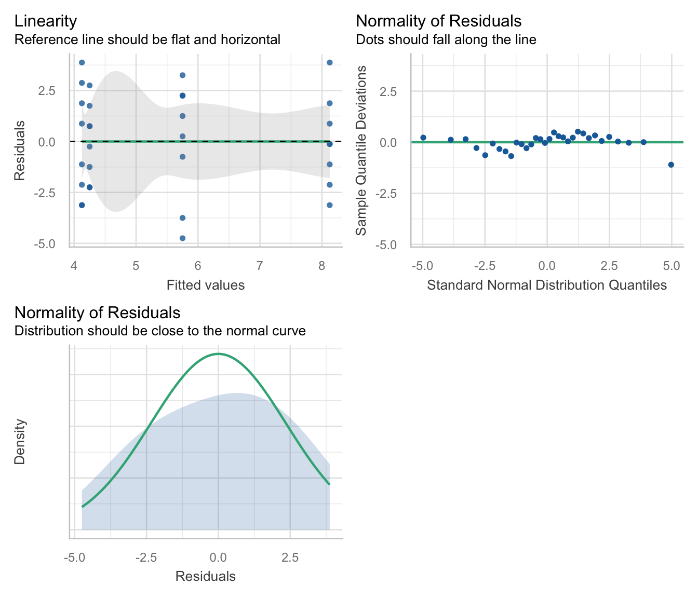
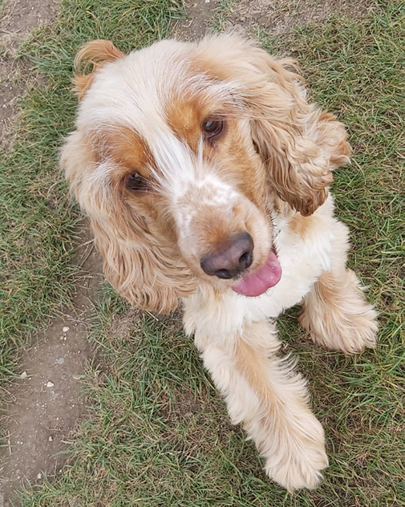
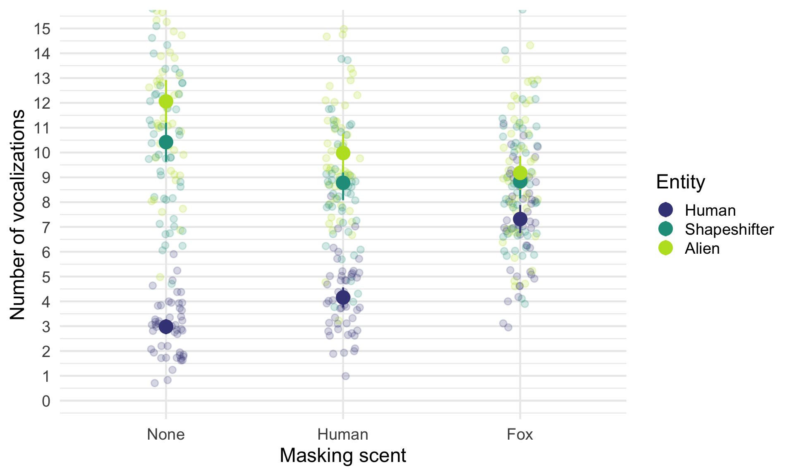
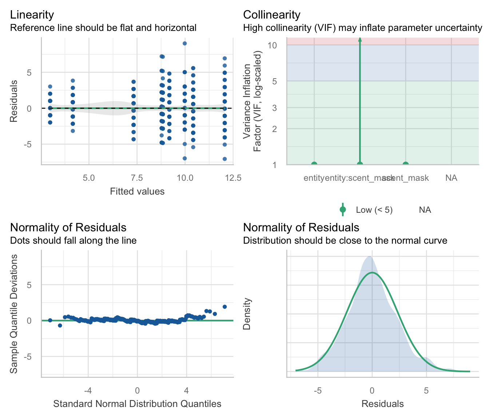
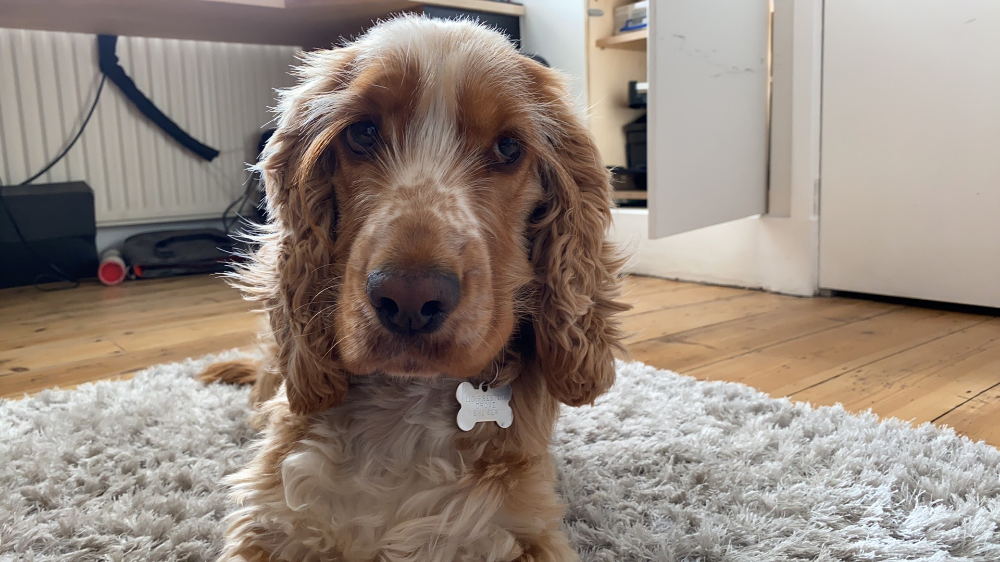
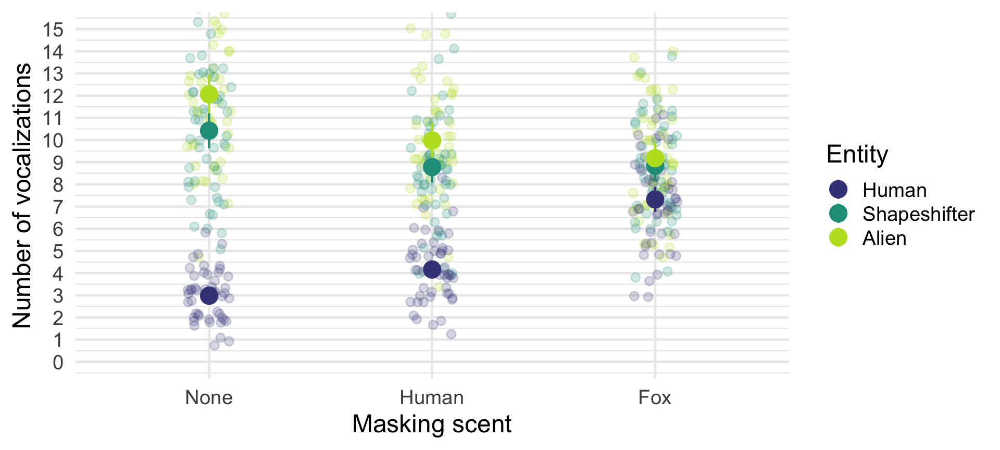
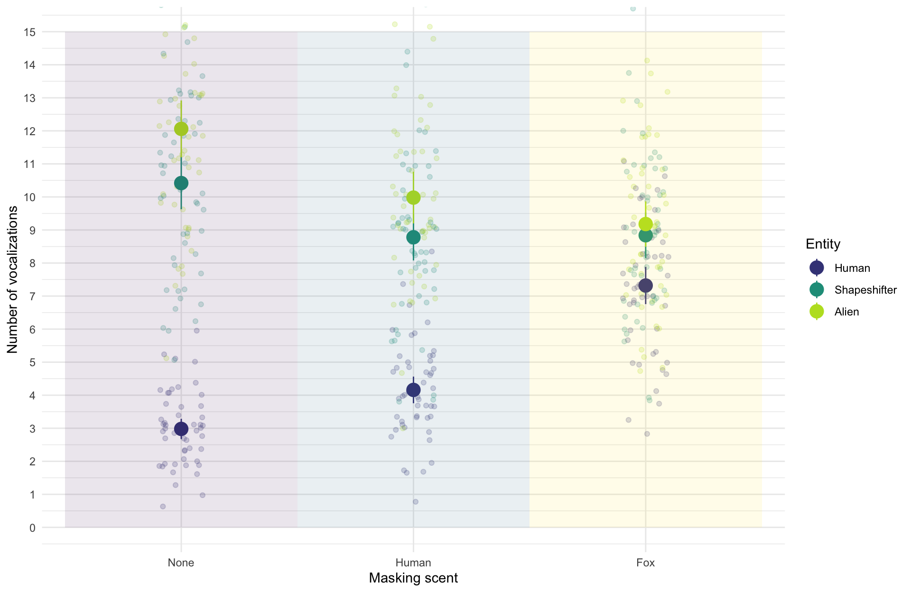

# Repeated measures designs

Andy Field, University of Sussex

Links: [bsky.app](https://bsky.app/profile/profandyfield.bsky.social) \| [youtube.com](https://www.youtube.com/user/ProfAndyField) \| [discoveringstatistics.com](https://www.discoveringstatistics.com) \| [discovr.rocks](https://www.discovr.rocks) \| [statisticsadventure.com](https://www.statisticsadventure.com)

## About this version

This is a plain-text version of the lecture slides. Each slide starts with a heading such as “Slide 5”, and the numbers match the slide numbers shown in the lecture. Content that appeared one piece at a time, in columns or in tabs is shown in reading order. Videos and interactive apps are given as links.

## Slide 2

Video clip: [space opening scene](https://profandyfield.github.io/statistics_lectures/shared_media/video/space_opening_scene.mp4)

## Slide 3

Video clip: [daze intro 01](https://profandyfield.github.io/statistics_lectures/shared_media/video/daze_intro_01.mp4)

## Slide 4

Video clip: [daze intro 02](https://profandyfield.github.io/statistics_lectures/shared_media/video/daze_intro_02.mp4)

## Slide 5

Video clip: [transmission 01](https://profandyfield.github.io/statistics_lectures/shared_media/video/transmission_01.mp4)

## Slide 6

Video clip: [daze intro 03](https://profandyfield.github.io/statistics_lectures/shared_media/video/daze_intro_03.mp4)

## Slide 7

Video clip: [daze intro 04](https://profandyfield.github.io/statistics_lectures/shared_media/video/daze_intro_04.mp4)

## Slide 8

Video clip: [space hippo](https://profandyfield.github.io/statistics_lectures/shared_media/video/space_hippo.mp4)

## Slide 9


## Slide 10


- **Systematic variance**: created by our manipulation
- **Unsystematic variance**: variance created by unknown factors

## Slide 11: Benefits of repeated measures designs

- Sensitivity
  - Unsystematic variance is reduced
  - More sensitive to experimental effects
- Economy
  - Less participants are needed
  - But, be careful of fatigue

## Slide 12: Can puppies sniff out aliens?

- Outcome = vocalizations during 1 min sniffing (`vocalizations`)
- Predictor: type of entity being sniffed (`entity`)
  - Alien (not in humanoid form)
  - Human (control for alien vs human)
  - Mannequin (control for humanoid form)
  - Shapeshifter (alien in humanoid form)
- `dog_name` indicates the name of the dog (*N* = 8)

> **Note: Statis-tip**
>
> This is a **one-way repeated measures design**.

## Slide 13: The data

|  | dog_name | Alien | Human | Mannequin | Shapeshifter | Mean | Variance |
|----|----|----|----|----|----|----|----|
|  | Milton | 8 | 7 | 1 | 6 | 5.50 | 7.25 |
|  | Woofy | 9 | 5 | 2 | 5 | 5.25 | 6.19 |
|  | Ramsey | 6 | 2 | 3 | 8 | 4.75 | 5.69 |
|  | Mr. Snifficus III | 5 | 3 | 1 | 9 | 4.50 | 8.75 |
|  | Willock | 8 | 4 | 5 | 8 | 6.25 | 3.19 |
|  | The Venerable Dr. Waggy | 7 | 5 | 6 | 7 | 6.25 | 0.69 |
|  | Lord Scenticle | 10 | 2 | 7 | 2 | 5.25 | 11.69 |
|  | Professor Nose | 12 | 6 | 8 | 1 | 6.75 | 15.69 |
| **Mean** | — | 8.12 | 4.25 | 4.12 | 5.75 | — | — |

## Slide 14: The data in R

|     | dog_name                | entity       | vocalizations |
|-----|-------------------------|--------------|---------------|
| 1   | Milton                  | Alien        | 8             |
| 2   | Milton                  | Human        | 7             |
| 3   | Milton                  | Mannequin    | 1             |
| 4   | Milton                  | Shapeshifter | 6             |
| 5   | Woofy                   | Alien        | 9             |
| 6   | Woofy                   | Human        | 5             |
| 7   | Woofy                   | Mannequin    | 2             |
| 8   | Woofy                   | Shapeshifter | 5             |
| 9   | Ramsey                  | Alien        | 6             |
| 10  | Ramsey                  | Human        | 2             |
| 11  | Ramsey                  | Mannequin    | 3             |
| 12  | Ramsey                  | Shapeshifter | 8             |
| 13  | Mr. Snifficus III       | Alien        | 5             |
| 14  | Mr. Snifficus III       | Human        | 3             |
| 15  | Mr. Snifficus III       | Mannequin    | 1             |
| 16  | Mr. Snifficus III       | Shapeshifter | 9             |
| 17  | Willock                 | Alien        | 8             |
| 18  | Willock                 | Human        | 4             |
| 19  | Willock                 | Mannequin    | 5             |
| 20  | Willock                 | Shapeshifter | 8             |
| 21  | The Venerable Dr. Waggy | Alien        | 7             |
| 22  | The Venerable Dr. Waggy | Human        | 5             |
| 23  | The Venerable Dr. Waggy | Mannequin    | 6             |
| 24  | The Venerable Dr. Waggy | Shapeshifter | 7             |
| 25  | Lord Scenticle          | Alien        | 10            |
| 26  | Lord Scenticle          | Human        | 2             |
| 27  | Lord Scenticle          | Mannequin    | 7             |
| 28  | Lord Scenticle          | Shapeshifter | 2             |
| 29  | Professor Nose          | Alien        | 12            |
| 30  | Professor Nose          | Human        | 6             |
| 31  | Professor Nose          | Mannequin    | 8             |
| 32  | Professor Nose          | Shapeshifter | 1             |

Table 2: Data for the sniffer dog example

## Slide 15: Repeated measures and the linear model

``` math
 \begin{aligned} \text{vocalizations}_{i} & = b_{0} + b_{1}\text{entity}_{i} + \varepsilon_{i} \end{aligned} 
```

``` math
 \begin{aligned} \text{vocalizations}_{i} & = b_{0} + b_{1}\text{alien vs. manq}_{i} + b_{2}\text{shape vs. manq}_{i} + b_{3}\text{human vs. manq}_{i} + \varepsilon_{i} \\ \end{aligned} 
```

> **Warning: The danger zone!**
>
> - Same participants in all conditions
>   - Scores across conditions correlate
>   - Violates the assumption of independent residuals (think back to the lecture on bias)

## Slide 16: Approaches to repeated measures designs and the GLM

### Approach 1

- Fit a different kind of model that adjusts for these dependencies (a **multilevel model**)
  - Can model different kinds of dependency in errors
  - It’s a bit complicated (we teach it at PG)

### Approach 2

- Assume **sphericity**
  - We make an additional assumption about dependencies between scores
  - We estimate departures from this assumption
  - We correct for these departures by adjusting the degrees of freedom for *F*

## Slide 17: What is sphericity, \\\epsilon\\ ?

|  | Alien-Human | Alien-Mannequin | Alien-Shapeshifter | Human-Mannequin | Human-Shapeshifter | Mannequin-Shapeshifter |
|----|----|----|----|----|----|----|
| Milton | 1 | 7 | 2 | 6 | 1 | -5 |
| Woofy | 4 | 7 | 4 | 3 | 0 | -3 |
| Ramsey | 4 | 3 | -2 | -1 | -6 | -5 |
| Mr. Snifficus III | 2 | 4 | -4 | 2 | -6 | -8 |
| Willock | 4 | 3 | 0 | -1 | -4 | -3 |
| The Venerable Dr. Waggy | 2 | 1 | 0 | -1 | -2 | -1 |
| Lord Scenticle | 8 | 3 | 8 | -5 | 0 | 5 |
| Professor Nose | 6 | 4 | 11 | -2 | 5 | 7 |
| Variance | 5.27 | 4.29 | 25.70 | 11.55 | 14.29 | 26.55 |

## Slide 18: Sphericity, \\\epsilon\\

> The differences between pairs of groups should have equal variances

### How is it estimated?

- Greenhouse-Geisser estimate, $`\hat{\epsilon}`$
- Huynh-Feldt estimate, $`\tilde{\epsilon}`$
- If $`\epsilon = 1`$, sphericity is perfect
- If $`\epsilon < 1`$, sphericity is violated (to some degree)

### What do we do about it?

- (R can) multiply *df* by these estimates to correct for the effect of sphericity
- In doing so, we correct the *df* by the degree to which spehercity is violated
  - *df* get smaller making it harder for the test statistic to be significant
- Routinely apply the G-G correction and forget about sphericity

## Slide 19

Video clip: [sphericity song](https://profandyfield.github.io/statistics_lectures/ds_10_rm_designs/media/sphericity_song.mp4)

## Slide 20: Fitting the model

- The `afex::aov_4()` function
  - Specify the repeated measures with `(rm_predictors|id_var)`
  - Automatically sets contrasts
  - Built in interaction plot with `afex_plot()`
  - But … no parameter estimates, limited diagnostic plots, no robust methods

- Use `glmmTMB::glmmTMB()`

  - A trickier but more flexible option that we don’t teach you
  - Manually set contrasts
  - Can get parameter estimates, diagnostic plots, and robust methods

## Slide 21


## Slide 22: Load and Look

``` r
sniff_tib |> 
  group_by(entity) |> 
  describe_distribution(select = "vocalizations") |> 
  data_remove(c("Variable", "n_Missing")) |> # optional to remove redundant column
  display()
```

| entity       | Mean | SD   | IQR  | Range         | Skewness | Kurtosis | n   |
|--------------|------|------|------|---------------|----------|----------|-----|
| Alien        | 8.12 | 2.23 | 3.50 | (5.00, 12.00) | 0.41     | 0.01     | 8   |
| Human        | 4.25 | 1.83 | 3.50 | (2.00, 7.00)  | 0.07     | -1.22    | 8   |
| Mannequin    | 4.12 | 2.75 | 5.50 | (1.00, 8.00)  | 0.16     | -1.78    | 8   |
| Shapeshifter | 5.75 | 2.92 | 5.25 | (1.00, 9.00)  | -0.78    | -0.76    | 8   |


## Slide 23: Visualize




## Slide 24: Fit the model: Contrasts

If the dog training has been successful then we’d expect sniffer dogs to make more vocalizations when sniffing alien entities than non alien-entities.

- **Contrast 1**: {alien, shapeshifter} vs. {human, mannequin}

We have two ‘chunks’ in contrast 1 that would then need to be decomposed:

- **Contrast 2**: {alien} vs. {shapeshifter}
- **Contrast 3**: {human} vs. {mannequin}

Using the rules for contrast coding we’d get the codes in Table 4:

| Group        | Contrast 1 | Contrast 2 | Contrast 3 |
|--------------|------------|------------|------------|
| Alien        | 1/2        | 1/2        | 0          |
| Human        | -1/2       | 0          | 1/2        |
| Mannequin    | -1/2       | 0          | -1/2       |
| Shapeshifter | 1/2        | -1/2       | 0          |

Table 4: Contrast coding for the entity variable

## Slide 25: Fitting the model

``` r
sniff_afx <- afex::aov_4(vocalizations ~ entity + (entity|dog_name),
                         data = sniff_tib)
```

## Slide 26: Evaluate fit

``` r
model_parameters(sniff_afx, es_type = "omega") |> 
  display(use_symbols = TRUE)
```

| Parameter | Sum_Squares | Sum_Squares_Error | df | df (error) | Mean_Square | F | p | ω² (partial) |
|----|----|----|----|----|----|----|----|----|
| entity | 83.12 | 153.37 | 1.60 | 11.19 | 13.71 | 3.79 | 0.063 | 0.24 |

ANOVA estimation for factorial designs using ‘afex’

> **Important: ReportR**
>
> The entity sniffed had a non-significant effect on the number of vocalizations by sniffer dogs, F(2, 11) = 3.79, *p* = 0.063, $`\hat{\omega}^2`$ = 0.24.


## Slide 27: Evaluate assumptions

``` r
check_model(sniff_afx)
```



## Slide 28: Interpret

> **Warning: The danger zone!**
>
> - At this point we would stop interpreting the results **because the overall effect was non-significant**.
> - What follows is for pedagogic kicks and giggles.


## Slide 29: Interpret contrasts

``` r
sniff_cons <- cbind(
  aliens_vs_non = c(1/2, -1/2, -1/2, 1/2),
  alien_vs_shape = c(1/2, 0, 0, -1/2),
  human_vs_manquin = c(0, 1/2, -1/2, 0)
  )

estimate_contrasts(sniff_afx, contrast = "entity", comparison = sniff_cons) |> 
  display()
```

| Parameter        | Difference | SE   | 95% CI        | t(7) | p     |
|------------------|------------|------|---------------|------|-------|
| aliens_vs_non    | 2.75       | 0.64 | ( 1.23, 4.27) | 4.29 | 0.004 |
| alien_vs_shape   | 1.19       | 0.90 | (-0.93, 3.31) | 1.33 | 0.227 |
| human_vs_manquin | 0.06       | 0.60 | (-1.36, 1.48) | 0.10 | 0.920 |

Marginal Contrasts Analysis

> **Important: ReportR**
>
> Contrasts revealed that vocalizations were significantly higher when sniffing aliens compared to non-aliens, $`\bar{X}_\text{Diff}`$ = 2.75 (1.23, 4.27), *t*(7) = 4.29, *p* = 0.004), but not when sniffing an alien compared to a shapeshifter, $`\bar{X}_\text{Diff}`$ = 1.19 (-0.93, 3.31), *t*(7) = 1.33, *p* = 0.227 or when sniffing a human compared to a mannequin, $`\bar{X}_\text{Diff}`$ = 0.06 (-1.36, 1.48), *t*(7) = 0.10, *p* = 0.920).


## Slide 30: Interpret post hoc tests

> **Warning: The danger zone!**
>
> - You wouldn’t do contrasts AND *post hoc* tests, you’d do one or the other.
> - We wouldn’t interpret these particular *post hoc* tests given the main effect of the entity sniffed was not significant.

``` r
estimate_contrasts(sniff_afx, contrast = "entity", p_adjust = "bonferroni") |> 
  display()
```

| Level1       | Level2    | Difference | SE   | 95% CI         | t(7)  | p       |
|--------------|-----------|------------|------|----------------|-------|---------|
| Human        | Alien     | -3.87      | 0.81 | (-5.79, -1.96) | -4.78 | 0.012   |
| Mannequin    | Alien     | -4.00      | 0.73 | (-5.73, -2.27) | -5.47 | 0.006   |
| Shapeshifter | Alien     | -2.37      | 1.79 | (-6.61, 1.86)  | -1.33 | \> .999 |
| Mannequin    | Human     | -0.13      | 1.20 | (-2.97, 2.72)  | -0.10 | \> .999 |
| Shapeshifter | Human     | 1.50       | 1.34 | (-1.66, 4.66)  | 1.12  | \> .999 |
| Shapeshifter | Mannequin | 1.62       | 1.82 | (-2.68, 5.93)  | 0.89  | \> .999 |

Marginal Contrasts Analysis

## Slide 31

Audio clip: [spaceship interior](https://profandyfield.github.io/statistics_lectures/shared_media/audio/spaceship_interior.mp3)

## Slide 32

Video clip: [daze middle 01](https://profandyfield.github.io/statistics_lectures/shared_media/video/daze_middle_01.mp4)

## Slide 33

Video clip: [transmission 02 lme](https://profandyfield.github.io/statistics_lectures/shared_media/video/transmission_02_lme.mp4)

## Slide 34

Video clip: [daze middle 02](https://profandyfield.github.io/statistics_lectures/shared_media/video/daze_middle_02.mp4)

## Slide 35 (new section): Scenting a victory … factorial repeated measures designs

## Slide 36: Can scents distract the sniffer dogs?

- 50 sniffer dogs
  - Participated in all conditions
  - Sniffed 9 different ‘things’
- Predictor: `entity`
  - **Human**: the dog sniffs a human
  - **Shapeshifter** the dog sniffs an alien in humanoid form
  - **Alien** the dog sniffs an alien in lizard form
- Predictor: `scent_mask`
  - The entity had no masking scent (**none**)
  - The entity was smeared with **human** pheromones
  - The entity was smeared with **fox** pheromones
- Outcome: The number of `vocalizations` during each 1 minute sniff



> **Note: Statis-tip**
>
> This is a **two-way repeated measures design**.

## Slide 37: The model

- Let’s simplify things by ignoring the fact that `entity` and `scent_mask` will be represented by two dummy variables each (and the interaction by 4!)
- The simplest version of the repeated measures model instead treats the effects of predictor variables as fixed, but acknowledges that dogs, overall, will vary in their vocalizations

``` math
 \begin{aligned} \text{vocalizations}_{ij} & = \left[\hat{b}_{0} + \hat{b}_{1}\text{entity}_{ij} + \hat{b}_{2}\text{scent}_{ij} + \hat{b}_{3}(\text{entity}_{ij}\times\text{scent}_{ij})\right] +\\ &\quad \left[u_{0j} + e_{ij}\right]\\ u_{0j} &\sim N(0, \sigma^{2}_{\mu_0}) \end{aligned} 
```

- $`u_{0j}`$ represents the difference in vocalizations for a particular dog from the overall mean number of vocalizations
- The model also includes a parameter that estimates the variance in vocalizations across dogs ($`\sigma^{2}_{\mu_0}`$)

## Slide 38: Load and Look

|     | dog_id | entity       | scent_mask | vocalizations |
|-----|--------|--------------|------------|---------------|
| 1   | 56f9p  | Alien        | Fox        | 7             |
| 2   | 56f9p  | Alien        | Human      | 9             |
| 3   | 56f9p  | Alien        | None       | 8             |
| 4   | 56f9p  | Shapeshifter | Fox        | 11            |
| 5   | 56f9p  | Shapeshifter | Human      | 6             |
| 6   | 56f9p  | Shapeshifter | None       | 8             |
| 7   | 56f9p  | Human        | Fox        | 3             |
| 8   | 56f9p  | Human        | Human      | 3             |
| 9   | 56f9p  | Human        | None       | 3             |
| 10  | 2m89y  | Alien        | Fox        | 8             |
| 11  | 2m89y  | Alien        | Human      | 8             |
| 12  | 2m89y  | Alien        | None       | 10            |
| 13  | 2m89y  | Shapeshifter | Fox        | 10            |
| 14  | 2m89y  | Shapeshifter | Human      | 7             |
| 15  | 2m89y  | Shapeshifter | None       | 10            |
| 16  | 2m89y  | Human        | Fox        | 6             |
| 17  | 2m89y  | Human        | Human      | 4             |
| 18  | 2m89y  | Human        | None       | 3             |
| 19  | 682h3  | Alien        | Fox        | 13            |
| 20  | 682h3  | Alien        | Human      | 5             |
| 21  | 682h3  | Alien        | None       | 5             |
| 22  | 682h3  | Shapeshifter | Fox        | 4             |
| 23  | 682h3  | Shapeshifter | Human      | 4             |
| 24  | 682h3  | Shapeshifter | None       | 7             |
| 25  | 682h3  | Human        | Fox        | 8             |
| 26  | 682h3  | Human        | Human      | 2             |
| 27  | 682h3  | Human        | None       | 2             |
| 28  | 7o1d2  | Alien        | Fox        | 7             |
| 29  | 7o1d2  | Alien        | Human      | 10            |
| 30  | 7o1d2  | Alien        | None       | 12            |
| 31  | 7o1d2  | Shapeshifter | Fox        | 9             |
| 32  | 7o1d2  | Shapeshifter | Human      | 6             |
| 33  | 7o1d2  | Shapeshifter | None       | 12            |
| 34  | 7o1d2  | Human        | Fox        | 8             |
| 35  | 7o1d2  | Human        | Human      | 2             |
| 36  | 7o1d2  | Human        | None       | 2             |
| 37  | 2k3vo  | Alien        | Fox        | 11            |
| 38  | 2k3vo  | Alien        | Human      | 9             |
| 39  | 2k3vo  | Alien        | None       | 11            |
| 40  | 2k3vo  | Shapeshifter | Fox        | 10            |
| 41  | 2k3vo  | Shapeshifter | Human      | 9             |
| 42  | 2k3vo  | Shapeshifter | None       | 7             |
| 43  | 2k3vo  | Human        | Fox        | 7             |
| 44  | 2k3vo  | Human        | Human      | 5             |
| 45  | 2k3vo  | Human        | None       | 2             |
| 46  | ik011  | Alien        | Fox        | 6             |
| 47  | ik011  | Alien        | Human      | 9             |
| 48  | ik011  | Alien        | None       | 11            |
| 49  | ik011  | Shapeshifter | Fox        | 8             |
| 50  | ik011  | Shapeshifter | Human      | 9             |

Table 7: Data for the scent masking example (first 50 of 450 rows)

## Slide 39: Load and Look

``` r
scent_tib |> 
  group_by(entity, scent_mask) |> 
  describe_distribution(select = "vocalizations")  |> 
  data_remove(c("Variable", "n_Missing")) |> # optional to remove redundant column
  display()
```

| entity       | scent_mask | Mean  | SD   | IQR  | Range         | Skewness | Kurtosis | n   |
|--------------|------------|-------|------|------|---------------|----------|----------|-----|
| Human        | None       | 2.98  | 1.08 | 2.00 | (1.00, 6.00)  | 0.45     | 0.27     | 50  |
| Shapeshifter | None       | 10.42 | 2.79 | 4.25 | (5.00, 16.00) | 0.04     | -0.73    | 50  |
| Alien        | None       | 12.06 | 3.03 | 4.00 | (5.00, 19.00) | 0.18     | -0.21    | 50  |
| Human        | Human      | 4.16  | 1.42 | 2.00 | (1.00, 8.00)  | 0.33     | 0.26     | 50  |
| Shapeshifter | Human      | 8.78  | 2.47 | 2.50 | (4.00, 16.00) | 0.44     | 0.94     | 50  |
| Alien        | Human      | 9.98  | 2.75 | 2.50 | (3.00, 19.00) | 0.61     | 1.82     | 50  |
| Human        | Fox        | 7.32  | 1.98 | 3.00 | (3.00, 11.00) | -0.25    | -0.45    | 50  |
| Shapeshifter | Fox        | 8.84  | 2.43 | 4.00 | (4.00, 16.00) | 0.46     | 0.53     | 50  |
| Alien        | Fox        | 9.18  | 2.41 | 4.00 | (5.00, 14.00) | 0.14     | -0.68    | 50  |


## Slide 40: Visualize




## Slide 41: Fit the model

``` r
scent_afx <- afex::aov_4(vocalizations ~ entity*scent_mask + (entity*scent_mask|dog_id),
                         data = scent_tib)
```

## Slide 42: Evaluate

``` r
model_parameters(scent_afx, es_type = "omega") |> 
  display(use_symbols = TRUE)
```

| Parameter | Sum_Squares | Sum_Squares_Error | df | df (error) | Mean_Square | F | p | ω² (partial) |
|----|----|----|----|----|----|----|----|----|
| entity | 2641.26 | 409.63 | 1.98 | 96.88 | 4.23 | 315.95 | \< .001 | 0.62 |
| scent_mask | 68.46 | 259.76 | 1.95 | 95.75 | 2.71 | 12.91 | \< .001 | 0.04 |
| entity:scent_mask | 742.61 | 603.84 | 3.66 | 179.27 | 3.37 | 60.26 | \< .001 | 0.29 |

ANOVA estimation for factorial designs using ‘afex’

> **Important: ReportR**
>
> The interaction effect suggests that the effect of entity on vocalizations was significantly moderated by what scent the entity was wearing, F(4, 179) = 60.26, *p* \< 0.001.

> **Warning: The danger zone!**
>
> **“It is never sensible to interpret main effects in the presence of a significant interaction effect.”**


## Slide 43: Evaluate assumptions

``` r
check_model(scent_afx)
```




## Slide 44: Robust tests



## Slide 45: Interpret: Entity × scent_mask interaction

> **Important: ReportR**
>
> The interaction effect suggests that the effect of entity on vocalizations was significantly moderated by what scent the entity was wearing, F(4, 179) = 60.26, *p* \< 0.001.




## Slide 46: Interpret simple effects

### The effect of `entity` within type of `scent_mask`

``` r
estimate_contrasts(model = scent_afx,
                   contrast = "entity",
                   by = "scent_mask",
                   comparison = "joint",
                   p_adjust = "bonferroni") |> 
  display()
```

| Contrast | scent_mask | df1 | df2 | F      | p       |
|----------|------------|-----|-----|--------|---------|
| entity   | None       | 2   | 49  | 391.10 | \< .001 |
| entity   | Human      | 2   | 49  | 133.31 | \< .001 |
| entity   | Fox        | 2   | 49  | 19.10  | \< .001 |

Marginal Joint Test

> **Important: ReportR**
>
> Simple effects analysis revealed that the effect of entity was significant when no scent was used, *F*(2, 49) = 391.10, *p* \< 0.001, when human scent was used, *F*(2, 49) = 133.31, *p* \< 0.001 and also when fox scent was used, *F*(2, 49) = 19.10, *p* \< 0.001.

- The effect of `entity` is significant for all three scents.
- That’s not a helpful finding.


## Slide 47: Interpret simple effects

### The effect of `scent_mask` within each `entity`

``` r
estimate_contrasts(model = scent_afx,
                   contrast = "scent_mask",
                   by = "entity",
                   comparison = "joint",
                   p_adjust = "bonferroni") |> 
  display()
```

| Contrast   | entity       | df1 | df2 | F      | p       |
|------------|--------------|-----|-----|--------|---------|
| scent_mask | Human        | 2   | 49  | 166.94 | \< .001 |
| scent_mask | Shapeshifter | 2   | 49  | 10.98  | \< .001 |
| scent_mask | Alien        | 2   | 49  | 24.97  | \< .001 |

Marginal Joint Test

> **Important: ReportR**
>
> Simple effects analysis revealed that the effect of scant mask was significant when sniffing a human, *F*(2, 49) = 166.94, *p* \< 0.001, shapeshifter, *F*(2, 49) = 10.98, *p* \< 0.001 and alien, *F*(2, 49) = 24.97, *p* \< 0.001.

- The effect of `scent_mask` is significant for all three entities
- That’s also not a helpful finding.


## Slide 48: Interpret post hoc tests across an interaction



## Slide 49: Interpret post hoc tests across an interaction

``` r
estimate_contrasts(model = scent_afx,
                   contrast = "entity",
                   by = "scent_mask",
                   p_adjust = "bonferroni") |> 
  display()
```

| Level1 | Level2 | scent_mask | Difference | SE | 95% CI | t(49) | p |
|----|----|----|----|----|----|----|----|
| Shapeshifter | Human | None | 7.44 | 0.35 | ( 6.74, 8.14) | 21.25 | \< .001 |
| Alien | Human | None | 9.08 | 0.38 | ( 8.31, 9.85) | 23.76 | \< .001 |
| Alien | Shapeshifter | None | 1.64 | 0.43 | ( 0.77, 2.51) | 3.79 | 0.004 |
| Shapeshifter | Human | Human | 4.62 | 0.35 | ( 3.91, 5.33) | 13.03 | \< .001 |
| Alien | Human | Human | 5.82 | 0.38 | ( 5.06, 6.58) | 15.46 | \< .001 |
| Alien | Shapeshifter | Human | 1.20 | 0.34 | ( 0.51, 1.89) | 3.50 | 0.009 |
| Shapeshifter | Human | Fox | 1.52 | 0.38 | ( 0.76, 2.28) | 4.02 | 0.002 |
| Alien | Human | Fox | 1.86 | 0.32 | ( 1.22, 2.50) | 5.85 | \< .001 |
| Alien | Shapeshifter | Fox | 0.34 | 0.39 | (-0.45, 1.13) | 0.86 | \> .999 |

Marginal Contrasts Analysis


## Slide 50: Interpret post hoc tests across an interaction

> **Important: ReportR**
>
> - When no scent is worn, mean vocalizations differ between all entities: aliens elicit significantly more vocalizations than both shapeshifters and humans, and shapeshifters elicit significantly more vocalizations than humans.
> - This pattern of findings is the same when a human scent is worn.
> - When fox scent is worn, there are still significantly more vocalizations when sniffing aliens and shapeshifters compared to humans, but the difference between shapeshifters and aliens is *not significant*.
> - To sum up, the scents don’t distract the sniffer dogs from detecting aliens compared to humans, but confuses them when distinguishing aliens in their lizard form compared to when in humanoid form.


## Slide 51

Video clip: [space closing scene](https://profandyfield.github.io/statistics_lectures/shared_media/video/space_closing_scene.mp4)
